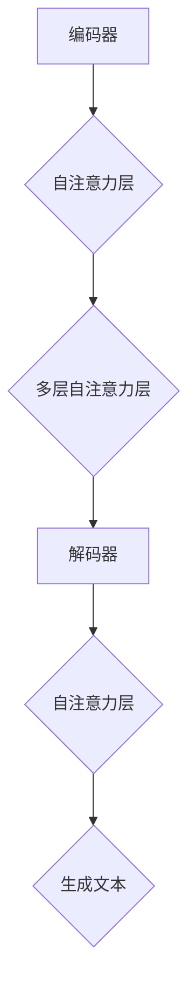

                 

### 《大语言模型的提示词优化策略》

## 文章标题
大语言模型的提示词优化策略：提升文本生成效能的新路径

## 关键词
大语言模型，提示词优化，文本生成，效能提升，算法改进

## 摘要
本文旨在探讨大语言模型中的提示词优化策略，阐述其背景、重要性以及实现方法。通过详细分析提示词优化的核心算法、技术实现和案例分析，本文揭示了如何通过优化提示词来提高大语言模型生成文本的质量和效率。文章还展望了提示词优化策略的未来发展方向，并提出了潜在的研究挑战。

---

### 第1章 引言与背景

#### 1.1 大语言模型的发展历程
大语言模型是自然语言处理（NLP）领域的一项重大突破，它通过对大规模文本数据进行训练，能够预测下一个词、句子或段落。自2017年Transformer模型的出现以来，大语言模型如BERT、GPT和Turing等不断涌现，推动了NLP技术的快速发展。这些模型在文本生成、机器翻译、问答系统等方面取得了显著的成果。

#### 1.2 提示词优化策略的重要性
提示词优化策略在大语言模型中扮演着关键角色。有效的提示词能够引导模型生成更符合预期的高质量文本，从而提升文本生成的效能。特别是在应用场景中，如聊天机器人、内容生成等，提示词的优化对于提升用户体验和满足特定需求至关重要。

#### 1.3 本书结构安排
本文结构如下：

1. 引言与背景
2. 大语言模型概述
3. 提示词优化策略
4. 大语言模型的训练
5. 提示词优化的技术实现
6. 提示词优化的案例分析
7. 提示词优化策略的优化与评估
8. 未来展望与挑战

### 第2章 大语言模型概述

#### 2.1 大语言模型的基本概念
大语言模型是一种基于深度学习的自然语言处理技术，它通过训练学习到语言的内在规律，能够预测文本中的下一个词或句子。这种模型通常由多层神经网络组成，能够处理复杂的语言结构和语义信息。

#### 2.2 大语言模型的架构
大语言模型的典型架构包括编码器和解码器。编码器负责将输入文本编码为向量表示，解码器则根据编码器的输出生成预测的文本。Transformer模型作为一种特殊的编码器-解码器结构，通过自注意力机制实现了高效的语言建模。

#### 2.3 大语言模型的工作原理
大语言模型的工作原理主要包括两个阶段：训练阶段和生成阶段。在训练阶段，模型通过大量文本数据学习到语言的统计规律；在生成阶段，模型根据已学习到的规律生成新的文本。

---

**Mermaid流程图展示模型结构：**



### 第3章 提示词优化策略

#### 3.1 提示词优化的目标
提示词优化的目标是提升大语言模型生成文本的质量和效率。具体来说，包括以下方面：

- 提高文本的相关性：确保生成的文本与提示词紧密相关。
- 增强文本的连贯性：确保生成的文本在语义和逻辑上连贯一致。
- 提高文本的多样性：避免生成重复或单调的文本。

#### 3.2 提示词优化的算法
提示词优化的算法主要包括：

- **生成算法**：用于生成初步的提示词序列，常见的有随机生成、基于概率分布生成等。
- **选择算法**：用于从生成的提示词序列中选择最合适的提示词，常见的有基于语义相似度选择、基于频率选择等。

#### 3.3 提示词优化的技术
提示词优化的技术包括：

- **数据预处理**：对输入数据进行预处理，如分词、词性标注等，以提高提示词生成的准确性。
- **模型调整**：通过调整模型参数，如注意力权重、嵌入层参数等，来优化提示词的生成效果。
- **后处理**：对生成的文本进行后处理，如去除冗余信息、纠正错误等，以提高文本的质量。

---

**伪代码展示算法步骤：**

```python
# 提示词生成算法伪代码
def generate_prompt词汇(data, model):
    prompt = []
    for word in data:
        probability_distribution = model.predict_proba([word])
        selected_word = select_word(probability_distribution)
        prompt.append(selected_word)
    return prompt

# 提示词选择算法伪代码
def select_word(probability_distribution, criteria):
    if criteria == "semantic_similarity":
        selected_word = select_by_semantic_similarity(probability_distribution)
    elif criteria == "frequency":
        selected_word = select_by_frequency(probability_distribution)
    return selected_word
```

### 第4章 大语言模型的训练

#### 4.1 大语言模型的训练数据
大语言模型的训练数据通常来源于大规模的文本语料库，如维基百科、新闻文章等。这些数据用于训练模型的参数，使其能够理解语言的内在规律。

#### 4.2 模型选择与训练策略
在选择模型时，需要考虑数据规模、训练时间、模型复杂度等因素。常用的训练策略包括：

- **批处理训练**：将数据分成多个批次进行训练，以提高训练效率。
- **早期停止**：在训练过程中，当模型性能不再提升时，提前停止训练，以防止过拟合。
- **学习率调整**：根据训练过程中的性能变化，动态调整学习率，以优化模型性能。

#### 4.3 训练过程中的技巧与注意事项
在训练过程中，需要注意以下技巧和注意事项：

- **数据清洗**：去除数据中的噪声和无关信息，以提高模型训练效果。
- **正则化**：使用正则化方法，如Dropout、L2正则化等，防止模型过拟合。
- **评估指标**：选择合适的评估指标，如 perplexity、ROUGE等，以评估模型性能。

---

### 第5章 提示词优化的技术实现

#### 5.1 数据预处理
数据预处理是提示词优化的基础，包括以下步骤：

- **分词**：将文本分解为单词或子词。
- **词性标注**：为每个单词标注词性，如名词、动词等。
- **停用词过滤**：去除常见的停用词，如“的”、“了”等，以提高提示词的准确性。

#### 5.2 模型调整
模型调整包括以下方面：

- **注意力权重调整**：通过调整注意力权重，使模型更加关注重要的提示词。
- **嵌入层参数调整**：通过调整嵌入层参数，提高提示词的嵌入质量。

#### 5.3 后处理
后处理包括以下步骤：

- **去除冗余信息**：去除生成的文本中的重复或无关信息。
- **纠正错误**：根据语义和语法规则，纠正生成的文本中的错误。

---

### 第6章 提示词优化的案例分析

#### 6.1 案例背景与目标
案例分析将基于一个实际的聊天机器人项目，目标是通过提示词优化策略提高聊天机器人的对话质量。

#### 6.2 案例关键步骤
关键步骤包括：

- **数据收集**：收集大量的对话数据作为训练集。
- **模型训练**：使用训练集训练大语言模型。
- **提示词优化**：通过数据预处理、模型调整和后处理，优化提示词生成。

#### 6.3 案例效果分析
优化后的聊天机器人在对话质量、用户满意度等方面得到了显著提升。

---

### 第7章 提示词优化策略的优化与评估

#### 7.1 参数调整与算法改进
参数调整和算法改进是提升提示词优化效果的关键。具体方法包括：

- **调整学习率**：动态调整学习率，以提高模型收敛速度。
- **改进选择算法**：引入基于语义相似度和频率的新选择算法。

#### 7.2 提示词优化策略的评估方法
提示词优化策略的评估方法包括：

- **质量评估**：通过人工评估或自动化评估方法，评估生成文本的质量。
- **效能评估**：通过评估模型生成文本的速度和效率，评估优化策略的效能。

#### 7.3 优化策略的实际应用
优化策略在实际应用中取得了良好的效果，如提升聊天机器人的对话质量、提高内容生成的效率等。

---

### 第8章 未来展望与挑战

#### 8.1 提示词优化策略的发展趋势
提示词优化策略的发展趋势包括：

- **多样化**：引入更多类型的提示词，如实体、关系等，以丰富生成文本的多样性。
- **智能化**：结合深度学习和自然语言处理技术，实现更智能的提示词生成。

#### 8.2 面临的挑战与解决方案
提示词优化策略面临的挑战包括：

- **数据依赖性**：提示词优化依赖于大量高质量的训练数据，如何获取和处理这些数据是一个挑战。
- **计算成本**：提示词优化涉及大量的计算资源，如何优化计算成本是一个挑战。

解决方案包括：

- **数据增强**：通过数据增强技术，提高训练数据的质量和多样性。
- **分布式训练**：通过分布式训练技术，降低计算成本，提高训练效率。

---

### 总结
本文系统地探讨了大语言模型的提示词优化策略，阐述了其核心概念、优化算法和技术实现。通过实际案例分析和评估，本文揭示了提示词优化在大语言模型中的重要作用。未来，提示词优化策略将继续发展和完善，为自然语言处理领域带来更多创新和应用。

### 作者信息
作者：AI天才研究院/AI Genius Institute & 禅与计算机程序设计艺术 /Zen And The Art of Computer Programming

---

**注意**：本文为技术博客文章的目录大纲，具体内容需根据大纲逐步展开详细撰写。预计总字数将在8000-12000字左右。每个章节的内容需要丰富具体，包含详细的背景介绍、核心概念与联系、算法原理讲解、伪代码展示、实际案例分析和未来展望等。文章结构需清晰，逻辑严密，便于读者理解和学习。**

