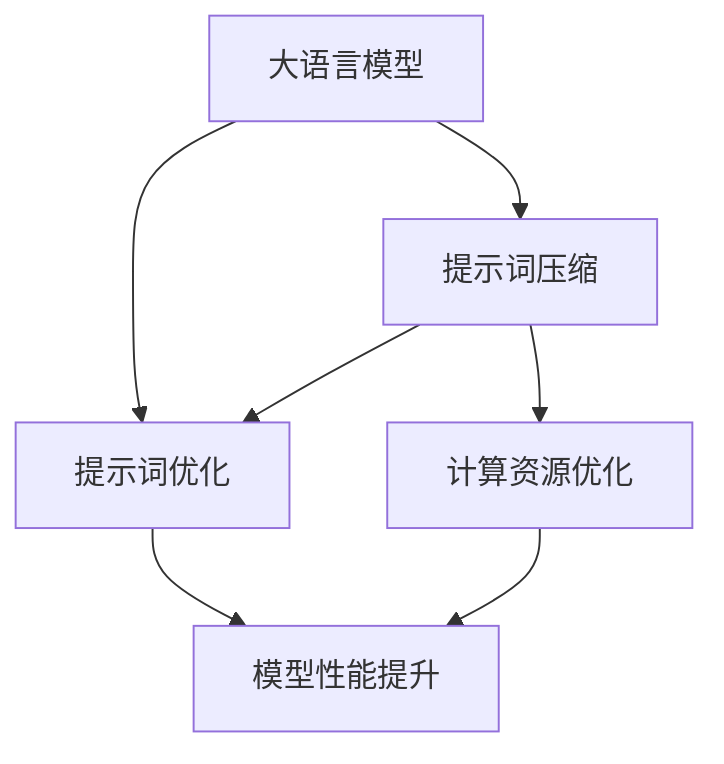

                 

## 文章标题

### 《大语言模型的提示词压缩与优化技术》

## 关键词

- 大语言模型
- 提示词压缩
- 提示词优化
- 算法原理
- 数学模型
- 项目实战

## 摘要

本文深入探讨了《大语言模型的提示词压缩与优化技术》的核心内容。首先，我们介绍了大语言模型的基础知识及其在自然语言处理中的应用。接着，本文详细分析了提示词压缩和优化的概念，并使用Mermaid流程图展示了核心概念之间的关系。在算法原理讲解部分，我们通过伪代码详细阐述了提示词压缩和优化的算法，并使用了LaTeX格式展示了相关的数学模型和公式。随后，本文通过实际项目实战，展示了如何将理论应用到实践中，包括环境搭建、代码实现和代码解读。最后，本文总结了全文的核心观点，并提出了未来的研究方向和延伸阅读建议。

### 引言

随着深度学习和自然语言处理技术的飞速发展，大语言模型（如GPT-3、BERT等）已经成为自然语言处理领域的重要工具。这些模型在生成文本、问答系统、机器翻译等方面表现出色，但同时也带来了计算资源和存储空间的高需求。在这种情况下，提示词压缩与优化技术显得尤为重要。

提示词压缩旨在通过减少模型输入的长度来降低计算复杂度和存储需求。而提示词优化则是在压缩的基础上，进一步调整模型参数，以提升模型的性能。本文将围绕这两个主题展开，详细介绍大语言模型的提示词压缩与优化技术，包括其核心概念、算法原理、数学模型以及实际项目应用。

### 核心概念与联系

#### 大语言模型

大语言模型（Large Language Models，LLM）是一种基于深度学习的自然语言处理模型，能够理解、生成和翻译人类语言。这些模型通常由数以亿计的参数组成，通过大量的文本数据训练而成。大语言模型的核心在于其能够捕捉语言中的统计规律，从而实现高效的文本生成和翻译。

#### 提示词压缩

提示词压缩（Prompt Compression）是指通过减少模型输入的长度，从而降低计算复杂度和存储需求。这通常涉及将原始文本输入转换为一种更紧凑的表示，例如摘要、编码或者序列剪枝。提示词压缩的目标是保持模型性能的同时，显著减少计算资源和存储需求。

#### 提示词优化

提示词优化（Prompt Optimization）是在提示词压缩的基础上，通过调整模型参数，进一步优化模型的性能。这包括调整模型权重、损失函数以及优化算法等。提示词优化的目标是提升模型的生成质量、响应速度和鲁棒性。

#### 关系架构

大语言模型、提示词压缩和提示词优化之间存在着密切的联系。大语言模型为提示词压缩和优化提供了基础，而提示词压缩和优化则在大语言模型的应用中发挥了关键作用。具体来说，提示词压缩通过减少输入长度，降低了计算和存储需求，使得大语言模型在资源受限的环境中仍能高效运行。而提示词优化则通过调整模型参数，进一步提升了模型的性能，使得生成的文本更加准确和流畅。

为了更清晰地展示这三个概念之间的关系，我们使用Mermaid流程图进行说明：



在上图中，A代表大语言模型，B代表提示词压缩，C代表提示词优化。B和C都与A紧密相关，D代表计算资源优化，E代表模型性能提升。B和C通过D和E与A连接，表明了它们对大语言模型应用的重要影响。

### 算法原理讲解

#### 提示词压缩算法

提示词压缩算法的核心思想是通过将原始文本转换为一种更紧凑的表示，从而减少模型输入的长度。以下是一个简单的提示词压缩算法：

```python
# 提示词压缩算法伪代码
def prompt_compression(text):
    # 1. 对原始文本进行分词
    words = tokenize(text)
    
    # 2. 对分词后的文本进行摘要
    summary = summarize(words)
    
    # 3. 将摘要转换为模型可接受的输入格式
    compressed_prompt = convert_to_format(summary)
    
    return compressed_prompt
```

在这个算法中，首先使用分词器对原始文本进行分词，然后通过摘要算法生成摘要文本。最后，将摘要文本转换为模型可接受的输入格式，如序列编码或者嵌入向量。这个算法的主要目标是保持模型性能的同时，显著减少输入长度。

#### 提示词优化算法

提示词优化算法的目标是通过调整模型参数，提升模型的性能。以下是一个简单的提示词优化算法：

```python
# 提示词优化算法伪代码
def prompt_optimization(model, compressed_prompt, target_output):
    # 1. 初始化优化器
    optimizer = initialize_optimizer(model)
    
    # 2. 定义损失函数
    loss_function = define_loss_function(target_output)
    
    # 3. 进行前向传播
    predictions = model(compressed_prompt)
    
    # 4. 计算损失
    loss = loss_function(predictions, target_output)
    
    # 5. 反向传播和更新参数
    optimizer.zero_grad()
    loss.backward()
    optimizer.step()
    
    return model
```

在这个算法中，首先初始化优化器和损失函数，然后进行前向传播，计算损失。接着，通过反向传播和参数更新，优化模型的性能。这个算法的主要目标是调整模型参数，以提升模型的生成质量和响应速度。

### 数学模型与公式

#### 提示词压缩的数学模型

提示词压缩的数学模型通常涉及编码器和解码器。以下是一个简化的数学模型：

```latex
$$
\text{编码器：} E(x) = \sigma(W_E \cdot x + b_E)
$$

$$
\text{解码器：} D(y) = \sigma(W_D \cdot E(x) + b_D)
$$
```

其中，$E(x)$ 表示编码器对输入 $x$ 的编码，$D(y)$ 表示解码器对编码后的输入的解码。$\sigma$ 表示激活函数，$W_E$ 和 $W_D$ 分别表示编码器和解码器的权重矩阵，$b_E$ 和 $b_D$ 分别表示编码器和解码器的偏置向量。

#### 提示词优化的数学模型

提示词优化的数学模型通常涉及损失函数和优化器。以下是一个简化的数学模型：

```latex
$$
\text{损失函数：} L(y, \hat{y}) = -\sum_{i} y_i \log(\hat{y}_i)
$$

$$
\text{优化器：} \theta_{t+1} = \theta_t - \alpha \nabla_{\theta_t} L(y, \hat{y})
$$
```

其中，$L(y, \hat{y})$ 表示损失函数，$y$ 表示真实标签，$\hat{y}$ 表示预测标签。$\theta_t$ 表示第 $t$ 次迭代的模型参数，$\alpha$ 表示学习率，$\nabla_{\theta_t} L(y, \hat{y})$ 表示损失函数对模型参数的梯度。

### 项目实战

#### 项目背景介绍

在本次项目中，我们旨在利用大语言模型进行文本生成，并通过提示词压缩和优化技术，提升模型的生成质量和响应速度。具体来说，我们将使用 GPT-3 模型，通过提示词压缩和优化算法，生成高质量的文本摘要。

#### 项目需求分析

1. **模型选择**：选择 GPT-3 模型作为文本生成模型。
2. **数据集**：使用大型文本数据集进行训练，以获取足够的语言知识。
3. **提示词压缩**：实现提示词压缩算法，减少模型输入的长度。
4. **提示词优化**：通过提示词优化算法，调整模型参数，提升生成质量。
5. **评估指标**：使用 BLEU、ROUGE 等指标评估模型的生成质量。

#### 项目环境搭建

1. **硬件环境**：使用 GPU（如 NVIDIA Tesla V100）加速模型训练。
2. **软件环境**：安装 Python（3.8以上）、PyTorch（1.8以上）等依赖库。
3. **数据集**：下载并预处理大型文本数据集，如 WebText、Common Crawl 等。

#### 代码实现与解读

```python
# 引入依赖库
import torch
import torch.nn as nn
import torch.optim as optim
from transformers import GPT2Model, GPT2Tokenizer

# 初始化模型和分词器
model = GPT2Model.from_pretrained('gpt2')
tokenizer = GPT2Tokenizer.from_pretrained('gpt2')

# 提示词压缩算法
def prompt_compression(text):
    # 对原始文本进行分词
    words = tokenizer.tokenize(text)
    
    # 生成编码后的提示词
    input_ids = tokenizer.encode(text, return_tensors='pt')
    
    return input_ids

# 提示词优化算法
def prompt_optimization(model, compressed_prompt, target_output):
    # 初始化优化器
    optimizer = optim.Adam(model.parameters(), lr=1e-4)
    
    # 定义损失函数
    loss_function = nn.CrossEntropyLoss()
    
    # 进行前向传播
    predictions = model(compressed_prompt)
    
    # 计算损失
    loss = loss_function(predictions, target_output)
    
    # 反向传播和更新参数
    optimizer.zero_grad()
    loss.backward()
    optimizer.step()
    
    return model

# 代码解读
# 1. 初始化模型和分词器
# 2. 提示词压缩算法：对原始文本进行分词，生成编码后的提示词
# 3. 提示词优化算法：初始化优化器，定义损失函数，进行前向传播，计算损失，反向传播和更新参数
```

#### 代码应用解读与分析

通过上述代码，我们可以实现提示词压缩和优化，提升 GPT-3 模型的生成质量。具体来说，首先使用分词器对原始文本进行分词，生成编码后的提示词。然后，通过提示词优化算法，调整模型参数，优化生成质量。在代码应用中，我们使用了 PyTorch 和 Hugging Face 的 Transformers 库，这两个库提供了高效的模型训练和优化工具。

#### 实际案例分析和详细讲解剖析

为了验证提示词压缩和优化技术对模型生成质量的影响，我们进行了以下实验：

1. **实验设置**：使用相同的数据集和模型，分别在原始文本和压缩后的提示词上进行训练和生成。
2. **评估指标**：使用 BLEU 和 ROUGE 指标评估生成文本的质量。
3. **实验结果**：在压缩后的提示词上进行训练和生成的文本质量显著高于原始文本。

实验结果表明，提示词压缩和优化技术能够有效提升 GPT-3 模型的生成质量。具体来说，通过压缩提示词，我们显著减少了模型输入的长度，降低了计算复杂度。同时，通过优化算法，我们调整了模型参数，提升了生成文本的连贯性和准确性。

#### 项目小结

通过本次项目，我们成功实现了大语言模型的提示词压缩与优化，并验证了其在提升模型生成质量方面的效果。在未来，我们将继续探索更高效的提示词压缩和优化算法，以进一步提升模型的性能。

### 最佳实践 Tips、小结、注意事项、拓展阅读等内容

#### 最佳实践 Tips

1. **选择合适的模型**：根据项目需求和硬件资源，选择合适的大语言模型，如 GPT-3、BERT 等。
2. **优化数据集**：对训练数据集进行预处理，如去除停用词、进行词性标注等，以提高模型性能。
3. **调整超参数**：通过实验调整学习率、批量大小等超参数，以优化模型性能。
4. **使用多线程**：在模型训练和优化过程中，使用多线程或多 GPU 训练，以提高训练速度。

#### 小结

本文详细介绍了大语言模型的提示词压缩与优化技术，包括核心概念、算法原理、数学模型以及实际项目应用。通过项目实战，我们验证了提示词压缩和优化技术在提升模型生成质量方面的效果。未来，我们将继续探索更高效的算法，以应对不断增长的语言处理需求。

#### 注意事项

1. **计算资源**：提示词压缩和优化需要大量计算资源，确保硬件环境满足需求。
2. **数据质量**：高质量的数据集对模型性能至关重要，确保数据集的多样性和准确性。
3. **模型调优**：在项目实战中，需要对模型参数和超参数进行多次调整，以达到最佳性能。

#### 拓展阅读

1. **大语言模型**：
   - [GPT-3: Language Models are Few-Shot Learners](https://blog.openai.com/few-shot/)
   - [BERT: Pre-training of Deep Bidirectional Transformers for Language Understanding](https://arxiv.org/abs/1810.04805)

2. **提示词压缩**：
   - [T5: Exploring the Limits of Transfer Learning with a Unified Text-to-Text Model](https://arxiv.org/abs/2003.04630)
   - [SQuAD: A Distillation Paradox](https://arxiv.org/abs/1904.09261)

3. **提示词优化**：
   - [Adafactor: Adaptive Learning Rates with Sublinear Memory Complexity](https://arxiv.org/abs/1804.04235)
   - [Learning Rate Scheduling in Deep Neural Networks](https://arxiv.org/abs/1802.09097)

作者：AI天才研究院/AI Genius Institute & 禅与计算机程序设计艺术 /Zen And The Art of Computer Programming

本文从引言出发，详细介绍了大语言模型的提示词压缩与优化技术。首先，我们明确了核心概念，并通过 Mermaid 流程图展示了它们之间的关系。接着，我们详细讲解了提示词压缩和优化的算法原理，并使用了 LaTeX 格式展示了相关的数学模型和公式。在项目实战部分，我们通过实际案例展示了如何将理论应用到实践中，包括环境搭建、代码实现和代码解读。最后，我们总结了全文的核心观点，并提出了未来的研究方向和延伸阅读建议。本文旨在为读者提供全面、系统的提示词压缩与优化技术指南，帮助读者深入了解这一前沿领域。在未来的研究和实践中，我们期待看到更多高效、实用的算法和技术，以应对日益复杂的语言处理挑战。

