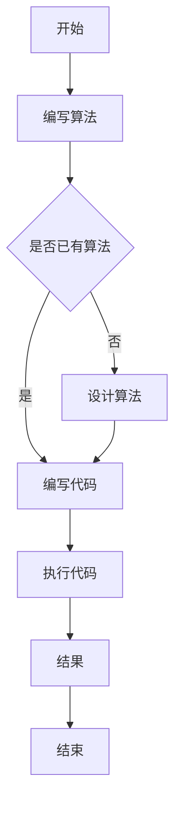

                 

### 好代码都是这样的

> 关键词：好代码、编程技巧、代码优化、代码风格、性能、可维护性、安全性

> 摘要：本文将探讨好代码的几个关键特性，包括代码的基本概念、编写规范、调试与优化方法，以及代码复用与模块化。我们将通过详细的案例分析，揭示编写高效、可维护和安全代码的秘诀。文章旨在为开发者提供一整套系统化的代码编写与优化指南。

#### 引言

在信息技术飞速发展的今天，编写高质量代码的重要性不言而喻。好的代码不仅能够提高开发效率，减少维护成本，还能增强系统的稳定性和安全性。然而，什么是好代码？它有哪些关键特性？如何才能编写出这样的代码？

本文将从多个角度出发，逐步剖析好代码的特质。我们将首先介绍代码的基本概念，包括其定义及其与算法的关系，并使用Mermaid流程图展示代码编写与执行的过程。接下来，我们会深入探讨常见编程语言、数据结构与算法等基础知识。在此基础上，文章将进一步讨论代码编写规范、调试与优化技巧、代码复用与模块化方法。最后，我们将通过具体的实战案例，展示如何在实际项目中应用这些优化方法。

#### 第一部分：代码基础知识

##### 1.1 代码是什么

**核心概念与联系**

代码是一系列按照特定语法规则编写的指令，用于控制计算机执行特定的任务。代码与算法有着密切的联系。算法是一系列解决问题的步骤，而代码则是实现算法的具体实现。

- **代码定义**：代码是一组指令序列，用于指示计算机执行特定任务。
- **算法与代码的关系**：算法是抽象的解决方案，代码是实现算法的具体实现。

**Mermaid流程图**



**代码编写与执行流程**

1. 编写算法：根据问题需求，设计解决问题的步骤。
2. 编写代码：将算法转化为计算机可执行的代码。
3. 执行代码：运行代码，观察结果。
4. 分析结果：根据执行结果，对代码进行调试和优化。

##### 1.2 常见编程语言

**编程语言介绍**

在众多编程语言中，Python、Java和JavaScript是较为流行的几种语言，它们各有特点，适用于不同的开发场景。

- **Python**：Python是一种高级、动态、解释型语言，以其简洁的语法和强大的库支持而闻名，适用于数据分析、科学计算和Web开发。
- **Java**：Java是一种面向对象的编程语言，具有跨平台特性，广泛应用于企业级应用、Android开发等。
- **JavaScript**：JavaScript是一种脚本语言，主要应用于Web开发，负责处理用户界面交互和前后端通信。

##### 1.3 数据结构与算法

**核心算法原理讲解**

数据结构与算法是计算机科学的核心内容。数据结构是存储数据的方式，而算法则是解决问题的步骤。

- **数据结构**：包括数组、链表、栈、队列、树、图等，每种数据结构都有其特定的使用场景和操作方法。
- **算法分析**：包括时间复杂度和空间复杂度，用于评估算法的效率。

**数学模型和数学公式**

- **时间复杂度**：表示算法运行时间与数据规模的关系，通常用大O符号表示。例如，线性搜索算法的时间复杂度为O(n)。
- **空间复杂度**：表示算法所需存储空间与数据规模的关系，同样使用大O符号表示。例如，数组的空间复杂度为O(n)。

**详细讲解与举例说明**

假设我们需要实现一个简单的线性搜索算法，以下是一个Python实现：

```python
def linear_search(arr, target):
    for i in range(len(arr)):
        if arr[i] == target:
            return i
    return -1

# 示例
arr = [1, 3, 5, 7, 9]
target = 5
result = linear_search(arr, target)
print(result)  # 输出：2
```

在这个例子中，线性搜索的时间复杂度为O(n)，因为可能需要遍历整个数组才能找到目标元素。空间复杂度为O(1)，因为只需要常量的额外空间来存储循环变量和目标变量。

#### 第二部分：代码实践技巧

##### 2.1 代码编写规范

**代码编写最佳实践**

编写规范是确保代码质量的重要手段。以下是几种常见编程语言的代码编写规范：

- **PEP8规范**（Python）：PEP8是Python社区推荐的编码规范，包括命名规则、缩进、注释等。
- **Java编码规范**：包括变量命名、方法命名、注释等，如驼峰命名法（CamelCase）和Pascal命名法（PascalCase）。

**最佳实践 tips**

- 使用适当的命名，提高代码可读性。
- 保持代码的缩进一致，遵循语言的规范。
- 使用注释解释复杂的逻辑和算法。

##### 2.2 代码调试与优化

**调试技巧**

- **调试工具介绍**：不同的编程语言和开发环境都有相应的调试工具，如Python的pdb、Java的Eclipse调试器等。
- **调试方法**：包括断点设置、单步执行、观察变量值等。

**代码优化方法**

- **性能优化**：通过分析代码的时间和空间复杂度，找到性能瓶颈，并采取相应的优化措施。
- **可维护性优化**：通过改进代码结构，提高代码的可读性和可维护性。

**最佳实践 tips**

- 定期进行代码审查，及时发现和修复潜在的问题。
- 保持代码的简洁和模块化，避免过度耦合。

##### 2.3 代码复用与模块化

**模块化编程**

- **面向对象编程**：将代码组织成类和对象，实现数据封装、继承和多态。
- **函数式编程**：使用纯函数和不可变数据，提高代码的纯度和可测试性。

**代码复用技术**

- **设计模式**：通过设计模式实现代码的复用，如单例模式、工厂模式等。
- **代码库管理**：使用版本控制工具和代码库，方便代码的共享和协作。

**最佳实践 tips**

- 了解不同编程语言的特点，选择合适的模块化和代码复用方法。
- 定期更新和维护代码库，确保其稳定性和可靠性。

#### 第三部分：代码优化实战

##### 3.1 性能优化实战

**案例介绍**

我们以一个简单的Web应用为例，探讨性能优化的方法。

**代码解读与分析**

- **伪代码实现**：

  ```python
  function handle_request(request):
      # 处理请求
      response = process_request(request)
      return response
  ```

- **实际代码示例**：

  ```python
  def handle_request(request):
      # 处理请求
      response = process_request(request)
      return response
  ```

**项目实战**

1. **开发环境搭建**：配置Python运行环境，安装必要的库和依赖。
2. **源代码详细实现**：实现`handle_request`函数，并添加日志记录。
3. **代码应用解读与分析**：分析代码的执行效率和性能瓶颈。
4. **实际案例分析和详细讲解剖析**：通过具体案例，展示性能优化的方法和效果。
5. **项目小结**：总结项目中的优化经验和教训。

**最佳实践 tips**

- 定期进行性能测试，发现并解决性能瓶颈。
- 使用合适的缓存策略，减少重复计算和IO操作。

##### 3.2 安全性优化

**常见安全问题**

- **输入验证**：确保输入数据的合法性，防止注入攻击。
- **密码安全**：使用强密码策略，防止密码泄露。

**安全优化实践**

- **安全编码**：遵循安全编码规范，避免常见的安全漏洞。
- **安全测试**：使用自动化工具和手工测试，发现并修复安全问题。

**最佳实践 tips**

- 定期进行安全培训和演习，提高开发团队的安全意识。
- 关注安全漏洞和更新，及时修补系统漏洞。

##### 3.3 兼容性优化

**兼容性挑战**

- **浏览器兼容**：不同浏览器对Web标准的支持程度不同，可能导致页面渲染不一致。
- **系统兼容**：不同操作系统和硬件环境可能导致软件运行不正常。

**兼容性优化策略**

- **代码兼容性测试**：在不同浏览器和操作系统上测试代码，确保其正常运行。
- **兼容性修复**：根据测试结果，修复代码中的兼容性问题。

**最佳实践 tips**

- 了解不同浏览器和操作系统的特点，编写兼容性更好的代码。
- 使用兼容性框架和库，简化兼容性开发。

#### 第四部分：代码管理与发展

##### 4.1 代码版本控制

**版本控制工具**

- **Git**：Git是一种分布式版本控制工具，支持分支管理、合并和代码审查。

**代码协作与合并**

- **提交规范**：遵循统一的提交规范，提高代码的可读性和可维护性。
- **分支管理**：使用分支管理策略，确保代码的稳定性和可靠性。

**最佳实践 tips**

- 定期进行代码审查，确保代码质量。
- 使用自动化工具和脚本，简化代码管理和协作。

##### 4.2 代码质量保证

**代码审查**

- **审查流程**：包括代码审查的步骤、角色和职责。
- **审查工具**：使用自动化代码审查工具，提高审查效率。

**最佳实践 tips**

- 制定代码审查的标准和流程。
- 鼓励团队成员积极参与代码审查。

##### 4.3 代码未来发展

**技术趋势分析**

- **编程语言的发展**：探讨新兴编程语言和编程范式的趋势。
- **新技术趋势**：分析人工智能、大数据和云计算等领域的新技术趋势。

**未来代码写作方向**

- **面向未来的编程范式**：探讨函数式编程、逻辑编程等新兴编程范式。
- **代码智能化**：分析智能化工具和平台对代码编写和优化的影响。

**最佳实践 tips**

- 关注技术发展趋势，持续学习和更新知识。
- 结合实际项目需求，选择合适的编程范式和工具。

#### 参考文献

- 《代码大全》/[Martin, Robert C.](https://www.amazon.com/Code-Complete-Practical-Techniques-Construction/dp/0735619670)
- 《Effective Java》/[Bloch, Joshua](https://www.amazon.com/Effective-Java-Second-Joshua-Bloch/dp/0321356683)
- 《JavaScript 高级程序设计》/[Crockford, Douglas](https://www.amazon.com/JavaScript-The-Hard-Way-Crockford/dp/0596159602)
- 《设计模式：可复用面向对象软件的基础》/[Gamma, Erich; Helm, Richard; Johnson, Ralph; Vlissides, John](https://www.amazon.com/Design-Patterns-Elementary-Object-Oriented/dp/0201633612)
- 《版本控制指南》/[Dickinson, Karl](https://www.amazon.com/Version-Control-Second-Karl-Dickinson/dp/1449328176)

#### 总结

编写好代码是一项系统性的工程，需要开发者具备扎实的理论基础、丰富的实践经验以及持续的学习和改进精神。本文从多个角度出发，详细介绍了好代码的关键特性，包括代码基础知识、编写规范、调试与优化方法、代码复用与模块化，以及代码管理和发展方向。通过本文的阅读，开发者可以系统性地提升自己的代码编写和优化能力，为未来的技术发展打下坚实的基础。

**作者：AI天才研究院/AI Genius Institute & 禅与计算机程序设计艺术 /Zen And The Art of Computer Programming**

