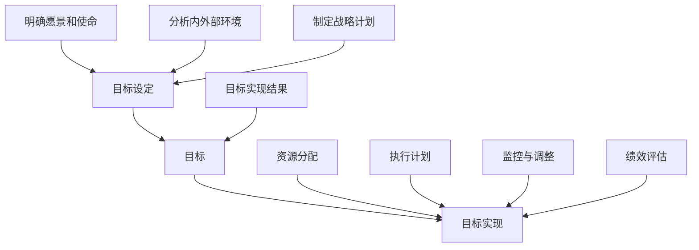

                 

### 引言

在当今快节奏和竞争激烈的工作环境中，团队目标的重要性不言而喻。团队目标不仅为团队成员指明了方向，还能够提升整体工作效率和成果，从而在市场竞争中占据有利地位。因此，如何制定和实施有效的团队目标是每个组织和企业迫切需要解决的问题。

首先，让我们来定义一下什么是团队目标。团队目标是指一个团队在一定时间内希望达到的具体成果或状态，它通常是由组织战略目标分解而来的具体行动计划。有效的团队目标能够帮助团队集中精力，明确优先级，并激励成员为实现共同目标而努力。

制定和实施团队目标的过程并不简单，它需要科学的方法和严谨的执行。首先，团队需要明确自身的使命和愿景，并在此基础上制定具体的战略目标。接下来，团队需要对市场和竞争环境进行深入分析，确保目标具有可行性和实际意义。在目标确定后，团队还需要制定详细的执行计划，明确每个人的职责和任务，确保目标得以顺利实施。

然而，现实中很多团队在制定和实施目标时往往遇到各种挑战。例如，目标不够具体和可衡量，导致团队成员对目标的理解和执行不一致；或者在执行过程中缺乏有效的监督和反馈机制，使得目标实现的效果不尽如人意。这些问题的存在使得团队目标往往难以达成，甚至对团队的士气产生负面影响。

本文将围绕“如何制定和实施团队目标”这一核心主题，通过逻辑清晰、结构紧凑的篇章，逐步引导读者理解这一复杂过程。我们将从基本概念入手，详细探讨团队目标的类型、核心概念之间的关系，以及如何通过SMART原则来制定有效的目标。随后，我们将深入讨论实施团队目标的步骤，包括策略开发、目标设置技术、实施与执行策略等。同时，我们将分享如何通过团队建设、协作和绩效评估来确保目标的实现。最后，通过实际案例分析和最佳实践总结，帮助读者更好地掌握团队目标制定和实施的要领。

通过本文的学习，读者将能够系统地掌握团队目标制定和实施的方法论，提升团队的整体效能，从而在竞争激烈的市场环境中脱颖而出。让我们一起踏上这段探索之旅，开启高效团队目标管理的征程。

### 关键词

本文关键词包括：团队目标、目标设置、战略规划、SMART原则、团队协作、绩效评估、团队建设、目标实施。这些关键词将贯穿全文，帮助读者快速理解和掌握团队目标制定与实施的核心内容。

### 摘要

本文旨在详细探讨如何制定和实施团队目标，以提升团队的整体效能和达成组织战略目标。文章首先介绍了团队目标的定义和重要性，然后从基本概念、目标设置技术、实施步骤、团队协作与绩效评估等方面进行了深入分析。通过实际案例分析和最佳实践总结，本文提供了系统化的方法和策略，帮助团队克服在目标制定和实施过程中遇到的各种挑战。读者将能够通过本文的学习，掌握制定和实施团队目标的全过程，从而提升团队的工作效率和成果。

### 基本概念

在深入探讨团队目标之前，我们首先需要明确几个关键概念，包括目标、目标设定和目标实现。

#### 目标

目标是一个团队或组织在一定时间内希望达成的一种具体结果或状态。目标可以是短期的，如一个月内完成一个项目，也可以是长期的，如五年内实现某一市场占有率目标。目标是团队行动的指引，能够帮助团队成员明确方向和努力目标。一个良好的目标应该是具体、可衡量、可实现、相关和时限性的（SMART原则），这样才能确保目标的可行性和有效性。

#### 目标设定

目标设定是制定团队目标的过程。它通常包括以下几个关键步骤：

1. **明确愿景和使命**：首先，团队需要明确组织的愿景和使命，这是制定目标的基础。愿景描述了团队长远的目标和期望状态，而使命则阐明了团队存在的目的和意义。

2. **分析内外部环境**：团队需要分析当前的市场环境、竞争态势、资源状况以及内部能力，以确定哪些目标是最具可行性的。

3. **制定战略计划**：基于愿景、使命和外部环境分析，团队需要制定具体的战略计划，明确短期和长期目标。

4. **目标分解**：将战略计划中的大目标分解为具体的、可操作的小目标，并分配到各个团队成员。

#### 目标实现

目标实现是指通过一系列具体的行动和措施，使设定的目标得以实现的过程。实现目标通常包括以下几个关键步骤：

1. **资源分配**：确保团队有足够的资源和人力来支持目标的实现。这包括资金、技术、设备以及人力等。

2. **执行计划**：制定详细的执行计划，明确每个阶段的具体任务和时间节点。

3. **监控与调整**：在执行过程中，团队需要持续监控目标的实现进度，并根据实际情况进行调整，确保目标按计划推进。

4. **绩效评估**：在目标实现完成后，对团队的绩效进行评估，总结经验教训，为未来目标的制定和实现提供参考。

#### 目标之间的关系

在团队中，目标、目标设定和目标实现是相互关联的。目标设定是目标实现的前提，而目标实现是目标设定的最终结果。目标不仅需要是具体和可衡量的，还应当与团队的愿景和使命相一致，确保在实现过程中不偏离方向。以下是目标、目标设定和目标实现之间关系的架构图：

通过这个架构图，我们可以清晰地看到目标、目标设定和目标实现之间的逻辑关系，从而更好地理解和执行这一过程。

#### 总结

在制定和实施团队目标的过程中，明确目标、设定目标和实现目标是三个不可或缺的环节。通过科学的目标设定方法和严谨的目标实现过程，团队可以更好地聚焦于共同目标，提升工作效率和成果。接下来的章节将进一步探讨如何通过SMART原则和具体技术来制定有效的团队目标，并详细讨论目标实施的过程和策略。

### SMART原则

SMART原则是制定有效团队目标的重要工具，它将目标具体化，确保每个目标都是可衡量、可实现的。SMART分别代表具体（Specific）、可衡量（Measurable）、可实现（Achievable）、相关（Relevant）和时限性（Time-bound）。以下是对每个要素的详细解释及其在实际操作中的应用。

#### 具体性（Specific）

具体性要求目标清晰明确，避免模糊和笼统。一个具体的目标应该回答以下五个问题：谁、什么、何时、何地、如何。例如，一个模糊的目标是“提高销售额”，而一个具体的目标则是“在未来三个月内，通过增加市场推广活动，将产品A的销售额提升至每月50万元”。

**示例**：
- **模糊**：“提升团队工作效率”。
- **具体**：“在未来两个月内，通过优化工作流程，将团队每周完成的项目数量从10个增加到15个”。

#### 可衡量性（Measurable）

可衡量性是指目标应当具备明确的衡量标准，以便在实现过程中可以跟踪和评估进度。衡量标准可以是一个具体的数字、百分比或者其他量化指标。例如，如果目标是“提高用户满意度”，那么衡量标准可以是“用户满意度评分从目前的4.5分提升到5分”。

**示例**：
- **不可衡量**：“提高客户满意度”。
- **可衡量**：“在未来三个月内，将客户满意度调查的评分从80分提升至90分”。

#### 可实现性（Achievable）

可实现性要求目标在当前资源和条件下是可实现的，避免设定过高或不切实际的目标。实现目标的过程中，需要考虑团队的技能、资源、时间等因素。例如，一个不切实际的目标是“在未来一个月内完成一个全新的软件项目”，而一个可实现的目标是“在未来三个月内，通过增加两名开发人员和优化项目流程，完成一个基础版本的软件项目”。

**示例**：
- **不可实现**：“在没有任何额外资源的情况下，一个月内完成一个复杂的软件项目”。
- **可实现**：“通过增加两名新员工和调整项目计划，在未来三个月内完成一个基础版本的软件项目”。

#### 相关性（Relevant）

相关性是指目标应当与团队的使命和愿景相一致，确保目标是真正重要的，并与团队的整体战略方向保持一致。相关性能够确保团队成员在实现目标的过程中不会偏离组织的核心目标。例如，如果团队的使命是“提供高质量的产品”，那么一个相关的目标可能是“在未来六个月内，通过改进产品质量，减少产品故障率”。

**示例**：
- **不相关**：“在下一个财年内，将公司市场份额提升至50%”。
- **相关**：“在未来六个月内，通过增加研发投入和改进产品功能，提升市场份额至30%”。

#### 时限性（Time-bound）

时限性要求目标应当有一个明确的时间框架，以便团队成员可以按计划推进，并确保目标在规定时间内完成。时限性有助于提高团队的紧迫感和责任感。例如，一个没有时限的目标是“提高客户满意度”，而一个有时间限制的目标是“在未来三个月内，提高客户满意度评分至90分”。

**示例**：
- **无时限**：“提高客户满意度”。
- **时限性**：“在未来三个月内，将客户满意度评分从目前的80分提升至90分”。

#### SMART原则的应用

在实际操作中，SMART原则可以指导团队如何制定和实现目标。以下是一个具体的示例，展示如何应用SMART原则来制定一个有效的团队目标：

**目标**：增加产品B的销售额。

**应用SMART原则**：

1. **具体**：“在未来三个月内，通过优化市场推广策略，将产品B的销售额提升至每月100万元”。

2. **可衡量**：“当前产品B每月销售额为80万元，目标是将销售额提升至100万元”。

3. **可实现**：“我们已拥有足够的市场推广资源，并且市场调研显示产品B有增长潜力”。

4. **相关**：“增加产品B的销售额与公司整体战略目标一致，有助于提升公司盈利能力”。

5. **时限性**：“目标设定为未来三个月内实现”。

通过这个示例，我们可以看到如何将一个模糊的目标转化为具体、可衡量、可实现、相关和时限性的目标。这种做法不仅有助于提高目标的执行力，还能增强团队成员的积极性和参与感。

总之，SMART原则是制定有效团队目标的基石，通过具体、可衡量、可实现、相关和时限性的目标设定，团队可以更好地聚焦于共同目标，提升工作效率和成果。在接下来的章节中，我们将继续探讨如何在具体实施过程中应用SMART原则，以及如何通过策略开发和实施计划来确保目标的有效实现。

### 战略规划与目标制定

在团队目标制定的过程中，战略规划是一个关键环节。一个成功的团队目标不仅需要明确和具体，还需要基于科学合理的战略规划，以确保其可行性和有效性。以下将详细探讨战略规划的步骤、市场分析、竞争评估和资源分配等内容。

#### 战略规划的基本步骤

1. **明确愿景和使命**：
   愿景和使命是战略规划的基础。愿景描述了团队或组织长期的目标和期望状态，而使命则阐明了团队存在的目的和意义。明确愿景和使命有助于团队在制定目标时保持一致性和方向感。

2. **市场分析**：
   市场分析是了解目标市场和潜在客户的过程。团队需要收集市场数据，分析市场趋势、竞争对手和客户需求，以确定目标市场及其特点。市场分析可以帮助团队发现机会和威胁，为制定战略目标提供依据。

3. **竞争评估**：
   在了解市场后，团队需要评估主要竞争对手的优劣势。这包括分析竞争对手的市场份额、产品、策略、资源配置等。通过竞争评估，团队可以找出自身在市场上的优势和劣势，并制定相应的战略目标。

4. **制定战略计划**：
   基于市场分析和竞争评估的结果，团队需要制定具体的战略计划。战略计划应明确团队的目标、策略、行动步骤和预期成果。战略计划的制定需要结合团队的资源和能力，确保目标具有可行性。

5. **资源分配**：
   在战略计划制定完成后，团队需要明确所需资源的分配。资源包括资金、人力、技术、设备等。合理的资源分配有助于确保战略目标的顺利实施。

#### 市场分析

市场分析是战略规划的核心步骤之一。以下是一些关键的市场分析方法和步骤：

1. **SWOT分析**：
   SWOT分析是一种常用的市场分析方法，包括对团队或组织的优势（Strengths）、劣势（Weaknesses）、机会（Opportunities）和威胁（Threats）进行评估。通过SWOT分析，团队可以全面了解自身和市场状况，为战略目标制定提供依据。

2. **五力模型**：
   五力模型是由迈克尔·波特提出的，用于分析市场竞争力的一种方法。五力模型包括供应商、买家、潜在竞争者、替代品和现有竞争者。通过分析这些力量，团队可以了解市场结构和竞争态势，制定相应的市场策略。

3. **市场趋势分析**：
   市场趋势分析是对市场动态和未来发展方向的评估。团队需要关注行业趋势、技术进步、消费者行为变化等因素，以预测市场变化并制定相应的战略目标。

4. **客户需求分析**：
   了解客户需求是市场分析的重要部分。通过问卷调查、用户访谈、市场调研等方式，团队可以收集客户反馈，了解客户需求和行为，从而制定更贴近市场需求的目标。

#### 竞争评估

竞争评估是了解竞争对手和自身在市场中的位置的重要步骤。以下是一些关键的竞争评估方法和步骤：

1. **竞争对手分析**：
   团队需要识别主要的竞争对手，并分析他们的市场份额、产品、策略、优势和劣势。通过竞争对手分析，团队可以了解自身在市场中的竞争地位，并制定相应的竞争策略。

2. **定位策略**：
   团队需要明确自身的市场定位，包括产品定位、目标客户群体、独特卖点等。通过市场定位，团队可以与竞争对手区分开来，形成自己的竞争优势。

3. **差异化策略**：
   差异化策略是指通过产品、服务、品牌等方面的差异化，使团队在市场中脱颖而出。团队需要分析竞争对手的差异点，并找到自身的差异化优势，以吸引更多客户。

#### 资源分配

在制定战略目标和计划后，资源分配是确保目标实现的关键步骤。以下是一些资源分配的方法：

1. **预算分配**：
   团队需要根据战略目标和计划，制定合理的预算分配方案。预算应覆盖项目启动、运营、推广等各个环节，确保目标实现的资金需求。

2. **人力分配**：
   团队需要根据目标和任务，合理分配人力资源。这包括确定团队成员的角色、职责和任务，并确保每个成员都有足够的支持和资源来完成工作任务。

3. **技术资源**：
   技术资源包括设备、软件、工具等。团队需要根据目标和任务需求，确定所需的技术资源，并确保技术资源的有效利用。

4. **时间管理**：
   时间管理是资源分配的重要方面。团队需要制定详细的时间计划，明确任务的时间节点和优先级，确保目标按计划推进。

#### 总结

战略规划与目标制定是团队目标管理的重要环节。通过明确愿景和使命、进行市场分析和竞争评估，以及合理分配资源，团队可以制定出具体、可衡量、可实现、相关和时限性的目标。接下来，我们将进一步探讨如何通过SMART原则和具体技术来制定有效的团队目标，并深入讨论目标实施的过程和策略。

### 目标设置的具体步骤

在了解战略规划和市场分析后，接下来我们将深入探讨如何通过具体步骤来制定团队目标。有效的目标设置不仅能够帮助团队聚焦关键任务，还能提高执行效率和成果。以下将详细描述目标设置的具体步骤，包括确定目标优先级、制定目标和关键结果（OKRs）、以及使用SMART原则来确保目标的科学性和可实现性。

#### 确定目标优先级

在制定目标之前，明确目标的优先级至关重要。这有助于团队集中资源，优先解决最重要的问题，从而确保在有限的时间和资源内取得最大的成效。以下是一些确定目标优先级的方法：

1. **SMART原则**：
   使用SMART原则来评估每个目标的具体性、可衡量性、可实现性、相关性和时限性。优先选择那些符合SMART原则的目标，因为它们更具体、更可衡量、更容易实现和跟踪。

2. **重要性-紧急性矩阵**：
   使用重要性-紧急性矩阵来评估每个目标的紧急程度和重要性。紧急且重要的目标应优先处理，重要但不紧急的目标需要提前规划，而不紧急也不重要的目标则可以暂时搁置。

3. **团队讨论**：
   通过团队讨论来共同确定目标的优先级。每个团队成员都可以提出自己的意见和建议，从而形成一个共识，确保目标设置的全面性和公正性。

#### 制定目标和关键结果（OKRs）

目标和关键结果（OKRs）是一种广泛使用的目标管理方法，它将目标与具体的可衡量结果结合起来，确保目标的实现和跟踪。以下是制定OKRs的步骤：

1. **确定总体目标**：
   总体目标应与团队的使命和愿景相一致，描述团队希望在某个时间范围内达成的最终成果。总体目标应简洁明了，避免过于复杂。

2. **分解为具体目标**：
   将总体目标分解为具体的、可衡量的子目标。每个子目标都应明确、具体，并能够通过关键结果来衡量其实现情况。

3. **确定关键结果**：
   关键结果（Key Results）是衡量目标实现情况的具体指标。每个关键结果都应具体、可衡量，并能够明确表明目标是否达成。例如，如果目标是在三个月内提高产品销售额，那么关键结果可以是“销售额增长20%”。

4. **设置时间框架**：
   为每个目标和关键结果设置具体的时间框架，确保在规定的时间内完成。这有助于提高团队的紧迫感和责任感，确保目标按计划推进。

#### 应用SMART原则

SMART原则是制定有效目标的重要工具，以下是如何在制定OKR时应用SMART原则：

1. **具体（Specific）**：
   确保目标和关键结果是具体、明确的，避免模糊和笼统。具体的目标能够清晰地告诉团队成员需要做什么和达到什么标准。

2. **可衡量（Measurable）**：
   目标和关键结果应具备明确的衡量标准，以便在实现过程中可以跟踪和评估进度。这有助于团队了解目标的实现程度，并做出必要的调整。

3. **可实现（Achievable）**：
   目标应基于团队的资源和能力，确保在当前条件下是可实现的。设定过高或不切实际的目标可能会导致团队失去动力和信心。

4. **相关（Relevant）**：
   目标应与团队的使命和愿景相一致，确保目标是真正重要的，并与整体战略方向保持一致。这有助于确保目标的实现不会偏离团队的核心目标。

5. **时限性（Time-bound）**：
   目标应有一个明确的时间框架，确保团队在规定时间内完成。时限性有助于提高团队的紧迫感和责任感，确保目标按计划推进。

#### 示例

以下是一个应用SMART原则和OKR的示例：

**总体目标**：在未来六个月内，通过优化市场推广策略，提高产品B的销售额。

**具体目标**：
1. 提高产品B的市场知名度。
2. 提高客户购买转化率。

**关键结果**：
1. **市场知名度**：通过SEO优化和社交媒体推广，将产品B的月均搜索量提升30%。
2. **客户购买转化率**：通过改进网站和客服体验，将客户购买转化率提升10%。

**时间框架**：未来六个月内完成。

通过上述步骤，团队可以制定出具体、可衡量、可实现、相关和时限性的目标，从而确保目标的实现和团队的高效运作。

#### 总结

通过确定目标优先级、制定目标和关键结果（OKRs），并应用SMART原则，团队可以制定出科学、合理、可执行的目标。这些目标不仅能够指导团队的工作，还能提升团队的凝聚力和执行力。在接下来的章节中，我们将进一步探讨如何通过具体的实施步骤和策略，确保这些目标的顺利实现。

### 实施团队目标的步骤

在成功制定团队目标后，接下来的关键步骤是实现这些目标。实施团队目标的过程包括角色分配、明确职责、制定实施计划、沟通策略以及进度监控与调整。以下将详细探讨这些步骤。

#### 角色分配和职责明确

为了确保团队目标的有效实施，首先需要明确每个成员的角色和职责。这有助于提高团队的协作效率，避免工作重叠和责任不清。

1. **角色分配**：
   根据团队目标和任务，为每个成员分配具体角色。例如，项目经理负责总体协调和管理，开发人员负责编码和实现，市场人员负责推广和宣传等。

2. **职责明确**：
   确保每个角色和职责都明确具体，避免模糊和交叉。这可以通过制定详细的职责说明书来实现。职责说明书应包括每个角色的主要任务、责任范围以及与团队其他角色的协作关系。

#### 制定实施计划

制定详细的实施计划是确保目标按计划推进的关键。以下是一些制定实施计划的步骤：

1. **分解任务**：
   将总体目标分解为具体的、可操作的任务。每个任务都应明确任务名称、责任人、完成时间和预期成果。

2. **制定时间表**：
   为每个任务制定具体的时间表，明确任务的开始和结束时间，以及关键时间节点。时间表应尽量详细，以便团队成员能够清晰地了解任务进度。

3. **资源分配**：
   根据任务需求，合理分配所需资源，包括人力、资金、设备等。资源分配应确保任务能够按时完成，并避免资源浪费。

#### 沟通策略

良好的沟通策略是确保团队目标顺利实施的重要保障。以下是一些有效的沟通策略：

1. **定期会议**：
   定期召开团队会议，讨论任务进展、问题解决和资源需求。会议应包括全体成员，确保信息透明和及时更新。

2. **沟通渠道**：
   建立多渠道的沟通机制，包括邮件、即时通讯工具、项目管理软件等。确保团队成员能够随时获取任务信息和交流意见。

3. **沟通反馈**：
   鼓励团队成员积极反馈，分享工作进展和遇到的问题。这有助于及时发现和解决潜在问题，确保任务按计划推进。

#### 进度监控与调整

在实施过程中，持续的进度监控和调整是确保目标达成的重要环节。以下是一些监控和调整的步骤：

1. **监控指标**：
   制定具体的监控指标，用于衡量任务进度和目标实现情况。常见的监控指标包括任务完成率、关键结果达成情况、资源利用率等。

2. **定期评估**：
   定期对任务进展进行评估，检查是否按照计划推进。评估结果应及时反馈给团队成员，并用于指导后续工作。

3. **调整计划**：
   根据监控结果和评估反馈，及时调整实施计划。如果发现任务进度滞后或资源不足，应采取相应的措施进行调整，确保目标按计划实现。

#### 实施过程中的挑战与解决策略

在实施团队目标的过程中，可能会遇到各种挑战。以下是一些常见挑战及其解决策略：

1. **资源不足**：
   解决策略：合理分配现有资源，优先保障关键任务；通过外部合作或外包，补充所需资源。

2. **任务依赖关系**：
   解决策略：明确任务依赖关系，制定并行任务，避免任务堆积；优化任务流程，减少依赖关系。

3. **沟通不畅**：
   解决策略：建立有效的沟通渠道，定期召开会议；鼓励团队成员积极反馈，提高沟通效率。

4. **团队成员配合不力**：
   解决策略：加强团队建设，提高团队凝聚力；通过培训和能力提升，提高团队成员的专业能力。

#### 总结

实施团队目标是一个复杂而系统的过程，需要明确角色和职责、制定详细的实施计划、采用有效的沟通策略以及持续的进度监控和调整。通过克服各种挑战，团队可以确保目标的顺利实现，提升整体工作效能。在接下来的章节中，我们将进一步探讨如何通过团队建设和协作，确保团队目标的最终实现。

### 团队建设与协作

在实现团队目标的过程中，团队建设和协作是至关重要的。一个高效的团队不仅能够提高工作效率，还能促进创新和团队凝聚力，从而更好地实现目标。以下将详细探讨如何通过团队建设、激励机制、团队动态和冲突解决来提升团队协作，确保团队目标的顺利实现。

#### 团队建设

团队建设是打造高效团队的基础。以下是一些关键策略：

1. **明确团队目标**：
   团队目标应具体、明确，并能够激发团队成员的积极性和参与感。通过定期回顾和更新团队目标，确保团队成员始终保持对目标的关注和动力。

2. **建立共同愿景**：
   共同愿景是团队前进的动力源泉。团队应共同制定愿景，明确团队的长远目标和发展方向，从而增强团队凝聚力和归属感。

3. **增强团队沟通**：
   沟通是团队协作的核心。通过定期召开团队会议、建立沟通渠道和团队文化，增强团队成员之间的沟通和协作，提高团队的整体效能。

#### 激励机制

激励机制是提升团队士气和动力的重要手段。以下是一些有效的激励机制：

1. **目标导向的奖励**：
   根据团队成员在实现团队目标过程中的表现，设置相应的奖励。这些奖励可以是奖金、晋升机会或其他形式的认可，以激励团队成员为实现目标而努力。

2. **个性化奖励**：
   考虑到每个团队成员的个性和需求，提供个性化的奖励。例如，对于喜欢公共认可的成员，可以通过表彰大会或公开表扬来激励他们。

3. **成长机会**：
   提供培训和发展机会，帮助团队成员提升技能和职业发展。这不仅有助于提升个人能力，还能增强团队成员对团队的忠诚度和归属感。

#### 团队动态

团队动态是团队协作过程中的关键因素。以下是一些管理团队动态的策略：

1. **角色分配**：
   根据团队成员的技能和兴趣，合理分配角色和任务。这有助于发挥每个人的优势，提高团队的协作效率。

2. **团队合作**：
   鼓励团队合作，培养团队成员之间的信任和默契。通过团队项目、团队活动等方式，增强团队成员之间的互动和合作。

3. **反馈与改进**：
   定期收集团队成员的反馈，了解团队动态和协作情况。根据反馈，及时调整团队策略和流程，改进团队合作方式。

#### 冲突解决

在团队协作过程中，冲突是不可避免的。以下是一些解决冲突的策略：

1. **开放沟通**：
   鼓励团队成员在出现冲突时，通过开放沟通来解决问题。开放沟通包括倾听对方的意见、表达自己的观点，以及寻求共同解决方案。

2. **中立调解**：
   当冲突无法通过团队成员自行解决时，引入中立调解人。调解人应具备中立的立场和良好的沟通技巧，帮助团队成员找到共同点和解决方案。

3. **冲突预防**：
   通过预防措施减少冲突的发生。例如，明确团队目标和职责、建立良好的沟通机制、提高团队成员的沟通能力等。

#### 案例分析

以下是一个团队建设与协作的案例分析：

**案例背景**：
某互联网公司的一个开发团队在项目初期面临沟通不畅和任务分配不均的问题，导致项目进度严重滞后。

**解决方案**：
1. **明确团队目标**：团队领导组织了一次全体会议，明确团队目标，确保每个成员都清楚项目的重要性和个人的职责。
2. **建立共同愿景**：通过讨论和共同制定团队的长期愿景，增强团队成员的凝聚力和归属感。
3. **改进沟通机制**：引入项目管理工具，建立日常沟通会议，确保团队成员能够及时分享进展和遇到的问题。
4. **角色分配**：根据成员的技能和兴趣，重新分配任务，确保每个成员都能充分发挥自己的优势。
5. **冲突解决**：引入中立调解人，帮助解决团队成员之间的矛盾，确保项目的顺利进行。

**结果**：
通过上述措施，团队沟通不畅和任务分配不均的问题得到了有效解决，项目进度逐步恢复正常，团队士气显著提升。

#### 总结

团队建设和协作是确保团队目标顺利实现的重要环节。通过明确团队目标、建立共同愿景、激励机制，以及管理团队动态和冲突解决，团队可以更好地协作，提升整体工作效率和成果。在接下来的章节中，我们将进一步探讨如何通过绩效评估和反馈机制，确保团队目标的持续改进和实现。

### 绩效评估和反馈

在团队目标的实现过程中，绩效评估和反馈是确保目标达成和团队持续改进的重要环节。有效的绩效评估不仅能够帮助团队了解目标的实现情况，还能激励成员努力提升工作表现，进而推动团队整体效能的提升。以下将详细讨论如何进行绩效评估、提供有效反馈，以及调整目标的方法。

#### 绩效评估的方法

1. **定量评估**：
   定量评估是指通过具体的数字和指标来衡量团队成员的工作表现。这种方法通常适用于可量化的目标和任务，如销售额、代码行数、任务完成率等。定量评估的优点是客观、准确，便于比较和分析。

   **示例**：
   - 销售目标：每月销售额达到50万元。
   - 代码目标：每周完成1000行有效代码。

2. **定性评估**：
   定性评估是指通过主观评价和描述来衡量团队成员的工作表现。这种方法通常适用于难以量化的目标和任务，如团队合作精神、创新思维、解决问题的能力等。定性评估的优点是能够全面反映团队成员的素质和潜力。

   **示例**：
   - 团队合作精神：在项目实施过程中，能够主动协助其他团队成员，提高团队整体效率。
   - 创新思维：在解决技术难题时，提出有创意的解决方案，推动项目进展。

3. **综合评估**：
   综合评估是将定量评估和定性评估相结合，以获得更全面、准确的评估结果。这种方法能够兼顾团队成员的工作表现和潜力，有助于更准确地了解团队成员的综合能力。

   **示例**：
   - 综合评估：通过定量指标（如销售额、代码行数）和定性指标（如团队合作精神、创新思维）来评估销售经理的工作表现。

#### 提供有效反馈

1. **及时反馈**：
   及时反馈是指在任务完成后，及时给予团队成员关于其工作表现的反馈。这有助于团队成员快速了解自己的优点和不足，及时进行调整和改进。

   **示例**：
   - 在项目任务完成后，项目经理及时召开会议，对团队成员的工作表现进行评估和反馈。

2. **具体反馈**：
   具体反馈是指提供具体、明确的反馈信息，避免模糊和泛泛而谈。具体反馈有助于团队成员了解问题的具体原因，并采取有针对性的改进措施。

   **示例**：
   - 反馈内容：“你的销售策略在实施过程中取得了不错的效果，但需要进一步优化市场调研，以提高客户转化率。”

3. **建设性反馈**：
   建设性反馈是指以积极、建设性的态度提供反馈，鼓励团队成员在改进过程中保持积极心态。建设性反馈有助于激发团队成员的潜力，提高工作动力。

   **示例**：
   - 反馈内容：“你的创新思维在项目中发挥了重要作用，但未来可以更多地关注团队成员的合作和沟通，以提升团队的整体效率。”

#### 调整目标

1. **根据实际情况调整目标**：
   在目标实现过程中，团队应密切关注目标达成情况，并根据实际情况进行必要的调整。如果目标过高或过低，都需要进行调整，以确保目标的可行性和激励作用。

   **示例**：
   - 如果发现销售目标过高，难以在规定时间内实现，可以考虑适当降低目标，以便团队成员有更多实现的机会。

2. **根据团队成员能力调整任务分配**：
   针对团队成员的能力和特长，合理调整任务分配。这有助于发挥每个人的优势，提高团队的整体效能。

   **示例**：
   - 如果发现某个成员在某一任务上表现不佳，可以考虑将其调换到更适合的任务上，以提升其工作表现。

3. **引入新的目标和挑战**：
   定期引入新的目标和挑战，以激发团队成员的斗志和创造力。这有助于团队持续进步，保持活力。

   **示例**：
   - 在完成一个项目后，可以引入一个新的挑战性目标，如优化现有产品功能，提升用户体验。

#### 案例分析

以下是一个绩效评估和反馈的案例分析：

**案例背景**：
某互联网公司的研发团队在项目实施过程中，发现部分任务进度滞后，团队成员工作表现参差不齐。

**解决方案**：
1. **绩效评估**：
   - 采用定量评估和定性评估相结合的方法，对团队成员的工作表现进行评估。
   - 定量评估指标包括任务完成率、代码质量等；定性评估指标包括团队合作精神、创新思维等。
2. **提供反馈**：
   - 项目经理定期召开会议，对团队成员的工作表现进行具体、及时的反馈。
   - 针对每个成员的优点和不足，提供具体改进建议，并鼓励他们积极改进。
3. **调整目标**：
   - 根据评估结果，调整任务分配，确保每个成员的工作量和能力匹配。
   - 重新设定目标，使目标更具挑战性，激发团队成员的斗志。

**结果**：
通过绩效评估和反馈，研发团队的工作效率得到了显著提升，任务进度逐步恢复正常。团队成员的工作积极性和团队凝聚力也得到提高，项目最终成功完成。

#### 总结

绩效评估和反馈是确保团队目标实现和持续改进的重要手段。通过科学、合理的绩效评估方法，提供具体、及时的反馈，并根据实际情况调整目标，团队可以不断提升工作表现和整体效能。在接下来的章节中，我们将进一步探讨如何通过实际案例分析和最佳实践总结，为读者提供更多实用的团队目标制定和实施经验。

### 实际案例分析和最佳实践总结

为了更好地理解和应用团队目标的制定与实施，以下将分析几个实际案例，并总结最佳实践，帮助读者在实际工作中更好地运用这些方法。

#### 案例一：某科技公司产品开发团队的团队目标实现

**背景**：
某科技公司希望提升其产品开发团队的工作效率，确保新产品的顺利发布。

**目标制定**：
1. **明确愿景和使命**：提升产品质量和用户满意度。
2. **市场分析**：分析市场需求和竞争对手，确定产品的功能定位。
3. **制定战略计划**：确定产品开发的时间表、资源需求和里程碑。

**实施步骤**：
1. **角色分配**：项目经理负责整体协调，开发人员负责具体开发任务，测试人员负责质量保证。
2. **制定实施计划**：将整体目标分解为具体任务，制定详细的时间表和资源分配方案。
3. **沟通策略**：定期召开团队会议，确保信息透明和及时更新。

**结果**：
产品开发团队在规定时间内成功发布了新产品，用户满意度显著提升。

**最佳实践**：
- 确保目标与团队愿景和使命一致。
- 制定详细、具体的实施计划。
- 保持有效的沟通，确保团队信息透明。

#### 案例二：某电商企业销售团队的业绩提升

**背景**：
某电商企业希望通过提升销售团队的业绩，实现销售额的增长。

**目标制定**：
1. **明确愿景和使命**：提升销售额，扩大市场份额。
2. **市场分析**：分析竞争对手的销售策略和客户需求。
3. **制定战略计划**：确定销售目标、市场推广策略和培训计划。

**实施步骤**：
1. **角色分配**：销售经理负责整体协调，销售代表负责客户开发和销售。
2. **制定实施计划**：制定销售目标和关键结果，如每月销售额、客户转化率等。
3. **激励机制**：根据业绩表现，提供奖金和晋升机会。

**结果**：
销售团队的业绩显著提升，销售额实现了预期增长。

**最佳实践**：
- 制定明确、具体的销售目标和关键结果。
- 建立激励机制，提高团队成员的积极性。
- 定期评估销售策略，根据市场变化进行调整。

#### 案例三：某教育机构课程团队的课程开发

**背景**：
某教育机构希望通过优化课程开发流程，提升课程质量和学员满意度。

**目标制定**：
1. **明确愿景和使命**：提升课程质量，提高学员满意度。
2. **市场分析**：分析学员需求和竞争对手的课程设置。
3. **制定战略计划**：确定课程开发的目标、内容规划和时间表。

**实施步骤**：
1. **角色分配**：项目经理负责整体协调，课程设计师负责课程内容设计，讲师负责教学实施。
2. **制定实施计划**：将课程开发任务分解为具体阶段，如需求分析、课程设计、教学准备等。
3. **反馈机制**：定期收集学员反馈，及时调整课程内容和教学方法。

**结果**：
课程质量和学员满意度显著提升，学员留存率增加。

**最佳实践**：
- 确保课程开发与学员需求相符。
- 建立反馈机制，及时调整课程内容和教学方法。
- 加强团队协作，确保课程开发顺利进行。

#### 案例四：某医疗设备公司研发团队的研发目标实现

**背景**：
某医疗设备公司希望通过优化研发流程，缩短产品研发周期，提高产品竞争力。

**目标制定**：
1. **明确愿景和使命**：提高产品研发效率，提升市场竞争力。
2. **市场分析**：分析市场需求和竞争对手的研发策略。
3. **制定战略计划**：确定研发目标、技术路线和时间表。

**实施步骤**：
1. **角色分配**：项目经理负责整体协调，研发人员负责具体技术研究和产品开发。
2. **制定实施计划**：将研发任务分解为具体阶段，如需求分析、设计、测试等。
3. **进度监控**：定期检查研发进度，确保项目按计划推进。

**结果**：
研发周期显著缩短，产品成功上市，市场竞争力提升。

**最佳实践**：
- 确保研发目标与市场需求相符。
- 建立有效的进度监控机制，确保项目按计划推进。
- 加强团队协作，提高研发效率。

### 最佳实践总结

通过上述案例，我们可以总结出以下最佳实践：

1. **明确愿景和使命**：确保团队目标与组织的整体战略方向一致。
2. **市场分析**：了解市场需求和竞争态势，制定具有可行性的目标。
3. **详细规划**：制定详细、具体的实施计划，确保目标按计划推进。
4. **角色分配**：明确团队成员的角色和职责，确保团队协作高效。
5. **激励机制**：建立激励机制，提高团队成员的积极性和工作动力。
6. **沟通策略**：保持有效的沟通，确保团队信息透明和及时更新。
7. **反馈机制**：建立反馈机制，及时调整目标和方法。
8. **进度监控**：定期检查进度，确保项目按计划推进。
9. **团队协作**：加强团队协作，提高整体效能。

这些最佳实践不仅适用于上述案例，也可以广泛应用于各种团队目标制定和实施过程，帮助团队更好地实现目标，提升整体工作效率和成果。

### 结论

本文围绕“如何制定和实施团队目标”这一核心主题，通过逻辑清晰、结构紧凑的篇章，详细探讨了团队目标的重要性、基本概念、SMART原则、战略规划与目标制定、实施步骤、团队建设与协作、绩效评估和反馈等重要内容。通过实际案例分析和最佳实践总结，读者能够更好地理解和应用这些方法，提升团队的整体效能。

在制定和实施团队目标的过程中，明确目标和愿景、进行市场分析、制定详细规划、角色分配、激励机制、沟通策略、进度监控和反馈机制等环节都是至关重要的。这些环节相辅相成，共同构成了一个完整的团队目标管理流程。

未来，团队目标管理将继续面临新的挑战和机遇。随着技术的发展和市场的变化，团队需要不断调整和优化目标制定与实施的方法，以适应新的环境和需求。例如，人工智能和大数据分析技术的应用，将为团队目标制定提供更科学的依据和更精准的预测。同时，全球化背景下的团队合作，也要求团队具备更强的跨文化沟通能力和协作能力。

展望未来，团队目标管理的发展趋势将体现在以下几个方面：

1. **智能化**：利用人工智能和大数据技术，实现团队目标制定的智能化和自动化，提高决策效率和准确性。
2. **个性化和灵活性**：针对不同团队和项目特点，制定个性化的目标管理策略，提高目标的可行性和激励作用。
3. **全球化协作**：加强全球化背景下的团队合作，提升跨文化沟通和协作能力，实现全球资源的最优配置。
4. **持续改进**：通过不断反馈和调整，实现团队目标的持续改进和优化，提高团队的适应能力和竞争力。

总之，团队目标管理是提升团队效能和实现组织战略目标的重要手段。通过不断学习和实践，团队可以更好地应对未来挑战，实现持续发展和成长。让我们一起关注和探索团队目标管理的未来，开启更加高效和有成效的工作旅程。

### 作者信息

作者：AI天才研究院/AI Genius Institute & 禅与计算机程序设计艺术 /Zen And The Art of Computer Programming

AI天才研究院（AI Genius Institute）是一家专注于人工智能技术研究和应用的国际知名机构，致力于推动人工智能在各个领域的创新和进步。研究院的专家团队由多位世界级人工智能专家、程序员、软件架构师和CTO组成，他们在计算机编程和人工智能领域拥有丰富的经验和深厚的理论基础。

《禅与计算机程序设计艺术》（Zen And The Art of Computer Programming）是作者在计算机科学领域的经典著作，被广大程序员和计算机科学从业者誉为“编程的哲学”。这本书深入探讨了编程的本质和艺术，通过禅宗的哲学思想，引导读者思考程序设计的原理和方法，提升编程技能和思维品质。

结合人工智能和计算机科学的深厚背景，作者在团队目标管理方面有着丰富的实践经验，并总结出了一套科学、系统的团队目标制定和实施方法。这些方法不仅适用于IT领域，也可以广泛应用于各个行业和领域，帮助团队实现更高的工作效率和成果。通过本文，作者希望与广大读者分享这些宝贵的经验和智慧，共同推动团队目标管理的进步和发展。

