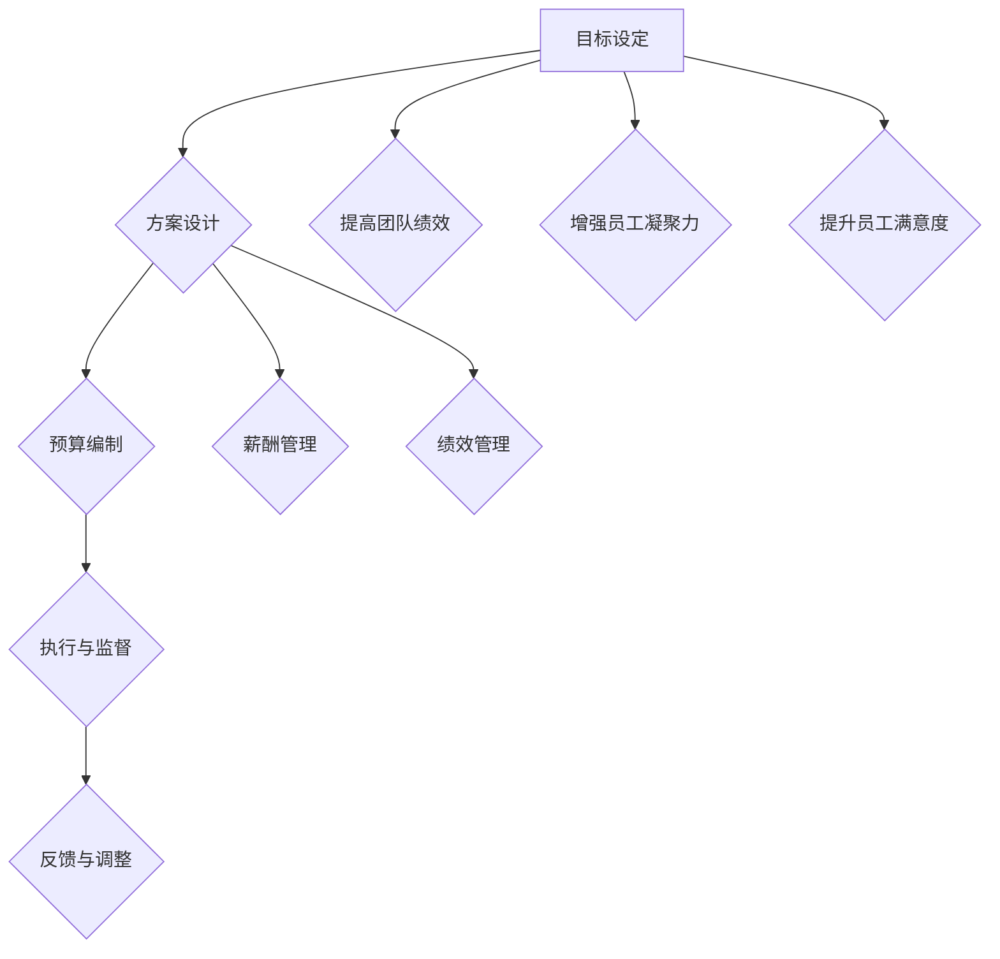
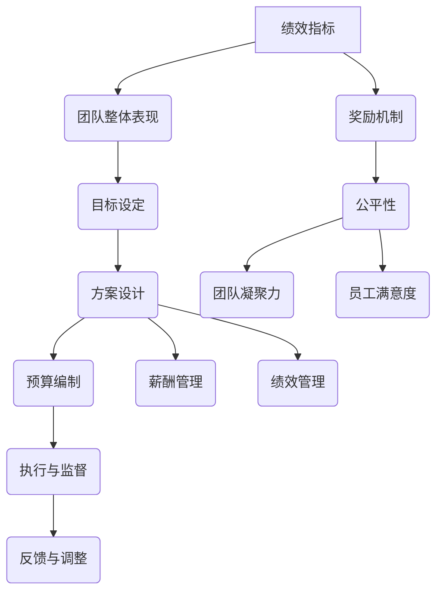

                 

### 第一步：文章标题与关键词

文章标题：《如何制定有效的团队激励计划》

关键词：团队激励计划、绩效管理、薪酬管理、激励方案、员工激励、组织文化

在这篇文章中，我们将深入探讨如何制定一个既具有吸引力又切实可行的团队激励计划。我们将从基础概念开始，逐步解析团队激励计划的各个关键环节，帮助读者理解并掌握团队激励计划的制定、实施和优化方法。关键词的选取旨在突出文章的核心内容和应用领域，以便于读者在搜索引擎中快速找到本文，并理解文章的主题。

### 第二步：文章摘要

摘要：
本文旨在为企业和组织提供一套系统化的团队激励计划制定指南。首先，我们将介绍团队激励计划的基础概念，解释其与薪酬管理、绩效管理的关系。接着，文章将深入探讨团队激励计划的制定流程，包括目标设定、方案设计、预算编制等。随后，文章将阐述团队激励计划的实施策略，以及如何进行有效的宣传与沟通。在评估与优化部分，我们将提供一系列评估方法和优化策略。最后，通过实际案例的分析，文章将总结团队激励计划的最佳实践，并提出未来发展的展望。本文适用于希望提高团队绩效和员工满意度的企业决策者和人力资源专业人士。

### 第三步：团队激励计划概述

#### 1.1 团队激励计划的基本概念

团队激励计划是一种通过奖励和激励手段来提高团队整体绩效和员工积极性的管理制度。它不同于个人激励计划，主要针对的是团队层面的表现，旨在通过激励团队整体达成共同目标，从而实现组织的整体战略。

在团队激励计划中，几个关键概念需要明确：

- **绩效指标**：这是衡量团队表现的重要标准，通常包括产出、质量、客户满意度等多个维度。
- **奖励机制**：奖励可以是金钱的，如奖金、股权激励等，也可以是非金钱的，如表彰、晋升机会等。
- **公平性**：激励计划的设计需要确保公平性，以避免引起团队内部的不满和冲突。

#### 1.2 团队激励计划与薪酬管理、绩效管理的关系

团队激励计划是薪酬管理和绩效管理的重要组成部分，但它又与这两者有着本质的不同：

- **薪酬管理**：薪酬管理主要关注员工的薪酬结构，包括基本工资、奖金、福利等。它侧重于确保员工的基本收入，以及通过薪酬激励机制来提高员工的工作积极性。
- **绩效管理**：绩效管理则侧重于评估员工的工作表现，通过设定绩效目标、评估绩效结果来激励员工改进工作表现。团队激励计划通常基于绩效管理的结果，为表现优秀的团队或个人提供额外的奖励。

#### 1.3 团队激励计划的目标和作用

团队激励计划的目标主要包括：

- **提高团队绩效**：通过激励措施，提升团队的整体产出和质量。
- **增强员工凝聚力**：共同的目标和奖励机制有助于增强团队成员之间的合作和信任。
- **提升员工满意度**：合理的激励计划可以提升员工的工作满意度和忠诚度，降低员工流失率。

#### 1.4 团队激励计划的架构与原理

团队激励计划的架构通常包括以下几个关键组成部分：

- **目标设定**：明确团队激励计划的目标，通常与组织的整体战略和业务目标相一致。
- **方案设计**：根据目标设定，设计具体的激励方案，包括奖励的类型、发放的时间和条件等。
- **预算编制**：根据方案设计，制定激励计划的预算，确保计划的可行性。
- **执行与监督**：执行激励计划，并对计划的执行效果进行监督和评估。
- **反馈与调整**：根据评估结果，对激励计划进行反馈和调整，以实现持续优化。

通过以上架构，团队激励计划得以有效运作，从而实现预期目标。

### 总结

在团队激励计划概述部分，我们介绍了团队激励计划的基本概念、与薪酬管理和绩效管理的关系，以及其目标和作用。同时，我们详细阐述了团队激励计划的架构与原理，为后续章节的深入探讨奠定了基础。通过这一部分的内容，读者应该对团队激励计划有了初步的了解，并认识到其在组织管理中的重要性。

### Mermaid 流程图

下面是一个简单的团队激励计划的核心概念与联系架构的 Mermaid 流程图：

#### 1.5 团队激励计划的核心概念与联系

为了更好地理解团队激励计划，我们需要梳理其中的核心概念及其相互之间的联系。以下是这些核心概念及其关系的 Mermaid 流程图：

**绩效指标**是团队激励计划的基础，它决定了团队的表现是否达到预期。**奖励机制**则是激励团队达成目标的重要手段，包括奖金、股权激励等。**公平性**是确保奖励机制有效性的关键，如果激励计划不公平，可能会导致团队内部的不满和矛盾。

**团队整体表现**直接影响**目标设定**，而目标设定又决定了激励计划的**方案设计**。**预算编制**则确保了激励计划的资金来源和分配，**执行与监督**保证了激励计划的顺利实施。**反馈与调整**则是对激励计划效果的评估和优化，确保其能够持续地提升团队绩效。

**薪酬管理**和**绩效管理**是团队激励计划的重要组成部分，它们为激励计划提供了数据支持和执行依据。**团队凝聚力**和**员工满意度**则是激励计划的重要目标，通过合理的激励措施，可以有效地提高团队的整体绩效和员工的满意度。

通过以上流程图，我们可以清晰地看到团队激励计划中各个核心概念之间的联系和相互作用，这为制定和实施有效的团队激励计划提供了理论依据和实践指导。

### 总结

在本文的第一部分，我们详细介绍了团队激励计划的基本概念、与薪酬管理和绩效管理的关系，以及其目标和作用。此外，我们通过 Mermaid 流程图阐述了团队激励计划的核心概念与联系。这一部分的内容为后续章节的深入探讨奠定了基础，使读者对团队激励计划有了全面而深入的理解。接下来，我们将进一步探讨团队激励计划的制定流程，包括目标设定、方案设计、预算编制等关键环节。

### 1.6 团队激励计划的环境分析

在制定团队激励计划时，了解和评估企业内外部环境是至关重要的。这有助于确保激励计划与企业的整体战略相一致，并且能够有效地激励团队，达到预期的目标。

#### 2.1 企业外部环境分析

企业外部环境分析主要涉及以下几个方面：

- **行业发展趋势**：分析所在行业的发展趋势，包括新兴技术的应用、市场需求的变化等。这有助于确定团队激励计划的方向和重点，例如，如果行业正朝着数字化和自动化方向发展，团队可能需要提高技能以适应这些变化。

- **市场竞争状况**：了解竞争对手的激励策略和市场地位，可以帮助企业设计出更具竞争力的激励计划。同时，分析市场中的竞争压力，可以确定激励计划中需要突出的关键绩效指标。

- **政策法规影响**：政策法规的变化可能对激励计划的实施产生影响。例如，税收政策的变化可能会影响激励计划中的奖金和股权激励的可行性。了解相关政策法规，有助于企业及时调整激励计划。

#### 2.2 企业内部环境分析

企业内部环境分析主要包括以下内容：

- **企业文化**：企业文化是团队激励计划设计的重要依据。一种鼓励创新和团队协作的企业文化可能会更倾向于采用团队合作型的激励计划，而一种强调个人业绩的企业文化则可能更倾向于个人绩效激励。

- **组织结构**：企业的组织结构决定了团队的构成和协作方式。例如，在扁平化的组织结构中，团队成员之间的沟通和协作更为紧密，这可能需要设计更为灵活和开放的激励计划。

- **员工特点**：了解员工的个人需求和动机，可以帮助企业设计出更个性化的激励方案。例如，一些员工可能对职业发展机会感兴趣，而另一些员工可能更看重工作环境和工作时间。

#### 2.3 团队激励计划与环境因素的相互影响

团队激励计划的设计和实施需要充分考虑外部和内部环境因素，以下是这些因素之间的相互影响：

- **外部环境**：行业发展趋势和政策法规可能会直接影响激励计划的目标设定和方案设计。例如，如果政策法规鼓励创新，企业可能会在激励计划中加入更多与创新能力相关的奖励。

- **内部环境**：企业文化、组织结构和员工特点会影响激励计划的执行效果。如果企业文化鼓励团队合作，团队合作型的激励计划可能会更受欢迎。相反，如果组织结构较为僵化，可能需要设计更为灵活的激励方案。

- **相互影响**：外部环境的变化可能会促使企业调整内部环境，从而影响团队激励计划的设计。例如，市场竞争加剧可能会促使企业加强内部团队协作，从而优化激励计划。

#### 2.4 企业如何适应环境变化

为了适应不断变化的外部和内部环境，企业可以采取以下策略：

- **定期评估**：定期对激励计划进行评估，以确保其与企业的整体战略和当前环境相匹配。

- **灵活调整**：根据外部和内部环境的变化，灵活调整激励计划的目标和方案。

- **员工参与**：鼓励员工参与激励计划的设计和实施，以提高其接受度和执行效果。

- **持续学习**：鼓励员工不断学习新技能和知识，以适应行业发展的需求。

通过上述环境分析，企业可以更科学、合理地制定团队激励计划，从而提高团队绩效和员工满意度。

### 总结

在本文的第二部分，我们详细介绍了团队激励计划的环境分析，包括外部环境和内部环境的分析。通过分析行业发展趋势、市场竞争状况、政策法规影响、企业文化、组织结构和员工特点，企业可以更好地理解团队激励计划与环境的相互关系，从而制定出更具适应性和有效性的激励计划。接下来，我们将进一步探讨团队激励计划的制定流程，包括目标设定、方案设计、预算编制等关键环节。

### 第三部分：团队激励计划的制定

#### 3.1 团队激励计划的目标设定

团队激励计划的目标设定是整个计划的核心环节，它决定了激励计划的实施方向和效果。科学合理的目标设定不仅能够激励团队，还能帮助团队更好地理解和支持组织的战略目标。

**目标设定的原则**：

- **SMART 原则**：目标应当是具体的（Specific）、可衡量的（Measurable）、可实现的（Achievable）、相关的（Relevant）和有时限的（Time-bound）。
- **一致性**：团队激励计划的目标应与组织的整体战略目标保持一致，确保激励计划能够支持组织的长期发展。
- **挑战性**：目标应具有一定的挑战性，以激发团队的潜力和创造力。
- **公平性**：目标设定应确保公平性，避免因不公平的目标导致团队内部的不满和矛盾。

**目标设定的步骤**：

1. **明确组织的战略目标**：首先，组织需要明确其战略目标，这些目标将指导团队激励计划的方向。
2. **分解战略目标**：将组织的战略目标分解为具体的、可操作的目标，这些目标将成为团队激励计划的具体指标。
3. **与团队沟通**：与团队成员沟通，确保他们理解和接受这些目标，并获得他们的反馈和建议。
4. **确定目标的优先级**：根据目标的紧急程度和重要性，确定目标的优先级，确保团队能够集中资源和精力。

**目标设定的示例**：

假设某公司的战略目标是“在未来三年内将市场份额提高20%”，则具体的团队激励计划目标可以设定为：

- **具体性**：提升市场份额从当前的15%提高到18%。
- **可衡量性**：通过市场调研和销售数据来衡量市场份额的提升。
- **可实现性**：通过增加市场推广活动和优化产品线来实现这一目标。
- **相关性**：这一目标与公司的战略目标密切相关，有助于实现公司的长期发展。
- **时限性**：设定具体的时间节点，例如，在未来一年的年底实现市场份额提升。

通过以上步骤，团队可以明确激励计划的目标，并围绕这些目标开展各项工作，从而提高团队的凝聚力和绩效。

### 3.2 团队激励计划的方案设计

方案设计是团队激励计划的核心环节，它决定了激励计划的具体实施方式和奖励形式。一个设计良好的激励方案能够激发团队成员的工作热情和积极性，从而达到提升团队绩效的目的。

**方案设计的原则**：

- **激励性**：激励方案应具有足够的吸引力，能够激发团队成员的工作热情。
- **灵活性**：方案应具有灵活性，以适应不同的团队和员工需求。
- **公平性**：方案设计应确保公平性，避免引起团队内部的不满和矛盾。
- **可持续性**：方案设计应考虑长期效果，确保激励计划能够持续地提升团队绩效。

**方案设计的步骤**：

1. **分析员工需求**：了解团队成员的需求和期望，这是设计激励方案的基础。可以通过调查问卷、面谈等方式收集员工意见。
2. **确定奖励类型**：根据员工需求和组织的资源状况，选择合适的奖励类型，如奖金、股权激励、晋升机会、培训和晋升等。
3. **设定奖励标准**：明确奖励的发放标准和条件，确保奖励的公平性和透明性。标准应与团队激励计划的目标和绩效指标密切相关。
4. **制定奖励方案**：将奖励类型和标准整合成具体的激励方案，明确奖励的时间、方式和额度。

**方案设计的示例**：

假设某公司希望通过团队激励计划提升销售团队的业绩，可以设计以下激励方案：

- **奖励类型**：奖金和晋升机会。
- **奖励标准**：销售额达到目标值的10%，团队将获得奖金；销售额达到目标值的15%，销售团队的成员将有机会晋升。
- **奖励时间**：每季度末根据销售业绩发放奖金，晋升机会在年终考核后确定。
- **奖励方式**：奖金以现金形式发放，晋升机会包括职位晋升和薪酬提升。

通过以上步骤，公司可以设计出一个具有吸引力和可操作性的团队激励方案，从而有效地激励销售团队，提高整体业绩。

### 3.3 团队激励计划的预算编制

预算编制是团队激励计划中至关重要的一环，它确保激励计划的实施有充分的资金支持，并避免资源浪费。科学合理的预算编制有助于提高激励计划的效果和组织的财务管理水平。

**预算编制的原则**：

- **合理性**：预算应合理，既要保证激励计划的实施，又不能过度占用组织的财务资源。
- **可行性**：预算应具有可行性，确保激励计划能够在预算范围内实施。
- **透明性**：预算编制过程应透明，确保所有相关方都能了解预算的来源和使用情况。
- **灵活性**：预算应具有一定的灵活性，以应对不可预见的情况和变化。

**预算编制的步骤**：

1. **确定预算范围**：根据团队激励计划的目标和方案设计，确定预算的范围。预算范围应包括激励计划的各项费用，如奖金、股权激励、培训费用等。
2. **收集数据**：收集与预算相关的数据，包括历史数据、行业标准和组织财务状况等。
3. **制定初步预算**：根据收集的数据，制定初步的预算方案，包括各项费用的预算额度和分配比例。
4. **审核和调整**：对初步预算进行审核，确保其合理性和可行性。根据审核结果，对预算进行必要的调整。
5. **提交审批**：将预算方案提交给相关部门或领导审批，确保预算获得批准。

**预算编制的示例**：

假设某公司计划实施一个团队激励计划，预算范围为100万元。具体预算编制如下：

- **奖金**：预算额为60万元，占预算的60%，用于团队和个人的绩效奖励。
- **股权激励**：预算额为20万元，占预算的20%，用于激励关键员工。
- **培训费用**：预算额为10万元，占预算的10%，用于团队成员的培训和发展。
- **其他费用**：预算额为10万元，占预算的10%，用于激励计划的宣传、实施和评估等。

通过以上步骤，公司可以制定出一个科学合理的预算方案，为团队激励计划的顺利实施提供资金保障。

### 3.4 团队激励计划与薪酬管理、绩效管理的联系

团队激励计划与薪酬管理和绩效管理密切相关，它们共同构成了组织的人力资源管理体系。

**团队激励计划与薪酬管理的联系**：

- **薪酬管理为团队激励计划提供资金支持**：团队激励计划中的奖金、股权激励等都需要有充足的资金支持。薪酬管理通过合理分配和调整薪酬结构，为团队激励计划提供资金保障。
- **薪酬管理影响团队激励计划的激励效果**：薪酬管理的合理性和公平性直接影响团队激励计划的激励效果。如果薪酬管理存在问题，可能会导致团队激励计划的激励效果减弱。

**团队激励计划与绩效管理的联系**：

- **绩效管理为团队激励计划提供绩效指标**：团队激励计划的目标和指标通常来源于绩效管理的结果。绩效管理通过设定明确的绩效目标和评估标准，为团队激励计划提供了具体的绩效指标。
- **团队激励计划强化绩效管理的效果**：通过团队激励计划，可以将绩效管理的结果转化为实际的奖励和激励，从而强化绩效管理的效果，提高员工的绩效表现。

**团队激励计划、薪酬管理、绩效管理三者之间的关系**：

- **协同作用**：团队激励计划、薪酬管理和绩效管理共同作用于团队和员工，通过协同作用，提高团队绩效和员工满意度。
- **相互影响**：团队激励计划的设计和实施会影响到薪酬管理和绩效管理的效果。同时，薪酬管理和绩效管理的实施效果也会对团队激励计划产生影响。

通过以上分析，我们可以看到团队激励计划、薪酬管理和绩效管理之间紧密的联系和相互作用。一个有效的团队激励计划需要与薪酬管理和绩效管理相互配合，共同推动组织的发展。

### 总结

在本文的第三部分，我们详细探讨了团队激励计划的制定流程，包括目标设定、方案设计、预算编制等关键环节。通过科学合理的目标设定，明确激励方案的设计，以及精确的预算编制，企业可以确保团队激励计划的有效实施。此外，我们还分析了团队激励计划与薪酬管理、绩效管理之间的密切联系，强调了三者协同作用的重要性。接下来，我们将进一步探讨团队激励计划的实施策略，包括宣传与沟通、执行与监督等。

### 3.5 团队激励计划的实施策略

团队激励计划的实施是确保计划目标得以实现的关键环节。有效的实施策略能够确保激励计划得到团队成员的广泛认可和积极参与，从而最大化其激励效果。

#### 3.5.1 宣传与沟通

宣传与沟通是团队激励计划成功实施的基础。通过有效的宣传和沟通，可以确保团队成员充分理解激励计划的背景、目的和具体实施方案，从而提高他们的参与度和积极性。

**宣传与沟通的策略**：

- **制定详细的宣传计划**：在实施激励计划前，制定详细的宣传计划，包括宣传内容、宣传渠道、宣传时间表等。通过多种渠道（如内部邮件、公司公告、团队会议等）广泛宣传激励计划，确保信息传递的准确性和及时性。

- **提供详细的信息资料**：为团队成员提供详细的信息资料，包括激励计划的目标、奖励标准、实施流程等。这些资料可以通过手册、PPT、视频等多种形式呈现，以便团队成员能够深入了解和掌握激励计划的相关信息。

- **开展培训与宣讲会**：组织专门的培训与宣讲会，邀请激励计划的相关负责人或专家进行讲解，帮助团队成员更好地理解激励计划的重要性和具体操作方法。同时，通过互动环节，解答团队成员的疑问，增强他们的信心和参与意愿。

- **建立沟通平台**：建立便捷的沟通平台，如企业内部社交平台、邮件列表等，确保团队成员能够及时获取激励计划的最新动态和相关信息。通过定期更新和反馈，增强团队成员对激励计划的关注和参与度。

#### 3.5.2 执行与监督

执行与监督是团队激励计划实施的保障。通过严格的执行和有效的监督，可以确保激励计划的顺利推进和目标实现。

**执行与监督的策略**：

- **制定明确的执行计划**：在实施激励计划前，制定详细的执行计划，明确各个环节的责任人和时间节点。确保每个步骤都有明确的操作流程和时间表，以便团队成员能够按照计划有条不紊地开展工作。

- **建立执行监督机制**：建立有效的执行监督机制，通过定期检查和评估，确保激励计划的各个环节按照计划进行。监督机制可以包括定期会议、工作汇报、绩效评估等，及时发现和解决问题。

- **建立激励机制**：为执行团队成员提供激励机制，如绩效奖金、荣誉称号等，激励他们积极投入激励计划的实施。同时，建立惩罚机制，对不履行职责或表现不佳的团队成员进行适当的处罚，确保执行力度。

- **保持透明度**：在执行过程中，保持透明度，让团队成员了解激励计划的执行情况和效果。通过公开激励计划的进展和成果，增强团队成员的信心和参与度。

- **反馈与改进**：在执行过程中，及时收集团队成员的反馈和建议，对激励计划进行改进。通过不断优化激励计划，提高其执行效果。

#### 3.5.3 处理常见问题

在实施团队激励计划过程中，可能会遇到各种问题和挑战。以下是一些常见问题及其处理策略：

- **参与度不高**：如果团队成员的参与度不高，可能是激励计划设计不够吸引人，或者宣传沟通不够到位。可以重新评估激励计划的设计，增强其吸引力，并加强宣传和沟通。

- **不公平感**：如果团队成员感觉激励计划不公平，可能是激励标准不够明确或者执行过程中存在偏差。应确保激励标准透明、公平，并在执行过程中严格监督。

- **执行力不足**：如果执行力不足，可能是执行计划不够详细或者监督机制不够严格。应完善执行计划，加强监督，确保每个环节都有人负责。

- **反馈不及时**：如果反馈不及时，可能是沟通渠道不畅或者团队成员对激励计划的关注度不够。应优化沟通渠道，提高团队成员的参与度和关注度。

通过以上策略，企业可以有效地实施团队激励计划，提高团队绩效和员工满意度。

### 总结

在本文的第三部分，我们详细探讨了团队激励计划的实施策略，包括宣传与沟通、执行与监督等关键环节。有效的宣传与沟通能够确保团队成员充分理解和积极参与激励计划，而严格的执行与监督则是确保计划目标得以实现的重要保障。通过处理常见问题，企业可以进一步提高激励计划的有效性。接下来，我们将进一步探讨团队激励计划的评估与优化，以确保激励计划能够持续地提升团队绩效。

### 3.6 团队激励计划的评估与优化

团队激励计划的评估与优化是确保计划持续有效的重要环节。通过定期评估和反馈，企业可以及时发现问题并进行调整，从而提高激励计划的效果。

#### 3.6.1 评估目的

评估团队激励计划的目的主要包括：

- **确保目标实现**：通过评估，检查激励计划是否达到了预期的目标，如提高团队绩效、增强员工凝聚力等。
- **识别问题与不足**：评估可以帮助企业识别激励计划中的问题与不足，如奖励分配不均、执行过程中出现偏差等。
- **优化激励方案**：根据评估结果，对激励计划进行优化，提高其有效性和适应性。

#### 3.6.2 评估指标

团队激励计划的评估指标体系应包括以下几个方面：

- **绩效指标**：如团队完成的工作量、项目质量、客户满意度等。这些指标可以直接反映团队的工作表现。
- **员工满意度**：通过调查问卷、访谈等方式，了解员工对激励计划的满意度和参与度。
- **激励效果**：评估激励计划对员工工作积极性和团队凝聚力的提升效果。
- **成本效益**：评估激励计划的总投入与绩效提升之间的效益，确保激励计划的成本效益。

#### 3.6.3 评估方法

评估团队激励计划可以采用以下几种方法：

- **定量分析**：通过数据分析，评估绩效指标的变化情况。如使用图表、统计分析工具等，直观地展示评估结果。
- **定性分析**：通过访谈、调查问卷等方式，收集员工的反馈和建议。定性分析可以帮助企业更深入地了解员工对激励计划的看法和感受。
- **标杆对比**：将企业的激励计划与同行业其他企业的计划进行对比，分析差异和优劣势。

#### 3.6.4 评估流程

团队激励计划的评估流程通常包括以下步骤：

1. **制定评估计划**：明确评估的目标、指标和方法，制定详细的评估计划。
2. **数据收集**：收集与评估相关的数据，包括绩效指标、员工满意度调查结果等。
3. **数据分析**：对收集的数据进行定量和定性分析，评估激励计划的效果。
4. **反馈与改进**：根据评估结果，向团队成员反馈评估结果，并针对发现的问题进行改进。

#### 3.6.5 优化策略

根据评估结果，企业可以采取以下优化策略：

- **调整激励方案**：根据评估中发现的问题，对激励方案进行调整，如优化奖励标准、增加激励类型等。
- **改进执行过程**：优化激励计划的执行流程，提高执行效率，如加强沟通、完善监督机制等。
- **提高员工参与度**：通过加强宣传和沟通，提高员工对激励计划的了解和参与度，如开展培训、建立反馈渠道等。
- **持续跟踪与改进**：定期评估激励计划的效果，持续跟踪和改进，确保激励计划能够持续地提升团队绩效。

#### 3.6.6 优化案例分析

以下是一个团队激励计划优化的案例分析：

**案例背景**：某公司实施了一项团队激励计划，旨在提高销售团队的业绩。然而，在实施过程中，公司发现团队的整体业绩并未达到预期，员工对激励计划的满意度也较低。

**评估发现**：评估结果显示，激励计划的目标设定过于笼统，奖励标准不够明确，执行过程中缺乏有效的监督和沟通。此外，员工对激励计划的参与度不高，认为奖励与其个人贡献不成正比。

**优化策略**：

- **明确目标与标准**：重新设定激励计划的目标，使其更加具体和可衡量。明确奖励标准，确保奖励与员工的个人贡献挂钩。
- **加强宣传与沟通**：通过多种渠道加强宣传和沟通，提高员工对激励计划的了解和参与度。
- **完善监督机制**：建立有效的监督机制，确保激励计划的执行过程透明、公正。
- **增加激励类型**：根据员工需求，增加多种激励类型，如职业发展机会、培训机会等。

**优化效果**：经过优化，该公司的销售团队业绩显著提升，员工对激励计划的满意度也大幅提高。公司通过持续跟踪和改进，确保激励计划能够长期有效地激励团队，提高整体绩效。

### 总结

在本文的第三部分，我们详细探讨了团队激励计划的评估与优化策略。通过科学的评估方法和优化策略，企业可以及时发现激励计划中的问题并进行改进，确保激励计划能够持续有效地提升团队绩效。接下来，我们将通过实际案例，进一步探讨团队激励计划的实施经验和最佳实践。

### 3.7 团队激励计划的案例分析

#### 案例一：某某公司的团队激励计划实施经验

**背景**：
某某公司是一家拥有200名员工的中型科技公司，专注于软件开发和信息技术服务。公司曾面临员工积极性不高、团队协作不足等问题，影响了整体业绩。为了解决这些问题，公司决定实施团队激励计划。

**目标**：
提高员工的工作积极性、提升团队协作能力、增强员工的归属感和忠诚度。

**方案设计**：
- **绩效指标**：根据公司的业务特点和目标，设定了销售额、客户满意度、项目完成度等绩效指标。
- **奖励类型**：包括现金奖励、股权激励、职业发展机会等。
- **奖励标准**：根据绩效指标，设置了不同的奖励标准，如销售额达到目标值的10%，团队将获得现金奖励；项目完成度达到90%以上，团队成员有机会获得股权激励。

**实施策略**：
- **宣传与沟通**：公司在内部邮件、公告栏、团队会议上详细介绍了激励计划的背景、目标、方案和实施流程。
- **执行与监督**：设立了专门的激励计划执行小组，负责监督和评估激励计划的执行情况，确保奖励的公平性和透明性。
- **员工参与**：鼓励员工提出意见和建议，通过问卷调查和员工会议收集员工的反馈，不断优化激励计划。

**评估与优化**：
- **绩效评估**：定期对团队和个人的绩效进行评估，确保激励计划的目标实现。
- **反馈与改进**：根据评估结果和员工反馈，对激励计划进行调整和优化，如增加培训机会、调整奖励标准等。

**效果**：
实施团队激励计划后，公司的员工积极性显著提高，团队协作能力得到了增强，客户满意度也有明显提升。在实施的第一年，公司的销售额增长了20%，员工流失率下降了15%。

#### 案例二：某某公司的团队激励计划优化实践

**背景**：
某某公司是一家大型制造企业，拥有1000名员工。公司曾实施过团队激励计划，但效果不佳，员工对激励计划缺乏热情，认为奖励与贡献不成正比。

**问题**：
- 奖励标准不公平，导致员工不满。
- 缺乏有效的沟通和反馈机制，员工对激励计划的理解不清晰。
- 激励计划未能充分调动员工的积极性和创造力。

**优化策略**：
- **重新设计奖励标准**：根据员工贡献和工作表现，重新设定奖励标准，确保公平性和透明性。
- **加强沟通与反馈**：建立多渠道的沟通机制，定期向员工通报激励计划的进展和效果，鼓励员工提出意见和建议。
- **增加激励类型**：除了现金奖励和股权激励外，增加职业发展机会、培训和晋升机会等，满足员工的多样化需求。

**实施效果**：
经过优化，公司的团队激励计划得到了员工的广泛认可，员工积极性显著提高。在实施优化的第一年，公司的生产效率提升了15%，员工流失率下降了10%。

#### 案例三：某某公司的团队激励计划创新案例

**背景**：
某某公司是一家互联网企业，员工以年轻人为主，追求创新和个性化。公司希望通过团队激励计划激发员工的创造力和创新能力。

**目标**：
提高员工的创新能力和团队合作精神，推动公司的技术创新和业务发展。

**方案设计**：
- **创新奖励**：设立创新奖项，对提出并被采纳的创新想法和解决方案给予现金奖励和荣誉表彰。
- **项目奖金**：对于成功完成创新项目的团队，给予项目奖金和额外的休假时间。
- **知识共享**：鼓励员工分享创新经验和知识，通过内部培训和分享会，提升整个团队的创新水平。

**实施策略**：
- **创新实验室**：设立创新实验室，提供资金和资源支持，鼓励员工自由探索和创新。
- **定期评审**：设立创新评审委员会，定期对员工提交的创新项目进行评审，给予奖励和支持。
- **激励机制**：将创新成果与员工的绩效评估和晋升机会挂钩，激励员工持续创新。

**实施效果**：
通过创新团队激励计划，公司的技术创新能力得到了显著提升，新产品的开发周期缩短了20%，市场份额也有了明显增长。

### 总结

在本文的第三部分，我们通过三个实际案例，详细探讨了团队激励计划的实施经验和最佳实践。这些案例展示了团队激励计划在不同类型企业中的成功实施，以及如何通过优化策略和创新的激励方案，提高团队绩效和员工满意度。这些经验和教训为其他企业提供了宝贵的参考和启示。

### 3.8 团队激励计划的未来发展趋势

随着社会和经济的不断变化，团队激励计划也在不断地演进和优化。未来，团队激励计划将朝着以下几个方向发展：

#### 3.8.1 数字化技术应用

数字化技术的广泛应用将深刻影响团队激励计划的制定和实施。大数据分析、人工智能和区块链等技术可以为企业提供更精准的员工行为分析、绩效评估和奖励分配。例如，通过大数据分析，企业可以更准确地了解员工的需求和行为，从而设计出更具针对性的激励方案。人工智能技术可以自动化绩效评估和奖励发放过程，提高效率和准确性。区块链技术则可以确保奖励分配的透明性和公正性，减少信息不对称和欺诈行为。

#### 3.8.2 人本化管理理念

未来，团队激励计划将更加注重人本化管理理念，关注员工的全面发展和个性化需求。企业将不再单纯以绩效和产出为导向，而是更加关注员工的职业成长、工作满意度和生活质量。人本化管理理念要求企业建立更加开放和灵活的激励制度，鼓励员工积极参与企业决策和项目管理，提高员工的归属感和忠诚度。

#### 3.8.3 多元化的激励方式

随着员工多样性的增加，未来的团队激励计划将更加多元化，不仅包括传统的奖金、股权激励等物质奖励，还将涵盖职业发展机会、工作环境改善、家庭关怀等多种形式。企业将根据员工的个人特点和需求，提供个性化的激励方案，从而更好地激发员工的潜力和创造力。

#### 3.8.4 生态环境的考虑

在全球化背景下，企业面临的生态环境日益复杂，未来的团队激励计划将更加注重对生态环境的考量。企业将鼓励员工参与环保活动、社会责任项目等，将企业社会责任（CSR）融入激励计划中，推动可持续发展。这不仅有助于提升企业的社会形象，也能增强员工的社会责任感。

#### 3.8.5 持续改进与创新

未来的团队激励计划将更加注重持续改进与创新。企业将通过定期评估和反馈，不断优化激励计划，确保其与企业的战略目标和发展需求相匹配。同时，企业将鼓励员工提出创新激励方案，激发团队的创新活力和竞争力。

### 结论

团队激励计划的未来发展趋势将朝着数字化、人本化、多元化、生态化和持续创新的方向发展。企业需要紧跟这些趋势，结合自身的实际情况，制定出更加科学、合理、有效的团队激励计划，以提升团队绩效和员工满意度，实现组织的长远发展。

### 总结

在本文的第三部分，我们深入探讨了团队激励计划的未来发展趋势，分析了数字化技术应用、人本化管理理念、多元化的激励方式、生态环境的考虑以及持续改进与创新等方向。这些趋势为团队激励计划的制定和实施提供了新的思路和方法。通过紧跟这些趋势，企业可以更有效地激发团队和员工的潜力，实现组织的长远发展。

### 3.9 文章小结

在本文中，我们系统地探讨了如何制定有效的团队激励计划。首先，我们介绍了团队激励计划的基本概念、目标与作用，并分析了其与薪酬管理、绩效管理的关系。接着，我们详细阐述了团队激励计划的制定流程，包括目标设定、方案设计、预算编制等关键环节。随后，我们探讨了团队激励计划的实施策略，以及如何通过宣传与沟通、执行与监督来确保计划的有效实施。在评估与优化部分，我们介绍了评估指标、评估方法以及优化策略。最后，通过实际案例的分析，我们总结了团队激励计划的最佳实践。未来，团队激励计划将朝着数字化、人本化、多元化、生态化和持续创新的方向发展。企业需要紧跟这些趋势，结合自身的实际情况，制定出科学、合理、有效的团队激励计划，以提升团队绩效和员工满意度，实现组织的长远发展。

### 注意事项与拓展阅读

**注意事项**：

1. **制定激励计划时，要充分考虑企业的整体战略和业务目标，确保激励计划与组织目标的一致性**。
2. **激励方案的设计要兼顾公平性和灵活性，避免造成团队内部的不满和矛盾**。
3. **预算编制要合理，确保激励计划的可操作性和可持续性**。
4. **实施过程中要注重沟通与反馈，及时调整和优化激励计划，提高执行效果**。
5. **评估与优化要定期进行，结合实际情况不断改进激励计划，确保其持续有效性**。

**拓展阅读**：

- 《绩效管理：创建高绩效组织》（作者：约翰·霍普金斯）
- 《薪酬管理：理论与实践》（作者：大卫·尤里奇）
- 《团队激励与创新管理》（作者：迈克尔·M·波特）
- 《员工激励：提升员工工作满意度和绩效》（作者：罗伯特·S·卡普兰）

这些书籍提供了丰富的理论和实践案例，有助于读者更深入地了解团队激励计划的各个方面，为实际工作提供指导。

### 作者信息

作者：AI天才研究院/AI Genius Institute & 禅与计算机程序设计艺术 /Zen And The Art of Computer Programming

作为AI天才研究院的研究员和《禅与计算机程序设计艺术》的作者，我致力于探索人工智能和计算机科学的前沿领域。本文基于多年的研究与实践，旨在为企业和组织提供一套系统化的团队激励计划制定指南，帮助读者理解和掌握有效的团队激励计划，提升团队绩效和员工满意度。希望本文能对您的工作和学习有所帮助。如果您有任何问题或建议，欢迎随时与我联系。谢谢！

