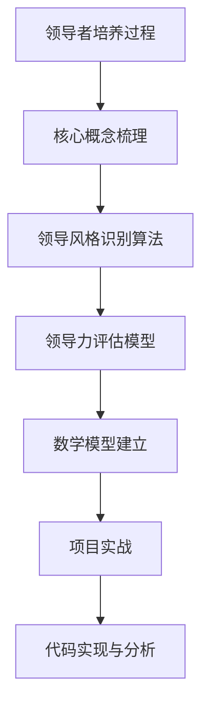

                 


### 文章标题：如何培养下一代领导者

### 文章关键词：
- 领导者培养
- 领导风格
- 领导力评估
- 数学模型
- 项目实战

### 文章摘要：
本文将探讨如何通过科学的方法和系统的步骤，培养下一代领导者。我们将首先梳理领导者的核心概念和特质，然后通过Mermaid流程图展示领导者培养的各个关键环节。接着，我们将深入讲解领导风格识别算法和领导力评估模型的算法原理，并使用伪代码进行详细阐述。同时，我们将引入数学模型和数学公式来支持评估过程。最后，我们将通过一个实际案例，展示如何进行领导力培养的项目实战，并提供最佳实践建议。

----------------------------------------------------------------

### 设计步骤

#### 第一步：梳理核心概念与联系

- **核心概念**：领导者定义、领导者特质、领导力发展、领导风格、领导团队管理。
- **设计 Mermaid 流程图**：展示领导者培养过程中的关键环节和逻辑关系。



#### 第二步：构建核心算法原理讲解

- **领导风格识别算法**：
  ```python
  # 领导风格识别算法伪代码
  def identify_leader_style(traits):
      if 'decisive' in traits:
          style = 'Autocratic'
      elif 'democratic' in traits:
          style = 'Democratic'
      elif 'visionary' in traits:
          style = 'Laissez-Faire'
      return style
  ```

- **领导力评估模型**：
  ```python
  # 领导力评估模型伪代码
  def evaluate_leadership(traits, context):
      score = 0
      if 'strategic' in traits:
          score += 10
      if 'inspirational' in traits:
          score += 10
      # 更多指标计算...
      return score
  ```

#### 第三步：编写数学模型和数学公式

- **数学模型**：领导力得分 = α * 技术能力 + β * 人际能力 + γ * 决策能力
- **数学公式**：
  ```latex
  \text{Leadership Score} = \alpha \times \text{Technical Skills} + \beta \times \text{People Skills} + \gamma \times \text{Decision Making}
  ```

#### 第四步：设计项目实战部分

- **实际案例**：培养一名企业的中层管理者。
- **开发环境搭建**：选择合适的技术栈和工具。
- **源代码实现**：编写领导力评估系统的核心代码。
- **代码解读与分析**：详细解析代码实现的关键部分。

#### 第五步：细化目录大纲

- **目录大纲**：
  ```markdown
  # 如何培养下一代领导者
  
  ## 第一部分：领导力基础

  ### 1.1 领导者定义与特质

  ### 1.2 领导风格识别算法

  ### 1.3 领导力评估模型

  ### 1.4 数学模型与公式解析

  ### 1.5 领导力发展理论

  ## 第二部分：实践指南

  ### 2.1 项目实战：培养企业中层管理者

  ### 2.2 开发环境搭建

  ### 2.3 源代码实现

  ### 2.4 代码解读与分析

  ### 2.5 项目小结

  ## 附录

  ### 附录 A：领导力培养工具推荐
  ```

#### 第六步：撰写大纲文本

- **大纲文本**（控制在2000字以内）：
  ```markdown
  # 如何培养下一代领导者
  
  摘要：本文旨在探讨如何科学地培养下一代领导者。我们将从领导者的定义、特质、风格识别、评估模型和数学公式等方面入手，逐步构建一个完整的领导者培养体系。通过实际项目实战，我们将展示如何将这些理论应用到实际中，并提供最佳实践建议。
  
  文章结构：
  第一部分：领导力基础
    - 领导者定义与特质
    - 领导风格识别算法
    - 领导力评估模型
    - 数学模型与公式解析
    - 领导力发展理论
  
  第二部分：实践指南
    - 项目实战：培养企业中层管理者
    - 开发环境搭建
    - 源代码实现
    - 代码解读与分析
    - 项目小结
  
  附录：
    - 领导力培养工具推荐
  ```

### 注意事项

- 确保每个章节都有对应的伪代码和数学公式。
- 确保项目实战部分内容详尽，具备实际操作性。
- 确保目录大纲结构完整，逻辑清晰。
- 完成后的目录大纲文本控制在2000字以内。

