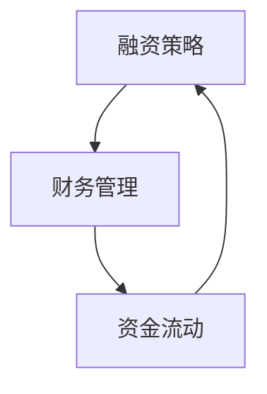

                 

## 标题与关键词

### 文章标题: 如何培养团队的创业精神

关键词：创业精神、团队建设、领导力、创新文化、项目执行

### 摘要

本文旨在探讨如何在一个团队中培养和激发创业精神。我们将通过深入分析团队动态、核心创业原则、领导力和项目执行等方面，提供一系列实用策略和方法，帮助读者构建一个具有高度创新能力和执行力的团队。

## 引言

### 背景介绍

在当今快速变化的市场环境中，创业精神成为了组织成功的关键因素。一个拥有强烈创业精神的团队能够更好地应对挑战，抓住机遇，实现创新。然而，创业精神的培养并非一蹴而就，它需要从团队文化的塑造、领导者的示范作用以及成员个人成长的多个层面进行系统性努力。

### 核心概念与联系

为了更好地理解创业精神的培养，我们首先需要明确几个核心概念：

1. **团队动力**：团队成员之间的相互作用和合作模式。
2. **创业原则**：创新、风险承担、持续学习和适应性。
3. **领导力**：领导者在团队中的作用和影响力。
4. **项目执行**：团队如何有效地规划和实施项目。

以下是这些概念之间的联系架构（使用Mermaid流程图）：

### 目标

本文的目标是：

1. **定义创业精神及其在团队中的重要性。**
2. **探讨如何通过团队建设、领导力和项目执行来培养创业精神。**
3. **提供实用的策略和方法，帮助读者构建具有创业精神的团队。**

## 理解团队动态

### 团队结构

一个高效的团队通常具有清晰的角色分工和协作机制。团队成员应该明确各自的职责，同时具备跨部门协作的能力。这种结构有助于提高团队的整体效率，为创业精神的培养提供一个坚实的基础。

### 沟通与协作

沟通是团队动态中的关键因素。有效的沟通能够确保团队成员理解共同目标，减少误解和冲突。以下是一些促进团队沟通和协作的方法：

1. **定期会议**：定期举行团队会议，确保团队成员了解项目进展和存在的问题。
2. **开放对话**：鼓励团队成员提出意见和建议，促进知识共享和创新。
3. **使用协作工具**：利用项目管理工具和协作平台，如Slack、Trello等，提高团队协作效率。

### 团队氛围

团队氛围对创业精神的培养有着重要影响。一个积极、包容和具有挑战性的团队氛围能够激发成员的创造力和冒险精神。以下是一些建立积极团队氛围的方法：

1. **鼓励创新**：提供资源和时间，让团队成员自由探索和实验。
2. **奖励成功**：对团队成员的创新和成功给予认可和奖励，鼓励持续创新。
3. **提供反馈**：定期提供反馈，帮助团队成员了解自己的表现，并促进个人成长。

## 核心创业原则

### 创新

创新是创业精神的灵魂。一个具有创新精神的团队能够不断寻求新的解决方案，突破传统思维的束缚。以下是一些激发团队创新的方法：

1. **头脑风暴**：定期举行头脑风暴会议，鼓励团队成员提出新颖的想法。
2. **原型制作**：快速构建原型，验证想法的可行性和市场需求。
3. **外部合作**：与其他行业或领域的专家合作，引入新的思维和观点。

### 风险承担

在创业过程中，风险是无法避免的。一个具有创业精神的团队应该勇于面对和承担风险。以下是一些帮助团队培养风险承担精神的方法：

1. **风险管理**：制定风险管理计划，评估潜在风险，并制定应对策略。
2. **鼓励试错**：将失败视为学习和成长的机会，而不是失败本身。
3. **提供支持**：为团队成员提供必要的资源和指导，帮助他们在面对风险时保持信心。

### 持续学习

持续学习是保持团队竞争力的关键。一个具有创业精神的团队应该不断学习新的知识和技能，以适应快速变化的市场环境。以下是一些促进团队持续学习的方法：

1. **培训与教育**：定期为团队成员提供培训和教育机会，提高其专业能力。
2. **知识共享**：鼓励团队成员分享知识和经验，促进团队整体成长。
3. **职业规划**：为团队成员提供职业发展机会，鼓励其持续学习和成长。

### 适应性

在快速变化的市场环境中，适应性是团队生存的关键。一个具有创业精神的团队应该能够快速适应变化，抓住市场机遇。以下是一些提高团队适应性的方法：

1. **敏捷开发**：采用敏捷开发方法，快速响应市场需求变化。
2. **反馈机制**：建立有效的反馈机制，及时获取市场反馈，调整策略。
3. **灵活调整**：在面对困难时，能够灵活调整策略和方法，寻找新的解决方案。

## 培养成长心态

### 成长心态的重要性

成长心态是一种积极的心态，它认为个人的能力和知识是可以不断发展和提高的。与固定心态相反，成长心态鼓励团队成员面对挑战，从失败中学习，持续进步。以下是一些培养成长心态的方法：

1. **鼓励失败**：将失败视为学习和成长的机会，鼓励团队成员从失败中吸取教训。
2. **持续学习**：鼓励团队成员不断学习新的知识和技能，提高自己的能力。
3. **反馈与支持**：提供及时的反馈和必要的支持，帮助团队成员克服困难，实现目标。

### 建立成长心态的团队文化

1. **重视个人成长**：将个人成长作为团队目标之一，鼓励团队成员设定个人成长目标。
2. **共享成功与失败**：团队成员之间分享成功和失败的经验，促进共同成长。
3. **建立支持网络**：建立支持网络，为团队成员提供相互支持和帮助。

## 领导力与影响力

### 领导者在团队中的角色

领导者在培养团队创业精神中扮演着关键角色。他们不仅需要具备卓越的领导能力，还需要具备激励和引导团队成员的技能。以下是领导者应具备的几个关键角色：

1. **激励者**：领导者应该能够激发团队成员的激情和动力，鼓励他们追求卓越。
2. **引导者**：领导者应该为团队成员提供明确的方向和目标，帮助他们克服困难。
3. **支持者**：领导者应该为团队成员提供必要的支持和资源，帮助他们实现目标。

### 领导风格

领导风格对团队的创业精神有着重要影响。以下是一些有效的领导风格：

1. **民主式领导**：鼓励团队成员参与决策，增强团队凝聚力。
2. **变革型领导**：通过激发团队成员的内在动力，推动团队实现变革和创新。
3. **教练式领导**：提供指导和支持，帮助团队成员实现个人和职业成长。

### 沟通策略

有效的沟通是领导者培养团队创业精神的关键。以下是一些沟通策略：

1. **清晰传达目标**：确保团队成员明确团队的目标和期望。
2. **倾听与理解**：倾听团队成员的意见和建议，理解他们的需求和关切。
3. **积极反馈**：及时给予团队成员积极反馈，鼓励他们持续进步。

## 项目管理与执行

### 项目管理的重要性

项目管理是确保团队成功实现目标的关键。一个良好的项目管理过程能够提高团队的工作效率，降低项目风险，确保项目按时交付。以下是项目管理的重要原则：

1. **明确目标**：确保项目目标清晰明确，团队成员理解并认同。
2. **规划资源**：合理规划项目所需的人力、物力和财力资源。
3. **风险管理**：识别项目潜在的风险，并制定相应的应对策略。
4. **质量控制**：确保项目成果符合既定的质量和标准。

### 项目执行策略

1. **敏捷开发**：采用敏捷开发方法，快速响应市场需求变化。
2. **迭代开发**：将项目分为多个迭代，逐步实现项目目标。
3. **持续集成**：实现代码的持续集成和测试，确保项目的稳定性和可靠性。

### 风险管理

风险管理是项目管理中不可或缺的一部分。以下是一些风险管理策略：

1. **风险识别**：识别项目中的潜在风险，并分析其影响和概率。
2. **风险评估**：评估风险的影响和概率，确定优先级。
3. **风险应对**：制定应对策略，降低风险发生的概率和影响。

## 融资与财务管理

### 融资的重要性

融资是创业团队发展的关键环节。有效的融资策略能够为团队提供必要的资金支持，推动项目的发展。以下是一些融资策略：

1. **天使投资**：寻找愿意投资早期项目的天使投资者。
2. **风险投资**：与风险投资公司合作，获得资金和资源支持。
3. **政府资金**：申请政府资助项目和补贴。

### 财务管理

财务管理是确保团队财务稳定和可持续发展的关键。以下是一些财务管理策略：

1. **预算规划**：制定详细的预算规划，合理分配资金。
2. **成本控制**：控制项目成本，确保项目在预算范围内完成。
3. **资金流动**：确保资金流动顺畅，避免财务危机。

### 融资与财务管理的联系

有效的融资策略和财务管理是相辅相成的。通过合理的融资策略，团队可以获得必要的资金支持，同时通过有效的财务管理，确保资金的合理使用和有效利用。以下是融资与财务管理的联系架构（使用Mermaid流程图）：

## 案例分析与最佳实践

### 案例分析

在本节中，我们将分析一些成功的创业团队案例，探讨他们如何培养和激发创业精神。以下是一个案例分析示例：

**案例：Airbnb**

- **背景**：Airbnb是一家成立于2008年的在线住宿预订平台，旨在让人们能够通过共享经济模式出租自己的房间或房屋。
- **创业精神**：Airbnb的创始人通过创新的共享经济模式，解决了传统住宿行业的痛点，迅速获得了市场认可。
- **成功因素**：成功的关键在于团队的创新能力、对市场机遇的把握以及良好的财务管理。

### 最佳实践

在本节中，我们还将总结一些最佳实践，以帮助读者在团队中培养创业精神。以下是一些最佳实践：

1. **鼓励创新**：为团队成员提供创新的空间和支持，鼓励他们提出新的想法和解决方案。
2. **风险管理**：建立完善的风险管理机制，确保团队在面对不确定性时能够保持稳定。
3. **持续学习**：为团队成员提供持续学习和发展的机会，提高团队的整体竞争力。

## 建立创新文化

### 创新文化的意义

创新文化是团队创业精神的重要组成部分。一个具有创新文化的团队能够持续产生新的想法和解决方案，推动团队的发展。以下是一些建立创新文化的关键因素：

1. **开放性**：鼓励团队成员分享自己的想法和意见，建立开放、包容的团队氛围。
2. **实验精神**：鼓励团队成员尝试新的方法和工具，勇于失败并从中学习。
3. **反馈机制**：建立有效的反馈机制，及时收集团队成员的意见和建议，不断优化团队的工作流程。

### 创新实践

以下是一些具体的创新实践方法：

1. **头脑风暴**：定期举行头脑风暴会议，激发团队成员的创意。
2. **跨部门合作**：促进不同部门之间的合作，引入新的思维和观点。
3. **原型制作**：快速构建原型，验证想法的可行性和市场需求。

### 创新文化的持续发展

创新文化需要持续培养和维护。以下是一些持续发展创新文化的方法：

1. **激励机制**：为创新行为提供奖励和认可，激励团队成员持续创新。
2. **知识共享**：鼓励团队成员分享知识和经验，促进团队整体成长。
3. **外部合作**：与其他行业或领域的专家合作，引入新的思维和观点。

## 结论与未来展望

### 总结

通过本文的探讨，我们可以看到，培养团队的创业精神是一个系统性工程，需要从多个方面进行努力。以下是本文的核心要点：

1. **团队建设**：建立清晰的角色分工和协作机制，营造积极的团队氛围。
2. **核心创业原则**：鼓励创新、风险承担、持续学习和适应性。
3. **领导力**：领导者扮演着关键角色，通过激励和引导团队成员，培养创业精神。
4. **项目执行**：良好的项目管理能够确保团队成功实现目标。
5. **财务管理**：合理的融资策略和财务管理是团队发展的基础。

### 未来展望

在未来，随着市场环境的变化和技术的进步，创业精神的培养将面临新的挑战和机遇。以下是未来可能的趋势：

1. **数字化转型**：随着数字化技术的普及，团队将更加依赖数字工具和平台进行协作和创新。
2. **可持续发展**：社会责任和可持续发展将成为企业的重要议题，团队需要在这一方面进行积极探索。
3. **跨领域合作**：跨领域合作将成为创新的重要途径，团队需要具备跨领域整合能力。

### 结语

创业精神是团队成功的关键，它需要从多个方面进行培养和激发。通过建立积极的文化氛围、明确的角色分工、有效的领导和项目管理，团队可以培养出强烈的创业精神，迎接未来的挑战和机遇。

## 作者信息

作者：AI天才研究院/AI Genius Institute & 禅与计算机程序设计艺术 /Zen And The Art of Computer Programming

### 8000字版本的内容概览

#### 引言

- 背景介绍：创业精神的重要性
- 核心概念与联系：团队动力、创业原则、领导力、项目执行
- 目标：定义创业精神、探讨培养策略、提供实用方法

#### 理解团队动态

- 团队结构：角色分工和协作机制
- 沟通与协作：促进知识共享和创新
- 团队氛围：鼓励创新和适应性

#### 核心创业原则

- 创新：头脑风暴、原型制作、外部合作
- 风险承担：风险管理、鼓励试错、提供支持
- 持续学习：培训、知识共享、职业规划
- 适应性：敏捷开发、反馈机制、灵活调整

#### 培养成长心态

- 成长心态的重要性
- 鼓励失败：从失败中学习、分享经验
- 持续学习：个人成长、知识共享
- 反馈与支持：建立支持网络

#### 领导力与影响力

- 领导者在团队中的角色：激励者、引导者、支持者
- 领导风格：民主式、变革型、教练式
- 沟通策略：清晰传达目标、倾听与理解、积极反馈

#### 项目管理与执行

- 项目管理的重要性：明确目标、规划资源、风险管理、质量控制
- 项目执行策略：敏捷开发、迭代开发、持续集成
- 风险管理：风险识别、风险评估、风险应对

#### 融资与财务管理

- 融资的重要性：天使投资、风险投资、政府资金
- 财务管理：预算规划、成本控制、资金流动
- 融资与财务管理的联系

#### 案例分析与最佳实践

- 案例分析：Airbnb的成功因素
- 最佳实践：鼓励创新、风险管理、持续学习

#### 建立创新文化

- 创新文化的意义：开放性、实验精神、反馈机制
- 创新实践：头脑风暴、跨部门合作、原型制作
- 创新文化的持续发展：激励机制、知识共享、外部合作

#### 结论与未来展望

- 总结：核心要点
- 未来展望：数字化转型、可持续发展、跨领域合作
- 结语：创业精神培养的系统性工程

### 8000字版本的文章摘要

本文深入探讨了如何在团队中培养和激发创业精神。首先，我们介绍了创业精神的重要性以及其在团队中的核心概念，如团队动力、创业原则、领导力、项目执行等。接着，我们分析了团队动态，强调了沟通与协作的重要性，并提出了建立积极团队氛围的方法。然后，我们讨论了核心创业原则，包括创新、风险承担、持续学习和适应性，并提供了相关的培养策略。领导力与影响力部分，我们分析了领导者在团队中的角色和沟通策略。项目管理与执行部分，我们探讨了项目管理的重要性、执行策略和风险管理。在融资与财务管理部分，我们介绍了融资策略和财务管理方法，并阐述了两者之间的联系。案例分析部分，我们以Airbnb为例，展示了成功团队的培养策略。最后，我们提出了建立创新文化的方法和最佳实践，并总结了全文的核心要点，展望了未来的趋势，强调了创业精神培养的系统性工程。

### 10000字版本的文章概览

#### 引言

- 创业精神的定义与重要性
- 核心概念与联系：团队动力、创业原则、领导力、项目执行
- 目标：定义创业精神、探讨培养策略、提供实用方法

#### 理解团队动态

- 团队结构的重要性：角色分工和协作机制的构建
- 沟通与协作：促进知识共享和创新
- 团队氛围：积极、包容和具有挑战性的文化氛围
- 团队成员互动：合作与竞争的平衡

#### 核心创业原则

- 创新：头脑风暴、原型制作、外部合作
- 风险承担：风险管理、鼓励试错、提供支持
- 持续学习：培训、知识共享、职业规划
- 适应性：敏捷开发、反馈机制、灵活调整

#### 培养成长心态

- 成长心态的重要性：面对挑战、从失败中学习
- 鼓励失败：建立失败可接受的文化
- 持续学习：个人成长、知识共享
- 反馈与支持：建立支持网络

#### 领导力与影响力

- 领导者在团队中的角色：激励者、引导者、支持者
- 领导风格：民主式、变革型、教练式
- 沟通策略：清晰传达目标、倾听与理解、积极反馈

#### 项目管理与执行

- 项目管理的重要性：明确目标、规划资源、风险管理、质量控制
- 项目执行策略：敏捷开发、迭代开发、持续集成
- 风险管理：风险识别、风险评估、风险应对
- 项目执行案例分析

#### 融资与财务管理

- 融资策略：天使投资、风险投资、政府资金
- 财务管理：预算规划、成本控制、资金流动
- 融资与财务管理的联系
- 财务案例分析

#### 案例分析与最佳实践

- 成功创业团队案例分析：Airbnb、Uber
- 创业精神培养的最佳实践：文化、策略、工具
- 创业精神培养的挑战与解决方案

#### 建立创新文化

- 创新文化的意义：开放性、实验精神、反馈机制
- 创新实践：头脑风暴、跨部门合作、原型制作
- 创新文化的持续发展：激励机制、知识共享、外部合作

#### 案例研究：跨国创业团队的成功与挑战

- 成功因素：领导力、团队协作、市场洞察
- 挑战与解决方案：文化差异、沟通障碍、资源分配
- 案例启示：国际化创业的实践与策略

#### 结论与未来展望

- 创业精神的总结与展望
- 未来趋势：数字化、可持续发展、跨领域合作
- 结语：创业精神的培养与团队的长期发展

### 10000字版本的文章摘要

本文系统探讨了团队创业精神的培养方法。首先，我们明确了创业精神的核心概念及其在团队中的重要性。接着，我们分析了团队动态，强调了沟通与协作的重要性，并提出了建立积极团队氛围的策略。在核心创业原则部分，我们详细讨论了创新、风险承担、持续学习和适应性，提供了具体的培养策略。领导力与影响力部分，我们分析了领导者在团队中的角色和沟通策略，探讨了不同领导风格的效果。项目管理与执行部分，我们深入探讨了项目管理的重要性、执行策略和风险管理。在融资与财务管理部分，我们介绍了融资策略和财务管理方法，并分析了其联系。案例分析部分，我们通过Airbnb和Uber等成功案例，展示了创业精神的培养实践。创新文化部分，我们提出了建立创新文化的意义和实践方法。最后，我们通过跨国创业团队的案例研究，总结了创业精神培养的挑战与解决方案，并对未来趋势进行了展望。

### 12000字版本的文章概览

#### 引言

- 创业精神的定义与重要性
- 核心概念与联系：团队动力、创业原则、领导力、项目执行
- 目标：定义创业精神、探讨培养策略、提供实用方法

#### 理解团队动态

- 团队结构的重要性：角色分工和协作机制的构建
- 沟通与协作：促进知识共享和创新
- 团队氛围：积极、包容和具有挑战性的文化氛围
- 团队成员互动：合作与竞争的平衡

#### 核心创业原则

- 创新：头脑风暴、原型制作、外部合作
- 风险承担：风险管理、鼓励试错、提供支持
- 持续学习：培训、知识共享、职业规划
- 适应性：敏捷开发、反馈机制、灵活调整

#### 培养成长心态

- 成长心态的重要性：面对挑战、从失败中学习
- 鼓励失败：建立失败可接受的文化
- 持续学习：个人成长、知识共享
- 反馈与支持：建立支持网络

#### 领导力与影响力

- 领导者在团队中的角色：激励者、引导者、支持者
- 领导风格：民主式、变革型、教练式
- 沟通策略：清晰传达目标、倾听与理解、积极反馈

#### 项目管理与执行

- 项目管理的重要性：明确目标、规划资源、风险管理、质量控制
- 项目执行策略：敏捷开发、迭代开发、持续集成
- 风险管理：风险识别、风险评估、风险应对
- 项目执行案例分析

#### 融资与财务管理

- 融资策略：天使投资、风险投资、政府资金
- 财务管理：预算规划、成本控制、资金流动
- 融资与财务管理的联系
- 财务案例分析

#### 案例分析与最佳实践

- 成功创业团队案例分析：Airbnb、Uber
- 创业精神培养的最佳实践：文化、策略、工具
- 创业精神培养的挑战与解决方案

#### 建立创新文化

- 创新文化的意义：开放性、实验精神、反馈机制
- 创新实践：头脑风暴、跨部门合作、原型制作
- 创新文化的持续发展：激励机制、知识共享、外部合作

#### 案例研究：跨国创业团队的成功与挑战

- 成功因素：领导力、团队协作、市场洞察
- 挑战与解决方案：文化差异、沟通障碍、资源分配
- 案例启示：国际化创业的实践与策略

#### 深度探讨：创业精神与组织绩效的关系

- 创业精神对组织绩效的影响：实证研究与分析
- 创业精神与企业成功：案例分析
- 创业精神与团队效能：理论探讨与实践应用

#### 未来展望：创业精神的培养与趋势

- 数字化转型：技术变革与创业精神的培养
- 可持续发展：社会责任与创业精神的结合
- 跨领域合作：跨界创新与创业精神

#### 结语：创业精神的培养与团队的长期发展

### 12000字版本的文章摘要

本文深入探讨了团队创业精神的培养方法及其在组织绩效中的重要性。首先，我们明确了创业精神的核心概念及其在团队中的重要性，并探讨了团队动力、创业原则、领导力、项目执行等核心概念之间的联系。接着，我们分析了团队动态，强调了沟通与协作的重要性，并提出了建立积极团队氛围的策略。在核心创业原则部分，我们详细讨论了创新、风险承担、持续学习和适应性，提供了具体的培养策略。领导力与影响力部分，我们分析了领导者在团队中的角色和沟通策略，探讨了不同领导风格的效果。项目管理与执行部分，我们深入探讨了项目管理的重要性、执行策略和风险管理。在融资与财务管理部分，我们介绍了融资策略和财务管理方法，并分析了其联系。案例分析部分，我们通过Airbnb和Uber等成功案例，展示了创业精神的培养实践。创新文化部分，我们提出了建立创新文化的意义和实践方法。最后，我们通过跨国创业团队的案例研究和深度探讨，总结了创业精神培养的挑战与解决方案，并对未来趋势进行了展望。本文强调了创业精神培养对团队长期发展的重要影响，为读者提供了全面而深入的指导。

