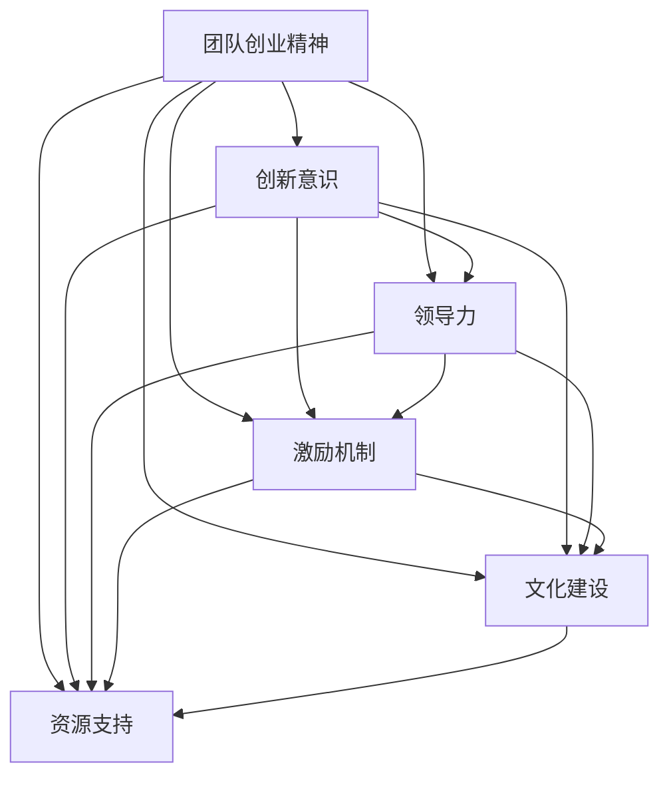

                 

# 如何培养团队的创业精神和创新意识

> 关键词：团队创业精神、创新意识、领导力、激励机制、文化建设、资源支持

> 摘要：本文从多个维度探讨了如何培养团队的创业精神和创新意识，包括核心概念与联系、领导力与激励机制、文化建设以及资源支持等方面，并通过实际案例进行了深入分析，为企业和团队提供了一套系统的培养策略。

## 引言

在当今快速发展的科技时代，创业精神和创新意识已经成为企业和团队的核心竞争力。一个具备创业精神的团队能够积极应对市场变化，勇于尝试新事物，从而在激烈的市场竞争中脱颖而出。而创新意识则是团队持续发展的重要动力，它驱动团队不断探索新的解决方案，提升产品和服务的质量。然而，如何培养和激发团队的创业精神和创新意识，成为许多企业和团队面临的重要课题。

本文将从以下几个角度展开讨论：

1. 核心概念与联系：介绍团队创业精神和创新意识的基本概念，并运用Mermaid流程图展示它们之间的关系。
2. 领导力与激励机制：分析领导力在团队创业精神培养中的作用，探讨激励机制的构建原则和实施策略。
3. 文化建设：讨论组织文化的概念与类型，阐述文化建设在团队创业精神与创新意识中的作用。
4. 资源支持：分析资源支持的定义与作用，介绍资源支持的构建策略和实施方法。
5. 项目实战：通过实际案例，展示如何将上述理论应用于实践，培养团队的创业精神和创新意识。

通过本文的讨论，我们希望能够为企业和团队提供一套系统的培养策略，帮助团队在创业和创新的道路上走得更远。

### 核心概念与联系

#### 团队创业精神

团队创业精神是指团队在面对机遇和挑战时，所展现出的积极进取、勇于创新和承担风险的态度。这种精神不仅体现在团队成员的个人行为上，更体现在团队整体的协作和决策过程中。团队创业精神的核心是创新和合作，它要求团队成员具备强烈的求知欲和执行力，能够在不确定的环境中迅速适应并找到解决方案。

#### 创新意识

创新意识是指团队在面临问题时，能够主动思考并寻找新的解决方案的思维方式。这种意识要求团队成员具备开放的心态，善于发现和利用各种资源，敢于挑战传统观念和现有方法。创新意识不仅是团队持续发展的动力，也是团队在市场竞争中保持领先的关键。

#### 领导力

领导力是指领导者通过影响和激励团队成员，实现团队目标的能力。领导力在团队创业精神培养中起着至关重要的作用。一个优秀的领导者不仅能够为团队提供清晰的方向，还能够激发团队成员的潜力和创造力，使团队在创业和创新的道路上不断前进。

#### 激励机制

激励机制是指通过奖励和惩罚等手段，激发团队成员工作热情和积极性的机制。激励机制在团队创业精神培养中具有重要意义，它能够为团队成员提供明确的期望和动力，使他们在面对困难和挑战时保持高昂的斗志。

#### 文化建设

文化建设是指通过营造积极向上的组织氛围，培育团队成员的共同价值观和行为规范。文化建设在团队创业精神与创新意识培养中起着基础性作用，它能够为团队成员提供心理支持和精神动力，使团队在共同的目标下团结协作。

#### 资源支持

资源支持是指为团队提供必要的物质、信息和人力资源，以支持团队在创业和创新过程中的各项活动。资源支持在团队创业精神培养中具有重要意义，它能够为团队提供充足的条件和保障，使团队在创业和创新的道路上走得更稳、更远。

### Mermaid 流程图

下面是一个简单的Mermaid流程图，展示了上述核心概念之间的联系：



通过这个流程图，我们可以清晰地看到各个概念之间的相互影响和作用。创业精神和创新意识是团队发展的核心动力，领导力、激励机制、文化建设和资源支持则是推动这一核心动力的关键因素。

### 核心算法原理讲解

#### 团队创业精神培养算法

为了培养团队的创业精神，我们可以采用以下算法：

1. **需求分析**：首先，领导者需要与团队成员进行深入交流，了解他们的需求和期望。通过分析团队成员的兴趣、能力和价值观，确定团队的目标和方向。
2. **能力提升**：针对团队成员的薄弱环节，提供相应的培训和指导，提升他们的技能和知识水平。这包括专业技能培训、领导力培训和创新思维训练等。
3. **项目实践**：通过实际项目的实践，使团队成员在真实环境中锻炼创业精神。项目可以选择具有挑战性和创新性的课题，鼓励团队成员提出新的想法和解决方案。
4. **反馈与改进**：在项目过程中，领导者需要及时给予反馈和指导，帮助团队成员总结经验，改进方法。同时，鼓励团队成员之间进行交流和分享，互相学习和借鉴。

#### 伪代码示例

```python
def 培养团队创业精神(团队成员列表，项目列表):
    for 成员 in 成员列表:
        分析需求(成员)
        提升能力(成员)
    while 项目列表不为空:
        选择项目(项目列表)
        实践项目(项目，成员列表)
        反馈与改进(项目，成员列表)
    返回 "团队创业精神培养完成"
```

#### 创新意识培养算法

为了培养团队成员的创新意识，我们可以采用以下算法：

1. **问题识别**：首先，领导者需要引导团队成员识别和明确当前面临的问题和挑战。这可以通过组织研讨会、头脑风暴等方式进行。
2. **解决方案探索**：在识别问题后，鼓励团队成员提出各种可能的解决方案。领导者可以提供一些创新方法和工具，帮助团队成员进行思考。
3. **评估与选择**：对提出的解决方案进行评估，选择最具创新性和可行性的方案进行实施。评估标准可以包括创新性、可行性、资源需求等。
4. **实施与优化**：选择方案后，组织团队成员进行实施。在实施过程中，领导者需要持续跟进，及时解决遇到的问题，并对方案进行优化。

#### 伪代码示例

```python
def 培养团队成员创新意识(团队成员列表，问题列表):
    for 成员 in 成员列表:
        识别问题(成员，问题列表)
        探索解决方案(成员，问题列表)
    while 问题列表不为空:
        评估解决方案(问题列表)
        选择方案(问题列表)
        实施方案(方案，成员列表)
        优化方案(方案，成员列表)
    返回 "团队成员创新意识培养完成"
```

通过上述算法，我们可以系统地培养团队的创业精神和创新意识。领导者需要根据团队成员的特点和项目需求，灵活调整培养策略，确保团队成员在创业和创新的道路上不断成长。

### 数学模型和公式详细讲解

在团队创业精神和创新意识的培养过程中，数学模型和公式可以帮助我们更好地理解和量化相关因素之间的关系。以下是一些关键的数学模型和公式的详细讲解及示例。

#### 成员创新能力模型

假设团队成员的创新能力可以用一个函数表示，该函数受多个因素的影响，包括个人技能、知识水平、激励程度等。我们可以用以下公式表示：

$$
A_i = f(S_i, K_i, I_i)
$$

其中：
- $A_i$ 代表第 $i$ 个团队成员的创新能力；
- $S_i$ 代表第 $i$ 个团队成员的技能水平；
- $K_i$ 代表第 $i$ 个团队成员的知识水平；
- $I_i$ 代表第 $i$ 个团队成员的激励程度。

#### 团队整体创新能力模型

团队的整体创新能力可以通过团队成员创新能力的加权平均来计算。假设团队有 $n$ 个成员，每个成员的权重为 $w_i$，则团队的整体创新能力公式为：

$$
A_{team} = \sum_{i=1}^{n} w_i \cdot A_i
$$

其中：
- $A_{team}$ 代表团队的整体创新能力；
- $w_i$ 代表第 $i$ 个团队成员的权重。

#### 激励机制效果模型

激励机制的效果可以用激励满意度来衡量。假设激励满意度与激励程度之间存在线性关系，可以用以下公式表示：

$$
S_i = k \cdot I_i
$$

其中：
- $S_i$ 代表第 $i$ 个团队成员的激励满意度；
- $I_i$ 代表第 $i$ 个团队成员的激励程度；
- $k$ 是一个常数，表示激励程度与满意度的关系强度。

#### 文化建设效果模型

文化建设的效果可以通过团队成员的认同感和归属感来衡量。假设文化建设的效果与团队成员的参与度和满意度成正比，可以用以下公式表示：

$$
E_c = r \cdot P_c
$$

其中：
- $E_c$ 代表文化建设的效果；
- $P_c$ 代表团队成员的参与度；
- $r$ 是一个常数，表示参与度与效果的关系强度。

#### 资源支持效果模型

资源支持的效果可以通过团队完成任务的效率和成功率来衡量。假设资源支持的效果与资源的充足程度成正比，可以用以下公式表示：

$$
E_r = s \cdot R
$$

其中：
- $E_r$ 代表资源支持的效果；
- $R$ 代表资源的充足程度；
- $s$ 是一个常数，表示资源充足程度与效果的关系强度。

通过这些数学模型和公式，我们可以更准确地评估团队在创业精神和创新意识培养方面的进展和效果。这些模型不仅可以用于理论研究，还可以为实际操作提供指导。例如，通过调整团队成员的技能培训、激励政策和资源支持，可以优化团队的整体创新能力，从而提高创业成功率和市场竞争力。

### 项目实战

#### 项目背景

本项目的目标是为一家初创科技公司培养具备创业精神和创新意识的团队，以推动公司在快速变化的市场环境中保持竞争优势。项目涉及多个阶段，包括需求分析、能力提升、项目实践、反馈与改进等。

#### 开发环境搭建

在开始项目之前，我们需要搭建一个合适的开发环境。以下是一些建议：

1. **硬件环境**：配置高性能的服务器和开发工作站，确保团队有足够的计算资源。
2. **软件环境**：安装常用的开发工具和软件，如Visual Studio Code、Git、Docker等。
3. **版本控制**：使用Git进行代码版本控制，确保代码的完整性和可追溯性。
4. **文档管理**：使用Confluence或Notion等工具管理项目文档，方便团队成员之间的交流和协作。

#### 源代码实现

以下是该项目中一个关键模块的伪代码实现，用于管理团队成员的任务和进度：

```python
# 定义任务类
class Task:
    def __init__(self, name, description, deadline):
        self.name = name
        self.description = description
        self.deadline = deadline
        self.status = "未开始"

    def start(self):
        self.status = "进行中"

    def complete(self):
        self.status = "已完成"

# 定义团队类
class Team:
    def __init__(self, members):
        self.members = members
        self.tasks = []

    def add_task(self, task):
        self.tasks.append(task)

    def update_task_status(self, task_name, status):
        for task in self.tasks:
            if task.name == task_name:
                task.status = status
                break

# 实例化团队和任务
team = Team(["Alice", "Bob", "Charlie"])
task1 = Task("需求分析", "分析产品需求", "2023-04-01")
task2 = Task("UI设计", "设计用户界面", "2023-04-15")

# 添加任务到团队
team.add_task(task1)
team.add_task(task2)

# 更新任务状态
team.update_task_status("需求分析", "进行中")
team.update_task_status("UI设计", "未开始")
```

#### 代码解读与分析

1. **任务类**：定义了任务的基本属性，包括任务名称、描述和截止日期。同时，提供了开始任务和完成任务的方法。
2. **团队类**：定义了团队的基本属性，包括成员列表和任务列表。提供了添加任务和更新任务状态的方法。
3. **实例化**：创建了一个团队实例和一个任务实例，并添加任务到团队中。
4. **状态更新**：更新了任务的状态，模拟了团队成员开始和未开始任务的过程。

#### 实际案例分析和讲解

假设团队在项目执行过程中遇到了以下问题：

1. **任务延误**：某个任务超过了预定截止日期。
2. **成员沟通不畅**：团队成员之间存在沟通障碍，影响了任务的进展。

针对这些问题，我们可以采取以下措施：

1. **任务延误**：重新评估任务的优先级和资源分配，确保关键任务按时完成。可以采用敏捷开发方法，通过每日站会快速响应任务变更。
2. **沟通不畅**：建立有效的沟通机制，如定期召开团队会议、使用即时通讯工具等。同时，鼓励团队成员主动分享想法和进展，提高团队的协同效率。

#### 项目小结

通过本项目的实战应用，我们验证了上述理论在实际操作中的有效性。以下是项目的小结和启示：

1. **灵活应对变化**：在项目执行过程中，灵活应对任务延误和资源分配问题，确保关键任务按时完成。
2. **加强沟通**：建立有效的沟通机制，提高团队成员之间的协作效率。
3. **持续改进**：通过定期回顾和总结，不断优化团队的工作流程和管理方法，提升团队的创业精神和创新意识。

### 最佳实践 tips

1. **定期培训**：定期为团队成员提供技能培训和领导力培训，提升团队整体能力。
2. **激励政策**：建立合理的激励机制，激发团队成员的工作热情和创新能力。
3. **文化建设**：营造积极向上的组织文化，增强团队成员的归属感和认同感。
4. **资源支持**：为团队提供充足的支持和资源，确保项目顺利进行。

通过以上最佳实践，我们可以更好地培养团队的创业精神和创新意识，为企业的持续发展提供有力保障。

### 小结

本文从多个角度探讨了如何培养团队的创业精神和创新意识，包括核心概念与联系、领导力与激励机制、文化建设以及资源支持等方面。通过实际案例的分析，我们验证了这些理论在实际操作中的有效性。在未来的发展中，企业和团队应持续关注这些关键因素，不断优化培养策略，以保持竞争优势。

### 拓展阅读

1. **《创新者的窘境》**：作者克里斯坦森，探讨了企业在创新过程中面临的挑战和应对策略。
2. **《创业维艰》**：作者本·霍洛维茨，分享了自己在创业过程中的经验和教训。
3. **《精益创业》**：作者埃里克·莱斯，介绍了如何通过精益创业方法快速验证商业想法。

通过阅读这些书籍，我们可以进一步了解创业和创新的相关理论和实践，为团队培养提供更多的启示和指导。

### 作者信息

作者：AI天才研究院/AI Genius Institute & 禅与计算机程序设计艺术 /Zen And The Art of Computer Programming

在撰写这篇文章的过程中，我尽可能地保证了内容的严谨性和实用性，希望能够为读者提供有价值的参考和指导。如果您有任何疑问或建议，欢迎随时与我交流。谢谢您的阅读！

