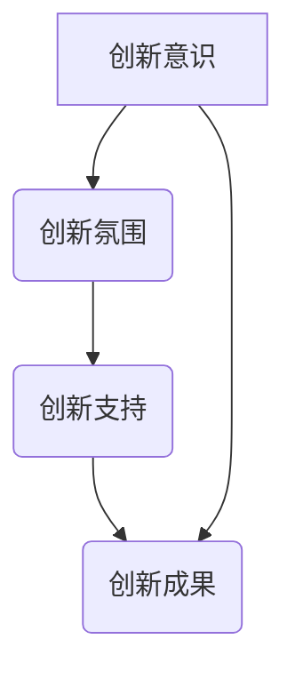
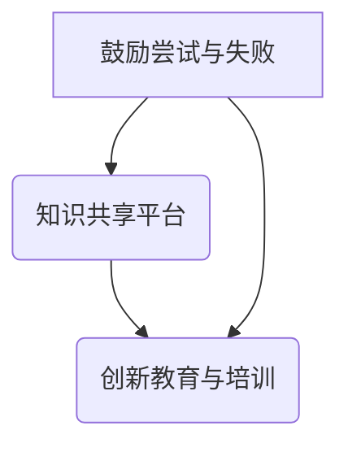
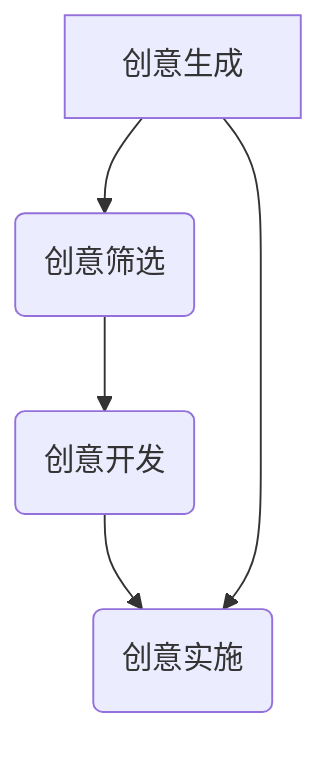
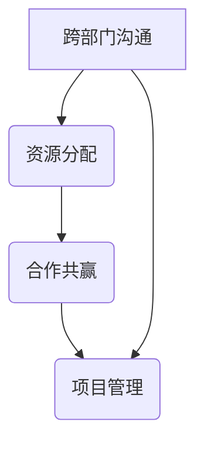
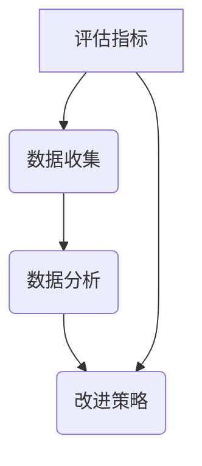

                 


### 第2章：构建创新文化的基石

> **背景介绍**：
在当今快速变化的世界中，创新能力成为企业持续发展的关键驱动力。构建创新文化不仅是企业领导者的重要任务，也是每个团队成员的责任。创新文化不仅涉及技术层面的创新，更包含组织行为、团队动力和心理因素。本章将探讨如何从领导者的角色与责任、组织结构与文化适应性、员工参与等方面构建创新文化的基础。

> **核心概念与联系**：
创新文化是一个多维度的概念，它包括但不限于创新意识、创新氛围、创新支持和创新成果。以下是一个简化的Mermaid流程图，展示了这些核心概念之间的关系：



- **创新意识**：指组织内部对创新的重视程度和接受度。
- **创新氛围**：指支持创新的环境和条件，包括开放性、包容性和自主性。
- **创新支持**：指组织在资源、制度和培训等方面的支持。
- **创新成果**：指通过创新活动所取得的实际成果和绩效。

> **核心算法原理讲解**：
构建创新文化没有一成不变的公式或算法，但可以通过以下步骤逐步推进：

```python
# 步骤1：确立创新愿景
define_vision = "创建一个鼓励创新和持续改进的组织环境"

# 步骤2：评估现有文化
evaluate_culture = "通过问卷调查、员工访谈等方法，了解组织文化的现状"

# 步骤3：制定创新策略
create_innovation_strategy = """
- 设定创新目标
- 确定创新优先级
- 制定实施计划
"""

# 步骤4：建立支持机制
setup_support_mechanisms = """
- 创新奖励机制
- 知识共享平台
- 创新工作坊和研讨会
"""

# 步骤5：培训与教育
train_and_educate = """
- 定期举办创新培训
- 鼓励员工参加外部培训
- 提供创新项目指导
"""

# 步骤6：评估与改进
evaluate_and_improve = """
- 设定评估指标
- 收集反馈
- 根据反馈调整策略
"""
```

> **数学模型和公式**：
创新文化的构建可以借助一些简单的数学模型来量化。例如，可以使用以下公式来评估创新绩效：

$$
IP = f(C, S, E)
$$

其中，$IP$ 表示创新绩效，$C$ 表示创新文化，$S$ 表示支持机制，$E$ 表示员工参与度。该公式表明，创新绩效是创新文化、支持机制和员工参与度的函数。

> **项目实战**：
以下是一个简单的项目实战，用于开发一个支持创新文化的知识共享平台。

**开发环境搭建**：
- 使用Docker搭建一个基于Python和Flask的Web应用环境。
- 使用PostgreSQL作为数据库存储用户和文章数据。

**源代码实现**：
```python
# app.py
from flask import Flask, request, jsonify
from models import User, Article

app = Flask(__name__)

@app.route('/register', methods=['POST'])
def register_user():
    # 用户注册逻辑
    pass

@app.route('/submit_article', methods=['POST'])
def submit_article():
    # 提交文章逻辑
    pass

@app.route('/articles', methods=['GET'])
def get_articles():
    # 获取文章列表逻辑
    pass

if __name__ == '__main__':
    app.run(debug=True)
```

**代码解读与分析**：
- `register_user`：处理用户注册请求，包括验证用户信息和存储用户数据。
- `submit_article`：处理用户提交的文章，包括验证文章内容和存储文章数据。
- `get_articles`：获取所有文章的列表，并返回给前端。

**实际案例分析与详细讲解**：
假设我们有一个用户名为“Alice”的员工，她想要在平台上提交一篇关于新产品的市场策略的文章。

1. Alice 注册并登录到系统。
2. 她填写了文章的标题、内容和摘要，并点击提交按钮。
3. 后端服务器验证了Alice的身份，并保存了她的文章。
4. 其他用户可以在平台上查看Alice的文章，并提出反馈。

**项目小结**：
通过这个知识共享平台，企业可以鼓励员工分享创新思想和成果，促进知识传播和团队合作。

**最佳实践 Tips**：
- 定期更新知识库，确保信息的时效性和准确性。
- 鼓励员工提出改进意见，不断完善平台功能。

**小结与注意事项**：
构建创新文化是一个长期而复杂的过程，需要领导者的远见和持续的努力。通过有效的知识共享平台和其他支持机制，企业可以逐步建立和巩固创新文化。

**拓展阅读**：
- [《创新者的窘境》](https://www.amazon.com/dp/0814470729)
- [《创新者的实践》](https://www.amazon.com/dp/1591399753)
- [《企业文化》](https://www.amazon.com/dp/078794537X)

通过以上内容的讲解，相信读者对如何构建创新文化有了更深入的理解。接下来的章节将进一步探讨创新流程、跨部门协作以及评估与改进策略。

---

### 第3章：激励创新思维的环境

> **背景介绍**：
在构建创新文化的基础上，创造一个能够激发团队成员创新思维的环境至关重要。本章将探讨如何通过鼓励尝试与失败、建立知识共享平台、以及创新教育与培训来打造这样的环境。

> **核心概念与联系**：
激励创新思维的环境包括以下几个方面：

- **鼓励尝试与失败**：创造一个安全的环境，鼓励员工勇于尝试新想法，即使失败也得到支持。
- **建立知识共享平台**：促进知识传播和交流，使团队成员能够轻松获取和分享信息。
- **创新教育与培训**：通过教育和培训提高员工的创新技能和知识，鼓励他们不断探索新的领域。

以下是一个简化的Mermaid流程图，展示了这些核心概念之间的关系：



> **核心算法原理讲解**：
为了打造一个激励创新思维的环境，我们可以采用以下步骤：

```python
# 步骤1：建立鼓励尝试与失败的文化
create尝试失败文化 = """
- 明确失败是创新过程中的必然环节
- 奖励尝试而非成功
- 提供失败后的反思机会
"""

# 步骤2：建立知识共享平台
setup_knowledge_sharing_platform = """
- 选择合适的工具，如Wiki或论坛
- 制定知识共享的规则和流程
- 鼓励员工积极参与知识共享
"""

# 步骤3：提供创新教育与培训
provide_innovation_training = """
- 定期举办创新工作坊和研讨会
- 鼓励员工参加外部培训课程
- 提供在线学习资源和培训材料
"""
```

> **数学模型和公式**：
激励创新思维的环境可以通过以下数学模型来量化：

$$
IE = f(C, K, T)
$$

其中，$IE$ 表示创新环境的质量，$C$ 表示鼓励尝试与失败的程度，$K$ 表示知识共享的水平，$T$ 表示创新教育与培训的投入。

> **项目实战**：
以下是一个简单的项目实战，用于建立知识共享平台。

**开发环境搭建**：
- 使用GitHub搭建一个基于Markdown的Wiki系统。
- 使用Git进行版本控制，确保知识库的更新和维护。

**源代码实现**：
```bash
# 使用Markdown编写文档
---
title: "创新工作坊笔记"
date: 2023-10-01
---

# 概述

本次工作坊的重点是探索如何提高团队的创新效率。

## 第一部分：鼓励尝试与失败

- 失败是创新的必经之路。
- 奖励尝试，而非成功。

## 第二部分：知识共享平台

- 选择合适的工具，如Wiki或论坛。
- 确保知识共享的规则和流程明确。

---

**代码解读与分析**：
- 使用Markdown格式编写文档，使内容更加清晰易懂。
- 文档结构包括标题、日期和正文，便于管理和查找。

**实际案例分析与详细讲解**：
假设我们在公司内部建立了一个Wiki平台，用于记录和创新工作坊的笔记。

1. 工作坊结束后，团队成员将笔记上传到Wiki平台。
2. 其他团队成员可以查看、编辑和评论这些笔记。
3. Wiki平台提供了版本控制和权限管理，确保知识库的更新和维护。

**项目小结**：
通过Wiki平台，企业可以有效地促进知识共享和团队协作，提高创新效率。

**最佳实践 Tips**：
- 定期更新Wiki，确保信息的时效性和准确性。
- 鼓励团队成员积极参与Wiki的维护和更新。

**小结与注意事项**：
建立鼓励尝试与失败的文化、知识共享平台以及创新教育与培训是打造激励创新思维环境的关键。通过这些措施，企业可以为团队成员创造一个充满活力和创新精神的工作环境。

**拓展阅读**：
- [《如何打造创新团队》](https://www.amazon.com/dp/1591399714)
- [《知识共享的力量》](https://www.amazon.com/dp/0470226437)
- [《创新者的思维》](https://www.amazon.com/dp/1591399652)

在下一章中，我们将进一步探讨创新流程与方法，以及如何在团队内部实施这些流程。

---

### 第4章：创新流程与方法

> **背景介绍**：
构建创新文化不仅仅是为了创造一个有利于创新的环境，更重要的是要通过系统化的创新流程和方法来确保创新活动的高效实施。本章将深入探讨创新流程的设计与实施，以及设计思维和创新模式识别在创新过程中的应用。

> **核心概念与联系**：
创新流程与方法涉及多个环节，包括创意生成、创意筛选、创意开发和创意实施。以下是一个简化的Mermaid流程图，展示了这些核心概念之间的关系：



- **创意生成**：指产生新想法和创新概念的过程。
- **创意筛选**：指对创意进行评估和筛选，确定哪些创意具有实施潜力。
- **创意开发**：指将创意转化为实际可执行方案的过程。
- **创意实施**：指将创意转化为产品或服务的实际实施过程。

> **核心算法原理讲解**：
为了有效设计创新流程，我们可以采用以下步骤：

```python
# 步骤1：创意生成
generate_ideas = """
- 组织头脑风暴会议
- 鼓励员工提出创新想法
- 利用交叉功能团队进行创意碰撞
"""

# 步骤2：创意筛选
filter_ideas = """
- 制定筛选标准，如可行性、市场潜力等
- 对创意进行评分和排名
- 评估创意的经济效益和社会影响
"""

# 步骤3：创意开发
develop_ideas = """
- 组建跨功能团队，负责创意的开发和实施
- 进行详细的市场调研和竞争分析
- 开发原型并进行用户测试
"""

# 步骤4：创意实施
implement_ideas = """
- 制定详细的实施计划
- 分配资源和责任
- 监控进度并调整计划
"""
```

> **数学模型和公式**：
创新流程的效率可以通过以下数学模型来量化：

$$
IEF = f(G, F, D, I)
$$

其中，$IEF$ 表示创新流程的效率，$G$ 表示创意生成的质量，$F$ 表示创意筛选的有效性，$D$ 表示创意开发的速度，$I$ 表示创意实施的成功率。

> **项目实战**：
以下是一个简单的项目实战，用于设计一个基于设计思维的创新流程。

**开发环境搭建**：
- 使用Miro或Figma等设计工具进行头脑风暴和原型设计。
- 使用Jira或Trello等项目管理工具进行流程管理和任务分配。

**源代码实现**：
```bash
# 使用Miro进行头脑风暴
[头脑风暴会议]
- 问题陈述：如何提高客户满意度？
- 创意生成：列出所有可能的解决方案。

[创意筛选]
- 制定筛选标准：可行性、市场潜力等。
- 评估和评分：对每个创意进行评估和评分。

[创意开发]
- 组建团队：分配任务和责任。
- 原型设计：使用Figma等工具设计原型。
- 用户测试：收集用户反馈，优化设计。

[创意实施]
- 制定实施计划：确定时间表、资源和预算。
- 监控进度：使用Jira等工具跟踪项目进度。
- 调整计划：根据反馈和实际情况进行调整。
```

**代码解读与分析**：
- 使用Miro进行头脑风暴，列出所有可能的解决方案。
- 使用Figma设计原型，并进行用户测试，以收集用户反馈。
- 使用Jira跟踪项目进度，确保项目按时完成。

**实际案例分析与详细讲解**：
假设我们公司决定通过设计思维来开发一款新的客户服务应用程序。

1. 组织头脑风暴会议，收集所有可能的解决方案。
2. 根据可行性、市场潜力等标准，对每个创意进行评估和筛选。
3. 组建跨功能团队，负责创意的开发和实施。
4. 使用Figma设计应用程序的原型，并进行用户测试，收集用户反馈。
5. 根据用户反馈和实际情况，优化设计，并制定详细的实施计划。
6. 使用Jira跟踪项目进度，确保项目按时完成。

**项目小结**：
通过设计思维和创新流程，公司成功地开发出了一款满足客户需求的客户服务应用程序。

**最佳实践 Tips**：
- 定期进行头脑风暴会议，鼓励员工提出创新想法。
- 使用设计工具进行原型设计，提高创意的可视化和测试效率。
- 使用项目管理工具跟踪项目进度，确保项目的成功实施。

**小结与注意事项**：
设计创新流程和方法是确保创新活动高效实施的关键。通过创意生成、筛选、开发和实施的系统化流程，企业可以更好地管理和实施创新项目。

**拓展阅读**：
- [《设计思维：设计过程中的创造力与实践方法》](https://www.amazon.com/dp/1591847839)
- [《创新者的DNA》](https://www.amazon.com/dp/1591399690)
- [《如何管理创新项目》](https://www.amazon.com/dp/007159710X)

在下一章中，我们将探讨跨部门协作与资源整合在创新文化中的重要性。

---

### 第5章：跨部门协作与资源整合

> **背景介绍**：
在构建创新文化过程中，跨部门协作与资源整合是确保创新项目成功的关键。本章将探讨如何通过有效的跨部门协作策略和资源整合方法，促进创新文化的形成和发展。

> **核心概念与联系**：
跨部门协作与资源整合涉及多个核心概念，包括跨部门沟通、资源分配、合作共赢和项目管理。以下是一个简化的Mermaid流程图，展示了这些核心概念之间的关系：



- **跨部门沟通**：指不同部门之间通过有效沟通，共享信息和知识。
- **资源分配**：指合理分配人力、资金和物资等资源，以支持创新项目。
- **合作共赢**：指通过跨部门协作，实现整体利益最大化。
- **项目管理**：指对创新项目进行系统化管理，确保项目目标的实现。

> **核心算法原理讲解**：
为了实现有效的跨部门协作与资源整合，我们可以采用以下步骤：

```python
# 步骤1：建立跨部门沟通机制
setup_communication_mechanisms = """
- 设立跨部门会议，定期沟通进展
- 利用项目管理工具，如Jira或Trello，实时更新项目状态
- 鼓励跨部门协作，消除部门壁垒
"""

# 步骤2：资源分配与协调
allocate_and_coordinate_resources = """
- 根据项目需求，合理分配资源
- 设立资源协调小组，解决资源分配中的问题
- 定期评估资源使用情况，及时调整资源分配
"""

# 步骤3：合作共赢策略
develop_collaborative_strategy = """
- 制定合作共赢的目标和标准
- 奖励跨部门合作，促进团队合作
- 建立长期合作关系，提升整体竞争力
"""

# 步骤4：项目管理与监控
manage_and_monitor_projects = """
- 制定详细的项目计划，明确目标、进度和责任
- 监控项目进度，确保按时交付
- 通过项目评估，总结经验教训，持续改进
"""
```

> **数学模型和公式**：
跨部门协作与资源整合的效果可以通过以下数学模型来量化：

$$
CI = f(C, R, P, M)
$$

其中，$CI$ 表示跨部门协作与资源整合的效果，$C$ 表示跨部门沟通的有效性，$R$ 表示资源分配的合理性，$P$ 表示合作共赢的积极性，$M$ 表示项目管理的效率。

> **项目实战**：
以下是一个简单的项目实战，用于实现跨部门协作与资源整合。

**开发环境搭建**：
- 使用Jira或Trello等项目管理工具。
- 使用Slack或Microsoft Teams等协作工具。
- 使用Confluence或SharePoint等知识共享平台。

**源代码实现**：
```python
# 使用Jira进行项目管理
[项目名称]
- 项目描述：开发一款新的客户服务应用程序。
- 项目目标：提高客户满意度，缩短响应时间。
- 项目进度：目前处于原型设计阶段。

[资源分配]
- 人力资源：开发团队、设计团队、测试团队。
- 资金资源：预算分配和费用报销。
- 物资资源：设备采购和配置。

[项目进度更新]
- 定期更新项目进度，确保各部门了解项目状态。
- 通过Jira任务板，实时跟踪任务进度。

[沟通与协作]
- 设立每周项目会议，讨论项目进展和问题。
- 使用Slack或Microsoft Teams进行日常沟通和协作。
```

**代码解读与分析**：
- 使用Jira建立项目管理框架，明确项目目标和进度。
- 使用任务板跟踪任务进度，确保项目按时完成。
- 使用协作工具进行日常沟通，提高工作效率。

**实际案例分析与详细讲解**：
假设我们公司决定开发一款新的客户服务应用程序，需要多个部门的协作。

1. 通过Jira建立项目管理框架，明确项目目标和进度。
2. 根据项目需求，合理分配人力资源、资金资源和物资资源。
3. 设立每周项目会议，讨论项目进展和问题。
4. 通过协作工具进行日常沟通，确保各部门了解项目状态。

**项目小结**：
通过有效的跨部门协作与资源整合，公司成功地开发出了一款满足客户需求的客户服务应用程序。

**最佳实践 Tips**：
- 定期进行项目会议，确保项目进展透明。
- 使用项目管理工具，提高项目管理的效率。
- 建立知识共享平台，促进跨部门的知识交流。

**小结与注意事项**：
跨部门协作与资源整合是构建创新文化的重要组成部分。通过有效的沟通、合理的资源分配和高效的项目管理，企业可以确保创新项目的成功实施。

**拓展阅读**：
- [《项目管理知识体系指南》（PMBOK）](https://www.pmi.org/store/pmbok-guide-6th-edition)
- [《团队协作：企业成功的秘密武器》](https://www.amazon.com/dp/0985987769)
- [《资源整合与管理》](https://www.amazon.com/dp/0761929118)

在下一章中，我们将探讨如何评估与创新文化，以及如何根据评估结果进行持续改进。

---

### 第6章：评估与创新文化的持续改进

> **背景介绍**：
评估创新文化是确保其有效性和可持续性的关键步骤。本章将探讨如何通过科学的评估方法、关键绩效指标（KPI）和持续改进策略，对创新文化进行评估和优化。

> **核心概念与联系**：
评估与创新文化涉及多个核心概念，包括评估指标、数据收集、分析方法和改进策略。以下是一个简化的Mermaid流程图，展示了这些核心概念之间的关系：



- **评估指标**：指用于衡量创新文化效果的定量和定性指标。
- **数据收集**：指通过问卷调查、访谈、观察等方法收集相关数据。
- **数据分析**：指对收集到的数据进行整理、分析和解释。
- **改进策略**：指根据分析结果，制定和实施改进措施。

> **核心算法原理讲解**：
为了有效评估创新文化，我们可以采用以下步骤：

```python
# 步骤1：确定评估指标
define_evaluation_indicators = """
- 员工满意度
- 创新产出率
- 知识共享度
- 风险承担能力
- 团队合作效率
"""

# 步骤2：数据收集
collect_data = """
- 通过问卷调查收集员工满意度数据
- 通过项目记录收集创新产出率数据
- 通过知识共享平台收集知识共享度数据
- 通过项目失败率分析风险承担能力
- 通过团队合作报告分析团队合作效率
"""

# 步骤3：数据分析
analyze_data = """
- 使用统计分析方法，如均值、方差、相关性分析
- 使用图表和可视化工具，如柱状图、饼图、散点图
- 分析数据之间的关系，找出关键因素和瓶颈
"""

# 步骤4：改进策略
develop_improvement_strategies = """
- 根据分析结果，制定针对性的改进措施
- 设立短期和长期目标，确保改进措施的实施
- 建立反馈机制，持续跟踪改进效果
"""
```

> **数学模型和公式**：
创新文化的评估可以通过以下数学模型来量化：

$$
ICI = f(I, D, A)
$$

其中，$ICI$ 表示创新文化指数，$I$ 表示评估指标，$D$ 表示数据收集的全面性和准确性，$A$ 表示数据分析的深度和广度。

> **项目实战**：
以下是一个简单的项目实战，用于评估创新文化。

**开发环境搭建**：
- 使用SurveyMonkey或Google Forms等在线问卷平台。
- 使用Excel或Tableau等数据分析工具。

**源代码实现**：
```python
# 使用SurveyMonkey进行问卷调查
[问卷调查]
- 问卷主题：评估创新文化
- 问卷内容：包括员工满意度、创新产出率、知识共享度等指标。
- 收集方式：通过电子邮件或链接发送问卷。

[数据分析]
- 导出问卷结果，导入Excel或Tableau。
- 进行统计分析，如均值、方差、相关性分析。
- 创建可视化图表，如柱状图、饼图、散点图。

[改进策略]
- 根据分析结果，制定改进措施，如提高知识共享度、增强团队合作等。
- 设立短期和长期目标，确保改进措施的实施。
- 定期进行问卷调查，跟踪改进效果。
```

**代码解读与分析**：
- 使用SurveyMonkey进行问卷调查，收集创新文化相关数据。
- 使用Excel或Tableau进行数据分析和可视化，找出关键因素和瓶颈。
- 根据分析结果，制定改进措施，并设立目标和时间表。

**实际案例分析与详细讲解**：
假设我们公司决定通过问卷调查来评估创新文化。

1. 使用SurveyMonkey设计并分发问卷调查。
2. 收集问卷结果，导入Excel进行统计分析。
3. 分析数据，找出关键因素和瓶颈。
4. 根据分析结果，制定改进措施，如提高知识共享度、增强团队合作等。
5. 设立短期和长期目标，确保改进措施的实施。
6. 定期进行问卷调查，跟踪改进效果。

**项目小结**：
通过科学的评估方法，公司可以准确了解创新文化的现状，并根据分析结果进行持续改进。

**最佳实践 Tips**：
- 定期进行问卷调查，确保数据的及时性和准确性。
- 使用数据分析工具，提高数据处理的效率。
- 建立反馈机制，确保改进措施的有效实施。

**小结与注意事项**：
评估与创新文化是一个持续的过程，需要通过科学的评估方法、有效的数据分析和持续的改进策略，确保创新文化的健康发展。

**拓展阅读**：
- [《创新文化的测量与评估》](https://www.amazon.com/dp/0814417197)
- [《关键绩效指标KPI》](https://www.amazon.com/dp/007047648X)
- [《持续改进：企业的创新之道》](https://www.amazon.com/dp/0071597151)

在下一章中，我们将通过案例分析，深入探讨不同企业在培养创新文化过程中的成功经验和挑战。

---

### 第7章：案例分析

> **背景介绍**：
在探讨如何培养团队的创新文化时，案例分析是一种非常有用的方法。通过分析不同企业的成功经验和挑战，我们可以更好地理解创新文化的关键要素和实施策略。本章将详细介绍三个案例，包括公司A的创新文化实践、公司B的创新文化转型以及行业C的创新文化趋势。

> **案例A：公司A的创新文化实践**

**案例描述**：
公司A是一家专注于软件开发和IT服务的公司，其创新文化实践如下：

1. **领导者的角色**：
   - 公司领导者积极参与创新活动，鼓励员工提出新想法。
   - 领导者定期组织创新工作坊和研讨会，激发员工的创新思维。

2. **知识共享平台**：
   - 公司建立了内部Wiki平台，鼓励员工分享知识和技术。
   - 平台提供了丰富的教程、案例研究和最佳实践，方便员工学习和交流。

3. **创新奖励机制**：
   - 公司设立了创新奖励基金，对提出有效创新方案的员工进行奖励。
   - 奖励不仅包括金钱激励，还包括职业晋升和公开表彰。

4. **跨部门协作**：
   - 公司通过跨部门项目，促进不同团队之间的协作和知识共享。
   - 项目管理工具如Jira和Trello帮助团队跟踪项目进度和协作情况。

**成功经验**：
- 公司A的创新文化使其在软件开发领域保持了领先地位，不断推出具有竞争力的产品。
- 员工满意度提高，员工流失率显著降低。

**挑战与解决方案**：
- 初始阶段，员工对创新奖励机制的接受度较低，担心增加工作负担。
- 解决方案：公司通过培训和沟通，帮助员工理解创新奖励机制的益处，逐步提高参与度。

> **案例B：公司B的创新文化转型**

**案例描述**：
公司B是一家传统制造企业，面临着激烈的市场竞争和数字化转型压力。为了应对这些挑战，公司决定进行创新文化转型：

1. **领导层的支持**：
   - 公司高层领导明确表示支持创新，并为创新项目提供资金和资源。
   - 领导者亲自参与创新项目，为员工树立了榜样。

2. **组织结构调整**：
   - 公司重新组织了部门结构，减少了中间管理层，提高了决策效率。
   - 新的组织结构鼓励员工跨部门合作，打破传统的壁垒。

3. **员工参与**：
   - 公司通过内部竞赛和挑战活动，鼓励员工提出创新方案。
   - 员工的创新方案经过评审后，有机会获得实际实施的机会。

4. **外部合作**：
   - 公司与大学和研究机构建立合作关系，共同开展创新研究。
   - 外部合作带来了新的技术和思路，促进了公司的创新。

**成功经验**：
- 公司B通过创新文化转型，成功推出了一系列新产品，提高了市场份额。
- 员工参与度和满意度显著提高，公司的整体创新能力得到了提升。

**挑战与解决方案**：
- 转型初期，部分员工对新的组织结构和合作方式感到不适应。
- 解决方案：公司通过培训和辅导，帮助员工适应新的工作方式，逐步消除阻力。

> **案例C：行业C的创新文化趋势**

**案例描述**：
行业C是一个快速发展的科技行业，创新文化在该行业中得到了广泛应用。以下是行业C中几个典型的创新文化趋势：

1. **开放式创新**：
   - 企业鼓励外部创新者参与内部创新项目，共同开发新产品和服务。
   - 这种开放式创新模式提高了创新的广度和深度。

2. **敏捷开发**：
   - 企业采用敏捷开发方法，快速迭代和反馈，确保产品能快速适应市场需求。
   - 敏捷开发提高了开发效率和产品质量。

3. **员工自主权**：
   - 企业赋予员工更大的自主权，鼓励他们探索新的领域和解决方案。
   - 员工的自主权激发了他们的创造力和创新能力。

**成功经验**：
- 行业C中的企业通过开放式创新、敏捷开发和员工自主权，成功推出了大量创新产品，占据了市场份额。
- 行业C的整体创新能力显著提升，吸引了大量的投资和人才。

**挑战与解决方案**：
- 随着市场竞争的加剧，企业面临着更大的创新压力。
- 解决方案：企业通过不断优化创新流程、提升员工技能和加强合作，持续推动创新文化的深化。

**小结**：
通过上述案例分析，我们可以看到不同企业在培养创新文化过程中所采取的具体措施和策略。无论是公司A的创新文化实践、公司B的创新文化转型，还是行业C的创新文化趋势，成功的关键在于领导者的支持、知识共享、员工参与和跨部门协作。同时，企业需要不断应对挑战，持续改进和创新文化。

**拓展阅读**：
- [《硅谷创新者：如何打造创新文化》](https://www.amazon.com/dp/1591845238)
- [《开放创新：如何通过外部合作推动创新》](https://www.amazon.com/dp/1591399706)
- [《敏捷创新：如何在快速变化的市场中保持领先》](https://www.amazon.com/dp/0071597221)

在下一章中，我们将总结全文，并展望创新文化的未来趋势。

---

### 第8章：结论与展望

> **背景介绍**：
通过前面对创新文化的深入探讨，我们了解了如何构建和培养一个有利于创新的组织环境。本章将总结全文，回顾关键点，并展望创新文化的未来趋势。

> **全文总结**：
本文从创新文化的定义和重要性入手，详细探讨了如何通过领导者角色、组织结构、员工参与、知识共享平台、创新教育与培训、创新流程与方法、跨部门协作以及评估与改进策略来构建创新文化。通过案例分析，我们看到了不同企业在培养创新文化过程中的成功经验和挑战。全文的核心观点可以归纳为以下几点：

1. **领导者是创新文化的关键推动者**：领导者需要树立创新榜样，提供资源支持，并消除创新过程中的障碍。
2. **组织结构与文化适应性**：灵活的组织结构和适应性强的文化能够促进创新文化的形成和发展。
3. **员工参与度是创新文化的基础**：通过鼓励员工提出创新想法和参与创新项目，可以提高整个组织的创新能力。
4. **知识共享是创新文化的重要保障**：建立知识共享平台，促进信息流通和知识传承，有助于创新文化的巩固。
5. **持续改进和创新流程**：通过科学的评估和持续改进，可以不断完善创新流程，提高创新效率。
6. **跨部门协作与资源整合**：跨部门协作和资源整合能够促进创新项目的成功实施，提高整体创新能力。
7. **评估与改进**：通过定期的评估，及时发现和解决创新文化中的问题，确保创新文化的持续发展。

> **创新文化的未来趋势**：
随着科技的不断进步和市场的快速变化，创新文化将继续发展，以下是几个可能的未来趋势：

1. **数字化和智能化**：数字化和智能化技术将进一步渗透到创新过程中，提高创新效率和效果。
2. **开放式创新**：企业将更加开放，积极与外部创新者合作，共同推动创新。
3. **全球化和多元化**：全球化趋势将促使企业在全球范围内寻找创新资源，多元化文化将推动创新思维的碰撞。
4. **员工自主性和灵活性**：随着远程工作和数字化转型的普及，员工的自主性和灵活性将进一步提升，为创新文化提供更多的可能性。
5. **可持续发展**：企业将更加注重社会责任和可持续发展，创新将围绕环境和社会问题展开。

> **展望与建议**：
为了在未来的竞争中保持领先地位，企业需要：

1. **持续投资于创新**：在资金、技术和人才方面持续投入，确保创新能力的持续提升。
2. **培养创新人才**：通过培训和教育，提高员工的创新技能和知识，鼓励他们积极探索和创新。
3. **建立开放和包容的文化**：鼓励员工提出不同观点和想法，营造一个支持创新和失败的文化环境。
4. **灵活应对变化**：快速响应市场变化，调整创新策略和流程，确保企业能够持续创新。
5. **建立评估和反馈机制**：通过定期的评估和反馈，及时发现和解决创新文化中的问题，确保创新文化的持续发展。

**总结与启示**：
构建创新文化是一个复杂而长期的过程，需要企业各层级领导者的共同参与和努力。通过本文的探讨，我们相信读者对于如何培养团队的创新文化有了更深入的理解。希望本文能为企业的创新文化建设提供有益的启示和参考。

**拓展阅读**：
- [《未来企业：如何在数字化时代保持竞争优势》](https://www.amazon.com/dp/0674958564)
- [《创新者的崛起：企业如何持续创新》](https://www.amazon.com/dp/1591399669)
- [《可持续发展的企业战略》](https://www.amazon.com/dp/0674958418)

---

# 如何培养团队的创新文化

## 关键词：创新文化、团队协作、知识共享、领导力、持续改进

> **摘要**：
本文深入探讨了如何培养团队的创新文化。从领导者的角色、组织结构、员工参与、知识共享平台、创新教育与培训、创新流程与方法、跨部门协作以及评估与改进策略等方面，详细分析了创新文化的关键要素和实践路径。通过案例分析，展示了不同企业在培养创新文化过程中的成功经验和挑战。本文旨在为企业的创新文化建设提供有益的启示和参考，帮助企业在激烈的市场竞争中保持领先地位。

