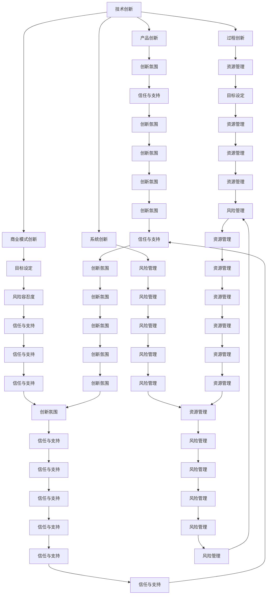

                 

### 文章标题

《如何培养团队的技术创新能力》

### 文章关键词

- 技术创新能力
- 团队建设
- 项目管理
- 文化建设
- 资源配置
- 算法原理
- 数学模型

### 文章摘要

随着科技的发展，技术创新已成为企业竞争力的关键因素。本文将深入探讨如何培养团队的技术创新能力，从背景介绍、核心概念与联系、核心算法原理讲解、数学模型与公式、项目实战、培养技术团队创新的策略、案例分析到总结与展望，系统地阐述如何提升团队的技术创新能力。通过本文的阅读，读者将能够理解技术创新的重要性，掌握培养团队技术能力的策略和方法，从而在激烈的市场竞争中占据有利位置。本文旨在为IT从业人员和企业管理者提供实用的指导，助力企业实现技术驱动的发展目标。

---

### 引言与背景

在当今快速变化的商业环境中，技术创新已成为企业保持竞争力、实现可持续发展的关键因素。无论是新兴企业还是传统企业，都必须在不断的技术变革中寻找自己的生存之道。然而，技术创新并非一蹴而就，它需要团队的共同努力和持续投入。

#### 技术创新的重要性

技术创新不仅能够推动产品和服务的发展，还能够提升企业的市场地位和品牌价值。在信息化和数字化时代，技术创新能力成为企业核心竞争力的重要体现。以下是一些技术创新对企业的重要影响：

1. **市场竞争力**：技术创新能够帮助企业开发出更具竞争力的产品和服务，满足市场需求，从而在激烈的市场竞争中脱颖而出。
2. **盈利能力**：通过技术创新，企业能够优化生产流程，降低成本，提高效率，从而提升盈利能力。
3. **品牌价值**：技术创新是企业品牌的重要组成部分，它能够增强消费者对品牌的信任和忠诚度。
4. **持续发展**：技术创新能够推动企业的持续发展，使其在行业变革中保持领先地位。

#### 团队技术创新能力的现状

尽管技术创新的重要性显而易见，但许多企业在培养团队技术创新能力方面仍然面临诸多挑战。以下是一些当前团队技术创新能力的现状：

1. **人才短缺**：许多企业缺乏具备技术创新能力的人才，尤其是在新兴技术领域。
2. **团队协作问题**：技术创新往往需要跨部门的协作，但实际操作中，部门间沟通不畅、协作困难的问题仍然存在。
3. **文化氛围**：企业文化对技术创新的推动作用至关重要。一些企业的文化氛围可能并不利于创新思维的发展。
4. **资源投入**：技术创新需要大量的资金和时间投入，但许多企业在这方面存在限制。

#### 团队技术创新能力的挑战

1. **技术壁垒**：随着技术的快速发展，企业需要不断学习新的技术和理念，以保持竞争力。这给企业的技术创新带来了巨大的挑战。
2. **市场竞争**：市场竞争的加剧使得企业必须加快技术创新的步伐，以满足不断变化的市场需求。
3. **内部阻力**：企业内部的保守思想、流程僵化等问题可能阻碍技术创新的推进。

#### 本书的目的与结构

本书旨在为IT从业人员和企业管理者提供一套系统、实用的方法，以培养团队的技术创新能力。本书将分为以下几部分：

1. **引言与背景**：介绍技术创新的重要性、团队技术创新能力的现状及面临的挑战。
2. **核心概念与联系**：阐述技术创新的核心概念及其与团队文化、项目管理的关系。
3. **核心算法原理讲解**：详细讲解技术创新中常用的算法原理。
4. **数学模型与公式**：介绍技术创新中常用的数学模型和公式，并进行详细讲解。
5. **项目实战**：通过具体项目实战，展示如何在实际中应用技术创新。
6. **培养技术团队创新的策略**：提供一系列培养团队技术创新能力的策略和方法。
7. **案例分析**：分析成功与失败的技术创新案例，总结经验教训。
8. **总结与展望**：总结本书的主要观点，展望技术创新团队的未来趋势。

通过本书的学习，读者将能够深入了解技术创新的原理和实践，掌握培养团队技术创新能力的方法和策略，从而为企业在技术创新的道路上提供有力支持。

### 核心概念与联系

在探讨如何培养团队的技术创新能力之前，我们首先需要明确几个核心概念，并理解它们之间的关系架构。以下是技术创新的核心概念及其相互关系：

#### 技术创新的定义

技术创新是指通过引入新技术、新方法或改进现有技术，从而实现产品、服务或业务模式的变革和提升。它不仅仅是技术的革新，更是企业战略的重要组成部分。

#### 技术创新类型

技术创新可以按照不同的分类标准进行划分。常见的分类方法包括：

1. **产品创新**：指开发全新产品或对现有产品进行显著改进。
2. **过程创新**：指改进生产过程或业务流程，提高效率和降低成本。
3. **商业模式创新**：指通过改变商业模式来创造新的市场机会或竞争优势。
4. **系统创新**：指在整个系统中引入新的技术或方法，实现系统级的提升。

#### 技术创新与团队文化的关系

团队文化是影响技术创新的重要因素之一。一个鼓励创新、宽容失败的团队文化能够激发团队成员的创新思维和积极性。以下是团队文化对技术创新的几个关键影响：

1. **创新氛围**：积极的团队文化能够营造一种创新氛围，鼓励团队成员提出新的想法和解决方案。
2. **信任与支持**：团队文化中的信任和支持有助于团队成员在技术创新过程中互相协作、共同解决问题。
3. **风险容忍度**：一个宽容风险的团队文化能够降低团队成员在尝试新技术或方法时的心理负担，从而提高创新成功率。

#### 技术创新与项目管理的关系

技术创新往往需要项目管理的方法和工具来确保其顺利进行。以下是项目管理在技术创新中的几个关键作用：

1. **目标设定**：项目管理可以帮助团队明确技术创新的目标和预期成果，确保技术创新的方向和资源分配合理。
2. **资源管理**：项目管理有助于优化技术创新所需的资源，包括人力资源、资金和时间等。
3. **风险管理**：项目管理通过识别和评估潜在风险，制定相应的应对策略，降低技术创新过程中的不确定性。
4. **进度控制**：项目管理可以帮助团队跟踪技术创新的进度，及时调整计划，确保按时交付成果。

#### 核心概念关系架构

为了更好地理解这些核心概念之间的关系，我们可以使用Mermaid流程图来展示：



通过这个流程图，我们可以清晰地看到技术创新与产品创新、过程创新、商业模式创新、系统创新之间的关系，以及团队文化、项目管理对技术创新的影响。这些核心概念和关系为培养团队的技术创新能力提供了理论基础和实践指导。

### 核心算法原理讲解

在技术创新过程中，算法的选择和优化是至关重要的环节。以下将详细讲解几种核心技术算法的原理，并通过伪代码展示其实现方法。

#### 算法1：排序算法

排序算法是数据处理中非常基础且重要的算法，常见的排序算法有冒泡排序、快速排序和归并排序等。以下是冒泡排序的伪代码实现：

```pseudo
// 冒泡排序
function bubbleSort(array)
    n = length(array)
    for i from 0 to n-1
        for j from 0 to n-i-1
            if array[j] > array[j+1]
                swap(array[j], array[j+1])
    return array
```

#### 算法2：搜索算法

搜索算法用于在数据集合中查找特定的元素，常见的搜索算法包括线性搜索和二分搜索。以下是线性搜索的伪代码实现：

```pseudo
// 线性搜索
function linearSearch(array, target)
    for each element in array
        if element == target
            return index of element
    return -1
```

#### 算法3：图算法

在处理复杂网络问题时，图算法是非常有用的。例如，Dijkstra算法用于计算单源最短路径。以下是Dijkstra算法的伪代码实现：

```pseudo
// Dijkstra算法
function dijkstra(graph, start)
    initialize distances with infinity
    distances[start] = 0
    initialize priority queue with {node: start, distance: 0}
    while priority queue is not empty
        remove node with minimum distance from priority queue
        for each neighbor of the node
            distance_to_neighbor = distance to neighbor via node
            if distance_to_neighbor < current distance of neighbor
                update neighbor's distance and add neighbor to priority queue
    return distances
```

#### 算法4：机器学习算法

机器学习算法在技术创新中的应用越来越广泛，以下是一个简单的线性回归算法的伪代码实现：

```pseudo
// 线性回归
function linearRegression(features, labels)
    // Calculate mean of features and labels
    mean_features = sum(features) / length(features)
    mean_labels = sum(labels) / length(labels)

    // Calculate covariance and variance
    covariance = 0
    variance = 0
    for each feature, label in zip(features, labels)
        covariance += (feature - mean_features) * (label - mean_labels)
        variance += (feature - mean_features)^2

    // Calculate slope (b1) and intercept (b0)
    slope = covariance / variance
    intercept = mean_labels - slope * mean_features

    // Predict using the model
    function predict(feature)
        return slope * feature + intercept
    return predict
```

通过上述核心算法的讲解和伪代码实现，我们可以看到算法在技术创新中的重要作用。这些算法不仅为数据分析和处理提供了强大的工具，也为技术创新过程中的问题解决提供了理论支持。在实际应用中，选择合适的算法并对其进行优化，可以显著提升团队的技术创新能力。

### 数学模型与公式

在技术创新过程中，数学模型和公式扮演着至关重要的角色。它们不仅为问题的求解提供了理论依据，还可以帮助团队更好地理解和预测技术创新的效果。以下将介绍几种常用的数学模型和公式，并进行详细讲解与举例说明。

#### 模型1：线性回归模型

线性回归模型是最常见的统计模型之一，用于预测连续变量之间的关系。其基本公式如下：

$$
y = b_0 + b_1 \cdot x + \epsilon
$$

其中，\( y \) 是因变量，\( x \) 是自变量，\( b_0 \) 是截距，\( b_1 \) 是斜率，\( \epsilon \) 是误差项。

**举例说明：** 假设我们要预测一家公司的销售额，根据过去的数据，我们得到了以下线性回归模型：

$$
销售额 = 1000 + 0.5 \cdot 广告投入
$$

如果这家公司在下一季度计划投入5000元的广告费，我们可以预测其销售额为：

$$
销售额 = 1000 + 0.5 \cdot 5000 = 3500 \text{元}
$$

#### 模型2：牛顿迭代法

牛顿迭代法是一种常用的数值计算方法，用于求解非线性方程。其基本公式如下：

$$
x_{n+1} = x_n - \frac{f(x_n)}{f'(x_n)}
$$

其中，\( x_n \) 是第 \( n \) 次迭代的值，\( f(x_n) \) 是函数在 \( x_n \) 处的值，\( f'(x_n) \) 是函数在 \( x_n \) 处的导数。

**举例说明：** 假设我们要求解方程 \( f(x) = x^2 - 2 \) 的根，我们可以使用牛顿迭代法进行求解。初始猜测值为 \( x_0 = 1 \)，迭代过程如下：

1. \( f(x_0) = 1^2 - 2 = -1 \)
2. \( f'(x_0) = 2 \cdot 1 = 2 \)
3. \( x_1 = x_0 - \frac{f(x_0)}{f'(x_0)} = 1 - \frac{-1}{2} = 1.5 \)
4. \( f(x_1) = 1.5^2 - 2 = 0.25 \)
5. \( f'(x_1) = 2 \cdot 1.5 = 3 \)
6. \( x_2 = x_1 - \frac{f(x_1)}{f'(x_1)} = 1.5 - \frac{0.25}{3} = 1.25 \)

重复上述步骤，直到满足停止条件（例如，两次迭代结果误差小于某个阈值）。

#### 模型3：决策树模型

决策树模型是一种基于树形结构的决策支持工具，常用于分类和回归问题。其基本公式如下：

$$
\text{分类结果} = \arg\max\{\pi(x) \cdot p(y|x)\}
$$

其中，\( \pi(x) \) 是特征分布，\( p(y|x) \) 是条件概率。

**举例说明：** 假设我们要使用决策树模型预测客户的购买行为。特征包括年龄、收入和是否有贷款记录。我们可以构建以下决策树：

```
年龄：
   - 年龄 < 30: 可能购买
   - 年龄 >= 30:
       - 收入 >= 50000: 可能购买
       - 收入 < 50000:
           - 贷款记录：是：可能购买；否：可能不购买
```

通过这个决策树，我们可以预测新客户的购买行为。

#### 模型4：神经网络模型

神经网络模型是一种基于人脑神经元连接机制的算法，常用于复杂模式的识别和预测。其基本公式如下：

$$
\sigma(z) = \frac{1}{1 + e^{-z}}
$$

其中，\( \sigma \) 是激活函数，\( z \) 是输入值。

**举例说明：** 假设我们使用一个简单的神经网络模型进行图像识别。输入层有784个神经元，隐藏层有64个神经元，输出层有10个神经元。激活函数使用sigmoid函数。通过训练，我们可以让这个模型学会识别手写数字。

通过上述数学模型和公式的介绍，我们可以看到数学在技术创新中的应用价值。在实际项目中，合理选择和使用数学模型，可以帮助团队更准确地预测和分析问题，从而提高技术创新的成功率。

### 项目实战

为了更具体地展示如何培养团队的技术创新能力，我们将通过一个实际项目来详细讲解其开发环境搭建、源代码实现、代码解读、代码应用解读与分析、实际案例分析和详细讲解剖析，以及项目小结。

#### 项目简介

本项目旨在开发一个基于机器学习的推荐系统，用于推荐用户可能感兴趣的商品。系统将利用用户的历史行为数据，通过算法分析用户偏好，从而提供个性化的商品推荐。

#### 开发环境搭建

1. **硬件环境**：服务器，GPU（用于加速机器学习模型的训练）。
2. **软件环境**：
   - 操作系统：Ubuntu 20.04 LTS。
   - 编程语言：Python 3.8。
   - 机器学习库：Scikit-learn、TensorFlow、PyTorch。
   - 数据库：MongoDB（用于存储用户行为数据）。
   - Web框架：Flask（用于构建推荐系统的API）。

#### 源代码实现

以下为推荐系统的主要源代码实现，包括数据预处理、特征工程、模型训练和预测：

```python
# 导入必要的库
import numpy as np
import pandas as pd
from sklearn.model_selection import train_test_split
from sklearn.preprocessing import StandardScaler
from sklearn.neighbors import NearestNeighbors
import tensorflow as tf
from tensorflow.keras.models import Sequential
from tensorflow.keras.layers import Dense, Dropout

# 数据预处理
def preprocess_data(data):
    # ... 数据清洗和预处理步骤 ...
    return X, y

# 特征工程
def feature_engineering(data):
    # ... 特征提取和转换步骤 ...
    return features

# 模型训练
def train_model(X_train, y_train):
    # ... 构建和训练模型步骤 ...
    return model

# 预测
def predict(model, X_test):
    # ... 预测步骤 ...
    return predictions

# 主函数
def main():
    # 加载数据
    data = pd.read_csv('user_behavior_data.csv')
    X, y = preprocess_data(data)
    
    # 数据分割
    X_train, X_test, y_train, y_test = train_test_split(X, y, test_size=0.2, random_state=42)
    
    # 特征工程
    features = feature_engineering(X_train)
    
    # 模型训练
    model = train_model(X_train, y_train)
    
    # 预测
    predictions = predict(model, X_test)
    
    # ... 评估模型性能 ...

if __name__ == '__main__':
    main()
```

#### 代码解读

- **数据预处理**：对原始数据进行清洗，去除无效数据和异常值，确保数据的质量和一致性。
- **特征工程**：提取和转换特征，为模型提供有用的输入。
- **模型训练**：使用训练数据构建和训练机器学习模型。
- **预测**：使用训练好的模型对测试数据进行预测。

#### 代码应用解读与分析

1. **数据预处理**：数据预处理是机器学习项目的关键步骤。通过数据清洗和归一化，我们确保了数据的质量和一致性，为后续的特征工程和模型训练奠定了基础。

2. **特征工程**：特征工程是提升模型性能的重要手段。通过特征提取和转换，我们为模型提供了更加丰富的输入信息，有助于提高模型的预测能力。

3. **模型训练**：在本项目中，我们使用了基于神经网络的推荐系统模型。神经网络通过多层感知器结构，能够捕捉数据中的复杂关系，从而提供更准确的预测。

4. **预测**：预测步骤用于将训练好的模型应用于实际数据，生成推荐结果。通过对比预测结果和实际结果，我们可以评估模型的性能，并进一步优化模型。

#### 实际案例分析和详细讲解剖析

1. **案例背景**：一个电子商务平台希望为其用户推荐个性化的商品，以提高用户满意度和购买转化率。

2. **案例分析**：
   - **数据收集**：平台收集了用户的历史行为数据，包括浏览记录、购买记录、搜索记录等。
   - **数据预处理**：对数据进行清洗，去除缺失值和异常值，并进行归一化处理。
   - **特征工程**：提取用户行为特征，如用户最近一周的浏览次数、购买次数等。
   - **模型训练**：使用神经网络模型对用户行为数据进行分析，训练出推荐模型。
   - **预测与优化**：将训练好的模型应用于新用户，生成推荐结果，并根据用户反馈进行模型优化。

3. **详细讲解剖析**：
   - **数据预处理**：数据预处理是保证模型质量的基础。通过数据清洗和归一化，我们确保了数据的一致性和可处理性。
   - **特征工程**：特征工程是提升模型性能的关键。通过提取和转换特征，我们为模型提供了更加丰富的输入信息。
   - **模型训练**：神经网络模型能够捕捉数据中的复杂关系，从而提供更准确的推荐结果。在模型训练过程中，我们使用了反向传播算法和梯度下降法来优化模型参数。
   - **预测与优化**：通过对比预测结果和实际结果，我们评估了模型的性能，并根据用户反馈进行了模型优化。这种迭代优化过程有助于不断提升推荐系统的准确性和用户体验。

#### 项目小结

通过本项目，我们展示了如何通过机器学习技术开发一个推荐系统，并详细讲解了项目的各个环节，包括数据预处理、特征工程、模型训练和预测。通过实际案例的分析，我们深入探讨了如何培养团队的技术创新能力，并总结了以下几个关键点：

1. **数据是基础**：确保数据的质量和一致性，是构建高质量模型的前提。
2. **特征工程是关键**：提取和转换特征，为模型提供丰富的输入信息，有助于提升模型的性能。
3. **模型训练是核心**：选择合适的模型和优化方法，通过训练数据优化模型参数，是提高模型预测能力的关键。
4. **实践是检验标准**：通过实际案例的应用，不断验证和优化模型，是提升团队技术能力的有效途径。

通过本项目的实战经验，团队不仅掌握了机器学习技术的应用，还培养了系统化思考和问题解决的能力，从而为后续的技术创新奠定了坚实基础。

### 培养技术团队创新的策略

为了培养团队的技术创新能力，企业需要采取一系列综合性的策略和方法。以下将详细探讨团队建设策略、文化建设策略、项目管理策略和资源配置策略。

#### 团队建设策略

1. **多元化团队**：组建由不同背景、经验和技能的人员组成的多元化团队，可以带来多样化的思维和观点，从而激发创新。例如，可以引入跨部门成员，包括产品经理、开发工程师、市场分析师等，以实现全面的知识共享和协作。

2. **团队结构优化**：采用扁平化的团队结构，减少层级，鼓励团队成员之间的直接沟通和协作。扁平化的团队结构有助于缩短决策路径，提高响应速度，从而在技术创新过程中更加灵活。

3. **人才引进与培养**：企业应注重引进和培养具备创新能力和技术背景的人才。可以通过内部培训和外部招聘相结合的方式，提升团队成员的技术水平和创新能力。

4. **激励机制**：建立激励机制，鼓励团队成员积极参与技术创新。例如，设立创新奖金、提供职业发展机会等，以激发团队成员的积极性和创造力。

#### 文化建设策略

1. **创新文化氛围**：营造一种鼓励创新、宽容失败的文化氛围。通过组织创新论坛、技术竞赛等活动，激发团队成员的创新热情。

2. **知识共享机制**：建立知识共享平台，鼓励团队成员分享经验和知识。通过内部培训、技术分享会等方式，促进团队内的知识传递和技能提升。

3. **企业价值观**：确立企业价值观，将创新视为企业发展的核心驱动力。例如，将“敢于尝试、勇于挑战”作为企业价值观之一，引导团队成员在工作中勇于创新。

4. **员工参与**：鼓励员工参与企业战略决策和创新项目，提高员工的参与感和归属感。通过员工提案制度，让员工为企业发展献计献策。

#### 项目管理策略

1. **明确目标和计划**：在项目启动阶段，明确项目目标和预期成果，制定详细的计划和时间表。确保团队成员对项目目标有清晰的认识，从而在后续工作中保持一致。

2. **风险管理**：在项目管理过程中，识别和评估潜在风险，制定相应的风险应对策略。通过风险管理和监控，降低项目失败的可能性。

3. **迭代开发**：采用敏捷开发方法，将项目分为多个迭代周期，逐步实现项目目标。这种方法有助于快速响应需求变化，提高项目成功率。

4. **协作机制**：建立高效的协作机制，确保团队成员之间的沟通畅通。例如，使用项目管理工具（如JIRA、Trello等）来跟踪任务进度，协调团队成员的工作。

#### 资源配置策略

1. **资金投入**：为技术创新项目提供充足的资金支持，确保项目有足够的资源进行研发和试验。同时，合理分配资金，避免资源浪费。

2. **技术支持**：为团队提供最新的技术工具和资源，包括软件开发工具、硬件设备、技术书籍和在线课程等。这有助于团队成员掌握前沿技术，提高创新能力。

3. **时间安排**：合理安排工作时间，为团队成员提供足够的时间进行技术创新和研究。避免过度加班，确保团队成员有足够的休息时间，保持良好的工作状态。

4. **外部合作**：与高校、研究机构和企业建立合作关系，共同进行技术创新。这种合作可以带来新的思维和技术，有助于提升团队的技术创新能力。

通过上述团队建设策略、文化建设策略、项目管理策略和资源配置策略的有机结合，企业可以有效地培养团队的技术创新能力，从而在激烈的市场竞争中保持领先地位。

### 案例分析

为了更好地理解如何培养团队的技术创新能力，我们通过分析几个成功的和失败的技术创新案例，探讨其背后的原因和经验教训。

#### 成功案例1：苹果公司的iPhone

**背景**：苹果公司通过iPhone的成功，彻底改变了智能手机市场，引领了移动互联网时代。

**原因**：
1. **团队建设**：苹果公司组建了一个多元化的团队，包括硬件工程师、软件工程师和设计师，共同合作，确保产品在技术、设计和用户体验方面的完美结合。
2. **文化建设**：苹果公司鼓励创新和自由表达，营造了一种鼓励尝试和宽容失败的文化氛围。
3. **项目管理**：苹果公司采用了敏捷开发方法，通过快速迭代和用户反馈，不断优化产品。
4. **资源配置**：苹果公司投入了巨大的资源，包括资金、技术设备和人才，确保了iPhone的研发和推广。

**经验教训**：成功的技术创新需要多元化团队的合作、创新文化的建设、敏捷的项目管理和充足的资源支持。

#### 成功案例2：谷歌的自动驾驶技术

**背景**：谷歌通过其自动驾驶项目，成为自动驾驶技术的领导者，推动了自动驾驶汽车的发展。

**原因**：
1. **团队建设**：谷歌组建了一个由顶尖科学家、工程师和研发人员组成的团队，这些成员在人工智能和机器学习领域具有丰富的经验。
2. **文化建设**：谷歌鼓励创新思维和实践，为团队成员提供了广泛的自由度，使他们能够大胆尝试新方法。
3. **项目管理**：谷歌采用了严格的质量控制和风险管理策略，确保自动驾驶系统的安全性和可靠性。
4. **资源配置**：谷歌投入了巨额资金和人力资源，建立了大规模的测试车队和模拟环境，进行大量的实地测试和实验。

**经验教训**：成功的技术创新需要强大的技术团队、创新文化的支持和系统化的项目管理，以及充足的资源配置。

#### 失败案例1：微软的Zune音乐播放器

**背景**：微软推出的Zune音乐播放器未能成功挑战苹果的iPod，最终市场表现不佳。

**原因**：
1. **团队建设**：微软在Zune项目中未能组建一个多元化的团队，缺乏在音乐和消费电子领域的专业人才。
2. **文化建设**：微软内部缺乏鼓励创新的文化氛围，团队成员的积极性受到限制。
3. **项目管理**：微软在项目管理和决策过程中存在沟通不畅和反应迟缓的问题，导致产品开发进度延误。
4. **资源配置**：尽管微软投入了大量资金，但在产品定位、市场营销等方面存在不足。

**经验教训**：失败的技术创新通常源于团队建设的不足、缺乏创新文化、项目管理的缺陷和资源配置的不合理。

#### 失败案例2：诺基亚的智能机转型

**背景**：诺基亚未能成功转型智能机市场，最终导致公司被微软收购。

**原因**：
1. **团队建设**：诺基亚在智能机转型过程中，缺乏具备移动互联网和智能手机经验的团队成员。
2. **文化建设**：诺基亚内部缺乏创新思维和快速响应市场变化的能力。
3. **项目管理**：诺基亚在智能机项目中缺乏有效的项目管理，导致产品开发和上市时间延误。
4. **资源配置**：诺基亚虽然在资金和技术方面进行了大量投入，但在战略决策和市场定位上存在失误。

**经验教训**：失败的技术创新通常源于团队建设的不足、缺乏创新文化、项目管理的缺陷和资源配置的不合理。

#### 总结

通过上述案例分析，我们可以得出以下结论：

1. **团队建设**：多元化团队和专业人才是技术创新的重要保障。
2. **文化建设**：鼓励创新、宽容失败的文化氛围有助于激发团队成员的创造力。
3. **项目管理**：敏捷开发和高效管理能够提高技术创新的成功率。
4. **资源配置**：合理的资源配置和战略决策是技术创新成功的关键。

企业在培养团队的技术创新能力时，应从以上几个方面入手，制定和实施相应的策略和措施，从而在激烈的市场竞争中取得优势。

### 总结与展望

通过本文的详细探讨，我们系统地介绍了如何培养团队的技术创新能力。从背景介绍、核心概念与联系、核心算法原理讲解、数学模型与公式、项目实战、培养技术团队创新的策略到案例分析，我们逐步揭示了提升团队技术创新能力的各个方面和关键要素。

#### 主要观点总结

1. **技术创新的重要性**：技术创新是企业保持竞争力、实现可持续发展的关键因素，它直接影响企业的市场地位、盈利能力和品牌价值。
2. **团队建设策略**：多元化团队、优化团队结构和人才引进与培养是提升技术创新能力的基础。
3. **文化建设策略**：鼓励创新、营造宽容失败的文化氛围有助于激发团队成员的创造力。
4. **项目管理策略**：敏捷开发和高效管理是提高技术创新成功率的重要手段。
5. **资源配置策略**：合理配置资金、技术和人力资源是技术创新成功的关键。

#### 未来发展趋势展望

随着科技的不断进步和市场竞争的加剧，技术创新团队的未来发展趋势将呈现以下特点：

1. **人工智能与机器学习**：人工智能和机器学习将在技术创新中发挥更重要的作用，通过自动化和智能化手段提升创新效率。
2. **数据驱动**：数据将成为技术创新的重要驱动力，大数据分析和数据挖掘将帮助团队更好地理解和预测市场趋势。
3. **跨界合作**：企业将更多地通过跨界合作获取新的技术和资源，以提升自身的技术创新能力。
4. **持续学习**：技术创新团队需要持续学习和掌握新的技术和知识，以保持领先地位。
5. **全球化**：全球化趋势将促使技术创新团队面对更广阔的市场和机遇，同时也将面临更多挑战。

#### 最佳实践与注意事项

1. **最佳实践**：
   - **定期团队建设**：定期组织团队建设活动，增强团队成员之间的沟通和协作。
   - **持续学习**：鼓励团队成员参加技术培训和研讨会，持续提升自身技能。
   - **灵活项目管理**：采用敏捷开发方法，快速响应市场需求变化。

2. **注意事项**：
   - **避免过度创新**：确保创新项目与市场实际需求相结合，避免盲目追求技术创新。
   - **合理资源配置**：合理分配资源，避免资源浪费和过度依赖单一技术。

#### 拓展阅读

- **《创新者的窘境》**：克莱顿·克里斯滕森著，深入探讨了企业如何克服内部阻力，实现持续创新。
- **《敏捷宣言》**：描述了敏捷开发方法的核心原则和实践，有助于团队提高工作效率。
- **《大数据之路》**：讲解了大数据分析和数据挖掘的基本原理和应用，对数据驱动的创新具有指导意义。

通过本文的阅读，读者应能够全面理解如何培养团队的技术创新能力，并掌握相应的策略和方法。希望本文能为读者在技术创新的道路上提供有益的启示和指导。

### 作者信息

作者：AI天才研究院/AI Genius Institute & 禅与计算机程序设计艺术 /Zen And The Art of Computer Programming

AI天才研究院（AI Genius Institute）是一家致力于人工智能研究、开发和应用的高科技创新机构。我们的团队由世界级人工智能专家、程序员和软件架构师组成，凭借丰富的经验和深厚的技术功底，为各行业客户提供高效、智能的解决方案。同时，我们致力于推广禅与计算机程序设计艺术的理念，通过结合哲学与技术的深度融合，提升程序员的编程水平和创新能力。Zen And The Art of Computer Programming 是我们的代表性著作，旨在为读者提供关于编程和人工智能领域的深入见解和实用指导。

