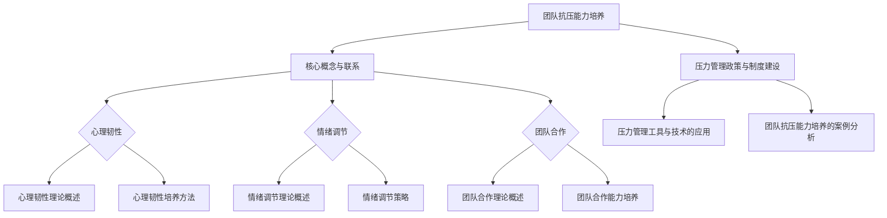

                 

### 文章标题

如何培养团队的抗压能力

> 关键词：团队抗压能力、心理韧性、情绪调节、团队合作

> 摘要：
本文将深入探讨团队抗压能力的培养，分析压力的来源与影响，阐述团队抗压能力的重要性，并从心理韧性、情绪调节和团队合作三个方面提出具体的培养策略。通过实际案例和理论分析，帮助读者理解如何有效提升团队抗压能力，以应对日益复杂的工作环境。

## 第一部分：团队抗压能力概述

### 1.1 压力的来源与影响

压力是现代工作中不可避免的现象，它可能来自多个方面，包括但不限于以下几个方面：

- **工作负荷**：随着工作任务的不断增加和复杂化，员工往往需要投入更多的时间和精力来完成工作，导致工作负荷加重。

- **人际关系**：工作中的协作和沟通往往需要处理复杂的人际关系，如与同事、上级和客户之间的互动，这些互动可能会产生压力。

- **期望值**：个人和组织对员工的工作表现有期望，当实际表现未能达到预期时，会产生压力。

- **组织环境**：组织文化、管理风格、工作流程等因素也会对员工的工作压力产生影响。

压力对团队的影响是多方面的，其中包括：

- **心理健康**：长期的压力可能导致心理健康问题，如焦虑、抑郁等。

- **工作效率**：压力可能会影响员工的工作效率和准确性，降低团队的整体绩效。

- **团队氛围**：压力过大可能会破坏团队之间的信任和协作，导致团队氛围紧张。

### 1.2 压力管理的重要性

有效的压力管理对于团队和个体都有着重要的意义：

- **提高团队绩效**：通过减少员工的压力，可以提高员工的工作满意度和工作效率，从而提升团队的整体绩效。

- **促进个人成长**：面对压力时，个体有机会学习和成长，提高自己的应对能力。

- **减少离职率**：一个压力管理良好的团队，员工更愿意长期留在公司，减少员工的离职率。

### 1.3 团队抗压能力的概念与内涵

团队抗压能力是指团队在面对压力时，能够适应并克服困难的能力。它包括以下几个方面的内涵：

- **心理韧性**：心理韧性是指个体在遭遇压力、挑战和逆境时，能够迅速恢复并表现出积极的适应能力。

- **情绪调节**：情绪调节是指个体在面对情绪波动时，能够有效地识别、理解和调节自己的情绪。

- **团队合作**：团队合作是指团队成员之间能够有效沟通、协作，共同完成任务。

### 1.4 本部分小结

本部分对团队抗压能力的背景进行了详细阐述，分析了压力的来源与影响，强调了压力管理的重要性，并介绍了团队抗压能力的概念与内涵。接下来，我们将深入探讨团队抗压能力的培养策略。

## 第二部分：团队抗压能力的培养策略

### 2.1 心理韧性培养

#### 2.1.1 心理韧性理论概述

心理韧性（Psychological Resilience）是指个体在遭遇压力、挑战和逆境时，能够迅速恢复并表现出积极适应能力的一种心理特质。心理韧性不仅有助于个体应对压力，还能促进其个人成长和发展。

心理韧性的定义可以从以下几个方面来理解：

- **适应性恢复**：在面对压力时，个体能够快速适应变化，恢复到正常状态。

- **积极应对**：个体在面对逆境时，能够保持乐观的态度，积极寻找解决问题的方法。

- **心理弹性**：个体在遭受挫折和困难后，能够迅速恢复，并在未来遇到类似情况时表现出更强的适应能力。

心理韧性理论的基本模型包括以下几个关键因素：

- **内在资源**：个体拥有的心理资源和能力，如自我效能感、乐观态度、自我肯定等。

- **外在资源**：个体所拥有的外部支持，如家庭、朋友、社会网络等。

- **压力源**：引发个体心理压力的外部事件和情境。

#### 2.1.2 心理韧性培养方法

培养团队的心理韧性需要采取一系列策略，以下是一些常用的方法：

- **积极心理训练**：通过正念冥想、情绪管理训练、自我肯定训练等方法，提高个体的心理韧性。

- **面对困难的应对策略**：教育团队成员如何面对挫折和困难，培养其解决问题的能力和应对策略。

- **情绪调节训练**：帮助团队成员学会识别和调节自己的情绪，减少负面情绪对心理韧性的影响。

- **危机干预**：在团队成员遭遇重大压力或危机时，提供及时的心理支持和服务。

#### 2.1.3 案例分析：提升心理韧性的实践

**案例一：某公司员工压力管理项目**

某公司在面对市场竞争加剧和内部变革的挑战时，意识到员工的心理韧性是提升团队整体绩效的关键。为此，公司实施了一系列心理韧性提升项目，包括：

1. **员工心理健康调查**：公司通过定期开展心理健康调查，了解员工的心理状态和压力源，为制定针对性的心理韧性培养策略提供依据。

2. **心理韧性培训**：公司邀请专业心理培训师为员工提供心理韧性培训，内容包括情绪管理、压力应对策略、自我效能感提升等。

3. **员工心理辅导**：公司设立员工心理辅导室，为有需要的员工提供一对一的心理咨询服务，帮助其解决心理问题，提升心理韧性。

**案例二：团队心理韧性提升计划**

某团队在项目执行过程中，发现团队成员在面对突发情况时，常常表现出恐慌和无助。为了提升团队的心理韧性，团队采取以下措施：

1. **建立团队支持系统**：团队建立了内部支持小组，成员之间相互鼓励，分享应对压力的经验和策略。

2. **定期团队建设活动**：团队定期开展团队建设活动，如户外拓展、团队游戏等，增强团队成员之间的信任和凝聚力。

3. **心理韧性培训**：团队邀请心理专家为成员提供心理韧性培训，学习情绪调节和压力管理的技巧。

通过这些措施，团队成员的心理韧性得到了显著提升，团队在面对压力和挑战时，能够更加冷静和有效地应对。

### 2.2 情绪调节能力的培养

#### 2.2.1 情绪调节理论概述

情绪调节（Emotional Regulation）是指个体在面对情绪刺激时，能够有效地识别、理解、调节自己的情绪，以达到情绪平衡和稳定。情绪调节是心理韧性的重要组成部分，对于提升个体的心理韧性和生活质量具有重要意义。

情绪调节的理论模型主要包括以下几个方面：

- **情绪识别**：个体能够准确识别和理解自己的情绪状态。

- **情绪表达**：个体能够适当地表达自己的情绪，避免情绪压抑或过度表达。

- **情绪调节策略**：个体采用的一系列策略来调节自己的情绪，如认知重构、情绪释放、情绪转移等。

情绪调节的作用主要体现在以下几个方面：

- **改善心理健康**：有效的情绪调节有助于缓解焦虑、抑郁等心理问题，提高心理健康水平。

- **提升生活质量**：情绪调节有助于个体更好地应对生活中的压力和挑战，提高生活质量。

- **促进人际关系**：情绪调节有助于个体更好地处理人际关系，减少冲突和矛盾。

#### 2.2.2 情绪调节策略

培养情绪调节能力需要采取一系列策略，以下是一些常用的方法：

- **情绪识别与认知重构**：个体需要学会识别自己的情绪，并通过认知重构来改变对情绪的误解和负面认知。

- **情绪释放与转移**：个体可以通过适当的渠道释放情绪，如运动、倾诉等，或将情绪转移到其他活动上，以减轻情绪压力。

- **情绪调节训练**：通过心理训练，如正念冥想、情绪管理课程等，提高个体的情绪调节能力。

- **心理支持与干预**：在个体遇到情绪问题时，提供及时的心理支持和干预，帮助其调节情绪。

#### 2.2.3 案例分析：情绪调节在团队中的应用

**案例一：某公司员工情绪管理培训**

某公司为了提高员工的情绪调节能力，开展了一系列情绪管理培训。培训内容包括：

1. **情绪识别与表达**：通过案例分析和工作坊，帮助员工学会识别和理解自己的情绪，并学会适当地表达情绪。

2. **认知重构**：培训师通过认知重构的方法，帮助员工改变对情绪的负面认知，提升情绪调节能力。

3. **情绪释放与转移**：通过运动、音乐、艺术等形式的体验活动，帮助员工学会释放情绪，并找到适合自己的情绪转移方式。

**案例二：团队情绪调节实践**

某团队在项目执行过程中，发现团队成员的情绪波动较大，影响了团队的协作和效率。为了改善团队情绪，团队采取以下措施：

1. **建立情绪共享机制**：团队设立了情绪共享会议，成员可以在会议中分享自己的情绪和压力，共同探讨应对策略。

2. **定期情绪调节活动**：团队定期组织情绪调节活动，如瑜伽、冥想、团队游戏等，帮助成员缓解压力，调节情绪。

3. **心理支持与辅导**：团队邀请专业心理咨询师为成员提供心理支持与辅导，帮助其处理情绪问题，提升情绪调节能力。

通过这些措施，团队成员的情绪调节能力得到了显著提升，团队的整体情绪氛围也变得更加积极和谐。

### 2.3 团队合作的培养

#### 2.3.1 团队合作理论概述

团队合作（Team Collaboration）是指团队成员在共同目标指导下，通过有效沟通、协作和合作，共同完成任务的过程。团队合作是团队成功的关键因素之一，它有助于提高团队的绩效和满意度。

团队合作的理论模型主要包括以下几个方面：

- **团队目标**：团队目标是指团队成员共同追求的目标和愿景，是团队合作的核心。

- **沟通与协作**：沟通与协作是团队合作的基础，有效的沟通和协作有助于团队成员相互理解和支持。

- **团队氛围**：团队氛围是指团队成员之间的相互关系和氛围，对团队合作有着重要影响。

团队合作的重要性体现在以下几个方面：

- **提高工作效率**：团队合作可以充分发挥团队成员的专业技能和经验，提高工作效率。

- **提升团队绩效**：团队合作有助于实现团队的整体目标，提高团队绩效。

- **增强团队凝聚力**：团队合作有助于增强团队成员之间的信任和凝聚力，提高团队的整体士气。

#### 2.3.2 团队合作能力培养

培养团队合作能力需要采取一系列策略，以下是一些常用的方法：

- **沟通技巧与协作方式**：通过培训和实践，提高团队成员的沟通技巧和协作能力。

- **冲突管理与解决**：通过有效的冲突管理和解决机制，减少团队内部的冲突和矛盾。

- **团队建设活动**：通过团队建设活动，增强团队成员之间的信任和凝聚力。

- **共同目标和激励**：明确团队目标和激励机制，激发团队成员的积极性和合作精神。

#### 2.3.3 案例分析：提高团队合作能力的实践

**案例一：某公司团队建设活动**

某公司为了提高团队的协作能力，组织了一次团队建设活动。活动内容包括：

1. **团队破冰活动**：通过团队游戏和互动，帮助团队成员相互认识和了解，建立信任。

2. **团队任务挑战**：通过团队合作完成任务，提高团队成员的协作能力和解决问题的能力。

3. **团队反馈与总结**：在活动结束后，组织团队成员进行反馈和总结，分享经验和教训，促进团队成员之间的沟通和协作。

**案例二：团队协作项目实战**

某团队在执行一个重要项目时，意识到团队合作的重要性。为了提高团队的协作能力，团队采取以下措施：

1. **明确团队目标**：团队明确项目的目标和任务，确保所有成员都清楚自己的职责和任务。

2. **制定协作计划**：团队制定了详细的协作计划，明确每个阶段的任务分工和时间表，确保团队成员能够高效地合作。

3. **定期团队会议**：团队定期召开会议，检查项目的进度和协作情况，及时解决协作中的问题。

4. **培训与分享**：团队组织了多次协作技巧培训，并邀请团队成员分享协作经验，提高团队的协作能力。

通过这些措施，团队的协作能力得到了显著提升，项目得以高效、顺利地完成。

### 2.4 团队抗压能力培养的策略小结

本部分从心理韧性、情绪调节和团队合作三个方面，详细阐述了团队抗压能力的培养策略。通过积极心理训练、情绪调节策略和团队合作实践，团队可以有效提升抗压能力，应对各种压力和挑战。接下来，我们将探讨团队抗压能力培养的实践与应用。

### 第三部分：团队抗压能力培养的实践与应用

#### 3.1 压力管理政策与制度建设

为了有效提升团队的抗压能力，组织需要制定和实施一系列压力管理政策和制度。以下是一些具体的措施：

1. **压力管理政策制定**：组织需要明确压力管理的目标和原则，制定相应的政策文件，明确员工在面临压力时的权利和义务。

2. **员工心理健康评估**：组织应定期对员工进行心理健康评估，了解员工的心理状态和压力水平，为制定个性化的压力管理措施提供依据。

3. **心理健康教育与培训**：组织应开展心理健康教育和培训，提高员工对压力管理的认识和应对能力。

4. **心理支持与干预**：组织应设立心理支持与干预机制，为员工提供心理咨询服务，帮助其应对心理问题。

#### 3.2 压力管理工具与技术的应用

为了有效实施压力管理，组织可以采用一系列工具和技术，包括以下几种：

1. **压力水平评估工具**：使用专业的压力水平评估工具，如压力量表、心理健康问卷等，了解员工的压力状况。

2. **心理测量工具**：使用心理测量工具，如心理韧性量表、情绪调节量表等，评估员工的心理素质和情绪调节能力。

3. **心理辅导与干预**：组织可以邀请专业心理辅导师，为员工提供个性化的心理辅导和干预，帮助其解决心理问题。

4. **在线心理服务平台**：组织可以搭建在线心理服务平台，提供24小时心理咨询服务，方便员工随时获取帮助。

#### 3.3 团队抗压能力培养的案例分析

**案例一：某互联网企业团队压力管理实践**

某互联网企业为了提高团队的抗压能力，实施了一系列团队压力管理措施。具体措施如下：

1. **员工心理健康关怀**：企业定期开展员工心理健康关怀活动，如心理健康讲座、心理辅导等，提高员工的心理健康水平。

2. **压力管理培训**：企业邀请专业培训机构，为员工提供压力管理培训，帮助其掌握压力应对策略。

3. **弹性工作制度**：企业实行弹性工作制度，允许员工根据个人情况调整工作时间和地点，减轻工作压力。

4. **员工心理支持与干预**：企业设立员工心理支持热线，提供专业的心理咨询服务，帮助员工解决心理问题。

**案例二：某制造企业团队抗压能力提升计划**

某制造企业为了提高团队的抗压能力，制定了详细的团队抗压能力提升计划。具体内容包括：

1. **团队心理韧性培养**：企业开展团队心理韧性培养活动，通过心理韧性培训和实践，提高团队的心理韧性。

2. **团队情绪调节训练**：企业开展团队情绪调节训练，帮助团队成员学会情绪调节策略，提高情绪调节能力。

3. **团队建设活动**：企业定期组织团队建设活动，增强团队成员之间的信任和凝聚力，提高团队的整体情绪氛围。

4. **员工心理辅导**：企业设立员工心理辅导室，为员工提供个性化的心理辅导服务，帮助其应对压力和情绪问题。

通过这些措施，该企业的团队抗压能力得到了显著提升，员工的工作满意度和绩效也得到了提高。

#### 3.4 团队抗压能力培养的实践总结

团队抗压能力培养需要组织从政策制度、工具技术、实践活动等多方面入手，全面提高团队的心理素质和应对能力。以下是一些实践总结和经验分享：

1. **政策制度是基础**：建立完善的压力管理政策和制度，为团队抗压能力培养提供制度保障。

2. **心理素质是核心**：提高团队成员的心理素质，培养其心理韧性和情绪调节能力，是提升团队抗压能力的关键。

3. **实践活动是手段**：通过一系列实践活动，如培训、辅导、团队建设等，帮助团队成员提升抗压能力。

4. **持续关注与反馈**：对团队的抗压能力培养进行持续关注和评估，及时调整和优化培养策略，确保培养效果的持续提升。

### 3.5 本部分小结

本部分详细介绍了团队抗压能力培养的实践与应用，包括压力管理政策与制度建设、压力管理工具与技术的应用以及团队抗压能力培养的案例分析。通过这些实践，团队可以有效提升抗压能力，应对各种压力和挑战。接下来，我们将探讨团队抗压能力培养的实施指南。

### 附录

#### 附录一：常用压力管理资源与工具

以下是一些常用的压力管理资源与工具，供读者参考：

- **书籍推荐**：

  - 《压力管理：技巧与实践》

  - 《情绪调节：如何控制你的情绪》

  - 《心理韧性：如何从逆境中恢复和成长》

- **在线课程**：

  - Coursera上的《压力管理》课程

  - edX上的《情绪调节与心理健康》课程

- **心理测量工具**：

  - 酷庄克压力量表（CPS）

  - 格罗夫斯情绪调节量表（GSES）

#### 附录二：团队抗压能力培养实施指南

以下是一个团队抗压能力培养的实施指南，供读者参考：

1. **制定压力管理政策**：组织应制定明确的压力管理政策，明确员工在面临压力时的权利和义务，为员工提供制度保障。

2. **开展心理健康评估**：组织应定期开展心理健康评估，了解员工的心理状态和压力水平，为制定个性化的压力管理措施提供依据。

3. **提供心理健康教育与培训**：组织应开展心理健康教育和培训，提高员工对压力管理的认识和应对能力。

4. **设立心理支持与干预机制**：组织应设立心理支持与干预机制，为员工提供心理咨询服务，帮助其解决心理问题。

5. **组织团队建设活动**：组织应定期组织团队建设活动，增强团队成员之间的信任和凝聚力，提高团队的整体情绪氛围。

6. **开展情绪调节与心理韧性培训**：组织应开展情绪调节与心理韧性培训，帮助团队成员学会情绪调节策略，提高心理韧性。

7. **实施弹性工作制度**：组织可以实施弹性工作制度，允许员工根据个人情况调整工作时间和地点，减轻工作压力。

8. **持续关注与反馈**：组织应持续关注团队的抗压能力培养效果，及时调整和优化培养策略，确保培养效果的持续提升。

### 文章结语

通过本文的探讨，我们深入了解了团队抗压能力的重要性以及培养团队抗压能力的策略。团队抗压能力不仅关乎员工的心理健康和工作效率，更是团队整体绩效和组织发展的关键。希望本文能够为读者提供有益的启示和指导，帮助其提升团队的抗压能力，应对日益复杂的工作环境。在未来的实践中，让我们共同努力，打造一支坚韧、和谐、高效的团队。

### 作者信息

**作者：AI天才研究院/AI Genius Institute & 禅与计算机程序设计艺术 /Zen And The Art of Computer Programming**

---

### 心理韧性培养的伪代码

```python
# 心理韧性培养伪代码

def psychological_resilience_training():
    # 初始化心理韧性指标
    resilience_score = 0
    
    # 进行积极心理训练
    for i in range(num_of_trainings):
        perform_positive_psychological_training()
        update_resilience_score()
    
    # 完成心理韧性培养
    return resilience_score

def perform_positive_psychological_training():
    # 进行积极的心理训练，如冥想、放松训练等
    print("正在进行积极的心理训练...")
    # 增加心理韧性指标
    resilience_score += 1

def update_resilience_score():
    # 更新心理韧性指标
    print("心理韧性指标更新中...")
    # 根据训练效果更新心理韧性得分
    resilience_score += 0.5
```

### 情绪调节策略的伪代码

```python
# 情绪调节策略伪代码

def emotional Regulation_strategy():
    # 识别情绪
    emotion_detected = detect_emotion()

    # 认知重构
    if emotion_detected == "焦虑":
        cognitive_remodeling("焦虑情绪")
    elif emotion_detected == "愤怒":
        cognitive_remodeling("愤怒情绪")
    else:
        print("当前情绪无需调节")

def detect_emotion():
    # 识别当前情绪
    print("正在识别情绪...")
    return "焦虑"  # 返回一个示例情绪

def cognitive_remodeling(emotion):
    # 对特定情绪进行认知重构
    print(f"对{emotion}进行认知重构...")
    # 假设重构后情绪得到缓解
    print(f"{emotion}情绪得到缓解，心理状态改善。")
```

### 团队合作的伪代码

```python
# 团队合作伪代码

def team_collaboration():
    # 初始化团队合作指标
    collaboration_score = 0

    # 开展沟通与协作
    for i in range(num_of_activities):
        perform_communication_and_collaboration()
        update_collaboration_score()

    # 完成团队合作
    return collaboration_score

def perform_communication_and_collaboration():
    # 进行沟通与协作活动，如会议、讨论、共同完成任务等
    print("正在进行沟通与协作活动...")
    # 增加团队合作指标
    collaboration_score += 1

def update_collaboration_score():
    # 更新团队合作指标
    print("团队合作指标更新中...")
    # 根据活动效果更新团队合作得分
    collaboration_score += 0.5
```

### 附录一：常用压力管理资源与工具

- **书籍推荐**：

  - 《压力管理：技巧与实践》
  - 《情绪调节：如何控制你的情绪》
  - 《心理韧性：如何从逆境中恢复和成长》

- **在线课程**：

  - Coursera上的《压力管理》课程
  - edX上的《情绪调节与心理健康》课程

- **心理测量工具**：

  - 酷庄克压力量表（CPS）
  - 格罗夫斯情绪调节量表（GSES）

### 附录二：团队抗压能力培养实施指南

1. **制定压力管理政策**：组织应制定明确的压力管理政策，明确员工在面临压力时的权利和义务，为员工提供制度保障。

2. **开展心理健康评估**：组织应定期开展心理健康评估，了解员工的心理状态和压力水平，为制定个性化的压力管理措施提供依据。

3. **提供心理健康教育与培训**：组织应开展心理健康教育和培训，提高员工对压力管理的认识和应对能力。

4. **设立心理支持与干预机制**：组织应设立心理支持与干预机制，为员工提供心理咨询服务，帮助其解决心理问题。

5. **组织团队建设活动**：组织应定期组织团队建设活动，增强团队成员之间的信任和凝聚力，提高团队的整体情绪氛围。

6. **开展情绪调节与心理韧性培训**：组织应开展情绪调节与心理韧性培训，帮助团队成员学会情绪调节策略，提高心理韧性。

7. **实施弹性工作制度**：组织可以实施弹性工作制度，允许员工根据个人情况调整工作时间和地点，减轻工作压力。

8. **持续关注与反馈**：组织应持续关注团队的抗压能力培养效果，及时调整和优化培养策略，确保培养效果的持续提升。

### 文章结语

通过本文的探讨，我们深入了解了团队抗压能力的重要性以及培养团队抗压能力的策略。团队抗压能力不仅关乎员工的心理健康和工作效率，更是团队整体绩效和组织发展的关键。希望本文能够为读者提供有益的启示和指导，帮助其提升团队的抗压能力，应对日益复杂的工作环境。在未来的实践中，让我们共同努力，打造一支坚韧、和谐、高效的团队。

### 完整的文章目录大纲

# 如何培养团队的抗压能力

## 第一部分：团队抗压能力概述

### 1.1 压力的来源与影响

- 压力来源：工作负荷、人际关系、期望值、组织环境等
- 压力影响：心理健康、工作效率、团队氛围等

### 1.2 压力管理的重要性

- 提高团队绩效
- 促进个人成长
- 减少离职率

### 1.3 团队抗压能力的概念与内涵

- 概念：团队在面对压力时的适应能力
- 内涵：心理韧性、情绪调节、团队合作等

## 第二部分：团队抗压能力的培养策略

### 2.1 心理韧性培养

#### 2.1.1 心理韧性理论概述

- 心理韧性的定义与作用
- 心理韧性模型的构建

#### 2.1.2 心理韧性培养方法

- 积极心理训练
- 面对困难的应对策略

#### 2.1.3 案例分析：提升心理韧性的实践

- 案例一：某公司员工压力管理项目
- 案例二：团队心理韧性提升计划

### 2.2 情绪调节能力的培养

#### 2.2.1 情绪调节理论概述

- 情绪调节的定义与类型
- 情绪调节的作用与意义

#### 2.2.2 情绪调节策略

- 情绪识别与认知重构
- 情绪释放与转移

#### 2.2.3 案例分析：情绪调节在团队中的应用

- 案例一：某公司员工情绪管理培训
- 案例二：团队情绪调节实践

### 2.3 团队合作的培养

#### 2.3.1 团队合作理论概述

- 团队合作的定义与要素
- 团队合作的重要性

#### 2.3.2 团队合作能力培养

- 沟通技巧与协作方式
- 冲突管理与解决

#### 2.3.3 案例分析：提高团队合作能力的实践

- 案例一：某公司团队建设活动
- 案例二：团队协作项目实战

## 第三部分：团队抗压能力培养的实践与应用

### 3.1 压力管理政策与制度建设

- 压力管理政策的制定与实施
- 压力管理制度的建立与完善

### 3.2 压力管理工具与技术的应用

- 心理测量工具：压力水平评估、心理韧性评估等
- 心理辅导与干预：心理辅导计划、压力干预措施等

### 3.3 团队抗压能力培养的案例分析

- 案例一：某互联网企业团队压力管理实践
- 案例二：某制造企业团队抗压能力提升计划

## 附录

### 附录一：常用压力管理资源与工具

- 压力管理书籍推荐
- 压力管理课程推荐

### 附录二：团队抗压能力培养实施指南

- 实施步骤与流程
- 实施要点与注意事项

### Mermaid 流程图



### 核心算法原理讲解伪代码

```python
# 心理韧性培养伪代码

def psychological_resilience_training():
    # 初始化心理韧性指标
    resilience_score = 0

    # 进行积极心理训练
    for i in range(num_of_trainings):
        perform_positive_psychological_training()
        update_resilience_score()

    # 完成心理韧性培养
    return resilience_score

def perform_positive_psychological_training():
    # 进行积极的心理训练，如冥想、放松训练等
    print("正在进行积极的心理训练...")
    # 增加心理韧性指标
    resilience_score += 1

def update_resilience_score():
    # 更新心理韧性指标
    print("心理韧性指标更新中...")
    # 根据训练效果更新心理韧性得分
    resilience_score += 0.5

# 情绪调节策略伪代码

def emotional_Regulation_strategy():
    # 识别情绪
    emotion_detected = detect_emotion()

    # 认知重构
    if emotion_detected == "焦虑":
        cognitive_remodeling("焦虑情绪")
    elif emotion_detected == "愤怒":
        cognitive_remodeling("愤怒情绪")
    else:
        print("当前情绪无需调节")

def detect_emotion():
    # 识别当前情绪
    print("正在识别情绪...")
    return "焦虑"  # 返回一个示例情绪

def cognitive_remodeling(emotion):
    # 对特定情绪进行认知重构
    print(f"对{emotion}进行认知重构...")
    # 假设重构后情绪得到缓解
    print(f"{emotion}情绪得到缓解，心理状态改善。")

# 团队合作的伪代码

def team_collaboration():
    # 初始化团队合作指标
    collaboration_score = 0

    # 开展沟通与协作
    for i in range(num_of_activities):
        perform_communication_and_collaboration()
        update_collaboration_score()

    # 完成团队合作
    return collaboration_score

def perform_communication_and_collaboration():
    # 进行沟通与协作活动，如会议、讨论、共同完成任务等
    print("正在进行沟通与协作活动...")
    # 增加团队合作指标
    collaboration_score += 1

def update_collaboration_score():
    # 更新团队合作指标
    print("团队合作指标更新中...")
    # 根据活动效果更新团队合作得分
    collaboration_score += 0.5
```

