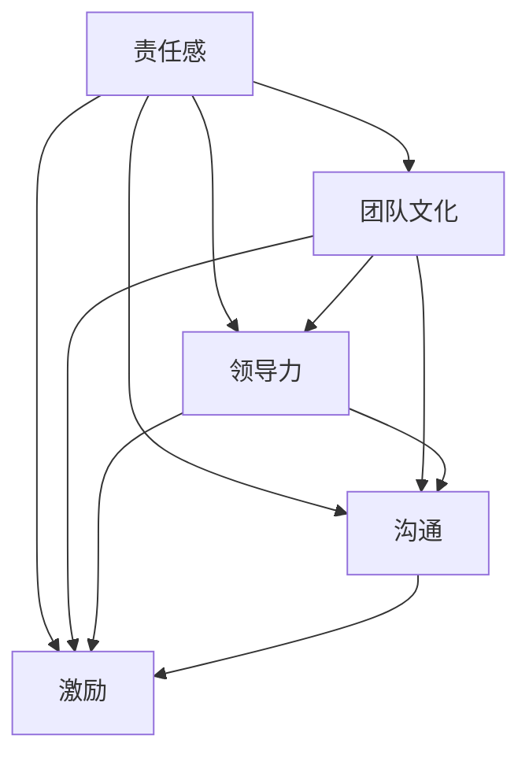
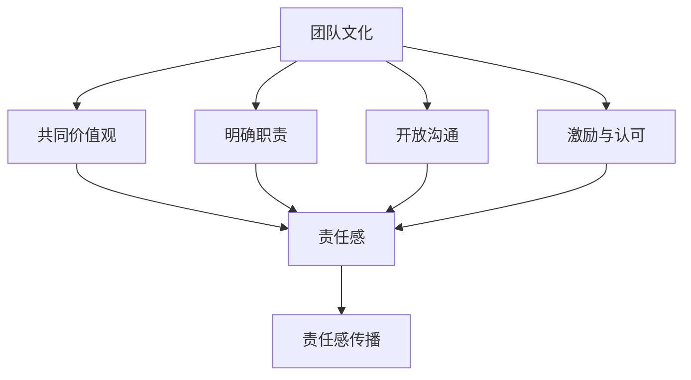

                 

### 文章标题

# 如何培养团队的责任感

> 关键词：团队责任感，培养策略，领导力，沟通，激励

## 摘要

本文旨在探讨如何在现代组织中培养团队的责任感。我们将深入分析责任感的基础概念，了解其在团队文化和绩效中的作用。通过领导力、沟通和激励等关键因素，我们提出了一系列有效的策略来增强团队成员的责任感。文章还将通过实际案例，展示这些策略在实践中的应用，并提供未来发展的展望。本文适合企业领导、项目经理和人力资源专业人士阅读。

### 引言

在当今竞争激烈的商业环境中，团队的责任感成为企业成功的关键因素之一。责任感不仅关乎个人，更关乎整个团队的合作与协作。一个具有高度责任感的团队，能够更好地应对挑战，实现共同目标。然而，如何培养团队的责任感，使其在组织中根深蒂固，是一个值得深入探讨的问题。本文将围绕这一主题，从多个角度提供详细的解答。

### 背景介绍

在现代社会中，团队合作已成为企业运作的核心。无论是技术创新、市场营销，还是客户服务，团队的力量都至关重要。然而，团队并非只是简单的人员组合，而是需要共同的目标、清晰的职责和高度的信任。责任感正是这种信任和协同的基础。

**团队责任感**是指团队成员在完成工作任务时，对自己的行为和决策负责，愿意承担相应的后果。这种责任感不仅体现在个人的行为上，更贯穿于整个团队的文化和日常工作中。

团队责任感的重要性主要体现在以下几个方面：

1. **提升团队绩效**：责任感强的团队成员更有动力去完成工作任务，提高工作效率和质量。
2. **增强团队凝聚力**：责任感可以促进团队成员之间的信任和合作，形成紧密的团队关系。
3. **降低管理成本**：当团队成员具有高度责任感时，管理者的工作压力减轻，组织管理成本降低。
4. **提高员工满意度**：责任感强的团队成员通常对自己的工作有更高的满意度，这有助于提高员工的长期忠诚度和生产力。

### 核心概念与联系

为了更好地理解团队责任感，我们需要明确几个核心概念，并探讨它们之间的关系。

1. **责任感**：责任感是指个体或团队对自己的行为、决策和结果负责的心理状态。它是基于道德、伦理和职业标准的一种内在驱动力。
2. **团队文化**：团队文化是指团队内部共同遵循的价值观、信念和行为准则。一个积极的团队文化能够促进责任感的发展。
3. **领导力**：领导力是指领导者引导、激励和影响团队成员的能力。有效的领导力对于培养团队责任感至关重要。
4. **沟通**：沟通是团队成员之间传递信息、理解和协作的过程。良好的沟通能够增强团队成员之间的责任感。
5. **激励**：激励是指通过奖励和认可来鼓励团队成员保持责任感。适当的激励措施能够增强团队成员的积极性和责任感。

下图展示了这些核心概念之间的关系：



### 责任感的基础

要培养团队的责任感，我们首先需要了解责任感的基础。责任感并非天生具备，而是可以通过培养和实践逐步形成的。以下是一些关于责任感的基础概念和培养策略：

1. **责任感的定义**：

   责任感是指个体或团队对自己的行为、决策和结果负责的心理状态。它是基于道德、伦理和职业标准的一种内在驱动力。

2. **责任感的重要性**：

   责任感对于团队的绩效、凝聚力和长期成功至关重要。一个具有高度责任感的团队，能够更好地应对挑战，实现共同目标。

3. **责任感与个人行为的关系**：

   责任感体现在个人行为中，包括承担责任、遵守承诺、持续学习和勇于面对错误。这些行为不仅影响个人的职业发展，也影响团队的整体表现。

4. **责任感与团队文化的联系**：

   团队文化是团队内部共同遵循的价值观、信念和行为准则。一个积极的团队文化能够促进责任感的发展，例如通过明确职责、鼓励开放沟通和建立共同目标。

5. **责任感的培养策略**：

   - **明确期望**：团队领导应明确团队成员的职责和期望，确保每个成员都清楚自己的工作内容和目标。
   - **树立榜样**：领导者应以身作则，展示高度的责任感，成为团队成员的榜样。
   - **提供反馈**：定期提供反馈，帮助团队成员认识到自己的行为和责任，鼓励他们持续改进。
   - **建立信任**：信任是责任感的基础，团队领导应通过开放沟通和透明决策来建立信任。
   - **激励与认可**：通过奖励和认可来鼓励团队成员保持责任感，增强他们的积极性和归属感。

### 责任感的重要性

责任感在团队中扮演着至关重要的角色。一个具有高度责任感的团队，不仅能够提高工作效率，还能增强团队的凝聚力和稳定性。以下是从多个角度探讨责任感的重要性：

1. **提升团队绩效**：

   责任感强的团队成员更有动力去完成工作任务，提高工作效率和质量。这种责任感可以转化为具体的工作成果，从而提升团队的整体绩效。

2. **增强团队凝聚力**：

   责任感可以促进团队成员之间的信任和合作，形成紧密的团队关系。团队成员在共同承担责任的过程中，会更加团结一致，共同面对挑战。

3. **降低管理成本**：

   当团队成员具有高度责任感时，管理者的工作压力减轻，组织管理成本降低。这是因为责任感强的团队成员能够自我管理，减少管理者的干预和监督。

4. **提高员工满意度**：

   责任感强的团队成员通常对自己的工作有更高的满意度，这有助于提高员工的长期忠诚度和生产力。责任感不仅是一种职业态度，也是一种自我价值的体现。

5. **促进个人成长**：

   责任感可以推动团队成员不断学习和提升自己的能力。在承担责任的过程中，成员可以积累经验，培养解决问题的能力，从而实现个人职业成长。

总之，责任感是团队成功的关键因素之一。通过培养团队的责任感，企业可以打造一支高效、团结和稳定的团队，从而在竞争激烈的市场中脱颖而出。

### 团队责任感与团队文化

团队文化在培养团队责任感中起着至关重要的作用。一个积极向上的团队文化能够促进责任感的形成和传播，从而提升团队的整体效能。以下是从几个方面探讨团队责任感与团队文化之间的关系：

1. **积极团队文化的作用**：

   积极的团队文化能够为团队成员创造一个相互支持、鼓励和尊重的工作环境。在这种文化中，成员更愿意承担责任，因为他们相信自己的付出会得到认可和支持。

2. **共同价值观的重要性**：

   团队文化中的共同价值观是培养责任感的基石。当团队成员共享相同的价值观和信念时，他们会更加认同团队的目标和责任，从而更加愿意承担责任。

3. **明确职责与分工**：

   在一个健康的团队文化中，职责和分工是清晰明确的。每个成员都清楚自己的职责和期望，这有助于他们更好地履行自己的责任，提高工作效率。

4. **开放沟通与反馈**：

   团队文化中鼓励开放沟通和反馈，这有助于团队成员及时了解自己的表现和责任。通过沟通和反馈，成员可以相互学习和成长，共同提升责任感。

5. **激励与认可**：

   在积极的文化中，领导者和同事会通过激励和认可来鼓励团队成员承担责任。这种正向激励能够增强成员的责任感，提高他们的工作动力。

6. **责任感的传播**：

   责任感不是孤立的，而是在团队中传播和共享的。一个积极的团队文化能够促进责任感从领导层到基层的传递，使整个团队形成共同的责任意识。

为了更好地理解团队责任感与团队文化之间的关系，我们可以通过以下Mermaid流程图来展示它们之间的互动：



通过这个流程图，我们可以看到，团队文化中的共同价值观、明确职责、开放沟通和激励与认可等因素，都是培养和传播责任感的重要途径。一个积极、健康的团队文化能够为责任感的发展提供良好的土壤。

### 领导力与团队责任感

领导力在培养团队责任感中扮演着至关重要的角色。有效的领导力不仅能激励团队成员承担责任，还能建立一种责任感文化，使整个团队更加团结和高效。以下我们将探讨领导力与团队责任感之间的关系，以及如何通过领导力来培养团队责任感。

1. **领导力与团队责任感的关系**：

   领导力是指领导者引导、激励和影响团队成员的能力。有效的领导力不仅关乎个人魅力的展示，更关乎如何通过行为和决策来培养团队成员的责任感。一个负责任的领导者会以身作则，通过自己的言行来树立榜样，鼓励团队成员也承担起自己的责任。

2. **领导者如何培养团队责任感**：

   - **树立榜样**：领导者应以身作则，展示高度的责任感。通过自己的行为，向团队成员传递责任的重要性。
   - **明确期望**：领导者应明确团队成员的职责和期望，确保每个成员都清楚自己的工作内容和目标。这有助于团队成员更好地履行自己的责任。
   - **提供支持和资源**：领导者应提供必要的支持和资源，帮助团队成员克服工作中的困难，从而增强他们的责任感。
   - **鼓励反馈和沟通**：领导者应鼓励团队成员之间的反馈和沟通，建立开放、透明的沟通机制。这有助于团队成员更好地了解自己的责任，并相互支持和监督。
   - **激励和认可**：领导者应通过激励和认可来鼓励团队成员承担责任。适当的奖励和表彰能够增强成员的责任感，提高他们的工作动力。

3. **案例分析：领导力在培养团队责任感中的成功实践**：

   某科技公司通过有效的领导力培养团队责任感，取得了显著成效。该公司的一名资深项目经理，通过以下几种方式成功提升了团队责任感：

   - **树立榜样**：项目经理经常亲自参与项目的关键任务，并通过自己的实际行动展示了对项目的责任感。
   - **明确期望**：项目经理在项目启动阶段，明确每位团队成员的职责和任务，确保每个人都清楚自己的工作内容和目标。
   - **提供支持和资源**：项目经理为团队成员提供了充分的技术支持和资源，帮助他们更有效地完成任务。
   - **鼓励反馈和沟通**：项目经理建立了定期的项目会议和反馈机制，鼓励团队成员提出问题和建议，确保团队成员之间的沟通畅通。
   - **激励和认可**：项目经理定期对团队成员的工作表现进行评估，并给予奖励和表彰，激励团队成员保持高度的责任感。

   通过这些措施，该项目的团队责任感得到了显著提升，项目的成功交付率也大幅提高。

总之，领导力在培养团队责任感中起着至关重要的作用。通过树立榜样、明确期望、提供支持和资源、鼓励反馈和沟通以及激励和认可，领导者可以有效地培养团队的责任感，推动团队取得更好的成果。

### 沟通与团队责任感

沟通在培养团队责任感中扮演着关键角色。有效的沟通不仅有助于团队成员更好地理解彼此的职责和目标，还能促进责任感的传递和深化。以下将探讨沟通与团队责任感之间的关系，以及如何通过改进沟通来培养团队责任感。

1. **沟通与团队责任感的关系**：

   沟通是团队内部信息传递、理解和协作的过程。在一个团队中，沟通的质量直接影响团队成员的责任感。有效的沟通能够确保每个成员都清楚自己的职责和任务，理解团队的目标和价值，从而增强他们的责任感。

2. **责任感的传递与深化**：

   责任感在团队中的传递和深化，离不开良好的沟通。领导者需要通过沟通来明确团队成员的职责和期望，确保每个人都能理解自己的角色。同时，团队成员之间的沟通也能够促进责任感的共享和深化，使整个团队形成共同的责任意识。

3. **如何改进沟通**：

   - **建立透明的沟通机制**：团队领导应建立透明的沟通机制，确保信息能够顺畅地在团队成员之间传递。例如，可以定期召开团队会议、使用即时通讯工具和项目管理软件等。
   - **鼓励开放沟通**：团队领导应鼓励团队成员之间进行开放、坦诚的沟通，营造一个鼓励提问和分享的环境。这有助于团队成员更好地理解彼此的职责和任务。
   - **提供反馈和反馈机制**：团队领导应提供及时的反馈，帮助团队成员了解自己的工作表现和责任履行情况。同时，应建立反馈机制，鼓励团队成员提出意见和建议。
   - **明确沟通目标和内容**：每次沟通前，团队领导应明确沟通的目标和内容，确保沟通有针对性。这样可以避免无效的沟通，提高沟通的效率。
   - **培养沟通技巧**：团队领导应培养团队成员的沟通技巧，包括倾听、表达和反馈等。这有助于团队成员更好地理解和传达信息，增强沟通效果。

4. **案例分析：通过改进沟通培养团队责任感**：

   某互联网公司在一次重大项目中，通过改进沟通机制，成功提升了团队责任感。公司领导采取了以下措施：

   - **建立透明的沟通机制**：领导层建立了每周的团队会议，定期汇报项目进展和任务分配，确保信息透明。
   - **鼓励开放沟通**：领导层鼓励团队成员在会议中提问和分享自己的想法，营造了一个开放、坦诚的沟通氛围。
   - **提供反馈和反馈机制**：领导层对团队成员的工作进行了定期评估，提供了具体的反馈，帮助团队成员了解自己的职责和表现。
   - **明确沟通目标和内容**：每次会议前，领导层都会提前通知会议的目标和议程，确保沟通内容有针对性。
   - **培养沟通技巧**：公司组织了沟通技巧培训，帮助团队成员提升倾听、表达和反馈的能力。

   通过这些改进，该项目的团队责任感显著提升，项目最终成功交付，并获得了客户的高度评价。

总之，沟通是培养团队责任感的重要手段。通过建立透明的沟通机制、鼓励开放沟通、提供反馈和反馈机制、明确沟通目标和内容，以及培养沟通技巧，团队领导可以有效地提升团队的责任感，推动团队取得更好的成果。

### 激励与团队责任感

激励是培养团队责任感的关键因素之一。适当的激励措施能够激发团队成员的内在动力，增强他们的责任感和工作积极性。以下将探讨激励与团队责任感之间的关系，以及如何通过激励来培养团队责任感。

1. **激励与团队责任感的关系**：

   激励是指通过奖励、认可和其他手段来激发团队成员的工作热情和积极性。一个有效的激励机制能够帮助团队成员认识到责任的重要性，增强他们的责任感。激励机制不仅影响团队成员的个人行为，还能影响整个团队的文化和氛围。

2. **责任感培养的激励机制**：

   - **奖励**：奖励是激励团队成员最直接和最有效的方式之一。奖励可以是物质上的，如奖金、礼品等，也可以是精神上的，如表彰、荣誉称号等。适当的奖励能够增强团队成员的责任感，激励他们更积极地履行自己的职责。
   - **认可**：认可是对团队成员工作表现的肯定和赞赏，是一种重要的精神激励。通过公开认可团队成员的贡献，领导层可以增强他们的自我价值感和责任感。
   - **职业发展**：提供职业发展的机会和晋升通道，是激励团队成员的重要手段。当团队成员看到自己的未来发展前景时，他们会更加愿意承担责任，为实现团队目标努力工作。
   - **参与决策**：让团队成员参与决策过程，让他们感到自己的意见和贡献被重视，是一种有效的激励方式。这有助于增强团队成员的责任感和归属感。
   - **工作环境**：一个良好的工作环境能够提高团队成员的工作积极性和责任感。例如，提供良好的工作设施、营造积极的工作氛围、关注团队成员的身心健康等。

3. **案例分析：通过激励培养团队责任感**：

   某大型科技公司通过一系列激励措施，成功提升了团队的责任感。以下是他们的具体做法：

   - **奖励**：公司定期评选优秀员工，给予奖金和荣誉称号。这不仅激励了优秀员工，也鼓励其他成员向优秀看齐。
   - **认可**：公司领导在团队会议上公开表扬团队成员的贡献，让团队成员感到自己的工作得到了认可。
   - **职业发展**：公司为员工提供多种职业发展机会，包括内部培训和外部培训。员工可以通过不断学习和提升自己的技能，实现职业发展。
   - **参与决策**：公司鼓励团队成员参与决策过程，听取他们的意见和建议。这种参与感让团队成员感到自己被重视，增强了他们的责任感。
   - **工作环境**：公司注重员工的身心健康，提供良好的工作环境和弹性工作制度，让员工能够更好地平衡工作和生活。

   通过这些激励措施，该公司的团队责任感得到了显著提升，员工的工作满意度和工作效率也得到了提高。

总之，激励是培养团队责任感的重要手段。通过奖励、认可、职业发展、参与决策和工作环境等多方面的激励措施，领导层可以有效地激发团队成员的责任感，推动团队取得更好的成果。

### 项目实战

为了更具体地展示如何培养团队的责任感，以下我们将通过一个实际项目的案例分析，详细讲解项目背景、开发环境搭建、源代码实现和代码解读、项目应用解读与分析、以及项目小结等内容。

#### 项目背景

某互联网公司计划开发一款用于客户关系管理的软件，该软件需要处理大量客户数据，并提供便捷的查询和统计分析功能。为了确保项目的成功，公司决定采用敏捷开发方法，组建一个跨部门的团队，包括产品经理、前端开发、后端开发、数据库管理和测试人员。

#### 开发环境搭建

1. **技术选型**：

   - 前端：使用React框架，以便实现高性能的用户界面。
   - 后端：采用Node.js和Express.js，以提高开发效率和性能。
   - 数据库：使用MySQL，确保数据存储的安全和高效。
   - 版本控制：使用Git，进行代码管理和协作开发。

2. **环境搭建**：

   - 在团队内部搭建了一个持续集成和持续部署（CI/CD）环境，使用Jenkins进行自动化构建和部署。
   - 使用Docker容器化技术，确保开发环境的一致性，减少环境配置的差异。

#### 源代码实现和代码解读

1. **前端实现**：

   - 使用React组件化开发，确保代码的可维护性和可扩展性。
   - 使用Ant Design组件库，提高开发效率和界面美观度。

   ```javascript
   // React组件示例
   import React from 'react';

   const CustomerList = ({ customers }) => {
     return (
       <div>
         {customers.map((customer) => (
           <div key={customer.id}>{customer.name}</div>
         ))}
       </div>
     );
   };
   ```

2. **后端实现**：

   - 使用Express.js创建RESTful API，处理客户数据的增删改查操作。
   - 使用JWT（JSON Web Token）进行身份验证，确保数据的安全性。

   ```javascript
   // Express.js路由示例
   const express = require('express');
   const jwt = require('jsonwebtoken');
   const app = express();

   app.post('/api/login', (req, res) => {
     // 登录逻辑
     const token = jwt.sign({ id: user.id }, 'secretKey');
     res.json({ token });
   });

   app.get('/api/customers', authenticate, (req, res) => {
     // 获取客户列表逻辑
     const customers = db.getCustomers();
     res.json(customers);
   });
   ```

3. **数据库管理**：

   - 使用MySQL存储客户数据，并设计合理的数据库结构，以提高查询效率。
   - 使用ORM（对象关系映射）工具，如 Sequelize，简化数据库操作。

   ```javascript
   // Sequelize模型示例
   const Sequelize = require('sequelize');
   const sequelize = new Sequelize('database', 'username', 'password', {
     host: 'localhost',
     dialect: 'mysql',
   });

   const Customer = sequelize.define('customer', {
     name: Sequelize.STRING,
     email: Sequelize.STRING,
     phone: Sequelize.STRING,
   });

   Customer.sync();
   ```

#### 项目应用解读与分析

1. **功能实现**：

   - 客户数据管理：支持客户数据的增删改查操作，确保数据的安全性和完整性。
   - 统计分析：提供客户数据的统计和报告功能，帮助团队分析客户行为和市场趋势。

2. **性能优化**：

   - 使用Redis缓存数据库查询结果，减少数据库访问压力。
   - 对高频查询进行缓存和索引优化，提高查询效率。

3. **安全性保障**：

   - 对API进行身份验证和授权，确保只有合法用户可以访问敏感数据。
   - 使用HTTPS协议，保护数据在传输过程中的安全性。

#### 项目小结

通过上述项目的实战，我们可以看到，培养团队责任感需要从多个方面进行努力。以下是一些关键经验和总结：

1. **明确职责和目标**：确保团队成员对项目的目标、职责和期望有清晰的认识，有助于提高团队的责任感和协作效率。
2. **有效沟通和协作**：建立透明的沟通机制，鼓励团队成员之间的交流和协作，有助于提高团队的整体效能。
3. **激励机制**：通过奖励和认可来激励团队成员，增强他们的责任感和工作积极性。
4. **持续学习和改进**：鼓励团队成员不断学习和提升自己的技能，通过反馈和改进，不断提高团队的工作质量和效率。

总之，通过实践，我们可以深刻体会到培养团队责任感的必要性和可行性。只有通过持续的实践和改进，才能打造一支高效、团结和有责任感的团队。

### 最佳实践 tips

在培养团队责任感的过程中，以下是一些实用的最佳实践和注意事项：

1. **明确职责分工**：确保每个团队成员都清楚自己的职责和任务，避免职责模糊和相互推诿。
2. **建立有效的沟通机制**：定期召开团队会议，使用即时通讯工具和项目管理软件，确保信息传递的及时性和准确性。
3. **激励与认可**：及时给予团队成员奖励和认可，增强他们的积极性和责任感。
4. **培养团队合作精神**：通过团队合作活动和培训，增强团队成员之间的信任和协作能力。
5. **关注团队成员的身心健康**：确保团队成员有良好的工作环境和压力管理，提高他们的工作满意度和责任感。

### 小结

本文详细探讨了如何培养团队的责任感，从背景介绍、核心概念与联系、责任感的重要性、团队文化、领导力、沟通、激励以及项目实战等多个方面进行了深入分析。通过明确的职责分工、有效的沟通机制、激励与认可、团队合作精神以及关注团队成员的身心健康，我们可以打造一支高效、团结和有责任感的团队。希望本文能为读者在培养团队责任感方面提供有价值的参考。

### 注意事项

在培养团队责任感的过程中，以下是一些需要注意的事项：

1. **避免过度压力**：过度的压力可能导致团队成员产生抵触情绪，反而削弱责任感。
2. **公平对待**：在激励和认可方面，应确保公平对待每个成员，避免引起不公平感。
3. **持续关注**：责任感培养不是一蹴而就的，需要领导层持续关注和引导。
4. **适应变化**：随着市场和团队情况的变化，责任感培养策略也需要不断调整和优化。

### 拓展阅读

1. **《团队协作的智慧》**：本书详细介绍了团队协作的理论和实践，对培养团队责任感有重要参考价值。
2. **《领导力的五项修炼》**：本书探讨了领导力的重要性，以及如何通过领导力来培养团队的责任感。
3. **《激励心理学》**：本书深入分析了激励的心理学原理，为制定有效的激励机制提供了理论基础。

### 作者信息

作者：AI天才研究院/AI Genius Institute & 禅与计算机程序设计艺术/Zen And The Art of Computer Programming

