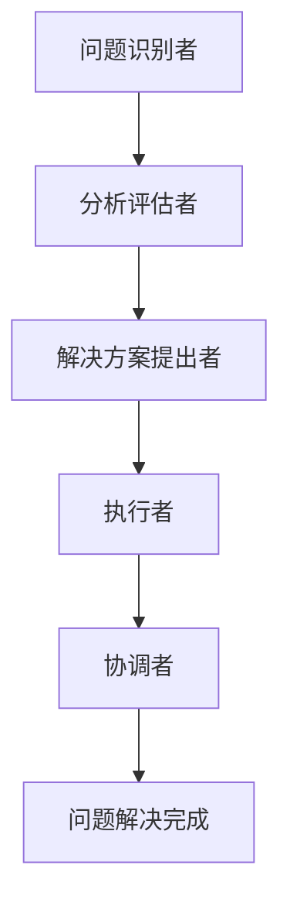

                 

### 引言

在当今快速发展的信息技术时代，企业面临的竞争压力日益加剧，技术创新成为提升企业核心竞争力的关键。而在这个过程中，团队的问题解决能力显得尤为重要。一个具备强大问题解决能力的团队，不仅能够迅速识别和应对挑战，还能持续创新，推动企业实现可持续发展。

然而，问题解决并非易事，它涉及到多个方面的能力和技巧。对于团队来说，培养问题解决能力不仅需要成员具备扎实的专业知识，还需要团队成员之间具备良好的协作与沟通。本文将深入探讨如何培养团队的问题解决能力，为企业在竞争激烈的科技环境中赢得优势提供指导。

本文将分为五个部分，首先介绍问题解决的四个层次和团队角色在问题解决中的作用。接着，我们将探讨问题的识别与分类方法，以及如何快速识别问题。第二部分将重点讨论团队协作与沟通，包括团队协作的原理、有效的沟通策略等。第三部分将介绍问题解决的方法论，包括问题解决的五个步骤和思维工具的应用。第四部分将探讨领导力与问题解决、持续学习与能力提升等主题。最后，通过实际案例和策略，总结如何在实际工作中培养团队的问题解决能力。

希望通过本文的阐述，读者能够更好地理解并掌握培养团队问题解决能力的方法，从而提升团队的整体竞争力。

### 问题的本质与团队的角色

问题解决，是每一个团队和组织不可或缺的核心能力。它不仅决定了团队在遇到挑战时的反应速度和应对效果，还直接影响到组织的长远发展和竞争力。在探讨问题解决之前，我们先要理解问题的本质。问题，从定义上来说，是一个需要解决的矛盾或疑问。它可能是一个需要改进的流程、一个需要解决的故障、一个需要突破的技术难题，或者是一个需要应对的市场变化。简单来说，问题就是现状与期望之间的差距。

在团队中，每个成员的角色和职责对问题解决有着重要的影响。团队成员的角色可以大致分为以下几类：

1. **问题识别者**：这类成员负责发现问题和初步识别问题的类型。他们需要具备敏锐的观察力和分析能力，能够从日常工作和项目中找出潜在的问题。

2. **分析评估者**：这类成员负责对问题进行深入分析和评估，明确问题的根本原因和影响范围。他们需要具备扎实的技术知识和分析技能，能够从复杂的信息中提取关键点。

3. **解决方案提出者**：这类成员负责提出解决问题的方案。他们需要具备创造力和逻辑思维能力，能够从不同的角度和路径思考问题的解决方案。

4. **执行者**：这类成员负责将解决方案转化为具体的行动。他们需要具备执行力，能够按照计划完成任务。

5. **协调者**：这类成员负责协调团队内外部的资源，确保问题解决的顺利进行。他们需要具备良好的沟通和协调能力，能够有效地协调团队成员和外部合作伙伴。

每个角色在问题解决中都有其独特的作用。问题识别者负责“发现问题”，分析评估者负责“理解问题”，解决方案提出者负责“解决问题”，执行者负责“实施问题解决”，协调者负责“保障问题解决”。这些角色之间相互依赖，共同协作，才能实现问题的高效解决。

在团队协作中，角色之间必须进行良好的沟通和合作。有效的沟通不仅能确保每个成员明确自己的职责和任务，还能促进团队内部的信息共享和知识交流。良好的沟通机制能够减少误解和冲突，提高团队的工作效率。

团队角色在问题解决中的相互作用可以用一个简单的流程图来表示（使用Mermaid语言）：



在这个流程图中，每个节点代表一个角色，箭头表示角色之间的信息流动和协作。通过这个流程图，我们可以清晰地看到每个角色在问题解决中的具体职责和相互关系。

综上所述，团队在问题解决中的角色和职责是至关重要的。只有通过明确的角色分工和高效的协作，团队才能有效地识别、分析、解决问题，从而提升整体的问题解决能力。在接下来的章节中，我们将进一步探讨如何识别和分类问题，以及如何在团队协作中实现高效的沟通和合作。

### 问题的识别与分类

在团队问题解决过程中，第一个关键步骤就是识别问题。问题识别不仅是发现问题的过程，更是理解问题的起点。高效的识别过程能够帮助团队迅速定位问题的核心，从而为后续的解决提供明确的指导。以下是一些识别问题的重要步骤和方法：

#### 1.1 问题识别的重要性

问题识别的重要性在于它决定了问题解决的效率和效果。一个未被及时识别的问题可能会逐渐恶化，影响团队的整体工作进度和目标实现。因此，快速、准确地识别问题至关重要。通过系统化的识别过程，团队可以避免盲目应对，从而节省时间和资源，提高问题解决的效率。

#### 1.2 问题分类方法

为了更好地管理问题，对问题进行分类是必不可少的。根据问题的性质和影响范围，我们可以将问题分为以下几类：

1. **技术问题**：这类问题通常与团队的技术能力或产品功能相关。例如，软件中的bug、系统性能瓶颈、技术架构设计问题等。

2. **流程问题**：这类问题涉及团队的工作流程和管理流程。例如，项目进度延误、流程效率低下、沟通障碍等。

3. **资源问题**：这类问题涉及团队所需的资源不足或分配不均。例如，人力资源不足、设备故障、预算限制等。

4. **外部问题**：这类问题源于团队外部环境的变化，如市场变化、竞争对手行动、客户需求变化等。

5. **团队内部问题**：这类问题涉及团队内部的成员关系、文化冲突、士气低落等。

对不同类型的问题进行分类，有助于团队采取有针对性的解决策略，提高问题解决的效率。

#### 1.3 实战：如何快速识别问题

在实际工作中，快速识别问题需要一定的技巧和方法。以下是一些实用的方法：

1. **定期审查**：定期对团队的工作流程、项目进度、技术架构等进行审查，可以发现潜在的问题。审查过程中可以采用SWOT分析（优势、劣势、机会、威胁）来评估不同方面的表现。

2. **用户反馈**：用户反馈是识别问题的重要来源。通过收集用户的反馈和投诉，可以了解用户对产品或服务的实际体验，从而发现存在的问题。

3. **数据监控**：利用数据监控工具，对系统的运行状态、性能指标进行实时监控。通过数据异常分析，可以迅速识别潜在的问题。

4. **异常处理流程**：建立一套异常处理流程，确保每个团队成员都知道在遇到问题时应该采取什么措施。这个流程应包括报告、分析、解决和跟进等环节。

5. **现场观察和访谈**：通过现场观察和访谈，可以直接了解团队的工作情况，发现存在的问题。这种方法需要团队成员的积极配合，以确保观察结果的准确性。

下面我们通过一个简单的伪代码示例来说明如何利用用户反馈快速识别问题：

```python
def identify_issues(feedback_list):
    issues = []
    for feedback in feedback_list:
        if "bug" in feedback:
            issues.append("技术问题：软件存在bug")
        elif "delay" in feedback:
            issues.append("流程问题：项目进度延误")
        elif "resource" in feedback:
            issues.append("资源问题：资源不足")
        elif "complaint" in feedback:
            issues.append("外部问题：客户投诉")
        else:
            issues.append("团队内部问题：成员关系问题")
    return issues
```

在这个示例中，`identify_issues` 函数接收一个用户反馈列表，根据反馈内容将问题分类并存储在`issues`列表中。这个简单的伪代码可以帮助团队快速识别不同类型的问题。

通过上述方法和步骤，团队可以有效地识别问题，并为后续的解决打下坚实的基础。在接下来的章节中，我们将进一步探讨如何进行问题分类，以及如何制定和实施问题解决方案。

### 团队协作的原理

团队协作在问题解决中扮演着至关重要的角色。一个高效的团队不仅能够快速识别和解决问题，还能在复杂多变的环境中保持稳定的运作。要实现高效的团队协作，我们需要理解团队协作的基本原则，认识到团队角色之间的互补性，并掌握有效的协作策略。

#### 3.1 团队协作的基本原则

团队协作的基本原则包括以下几个方面：

1. **共同目标**：团队成员必须明确共同的目标和愿景。这有助于团队团结一致，共同为实现目标而努力。

2. **透明沟通**：团队成员之间需要保持开放和透明的沟通。信息共享能够减少误解和冲突，提高团队的工作效率。

3. **相互尊重**：每个团队成员都应该受到尊重。尊重能够增强团队的凝聚力，促进团队成员之间的合作。

4. **分工合作**：根据团队成员的能力和特长进行合理的分工，确保每个人都能在其最擅长的领域发挥作用。

5. **责任分担**：团队成员需要明确自己的职责和任务，并在完成个人任务的同时，为团队的整体目标负责。

6. **灵活应对**：面对不断变化的环境和挑战，团队需要具备灵活应对的能力。这包括快速调整计划和策略，以及适应新的工作模式。

#### 3.2 团队角色的互补性

在一个高效的团队中，各个成员的角色通常具有互补性。这意味着每个成员都能够在自己的角色中发挥最大的价值，同时为团队的整体目标做出贡献。以下是一些常见的团队角色及其互补性：

1. **技术专家**：技术专家擅长解决复杂的技术问题，他们具备深厚的专业知识和丰富的实践经验。技术专家通常与项目管理者和用户支持人员互补。

2. **项目管理者**：项目管理者负责规划、组织和协调团队的工作。他们擅长资源管理、进度控制和风险管理。项目管理者通常与技术专家和团队成员互补。

3. **用户支持人员**：用户支持人员负责与客户和用户沟通，了解他们的需求和反馈。他们擅长用户沟通和问题解决。用户支持人员通常与技术专家和项目管理者互补。

4. **业务分析师**：业务分析师负责分析业务需求和市场趋势，为团队提供业务指导。他们擅长需求分析和战略规划。业务分析师通常与项目经理和技术专家互补。

5. **测试工程师**：测试工程师负责确保产品的质量，通过测试发现潜在的问题。他们擅长测试设计和缺陷管理。测试工程师通常与技术专家和项目管理者互补。

通过合理配置和协作，这些角色可以相互补充，共同推动团队向前发展。

#### 3.3 实战：如何构建高效团队

在实际工作中，如何构建一个高效的团队是一个重要的课题。以下是一些构建高效团队的策略：

1. **明确团队目标**：在组建团队之初，明确团队的目标和愿景。确保每个成员都清楚自己的职责和任务，以及团队的目标。

2. **选人用人**：根据团队目标和任务，选择具备相关专业技能和协作精神的成员。合理安排团队成员的角色，确保每个成员都能在适合自己的岗位上发挥最大的价值。

3. **培训与激励**：定期为团队成员提供培训，提升他们的专业技能和协作能力。同时，通过激励措施，如奖励、表彰和晋升，激发团队成员的工作热情和积极性。

4. **建立良好的沟通机制**：确保团队成员之间能够进行开放和透明的沟通。建立定期的会议和报告制度，及时交流工作进展和问题。

5. **促进跨部门合作**：在跨部门项目中，促进团队成员之间的协作，打破部门壁垒。通过跨部门合作，可以整合不同部门的专业知识和资源，提高问题解决的效率。

6. **建立团队文化**：建立积极向上的团队文化，鼓励团队成员相互支持、共同成长。团队文化应包括共同的价值观、使命和愿景，以及尊重和信任的氛围。

通过上述策略，团队可以逐步构建起高效协作的机制，提升整体的工作效率和问题解决能力。在接下来的章节中，我们将探讨如何通过有效的沟通策略和团队协作，提高团队的整体问题解决能力。

### 有效的团队沟通

在团队协作中，沟通是解决问题的重要手段。有效的沟通能够确保信息准确传达，减少误解和冲突，提高团队的工作效率和问题解决能力。以下将从沟通的重要性、常见的沟通障碍以及解决策略三个方面，探讨如何提升团队沟通效率。

#### 4.1 沟通的重要性

沟通在团队协作中起着至关重要的作用。良好的沟通不仅能确保团队成员之间的信息共享，还能促进协作和创新。以下是沟通在团队协作中的几个关键作用：

1. **信息共享**：通过沟通，团队成员可以共享各自掌握的信息和知识，形成整体的信息网络。这有助于团队更全面地理解问题和制定解决方案。

2. **减少误解**：良好的沟通能够减少由于信息不对称或误解导致的错误决策和重复劳动，提高团队的工作效率。

3. **协作与创新**：有效的沟通能够激发团队成员之间的协作精神，共同面对挑战，推动创新。通过讨论和交流，团队成员可以碰撞出新的想法和解决方案。

4. **增强团队凝聚力**：沟通不仅是工作交流的工具，还能增强团队成员之间的信任和凝聚力。通过积极的沟通，团队成员能够建立良好的关系，共同面对困难。

#### 4.2 沟通障碍与解决策略

尽管沟通在团队协作中至关重要，但实际操作中常常面临各种障碍。以下是一些常见的沟通障碍及其解决策略：

1. **信息不对称**：团队成员之间掌握的信息不一致，导致理解上的偏差。解决策略：
    - 定期召开信息共享会议，确保团队成员之间了解项目进展和重要信息。
    - 利用信息管理系统，如文档共享平台和项目管理工具，方便团队成员访问和更新信息。

2. **文化差异**：不同文化背景的团队成员在沟通中可能会产生误解和冲突。解决策略：
    - 开展跨文化培训，增强团队成员对文化差异的敏感性。
    - 鼓励团队成员使用简单的、非专业术语进行交流，避免使用可能引起误解的术语。

3. **语言障碍**：非母语使用者可能在沟通中遇到语言表达困难。解决策略：
    - 提供语言支持，如雇佣语言翻译或使用翻译工具。
    - 鼓励团队成员使用简单的语言和图表进行交流，减少语言障碍。

4. **时间冲突**：团队成员可能因为工作安排和时间差异，难以进行有效的沟通。解决策略：
    - 制定灵活的工作时间安排，如远程办公和跨时区会议，确保团队成员能够参与。
    - 利用即时通讯工具和协作平台，实时交流信息和任务。

5. **沟通渠道不畅**：沟通渠道不畅通可能导致信息传递延迟或丢失。解决策略：
    - 优化沟通渠道，如建立统一的沟通平台和流程，确保信息能够及时、准确地传达。
    - 定期评估沟通效果，根据反馈调整沟通策略。

#### 4.3 实战：提高沟通效率

在实际工作中，通过以下策略，可以有效提高团队沟通效率：

1. **明确沟通目标**：每次沟通前，明确沟通的目标和期望结果，确保沟通有的放矢。

2. **准备充分**：提前准备好需要沟通的内容、数据和支持材料，确保沟通过程中能够流畅地传达信息。

3. **倾听与反馈**：在沟通中，不仅要表达自己的观点，还要认真倾听他人的意见，并及时给予反馈。这有助于建立双向沟通，提高理解度。

4. **使用视觉辅助工具**：如思维导图、图表和演示文稿，可以直观地展示信息和逻辑关系，帮助团队成员更好地理解。

5. **定期回顾和总结**：每次沟通后，进行总结和回顾，评估沟通效果，并根据反馈进行改进。

通过以上策略，团队可以逐步提高沟通效率，减少沟通障碍，促进协作和创新，从而提升整体问题解决能力。在接下来的章节中，我们将探讨问题解决的方法论，包括问题解决的流程和思维工具的应用。

### 问题解决的方法论

问题解决是一个系统性的过程，它需要团队成员具备清晰的思路和有效的策略。为了确保问题能够得到高效解决，我们需要遵循一套科学的方法论，这包括问题解决的五个关键步骤。以下是每个步骤的具体内容和实施策略。

#### 5.1 问题解决的五个步骤

1. **问题识别**：这是问题解决的第一步，主要目标是明确问题的存在和性质。团队成员需要通过观察、用户反馈、数据分析和现场调查等方式，发现和识别问题。有效的识别过程可以减少误判，确保问题得到准确诊断。

2. **问题分析**：在识别出问题后，需要对其进行深入分析，找出问题的根本原因。这通常包括收集和分析数据、访谈相关人员、使用因果分析图等方法。分析的过程有助于团队理解问题的全貌，避免仅解决表面现象。

3. **解决方案制定**：基于问题分析的结果，团队需要提出可行的解决方案。在制定解决方案时，可以考虑多种方案并进行比较，选择最优解。这一步骤需要团队成员的创造力和逻辑思维能力。

4. **方案实施**：在确定了解决方案后，需要将其转化为具体的行动。实施过程中，团队需要制定详细的计划，分配任务，确保每个成员都明确自己的职责。同时，要监控实施过程，及时调整计划和策略。

5. **方案评估**：在问题解决后，对解决方案的效果进行评估，确保问题得到有效解决。评估可以通过数据指标、用户反馈和绩效分析等方法进行。评估的结果可以为未来的问题解决提供经验和参考。

#### 5.2 如何制定问题解决方案

制定问题解决方案是一个创造性思维和逻辑推理的过程。以下是几个关键步骤：

1. **明确问题**：在制定解决方案之前，首先要明确问题的具体描述和影响范围。这可以通过问题陈述或问题定义文档来完成。

2. **收集信息**：收集与问题相关的所有信息，包括数据、用户反馈、历史记录等。这些信息将帮助团队全面理解问题。

3. **分析问题**：通过因果分析、数据分析和访谈等方法，找出问题的根本原因。这一步可以通过因果图或鱼骨图等工具进行。

4. **提出方案**：在明确问题原因后，提出多种可能的解决方案。可以采用头脑风暴法，鼓励团队成员自由发表意见。

5. **评估方案**：对提出的方案进行评估，选择最有效的解决方案。评估时可以采用决策矩阵或成本效益分析等方法。

6. **制定实施计划**：在确定解决方案后，制定详细的实施计划，包括任务分配、时间表和关键里程碑。

7. **实施监控**：在实施过程中，监控方案的效果，及时调整计划和策略，确保问题得到有效解决。

#### 5.3 实战：问题解决实战演练

以下是一个问题解决实战演练的例子：

**案例**：某公司的一项关键业务系统出现频繁崩溃，导致用户体验下降，客户投诉增加。

**步骤1：问题识别**：通过用户反馈和系统监控，确定系统频繁崩溃的问题。

**步骤2：问题分析**：分析系统日志、性能监控数据和用户使用习惯，发现崩溃的主要原因是内存泄漏。

**步骤3：解决方案制定**：提出以下几种方案：
- 方案一：优化现有代码，修复内存泄漏。
- 方案二：更换内存管理库。
- 方案三：增加内存监控和自动清理机制。

**步骤4：方案评估**：通过成本效益分析和风险评估，选择方案一作为最优解。

**步骤5：方案实施**：制定详细实施计划，包括代码修复、测试和部署。在实施过程中，团队成员分工合作，确保每个环节都按计划进行。

**步骤6：方案评估**：在修复后，通过用户反馈和性能测试，确认问题已经得到有效解决。系统稳定性显著提升，客户投诉减少。

通过这个实战演练，我们可以看到问题解决的每个步骤如何具体实施，以及团队如何协作解决复杂问题。在接下来的章节中，我们将探讨思维工具在问题解决中的应用，帮助团队更高效地解决复杂问题。

### 思维工具与技术

在问题解决的过程中，思维工具和技术能够极大地提升团队的效率和质量。以下将介绍几种常用的思维工具和技术，以及如何在团队问题解决中应用这些工具。

#### 6.1 思维导图在问题解决中的应用

思维导图是一种可视化工具，能够帮助团队整理思路、梳理信息，并激发创造性思维。以下是思维导图在问题解决中的应用：

1. **整理信息**：在问题识别和分析阶段，使用思维导图将相关信息进行分类和整理，帮助团队更清晰地理解问题。

2. **头脑风暴**：通过思维导图，团队成员可以自由地记录和连接各种想法，促进思维的发散和融合。

3. **问题分析**：利用思维导图，可以直观地展示问题的各种因素和关系，有助于深入分析问题的本质。

4. **解决方案制定**：在制定解决方案时，思维导图可以帮助团队从不同角度和维度思考问题，探索各种可能的解决方案。

以下是一个思维导图的示例（使用Mermaid语言）：

```mermaid
mindmap
  title 问题解决
  root Problem Identification
  Problem Identification --> Data Collection
  Problem Identification --> User Feedback
  Data Collection --> Performance Metrics
  Data Collection --> System Logs
  User Feedback --> Complaints
  User Feedback --> Usage Patterns
```

在这个示例中，思维导图清晰地展示了问题识别阶段所需的各种信息来源。

#### 6.2 SWOT分析在问题解决中的应用

SWOT分析是一种常用的战略规划工具，用于评估团队的内部优势、劣势和外部机会、威胁。在问题解决中，SWOT分析可以帮助团队：

1. **内部优势与劣势**：识别团队在解决问题时的优势和劣势，帮助制定合适的解决方案。

2. **外部机会与威胁**：分析外部环境的变化，确定团队在解决问题时可以利用的机会和需要应对的威胁。

以下是SWOT分析的示例（使用Mermaid语言）：

```mermaid
swot
  title SWOT Analysis
  left[Strengths]
  right[Weaknesses]
  down[Opportunities]
  right[Threats]
  
  Strengths --> Skilled Team Members
  Strengths --> Technical Expertise
  Weaknesses --> Limited Resources
  Weaknesses --> Communication Barriers
  Opportunities --> New Market Opportunities
  Opportunities --> Technological Advances
  Threats --> Competitor Actions
  Threats --> Regulatory Changes
```

在这个示例中，SWOT分析帮助团队全面评估自身情况，为问题解决提供了有价值的参考。

#### 6.3 实战：如何使用思维工具

以下是一个思维工具的实战案例：

**案例**：某公司开发团队在开发新产品时遇到性能瓶颈，需要进行优化。

**步骤1：使用思维导图整理信息**：团队使用思维导图整理了产品性能的各个关键因素，包括数据库设计、代码优化、网络通信等。

**步骤2：进行SWOT分析**：
- **Strengths**：团队有丰富的开发经验，熟悉产品架构。
- **Weaknesses**：现有代码结构复杂，缺乏性能监控工具。
- **Opportunities**：可以使用新的优化算法和工具。
- **Threats**：市场竞争激烈，时间紧迫。

**步骤3：制定解决方案**：基于SWOT分析结果，团队提出了几个优化方案，包括代码重构、数据库优化和引入性能监控工具。

**步骤4：实施与监控**：团队按照方案实施优化，并在实施过程中使用思维导图和SWOT分析进行持续监控和调整，确保优化效果。

通过这个实战案例，我们可以看到思维工具在问题解决中的重要作用。它们不仅帮助团队清晰梳理问题，还能促进团队创造性思维和系统化思考，从而提高问题解决的质量和效率。

综上所述，思维工具和技术在团队问题解决中具有广泛的适用性和强大的实用性。通过合理应用这些工具，团队能够更高效地应对各种复杂问题，提升整体的问题解决能力。

### 领导力与问题解决

在团队问题解决过程中，领导者的作用至关重要。领导者不仅需要具备高超的技术能力和管理能力，还需要拥有激发团队潜力和推动问题解决的动力。以下将探讨领导者在问题解决中的作用、如何激励团队解决问题以及领导者在问题解决中的角色扮演。

#### 7.1 领导者在问题解决中的作用

1. **决策者**：在问题解决过程中，领导者需要做出关键决策，明确问题的优先级，并选择最佳解决方案。这要求领导者具备敏锐的洞察力和战略眼光。

2. **协调者**：领导者需要协调团队成员之间的合作，确保每个人都能发挥自己的优势。通过有效的资源分配和任务分工，领导者可以提升团队的整体效能。

3. **激励者**：领导者需要激发团队成员的积极性和创造力，鼓励他们面对问题，勇于创新。通过激励机制，如奖励、晋升和认可，领导者可以增强团队的凝聚力和战斗力。

4. **沟通者**：领导者需要与团队成员保持开放和透明的沟通，及时传达问题解决的重要信息。良好的沟通能够减少误解和冲突，提高团队的协作效率。

5. **榜样者**：领导者通过自己的行为和态度，树立榜样，影响团队成员。一个积极主动、勇于面对挑战的领导者，能够激发团队成员的信心和决心，共同解决问题。

#### 7.2 如何激励团队解决问题

1. **设定明确的目标**：领导者需要为团队设定明确的目标和期望，确保每个成员都清楚自己的职责和任务。明确的目标能够激发团队成员的积极性和动力。

2. **提供必要的资源**：领导者需要确保团队在问题解决过程中拥有足够的资源和工具。这包括技术支持、培训机会和必要的设备。充足的资源能够提高团队解决问题的效率和信心。

3. **鼓励创新与尝试**：领导者应鼓励团队成员勇于尝试新的方法和思路，培养创新意识。通过容错机制，领导者可以降低团队成员在尝试新方法时的风险，激发他们的创造力。

4. **认可与奖励**：领导者应认可团队成员在问题解决过程中的贡献，通过奖励和表彰来激励他们。这不仅能提高团队成员的积极性，还能增强团队的凝聚力。

5. **建立信任与支持**：领导者需要建立信任和支持的氛围，让团队成员感到自己被尊重和重视。通过倾听和反馈，领导者可以了解团队成员的需求和困惑，提供及时的帮助和支持。

#### 7.3 实战：领导者的角色扮演

以下是一个领导者在问题解决中的角色扮演案例：

**案例**：某公司的研发团队在开发一款新产品时遇到技术难题，导致项目进度严重延误。

**步骤1：明确目标**：领导者与团队一起制定了明确的目标，即在规定时间内解决技术难题，确保项目按计划推进。

**步骤2：协调资源**：领导者协调公司内部资源，如技术专家和测试团队，支持研发团队解决问题。

**步骤3：激励团队**：领导者通过激励措施，如额外奖金和晋升机会，激励团队成员全力以赴，克服技术难题。

**步骤4：建立信任**：领导者通过与团队成员定期交流，了解他们的困惑和需求，提供技术支持和心理支持，建立信任和合作的关系。

**步骤5：榜样作用**：领导者亲自参与技术讨论和代码审查，通过自己的行为激励团队成员，展示解决问题的决心和能力。

通过这个实战案例，我们可以看到领导者如何在问题解决中发挥关键作用。一个优秀的领导者不仅能够制定有效的策略，还能激励和引导团队，共同克服挑战，实现目标。

综上所述，领导者在团队问题解决中发挥着不可替代的作用。通过设定明确的目标、提供必要的资源、激励团队和创新、建立信任与支持，以及亲自参与和榜样作用，领导者可以极大地提升团队的问题解决能力。在接下来的章节中，我们将探讨持续学习与能力提升的重要性，以及如何建立学习型组织。

### 持续学习与能力提升

在快速发展的信息技术领域，持续学习与能力提升是每个团队成员和整个团队不断进步的重要保障。一个学习型组织能够快速适应外部环境的变化，提升创新能力，从而在激烈的市场竞争中保持优势。以下将探讨持续学习的重要性、有效的学习策略以及如何建立学习型组织。

#### 8.1 持续学习的重要性

1. **技术更新快速**：信息技术领域的技术更新速度非常快，新的编程语言、工具和框架层出不穷。持续学习是跟上技术发展趋势的必要手段，有助于团队成员掌握最新的技术知识。

2. **增强竞争力**：在竞争激烈的市场环境中，持续学习能够提升团队成员的专业技能和解决问题的能力，从而增强团队的竞争力。

3. **提升创新能力**：持续学习不仅有助于团队成员掌握现有的知识，还能激发他们的创造力和创新思维，推动团队在技术创新和产品开发方面取得突破。

4. **团队凝聚力**：通过共同学习和知识分享，团队成员之间能够建立更紧密的联系，增强团队凝聚力。

#### 8.2 学习策略与方法

1. **制定个人学习计划**：每个团队成员应根据自身的职业规划和兴趣，制定详细的学习计划。这包括确定学习目标、选择合适的学习资源、安排学习时间等。

2. **参加培训课程**：参加线上或线下的专业培训课程是快速提升技能的有效途径。可以通过专业培训机构、大学课程或在线教育平台（如Coursera、edX等）获取优质的学习资源。

3. **阅读专业书籍**：阅读专业书籍是深入理解某个领域的最佳方式。选择经典的书籍和最新发表的著作，能够帮助团队成员掌握专业的知识体系。

4. **参与技术社区**：加入技术社区，如GitHub、Stack Overflow、Reddit等，能够帮助团队成员获取最新的技术动态、解决技术问题，并与其他开发者进行交流和合作。

5. **实践与项目**：理论知识需要通过实践和项目来巩固和提升。参与实际项目，将所学知识应用于实际问题解决中，是提升技能的最佳途径。

6. **知识分享与交流**：定期进行知识分享和交流，如内部技术分享会、团队会议等，能够促进团队成员之间的知识共享，提高整体技能水平。

#### 8.3 实战：如何建立学习型组织

1. **建立学习文化**：领导者应倡导和营造学习型组织文化，鼓励团队成员不断学习和成长。通过设立学习目标和奖励机制，激发团队成员的学习热情。

2. **提供学习资源**：企业应提供丰富的学习资源，包括在线课程、培训预算、书籍订阅等，支持团队成员的学习和发展。

3. **定期培训与辅导**：定期组织专业培训，邀请业内专家进行技术讲座和辅导，帮助团队成员提升专业技能。

4. **建立知识库**：建立内部知识库，收集和整理团队成员的知识和经验，方便团队成员随时查阅和学习。

5. **团队协作与项目**：通过团队协作和项目实践，促进团队成员之间的知识共享和技能提升。

6. **绩效评估与反馈**：定期对团队成员的技能和知识进行评估，提供反馈和改进建议，帮助团队成员不断进步。

通过上述策略，企业可以逐步建立学习型组织，提升团队的整体能力和竞争力。在接下来的章节中，我们将通过成功案例和实际应用，进一步探讨如何培养团队的问题解决能力。

### 成功案例解析

在探讨如何培养团队的问题解决能力时，参考一些成功案例是非常有意义的。以下是三个具有代表性的案例，每个案例都展示了不同团队在问题解决中取得的显著成果。

#### 9.1 案例一：某公司团队问题解决的成功案例

某大型科技公司在其产品开发过程中遇到了一个关键问题：新推出的软件产品在上线后频繁崩溃，导致用户满意度大幅下降。公司领导层立即成立了一个跨部门的问题解决团队，该团队由开发、测试、运维和用户支持等不同部门的专业人员组成。

**步骤1：问题识别**：通过用户反馈和性能监控数据，团队迅速确定了软件崩溃的频繁现象。

**步骤2：问题分析**：团队进行了详细的问题分析，发现崩溃的主要原因是数据库访问冲突和内存泄漏。他们还发现，问题的根本原因在于代码设计的不合理和测试覆盖不足。

**步骤3：解决方案制定**：团队提出了多个解决方案，包括代码重构、优化数据库访问和引入新的测试框架。最终，团队选择了成本效益最高的代码重构方案。

**步骤4：方案实施**：团队制定了详细的实施计划，并进行了代码审查、单元测试和集成测试。在实施过程中，团队成员分工合作，确保每个环节都按计划进行。

**步骤5：方案评估**：在代码重构完成后，团队进行了全面的性能测试和用户反馈收集。结果显示，软件的稳定性显著提升，用户满意度大幅提高。

通过这个案例，我们可以看到，跨部门协作和系统化的解决方案制定是问题解决成功的关键。

#### 9.2 案例二：跨部门团队问题解决的经验

某跨国公司在全球市场拓展过程中，遇到了一个复杂的供应链问题：产品从生产到客户手中的物流周期过长，导致客户投诉增加。公司决定组建一个由生产、物流、销售和客户服务等部门组成的跨部门团队，共同解决这一问题。

**步骤1：问题识别**：通过分析物流数据，团队确定了物流周期过长的问题，并识别出多个关键节点。

**步骤2：问题分析**：团队通过数据分析和现场调研，发现物流流程中的瓶颈在于运输路线的优化不足和仓储管理的效率低下。

**步骤3：解决方案制定**：团队提出了多个优化方案，包括改进运输路线、增加仓储自动化设备和使用智能物流管理平台。最终，团队选择了综合优化方案，以确保最大程度地提升物流效率。

**步骤4：方案实施**：团队制定了详细的实施计划，并协调各部门资源，确保优化方案能够顺利实施。在实施过程中，团队定期监控和调整方案，以应对可能出现的突发问题。

**步骤5：方案评估**：通过实施优化方案，物流周期显著缩短，客户满意度大幅提升，公司的市场份额也得到进一步扩大。

这个案例展示了跨部门协作和系统性优化在复杂问题解决中的重要性。

#### 9.3 案例三：小团队如何高效解决问题

某初创公司技术团队在开发一款新应用程序时遇到了性能瓶颈问题。由于团队规模较小，团队成员需要高效协作以解决问题。

**步骤1：问题识别**：通过性能监控工具，团队发现了应用程序在高并发情况下的响应时间过长。

**步骤2：问题分析**：团队通过分析代码和系统日志，发现性能瓶颈主要在于数据库查询和缓存策略不当。

**步骤3：解决方案制定**：团队提出了两个解决方案：一是优化数据库查询，二是引入分布式缓存。最终，团队选择了优化数据库查询作为主要方案，因为其成本较低且效果显著。

**步骤4：方案实施**：团队进行了详细的代码审查和单元测试，确保优化代码的正确性和性能。在实施过程中，团队还使用了A/B测试，验证优化方案的有效性。

**步骤5：方案评估**：优化方案实施后，应用程序的响应时间显著缩短，用户体验得到了极大提升。

这个案例展示了小团队在面对挑战时，通过高效协作和精准定位问题，也能够实现高效的解决方案。

通过上述案例，我们可以总结出以下几点经验：

1. **跨部门协作**：跨部门协作能够整合不同部门的专业知识和资源，提升问题解决效率。
2. **系统性方案**：系统性方案能够全面解决复杂问题，避免头痛医头、脚痛医脚的现象。
3. **持续监控与调整**：在方案实施过程中，持续监控和调整是确保方案有效性的关键。
4. **高效协作**：高效的协作能够提升团队的执行力，确保问题得到快速解决。

这些经验对于其他团队在培养问题解决能力时具有很大的参考价值。

### 实际应用与策略

在培养团队的问题解决能力方面，企业可以采取一系列实际应用和策略，从而在组织中建立高效的问题解决文化。以下是一些具体的策略和方法：

#### 10.1 企业如何建立问题解决文化

1. **设定明确的目标和愿景**：企业应明确问题解决的目标和愿景，并将其融入企业的文化中。通过定期培训和宣传，确保每个员工都理解并认同这一文化。

2. **鼓励透明沟通**：建立开放和透明的沟通机制，鼓励员工在遇到问题时及时提出，并分享解决问题的思路和方法。这有助于形成问题发现和解决的良好氛围。

3. **建立问题反馈机制**：企业应建立问题反馈机制，确保员工的问题和建议能够得到及时的回应和处理。这可以通过定期的员工会议、内部论坛或问题反馈系统来实现。

4. **培养问题意识**：通过培训和激励，培养员工的问题意识，让他们在日常工作中发现和识别问题，并主动提出解决方案。

5. **倡导持续改进**：鼓励员工在解决一个问题的过程中，不断反思和总结经验教训，以持续改进问题解决的能力和效率。

#### 10.2 团队问题解决能力评估

1. **制定评估标准**：企业应制定科学的问题解决能力评估标准，包括解决问题的速度、质量、创新性等方面。这些标准应与企业的目标和文化相一致。

2. **定期评估**：定期对团队的问题解决能力进行评估，可以采用定量和定性相结合的方法。定量评估可以通过数据指标如解决问题的时间、成功率等来衡量；定性评估可以通过员工反馈、团队领导评价等来评估。

3. **反馈与改进**：根据评估结果，及时给予反馈，并制定改进计划。这可以包括提供培训、调整工作流程等，以提升团队的问题解决能力。

#### 10.3 实战：问题解决能力提升策略

1. **案例学习**：组织团队学习和分析成功的问题解决案例，从中汲取经验教训。这可以通过内部分享会、外部研讨会等方式实现。

2. **实践演练**：定期组织问题解决演练，模拟真实的场景和问题，让团队成员在实践中提升问题解决能力。这可以包括模拟故障处理、项目危机管理等。

3. **跨部门协作**：通过跨部门合作项目，促进不同部门之间的协作，提升团队的整体问题解决能力。这可以通过设立跨部门团队、开展联合项目等方式实现。

4. **持续培训**：提供持续的技术和软技能培训，确保团队成员能够掌握最新的知识和技能。这可以通过内部培训、外部培训、在线学习平台等方式实现。

5. **激励机制**：建立激励机制，如表彰优秀团队和个人、提供职业发展机会等，激励团队成员积极提升问题解决能力。

通过上述策略和实际应用，企业可以逐步建立问题解决文化，提升团队的整体问题解决能力，从而在激烈的市场竞争中保持竞争优势。

### 总结与展望

通过本文的详细探讨，我们了解了如何培养团队的问题解决能力。首先，明确了问题解决的四个层次和团队角色在其中的作用，阐述了问题识别与分类的方法，并介绍了团队协作与沟通的重要性。接着，我们探讨了问题解决的方法论，包括问题识别、分析、解决方案制定、方案实施和方案评估等五个关键步骤。此外，思维工具和技术如思维导图和SWOT分析的应用也为问题解决提供了有力支持。在领导力和持续学习方面，我们强调了领导者在问题解决中的作用以及团队学习的必要性。

然而，问题解决能力的培养是一个长期且持续的过程，需要团队成员和领导者的共同努力。以下是一些关键点：

1. **明确目标和责任**：确保每个团队成员都清楚自己的职责和目标，有助于提升协作效率。
2. **持续学习和创新**：不断更新知识和技能，培养创新思维，以应对不断变化的技术和市场环境。
3. **强化沟通与合作**：建立透明、高效的沟通机制，促进团队成员之间的协作和知识共享。
4. **实践与反思**：通过实际项目和实践，不断总结经验教训，提升问题解决能力。

展望未来，随着信息技术的发展，问题解决能力将变得愈发重要。企业需要不断优化团队的组织结构和文化，培养具备综合能力的团队，以应对复杂多变的市场挑战。同时，持续学习和创新将成为企业保持竞争优势的关键。希望本文能为读者在培养团队问题解决能力方面提供有价值的参考和启示。作者：AI天才研究院/AI Genius Institute & 禅与计算机程序设计艺术 /Zen And The Art of Computer Programming。

