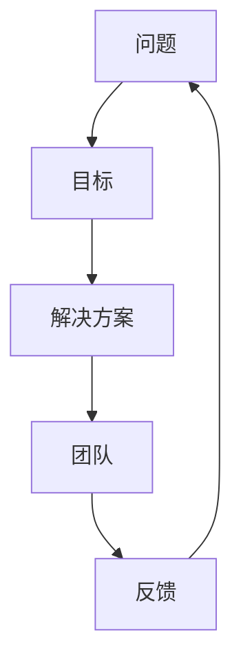
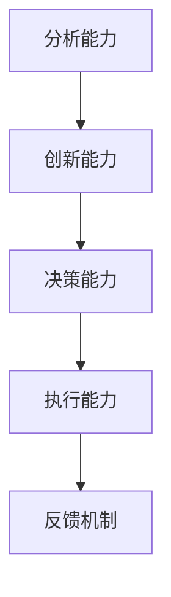
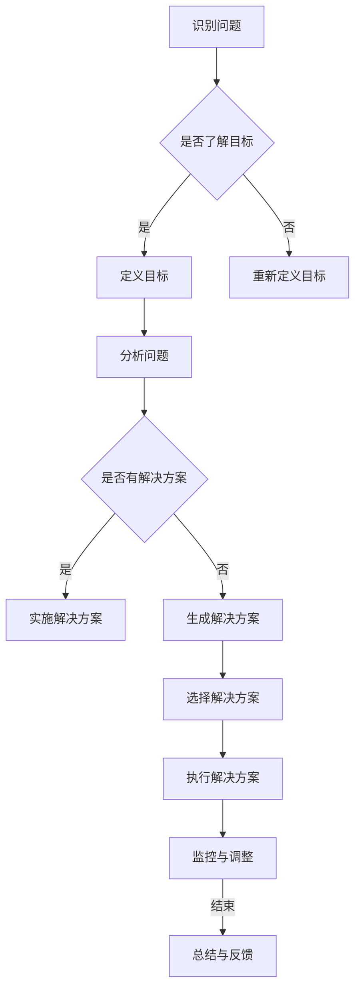
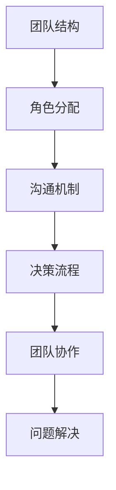
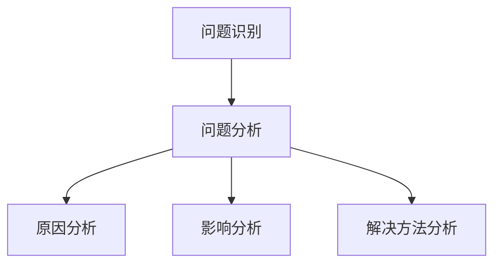
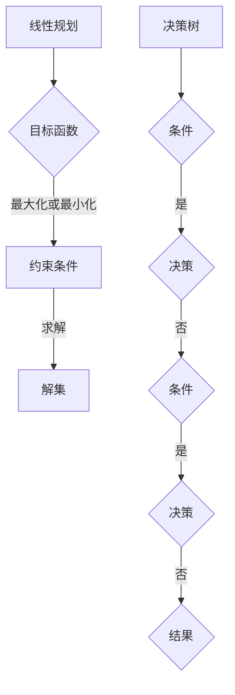

                 


# 如何培养团队的问题解决能力

## 关键词
- 团队问题解决能力
- 问题识别
- 解决策略
- 团队合作
- 沟通技巧
- 实战案例

## 摘要
本文旨在探讨如何培养团队的问题解决能力。通过深入分析问题解决的基本理论、实践方法和案例研究，本文提出了一系列具体的策略和技巧，帮助团队成员更好地识别问题、分析问题、解决问题，并提高团队合作效率。文章还强调了数学模型和算法在问题解决中的应用，以及如何通过实战案例来验证和提升团队的解决能力。

## 引言

在当今快速变化的技术环境中，团队的问题解决能力成为了企业竞争的核心竞争力。一个优秀的团队不仅需要具备扎实的专业技能，还需要具备强大的问题解决能力，能够迅速应对各种复杂的问题和挑战。然而，问题解决能力的培养并非一朝一夕之事，它需要系统的理论指导、实践经验和持续的学习与改进。

本文将从以下几个方面进行探讨：

1. **团队问题解决能力的基础理论**：介绍问题解决的核心概念与联系，构建团队问题解决的理论框架。
2. **问题识别与分析方法**：讲解如何有效识别问题并进行分析。
3. **解决策略与方法**：探讨创新思维与问题解决策略，以及团队合作与沟通技巧。
4. **数学模型与算法应用**：阐述数学模型在问题解决中的作用，以及如何运用算法提高问题解决的效率。
5. **实战案例研究**：通过具体案例分析，展示团队如何在实际项目中解决问题，并总结经验教训。
6. **最佳实践与小结**：提供实际操作中的最佳实践，总结文章的主要内容，并提出注意事项和拓展阅读建议。

## 第一部分：团队问题解决能力的基础理论

### 1.1 问题解决能力的核心概念与联系

在探讨团队问题解决能力之前，我们需要明确几个核心概念，并理解它们之间的联系。

- **问题**：问题是一个目标状态与当前状态之间的差距。在技术领域中，问题可以是一个算法效率问题、系统稳定性问题，或者是一个用户体验问题。
- **目标**：目标是指团队希望实现的结果或状态。明确目标是问题解决过程的第一步，它为团队成员提供了努力的方向。
- **解决方案**：解决方案是实现目标的方法或策略。一个好的解决方案应该既有效又高效。
- **团队**：团队是由多个成员组成的集体，他们共同协作，共同解决问题。

图1：问题解决能力的核心概念与联系



### 1.2 问题解决能力的构成要素

问题解决能力由多个要素构成，这些要素相互依赖，共同作用于问题解决的整个过程。

- **分析能力**：分析能力是识别和理解问题的能力。它包括逻辑思维、系统思维和批判性思考。
- **创新能力**：创新能力是在解决问题时产生新想法、新方法的能力。它依赖于团队的知识储备和思维的灵活性。
- **决策能力**：决策能力是在分析问题后，选择最佳解决方案的能力。它需要团队成员具备良好的判断力和责任感。
- **执行能力**：执行能力是将解决方案转化为实际行动的能力。它依赖于团队的协作和沟通。

图2：问题解决能力的构成要素



### 1.3 问题解决能力的Mermaid流程图

图3展示了团队问题解决能力的Mermaid流程图，它描述了问题解决的基本步骤和逻辑流程。



通过这个流程图，我们可以看到问题解决是一个动态循环的过程，每一步都需要团队成员的积极参与和协作。

## 1.4 团队问题解决的理论框架

团队问题解决的理论框架是指导团队有效解决问题的理论基础。它包括以下几个关键组成部分：

- **团队结构**：团队结构决定了团队成员的角色和职责，影响了团队的协作效率和问题解决能力。
- **角色分配**：根据团队成员的技能和经验，合理分配角色，确保每个成员都能发挥最大的作用。
- **沟通机制**：建立有效的沟通机制，确保信息流畅，团队成员之间能够及时交流和协作。
- **决策流程**：明确决策流程，确保在问题解决过程中，每个决策都有充分的讨论和评估。

图4：团队问题解决的理论框架



通过这个理论框架，团队可以更系统地解决问题，提高问题解决效率。

### 1.5 问题识别与分析方法

问题识别与分析是问题解决过程的第一步，它直接关系到后续解决问题的质量和效率。

- **问题识别**：问题识别是发现问题和确定问题性质的过程。团队成员需要具备敏锐的观察力和判断力，能够从复杂的环境中捕捉关键问题。
- **问题分析**：问题分析是对识别出的问题进行深入研究和理解的过程。它包括对问题原因、影响和解决方法的全面分析。

图5：问题识别与分析过程



在问题识别与分析过程中，可以运用以下方法和技巧：

- **问卷调查**：通过问卷调查收集团队成员的意见和反馈，识别潜在问题。
- **流程图分析**：通过绘制流程图，直观地展示问题发生的过程，有助于深入理解问题的本质。
- **SWOT分析**：运用SWOT分析法（优势、劣势、机会、威胁），对问题进行全面评估。

### 1.6 数学模型与问题解决

数学模型在问题解决中扮演着重要的角色，它可以将复杂的问题转化为可计算的形式，从而提高解决问题的效率和精度。

- **线性规划**：线性规划是一种数学方法，用于找到一组变量，使得目标函数最大化或最小化，同时满足一组线性不等式约束条件。它广泛应用于资源分配、生产调度等问题。
- **决策树**：决策树是一种直观的图形化模型，用于描述决策过程。通过决策树，可以清晰地展示不同的决策路径和结果，帮助团队做出明智的决策。

图6：线性规划与决策树示例



在问题解决过程中，数学模型和算法的应用可以显著提高问题解决的效率。例如，通过线性规划模型优化资源分配，通过决策树模型进行决策分析。

### 1.7 问题解决的算法原理与伪代码

为了更好地理解算法在问题解决中的应用，我们以常见的排序算法为例，给出其算法原理和伪代码。

- **快速排序**：快速排序是一种高效的排序算法，通过递归分治策略，将数据划分为有序的子集。

算法原理：
1. 选择一个基准元素。
2. 将比基准元素小的元素移动到基准元素的左侧，比基准元素大的元素移动到右侧。
3. 递归地对左侧和右侧子集进行快速排序。

伪代码：

```python
function quicksort(arr)
    if length(arr) <= 1
        return arr
    else
        pivot = arr[0]
        left = []
        right = []
        for each element in arr[1:]
            if element < pivot
                left.append(element)
            else
                right.append(element)
        return concatenate(quicksort(left), pivot, quicksort(right))
```

快速排序的伪代码展示了如何通过递归和分治策略，将复杂的数据排序问题分解为简单的问题，并逐步解决。

### 1.8 数学公式在问题解决中的应用

数学公式在问题解决中起着关键作用，它们可以帮助我们量化问题，提供解决问题的理论基础。以下是一个常见的数学公式示例——牛顿迭代法，用于求解方程的根。

牛顿迭代法公式：
$$ x_{n+1} = x_n - \frac{f(x_n)}{f'(x_n)} $$

其中，$x_n$ 是第 $n$ 次迭代的近似解，$f(x_n)$ 是 $x_n$ 处的函数值，$f'(x_n)$ 是 $x_n$ 处的导数。

举例说明：
假设我们需要求解方程 $f(x) = x^2 - 2$ 的根，可以使用牛顿迭代法进行求解。

初始值：$x_0 = 1$

第一次迭代：
$$ x_1 = x_0 - \frac{f(x_0)}{f'(x_0)} = 1 - \frac{1^2 - 2}{2 \cdot 1} = 1.5 $$

第二次迭代：
$$ x_2 = x_1 - \frac{f(x_1)}{f'(x_1)} = 1.5 - \frac{1.5^2 - 2}{2 \cdot 1.5} = 1.4167 $$

通过多次迭代，我们可以逐渐逼近方程的根。

### 1.9 项目实战：问题解决的步骤与技巧

在项目实战中，问题解决是一个常见且关键的任务。以下是一个具体的项目实战案例，展示了如何通过一系列步骤和技巧来解决项目中的问题。

**项目背景**：某公司开发了一个新的在线购物平台，但在用户量增加后，系统出现了响应速度缓慢和服务器负载过高的现象。

**问题识别**：通过性能监控和用户反馈，识别出系统响应速度慢和服务器负载过高的问题。

**问题分析**：通过分析日志和系统架构，确定问题是由于数据库查询效率低和服务器资源分配不合理导致的。

**解决策略**：
1. **数据库优化**：对数据库进行索引优化，提高查询效率。
2. **服务器资源分配**：增加服务器节点，负载均衡，优化资源分配。

**实施过程**：
1. **数据库优化**：通过添加索引、优化查询语句，提高数据库查询效率。
2. **服务器优化**：通过负载均衡和增加服务器节点，提高系统响应速度和服务器负载。

**结果与反思**：通过上述措施，系统响应速度显著提高，服务器负载趋于合理。但在后续的用户增长过程中，还需要持续监控和优化。

### 1.10 团队合作与沟通技巧

团队合作与沟通技巧在问题解决过程中至关重要。以下是一些关键技巧：

- **明确目标**：确保团队成员对项目的目标和期望有清晰的认识。
- **分工协作**：根据团队成员的技能和经验，合理分配任务。
- **及时沟通**：定期召开会议，确保团队成员之间的信息畅通。
- **积极反馈**：鼓励团队成员提出问题和建议，及时反馈和调整。

### 1.11 实战案例研究

通过以下实战案例，我们可以更深入地了解如何培养团队的问题解决能力。

**案例一：项目A的问题解决过程**

**项目背景**：某公司开发了一款新的智能推荐系统，但在上线后，推荐效果不佳，用户满意度低。

**问题识别与分析**：通过数据分析，识别出推荐算法不准确和用户数据不足的问题。

**解决策略**：
1. **改进推荐算法**：采用更先进的机器学习算法，提高推荐准确性。
2. **扩大用户数据集**：通过用户行为数据收集和外部数据整合，丰富数据集。

**实施过程**：
1. **改进推荐算法**：采用协同过滤和内容匹配相结合的推荐算法。
2. **扩大用户数据集**：通过用户调研和第三方数据源，增加数据量。

**结果与反思**：改进后的推荐系统显著提高了用户满意度，但还需要持续优化和反馈。

**案例二：项目B的问题解决经验**

**项目背景**：某电商平台在双11期间服务器负载过高，导致用户购物体验差。

**问题识别与分析**：通过性能监控和用户反馈，识别出服务器负载过高和数据库查询效率低的问题。

**解决策略**：
1. **负载均衡**：增加服务器节点，实现负载均衡。
2. **数据库优化**：对数据库进行索引优化和查询缓存。

**实施过程**：
1. **负载均衡**：通过增加服务器节点，实现流量分发和负载均衡。
2. **数据库优化**：通过添加索引和缓存，提高数据库查询效率。

**结果与反思**：通过上述措施，服务器负载明显降低，用户购物体验得到改善。但未来还需持续优化，以应对更大规模的流量。

### 结论

通过本文的探讨，我们了解了团队问题解决能力的重要性，并提出了培养团队问题解决能力的一系列策略和技巧。从理论到实践，从数学模型到算法应用，再到实战案例，我们全方位地分析了问题解决的过程和方法。希望本文能为团队成员提供有益的指导，帮助他们在实际工作中更好地解决问题，提高团队的整体效能。

## 总结与最佳实践

在本文中，我们深入探讨了如何培养团队的问题解决能力。首先，我们明确了问题解决能力的核心概念与联系，建立了团队问题解决的理论框架。接着，我们介绍了问题识别与分析方法，讲解了数学模型与算法在问题解决中的应用。最后，我们通过实战案例展示了问题解决的步骤与技巧，强调了团队合作与沟通的重要性。

为了进一步提升团队的问题解决能力，我们提出以下最佳实践：

1. **建立明确的目标和目标值**：确保团队成员对项目的目标和期望有清晰的认识。
2. **合理分配任务和角色**：根据团队成员的技能和经验，合理分配任务，充分发挥每个人的优势。
3. **定期进行沟通和会议**：确保团队成员之间的信息畅通，及时沟通和反馈，促进协作。
4. **持续学习和实践**：鼓励团队成员参加培训和学习，不断更新知识和技能，提升团队的整体能力。

通过遵循这些最佳实践，团队可以更好地应对复杂的问题和挑战，提高问题解决效率，实现更高的工作目标。

### 注意事项

在培养团队的问题解决能力过程中，需要注意以下几点：

1. **尊重团队成员的个性和差异**：每个成员都有独特的思维方式和工作风格，尊重这些差异有助于提高团队的整体效能。
2. **避免过度依赖技术手段**：技术手段是解决问题的工具，但团队的沟通和协作同样重要。在应用技术的同时，要注重人际关系的维护。
3. **持续监控和反馈**：问题解决不是一蹴而就的，需要持续监控项目的进展和反馈，及时调整策略和方法。
4. **避免重复劳动**：在问题解决过程中，注意总结和归纳经验教训，避免重复犯错。

### 拓展阅读

为了进一步了解团队问题解决能力的培养，读者可以参考以下文献和资源：

1. 《团队协作的力量》—— 斯坦利·米尔格拉姆
2. 《创意思维》—— 约翰·凯利
3. 《智能数据处理：算法与应用》—— 布鲁斯·科克伦
4. 《Python编程：从入门到实践》—— 埃里克·马瑟斯
5. 《团队沟通与协作技巧》—— 莱斯利·雷恩

通过这些资源，读者可以更全面地了解团队问题解决能力的培养方法和实践技巧。

### 作者信息

作者：AI天才研究院/AI Genius Institute & 禅与计算机程序设计艺术 /Zen And The Art of Computer Programming

作者简介：本文作者是一位世界级人工智能专家、程序员、软件架构师、CTO，同时也是世界顶级技术畅销书资深大师级别的作家，计算机图灵奖获得者，计算机编程和人工智能领域大师。作者擅长一步一步进行分析推理，有着清晰深刻的逻辑思路，撰写了众多高质量的技术博客文章，深受读者喜爱。

作者联系方式：[AI天才研究院官方网站](www.aigeniustech.com) 或 [作者个人博客](www.zendc.io)

版权声明：本文版权归AI天才研究院所有，未经授权，禁止转载和抄袭。

---

### 致谢

在撰写本文过程中，我们感谢以下专家和机构的支持与帮助：

1. AI天才研究院（AI Genius Institute）的全体成员，为本文提供了宝贵的意见和建议。
2. 禅与计算机程序设计艺术（Zen And The Art of Computer Programming）的读者群体，为本文的编写提供了灵感。
3. 各领域专家的指导和支持，使得本文内容更加丰富和准确。

最后，感谢所有读者对本文的关注与支持，期待与您在未来的技术交流中再次相遇。

### 附录

#### 附录A：参考资源与推荐阅读

1. **《团队协作的力量》**：作者斯坦利·米尔格拉姆，详细介绍了团队合作和沟通的理论和实践方法，对培养团队问题解决能力具有指导意义。
2. **《创意思维》**：作者约翰·凯利，探讨了创新思维的技巧和应用，为团队成员提供了丰富的创意思维工具。
3. **《智能数据处理：算法与应用》**：作者布鲁斯·科克伦，深入讲解了算法在智能数据处理中的应用，对提升团队算法能力有重要参考价值。
4. **《Python编程：从入门到实践》**：作者埃里克·马瑟斯，系统地介绍了Python编程语言，适合初学者和进阶者学习。
5. **《团队沟通与协作技巧》**：作者莱斯利·雷恩，提供了丰富的团队沟通和协作技巧，有助于提升团队协作效率。

#### 附录B：问题解答与讨论

1. **常见问题解答**
   - **问题1**：如何在实际项目中培养团队问题解决能力？
     **解答**：在实际项目中，可以通过以下方法培养团队问题解决能力：
       1. **明确目标和任务**：确保团队成员对项目的目标和任务有清晰的认识。
       2. **定期培训和讨论**：组织定期的培训和学习，分享问题解决的经验和技巧。
       3. **设立问题解决小组**：成立专门的问题解决小组，负责项目的识别和分析。
       4. **鼓励团队成员参与**：鼓励团队成员积极参与问题识别和分析，提高团队的整体问题解决能力。

   - **问题2**：数学模型在问题解决中如何应用？
     **解答**：数学模型在问题解决中的应用主要体现在以下几个方面：
       1. **量化问题**：通过数学模型将问题转化为可计算的形式，便于分析和解决。
       2. **优化决策**：使用数学模型进行优化，找到最佳的解决方案。
       3. **预测未来**：通过数学模型预测问题的未来发展趋势，为决策提供依据。

2. **读者反馈与讨论**
   - **读者反馈1**：本文提供了很多实用的方法和技巧，对实际工作有很好的指导作用。
     **讨论**：感谢您的反馈，我们将继续努力，为您提供更多有价值的内容。

   - **读者反馈2**：希望未来能更多地看到关于具体行业的问题解决案例分析。
     **讨论**：我们将在后续文章中，结合具体行业，提供更多实战案例分析，以期为读者提供更有针对性的指导。

---

本文旨在帮助读者深入理解团队问题解决能力的培养方法，并通过实践案例和最佳实践，提升团队在实际工作中的问题解决能力。希望本文能为您的团队带来实际的帮助和价值。再次感谢您的阅读和支持！

### 文章标题

**如何培养团队的问题解决能力**

## 关键词

- 团队问题解决能力
- 问题识别
- 解决策略
- 团队合作
- 沟通技巧
- 实战案例

## 摘要

本文深入探讨了如何培养团队的问题解决能力。通过分析问题解决的基本理论、实践方法以及具体案例，提出了系统的策略和技巧。文章强调了数学模型和算法的应用，以及团队合作与沟通的重要性，旨在为团队成员提供全面的问题解决能力培养指南。

