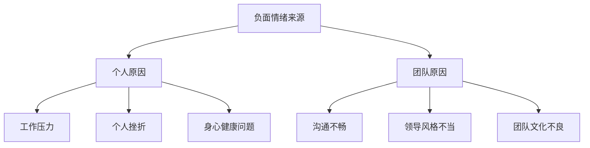

                 

## 文章标题

《如何处理团队中的负面情绪》

## 文章关键词

负面情绪，团队管理，情绪管理，情绪调节，冲突解决，团队文化，领导风格，压力管理，沟通技巧。

## 文章摘要

本文将探讨团队中负面情绪的产生原因、影响及处理策略。首先，我们将理解负面情绪的本质，分析其在个人工作和团队协作中的影响。接着，我们将介绍团队情绪管理的基本原则，包括自我认知、沟通技巧和领导风格等。在此基础上，本文将详细阐述应对个人负面情绪和团队负面情绪的具体策略。此外，本文还将提出负面情绪的长期管理和预防方法，并通过案例分析展示负面情绪处理的有效实践。最后，本文将提供相关资源和建议，以帮助读者更好地处理团队中的负面情绪。

## 第一部分：理解负面情绪

### 第1章：负面情绪的本质

### 1.1 负面情绪的定义与分类

负面情绪是指那些引起不愉快感受的情绪状态，如愤怒、焦虑、沮丧、恐惧等。这些情绪会对个体的心理和生理产生负面影响，降低工作表现和团队协作效率。

负面情绪可以分为以下几种：

1. **愤怒**：一种强烈的负面情绪，通常由不公平或挫败感引起。
2. **焦虑**：对未来可能发生的事情感到担忧和恐惧。
3. **沮丧**：长期感到无助、失落和消极。
4. **恐惧**：对特定事物或情境感到极度害怕。
5. **羞耻**：对自己或他人的行为感到羞辱或不值得。

### 1.2 负面情绪的影响

负面情绪对个人工作的影响主要体现在以下几个方面：

1. **工作效率下降**：负面情绪会分散注意力，降低工作专注度，从而影响工作效率。
2. **决策质量下降**：情绪不稳定会影响决策过程，导致错误判断和决策。
3. **健康问题**：长期处于负面情绪中会增加心理和生理健康问题的风险。

负面情绪对团队协作的影响主要体现在：

1. **沟通障碍**：负面情绪会阻碍有效的沟通，导致误解和冲突。
2. **团队凝聚力下降**：负面情绪会破坏团队间的信任和合作，降低团队凝聚力。
3. **工作效率下降**：团队中的负面情绪会传染给其他成员，进一步降低整体工作效率。

### 1.3 负面情绪的来源

负面情绪的来源可以分为个人原因和团队原因。

个人原因包括：

1. **工作压力**：工作负担过重、工作压力过大是导致负面情绪的主要原因。
2. **个人挫折**：个人在工作和生活中遇到挫折和失败，会导致负面情绪的产生。
3. **身心健康问题**：身心健康问题也会影响情绪状态，增加负面情绪的发生。

团队原因包括：

1. **沟通不畅**：团队内部的沟通不畅会导致误解和矛盾，进而产生负面情绪。
2. **领导风格不当**：领导风格过于强势或缺乏关心，会引发团队成员的不满和焦虑。
3. **团队文化不良**：不良的团队文化会导致成员之间缺乏信任和尊重，增加负面情绪的产生。

### Mermaid 流程图

### 1.4 负面情绪的本质

负面情绪的本质是大脑对内外部刺激的一种反应。当个体遇到挫折、压力或威胁时，大脑会激活相应的神经回路，产生负面情绪。负面情绪的产生过程可以分为以下几个阶段：

1. **认知评估**：个体对情境进行评估，判断情境是否对自己构成威胁或挑战。
2. **情绪激活**：大脑的边缘系统和杏仁核被激活，产生生理和心理反应，如心跳加速、出汗、焦虑等。
3. **情绪体验**：个体体验到负面情绪，如愤怒、焦虑、沮丧等。
4. **情绪调节**：个体通过自我调节或外部支持来缓解负面情绪，如寻求社交支持、进行放松训练等。

### 1.5 负面情绪的生理机制

负面情绪的产生与大脑的多个神经回路有关。以下是一个简化的生理机制：

1. **边缘系统**：包括海马体、杏仁核等结构，负责处理情绪反应。
2. **下丘脑**：调节自主神经系统和内分泌系统的活动，影响情绪和生理状态。
3. **前额叶皮层**：负责认知控制和决策，对情绪产生调节作用。
4. **脑干**：维持基本生命功能，如心跳、呼吸等，也与情绪反应有关。

### 1.6 负面情绪的心理学解释

从心理学的角度来看，负面情绪具有以下几个特点：

1. **适应性**：负面情绪有助于个体适应环境变化，提高生存能力。
2. **持久性**：负面情绪往往持续时间较长，不易消退。
3. **感染性**：负面情绪可以通过言语、行为等方式传递给他人，形成情绪传染。
4. **个体差异性**：不同人对相同情境产生的负面情绪可能不同，这与个体的心理素质、性格特点等有关。

### 1.7 负面情绪的影响因素

负面情绪的影响因素可以分为内在和外在两个方面：

内在因素包括：

1. **遗传因素**：遗传因素对情绪调节能力和情绪易感性有一定影响。
2. **人格特质**：人格特质如神经质、开放性等会影响个体对负面情绪的反应。
3. **心理素质**：心理素质较差的个体更容易受到负面情绪的影响。

外在因素包括：

1. **工作压力**：工作负担过重、工作环境不良等因素会增加负面情绪的发生。
2. **人际关系**：与同事、上级、下属等的人际关系状况会影响负面情绪的产生。
3. **社会支持**：社会支持包括家庭、朋友、团队等，对负面情绪的调节有重要影响。

### 1.8 负面情绪的应对策略

应对负面情绪的策略可以分为以下几个步骤：

1. **认知重构**：通过改变对情境的认知来减少负面情绪的影响。
2. **情绪调节**：通过深呼吸、放松训练等方法来缓解负面情绪。
3. **积极应对**：采取积极的行动来应对负面情绪，如寻求支持、改变工作方式等。
4. **寻求专业帮助**：当负面情绪严重影响生活和工作时，应寻求心理咨询或治疗。

### 1.9 负面情绪的预防措施

为了预防负面情绪的产生，可以采取以下措施：

1. **合理安排工作**：合理分配工作任务，避免过度工作。
2. **培养良好的人际关系**：建立和谐的人际关系，增进团队合作。
3. **保持身心健康**：保持良好的生活习惯，注重身心健康。
4. **培养情绪调节能力**：通过学习心理学知识和技能，提高情绪调节能力。

### 1.10 负面情绪管理的重要性

负面情绪管理对于个人和团队的重要性不言而喻。对于个人来说，良好的情绪管理能力有助于提高工作效率和生活质量；对于团队来说，积极的情绪氛围有助于提升团队凝聚力和工作效率。因此，理解和掌握负面情绪的管理策略对于个人和团队都具有重要意义。

### 总结

负面情绪是团队中常见的现象，其产生原因复杂，影响深远。通过了解负面情绪的本质、影响、来源和应对策略，我们可以更好地预防和处理负面情绪，提高个人和团队的工作效率和生活质量。在接下来的章节中，我们将进一步探讨团队情绪管理的基本原则和具体处理策略。

## 第二部分：团队情绪管理的基本原则

### 第2章：团队情绪管理的基本原则

情绪管理是团队成功的关键因素之一。有效的情绪管理能够提升团队的凝聚力和工作效率，促进团队协作和成长。在本章中，我们将探讨团队情绪管理的基本原则，包括自我认知、沟通技巧和领导风格等方面。

### 2.1 情绪管理的核心要素

情绪管理的核心要素包括以下几个方面：

1. **自我认知**：自我认知是指个体对自身情绪的认知和了解。通过自我认知，个体可以更好地理解自己的情绪，从而更好地管理和调节情绪。

2. **沟通技巧**：沟通技巧是指个体在沟通过程中运用的一系列策略和方法。有效的沟通技巧有助于减少误解和冲突，建立和谐的团队氛围。

3. **领导风格**：领导风格是指领导者在与团队成员互动时所采用的行为方式。不同的领导风格会对团队成员的情绪产生不同的影响，因此选择合适的领导风格对于情绪管理至关重要。

### 2.2 自我认知

自我认知是情绪管理的基础。通过自我认知，个体可以更好地了解自己的情绪状态，从而更好地管理和调节情绪。

自我认知的方法包括：

1. **情绪日记**：记录自己的情绪变化，分析情绪产生的原因和影响。

2. **自我反思**：定期进行自我反思，思考自己在工作和生活中的情绪表现，找出情绪管理的不足之处。

3. **情绪识别**：学会识别自己的情绪，区分不同的情绪类型，如愤怒、焦虑、沮丧等。

### 2.3 沟通技巧

沟通技巧在情绪管理中起着关键作用。有效的沟通技巧可以减少误解和冲突，促进团队协作。

沟通技巧包括：

1. **倾听**：倾听是有效沟通的基础。通过倾听，个体可以更好地理解他人的观点和感受，从而更好地回应对方。

2. **表达**：清晰、准确地表达自己的想法和感受。表达时应注意语言的选择和表达方式，避免使用攻击性或指责性的语言。

3. **非语言沟通**：非语言沟通包括肢体语言、面部表情、声音等。有效的非语言沟通可以增强沟通效果，传递积极的信息。

### 2.4 领导风格

领导风格对团队成员的情绪有重要影响。选择合适的领导风格可以提高团队的情绪氛围，促进团队协作。

常见的领导风格包括：

1. **权威型**：权威型领导者强调控制和指挥，对团队成员的自主性限制较大。

2. **民主型**：民主型领导者注重团队成员的参与和决策，鼓励成员表达意见和参与决策。

3. **放任型**：放任型领导者对团队成员较为宽松，允许成员自行管理和决策。

### 2.5 情绪管理的方法

情绪管理的方法主要包括以下几个方面：

1. **正面情绪的培养**：通过积极的心态和行动，培养和保持正面情绪。

2. **负面情绪的释放**：通过适当的渠道和方式，释放负面情绪，避免情绪积累。

3. **情绪调节策略**：通过深呼吸、冥想、放松训练等方法，调节情绪，缓解压力。

### 2.6 情绪监控与评估

情绪监控与评估是团队情绪管理的重要环节。通过情绪监控和评估，可以了解团队的情绪状态，及时发现问题并采取措施。

情绪监控的方法包括：

1. **定期调查**：通过问卷调查、访谈等方式，了解团队成员的情绪状态。

2. **情绪反馈**：建立情绪反馈机制，鼓励团队成员表达自己的情绪和感受。

情绪评估的工具包括：

1. **情绪量表**：通过情绪量表，评估团队成员的情绪状态。

2. **情绪记录表**：记录团队成员的情绪变化，分析情绪产生的原因和影响。

### 2.7 情绪管理在团队中的应用

情绪管理在团队中的应用主要体现在以下几个方面：

1. **团队建设**：通过情绪管理培训，提高团队成员的情绪管理能力，促进团队建设。

2. **冲突解决**：通过情绪管理策略，减少冲突发生的可能性，有效解决冲突。

3. **工作效率提升**：通过情绪管理，提高团队成员的工作积极性和效率。

### 2.8 情绪管理案例分析

以下是一个情绪管理案例：

**案例背景**：某公司团队在项目开发过程中，由于任务繁重和时间紧迫，团队成员普遍感到压力较大，情绪波动较大，导致沟通不畅和效率降低。

**案例分析**：

1. **自我认知**：团队成员通过情绪日记，记录自己的情绪变化，分析情绪产生的原因。

2. **沟通技巧**：团队领导组织团队成员进行沟通技巧培训，提高团队成员的沟通能力。

3. **领导风格**：团队领导采用民主型领导风格，鼓励团队成员表达意见，参与决策。

4. **情绪调节**：团队成员通过深呼吸、冥想等方式，调节情绪，缓解压力。

5. **情绪监控与评估**：团队领导定期进行情绪调查，了解团队成员的情绪状态，及时解决问题。

**案例结果**：通过情绪管理，团队成员的情绪得到有效调节，沟通不畅的问题得到解决，工作效率得到提升，项目顺利完成。

### 总结

团队情绪管理是提升团队绩效和团队幸福感的重要手段。通过自我认知、沟通技巧和领导风格等核心要素，我们可以有效地管理和调节团队情绪，促进团队协作和成长。在接下来的章节中，我们将进一步探讨负面情绪的具体处理策略。

## 第三部分：负面情绪的具体处理策略

### 第3章：应对个人负面情绪

在团队环境中，个人的负面情绪往往会对整体氛围产生显著影响。因此，有效地应对个人负面情绪是团队情绪管理的重要一环。在本章中，我们将探讨应对个人负面情绪的策略，包括自我认知与情绪调节、应对压力与挫折、以及应对焦虑与恐惧等方面。

### 3.1 自我认知与情绪调节

自我认知是情绪调节的前提。通过深入了解自己的情绪，个体可以更好地识别和应对负面情绪。

#### 3.1.1 自我认知的重要性

自我认知的重要性体现在以下几个方面：

1. **情绪识别**：通过自我认知，个体能够准确识别自己的情绪状态，如愤怒、焦虑或沮丧。
2. **情绪理解**：了解情绪背后的原因，有助于个体更好地理解自己的感受。
3. **情绪控制**：自我认知有助于个体在情绪波动时，采取适当的调节策略。

#### 3.1.2 情绪调节的技巧

情绪调节的技巧主要包括：

1. **情绪日记**：通过记录自己的情绪变化，个体可以更清晰地看到情绪的波动和规律。
2. **情绪标签**：为情绪贴上标签，如“焦虑”、“沮丧”等，有助于个体认识到情绪的多样性。
3. **认知重构**：通过改变对情境的认知，个体可以减少负面情绪的影响。

### 3.2 应对压力与挫折

在团队环境中，工作压力和挫折是常见的负面情绪来源。有效地应对压力与挫折，有助于保持良好的情绪状态。

#### 3.2.1 压力的来源

压力的来源可以包括以下几个方面：

1. **工作任务**：过量的工作任务和紧迫的截止日期会增加工作压力。
2. **人际关系**：与同事、上级或下属的冲突会增加人际压力。
3. **角色模糊**：不清楚自己的职责和期望，会增加角色压力。

#### 3.2.2 应对挫折的策略

应对挫折的策略包括：

1. **目标设定**：设定明确、可达成的目标，有助于减少挫折感。
2. **积极思考**：用积极的角度看待挫折，将其视为成长和学习的机会。
3. **寻求支持**：与同事、朋友或家人分享挫折感受，获得情感支持。

### 3.3 应对焦虑与恐惧

焦虑和恐惧是常见的负面情绪，它们会影响个人的工作表现和团队协作。

#### 3.3.1 焦虑与恐惧的特点

焦虑与恐惧的特点包括：

1. **不确定感**：对未知事物或结果的担忧，是焦虑的主要特征。
2. **逃避行为**：恐惧可能导致个体避免面对恐惧的情境。
3. **身体反应**：焦虑和恐惧常伴随着身体反应，如心跳加速、出汗等。

#### 3.3.2 减轻焦虑与恐惧的方法

减轻焦虑与恐惧的方法包括：

1. **放松训练**：通过深呼吸、冥想等方法，放松身体和情绪。
2. **认知重构**：改变对恐惧情境的认知，降低恐惧程度。
3. **行为暴露**：逐渐暴露于恐惧情境，减少恐惧感。

### 3.4 自我激励与自我提升

自我激励与自我提升是应对负面情绪的重要策略。通过自我激励，个体可以保持积极的心态和动力，从而更好地应对负面情绪。

#### 3.4.1 自我激励的方法

自我激励的方法包括：

1. **设定目标**：设定短期和长期目标，保持前进的动力。
2. **正面肯定**：通过正面肯定自己的能力和成就，增强自信。
3. **奖励机制**：为自己设定奖励，庆祝每一个小成就。

#### 3.4.2 自我提升的策略

自我提升的策略包括：

1. **学习新技能**：通过学习新技能，提升自己的能力。
2. **参加培训**：参加相关的培训课程，获取新知识和新方法。
3. **反思与总结**：定期反思自己的工作表现，总结经验教训。

### 3.5 情绪管理与心理辅导

在某些情况下，个人负面情绪可能无法通过自我调节来解决。此时，寻求专业心理辅导是必要的。

#### 3.5.1 心理辅导的作用

心理辅导的作用包括：

1. **情绪疏导**：专业心理咨询师可以帮助个体释放负面情绪，减轻心理负担。
2. **认知重塑**：通过认知行为疗法等技术，改变个体对负面情绪的认知。
3. **技能培训**：教授个体情绪调节的方法和技能，提高情绪管理能力。

#### 3.5.2 心理辅导的选择

选择心理辅导时，可以考虑以下几个因素：

1. **专业资质**：选择具备专业资质和经验的咨询师。
2. **匹配度**：选择与自己需求和偏好相匹配的咨询师。
3. **保密性**：确保咨询过程和信息的保密性。

### 总结

应对个人负面情绪是团队情绪管理的关键。通过自我认知与情绪调节、应对压力与挫折、以及应对焦虑与恐惧等策略，个体可以更好地管理自己的情绪，提升工作表现和团队协作。在接下来的章节中，我们将探讨如何处理团队负面情绪，包括建立积极的团队文化和应对团队冲突等。

## 第4章：团队负面情绪的处理

在团队环境中，负面情绪不仅影响个人，还可能对整个团队的氛围和工作效率产生深远的影响。因此，有效地处理团队负面情绪是团队管理的重要任务。在本章中，我们将讨论如何建立积极的团队文化、应对团队冲突以及应对团队负面情绪传染。

### 4.1 建立积极的团队文化

建立积极的团队文化是处理团队负面情绪的基础。一个健康的团队文化能够鼓励成员之间的互相支持和理解，从而减少负面情绪的产生。

#### 4.1.1 团队文化的构建

团队文化的构建包括以下几个关键步骤：

1. **明确价值观**：团队需要共同明确并遵守的价值观，这些价值观应该鼓励积极的态度和行为。
2. **建立信任**：通过开放和诚实的沟通，建立团队成员之间的信任关系。
3. **鼓励反馈**：鼓励团队成员提供积极的反馈和建设性的批评，促进个人和团队成长。
4. **公平公正**：确保团队中的每个人都感受到公平和公正，避免偏见和歧视。

#### 4.1.2 积极文化的维护

维护积极文化的策略包括：

1. **领导示范**：领导者应该通过自己的行为来示范积极的态度和价值观。
2. **团队活动**：定期组织团队活动，加强团队成员之间的联系和互动。
3. **认可与奖励**：对团队成员的积极行为和成就给予认可和奖励，增强团队凝聚力。
4. **持续沟通**：保持开放的沟通渠道，及时解决团队成员的疑问和问题。

### 4.2 应对团队冲突

团队冲突是负面情绪的重要来源之一。有效地应对团队冲突，可以减少负面情绪的产生，并促进团队和谐。

#### 4.2.1 冲突的类型

团队冲突可以分为以下几种类型：

1. **任务冲突**：与工作任务相关的冲突，如工作分配、进度安排等。
2. **人际关系冲突**：与团队成员之间的个人关系相关的冲突，如沟通不畅、误解等。
3. **价值观冲突**：与团队成员的价值观和信念不一致导致的冲突。

#### 4.2.2 处理冲突的策略

处理团队冲突的策略包括：

1. **积极沟通**：鼓励团队成员通过积极的沟通来解决冲突，避免指责和攻击。
2. **倾听和理解**：倾听对方的观点，尝试理解对方的立场和感受。
3. **寻求共识**：通过讨论和协商，寻找双方都能接受的解决方案。
4. **第三方调解**：在冲突无法自行解决时，可以寻求第三方的帮助，如团队领导或专业调解人员。

### 4.3 应对团队负面情绪传染

负面情绪在团队中具有传染性，一个成员的负面情绪可能会影响到整个团队。因此，应对负面情绪传染是团队情绪管理的重要任务。

#### 4.3.1 情绪传染的机制

情绪传染的机制主要包括：

1. **模仿**：团队成员通过观察和模仿其他成员的行为和情绪，产生类似的情绪反应。
2. **共情**：团队成员在情感上感受到其他成员的情绪，从而产生共鸣。
3. **社交反馈**：团队成员之间的互动和反馈，会加强或减弱情绪传染的效果。

#### 4.3.2 预防情绪传染的方法

预防情绪传染的方法包括：

1. **提高情绪识别能力**：通过培训，提高团队成员对负面情绪的识别和应对能力。
2. **建立支持网络**：鼓励团队成员建立支持网络，互相支持和鼓励。
3. **积极情绪传播**：通过庆祝团队成就和积极事件，传播积极情绪。
4. **及时干预**：在负面情绪出现时，及时干预，减少其传播范围。

### 4.4 团队情绪的监控与评估

监控和评估团队情绪是有效处理团队负面情绪的关键步骤。通过监控和评估，可以及时发现情绪问题，并采取相应的措施。

#### 4.4.1 情绪监控的方法

情绪监控的方法包括：

1. **定期调查**：通过问卷调查、访谈等方式，了解团队成员的情绪状态。
2. **情绪日志**：鼓励团队成员记录自己的情绪变化，进行分析和反馈。
3. **团队会议**：定期召开团队会议，讨论团队成员的情绪和挑战。

#### 4.4.2 情绪评估的工具

情绪评估的工具包括：

1. **情绪量表**：使用标准化的情绪量表，评估团队成员的情绪状态。
2. **情绪反馈系统**：建立情绪反馈系统，收集团队成员的情绪反馈。
3. **情绪分析软件**：利用情绪分析软件，分析团队成员的情绪数据。

### 4.5 团队情绪管理案例分析

以下是一个团队情绪管理案例：

**案例背景**：某团队在项目开发过程中，由于项目进度紧张和工作压力增大，团队成员普遍出现焦虑和沮丧情绪，影响了团队协作和工作效率。

**案例分析**：

1. **建立积极文化**：团队领导通过组织团队建设活动和明确价值观，增强团队成员的积极态度和凝聚力。
2. **应对冲突**：团队领导及时介入，解决团队成员之间的任务冲突和人际关系冲突，避免负面情绪的扩大。
3. **情绪监控与干预**：团队领导定期进行情绪监控，通过情绪日志和团队会议，了解团队成员的情绪变化，并采取干预措施，如调整工作任务、提供心理辅导等。
4. **积极情绪传播**：通过团队表彰和庆祝活动，传播积极情绪，激励团队成员。

**案例结果**：通过有效的团队情绪管理，团队成员的情绪得到了显著改善，团队协作效率提升，项目顺利完成。

### 总结

团队负面情绪的处理是团队情绪管理的重要内容。通过建立积极的团队文化、应对团队冲突和预防情绪传染等策略，团队可以有效地管理负面情绪，提升工作表现和团队凝聚力。在接下来的章节中，我们将进一步探讨负面情绪的长期管理与预防方法。

## 第5章：负面情绪的长期管理

在团队中，负面情绪并非一蹴而就可以完全消除的。为了实现长期的情绪稳定和团队和谐，我们需要采取一系列持续的策略和管理方法。在本章中，我们将探讨负面情绪的长期管理，包括建立有效的情绪反馈机制、持续的情绪培训与教育，以及建立良好的团队关系。

### 5.1 建立有效的情绪反馈机制

情绪反馈机制是团队情绪管理的重要组成部分，它有助于及时发现和解决情绪问题。

#### 5.1.1 反馈机制的设计

一个有效的情绪反馈机制应包括以下几个关键要素：

1. **开放性**：确保团队成员能够自由表达自己的情绪和感受，无论正面或负面。
2. **匿名性**：保护团队成员的隐私，鼓励他们坦诚地反馈情绪。
3. **及时性**：情绪问题应及时反馈和处理，以防止负面情绪的积累和扩散。
4. **多样性**：提供多种反馈渠道，如问卷调查、面对面访谈、匿名反馈等。

#### 5.1.2 反馈机制的实施

实施情绪反馈机制的具体步骤包括：

1. **宣传推广**：通过团队会议、邮件等方式，宣传情绪反馈机制的重要性和使用方法。
2. **培训指导**：对团队成员进行情绪反馈的培训，确保他们了解如何有效反馈情绪。
3. **定期评估**：定期评估情绪反馈机制的效果，并根据反馈进行调整和改进。
4. **反馈报告**：将情绪反馈结果进行汇总和分析，形成反馈报告，供团队领导和成员参考。

### 5.2 持续的情绪培训与教育

情绪培训与教育是提升团队成员情绪管理能力的重要手段。通过持续的情绪培训与教育，可以增强团队的整体情绪管理能力。

#### 5.2.1 情绪培训的内容

情绪培训的内容应包括以下方面：

1. **情绪识别**：教授成员如何识别和理解自己的情绪，以及他人的情绪。
2. **情绪调节**：教授成员情绪调节的技巧，如深呼吸、放松训练、认知重构等。
3. **沟通技巧**：提高成员的沟通能力，帮助他们更有效地表达情绪和倾听他人。
4. **冲突解决**：教授成员如何通过积极的沟通和协商解决冲突，减少负面情绪。

#### 5.2.2 情绪培训的方法

情绪培训的方法包括：

1. **内训课程**：组织内部的情绪管理培训课程，邀请专业讲师授课。
2. **外部培训**：鼓励成员参加外部情绪管理的专业培训，如心理学课程、情绪管理研讨会等。
3. **在线学习**：利用在线资源和平台，提供情绪管理的自学材料。
4. **案例讨论**：通过案例分析，讨论情绪管理的实际应用和挑战。

### 5.3 建立良好的团队关系

良好的团队关系是情绪管理的基础。通过建立和维护良好的团队关系，可以减少负面情绪的产生，增强团队凝聚力。

#### 5.3.1 团队关系的建立

建立良好的团队关系包括以下几个步骤：

1. **信任建设**：通过开放和诚实的沟通，建立团队成员之间的信任。
2. **相互尊重**：尊重团队成员的个人差异和观点，促进团队内部的和谐。
3. **共同目标**：明确团队的目标和愿景，确保团队成员朝着共同的目标努力。
4. **互助合作**：鼓励团队成员之间的互助合作，共同应对挑战。

#### 5.3.2 团队关系的维护

维护良好的团队关系需要持续的努力，包括：

1. **定期沟通**：定期召开团队会议，讨论团队进展和成员需求。
2. **团队活动**：组织定期的团队建设活动，增强团队成员之间的联系。
3. **情感支持**：在成员遇到困难和挑战时，提供情感支持，帮助他们度过难关。
4. **认可与奖励**：对团队成员的成就和贡献给予认可和奖励，增强团队凝聚力。

### 5.4 长期情绪管理的案例分析

以下是一个长期情绪管理的案例：

**案例背景**：某团队在项目开发过程中，由于工作量巨大和时间紧迫，团队成员出现了严重的负面情绪，影响了工作效率和团队协作。

**案例分析**：

1. **建立情绪反馈机制**：团队领导建立了一个匿名反馈系统，鼓励成员表达自己的情绪和挑战。
2. **持续情绪培训**：团队领导组织了一系列情绪管理培训，帮助成员提升情绪识别和调节能力。
3. **情感支持网络**：团队内部建立了情感支持网络，成员可以随时寻求帮助和支持。
4. **定期团队建设活动**：团队定期组织团建活动，增强团队成员之间的信任和联系。

**案例结果**：通过有效的情绪管理和关系建设，团队成员的情绪得到了显著改善，工作效率和团队协作水平明显提升，项目最终顺利完成。

### 总结

负面情绪的长期管理需要持续的努力和策略。通过建立有效的情绪反馈机制、持续的情绪培训与教育，以及建立良好的团队关系，团队可以保持长期的情绪稳定和和谐，从而提高工作表现和团队凝聚力。在接下来的章节中，我们将探讨负面情绪的预防策略，以进一步巩固团队情绪管理的成果。

## 第6章：负面情绪的预防

预防负面情绪是团队情绪管理的关键环节。通过采取有效的预防措施，团队可以减少负面情绪的产生，提高整体情绪氛围和工作效率。在本章中，我们将探讨负面情绪预防的策略，包括工作与生活的平衡、有效的压力管理和建立良好的团队沟通。

### 6.1 预防负面情绪的策略

预防负面情绪的策略可以分为以下几个方面：

#### 6.1.1 工作与生活的平衡

工作与生活的平衡是预防负面情绪的重要策略。以下是一些实现工作与生活平衡的方法：

1. **设定明确的工作时间**：确保工作时间不被非工作事务干扰，提高工作效率。
2. **制定个人时间表**：规划个人时间，确保有足够的时间用于家庭、休闲和兴趣爱好。
3. **避免过度工作**：合理安排工作任务，避免过度劳累，确保有足够的休息时间。
4. **灵活的工作安排**：提供灵活的工作安排，如远程工作、弹性工作时间等，以适应不同成员的需求。

#### 6.1.2 有效的压力管理

压力是负面情绪的主要来源之一。有效的压力管理策略可以帮助团队减少压力，提高情绪稳定性和工作效率。以下是一些有效的压力管理策略：

1. **认知重构**：通过改变对压力事件的认知，将其视为挑战而非威胁，以减少压力感。
2. **时间管理**：合理规划时间，避免拖延和过度工作，确保有足够的时间应对紧急事务。
3. **放松技巧**：学习和应用放松技巧，如深呼吸、冥想、瑜伽等，以缓解压力。
4. **健康生活方式**：保持健康的生活习惯，如合理饮食、充足睡眠、定期锻炼等，以提高抗压能力。

#### 6.1.3 建立良好的团队沟通

良好的团队沟通是预防负面情绪的重要手段。以下是一些建立良好团队沟通的策略：

1. **开放性沟通**：鼓励团队成员在团队中自由表达自己的观点和感受，建立开放和诚实的沟通氛围。
2. **积极倾听**：倾听他人的观点和感受，避免打断和批评，以增强团队成员之间的理解和信任。
3. **明确沟通目标**：在沟通前明确目标，确保沟通内容清晰、有针对性。
4. **有效反馈**：鼓励团队成员提供积极和建设性的反馈，以提高沟通效果。

### 6.2 工作与生活的平衡

工作与生活的平衡对团队成员的身心健康和情绪管理至关重要。以下是一些具体的方法来实现工作与生活的平衡：

1. **设定工作时间表**：每天设定固定的开始和结束工作时间，确保工作不会侵占个人时间。
2. **管理工作任务**：合理分配工作任务，避免过度依赖个别成员，确保团队成员有足够的时间休息和放松。
3. **家庭时间**：确保有足够的时间陪伴家人，参与家庭活动，以增强家庭关系和幸福感。
4. **休闲活动**：安排定期的休闲活动，如运动、旅行、读书等，以缓解工作压力。

### 6.3 有效的压力管理

有效的压力管理可以帮助团队成员更好地应对工作压力，提高情绪稳定性和工作效率。以下是一些具体的方法来管理压力：

1. **认知重构**：通过认知重构，改变对压力事件的看法，将其视为机会而非威胁。例如，将加班视为提升自己的能力的机会。
2. **时间管理**：合理规划时间，优先处理重要和紧急的任务，避免拖延和过度工作。
3. **放松技巧**：学习和应用放松技巧，如深呼吸、冥想、瑜伽等，以缓解压力。在感到紧张或焦虑时，可以随时应用这些技巧。
4. **健康生活方式**：保持健康的生活习惯，如合理饮食、充足睡眠、定期锻炼等，以提高抗压能力。

### 6.4 建立良好的团队沟通

良好的团队沟通可以增强团队成员之间的理解和信任，减少误解和冲突，从而预防负面情绪的产生。以下是一些建立良好团队沟通的具体方法：

1. **开放性沟通**：鼓励团队成员在团队中自由表达自己的观点和感受，无论正面或负面。建立开放的沟通氛围，使团队成员感到安全和被尊重。
2. **积极倾听**：在沟通时，积极倾听他人的观点和感受，避免打断和批评。通过倾听，建立信任和理解。
3. **明确沟通目标**：在沟通前明确目标，确保沟通内容清晰、有针对性。明确沟通的目的和期望结果，有助于提高沟通效果。
4. **有效反馈**：鼓励团队成员提供积极和建设性的反馈，以提高沟通效果。有效反馈包括正面肯定和建设性建议。

### 总结

预防负面情绪是团队情绪管理的重要任务。通过工作与生活的平衡、有效的压力管理和建立良好的团队沟通，团队可以减少负面情绪的产生，提高整体情绪氛围和工作效率。在接下来的章节中，我们将通过案例分析，展示负面情绪处理的有效实践。

## 第7章：负面情绪处理的案例分析

在实际工作中，负面情绪的处理不仅需要理论指导，更需要具体的实践案例来展示如何应对和处理。在本章中，我们将通过两个具体的案例，详细分析负面情绪的处理过程、策略和方法，以及取得的成效。

### 7.1 案例一：团队冲突的处理

#### 7.1.1 案例背景

某科技公司的软件开发团队在项目开发过程中，因为任务分工和进度安排出现了严重的分歧。团队成员A和B在任务分配上存在争议，A认为B的任务量过大，而B则认为A的任务相对轻松。此外，团队成员C和D在进度安排上意见不一，导致项目进度延误。这种冲突不仅影响了团队的工作效率，还严重影响了团队的士气和合作氛围。

#### 7.1.2 处理过程

1. **初步沟通**：团队领导组织了一次会议，让所有团队成员参与，并要求他们表达自己的观点和感受。在会议中，团队领导强调了冲突解决的重要性，并鼓励团队成员开放地沟通。

2. **问题识别**：通过初步沟通，团队领导识别出冲突的主要原因是任务分配不均和进度安排不当。

3. **协商方案**：团队领导组织了一次小组讨论，让A和B讨论如何重新分配任务，确保每个人的工作量合理。同时，C和D也讨论了如何优化进度安排，确保项目按时完成。

4. **达成共识**：在讨论过程中，A和B达成了共识，决定互换部分任务，使工作更加均衡。C和D也找到了合适的解决方案，调整了项目进度，确保按时完成。

5. **后续跟进**：团队领导定期跟进项目进展，确保冲突不再复发。同时，团队领导还组织了一次反思会议，让团队成员分享冲突处理的经验和教训。

#### 7.1.3 案例分析

通过这个案例，我们可以看到，团队冲突的有效处理需要以下几个关键步骤：

1. **开放沟通**：通过开放沟通，让团队成员表达自己的观点和感受，有助于识别冲突的根源。
2. **协商方案**：通过协商，找到双方都能接受的解决方案，避免单方面决策。
3. **达成共识**：确保所有团队成员都参与决策过程，达成共识，有助于提高执行效果。
4. **后续跟进**：定期跟进冲突处理的结果，确保问题不再复发。

### 7.2 案例二：个人情绪管理的实践

#### 7.2.1 案例背景

某公司的项目经理Linda在最近的项目管理中遇到了巨大的压力。项目进展缓慢，团队成员之间出现分歧，客户对项目进度不满意，这些都让Linda感到焦虑和沮丧。她开始感到身体疲劳，工作效率下降，甚至影响了家庭生活。

#### 7.2.2 情绪管理过程

1. **自我认知**：Linda通过自我反思，认识到自己的情绪问题，并意识到需要采取措施来管理情绪。

2. **情绪日记**：Linda开始记录自己的情绪变化，分析情绪波动的原因，以及情绪对自己的工作和生活的影响。

3. **情绪调节**：Linda采用了一些情绪调节技巧，如深呼吸、冥想和瑜伽等，以缓解压力和焦虑。

4. **积极应对**：Linda与团队成员进行了积极的沟通，解决了项目中的分歧，并调整了项目进度，以适应客户的需求。

5. **寻求支持**：Linda还寻求了同事和心理辅导师的支持，与他们分享自己的情绪问题，并获取了宝贵的建议和帮助。

#### 7.2.3 案例分析

这个案例展示了个人情绪管理的有效实践，以下是几个关键点：

1. **自我认知**：认识到自己的情绪问题，是情绪管理的前提。

2. **情绪日记**：记录情绪变化，有助于分析和理解情绪的波动。

3. **情绪调节**：通过情绪调节技巧，如深呼吸、冥想等，可以帮助缓解压力和焦虑。

4. **积极应对**：采取积极的行动，解决问题，以改善情绪状态。

5. **寻求支持**：寻求专业支持和帮助，有助于更有效地管理情绪。

### 总结

通过这两个案例，我们可以看到负面情绪的处理需要结合具体情况进行灵活应对。无论是团队冲突的处理，还是个人情绪的管理，都需要遵循开放沟通、协商方案、积极应对和持续跟进等原则。这些案例不仅展示了负面情绪处理的具体策略和方法，还强调了团队成员的积极参与和团队领导的支持作用。在现实工作中，我们可以借鉴这些经验，提高团队情绪管理的有效性。

## 附录：负面情绪处理工具与资源

在处理团队中的负面情绪时，利用一些工具和资源可以显著提升管理效果。以下是一些推荐的负面情绪处理工具、相关书籍和论文。

### 附录A：负面情绪处理工具推荐

1. **情绪日记**：
   - 功能：帮助记录和分析情绪变化，提供自我认知的途径。
   - 使用方法：定期填写，分析情绪模式和触发因素。

2. **情绪管理软件**：
   - 例如：Headspace、Calm等，提供冥想、放松训练和情绪跟踪功能。

3. **情绪反馈系统**：
   - 功能：收集团队成员的情绪反馈，帮助识别和解决情绪问题。
   - 使用方法：定期发起调查，分析反馈结果，并采取相应措施。

### 附录B：相关书籍与论文推荐

1. **《情绪智力》**：
   - 作者：丹尼尔·戈尔曼
   - 内容：介绍情绪智力的重要性，如何提升情绪管理能力。

2. **《非暴力沟通》**：
   - 作者：马歇尔·卢森堡
   - 内容：提供沟通技巧，帮助解决冲突和建立积极的人际关系。

3. **相关学术论文**：
   - 例如：“Emotional Labor in Organizations”和“Team Emotional Intelligence and Team Performance”等，探讨情绪管理在组织中的影响。

### 总结

通过使用情绪日记、情绪管理软件和情绪反馈系统等工具，以及参考《情绪智力》、《非暴力沟通》等书籍和学术论文，团队可以更有效地识别和应对负面情绪。这些资源和工具为团队情绪管理提供了丰富的理论和实践指导，有助于建立更加健康、和谐的团队氛围。

### 作者信息

作者：AI天才研究院/AI Genius Institute & 禅与计算机程序设计艺术 /Zen And The Art of Computer Programming

感谢您的阅读，希望这篇文章对您在团队情绪管理方面有所启发和帮助。如果您有任何疑问或建议，欢迎随时与我们联系。祝您工作顺利，情绪稳定！

