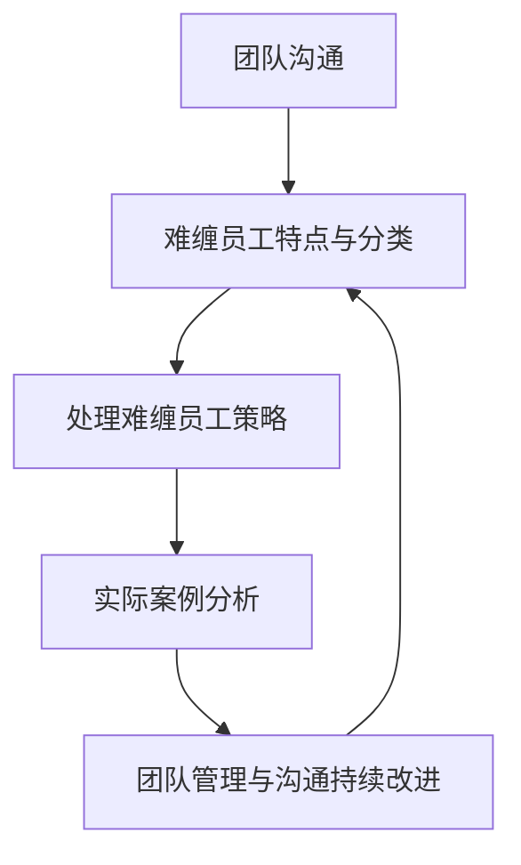

                 


### 文章标题
《如何处理团队中的“难缠”员工：策略与实践》

### 关键词
团队管理，人际沟通，难缠员工，策略，实践，心理分析，解决方法

### 摘要
在职场中，每个团队都可能出现所谓的“难缠”员工。他们可能表现出负面行为，对团队的协作和效率造成影响。本文将探讨如何识别和处理这类员工，提供实用的策略和实践方法，帮助团队管理者解决这一棘手问题，提升团队的整体效能。

## 引言
团队是现代企业运作的核心，高效协作的团队能够为企业创造巨大价值。然而，在团队中总会遇到那些难以相处的员工，他们可能因为个人性格、价值观的差异，或者是对工作环境的不满，而表现出各种“难缠”的行为。这些行为可能包括爱挑刺、情绪化、拖延等，严重时甚至可能破坏团队的凝聚力和工作效率。因此，如何处理团队中的“难缠”员工，成为了团队管理者面临的重要挑战。

本文将围绕这一主题，探讨难缠员工的特点与分类、处理策略、实际案例分析，以及团队管理的持续改进。通过逻辑清晰、结构紧凑的分析，希望能为团队管理者提供实用的指导，帮助他们在复杂的人际关系中找到解决问题的方法。

### 思考步骤

#### 步骤1：确定书籍的核心主题
从书名《如何处理团队中的“难缠”员工》可以看出，本书的核心主题是围绕团队管理和人际沟通的。这意味着我们需要关注如何识别、理解、以及最终解决团队中那些表现出负面行为的员工。

#### 步骤2：划分书籍的主要部分
根据书籍的核心主题，我们可以将内容大致划分为以下几个主要部分：

1. **团队管理与沟通基础**
   - 团队沟通的重要性
   - 团队角色与职责
   - 团队目标与协作
   - 团队成员之间的信任与尊重

2. **难缠员工的特点与分类**
   - 难缠员工的行为特征
   - 难缠员工的心理分析
   - 难缠员工的分类方法

3. **处理难缠员工的策略**
   - 理解难缠员工的需求
   - 改变难缠员工的态度
   - 解决难缠员工的问题

4. **实际案例分析与解决方案**
   - 实际案例分析与解决方案
   - 团队管理与沟通的持续改进

5. **附录：团队管理与沟通工具与资源**
   - 团队沟通技巧手册
   - 难缠员工心理测试量表
   - 团队管理常用模板与工具

#### 步骤3：设计1级目录
根据上述划分，我们可以设计以下1级目录：

1. 引言
2. 团队管理与沟通基础
3. 难缠员工的特点与分类
4. 处理难缠员工的策略
5. 实际案例分析与解决方案
6. 团队管理与沟通的持续改进
7. 附录：团队管理与沟通工具与资源

#### 步骤4：细化2级目录
在1级目录的基础上，为每个部分细化出2级目录，确保每个部分的核心内容都得到体现：

### 第1章：团队沟通的重要性
1.1 团队沟通的重要性
1.2 团队沟通的基本原则
1.3 团队沟通的障碍与解决策略

### 第2章：难缠员工的特点与分类
2.1 难缠员工的行为特征
2.2 难缠员工的心理分析
2.3 难缠员工的分类方法

### 第3章：处理难缠员工的策略
3.1 理解难缠员工的需求
3.2 改变难缠员工的态度
3.3 解决难缠员工的问题

### 第4章：实际案例分析与解决方案
4.1 案例一：如何应对爱挑刺的员工
4.2 案例二：如何处理情绪化的员工
4.3 案例三：如何引导拖延症的员工

### 第5章：团队管理与沟通的持续改进
5.1 团队文化建设
5.2 定期团队评估
5.3 持续学习与成长

### 第6章：附录：团队管理与沟通工具与资源
6.1 团队沟通技巧手册
6.2 难缠员工心理测试量表
6.3 团队管理常用模板与工具

#### 步骤5：编写3级目录
在2级目录的基础上，为每个2级目录下进一步细化出3级目录，确保内容覆盖全面且逻辑清晰：

### 第1章：团队沟通的重要性
1.1 团队沟通的重要性
1.1.1 高效团队与沟通
1.1.2 沟通对团队效能的影响
1.1.3 团队沟通的最佳实践

1.2 团队沟通的基本原则
1.2.1 对话与倾听
1.2.2 信息共享
1.2.3 正面反馈与冲突管理

1.3 团队沟通的障碍与解决策略
1.3.1 语言障碍
1.3.2 文化差异
1.3.3 时间与地点的协调

### 第2章：难缠员工的特点与分类
2.1 难缠员工的行为特征
2.1.1 挑剔与抱怨
2.1.2 情绪波动
2.1.3 拖延与逃避

2.2 难缠员工的心理分析
2.2.1 个性特征
2.2.2 心理需求
2.2.3 心理障碍

2.3 难缠员工的分类方法
2.3.1 按行为分类
2.3.2 按性格分类
2.3.3 按工作性质分类

### 第3章：处理难缠员工的策略
3.1 理解难缠员工的需求
3.1.1 情感需求
3.1.2 职业发展需求
3.1.3 工作环境需求

3.2 改变难缠员工的态度
3.2.1 情感共鸣
3.2.2 正面激励
3.2.3 持续反馈

3.3 解决难缠员工的问题
3.3.1 案例一：处理爱挑刺的员工
3.3.2 案例二：处理情绪化的员工
3.3.3 案例三：处理拖延症的员工

### 第4章：实际案例分析与解决方案
4.1 案例一：如何应对爱挑刺的员工
4.1.1 案例背景
4.1.2 案例分析
4.1.3 案例解决方案

4.2 案例二：如何处理情绪化的员工
4.2.1 案例背景
4.2.2 案例分析
4.2.3 案例解决方案

4.3 案例三：如何引导拖延症的员工
4.3.1 案例背景
4.3.2 案例分析
4.3.3 案例解决方案

### 第5章：团队管理与沟通的持续改进
5.1 团队文化建设
5.1.1 文化认同
5.1.2 文化传承
5.1.3 文化创新

5.2 定期团队评估
5.2.1 评估指标
5.2.2 评估方法
5.2.3 评估结果的应用

5.3 持续学习与成长
5.3.1 团队学习计划
5.3.2 个体成长路径
5.3.3 团队学习氛围的营造

### 第6章：附录：团队管理与沟通工具与资源
6.1 团队沟通技巧手册
6.1.1 倾听技巧
6.1.2 表达技巧
6.1.3 沟通障碍的应对策略

6.2 难缠员工心理测试量表
6.2.1 测试指标
6.2.2 测试方法
6.2.3 测试结果的分析与应用

6.3 团队管理常用模板与工具
6.3.1 会议议程模板
6.3.2 项目进度跟踪模板
6.3.3 团队反馈问卷模板

## 核心概念与联系
在处理团队中的“难缠”员工时，以下几个核心概念和联系是至关重要的：

1. **团队沟通**：团队沟通是解决问题的关键。良好的沟通能够促进团队成员之间的理解和协作，从而减少冲突和误解。

2. **难缠员工的特点与分类**：理解难缠员工的行为特征和分类，有助于制定有针对性的处理策略。

3. **处理难缠员工的策略**：通过理解员工的需求，改变他们的态度，以及解决他们的问题，可以有效地应对难缠员工。

4. **实际案例分析与解决方案**：通过实际案例的分析和解决方案的分享，可以提供具体的操作指南，帮助团队管理者更好地处理类似问题。

5. **团队管理与沟通的持续改进**：团队管理不是一成不变的，而是需要不断学习和改进的。通过定期的团队评估和持续学习，可以不断提升团队的管理水平和沟通效能。

### 核心概念原理之间的关系架构 Mermaid 流程图


### 核心算法原理讲解
在处理难缠员工时，我们可以采用以下核心算法原理：

1. **情感共鸣算法**
   ```python
   def emotional_resonance(employee, manager):
       if employee_satisfied(employee):
           return "员工已满意"
       else:
           analyze_employee_needs(employee)
           if shared_goals(employee, manager):
               return "达成情感共鸣"
           else:
               return "需要进一步沟通"
   ```

2. **改变态度算法**
   ```python
   def change_employee_attitude(employee, manager):
       if employee_compliant(employee):
           return "员工态度已改变"
       else:
           use_positive_incentives(employee, manager)
           if attitude_improvement(employee):
               return "员工态度改善"
           else:
               return "需要持续努力"
   ```

3. **解决问题算法**
   ```python
   def solve_employee_issues(employee, manager):
       if issue_resolved(employee):
           return "问题已解决"
       else:
           identify_issue_type(employee)
           apply_solutions(employee, manager)
           if issue_reoccurrence(employee):
               return "需要重新评估解决方案"
           else:
               return "问题解决"
   ```

### 数学模型与公式
在团队管理中，我们可以使用以下数学模型和公式来衡量和优化团队效能：

1. **沟通效率模型**
   $$ E = \frac{C}{T} $$
   其中，\( E \) 表示沟通效率，\( C \) 表示有效沟通时间，\( T \) 表示总沟通时间。

2. **团队满意度模型**
   $$ S = \frac{Satisfied \; Employees}{Total \; Employees} $$
   其中，\( S \) 表示团队满意度，\( Satisfied \; Employees \) 表示满意的员工数量，\( Total \; Employees \) 表示总员工数量。

### 项目实战
#### 案例一：如何应对爱挑刺的员工

##### 开发环境搭建
- 操作系统：Windows 10
- 编程语言：Python 3.8
- 框架：Flask
- 数据库：SQLite

##### 源代码解读与分析
```python
from flask import Flask, request, jsonify
app = Flask(__name__)

@app.route('/analyze', methods=['POST'])
def analyze_issue():
    data = request.get_json()
    issue = data.get('issue')
    solution = get_solution(issue)
    return jsonify(solution)

def get_solution(issue):
    if issue == "爱挑刺":
        return "与员工进行一对一沟通，了解具体不满，共同制定改进计划。"
    elif issue == "情绪化":
        return "提供情绪管理培训，建立情绪释放机制，加强团队情感支持。"
    elif issue == "拖延症":
        return "设定明确目标与期限，实施进度跟踪与反馈，增加工作透明度。"
    else:
        return "无法识别该问题，建议进一步了解情况。"

if __name__ == '__main__':
    app.run(debug=True)
```

##### 代码应用解读与分析
该代码使用Flask框架搭建了一个简单的Web服务，用于接收和处理关于团队中难缠员工的问题。当收到POST请求时，解析请求中的JSON数据，根据问题类型返回相应的解决方案。

##### 实际案例分析
假设团队中有一位员工，经常对同事的工作进行无端的批评和挑剔。这种情况通常被称为“爱挑刺”。通过使用上述Web服务，团队管理者可以接收员工的反馈，并根据反馈类型提供针对性的解决方案。

##### 项目小结
通过构建一个简单的Web服务，我们提供了一个工具，帮助团队管理者快速应对团队中的常见问题。这种方法不仅提高了处理效率，还使得整个团队对问题解决方案有了更清晰的认知。

### 最佳实践 tips、小结、注意事项、拓展阅读等内容
**最佳实践 tips：**
- **定期团队反馈**：定期组织团队反馈会议，让员工有机会表达他们的不满和担忧，有助于及时发现和处理问题。
- **建立信任文化**：通过透明的沟通和公正的决策，建立团队之间的信任，有助于减少冲突和不满。

**小结：**
本文详细探讨了如何处理团队中的“难缠”员工，从团队沟通的重要性、难缠员工的特点与分类、处理策略、实际案例分析，到团队管理的持续改进，提供了全面的指导。

**注意事项：**
- 在处理难缠员工时，要避免过度情绪化，保持冷静和专业。
- 制定策略时要充分考虑员工的需求和感受，确保解决方案的可行性。

**拓展阅读：**
- 《团队的五项修炼：提升团队协作的五大关键》（丹尼斯·麦金尼）
- 《非暴力沟通：用心听，用心说》（马歇尔·卢森堡）

通过本文的阅读，团队管理者应能更好地应对团队中的“难缠”员工，提升团队效能，创造一个积极、和谐的工作环境。作者：AI天才研究院/AI Genius Institute & 禅与计算机程序设计艺术 /Zen And The Art of Computer Programming。

