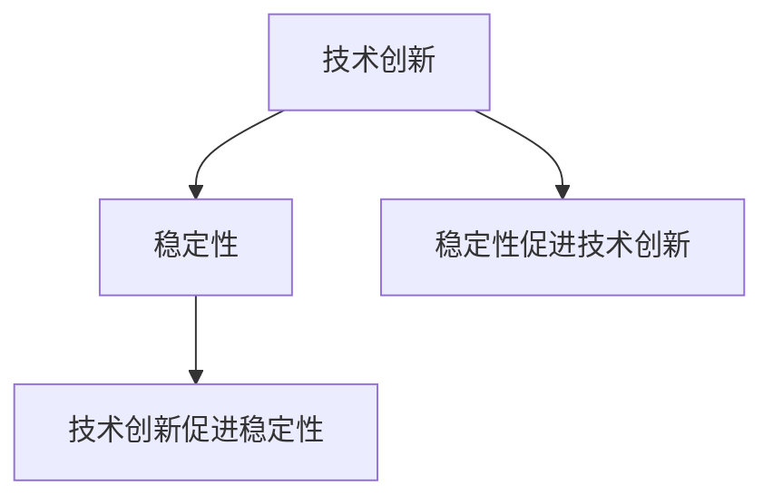

                 

### 文章标题

### 如何平衡技术创新与稳定性

> 关键词：技术创新，稳定性，平衡，策略，实践，风险管理

> 摘要：本文探讨了如何在信息技术领域中平衡技术创新与稳定性的关系。通过分析技术创新与稳定性的定义和相互关系，提出了一系列有效的技术创新策略和实践方法，以及稳定性保障和风险管理的策略。通过行业案例分析，总结了平衡技术创新与稳定性的实践经验，并提出了一些建议和未来展望。文章旨在为技术团队和企业提供实用的指导，帮助他们在技术创新与稳定性之间找到最佳平衡点。

---

#### 第一部分：技术创新与稳定性概述

##### 第1章：技术创新与稳定性的概念理解

**1.1 技术创新与稳定性的定义**

**技术创新**：技术创新指的是在科技领域中引入新的思想、方法、技术、产品或流程，以实现更好的性能、效率或用户体验。它通常涉及科学研究和工程开发，旨在推动技术进步和产业升级。

**稳定性**：稳定性指的是系统或产品在长期运行过程中保持性能、功能和安全性的一致性。在信息技术领域，稳定性通常与系统的可靠性、可用性和安全性相关联，意味着在多变的环境下，系统能够持续、稳定地运行。

**1.2 技术创新与稳定性的关系**

**技术创新对稳定性的影响**：技术创新可以带来系统性能的提升、功能扩展和用户体验优化，但同时也可能引入新的风险和不确定性，影响系统的稳定性。例如，新技术的引入可能需要改变现有的架构和流程，这可能会带来兼容性问题和潜在的故障风险。

**稳定性对技术创新的制约**：稳定性是系统运行的基本保障，过度的技术创新可能会导致系统不稳定，影响用户体验和业务连续性。因此，稳定性是技术创新的基础，技术创新必须在确保系统稳定性的前提下进行。

**1.3 技术创新与稳定性的相互促进**

**技术创新促进稳定性**：通过技术创新，可以提高系统的可靠性和安全性，减少故障率，从而增强稳定性。例如，自动化测试工具的引入可以提升软件测试的效率和质量，降低人为错误的可能性。

**稳定性促进技术创新**：稳定的系统为技术创新提供了可靠的环境和基础。当系统运行稳定时，技术团队能够更专注于创新工作，而不是不断地解决稳定性问题。

##### Mermaid 流程图

**核心概念与联系**：技术创新与稳定性是相互关联的，技术创新可以在一定程度上促进稳定性，而稳定性又为技术创新提供了支持。通过图示可以看出，技术创新和稳定性之间形成了一个良性的互动关系。

---

##### 第2章：技术创新策略与实践

**2.1 创新驱动战略**

**创新驱动战略**：创新驱动战略是指将创新作为企业发展的核心驱动力，通过不断的技术创新来提升企业的竞争力。它包括以下几个方面：

**意义**：创新驱动战略能够帮助企业把握行业趋势，开拓新的市场和业务领域，提升产品和服务的竞争力。

**实施步骤**：
1. **明确创新目标**：根据企业的战略目标和市场需求，设定清晰的创新目标。
2. **建立创新机制**：建立创新的激励机制和流程，鼓励员工提出创新想法，并给予相应的支持。
3. **资源投入**：确保有足够的资源投入到创新项目中，包括人力、资金和技术支持。
4. **风险管理**：对创新项目进行风险评估和管理，确保技术创新在可承受的风险范围内进行。

**创新型企业文化**

**创新型企业文化**：创新型企业文化是指一种鼓励创新、容忍失败、尊重创造的企业文化。它对于技术创新具有重要意义。

**企业文化的构建**：
1. **鼓励开放沟通**：建立开放、透明、畅所欲言的沟通机制，鼓励员工表达自己的想法和建议。
2. **尊重创造**：对员工的创新成果给予认可和奖励，激发员工的创造潜能。
3. **容忍失败**：建立一种容错机制，鼓励员工在创新过程中勇于尝试，不怕失败。

**企业文化的变革**：企业文化的变革需要从领导层的认同和推动开始，通过培训和文化活动来逐步转变员工的心态和行为。

**创新人才管理**

**创新人才管理**：创新人才管理是指通过有效的招聘、培养、激励和留任策略，吸引、培养和留住具有创新能力和潜力的员工。

**创新型人才的识别**：
1. **能力识别**：通过技能测试、项目评估等方式，识别具有创新能力和技术潜力的人才。
2. **性格识别**：寻找那些具有冒险精神、好奇心强、善于思考的人才。

**创新型人才的培养**：
1. **技能培训**：提供各种技能培训，包括新技术、新方法的学习，提升员工的专业能力。
2. **项目实践**：通过实际项目锻炼，让员工在实战中积累经验，提升创新能力。
3. **导师指导**：为新人配备经验丰富的导师，提供指导和支持，帮助他们快速成长。

**创新型人才的激励与留任**：
1. **绩效激励**：通过绩效评估和奖励制度，激励员工在工作中表现出色。
2. **职业发展**：为员工提供职业发展路径和机会，让他们看到成长和晋升的空间。
3. **工作环境**：创造一个积极、开放、包容的工作环境，让员工感到舒适和满意。

---

**核心概念与联系**：技术创新战略、创新型企业文化和创新人才管理是推动技术创新的重要要素。它们相互关联，共同构成了一个有效的技术创新体系。通过合理的策略和实践，企业可以在技术创新与稳定性之间找到平衡点。

---

#### 第二部分：稳定性保障与风险管理

##### 第3章：稳定性保障的关键要素

**3.1 产品质量保障**

**产品质量保障**：产品质量保障是指通过一系列的质量管理措施，确保产品在开发、测试和发布过程中符合预期的质量和性能要求。

**质量管理体系的建立**：
1. **明确质量目标**：根据业务需求和用户反馈，设定清晰的质量目标。
2. **流程规范化**：建立规范的开发流程和测试流程，确保每个环节都有明确的标准和要求。
3. **工具支持**：引入各种质量管理工具，如自动化测试工具、持续集成系统等，提高测试效率和覆盖范围。

**质量监控与改进**：
1. **持续监控**：通过实时监控系统，监控产品的性能和稳定性，及时发现并解决问题。
2. **反馈机制**：建立有效的反馈机制，收集用户反馈和内部测试结果，用于持续改进。
3. **改进措施**：根据监控和反馈结果，制定相应的改进措施，不断提升产品质量。

**系统安全与稳定性**

**系统安全与稳定性**：系统安全与稳定性是保证系统长期稳定运行的重要方面。它包括以下几个方面：

**安全防护策略**：
1. **网络安全**：通过防火墙、入侵检测系统等网络安全措施，保护系统免受外部攻击。
2. **数据安全**：通过数据加密、备份和恢复策略，保护数据的安全性和完整性。
3. **系统安全**：通过权限管理、审计日志等措施，确保系统的安全性和可控性。

**系统容错与恢复**：
1. **容错设计**：通过冗余设计、故障转移等措施，提高系统的容错能力。
2. **故障恢复**：建立故障恢复机制，如备份恢复、系统重启等，确保系统在故障发生后能够快速恢复。

**风险管理策略**

**风险管理策略**：风险管理策略是指通过识别、评估、应对和监控风险，确保技术创新和稳定性过程中风险的可控性。

**风险识别与评估**：
1. **风险识别**：通过问卷调查、访谈、文献调研等方式，识别可能存在的风险。
2. **风险评估**：对识别出的风险进行评估，确定风险的可能性和影响程度。

**风险应对与缓解**：
1. **风险应对**：根据风险评估结果，制定相应的应对措施，降低风险的影响。
2. **风险缓解**：通过改进措施和技术手段，缓解已识别的风险，确保系统的稳定性和可靠性。

---

**核心概念与联系**：产品质量保障、系统安全与稳定性和风险管理策略是确保系统稳定性的关键要素。它们共同构成了一个完整的稳定性保障体系，通过科学的管理和策略，确保系统在长期运行过程中保持稳定性和安全性。

---

#### 第三部分：平衡技术创新与稳定性的案例分析

##### 第4章：行业案例分析

**4.1 软件行业**

**创新与稳定的平衡实践**：软件行业是技术创新最为活跃的领域之一，同时稳定性也是其成功的关键因素。以下是一些软件行业的创新与稳定的平衡实践：

**成功案例分享**：
1. **敏捷开发与持续集成**：许多软件公司采用了敏捷开发模式和持续集成系统，提高了开发效率和质量，同时保持了系统的稳定性。
2. **云计算与容器化**：通过云计算和容器化技术，软件公司能够快速部署和扩展系统，提高了系统的灵活性和可靠性。
3. **人工智能与机器学习**：人工智能和机器学习的引入，不仅提升了软件的功能和性能，还通过自动化测试和优化，提高了系统的稳定性。

**4.2 制造业**

**创新与稳定的协调**：制造业是另一个技术创新与稳定性需要平衡的领域。以下是一些制造业的创新与稳定协调的实践：

**挑战与解决方案**：
1. **智能制造与设备稳定性**：智能制造带来了许多新技术，如传感器、物联网等，但同时也增加了设备稳定性的挑战。通过设备监控和预测维护，制造商能够提前识别和解决设备故障，确保生产线的稳定性。
2. **工业互联网与数据安全**：工业互联网的引入带来了大量的数据，但同时也带来了数据安全的问题。通过数据加密、访问控制和防火墙等措施，制造商能够确保数据的安全性和系统的稳定性。
3. **数字化与业务连续性**：通过数字化手段，制造商能够实时监控生产过程，但同时也需要确保系统的连续性和稳定性，以防止生产中断。

---

**核心概念与联系**：软件行业和制造业在平衡技术创新与稳定性方面面临着不同的挑战，但都需要通过科学的管理和策略来实现平衡。通过具体的案例和实践，我们可以看到，在技术创新与稳定性之间找到平衡点，是这些行业成功的关键。

---

#### 第四部分：平衡技术创新与稳定性的实践指南

##### 第5章：平衡技术创新与稳定性的实践路径

**5.1 建立平衡机制**

**平衡机制的设计原则**：
1. **明确目标**：明确技术创新和稳定性的目标，确保两者之间的目标一致性。
2. **动态调整**：根据业务需求和外部环境的变化，动态调整技术创新和稳定性的策略和资源配置。
3. **协同合作**：鼓励不同部门之间的协同合作，实现技术创新与稳定性之间的良性互动。

**平衡机制的实施步骤**：
1. **制定战略规划**：根据企业的战略目标，制定技术创新和稳定性的长期规划。
2. **资源分配**：合理分配资源，确保技术创新和稳定性都能得到足够的支持。
3. **过程监控**：建立监控和评估机制，实时监控技术创新和稳定性的执行情况，及时发现和解决问题。

**绩效评估与反馈**

**绩效评估指标的设计**：
1. **技术创新指标**：如创新项目数量、创新成果转化率、创新专利数量等。
2. **稳定性指标**：如系统故障率、用户满意度、业务连续性等。

**反馈机制的建立与完善**：
1. **内部反馈**：建立内部反馈机制，收集员工对技术创新和稳定性管理的意见和建议。
2. **外部反馈**：通过用户反馈和市场反馈，了解外部对技术创新和稳定性的评价。
3. **持续改进**：根据反馈结果，不断优化技术创新和稳定性管理策略，提升整体绩效。

---

**核心概念与联系**：建立平衡机制和绩效评估与反馈机制是平衡技术创新与稳定性的关键步骤。通过科学的设计和实施，企业可以在技术创新和稳定性之间实现动态平衡，确保持续的技术进步和系统稳定性。

---

#### 第五部分：技术创新与稳定性平衡的未来展望

##### 第6章：未来技术创新与稳定性的趋势

**6.1 技术创新的未来方向**

**新技术展望**：未来技术创新将受到人工智能、物联网、区块链、5G通信等新技术的推动。这些技术将带来前所未有的变革，不仅改变了传统的产业模式，也为技术创新提供了新的方向。

**技术创新的影响**：新技术将推动信息技术领域的不断创新，提高系统的性能、效率和用户体验。同时，新技术的引入也将带来新的挑战，如数据安全、隐私保护等，需要技术创新来应对。

**6.2 稳定性发展的新挑战**

**挑战与应对策略**：随着技术的不断进步，稳定性面临的挑战也在增加。例如，分布式系统、云计算、物联网等技术的广泛应用，使得系统的复杂性和依赖性增加，稳定性管理变得更加困难。

**未来稳定性的趋势**：
1. **自动化与智能化**：通过引入自动化和智能化技术，提高系统的自我修复能力和故障检测能力，增强系统的稳定性。
2. **标准化与规范化**：通过制定和推广行业标准和规范，提高系统的可靠性和兼容性，降低风险。
3. **持续集成与持续交付**：通过持续集成和持续交付，实现快速迭代和高效部署，提高系统的稳定性和可靠性。

---

**核心概念与联系**：未来技术创新与稳定性的发展趋势表明，技术创新和稳定性将相互促进，共同推动信息技术领域的进步。通过应对新挑战和把握未来趋势，企业和技术团队能够在技术创新与稳定性之间找到新的平衡点。

---

#### 附录

##### 附录 A：技术创新与稳定性平衡工具与资源

**A.1 创新技术工具与资源**

**开发工具推荐**：
- **集成开发环境（IDE）**：如Visual Studio、Eclipse等，提供代码编写、调试和自动化构建功能。
- **版本控制系统**：如Git、SVN等，确保代码的版本管理和协作开发。
- **持续集成工具**：如Jenkins、GitLab CI等，实现自动化测试和部署。

**资源获取渠道**：
- **在线课程和教程**：如Coursera、Udemy等平台，提供丰富的技术课程和教程。
- **开源社区**：如GitHub、Stack Overflow等，提供丰富的开源项目和问题解答。

**A.2 稳定性保障工具与资源**

**安全防护工具**：
- **防火墙**：如NGINX、iptables等，用于网络安全防护。
- **入侵检测系统**：如Snort、Suricata等，实时监控网络流量，检测潜在攻击。

**稳定性优化资源**：
- **性能分析工具**：如Profile Guru、Xprofiler等，用于性能分析和优化。
- **监控工具**：如Prometheus、Grafana等，实时监控系统的性能和稳定性。

---

**最佳实践 tips、小结、注意事项、拓展阅读等内容**

**最佳实践 tips**：
- **定期评估和优化**：定期对技术创新和稳定性策略进行评估和优化，确保其与业务需求和外部环境保持一致。
- **团队合作**：鼓励团队合作，促进知识共享和协同创新，提高整体效率和稳定性。

**小结**：
本文通过分析技术创新与稳定性的关系，提出了一系列有效的策略和实践方法，帮助企业在技术创新与稳定性之间找到平衡点。通过建立平衡机制和绩效评估与反馈机制，企业能够实现持续的技术进步和系统稳定性。

**注意事项**：
- 技术创新和稳定性不是静态的，需要根据业务需求和外部环境不断调整。
- 技术创新必须在确保系统稳定性的前提下进行，避免过度创新导致系统崩溃。

**拓展阅读**：
- **《敏捷软件开发：实践指南》**：详细介绍了敏捷开发方法，有助于实现技术创新与稳定性的平衡。
- **《软件工程：实践者的研究方法》**：提供了软件工程领域的实践方法和案例分析，有助于理解和应用技术创新与稳定性管理策略。

---

**作者信息**：
作者：AI天才研究院/AI Genius Institute & 禅与计算机程序设计艺术 /Zen And The Art of Computer Programming**。**### 文章标题

### 如何平衡技术创新与稳定性

#### 第一部分：技术创新与稳定性概述

**第1章：技术创新与稳定性的概念理解**

**1.1 技术创新与稳定性的定义**

在信息技术领域，技术创新与稳定性是两个核心概念。技术创新指的是在科技领域中引入新的思想、方法、技术、产品或流程，以实现更好的性能、效率或用户体验。技术创新是推动技术进步和产业升级的重要动力。稳定性，则指的是系统或产品在长期运行过程中保持性能、功能和安全性的一致性。稳定性是系统运行的基本保障，确保系统在多变的环境下，能够持续、稳定地运行。

**1.2 技术创新与稳定性的关系**

技术创新与稳定性之间存在密切的关系。一方面，技术创新可以提升系统的性能、功能和用户体验，从而增强系统的稳定性。例如，新技术的引入可以提高系统的可靠性，减少故障率。另一方面，稳定性是技术创新的基础。如果系统的稳定性无法保证，那么技术创新可能会带来不稳定的风险，甚至导致系统崩溃。因此，技术创新和稳定性是相互依存的，技术创新必须在确保系统稳定性的前提下进行。

**1.3 技术创新与稳定性的相互促进**

技术创新与稳定性之间也存在相互促进的关系。通过技术创新，可以提高系统的可靠性和安全性，从而增强系统的稳定性。例如，自动化测试工具的引入可以提升软件测试的效率和质量，降低人为错误的可能性。另一方面，稳定的系统为技术创新提供了可靠的环境和基础。当系统运行稳定时，技术团队能够更专注于创新工作，而不是不断地解决稳定性问题。

**核心概念与联系**

技术创新与稳定性是相互关联的，技术创新可以在一定程度上促进稳定性，而稳定性又为技术创新提供了支持。通过图示可以看出，技术创新和稳定性之间形成了一个良性的互动关系。

**第2章：技术创新策略与实践**

**2.1 创新驱动战略**

**创新驱动战略**是指将创新作为企业发展的核心驱动力，通过不断的技术创新来提升企业的竞争力。这种战略强调创新在企业发展中的重要性，认为只有通过持续的创新，企业才能在激烈的市场竞争中立于不败之地。

**意义**

创新驱动战略的意义主要体现在以下几个方面：

1. **提升竞争力**：通过技术创新，企业可以提供更优质的产品和服务，满足客户的需求，从而提升市场竞争力。
2. **开拓新市场**：技术创新可以开拓新的市场和业务领域，为企业带来更多的增长机会。
3. **推动产业升级**：技术创新可以推动整个产业链的升级，促进产业结构的优化。

**实施步骤**

实施创新驱动战略需要采取一系列具体的措施，以下是其中的几个关键步骤：

1. **明确创新目标**：根据企业的战略目标和市场需求，设定清晰的创新目标。创新目标应具体、可衡量，并与企业的整体战略相一致。

2. **建立创新机制**：建立创新激励机制和流程，鼓励员工提出创新想法，并给予相应的支持。创新机制应包括创新的评估、选择、实施和监控等方面。

3. **资源投入**：确保有足够的资源投入到创新项目中，包括人力、资金和技术支持。资源的投入是创新驱动战略成功的关键。

4. **风险管理**：对创新项目进行风险评估和管理，确保技术创新在可承受的风险范围内进行。创新过程中不可避免地会遇到各种风险，因此需要建立有效的风险管理机制。

**创新驱动战略的案例**

- **苹果公司**：苹果公司是创新驱动战略的典范。通过不断推出创新的产品和服务，如iPhone、iPad和Apple Watch等，苹果公司在全球市场上取得了巨大的成功。

- **谷歌公司**：谷歌公司也是创新驱动战略的成功案例。谷歌通过技术创新，不断推出新的产品和功能，如Google Search、Google Maps和Google Drive等，成为全球最大的科技公司之一。

**创新型企业文化**

**创新型企业文化**是指一种鼓励创新、容忍失败、尊重创造的企业文化。在这种文化下，员工敢于提出新的想法，勇于尝试，即使失败也受到尊重和支持。

**企业文化的构建**

1. **鼓励开放沟通**：建立开放、透明、畅所欲言的沟通机制，鼓励员工表达自己的想法和建议。这可以通过定期的团队会议、讨论组和在线论坛等方式实现。

2. **尊重创造**：对员工的创新成果给予认可和奖励，激发员工的创造潜能。奖励可以包括奖金、晋升机会和荣誉表彰等。

3. **容忍失败**：建立一种容错机制，鼓励员工在创新过程中勇于尝试，不怕失败。这可以通过设立“失败基金”、提供心理辅导等方式实现。

**企业文化的变革**

企业文化的变革需要从领导层的认同和推动开始。领导层应带头倡导创新，树立榜样，并通过培训和宣传活动，逐步转变员工的心态和行为。

**创新人才管理**

**创新人才管理**是指通过有效的招聘、培养、激励和留任策略，吸引、培养和留住具有创新能力和潜力的员工。

**创新型人才的识别**

1. **能力识别**：通过技能测试、项目评估等方式，识别具有创新能力和技术潜力的人才。这可以通过定期的技能评估和项目评审来实现。

2. **性格识别**：寻找那些具有冒险精神、好奇心强、善于思考的人才。可以通过面试、心理测试等方式来评估。

**创新型人才的培养**

1. **技能培训**：提供各种技能培训，包括新技术、新方法的学习，提升员工的专业能力。这可以通过内部培训、外部培训和在线学习等方式实现。

2. **项目实践**：通过实际项目锻炼，让员工在实战中积累经验，提升创新能力。这可以通过内部项目、合作项目和竞标项目等方式实现。

3. **导师指导**：为新人配备经验丰富的导师，提供指导和支持，帮助他们快速成长。导师可以提供专业知识、工作经验和职业发展建议。

**创新型人才的激励与留任**

1. **绩效激励**：通过绩效评估和奖励制度，激励员工在工作中表现出色。奖励可以包括奖金、晋升机会和荣誉表彰等。

2. **职业发展**：为员工提供职业发展路径和机会，让他们看到成长和晋升的空间。这可以通过职业规划、晋升机制和培训计划等方式实现。

3. **工作环境**：创造一个积极、开放、包容的工作环境，让员工感到舒适和满意。这可以通过提供良好的工作条件、福利待遇和文化活动等方式实现。

**核心概念与联系**

创新驱动战略、创新型企业文化和创新人才管理是推动技术创新的重要要素。它们相互关联，共同构成了一个有效的技术创新体系。通过合理的策略和实践，企业可以在技术创新与稳定性之间找到平衡点。

**第3章：稳定性保障与风险管理**

**3.1 产品质量保障**

**产品质量保障**是指通过一系列的质量管理措施，确保产品在开发、测试和发布过程中符合预期的质量和性能要求。在信息技术领域，产品质量直接影响系统的稳定性和用户体验。因此，产品质量保障是确保系统稳定性的关键环节。

**质量管理体系的建立**

建立有效的质量管理体系是产品质量保障的基础。以下是几个关键步骤：

1. **明确质量目标**：根据业务需求和用户反馈，设定清晰的质量目标。这些目标应具体、可衡量，并与企业的整体战略相一致。

2. **流程规范化**：建立规范的开发流程和测试流程，确保每个环节都有明确的标准和要求。这可以通过制定详细的流程文档、标准和操作手册来实现。

3. **工具支持**：引入各种质量管理工具，如自动化测试工具、持续集成系统等，提高测试效率和覆盖范围。这些工具可以帮助自动化执行测试任务，减少人为错误。

**质量监控与改进**

在建立质量管理体系后，持续的质量监控和改进是确保产品质量的关键。以下是几个关键步骤：

1. **持续监控**：通过实时监控系统，监控产品的性能和稳定性，及时发现并解决问题。这可以通过使用性能监控工具、日志分析工具等方式实现。

2. **反馈机制**：建立有效的反馈机制，收集用户反馈和内部测试结果，用于持续改进。这可以通过定期召开质量评审会议、用户调研等方式实现。

3. **改进措施**：根据监控和反馈结果，制定相应的改进措施，不断提升产品质量。这可以包括代码优化、流程改进、工具升级等。

**核心概念与联系**

质量管理体系的建立和质量监控与改进是确保产品质量的两个关键环节。通过规范的开发流程和测试流程，以及持续的质量监控和反馈机制，企业可以确保产品在开发、测试和发布过程中符合预期的质量和性能要求。

**3.2 系统安全与稳定性**

**系统安全与稳定性**是确保系统长期稳定运行的两个重要方面。系统安全指的是防止未经授权的访问、数据泄露和系统故障等威胁，确保系统的安全性。系统稳定性则指的是系统在长期运行过程中保持性能、功能和安全性的一致性，确保系统的可靠性和可用性。

**安全防护策略**

为了确保系统的安全性，企业需要采取一系列的安全防护策略。以下是几个关键策略：

1. **网络安全**：通过防火墙、入侵检测系统（IDS）和入侵防御系统（IPS）等网络安全措施，保护系统免受外部攻击。这些工具可以帮助检测和阻止恶意攻击，确保系统的安全性。

2. **数据安全**：通过数据加密、备份和恢复策略，保护数据的安全性和完整性。数据加密可以防止数据在传输和存储过程中被窃取或篡改。备份和恢复策略可以在数据丢失或损坏时快速恢复数据，确保业务的连续性。

3. **系统安全**：通过权限管理、访问控制和审计日志等措施，确保系统的安全性和可控性。权限管理可以确保只有授权用户才能访问系统和数据。访问控制可以限制用户对系统和数据的访问权限。审计日志可以记录系统的操作记录，帮助追踪和调查安全事件。

**系统容错与恢复**

为了确保系统的稳定性，企业需要采取一系列的容错与恢复策略。以下是几个关键策略：

1. **容错设计**：通过冗余设计、故障转移等措施，提高系统的容错能力。冗余设计可以在关键组件或系统出现故障时，自动切换到备用组件或系统，确保系统的持续运行。故障转移可以将故障组件或系统切换到备用组件或系统，确保服务的连续性。

2. **故障检测**：通过故障检测工具，实时监控系统的运行状态，及时发现和诊断故障。故障检测可以帮助识别系统的异常情况，并触发相应的恢复措施。

3. **故障恢复**：建立故障恢复机制，如备份恢复、系统重启等，确保系统在故障发生后能够快速恢复。备份恢复可以在系统出现故障时，从备份中恢复系统状态。系统重启可以重新启动系统，清除故障。

**核心概念与联系**

系统安全与稳定性是确保系统长期稳定运行的两个重要方面。通过采取安全防护策略和系统容错与恢复策略，企业可以确保系统的安全性和稳定性，从而保障业务的连续性和可靠性。

**3.3 风险管理策略**

**风险管理策略**是指通过识别、评估、应对和监控风险，确保技术创新和稳定性过程中风险的可控性。在信息技术领域，风险管理至关重要，因为技术创新和稳定性管理过程中不可避免地会遇到各种风险。以下是一些建议：

**风险识别与评估**

1. **风险识别**：通过问卷调查、访谈、文献调研等方式，识别可能存在的风险。这包括技术风险、市场风险、运营风险等。

2. **风险评估**：对识别出的风险进行评估，确定风险的可能性和影响程度。这可以通过定性分析和定量分析相结合的方式实现。

**风险应对与缓解**

1. **风险应对**：根据风险评估结果，制定相应的应对措施，降低风险的影响。这可以包括风险规避、风险转移、风险缓解等策略。

2. **风险缓解**：通过改进措施和技术手段，缓解已识别的风险，确保系统的稳定性和可靠性。例如，通过冗余设计和故障转移来缓解技术风险，通过数据加密和备份来缓解数据安全风险。

**核心概念与联系**

风险管理策略包括风险识别与评估、风险应对与缓解等环节。通过科学的风险管理策略，企业可以确保技术创新和稳定性过程中的风险在可控范围内，从而保障业务的连续性和可靠性。

#### 第四部分：平衡技术创新与稳定性的案例分析

**第4章：行业案例分析**

**4.1 软件行业**

**创新与稳定的平衡实践**

软件行业是技术创新最为活跃的领域之一，同时也是稳定性要求最高的行业之一。在这个行业中，创新和稳定性的平衡至关重要。以下是一些软件行业在创新与稳定性方面取得成功的实践：

**成功案例分享**

1. **敏捷开发与持续集成**：许多软件公司采用了敏捷开发方法和持续集成系统，以提高开发效率和质量。敏捷开发强调快速迭代和频繁交付，持续集成系统则确保每次代码提交后都能自动进行测试和部署。这种实践不仅提高了开发效率，还保证了系统的稳定性。

2. **云计算与容器化**：云计算和容器化技术的引入，使得软件公司能够更灵活地部署和管理系统。通过云计算，公司可以根据需求动态调整资源分配，通过容器化，可以简化部署流程，提高系统的可移植性和稳定性。

3. **人工智能与机器学习**：人工智能和机器学习的应用，使得软件公司能够提供更智能的产品和服务。例如，自动化测试工具使用机器学习算法来优化测试流程，提高测试效率和质量，从而增强系统的稳定性。

**4.2 制造业**

**创新与稳定的协调**

制造业是另一个技术创新与稳定性需要平衡的领域。在这个行业中，创新和稳定性之间的平衡尤为重要，因为任何系统的故障都可能直接影响生产线的正常运行。以下是一些制造业在创新与稳定性方面取得成功的实践：

**挑战与解决方案**

1. **智能制造与设备稳定性**：智能制造带来了许多新技术，如传感器、物联网等，但同时也增加了设备稳定性的挑战。为了解决这个问题，制造商采用了设备监控和预测维护技术。通过实时监控设备状态和预测潜在故障，制造商能够在设备出现故障前进行预防性维护，从而保证生产线的稳定性。

2. **工业互联网与数据安全**：工业互联网的引入使得制造业能够实现设备互联和数据共享，但同时也带来了数据安全的挑战。制造商通过采用数据加密、访问控制和防火墙等措施，确保数据的安全性和系统的稳定性。

3. **数字化与业务连续性**：制造业的数字化转型带来了许多新的机遇，但也带来了业务连续性的挑战。制造商通过建立备份系统和灾难恢复计划，确保在系统故障或灾难发生时，业务能够快速恢复，从而保证生产的连续性。

**核心概念与联系**

软件行业和制造业在平衡技术创新与稳定性方面面临着不同的挑战，但都需要通过科学的管理和策略来实现平衡。通过具体的案例和实践，我们可以看到，在技术创新与稳定性之间找到平衡点，是这些行业成功的关键。

#### 第五部分：平衡技术创新与稳定性的实践指南

**第5章：平衡技术创新与稳定性的实践路径**

**5.1 建立平衡机制**

在信息技术领域，平衡技术创新与稳定性是确保系统持续发展的重要任务。建立平衡机制是实现这一目标的关键步骤。以下是一些关键要素和步骤：

**关键要素**

1. **明确目标**：首先，需要明确技术创新和稳定性的目标，确保两者在战略层面的一致性。技术创新的目标可能包括提高性能、优化用户体验、降低成本等，而稳定性的目标可能包括减少故障率、提高系统的可靠性等。

2. **资源配置**：根据创新和稳定性的目标，合理分配资源，包括人力、资金和技术支持。确保在技术创新和稳定性管理上都有足够的投入。

3. **风险管理**：建立有效的风险管理机制，对技术创新和稳定性过程中的潜在风险进行识别、评估和应对。

**步骤**

1. **制定战略规划**：根据企业的长远目标和市场需求，制定技术创新和稳定性管理的战略规划。这个规划应包括具体的实施步骤、时间表和责任分配。

2. **建立监控与反馈机制**：建立实时监控和反馈机制，用于跟踪技术创新和稳定性管理的实施情况。这可以包括定期召开评审会议、发布状态报告等。

3. **动态调整**：根据实际情况，动态调整技术创新和稳定性管理策略。例如，当新技术的应用遇到稳定性问题时，需要及时调整技术方案或资源分配。

**案例**

**阿里巴巴**：阿里巴巴在技术创新与稳定性管理方面取得了显著成效。他们建立了“双轮驱动”策略，一方面通过技术创新提高系统的性能和用户体验，另一方面通过稳定性管理确保系统的可靠运行。例如，在双11大促期间，阿里巴巴通过技术创新优化了订单处理流程，同时通过稳定性管理确保了系统的高可用性。

**5.2 绩效评估与反馈**

**绩效评估与反馈**是确保技术创新与稳定性管理持续改进的重要手段。以下是一些关键步骤：

**关键步骤**

1. **设定绩效指标**：根据创新和稳定性的目标，设定具体的绩效指标。这些指标可以包括技术创新项目的成功率、稳定性指标的改善程度等。

2. **定期评估**：定期对技术创新和稳定性管理进行评估，收集相关数据，分析绩效指标的表现。

3. **反馈与改进**：根据评估结果，提供反馈，识别存在的问题和改进点。制定改进计划，并跟踪改进措施的执行情况。

**案例**

**微软**：微软通过其“技术能力评估模型”（Technology Competency Assessment Model）对技术创新和稳定性管理进行评估。这个模型包括多个维度，如技术创新的适应性、稳定性管理的有效性等。通过定期评估和反馈，微软能够持续改进其技术创新和稳定性管理，确保其在全球市场上的竞争力。

**5.3 风险管理**

**风险管理**是确保技术创新和稳定性过程中的风险在可控范围之内的重要手段。以下是一些关键步骤：

**关键步骤**

1. **风险识别**：通过问卷调查、访谈、文献调研等方式，识别技术创新和稳定性管理过程中的潜在风险。这些风险可以包括技术风险、市场风险、运营风险等。

2. **风险评估**：对识别出的风险进行评估，确定其可能性和影响程度。这可以通过定性分析和定量分析相结合的方式实现。

3. **风险应对**：根据风险评估结果，制定相应的应对措施。这些措施可以包括风险规避、风险转移、风险缓解等。

4. **风险监控**：建立风险监控机制，实时跟踪已识别的风险，确保风险应对措施的执行和效果。

**案例**

**亚马逊**：亚马逊在风险管理方面有着丰富的经验。他们在技术创新和稳定性管理过程中，建立了全面的风险管理框架。例如，在引入新的技术架构时，亚马逊会进行详细的风险评估，制定相应的应对措施，并建立监控机制，确保风险的及时识别和应对。

**核心概念与联系**

建立平衡机制、绩效评估与反馈机制和风险管理是平衡技术创新与稳定性的关键步骤。通过这些措施，企业可以确保技术创新与稳定性之间的动态平衡，实现持续的技术进步和系统稳定性。

#### 第六部分：技术创新与稳定性平衡的未来展望

**第6章：未来技术创新与稳定性的趋势**

随着科技的快速发展，未来技术创新与稳定性的平衡将面临新的挑战和机遇。以下是一些未来技术创新与稳定性的趋势：

**6.1 技术创新的未来方向**

**人工智能与自动化**：人工智能和自动化技术将继续推动技术创新，提高系统的性能和效率。未来，人工智能将更加深入地应用于各个领域，如自动驾驶、智能客服、智能医疗等。

**区块链与分布式账本**：区块链技术的应用将越来越广泛，分布式账本技术将为数据的透明性和安全性提供新的解决方案。未来，区块链技术可能在金融、供应链管理等领域发挥重要作用。

**5G与物联网**：5G技术的普及和物联网的发展将推动信息技术领域的新一轮变革。高速的通信网络和广泛的连接能力将为技术创新提供更广阔的空间。

**6.2 稳定性发展的新挑战**

**复杂系统与依赖性增加**：随着系统的复杂性和依赖性的增加，稳定性管理将面临更大的挑战。分布式系统、云计算和边缘计算等新技术的发展，将使系统更难以管理和维护。

**网络安全威胁**：随着网络攻击手段的不断升级，网络安全威胁将成为稳定性管理的一个重要挑战。企业需要不断更新安全策略和技术，以应对日益复杂的网络安全威胁。

**数据隐私与合规性**：数据隐私和保护将成为未来稳定性发展的一个重要方面。随着全球对数据隐私的重视，企业需要遵守更多的法律法规，确保数据的安全性和合规性。

**6.3 未来稳定性的趋势**

**智能化与自动化**：未来，智能化和自动化技术将更多地应用于稳定性管理，提高系统的自我修复能力和故障检测能力。

**标准化与规范化**：为了应对日益复杂的系统环境，标准化和规范化将成为未来稳定性管理的一个重要趋势。通过制定和推广行业标准，企业可以更好地管理和维护系统。

**持续集成与持续交付**：持续集成和持续交付（CI/CD）将成为未来稳定性管理的一个重要手段。通过自动化测试和快速部署，企业可以更快地响应市场需求，同时确保系统的稳定性。

**核心概念与联系**

未来技术创新与稳定性的趋势表明，技术创新和稳定性将继续相互促进。通过应对新挑战和把握未来趋势，企业和技术团队能够在技术创新与稳定性之间找到新的平衡点，推动信息技术领域的持续发展。

#### 附录

**附录 A：技术创新与稳定性平衡工具与资源**

**A.1 创新技术工具与资源**

**开发工具推荐**：

1. **集成开发环境（IDE）**：如Visual Studio、Eclipse、IntelliJ IDEA等，这些IDE提供了丰富的开发功能，包括代码编写、调试、版本控制和自动化构建等。

2. **版本控制系统**：如Git、SVN等，版本控制系统可以帮助团队协作开发，管理代码的版本和历史。

3. **持续集成工具**：如Jenkins、Travis CI、GitLab CI等，这些工具可以自动化构建、测试和部署代码，提高开发效率。

**资源获取渠道**：

1. **在线课程和教程**：如Coursera、Udemy、edX等，提供了大量的编程和信息技术课程，适合不同层次的学习者。

2. **开源社区**：如GitHub、GitLab、Stack Overflow等，是程序员获取代码、资源和交流的重要平台。

**A.2 稳定性保障工具与资源**

**安全防护工具**：

1. **防火墙**：如NGINX、iptables等，用于网络层的防护，防止未经授权的访问。

2. **入侵检测系统（IDS）**：如Snort、Suricata等，用于实时监控网络流量，检测和防止恶意攻击。

3. **入侵防御系统（IPS）**：如Sourcefire、Bro等，与IDS类似，但能够主动防御攻击。

**稳定性优化资源**：

1. **性能分析工具**：如Profile Guru、Xprofiler等，用于分析系统性能，发现瓶颈和优化点。

2. **监控工具**：如Prometheus、Grafana、Zabbix等，用于实时监控系统的运行状态，及时发现问题。

3. **日志分析工具**：如ELK（Elasticsearch、Logstash、Kibana）等，用于收集、存储和分析系统日志，帮助诊断问题。

**最佳实践 tips、小结、注意事项、拓展阅读等内容**

**最佳实践 tips**：

1. **定期回顾和调整**：定期回顾技术创新和稳定性管理的策略和实践，根据实际情况进行调整。

2. **跨部门协作**：鼓励不同部门之间的协作，共同解决技术创新和稳定性管理中的问题。

3. **持续学习和更新**：技术创新和稳定性管理是不断发展的领域，团队需要持续学习和更新知识。

**小结**：

本文探讨了如何平衡技术创新与稳定性，提出了创新驱动战略、稳定性保障和风险管理等策略。通过案例分析，总结了行业中的成功实践。未来，技术创新与稳定性将继续相互促进，企业需要持续适应新的技术和挑战。

**注意事项**：

1. **风险管理**：技术创新和稳定性管理中的风险需要持续监控和应对，不能忽视。

2. **用户体验**：技术创新应始终以用户体验为中心，确保系统的易用性和稳定性。

**拓展阅读**：

1. **《软件工程：实践者的研究方法》**：提供了软件工程领域的实践方法和案例分析，有助于理解和应用技术创新与稳定性管理策略。

2. **《敏捷软件开发：实践指南》**：详细介绍了敏捷开发方法，有助于实现技术创新与稳定性的平衡。

### 作者信息

**作者：AI天才研究院/AI Genius Institute & 禅与计算机程序设计艺术 /Zen And The Art of Computer Programming**。AI天才研究院致力于推动人工智能技术的发展，禅与计算机程序设计艺术则强调哲学思维在计算机编程中的应用。这两者的结合，使得本文在技术创新与稳定性平衡的探讨上具有独特的视角和深度。

