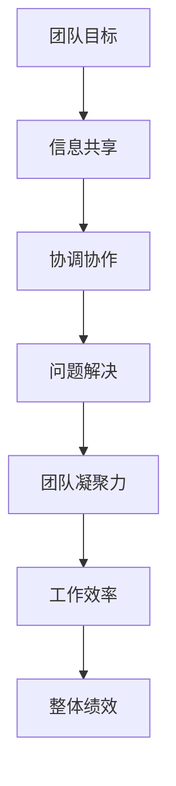
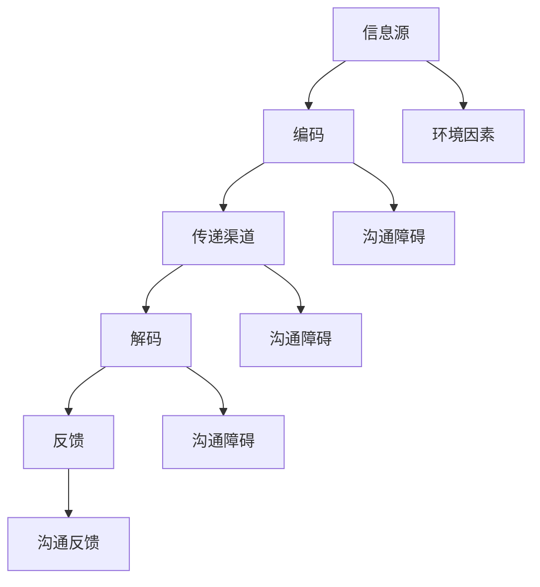
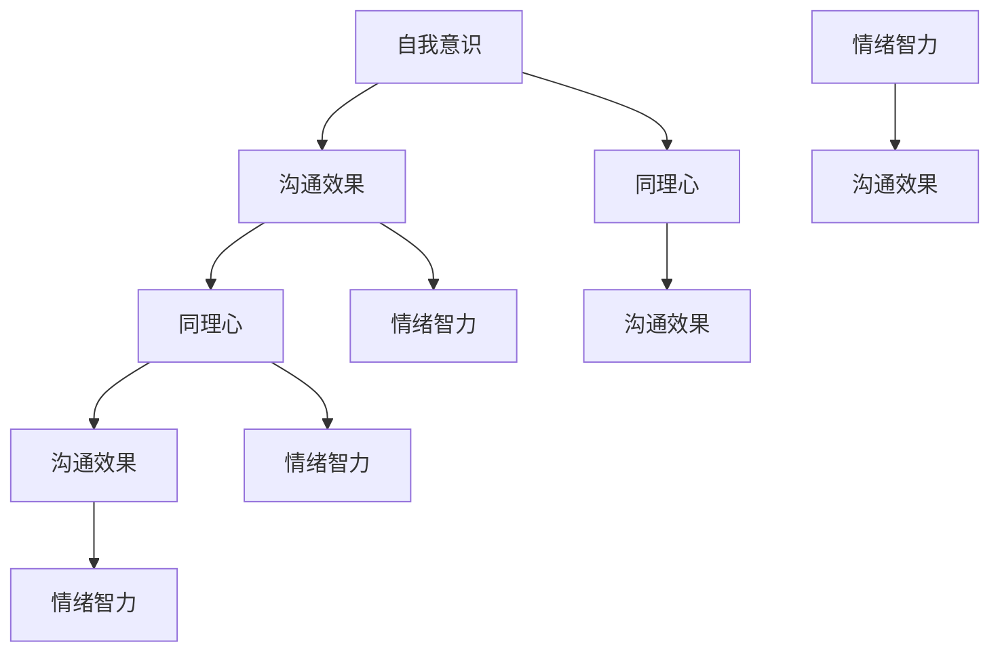
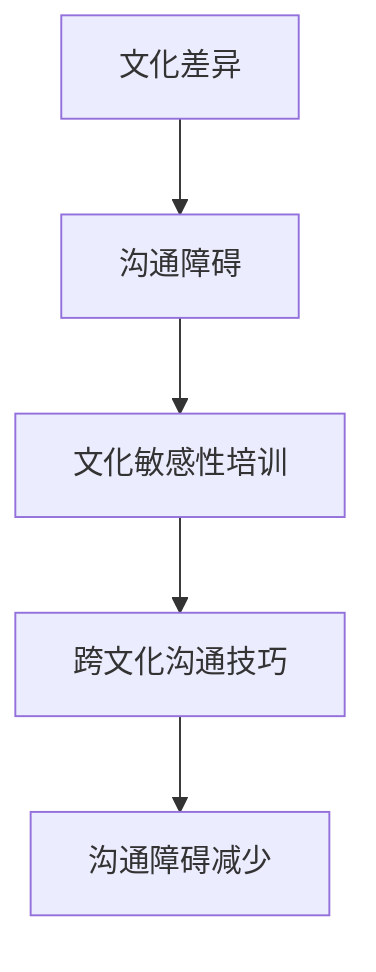
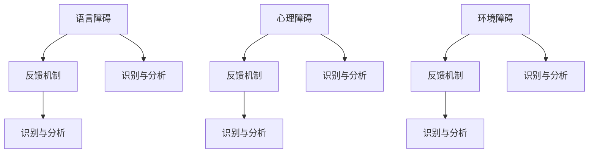
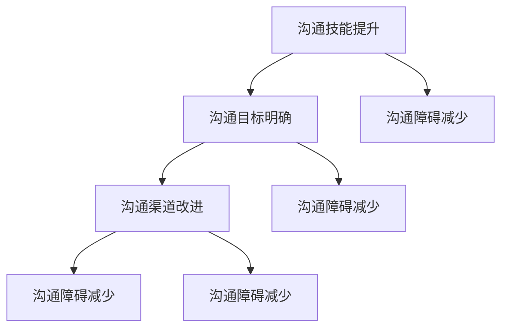
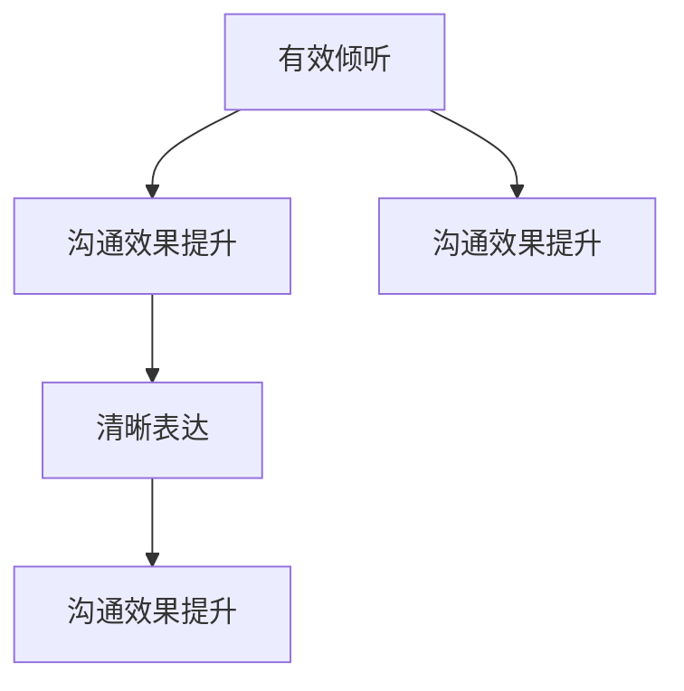
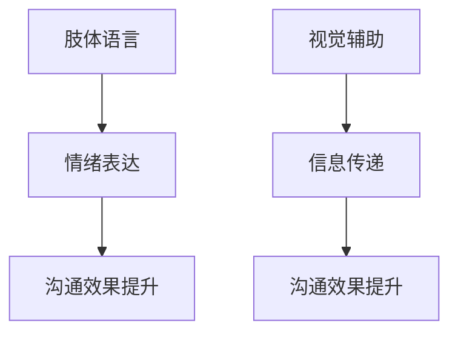
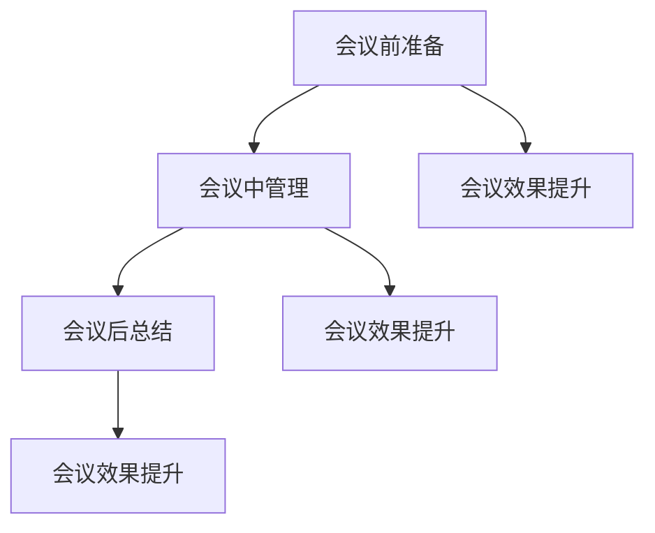

                 


# 如何建立有效的团队沟通渠道

## 引言与背景

团队沟通是现代组织中至关重要的一环。在复杂的项目和任务中，团队成员之间的有效沟通能够显著提高工作效率、减少误解、促进合作和共同目标的实现。然而，现实中团队沟通往往面临诸多挑战，如信息传递的滞后、沟通渠道的不畅通、文化差异等。

### 1.1 沟通的重要性

沟通是团队协作的基石。它不仅能够传递信息，还能建立信任和共识。以下是沟通在团队中几个关键方面的重要性：

1. **协调与协作**：通过有效的沟通，团队成员可以更好地协调各自的任务和活动，避免重复工作，提高整体效率。
2. **问题解决**：沟通有助于及时识别和解决问题，防止小问题演变成大障碍。
3. **冲突管理**：良好的沟通能够减少误解和冲突，促进团队和谐。
4. **知识共享**：沟通有助于知识的传递和共享，使得团队中的智慧得以充分利用。

### 1.2 团队沟通的现状与挑战

当前，团队沟通面临以下几个主要挑战：

1. **信息过载**：团队成员常常收到大量无关或冗余的信息，导致沟通效率低下。
2. **沟通渠道不统一**：团队内部和外部的沟通渠道多样化，缺乏统一的管理，使得信息传递变得复杂。
3. **文化差异**：全球化背景下的团队往往具有不同的文化背景，文化差异可能导致沟通障碍。
4. **技术依赖**：过度依赖技术工具可能导致人际沟通的减少，影响团队的凝聚力。

## 团队沟通的基本理论

### 2.1 团队沟通的概念与模型

团队沟通是指团队成员之间交换信息、观点和感受的过程。以下是一些核心概念和沟通模型：

1. **沟通过程**：沟通包括信息源、编码、传递渠道、解码和反馈等环节。
2. **沟通障碍**：沟通障碍可能来自信息源、传递渠道、接收者或环境因素。
3. **沟通模型**：包括循环模型、信息模型、交互模型等，不同的模型有助于我们理解和优化沟通过程。

### 2.2 团队沟通的心理学原理

团队沟通不仅涉及技术层面，还涉及心理学原理。以下是一些重要的心理学概念：

1. **自我意识**：团队成员需要意识到自己的沟通风格和偏好，以便更好地适应团队环境。
2. **同理心**：同理心是理解他人感受的能力，有助于建立信任和有效的沟通。
3. **情绪智力**：情绪智力包括自我情绪管理、社交意识和关系管理能力，对团队沟通有重要影响。

## 建立有效的沟通渠道

### 3.1 内部沟通机制

内部沟通机制是指团队内部用于信息传递和交流的体系。以下是一些关键步骤：

1. **确定沟通目标**：明确沟通的具体目标和目的，有助于提高沟通的针对性和有效性。
2. **建立沟通平台**：选择合适的沟通工具和平台，如邮件、即时通讯软件、项目管理工具等。
3. **制定沟通计划**：制定沟通计划和流程，确保信息传递的及时性和准确性。

### 3.2 外部沟通渠道

外部沟通渠道涉及团队与外部合作伙伴、客户、供应商等的交流。以下是一些要点：

1. **识别外部沟通需求**：明确外部沟通的重点和需求，如产品需求、市场反馈等。
2. **建立外部沟通渠道**：包括电话、邮件、线上会议、线下会议等多种方式。
3. **保持沟通透明度**：确保外部沟通的信息透明，避免误解和偏见。

### 3.3 数字化沟通工具

数字化沟通工具为团队沟通提供了高效和便捷的解决方案。以下是一些常见工具：

1. **即时通讯软件**：如Slack、Telegram等，支持实时沟通和协作。
2. **项目管理工具**：如Jira、Trello等，帮助团队跟踪项目进展和任务分配。
3. **视频会议工具**：如Zoom、Microsoft Teams等，支持远程会议和在线协作。

## 沟通障碍与解决策略

### 4.1 文化差异与沟通

文化差异是团队沟通中常见的问题。以下是一些解决策略：

1. **文化敏感性培训**：提高团队成员对文化差异的敏感性，避免文化冲突。
2. **跨文化沟通技巧**：学习并实践跨文化沟通技巧，如倾听、尊重和适应。
3. **文化融合活动**：通过团队建设活动，促进文化融合和团队凝聚力。

### 4.2 沟通障碍的类型与识别

沟通障碍可以分为以下几类：

1. **语言障碍**：由于语言表达不清或理解错误导致的沟通问题。
2. **心理障碍**：如自我意识、压力、恐惧等心理因素对沟通的干扰。
3. **环境障碍**：如噪音、技术故障等环境因素对沟通的影响。

识别沟通障碍的方法包括：

1. **反馈机制**：通过团队反馈会议，识别和讨论沟通中的问题。
2. **观察与分析**：观察团队沟通的行为和结果，分析潜在的问题和障碍。

### 4.3 解决沟通障碍的策略

解决沟通障碍的策略包括：

1. **提高沟通技能**：通过培训和练习，提高团队成员的沟通技能。
2. **明确沟通目标**：确保沟通的目标明确，避免模糊不清的指令。
3. **改进沟通渠道**：优化沟通渠道，确保信息传递的及时性和准确性。

## 沟通技巧与提升

### 5.1 有效倾听与表达

有效倾听和表达是沟通的核心技巧。以下是一些建议：

1. **倾听技巧**：包括全神贯注、避免打断、提问和反馈等。
2. **表达技巧**：包括清晰、简洁、有逻辑的表达，以及适当的非语言沟通。

### 5.2 非言语沟通

非言语沟通在团队沟通中同样重要。以下是一些关键点：

1. **肢体语言**：如面部表情、姿势和手势等，能够传递情绪和态度。
2. **视觉辅助**：如图表、幻灯片和演示文稿等，有助于增强沟通效果。

### 5.3 高效会议管理

高效会议管理能够提高会议的效果和效率。以下是一些建议：

1. **会议前准备**：明确会议目的、议程和参与人员。
2. **会议中管理**：确保会议按议程进行，控制讨论的范围和时间。
3. **会议后总结**：整理会议结果，分发会议纪要和行动项。

## 实战案例分析

### 6.1 案例一：跨部门沟通难题

**背景**：某公司由于部门众多，各部门之间存在沟通不畅的问题，导致项目进度受到影响。

**解决方案**：通过建立跨部门沟通委员会，定期召开跨部门会议，共享信息和资源，解决沟通难题。

**效果**：沟通效率提高，项目进度恢复正常，团队协作更加紧密。

### 6.2 案例二：数字化沟通工具应用

**背景**：由于疫情原因，团队成员无法面对面沟通，导致沟通效率降低。

**解决方案**：采用Slack和Zoom等数字化沟通工具，实现远程实时沟通和协作。

**效果**：沟通效率显著提高，团队成员能够及时共享信息和解决问题。

### 6.3 案例三：沟通障碍的解决

**背景**：团队成员由于文化差异，导致沟通不畅和误解。

**解决方案**：通过文化敏感性培训和跨文化沟通技巧培训，提高团队成员的跨文化沟通能力。

**效果**：误解减少，团队合作更加和谐，项目进度和质量得到保障。

## 总结与展望

团队沟通是团队成功的关键因素。通过建立有效的沟通渠道、解决沟通障碍和提升沟通技巧，团队可以更好地协作，实现共同目标。随着技术的发展，未来的团队沟通将更加数字化和智能化，为团队协作提供更多可能性。

### 7.1 团队沟通的挑战与未来趋势

**挑战**：随着团队规模的扩大和全球化进程的加快，团队沟通将面临更多的挑战，如语言障碍、文化差异、信息过载等。

**趋势**：数字化沟通工具的普及、智能沟通系统的应用、以及跨领域合作的加强，将为团队沟通带来新的机遇和发展方向。

## 作者信息

作者：AI天才研究院/AI Genius Institute & 禅与计算机程序设计艺术 /Zen And The Art of Computer Programming

# 如何建立有效的团队沟通渠道

## 关键词
团队沟通、沟通渠道、沟通障碍、沟通技巧、数字化沟通、跨文化沟通

## 摘要

本文详细探讨了如何建立有效的团队沟通渠道，分析了沟通在团队中的重要性，介绍了团队沟通的基本理论、沟通障碍的类型与解决策略，以及沟通技巧与提升方法。通过实战案例分析，本文展示了如何在实际项目中应用这些理论和策略，以提高团队沟通效率和质量。最后，对团队沟通的未来趋势进行了展望。

## 引言与背景

### 1.1 沟通的重要性

沟通是现代团队运作的基石，它在团队协作中扮演着至关重要的角色。有效的沟通不仅能确保信息的准确传递，还能增强团队成员之间的信任和理解，从而提高团队的工作效率和整体绩效。

**核心概念与联系**

以下是一个描述沟通在团队中重要性的Mermaid流程图：



**团队沟通的现状与挑战**

在当前的工作环境中，团队沟通面临着诸多挑战。首先，信息过载成为普遍现象，团队成员常常被大量无关信息所困扰，降低了沟通的效率。其次，团队内部的沟通渠道多样化，但往往缺乏统一的管理，导致信息传递变得复杂。此外，全球化背景下，团队成员来自不同的文化背景，文化差异也增加了沟通的难度。最后，过度依赖技术工具可能导致人际沟通的减少，影响团队的凝聚力。

### 1.2 团队沟通的现状与挑战

当前，团队沟通面临以下几个主要挑战：

1. **信息过载**：团队成员常常收到大量无关或冗余的信息，导致沟通效率低下。
2. **沟通渠道不统一**：团队内部和外部的沟通渠道多样化，缺乏统一的管理，使得信息传递变得复杂。
3. **文化差异**：全球化背景下的团队往往具有不同的文化背景，文化差异可能导致沟通障碍。
4. **技术依赖**：过度依赖技术工具可能导致人际沟通的减少，影响团队的凝聚力。

## 团队沟通的基本理论

### 2.1 团队沟通的概念与模型

团队沟通是指团队成员之间交换信息、观点和感受的过程。它包括信息源、编码、传递渠道、解码和反馈等环节。以下是一些核心概念和沟通模型：

1. **沟通过程**：沟通过程包括信息源、编码、传递渠道、解码和反馈等环节。信息源是指信息产生的起点，编码是将信息转换为可以被传递的形式，传递渠道是信息传递的路径，解码是接收者对信息的解读，反馈是接收者对信息的回应。
2. **沟通障碍**：沟通障碍可能来自信息源、传递渠道、接收者或环境因素。例如，信息源可能产生模糊或不完整的信息，传递渠道可能存在噪音或中断，接收者可能由于个人偏见或理解能力不足而误解信息。
3. **沟通模型**：常见的沟通模型包括循环模型、信息模型、交互模型等。循环模型强调信息在发送者和接收者之间来回流动，信息模型强调信息传递的过程，交互模型强调沟通的互动性和双向性。

**核心概念原理之间的关系架构 Mermaid 流程图**

以下是一个简化的团队沟通流程图：



### 2.2 团队沟通的心理学原理

团队沟通不仅涉及技术层面，还涉及心理学原理。以下是一些重要的心理学概念：

1. **自我意识**：自我意识是指团队成员对自己沟通风格和行为的认识。了解自己的沟通风格可以帮助团队成员更好地适应团队环境，提高沟通效果。
2. **同理心**：同理心是指理解和感受他人情感的能力。在团队沟通中，同理心有助于建立信任和有效的沟通，减少误解和冲突。
3. **情绪智力**：情绪智力包括自我情绪管理、社交意识和关系管理能力。情绪智力高的人能够更好地处理团队中的情绪问题，提高沟通的质量和效果。

**团队沟通心理学原理与沟通效果的关系图**

以下是一个描述团队沟通心理学原理与沟通效果之间关系的Mermaid图：



## 建立有效的沟通渠道

### 3.1 内部沟通机制

内部沟通机制是指团队内部用于信息传递和交流的体系。建立有效的内部沟通机制需要以下步骤：

1. **确定沟通目标**：明确团队沟通的具体目标和目的，有助于提高沟通的针对性和有效性。沟通目标可以包括信息共享、任务协调、问题解决等。
2. **建立沟通平台**：选择合适的沟通工具和平台，如邮件、即时通讯软件、项目管理工具等。根据团队的具体需求，可以组合使用多种工具，以满足不同的沟通需求。
3. **制定沟通计划**：制定沟通计划和流程，确保信息传递的及时性和准确性。沟通计划应包括沟通频率、沟通形式、参与人员等内容。

**内部沟通机制实现伪代码示例**

以下是一个简单的内部沟通机制实现伪代码示例：

```python
# 定义沟通目标
communication_goals = ["信息共享", "任务协调", "问题解决"]

# 选择沟通平台
communication_platforms = ["邮件", "Slack", "Trello"]

# 制定沟通计划
communication_plan = {
    "频率": "每周一次",
    "形式": ["线上会议", "邮件通讯"],
    "参与人员": ["团队成员", "项目经理", "客户代表"]
}

# 执行沟通计划
def execute_communication_plan():
    for platform in communication_platforms:
        if platform == "邮件":
            send_email(communication_plan["参与人员"], communication_plan["频率"], communication_plan["形式"])
        elif platform == "Slack":
            send_slack_message(communication_plan["参与人员"], communication_plan["频率"], communication_plan["形式"])
        elif platform == "Trello":
            update_trello_board(communication_plan["参与人员"], communication_plan["频率"], communication_plan["形式"])

execute_communication_plan()
```

### 3.2 外部沟通渠道

外部沟通渠道涉及团队与外部合作伙伴、客户、供应商等的交流。建立有效的外部沟通渠道需要以下步骤：

1. **识别外部沟通需求**：明确团队与外部沟通的重点和需求，如产品需求、市场反馈、项目进度等。
2. **建立外部沟通渠道**：选择合适的沟通方式，如电话、邮件、线上会议、线下会议等。根据沟通需求，可以组合使用多种方式，以满足不同的沟通场景。
3. **保持沟通透明度**：确保外部沟通的信息透明，避免误解和偏见。可以通过共享文档、实时更新项目进度等方式，提高外部沟通的透明度。

**外部沟通渠道实现伪代码示例**

以下是一个简单的外部沟通渠道实现伪代码示例：

```python
# 定义外部沟通需求
external_communication_needs = ["产品需求", "市场反馈", "项目进度"]

# 选择外部沟通渠道
external_communication_channels = ["电话", "邮件", "线上会议"]

# 执行外部沟通
def execute_external_communication():
    for channel in external_communication_channels:
        if channel == "电话":
            make_phone_call(external_communication_needs)
        elif channel == "邮件":
            send_email(external_communication_needs)
        elif channel == "线上会议":
            schedule_online_meeting(external_communication_needs)

execute_external_communication()
```

### 3.3 数字化沟通工具

数字化沟通工具为团队沟通提供了高效和便捷的解决方案。以下是一些常见的数字化沟通工具：

1. **即时通讯软件**：如Slack、Telegram等，支持实时沟通和协作。
2. **项目管理工具**：如Jira、Trello等，帮助团队跟踪项目进展和任务分配。
3. **视频会议工具**：如Zoom、Microsoft Teams等，支持远程会议和在线协作。

**数字化沟通工具实现伪代码示例**

以下是一个简单的数字化沟通工具实现伪代码示例：

```python
# 选择数字化沟通工具
digital_communication_tools = ["Slack", "Trello", "Zoom"]

# 执行数字化沟通
def execute_digital_communication():
    for tool in digital_communication_tools:
        if tool == "Slack":
            send_slack_message()
        elif tool == "Trello":
            update_trello_board()
        elif tool == "Zoom":
            schedule_zoom_meeting()

execute_digital_communication()
```

## 沟通障碍与解决策略

### 4.1 文化差异与沟通

文化差异是团队沟通中常见的问题。以下是一些解决策略：

1. **文化敏感性培训**：提高团队成员对文化差异的敏感性，避免文化冲突。可以通过培训课程、文化体验活动等方式进行。
2. **跨文化沟通技巧**：学习并实践跨文化沟通技巧，如倾听、尊重和适应。以下是一些跨文化沟通技巧：
   - **倾听**：耐心倾听对方的观点，不要急于打断或反驳。
   - **尊重**：尊重对方的文化背景和价值观，避免使用可能引起误解的词汇。
   - **适应**：根据对方的文化习惯调整自己的沟通方式和行为。

**文化差异与沟通障碍解决策略关系图**

以下是一个描述文化差异与沟通障碍解决策略之间关系的Mermaid图：



### 4.2 沟通障碍的类型与识别

沟通障碍可以分为以下几类：

1. **语言障碍**：由于语言表达不清或理解错误导致的沟通问题。
2. **心理障碍**：如自我意识、压力、恐惧等心理因素对沟通的干扰。
3. **环境障碍**：如噪音、技术故障等环境因素对沟通的影响。

识别沟通障碍的方法包括：

1. **反馈机制**：通过团队反馈会议，识别和讨论沟通中的问题。
2. **观察与分析**：观察团队沟通的行为和结果，分析潜在的问题和障碍。

**沟通障碍类型与识别方法关系图**

以下是一个描述沟通障碍类型与识别方法之间关系的Mermaid图：



### 4.3 解决沟通障碍的策略

解决沟通障碍的策略包括：

1. **提高沟通技能**：通过培训和练习，提高团队成员的沟通技能。以下是一些提高沟通技能的方法：
   - **有效倾听**：全神贯注、避免打断、提问和反馈。
   - **清晰表达**：简洁、有逻辑地表达观点。
   - **非语言沟通**：使用肢体语言和视觉辅助手段增强沟通效果。
2. **明确沟通目标**：确保沟通的目标明确，避免模糊不清的指令。
3. **改进沟通渠道**：优化沟通渠道，确保信息传递的及时性和准确性。

**解决沟通障碍策略关系图**

以下是一个描述解决沟通障碍策略之间关系的Mermaid图：



## 沟通技巧与提升

### 5.1 有效倾听与表达

有效倾听和表达是沟通的核心技巧。以下是一些建议：

1. **倾听技巧**：
   - **全神贯注**：倾听时保持注意力集中，避免分心。
   - **避免打断**：等待对方说完再发表意见，避免打断对方。
   - **提问和反馈**：通过提问和反馈来确认理解，确保沟通的准确性。
2. **表达技巧**：
   - **清晰**：使用简单明了的语言表达观点，避免使用复杂难懂的术语。
   - **简洁**：避免冗长的叙述，直接表达核心观点。
   - **逻辑**：确保表达的内容有条理，有助于对方理解和接受。

**有效倾听与表达关系图**

以下是一个描述有效倾听与表达之间关系的Mermaid图：



### 5.2 非言语沟通

非言语沟通在团队沟通中同样重要。以下是一些关键点：

1. **肢体语言**：包括面部表情、姿势和手势等，能够传递情绪和态度。例如，微笑可以表达友好和开放，而皱眉可能表示不满或困惑。
2. **视觉辅助**：如图表、幻灯片和演示文稿等，有助于增强沟通效果。视觉辅助工具能够使复杂的信息更易于理解和记忆。

**非言语沟通效果图**

以下是一个描述非言语沟通效果的Mermaid图：



### 5.3 高效会议管理

高效会议管理能够提高会议的效果和效率。以下是一些建议：

1. **会议前准备**：
   - **明确会议目的**：确保会议的目标明确，避免无意义的讨论。
   - **准备会议材料**：提前准备会议所需的文件、报告和演示文稿。
   - **通知参会人员**：提前通知参会人员会议的时间、地点和议程。
2. **会议中管理**：
   - **控制会议时间**：确保会议在预定的时间内完成，避免会议拖沓。
   - **控制讨论范围**：确保讨论围绕会议主题，避免偏离主题。
   - **鼓励参与**：鼓励参会人员积极参与，确保会议的互动性。
3. **会议后总结**：
   - **记录会议结果**：整理会议讨论的内容和决定的事项。
   - **分发会议纪要**：将会议结果和行动项及时分发给相关人员。
   - **跟踪进展**：确保会议决定的事项得到及时执行。

**高效会议管理关系图**

以下是一个描述高效会议管理之间关系的Mermaid图：



## 实战案例分析

### 6.1 案例一：跨部门沟通难题

**背景**：某公司由于部门众多，各部门之间存在沟通不畅的问题，导致项目进度受到影响。

**解决方案**：通过建立跨部门沟通委员会，定期召开跨部门会议，共享信息和资源，解决沟通难题。

**效果**：沟通效率提高，项目进度恢复正常，团队协作更加紧密。

### 6.2 案例二：数字化沟通工具应用

**背景**：由于疫情原因，团队成员无法面对面沟通，导致沟通效率降低。

**解决方案**：采用Slack和Zoom等数字化沟通工具，实现远程实时沟通和协作。

**效果**：沟通效率显著提高，团队成员能够及时共享信息和解决问题。

### 6.3 案例三：沟通障碍的解决

**背景**：团队成员由于文化差异，导致沟通不畅和误解。

**解决方案**：通过文化敏感性培训和跨文化沟通技巧培训，提高团队成员的跨文化沟通能力。

**效果**：误解减少，团队合作更加和谐，项目进度和质量得到保障。

## 总结与展望

团队沟通是团队成功的关键因素。通过建立有效的沟通渠道、解决沟通障碍和提升沟通技巧，团队可以更好地协作，实现共同目标。随着技术的发展，未来的团队沟通将更加数字化和智能化，为团队协作提供更多可能性。

### 7.1 团队沟通的挑战与未来趋势

**挑战**：随着团队规模的扩大和全球化进程的加快，团队沟通将面临更多的挑战，如语言障碍、文化差异、信息过载等。

**趋势**：数字化沟通工具的普及、智能沟通系统的应用、以及跨领域合作的加强，将为团队沟通带来新的机遇和发展方向。

## 作者信息

作者：AI天才研究院/AI Genius Institute & 禅与计算机程序设计艺术 /Zen And The Art of Computer Programming

