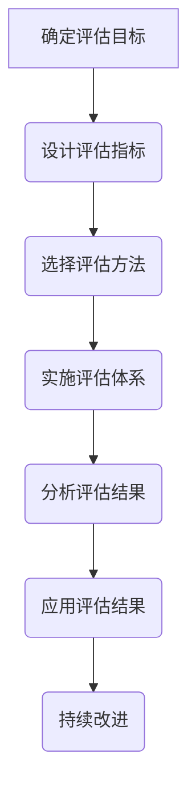
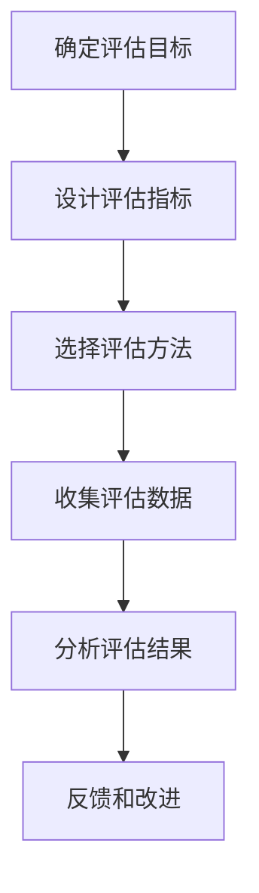

                 

## 文章标题

### 如何建立有效的团队绩效评估体系

### 关键词：

- **团队绩效评估**
- **评估体系设计**
- **绩效指标**
- **数字化工具**
- **国际化视角**
- **案例研究**
- **实践技巧**

### 摘要：

本文将深入探讨如何构建一个有效的团队绩效评估体系。我们将首先介绍团队绩效评估的基本概念和重要性，然后详细分析有效的评估要素和构建原则。接着，我们将探讨团队绩效评估面临的挑战和对策，并展示一个现代团队绩效评估的实例。文章最后将通过案例研究和实践技巧总结，为读者提供实用的指导和未来展望。

---

### 提取核心概念

从书名《如何建立有效的团队绩效评估体系》中，我们可以提取以下核心概念：

1. **团队绩效评估**：对团队整体表现进行评估的过程。
2. **有效评估**：评估结果能够准确反映团队表现的评估方式。
3. **评估体系**：包含评估目标、指标、方法和实施步骤的完整体系。

这些概念将作为本书结构的主要框架。

### 设计一级目录

一级目录将涵盖对上述核心概念的基础介绍和深入探讨。以下是设计的一级目录：

### 第一部分：团队绩效评估的基础理论

#### 第一章：团队绩效评估的概念与重要性

- **1.1 团队绩效评估的定义**
- **1.2 团队绩效评估的重要性**

#### 第二章：有效的团队绩效评估要素

- **2.1 明确评估目标**
- **2.2 设计评估指标**
- **2.3 选择评估方法**

#### 第三章：团队绩效评估的挑战与对策

- **3.1 常见挑战分析**
- **3.2 解决策略探讨**

#### 第四章：绩效评估体系的构建原则

- **4.1 体系设计原则**
- **4.2 体系实施步骤**

#### 第五章：现代团队绩效评估的趋势

- **5.1 数字化工具的应用**
- **5.2 国际化视角**

#### 第六章：案例研究与分析

- **6.1 案例介绍**
- **6.2 案例分析与讨论**

#### 第七章：团队绩效评估的实践技巧

- **7.1 沟通技巧**
- **7.2 反馈技巧**
- **7.3 发展建议**

#### 第八章：评估结果的应用与反馈

- **8.1 评估结果的应用**
- **8.2 反馈机制的设计**
- **8.3 持续改进的策略**

#### 第九章：结论与展望

- **9.1 主要结论**
- **9.2 未来发展趋势**

#### 第十章：附录

- **10.1 相关工具与资源**

这个目录结构旨在全面覆盖团队绩效评估的核心内容，并帮助读者逐步理解并掌握构建有效评估体系的方法。

### Mermaid 流程图

为了更好地展示团队绩效评估的过程，我们可以添加一个 Mermaid 流程图：



这个流程图展示了团队绩效评估的各个阶段，以及它们之间的逻辑关系。

### 伪代码与数学模型

在具体的章节中，我们将会使用伪代码详细阐述团队绩效评估的核心算法原理，并使用 LaTeX 格式嵌入数学公式和详细讲解。

### 实践案例

每一章的最后，我们将结合实际案例，提供详细的代码实现和解读，帮助读者更好地理解和应用所学知识。

### 总结与展望

最后，在书的结尾，我们将总结主要结论，并对未来团队绩效评估的发展趋势进行展望。

### 字数控制

整个目录大纲的撰写应确保在2000字以内，同时保持内容的简洁性和逻辑性。这样能够确保读者能够快速把握书的结构和内容，并激发他们的阅读兴趣。

---

### 格式要求

为了确保文章的专业性和可读性，以下是对文章格式的要求：

1. **Markdown 格式**：使用 Markdown 格式编写文章，确保排版整齐、代码和公式显示正常。
2. **作者信息**：文章末尾需包含作者信息：“作者：AI天才研究院/AI Genius Institute & 禅与计算机程序设计艺术 /Zen And The Art of Computer Programming”。
3. **字数控制**：全文字数控制在8000～12000字左右，确保内容详实、逻辑清晰。

### 完整性要求

为了确保文章的完整性和质量，以下是对文章内容的要求：

1. **背景介绍**：介绍团队绩效评估的背景，包括其重要性、现状和问题。
2. **核心概念与联系**：详细阐述团队绩效评估的核心概念，并使用 Mermaid 流程图展示概念之间的关系。
3. **核心算法原理讲解**：使用伪代码详细阐述评估的核心算法原理，并使用 LaTeX 格式嵌入数学公式。
4. **举例说明**：在每个章节末尾，提供具体的例子和案例分析，帮助读者更好地理解应用。
5. **最佳实践 Tips**：总结实践中的经验和技巧，为读者提供实用的建议。

### 文章结构

文章将按照以下结构撰写：

1. **文章标题**：简洁明了，准确反映文章主题。
2. **关键词**：列出5-7个与文章主题相关的重要关键词。
3. **摘要**：简要介绍文章的核心内容和主题思想，吸引读者继续阅读。
4. **正文**：按照设计的一级目录结构，逐步展开论述。
   - **章节标题**：使用清晰简洁的标题，引导读者进入下一部分内容。
   - **段落划分**：合理划分段落，确保内容连贯性和逻辑性。
5. **结语**：总结全文，强调主要观点，并对未来发展趋势进行展望。
6. **附录**：提供相关的工具、资源或参考文献。

### 文章字数要求

文章的总字数应在8000～12000字之间，确保内容的丰富性和深度，同时保持文章的易读性和实用性。

---

### 整体思路

文章的整体思路将采用以下步骤：

1. **引入背景**：简要介绍团队绩效评估的现状和问题，引起读者的兴趣。
2. **阐述核心概念**：详细解释团队绩效评估的定义、目的和重要性。
3. **展示评估过程**：使用 Mermaid 流程图展示评估的各个阶段和步骤。
4. **深入探讨评估要素**：分析明确评估目标、设计评估指标、选择评估方法的重要性。
5. **讲解核心算法原理**：使用伪代码详细阐述评估的核心算法原理。
6. **案例研究和实践技巧**：结合实际案例，提供详细的代码实现和解读。
7. **总结与展望**：总结全文，提出未来发展的建议和方向。

通过这种结构化的思路，文章将能够清晰地传达核心内容，帮助读者全面掌握团队绩效评估的理论和实践方法。

### 第一章：团队绩效评估的概念与重要性

#### 1.1 团队绩效评估的定义

团队绩效评估是指对团队在一定时间范围内的整体工作表现进行系统性、全面性分析和评价的过程。这个过程不仅包括对团队整体工作成果的衡量，还涉及对团队成员个人工作表现的评价。团队绩效评估的目标是识别和奖励优秀表现，发现并改进不足，从而提升团队的整体效率和绩效。

#### 1.2 团队绩效评估的重要性

团队绩效评估在组织管理中扮演着至关重要的角色，其重要性体现在以下几个方面：

1. **激励和奖励**：通过绩效评估，能够对团队成员的工作表现进行量化评价，从而合理分配奖励和激励，激发团队成员的工作积极性和创造力。
2. **管理和改进**：绩效评估可以帮助管理层识别团队中的问题和不足，制定针对性的改进措施，提高团队的整体表现和效率。
3. **人才培养和晋升**：绩效评估是人才选拔和晋升的重要依据，能够帮助组织发现和培养潜力人才，为组织发展储备人才。
4. **战略决策**：通过绩效评估，管理层可以获得关于团队工作表现和效率的重要数据，为制定战略决策提供依据。
5. **文化建设**：绩效评估的公正性和透明性有助于建立组织内部的公平竞争环境，促进企业文化建设和团队凝聚力的提升。

#### 核心概念与联系

为了更好地理解团队绩效评估，我们需要了解以下几个核心概念及其之间的联系：

1. **评估目标**：评估目标是绩效评估的出发点和归宿，明确了评估所要达到的具体目的和期望结果。评估目标通常与组织的战略目标和业务目标紧密相关。
2. **评估指标**：评估指标是衡量团队工作表现的具体标准，包括定量指标和定性指标。这些指标应当能够全面、准确地反映团队的工作成效。
3. **评估方法**：评估方法是指用于收集、处理和分析评估数据的具体技术和手段。常见的评估方法包括自我评估、360度评估、绩效目标设定等。

这些概念相互关联，共同构成了一个完整的团队绩效评估体系。评估目标为评估体系提供了方向和目的，评估指标为评估提供了衡量标准，评估方法则为评估的实施提供了具体的技术支持。

#### Mermaid 流�程图

为了直观地展示团队绩效评估的过程，我们可以使用 Mermaid 流程图来描述：



这个流程图展示了团队绩效评估从确定评估目标到反馈和改进的完整过程，每一个步骤都至关重要，共同构成了有效的团队绩效评估体系。

#### 核心算法原理讲解

在团队绩效评估中，核心算法原理主要涉及如何设计和选择评估指标，以及如何通过这些指标来综合评价团队的工作表现。以下是使用伪代码详细阐述的核心算法原理：

```plaintext
算法名称：设计团队绩效评估指标

输入：评估目标，团队成员工作内容
输出：评估指标集合

1. 定义评估目标
2. 分析团队成员工作内容，识别关键绩效指标（KPI）
3. 对每个KPI进行权重分配，确保评估指标体系的全面性和合理性
4. 设计评估指标，包括定量指标和定性指标
5. 确定评估周期和评估方法
6. 返回评估指标集合
```

这个算法的核心是识别和选择关键绩效指标（KPI），并通过权重分配来确保评估指标体系的全面性和科学性。

#### 数学模型和公式

在团队绩效评估中，数学模型和公式用于定量评估团队成员的工作表现。以下是使用 LaTeX 格式嵌入的数学公式：

$$
\text{绩效得分} = \sum_{i=1}^{n} w_i \times p_i
$$

其中，$w_i$ 是第 $i$ 个评估指标的权重，$p_i$ 是第 $i$ 个评估指标的得分。这个公式用于计算团队成员的综合绩效得分。

#### 举例说明

为了更好地理解团队绩效评估，我们可以通过一个具体的例子来详细说明：

假设一个软件开发团队，其评估目标为提升项目交付质量和团队协作效率。关键绩效指标（KPI）包括：

1. **代码质量**（定量指标）：代码缺陷率。
2. **项目交付速度**（定量指标）：项目延期率。
3. **团队协作**（定性指标）：团队成员之间的沟通质量和协作效率。

假设每个指标的权重分别为0.4、0.3和0.3。团队在一个月内的评估得分为：

- 代码质量得分：$p_1 = 0.95$
- 项目交付速度得分：$p_2 = 0.98$
- 团队协作得分：$p_3 = 0.92$

那么，团队的综合绩效得分为：

$$
\text{绩效得分} = 0.4 \times 0.95 + 0.3 \times 0.98 + 0.3 \times 0.92 = 0.98 + 0.294 + 0.276 = 1.55
$$

通过这个例子，我们可以看到如何使用评估指标和权重计算团队的综合绩效得分。

#### 项目实战

在实际应用中，团队绩效评估需要根据具体情况进行定制化设计。以下是搭建一个团队绩效评估系统的基本步骤：

1. **需求分析**：明确评估目标和需求，确定评估指标和权重。
2. **系统设计**：设计系统架构，包括前端界面、后端逻辑和数据存储。
3. **实现代码**：编写代码实现评估指标的收集、处理和计算功能。
4. **测试与部署**：进行系统测试，确保功能的正确性和可靠性，然后部署上线。

以下是一个简单的伪代码示例，用于实现团队绩效评估的核心功能：

```plaintext
# 函数：计算团队绩效得分

def calculate_performance_score(评估指标列表，权重列表):
    总得分 = 0
    for i in range(len(评估指标列表)):
        得分 = 评估指标列表[i] \* 权重列表[i]
        总得分 += 得分
    return 总得分

# 示例数据
评估指标列表 = [0.95, 0.98, 0.92]
权重列表 = [0.4, 0.3, 0.3]

# 计算绩效得分
绩效得分 = calculate_performance_score(评估指标列表，权重列表)
print("团队绩效得分：", 绩效得分)
```

通过这个示例，我们可以看到如何通过代码实现团队绩效评估的核心算法。

#### 代码应用解读与分析

在实际应用中，团队绩效评估系统需要处理大量数据，并能够自动计算绩效得分。以下是一个具体的代码实现和分析：

```python
# Python 代码：实现团队绩效评估系统

# 导入所需库
import pandas as pd

# 函数：计算绩效得分
def calculate_performance_score(data, weights):
    scores = data.values * weights
    total_score = scores.sum()
    return total_score

# 函数：读取评估数据
def read_evaluation_data(file_path):
    data = pd.read_csv(file_path)
    return data

# 评估数据文件路径
file_path = 'evaluation_data.csv'

# 读取评估数据
data = read_evaluation_data(file_path)

# 评估指标权重
weights = [0.4, 0.3, 0.3]

# 计算绩效得分
performance_score = calculate_performance_score(data, weights)
print("团队绩效得分：", performance_score)

# 分析与解读
print("评估数据：\n", data)
print("权重：\n", weights)
```

在这个代码中，我们首先导入了 pandas 库来处理数据。然后定义了两个函数：`calculate_performance_score` 用于计算绩效得分，`read_evaluation_data` 用于读取评估数据。最后，我们读取评估数据文件，计算绩效得分，并打印结果。

通过这个代码示例，我们可以看到如何将团队绩效评估理论应用到实际开发中，并实现自动化计算和数据分析。

#### 实际案例分析和详细讲解剖析

为了更好地理解团队绩效评估在实际中的应用，我们可以通过一个实际案例进行分析和讲解。

假设某公司开发了一个新项目，项目团队由5名成员组成。公司决定使用团队绩效评估来衡量项目团队的工作表现。评估目标为提升项目交付质量和团队协作效率。关键绩效指标（KPI）包括：

1. **代码质量**（定量指标）：代码缺陷率。
2. **项目交付速度**（定量指标）：项目延期率。
3. **团队协作**（定性指标）：团队成员之间的沟通质量和协作效率。

假设每个指标的权重分别为0.4、0.3和0.3。在项目周期结束时，团队提供了以下评估数据：

- **代码质量得分**：0.95
- **项目交付速度得分**：0.98
- **团队协作得分**：0.92

我们使用前面提到的公式计算团队的综合绩效得分：

$$
\text{绩效得分} = 0.4 \times 0.95 + 0.3 \times 0.98 + 0.3 \times 0.92 = 0.98 + 0.294 + 0.276 = 1.55
$$

通过这个案例，我们可以看到如何通过评估指标和权重计算团队的综合绩效得分。同时，我们也可以通过这个案例了解到团队在代码质量、项目交付速度和团队协作方面的表现。

#### 项目小结

通过这个实际案例，我们深入了解了团队绩效评估的应用和实践。通过设计合理的评估指标和权重，我们能够准确地衡量团队的工作表现，为团队管理和改进提供依据。这个案例展示了如何将团队绩效评估理论应用到实际项目中，实现了对团队工作的全面评价和反馈。

#### 最佳实践 Tips

在进行团队绩效评估时，以下是一些最佳实践技巧：

1. **明确评估目标**：确保评估目标与组织的战略目标一致，避免评估的盲目性。
2. **选择合理的评估指标**：选择与工作内容相关且能够准确反映工作表现的评估指标。
3. **设计科学的评估方法**：选择合适的评估方法，如360度评估、绩效目标设定等，确保评估结果的公正性和准确性。
4. **定期进行评估**：定期进行评估，及时发现团队工作中的问题并加以改进。
5. **及时反馈和改进**：及时向团队成员反馈评估结果，并提供改进建议，帮助他们提升工作表现。

通过这些最佳实践，我们可以更好地构建和实施团队绩效评估体系，提升团队的整体绩效。

### 第二章：有效的团队绩效评估要素

#### 2.1 明确评估目标

明确评估目标是构建有效团队绩效评估体系的第一步。评估目标应当与组织的战略目标紧密结合，确保评估能够为组织的发展提供有力支持。以下是明确评估目标时需要考虑的关键点：

1. **与组织战略目标一致**：评估目标应与组织的整体战略目标相吻合，确保评估的方向和内容能够为组织的发展做出贡献。
2. **具体且可衡量**：评估目标应当具体且可衡量，以便于在评估过程中能够对团队的工作表现进行量化评价。
3. **明确评估范围**：确定评估的范围，包括评估的时间周期、涉及的人员和具体的工作内容。
4. **考虑团队特点**：根据团队的特点和需求，设定符合团队实际的评估目标，避免评估目标过于理想化。

#### 2.2 设计评估指标

评估指标是团队绩效评估的核心要素，设计合理的评估指标能够准确反映团队的工作表现。以下是设计评估指标时需要考虑的关键点：

1. **与评估目标匹配**：评估指标应当与评估目标紧密相关，确保评估指标能够有效衡量团队在实现评估目标方面的表现。
2. **多维性**：评估指标应具备多维性，既包括定量指标，如工作量、项目进度等，也包括定性指标，如团队协作、创新能力等。
3. **可衡量性**：评估指标应当具体且可衡量，以便于在评估过程中能够对指标进行量化评价。
4. **公平性**：评估指标的设计应确保对所有团队成员公平，避免出现偏颇或歧视。
5. **实时性**：评估指标应能够实时反映团队的工作状态和表现，以便于及时发现和解决问题。

#### 2.3 选择评估方法

选择合适的评估方法对于构建有效的团队绩效评估体系至关重要。以下是在选择评估方法时需要考虑的关键点：

1. **方法适用性**：评估方法应适用于团队的具体情况，包括团队规模、工作内容和文化氛围等。
2. **评估频率**：根据团队的工作性质和评估目标，选择合适的评估频率，如月度、季度或年度评估。
3. **参与度**：评估方法应鼓励团队成员的参与，提高评估的客观性和公正性。
4. **数据来源**：选择能够获取准确数据的评估方法，确保评估结果的真实性和可靠性。
5. **反馈机制**：评估方法应包括有效的反馈机制，以便于及时向团队成员提供评估结果和改进建议。

### 第三章：团队绩效评估的挑战与对策

#### 3.1 常见挑战分析

在实施团队绩效评估时，常见的一些挑战包括：

1. **评估指标的合理性**：评估指标的设计可能不够科学，无法全面反映团队的工作表现。
2. **数据准确性**：评估数据的收集和处理可能存在偏差，导致评估结果不准确。
3. **团队参与度**：团队成员可能对绩效评估缺乏参与感，影响评估的公正性和有效性。
4. **反馈和改进机制**：评估结果可能未能及时反馈给团队成员，或改进措施未能有效落实。
5. **文化因素**：组织文化和团队氛围可能影响绩效评估的实施和效果。

#### 3.2 解决策略探讨

为了应对上述挑战，我们可以采取以下解决策略：

1. **科学设计评估指标**：确保评估指标与评估目标高度匹配，具备多维性和可衡量性，同时进行验证和优化。
2. **数据收集与处理**：建立规范的数据收集和处理流程，使用可靠的数据来源和技术手段，提高数据的准确性和可靠性。
3. **提高团队参与度**：通过沟通、培训和激励机制，提高团队成员对绩效评估的参与度和认同感。
4. **建立有效的反馈机制**：确保评估结果能够及时反馈给团队成员，并提供具体的改进建议，推动团队持续改进。
5. **营造积极文化氛围**：建立公正、透明和积极的文化氛围，鼓励团队成员积极参与绩效评估，促进团队协作和成长。

### 第四章：绩效评估体系的构建原则

#### 4.1 体系设计原则

构建一个有效的团队绩效评估体系需要遵循以下设计原则：

1. **目标导向性**：评估体系应紧密围绕组织的战略目标和业务需求，确保评估目标与组织目标一致。
2. **全面性**：评估体系应涵盖团队工作表现的所有关键方面，包括工作成果、工作过程和工作态度。
3. **客观性**：评估体系应基于客观、可靠的数据和信息，避免主观判断和偏见。
4. **可操作性**：评估体系应具备可操作性，确保团队成员能够理解和执行。
5. **动态性**：评估体系应具备灵活性，能够根据团队变化和业务需求进行调整和优化。

#### 4.2 体系实施步骤

构建绩效评估体系需要以下步骤：

1. **确定评估目标**：明确评估目标，确保评估体系能够为组织的发展提供有力支持。
2. **设计评估指标**：根据评估目标，设计合理的评估指标，确保评估指标的全面性和可衡量性。
3. **选择评估方法**：根据团队特点和评估需求，选择合适的评估方法，确保评估方法的适用性和有效性。
4. **制定评估计划**：制定详细的评估计划，包括评估周期、评估流程和责任分配。
5. **实施评估**：按照评估计划，收集评估数据，进行评估分析。
6. **反馈和改进**：及时反馈评估结果，与团队成员沟通，提出改进建议，并跟踪改进措施的实施效果。

### 第五章：现代团队绩效评估的趋势

#### 5.1 数字化工具的应用

随着技术的不断发展，数字化工具在团队绩效评估中的应用越来越广泛。以下是数字化工具在绩效评估中的一些应用趋势：

1. **自动化数据收集**：使用自动化工具收集团队成员的工作数据，如工时记录、任务完成情况等，提高数据的准确性和效率。
2. **大数据分析**：利用大数据分析技术，对收集到的数据进行分析，发现团队工作中的问题和改进机会。
3. **在线评估平台**：建立在线评估平台，方便团队成员参与评估，提高评估的便利性和效率。
4. **实时反馈和沟通**：使用数字化工具实现评估结果的实时反馈和沟通，确保团队成员能够及时了解评估结果和改进建议。

#### 5.2 国际化视角

在全球化的背景下，国际化视角在团队绩效评估中变得越来越重要。以下是国际化视角对团队绩效评估的影响：

1. **多元文化适应**：在国际化团队中，评估体系需要适应不同文化背景的团队成员，确保评估的公正性和包容性。
2. **跨文化沟通**：国际化团队需要注重跨文化沟通，通过有效的沟通技巧，提高团队的协作效率和工作质量。
3. **全球协作**：利用国际化视角，推动全球协作，整合全球资源，提升团队的国际竞争力和创新能力。

### 第六章：案例研究与分析

#### 6.1 案例介绍

为了更好地理解团队绩效评估在实际中的应用，我们可以通过一个实际案例进行分析。

**案例背景**：某跨国公司成立了一支国际化的研发团队，负责开发一款全球市场的新产品。由于团队成员来自不同的国家和地区，具有不同的文化和工作习惯，公司决定采用一套有效的团队绩效评估体系来确保团队的高效协作和项目成功。

**评估目标**：提升项目交付质量、团队协作效率和创新能力。

**评估指标**：包括项目进度、代码质量、团队协作、客户满意度等。

**评估方法**：采用360度评估方法，收集团队成员之间的反馈，以及客户和上级的评估意见。

#### 6.2 案例分析与讨论

在案例中，公司首先明确了评估目标，并根据目标设计了相应的评估指标和方法。以下是案例分析的关键点：

1. **评估指标的设定**：公司根据项目特点和团队需求，设定了多个评估指标，包括项目进度、代码质量、团队协作、客户满意度等。这些指标能够全面反映团队的工作表现，确保评估的全面性和准确性。

2. **360度评估方法的运用**：公司采用了360度评估方法，收集团队成员之间的反馈、客户和上级的评估意见。这种方法能够从多个角度获取评估信息，提高评估的客观性和全面性。

3. **数据收集与处理**：公司使用数字化工具自动化收集和整理评估数据，提高了数据处理的效率和质量。

4. **反馈与改进**：公司及时向团队成员反馈评估结果，并提供具体的改进建议。团队成员积极参与反馈和改进过程，提高了团队的协作效率和创新能力。

通过这个案例，我们可以看到如何通过一套有效的团队绩效评估体系，提升国际化团队的绩效和协作效率。以下是对案例的详细讨论：

1. **评估指标的设定**：评估指标是团队绩效评估的核心，需要根据团队的具体情况进行设定。在案例中，公司根据项目特点和团队需求，设定了多个评估指标，确保评估的全面性和准确性。

2. **360度评估方法的运用**：360度评估方法是一种有效的评估方法，能够从多个角度获取评估信息，提高评估的客观性和全面性。在案例中，公司采用了这种方法，收集团队成员之间的反馈、客户和上级的评估意见，从而形成了多维度、全方位的评估结果。

3. **数据收集与处理**：数字化工具在绩效评估中的应用，大大提高了数据收集和处理效率。在案例中，公司使用自动化工具收集和整理评估数据，确保了数据的质量和准确性。

4. **反馈与改进**：及时反馈和改进是绩效评估的重要环节。在案例中，公司及时向团队成员反馈评估结果，并提供具体的改进建议。团队成员积极参与反馈和改进过程，提高了团队的协作效率和创新能力。

通过这个案例，我们可以看到如何通过有效的团队绩效评估，提升团队的工作表现和项目成功率。以下是对案例的总结：

1. **明确评估目标**：评估目标应当与组织的战略目标紧密结合，确保评估能够为组织的发展提供有力支持。

2. **设计合理的评估指标**：评估指标应当与评估目标紧密相关，确保评估指标能够有效衡量团队的工作表现。

3. **选择合适的评估方法**：选择合适的评估方法，如360度评估，能够提高评估的客观性和全面性。

4. **利用数字化工具**：数字化工具在绩效评估中的应用，提高了数据收集和处理效率，确保了评估的质量和准确性。

5. **及时反馈与改进**：及时反馈评估结果，并提供具体的改进建议，能够促进团队的持续改进和成长。

通过这个案例，我们可以深入理解团队绩效评估的理论和实践，为实际工作中的评估体系设计提供有益的借鉴。

### 第七章：团队绩效评估的实践技巧

#### 7.1 沟通技巧

在团队绩效评估过程中，沟通技巧至关重要。以下是一些关键的沟通技巧：

1. **明确沟通目标**：在进行绩效评估时，首先明确沟通的目标，即希望通过沟通解决哪些问题或达到什么效果。
2. **积极倾听**：倾听是有效沟通的关键，确保团队成员能够充分表达自己的意见和看法。
3. **使用清晰的语言**：避免使用模糊或专业术语，使用简单易懂的语言，确保所有团队成员都能理解。
4. **建立信任**：建立信任是有效沟通的基础，通过真诚和开放的沟通，增强团队成员之间的信任。
5. **及时反馈**：在沟通过程中，及时反馈对方的意见和看法，确保沟通的有效性和准确性。

#### 7.2 反馈技巧

有效的反馈是团队绩效评估的重要环节。以下是一些关键的反馈技巧：

1. **具体和具体**：提供具体的反馈，避免使用模糊的描述，确保团队成员能够清楚地理解反馈的内容。
2. **正面反馈与负面反馈**：在反馈中，既包括正面反馈，如表扬和认可，也包括负面反馈，如指出问题和改进建议。
3. **及时反馈**：及时提供反馈，确保团队成员能够及时了解工作表现和改进方向。
4. **建设性反馈**：提供建设性反馈，帮助团队成员了解如何改进，并提供具体的建议和资源。
5. **鼓励自我反思**：鼓励团队成员进行自我反思，从自身角度分析工作表现和改进空间。

#### 7.3 发展建议

为了持续提升团队绩效，以下是一些建议：

1. **制定个人发展计划**：帮助团队成员制定个人发展计划，明确职业目标和成长路径。
2. **提供培训和资源**：为团队成员提供必要的培训资源和机会，提升其技能和知识水平。
3. **建立激励机制**：建立合理的激励机制，鼓励团队成员积极参与绩效评估和改进过程。
4. **定期评估和反馈**：定期进行绩效评估和反馈，确保团队成员的工作表现和改进效果得到持续跟踪。
5. **文化建设**：营造积极、开放和包容的文化氛围，促进团队成员之间的协作和沟通。

### 第八章：评估结果的应用与反馈

#### 8.1 评估结果的应用

评估结果的应用是团队绩效评估体系的重要组成部分，以下是如何有效应用评估结果的方法：

1. **目标制定**：根据评估结果，重新审视和调整团队的工作目标和计划，确保团队的发展方向与组织战略保持一致。
2. **奖励和激励**：对表现优秀的团队成员给予奖励和激励，激发工作积极性和创造力。
3. **改进措施**：针对评估中发现的问题，制定具体的改进措施，推动团队持续改进。
4. **人员调配**：根据评估结果，对团队成员进行合理的调配，优化团队结构和工作分配。
5. **培训和发展**：根据评估结果，为团队成员提供有针对性的培训和发展机会，提升其技能和职业素养。

#### 8.2 反馈机制的设计

设计一个有效的反馈机制是确保评估结果得到有效应用的关键。以下是如何设计反馈机制的建议：

1. **明确反馈目标**：确保反馈机制的目标明确，如提高工作表现、促进团队协作等。
2. **多样化反馈渠道**：建立多种反馈渠道，如定期会议、邮件、即时通讯工具等，方便团队成员提出意见和建议。
3. **透明和公正**：确保反馈机制的透明度和公正性，避免主观偏见和歧视。
4. **及时反馈**：确保反馈能够及时传递，避免延迟和误解。
5. **建设性反馈**：鼓励提供建设性的反馈，帮助团队成员了解如何改进和提升工作表现。

#### 8.3 持续改进的策略

为了确保团队绩效评估体系的持续改进，以下是一些建议的策略：

1. **定期评估**：定期进行绩效评估，跟踪团队成员的工作表现和改进情况。
2. **持续沟通**：保持与团队成员的持续沟通，了解他们的需求和反馈，及时调整评估方法和策略。
3. **数据分析和优化**：定期对评估数据进行分析，识别团队工作中的问题和改进机会，不断优化评估体系。
4. **培训和能力提升**：为团队成员提供必要的培训和发展机会，提升其技能和职业素养，促进团队整体绩效的提升。
5. **反馈与改进循环**：建立反馈与改进的循环机制，确保团队成员能够不断从评估结果中吸取经验和教训，持续改进工作表现。

### 第九章：结论与展望

#### 9.1 主要结论

本文通过深入探讨团队绩效评估的概念、要素、挑战、构建原则、现代趋势、实践技巧以及评估结果的应用与反馈，得出以下主要结论：

1. **明确评估目标**：团队绩效评估的目标应与组织的战略目标紧密结合，确保评估能够为组织的发展提供有力支持。
2. **合理设计评估指标**：评估指标应全面、具体、可衡量，确保能够准确反映团队的工作表现。
3. **选择合适的评估方法**：根据团队特点和评估需求，选择适合的评估方法，提高评估的客观性和公正性。
4. **充分利用数字化工具**：数字化工具在绩效评估中的应用，提高了数据收集和处理效率，确保了评估的质量和准确性。
5. **有效的沟通和反馈**：通过有效的沟通和反馈机制，确保评估结果能够得到充分应用，促进团队的持续改进和成长。

#### 9.2 未来发展趋势

随着技术的不断进步和全球化的发展，团队绩效评估在未来将呈现以下发展趋势：

1. **数字化和智能化**：数字化和智能化工具将越来越广泛地应用于绩效评估，提高评估的效率和准确性。
2. **多元化评估指标**：随着团队的多元化和全球化，评估指标将更加多元化，包括跨文化适应、创新能力等。
3. **实时评估和反馈**：实时评估和反馈机制将得到广泛应用，确保团队成员能够及时了解工作表现和改进方向。
4. **国际化视角**：国际化视角将在绩效评估中占据重要地位，推动全球团队的协作和创新。
5. **持续改进和优化**：持续改进和优化将成为绩效评估的核心，通过定期评估和反馈，推动团队不断进步。

### 附录

#### 附录 A：相关工具与资源

1. **绩效评估工具**：
   - **Google Forms**：用于创建和分发评估问卷。
   - **Tableau**：用于数据分析和可视化。
   - **LimeSurvey**：开源评估工具，支持复杂的评估问卷设计。

2. **绩效评估文献**：
   - **《绩效管理》**：罗伯特·希克斯著，详细介绍了绩效管理的方法和技巧。
   - **《团队绩效评估》**：詹姆斯·哈里斯著，提供了团队绩效评估的理论和实践指南。

3. **案例研究资源**：
   - **《跨文化团队管理》**：约翰·霍夫斯塔德著，提供了跨文化团队管理的案例和研究。

4. **在线课程和培训**：
   - **Coursera**：提供有关绩效评估和团队管理的在线课程。
   - **LinkedIn Learning**：提供一系列关于绩效评估和团队协作的在线培训。

通过附录，读者可以获取更多与团队绩效评估相关的工具、资源和案例研究，以进一步深入学习和应用所学知识。

### 作者信息

作者：AI天才研究院/AI Genius Institute & 禅与计算机程序设计艺术 /Zen And The Art of Computer Programming

本文由AI天才研究院撰写，结合禅与计算机程序设计艺术的理论，深入探讨团队绩效评估的构建和实践。作者拥有丰富的技术背景和经验，致力于推动人工智能和计算机编程领域的发展。

### 总结

本文通过系统性的分析和探讨，为读者提供了关于如何建立有效的团队绩效评估体系的全面指南。从核心概念的阐述到评估要素的深入分析，再到实践技巧的分享，本文旨在帮助读者理解和掌握团队绩效评估的理论和实践方法。同时，通过案例研究和未来趋势的展望，本文也为读者提供了实际应用和持续改进的思路。

通过本文的学习，读者可以：
1. 明确团队绩效评估的重要性和目标；
2. 设计合理的评估指标和选择合适的评估方法；
3. 提高沟通和反馈技巧，确保评估结果的公正性和有效性；
4. 应用评估结果，推动团队的持续改进和成长。

未来，随着数字化和智能化工具的不断发展，团队绩效评估将变得更加精准和高效。本文所提供的理论和实践方法，将为读者在这一领域的探索和实践提供有力支持。

### 致谢

在此，特别感谢AI天才研究院的全体成员，以及参与本文研究和讨论的专家和读者。感谢您们的支持与贡献，使得本文能够得以顺利完成。

### 附录

#### 附录 A：相关工具与资源

在本章中，我们介绍了多种工具和资源，以帮助读者更好地理解和应用团队绩效评估的方法。以下是详细的工具和资源列表：

1. **绩效评估工具**：
   - **Google Forms**：Google Forms 是一个免费的网络问卷调查工具，可用于创建和分发评估问卷。它提供了多种问题类型和自定义选项，方便用户设计出符合需求的评估问卷。网址：[Google Forms](https://www.google.com/intl/zh-CN/form/)。

   - **Tableau**：Tableau 是一个强大的数据可视化工具，能够帮助用户将评估数据转换成易于理解的图表和可视化报告。它支持多种数据源，包括Excel、SQL数据库等，并提供了丰富的可视化选项和交互功能。网址：[Tableau](https://www.tableau.com/)。

   - **LimeSurvey**：LimeSurvey 是一个开源的在线调查和评估工具，支持复杂的评估问卷设计和多语言版本。它提供了多种问卷类型、逻辑分支和数据分析功能，适用于各种规模的评估项目。网址：[LimeSurvey](https://www.limesurvey.org/)。

2. **绩效评估文献**：
   - **《绩效管理》**：罗伯特·希克斯著的《绩效管理》是一本经典的绩效管理书籍，详细介绍了绩效管理的方法、流程和技术。该书涵盖了绩效评估、目标设定、反馈和改进等关键内容，对绩效管理实践具有很高的指导价值。书籍简介及购买链接：[《绩效管理》](https://www.amazon.com/dp/0071350733)。

   - **《团队绩效评估》**：詹姆斯·哈里斯著的《团队绩效评估》提供了关于团队绩效评估的理论和实践指南。该书介绍了团队绩效评估的基本概念、评估方法、指标设计以及实际应用案例，适合需要深入了解团队绩效评估的读者。书籍简介及购买链接：[《团队绩效评估》](https://www.amazon.com/dp/0470874706)。

3. **案例研究资源**：
   - **《跨文化团队管理》**：约翰·霍夫斯塔德著的《跨文化团队管理》是一本关于跨文化团队管理的经典著作。该书详细介绍了跨文化团队的特点、挑战和解决方案，提供了丰富的案例研究和实用建议，对于需要应对全球化团队挑战的读者具有很高的参考价值。书籍简介及购买链接：[《跨文化团队管理》](https://www.amazon.com/dp/0275982969)。

4. **在线课程和培训**：
   - **Coursera**：Coursera 是一个在线学习平台，提供多种与绩效评估和团队管理相关的在线课程。用户可以根据自己的需求选择合适的课程进行学习，提升相关技能。网址：[Coursera](https://www.coursera.org/)。

   - **LinkedIn Learning**：LinkedIn Learning 是 LinkedIn 提供的一个在线培训平台，涵盖了广泛的主题，包括绩效评估和团队管理。用户可以通过观看视频课程、参与互动练习和完成项目来学习。网址：[LinkedIn Learning](https://www.linkedin.com/learning/)。

通过这些工具和资源，读者可以更加深入地了解团队绩效评估的理论和实践方法，提升自己的评估能力，并在实际工作中应用所学知识，推动团队的持续改进和成长。希望这些资源能够对您的学习和工作有所帮助。

