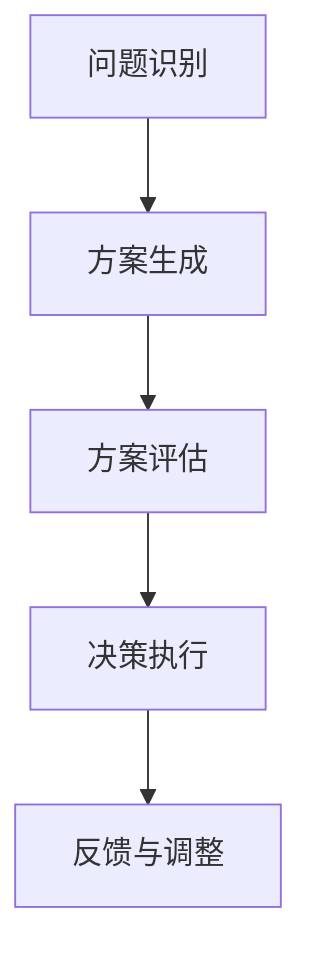

                 


### 文章标题：如何建立高效的团队决策机制

### 关键词：高效决策、团队协作、沟通技巧、领导力、激励机制、实际案例分析

### 摘要：

在当今快速变化的市场环境中，高效决策是组织成功的关键。本文将探讨如何通过构建科学合理的团队决策机制，提升团队决策的效率和质量。我们将从决策理论的基础、团队协作与沟通技巧、领导力与激励机制、实际案例分析等方面进行深入探讨，为读者提供一套系统的决策机制建设方案。

### 目录：

1. **决策理论概述**
2. **决策框架与工具**
3. **团队协作的要素**
4. **有效沟通的技巧**
5. **领导力与团队决策**
6. **激励与团队合作**
7. **实际案例分析**
8. **建立高效的团队决策机制**

### 正文内容

#### 1. 决策理论概述

决策理论是研究决策过程、决策规则和决策方法的学科。它包括从心理学、经济学、社会学等多个角度对决策行为进行分析。以下是对决策理论的基本概念和核心模型的概述：

- **决策过程**：决策过程通常包括问题识别、方案生成、方案评估和决策执行等步骤。

- **决策规则**：决策规则是指用于指导决策制定的一系列原则或准则。常见的决策规则包括最大期望值规则、最小化风险规则等。

- **决策模型**：决策模型是用于分析和解决决策问题的数学模型。常见的决策模型包括线性规划模型、决策树模型等。

Mermaid流程图： 


#### 2. 决策框架与工具

决策框架是指导决策制定和执行的基本结构。以下是几种常见的决策框架和工具：

- **SWOT分析**：SWOT分析是一种常用的决策工具，用于分析组织的优势、劣势、机会和威胁。

- **SMART目标**：SMART目标是一种明确、具体、可实现、相关和有时间限制的目标设定方法。

- **决策树**：决策树是一种用于表示决策过程和结果的图形化工具，可以帮助决策者清晰地理解不同决策路径的后果。

伪代码： 
```python
def make_decision树 problem():
    if 条件1:
        return 方案1
    elif 条件2:
        return 方案2
    else:
        return 方案3
```

#### 3. 团队协作的要素

团队协作是高效决策的基础。以下是团队协作的关键要素：

- **明确的目标**：团队需要有一个共同的目标，这有助于团队成员明确自己的责任和任务。

- **有效的沟通**：沟通是团队协作的核心，有效的沟通可以减少误解和冲突，提高团队的工作效率。

- **合理的分工**：合理的分工可以提高团队成员的工作效率，减少重复劳动和资源的浪费。

- **信任与支持**：团队成员之间的信任和支持可以增强团队的凝聚力，提高团队的工作效率。

数学模型： 
$$
\text{团队效率} = f(\text{目标明确度}, \text{沟通效率}, \text{分工合理性}, \text{信任度})
$$`

#### 4. 有效沟通的技巧

有效的沟通是团队协作的关键。以下是几种有效的沟通技巧：

- **倾听**：倾听是有效沟通的基础，它可以帮助决策者更好地理解团队成员的观点和需求。

- **表达清晰**：表达清晰是有效沟通的关键，它可以帮助团队成员更好地理解决策者的意图和决策方案。

- **积极反馈**：积极反馈可以帮助团队成员了解自己的工作效果，促进团队成员之间的沟通和理解。

例子： 
```
A：我们这次的项目进度有些延迟，需要调整一下计划。
B：我明白你的意思，我们可以在下周的会议上讨论这个问题，看看有哪些可行的解决方案。
```

#### 5. 领导力与团队决策

领导力是团队决策的核心。以下是领导力对团队决策的影响：

- **决策风格**：领导者的决策风格会影响团队决策的过程和结果。例如，民主型领导风格通常能产生更加民主和包容的决策过程。

- **领导能力**：领导者的能力直接影响团队决策的质量。一个具备战略思考能力和分析能力的领导者可以更好地指导团队做出正确的决策。

- **团队氛围**：领导者的行为和态度会影响团队的氛围。一个积极、开放的团队氛围有助于团队成员更好地参与决策和提出建议。

例子： 
```
领导者：我们需要在接下来的项目中引入新的技术，以提高我们的竞争力。
团队成员：这个技术听起来很有前景，我们可以尝试一下。
```

#### 6. 激励与团队合作

激励是团队合作的关键。以下是激励理论在团队决策中的应用：

- **目标激励**：通过设定明确的目标，激发团队成员的积极性和动力。

- **成就激励**：通过认可和奖励团队成员的成就，提高他们的工作热情。

- **参与激励**：通过让团队成员参与决策过程，增强他们的责任感和归属感。

例子： 
```
领导者：我们团队在本季度取得了显著的成绩，我将给大家颁发特别奖。
团队成员：感谢领导对我们的认可，我们会继续努力工作。
```

#### 7. 实际案例分析

以下是一个实际案例的分析：

**案例背景**：某互联网公司在面临激烈的市场竞争时，决定通过优化产品设计和提升服务质量来提高市场竞争力。

**案例过程**：

1. **问题识别**：公司通过市场调研和用户反馈，发现用户对产品的满意度较低。

2. **方案生成**：公司组织了跨部门团队，通过头脑风暴和SWOT分析，提出了多个改进方案。

3. **方案评估**：团队使用决策树模型对各个方案进行了评估，选择了最具有可行性的方案。

4. **决策执行**：团队按照既定计划，对产品进行了全面优化，并推出了新的服务质量标准。

5. **反馈与调整**：公司通过用户反馈和市场表现，对决策效果进行了评估，并进行了相应的调整。

**案例启示**：该案例表明，通过科学的决策过程和有效的团队合作，可以显著提高企业的市场竞争力。

#### 8. 建立高效的团队决策机制

要建立高效的团队决策机制，需要从以下几个方面进行：

- **明确决策流程**：制定清晰的决策流程，确保团队成员了解决策的各个步骤和责任。

- **建立决策工具**：选择合适的决策工具，如决策树、SWOT分析等，以提高决策的效率和质量。

- **加强沟通与协作**：建立有效的沟通机制，促进团队成员之间的信息共享和协作。

- **培养领导力**：培养团队成员的领导力，提高他们的决策能力和团队管理能力。

- **建立激励机制**：通过激励措施，激发团队成员的积极性和创造力。

#### 最佳实践 Tips、小结、注意事项、拓展阅读

**最佳实践 Tips**：

- **定期反思与总结**：定期对团队决策过程进行反思和总结，发现问题并及时调整。

- **尊重团队成员的意见**：鼓励团队成员参与决策，尊重他们的意见和观点。

- **持续学习与进步**：不断学习新的决策理论和工具，提高团队的决策水平。

**小结**：

建立高效的团队决策机制是提升组织竞争力的重要手段。通过科学的决策理论、有效的沟通技巧、卓越的领导力和合理的激励机制，可以显著提高团队的决策效率和决策质量。

**注意事项**：

- **避免冲动决策**：在决策过程中，要避免冲动和情绪化的决策，确保决策的客观性和理性。

- **保持开放心态**：在团队决策中，要鼓励成员表达不同的观点和意见，保持开放心态。

**拓展阅读**：

- 《决策与判断》（丹尼尔·卡内曼）
- 《领导力》（约翰·P·科特）
- 《团队协作的艺术》（托马斯·J·彼得斯）

### 结语

高效决策是组织成功的关键。通过建立科学的团队决策机制，可以提升团队的决策效率和决策质量，为组织的持续发展提供有力支持。希望本文能为读者提供有益的启示和指导。

### 作者信息

作者：AI天才研究院/AI Genius Institute & 禅与计算机程序设计艺术 /Zen And The Art of Computer Programming

