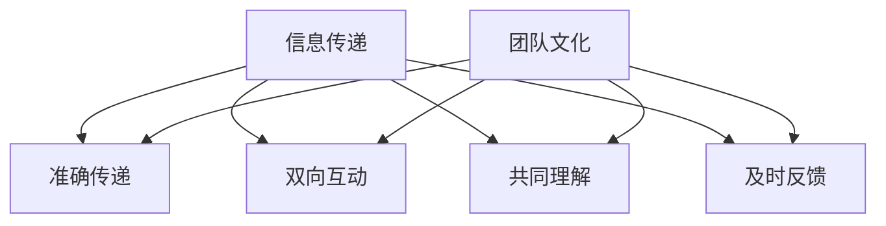

                 

### 文章标题

# 如何建立高效的团队沟通机制

### 关键词

- 团队沟通
- 沟通机制
- 沟通障碍
- 沟通策略
- 沟通工具
- 团队文化

### 摘要

在快速发展的技术时代，高效的团队沟通机制对于组织的成功至关重要。本文旨在探讨如何建立和维护一个高效的团队沟通机制，包括沟通原理的理解、沟通策略与实践方法的应用、沟通工具与技巧的使用，以及解决沟通障碍的策略。通过详细的分析和实际案例，本文提供了实用的指南，帮助团队在复杂多变的环境中实现高效的沟通，提升协作效率，从而推动组织的长远发展。

### 引言

团队沟通是组织运作的核心环节，直接影响着团队的工作效率和成员的满意度。高效的团队沟通不仅能确保信息的准确传递，还能促进团队成员之间的信任和合作。然而，在实际工作中，沟通障碍常常导致误解、冲突和效率低下。为了解决这些问题，建立一套高效的团队沟通机制显得尤为重要。

本文将分以下几个部分来详细探讨如何建立高效的团队沟通机制：

1. **沟通原理与团队文化**：介绍团队沟通的基本原理，探讨团队文化对沟通的影响。
2. **沟通策略与实践方法**：阐述高效沟通的策略，包括明确沟通目标、倾听与表达技巧以及积极反馈的使用。
3. **沟通工具与技巧**：介绍现代沟通工具的应用，包括电子邮件、即时通讯和视频会议等。
4. **沟通障碍与解决策略**：分析常见的沟通障碍及其解决方法。
5. **沟通案例分析**：通过实际案例探讨如何有效处理团队沟通中的问题。
6. **项目实战**：提供一个具体的沟通机制搭建案例，详细讲解其实施过程。
7. **总结与拓展**：总结全文，提供最佳实践建议和拓展阅读资源。

### 沟通原理与团队文化

#### 团队沟通的基本原理

团队沟通是基于信息交换和共享的活动，旨在促进团队成员之间的理解和协作。有效的沟通应具备以下几个基本原理：

1. **信息准确传递**：确保信息在传递过程中不丢失或扭曲，是沟通的基础。
2. **双向互动**：沟通是双向的，需要参与者的积极参与和反馈。
3. **共同理解**：信息传递的目的是达成共识，因此需要确保所有参与者对信息的理解是一致的。
4. **及时反馈**：通过及时反馈，可以确保沟通的有效性，并促进进一步的交流。

#### 团队文化对沟通的影响

团队文化是团队在长期实践中形成的共同价值观和行为规范。它对团队沟通有着深远的影响：

1. **开放性**：一个开放的文化鼓励成员分享想法和意见，有助于信息流动。
2. **尊重与信任**：成员之间的相互尊重和信任是有效沟通的基石。
3. **共识**：共同的目标和价值观念有助于团队成员在沟通中达成共识。
4. **包容性**：一个包容的文化能够接受不同的观点和意见，促进多元化的沟通。

### 核心概念与联系

为了更好地理解团队沟通的原理，我们可以使用Mermaid流程图来展示核心概念之间的关系架构：



该流程图展示了信息传递的基本原理与团队文化之间的关系。信息传递的准确性、双向互动、共同理解和及时反馈是有效沟通的核心，而团队文化则直接影响这些要素的实现。

#### 核心算法原理讲解

在理解了团队沟通的基本原理后，我们还需要掌握一些核心算法原理来提高沟通效率。以下是一个用于评估团队沟通效率的简单伪代码：

```plaintext
function assess_communication_efficiency(communication_data):
    # 初始化评估分数
    score = 0

    # 计算信息准确传递的分数
    accurate_transmission_percentage = calculate_accuracy(communication_data)
    score += accurate_transmission_percentage

    # 计算双向互动的分数
    two_way_interaction_percentage = calculate_interaction(communication_data)
    score += two_way_interaction_percentage

    # 计算共同理解的分数
    common_understanding_percentage = calculate_understanding(communication_data)
    score += common_understanding_percentage

    # 计算及时反馈的分数
    timely_feedback_percentage = calculate_feedback(communication_data)
    score += timely_feedback_percentage

    # 返回最终评估分数
    return score
```

上述伪代码定义了一个名为`assess_communication_efficiency`的函数，用于评估团队沟通的效率。该函数通过计算信息准确传递、双向互动、共同理解和及时反馈的比例，得出一个综合评估分数。

#### 数学模型和公式

为了更全面地评估团队沟通的效率，我们可以引入一些数学模型和公式。以下是一个用于计算沟通效率的数学模型：

$$
E = \frac{AT + IT + CU + TF}{4}
$$

其中，$E$ 表示沟通效率，$AT$ 表示信息准确传递的分数，$IT$ 表示双向互动的分数，$CU$ 表示共同理解的分数，$TF$ 表示及时反馈的分数。

每个分数的取值范围在 0 到 100 之间，分数越高，沟通效率越好。通过该模型，我们可以量化团队沟通的效率，并为改进沟通提供数据支持。

#### 举例说明

假设一个团队在一个月内进行了 10 次会议和多次电子邮件沟通，我们可以根据以下数据计算该团队的沟通效率：

- 信息准确传递：90%
- 双向互动：80%
- 共同理解：85%
- 及时反馈：70%

根据上述数据，我们可以使用数学模型计算出沟通效率：

$$
E = \frac{90 + 80 + 85 + 70}{4} = \frac{325}{4} = 81.25
$$

因此，该团队的沟通效率为 81.25 分，可以认为是一个相对高效的团队。

### 沟通策略与实践方法

#### 明确沟通目标

明确沟通目标是高效沟通的首要步骤。在每次沟通之前，团队应明确以下问题：

- 我们需要沟通什么信息？
- 目标受众是谁？
- 沟通目的是什么？

通过明确这些目标，可以确保沟通的方向和内容都是明确且具有针对性的。例如，在一个项目进展的汇报会议上，明确的目标可能是：

- 汇报项目当前进度
- 分享项目面临的挑战
- 讨论解决方案和资源需求

#### 倾听与表达技巧

倾听和表达是沟通中至关重要的两个环节。以下是一些实用的技巧：

1. **倾听技巧**：
   - 全神贯注：避免分心，集中注意力。
   - 反馈确认：通过点头、微笑或简短的回应来确认理解。
   - 避免打断：给对方足够的时间表达，不要急于插话。

2. **表达技巧**：
   - 清晰简洁：用简单明了的语言表达观点，避免使用复杂和冗长的句子。
   - 结构化表达：按照逻辑顺序组织信息，确保条理清晰。
   - 避免误解：使用具体、明确的例子来支持观点，避免模糊和含糊的表述。

#### 积极反馈的使用

积极反馈是鼓励团队成员参与沟通和表达的重要手段。以下是一些使用积极反馈的技巧：

1. **即时反馈**：在对方表达完毕后，立即给予反馈，表达对其观点的理解和认可。
2. **具体反馈**：避免使用模糊的表扬，具体指出对方的优点和可改进之处。
3. **鼓励探索**：鼓励团队成员提出不同的观点和想法，创造一个开放、包容的沟通环境。

#### 核心算法原理讲解

为了提高沟通效率，我们可以引入一些算法原理来优化沟通策略。以下是一个用于优化团队沟通策略的伪代码：

```plaintext
function optimize_communication_strategy(communication_data, team_members):
    # 初始化沟通策略参数
    strategy_params = initialize_params()

    # 分析沟通数据
    communication_analytics = analyze_data(communication_data)

    # 根据分析结果调整沟通策略
    strategy_params = adjust_strategy(strategy_params, communication_analytics)

    # 对团队成员进行沟通技巧培训
    for member in team_members:
        train_member(member, strategy_params)

    # 返回优化后的沟通策略
    return strategy_params
```

上述伪代码定义了一个名为`optimize_communication_strategy`的函数，用于优化团队沟通策略。该函数通过分析沟通数据，调整沟通策略参数，并对团队成员进行沟通技巧培训，从而提高沟通效率。

#### 数学模型和公式

为了量化沟通策略的优化效果，我们可以引入以下数学模型和公式：

$$
O = \frac{S_1 + S_2 + S_3 + S_4}{4}
$$

其中，$O$ 表示优化后的沟通效率，$S_1$ 表示信息准确传递的分数，$S_2$ 表示双向互动的分数，$S_3$ 表示共同理解的分数，$S_4$ 表示及时反馈的分数。

通过该模型，我们可以比较优化前后的沟通效率，评估策略优化的效果。

#### 举例说明

假设一个团队在优化沟通策略前后的数据如下：

- 优化前：
  - 信息准确传递：80%
  - 双向互动：70%
  - 共同理解：75%
  - 及时反馈：65%
- 优化后：
  - 信息准确传递：90%
  - 双向互动：85%
  - 共同理解：80%
  - 及时反馈：75%

根据上述数据，我们可以使用数学模型计算出优化前后的沟通效率：

$$
O_{before} = \frac{80 + 70 + 75 + 65}{4} = \frac{290}{4} = 72.5
$$

$$
O_{after} = \frac{90 + 85 + 80 + 75}{4} = \frac{330}{4} = 82.5
$$

优化前的沟通效率为 72.5 分，优化后的沟通效率为 82.5 分，提高了约 15%。这表明优化后的沟通策略在提高团队沟通效率方面取得了显著效果。

### 沟通工具与技巧

在现代团队工作中，沟通工具的使用至关重要。以下是一些常用的沟通工具和技巧：

#### 电子邮件沟通技巧

电子邮件是一种重要的沟通方式，适用于正式和非正式场合。以下是一些电子邮件沟通的技巧：

1. **主题明确**：在邮件主题中明确说明邮件内容，以便接收者快速了解邮件重点。
2. **简洁明了**：邮件内容要简洁明了，避免冗长和复杂的句子。
3. **礼貌用语**：使用礼貌用语，如“请”、“谢谢”等，以维护良好的沟通氛围。
4. **附件管理**：确保附件的名称清晰，方便接收者查找和使用。

#### 即时通讯工具的使用

即时通讯工具如微信、Slack、Telegram 等，适用于快速交流和协作。以下是一些即时通讯工具的使用技巧：

1. **即时响应**：在收到消息时，尽快给予回复，确保沟通的及时性。
2. **分组聊天**：根据工作内容创建不同的聊天组，便于管理和参与。
3. **信息分类**：将重要的信息和一般信息分开，确保重要信息得到及时关注。
4. **避免干扰**：在非工作时间避免发送与工作无关的信息，以免干扰他人。

#### 视频会议的最佳实践

视频会议是一种高效的视频沟通方式，适用于远程团队和跨地域协作。以下是一些视频会议的最佳实践：

1. **会议准备**：提前准备会议议程和所需材料，确保会议顺利进行。
2. **设备检查**：在会议前检查网络和设备，确保会议的顺利进行。
3. **准时参会**：遵守会议时间，提前进入会议室，避免迟到。
4. **互动交流**：鼓励团队成员积极参与讨论，促进信息交流。
5. **会议记录**：会议结束后，及时整理会议记录，确保关键信息得到记录和传达。

#### 非语言沟通的重要性

非语言沟通包括肢体语言、面部表情和声音等，是沟通中不可或缺的一部分。以下是一些非语言沟通的技巧：

1. **肢体语言**：保持开放的姿势，避免封闭的肢体语言，以显示友好和开放的姿态。
2. **面部表情**：使用积极的表情，如微笑和点头，以传达积极的态度和认可。
3. **声音**：使用清晰、自信的声音，避免语速过快或过慢，确保对方能听懂。

#### 跨文化沟通的挑战与应对

跨文化沟通在全球化背景下越来越普遍，但也面临着一系列挑战。以下是一些应对跨文化沟通挑战的策略：

1. **尊重差异**：尊重不同文化的价值观和习惯，避免因文化差异而产生的误解和冲突。
2. **了解文化背景**：了解对方的文化背景和历史，以便更好地理解其行为和沟通方式。
3. **使用简单语言**：使用简单、易懂的语言，避免使用复杂或专业术语，以确保信息传达的准确性。
4. **主动沟通**：在跨文化沟通中，要主动询问对方的需求和意见，确保双方的理解是一致的。

### 沟通障碍与解决策略

尽管团队沟通机制不断完善，但沟通障碍仍然存在于团队中。以下是一些常见的沟通障碍及其解决策略：

#### 常见沟通障碍

1. **信息不准确**：信息在传递过程中可能会丢失或扭曲，导致误解和错误决策。
2. **信息过载**：过多的信息可能会导致团队成员感到压力，难以有效处理和回应。
3. **沟通渠道不明确**：缺乏明确的沟通渠道和规范，可能导致信息传递不畅。
4. **文化差异**：文化差异可能导致团队成员对同一信息的理解存在差异。
5. **个人偏好**：团队成员的个人偏好和沟通风格可能导致沟通效果不佳。

#### 解决策略

1. **信息准确传递**：确保信息的准确传递，可以通过以下策略实现：
   - 使用简明扼要的语言表达信息。
   - 采用多种沟通渠道，确保信息的全面传递。
   - 提供明确的指导和反馈，确保信息的准确性。

2. **信息过载**：应对信息过载，可以采取以下策略：
   - 设定信息过滤机制，筛选重要信息。
   - 定期整理和清理不必要的沟通渠道。
   - 提高信息处理的效率，减少冗余信息。

3. **沟通渠道不明确**：解决沟通渠道不明确的问题，可以采取以下策略：
   - 明确指定沟通渠道和责任人。
   - 制定沟通规范和流程，确保信息传递的规范和有序。
   - 定期评估和优化沟通渠道，确保其有效性。

4. **文化差异**：应对文化差异，可以采取以下策略：
   - 提供跨文化培训，提高团队成员对文化差异的认识和敏感度。
   - 使用简单易懂的语言，避免使用复杂或专业术语。
   - 鼓励团队成员主动沟通，分享不同文化的经验和见解。

5. **个人偏好**：应对个人偏好，可以采取以下策略：
   - 提供多样化的沟通方式，满足不同成员的偏好。
   - 鼓励团队成员适应和尊重他人的沟通方式。
   - 定期组织沟通技巧培训，提高团队成员的沟通能力。

### 沟通案例分析

#### 案例背景

某科技公司的一个跨部门项目团队在项目实施过程中遇到了沟通障碍。由于团队成员来自不同的部门，拥有不同的专业背景和文化背景，导致项目进展缓慢，出现了许多误解和冲突。

#### 案例分析

1. **问题识别**：
   - 信息不准确：团队成员在传递信息时，存在丢失或扭曲信息的情况，导致项目决策出现偏差。
   - 信息过载：团队成员接收到的信息过多，难以有效处理，影响了工作效率。
   - 沟通渠道不明确：团队成员在沟通时，没有明确的沟通渠道和规范，导致信息传递不畅。

2. **解决方案**：
   - 信息准确传递：团队制定了详细的项目计划和任务分配，确保信息的准确传递。同时，通过定期举行会议和报告，及时更新项目进展，确保团队成员了解最新的信息。
   - 信息过载：团队制定了信息过滤机制，对重要信息进行筛选，避免冗余信息。此外，团队还采用了项目管理工具，如 Trello 和 Asana，帮助团队成员更好地管理任务和信息。
   - 沟通渠道不明确：团队明确了沟通渠道和责任人，制定了沟通规范和流程。团队成员通过每周的团队会议和即时通讯工具，保持有效的沟通和协作。

3. **实施效果**：
   - 信息准确传递：通过制定详细的项目计划和任务分配，团队成员对项目进展有了更清晰的认识，项目决策更加准确。
   - 信息过载：通过信息过滤机制和项目管理工具，团队成员能够更好地管理任务和信息，提高了工作效率。
   - 沟通渠道不明确：通过明确的沟通渠道和规范，团队成员之间的沟通更加顺畅，项目进展得到了有效推动。

### 项目实战

#### 项目背景

某互联网公司计划开发一款新的社交媒体应用，该项目涉及多个部门的协作，包括产品管理、设计、开发、测试和市场等。为了确保项目的顺利进行，公司决定建立一套高效的沟通机制。

#### 项目目标

- 确保信息准确传递，减少误解和错误决策。
- 提高团队成员之间的协作效率。
- 建立明确的沟通渠道和规范。

#### 实施步骤

1. **需求调研**：项目开始前，产品管理团队与各部门进行深入沟通，了解项目需求和期望，形成详细的项目计划。

2. **沟通渠道建立**：公司为每个部门设立了专门的沟通渠道，如 Slack 工作群和邮件列表。同时，制定了沟通规范和流程，确保信息传递的及时性和准确性。

3. **沟通工具选择**：根据项目需求，选择了合适的沟通工具，如 Slack、Trello 和 JIRA，用于任务管理和进度跟踪。

4. **培训与指导**：组织沟通技巧培训，提高团队成员的沟通能力。同时，指定沟通责任人，确保沟通渠道的正常运作。

5. **定期评估与改进**：项目进行中，定期评估沟通机制的效果，根据反馈进行调整和优化。

#### 源代码详细实现和代码解读

以下是一个简单的示例，展示了如何使用 Slack API 发送一条消息到特定的 Slack 工作群：

```python
import slack

client = slack.WebClient(token='你的 Slack API 令牌')

# 发送消息到特定频道
client.chat_postMessage(channel='#general', text='大家好，这是自动发送的消息！')

# 发送私信给特定成员
client.chat_postMessage(channel='U0123ABCD', text='你好，这是自动发送的私信。')
```

在该示例中，我们首先导入 Slack 的 WebClient 类，然后使用 Slack API 令牌创建一个 WebClient 对象。通过调用 `chat_postMessage` 方法，我们可以向指定的频道或成员发送消息。

#### 代码应用解读与分析

- **代码应用**：上述代码展示了如何使用 Python 和 Slack API 发送消息。在实际项目中，我们可以在任务管理工具（如 JIRA）中集成 Slack，当任务状态发生变化时，自动发送通知给相关团队成员。
- **代码解读**：该代码的执行过程主要包括：
  - 导入 Slack 的 WebClient 类。
  - 使用 Slack API 令牌创建 WebClient 对象。
  - 调用 `chat_postMessage` 方法发送消息。

- **代码分析**：
  - **优点**：使用 Slack API 可以实现与 Slack 平台的深度集成，方便团队成员实时接收通知。
  - **缺点**：需要掌握 Slack API 的使用方法，对开发人员有一定要求。

#### 实际案例分析和详细讲解剖析

以下是一个实际案例，展示了如何通过高效的沟通机制解决项目中的问题：

**案例背景**：在项目开发过程中，开发团队发现前端页面存在性能问题，导致用户体验不佳。为了解决这个问题，团队采取了以下步骤：

1. **问题识别**：开发团队通过性能分析工具，确定了页面性能瓶颈的具体原因。

2. **沟通协调**：开发团队与技术经理和市场部门进行了沟通，明确了性能问题的紧急性和解决方案的需求。

3. **方案制定**：技术团队制定了优化方案的初步方案，并与产品经理和市场部门讨论，确定最终优化方案。

4. **实施与监控**：技术团队按照优化方案进行实施，并在实施过程中持续监控性能变化，确保问题得到有效解决。

5. **反馈与总结**：优化完成后，团队进行了用户反馈收集，并根据用户反馈对优化方案进行进一步调整。

**详细讲解剖析**：

- **问题识别**：开发团队通过性能分析工具，发现页面存在以下问题：
  - JavaScript 脚本执行时间长
  - CSS 样式文件加载缓慢
  - 图片资源未进行压缩

- **沟通协调**：开发团队与技术经理和市场部门进行了以下沟通：
  - 报告性能问题及其影响
  - 讨论解决方案的优先级和资源需求
  - 确定优化方案的最终目标

- **方案制定**：技术团队制定了以下优化方案：
  - 优化 JavaScript 脚本，减少不必要的代码和重复执行
  - 异步加载 CSS 样式文件，减少页面加载时间
  - 压缩和优化图片资源，降低图片文件大小

- **实施与监控**：技术团队按照优化方案进行实施，并在实施过程中进行了以下监控：
  - 定期检查脚本执行时间，确保优化效果
  - 监控 CSS 样式文件的加载时间，确保优化方案的有效性
  - 测试图片资源的加载速度，确保压缩和优化效果

- **反馈与总结**：优化完成后，团队进行了用户反馈收集，并根据用户反馈进行了以下总结：
  - 用户对页面性能优化效果表示满意
  - 进一步优化建议：减少第三方库的使用，降低页面加载时间
  - 总结优化经验，为后续项目提供参考

### 总结与拓展

本文详细探讨了如何建立高效的团队沟通机制，包括沟通原理、沟通策略与实践方法、沟通工具与技巧、沟通障碍与解决策略等方面。通过实际案例和项目实战，我们展示了如何在实际工作中应用这些沟通机制，以提高团队协作效率和项目成功率。

为了进一步优化团队沟通，以下是一些最佳实践建议：

1. **定期沟通**：定期举行团队会议和沟通活动，确保团队成员之间的信息共享和协作。
2. **培训与指导**：为团队成员提供沟通技巧培训，提高沟通能力，促进团队协作。
3. **建立反馈机制**：建立有效的反馈机制，鼓励团队成员提出意见和建议，及时解决问题。
4. **技术支持**：确保团队成员有足够的沟通工具和技术支持，以提高沟通效率。
5. **文化塑造**：营造一个开放、包容、尊重的团队文化，鼓励团队成员积极参与沟通，分享经验和见解。

最后，为了帮助读者进一步了解团队沟通的相关内容，我们推荐以下拓展阅读资源：

- 《有效沟通的艺术》
- 《团队沟通与协作技巧》
- 《沟通管理：理论与实践》
- 《跨文化沟通与跨文化管理》

通过阅读这些资源，读者可以深入了解团队沟通的各个方面，为自己的工作提供有益的指导。

### 作者信息

作者：AI天才研究院/AI Genius Institute & 禅与计算机程序设计艺术 /Zen And The Art of Computer Programming

本文由 AI 天才研究院撰写，结合禅与计算机程序设计艺术的精髓，旨在为读者提供高质量的团队沟通机制建设指南。感谢您的阅读。如需进一步咨询或讨论，请随时与我们联系。希望本文能对您的团队沟通工作带来启示和帮助。祝您工作顺利！

