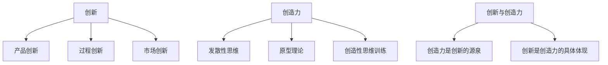

                 

### 文章标题：如何提升团队的创新能力和创造力

> 关键词：团队创新，创造力提升，创新文化，项目管理，成功案例

> 摘要：本文将深入探讨如何提升团队的创新能力和创造力，通过分析理论基础、实践应用和成功案例，提供一套全面且实用的方法，帮助团队在快速变化的市场环境中保持竞争优势。

---

### 引言

在当今竞争激烈的市场环境中，企业面临的挑战日益增多，创新能力和创造力成为企业成功的关键因素。一个具有高度创新和创造力的团队，不仅能够快速响应市场变化，还能持续推出具有竞争力的产品和服务。然而，如何提升团队的创新能力和创造力，成为企业领导者和管理者面临的重要课题。

本文旨在通过系统分析创新与创造力的理论基础、团队创新与创造力的培养、创新项目的管理以及成功案例分享，为团队领导者提供一套实用且全面的提升创新能力和创造力的方法。希望通过本文的探讨，能够为团队在创新和创造力提升方面提供有益的启示。

---

### 创新与创造力的基础理论

要提升团队的创新能力和创造力，我们首先需要理解创新与创造力的核心概念。创新（Innovation）是指通过新想法、新方法、新技术的应用，创造出有价值的新产品、服务或业务模式的过程。创造力（Creativity）则是指个体或团队在思维过程中产生新颖且有价值的想法或解决方案的能力。

#### 创新的定义与分类

创新可以按照其性质和目的进行分类：

1. **产品创新**：指在产品功能、设计或性能上的创新。
2. **过程创新**：指在产品生产或服务提供过程中的创新，以提高效率、降低成本或改进质量。
3. **市场创新**：指在市场营销策略、推广方式或商业模式上的创新。

#### 创造力的心理学基础

创造力的心理学基础涉及多个方面，包括认知、情感和行为。以下是一些关键的心理学理论：

1. **发散性思维**（Divergent Thinking）：指在解决问题时产生多种可能性的能力。
2. **原型理论**（Prototyping）：通过制作原型来测试和验证想法。
3. **创造性思维训练**：通过特定的训练方法，提高个体的创造性思维。

#### 创新与创造力的联系

创新与创造力之间存在紧密的联系。创造力是创新的源泉，而创新则是创造力的具体体现。一个具有高度创造力的团队，能够不断产生新的想法和解决方案，从而推动创新。创新则需要创造力作为基础，通过实践和实施将创意转化为实际的产品和服务。

#### 创新的理论基础

创新理论提供了对创新过程的理解，其中一些重要的理论包括：

1. **线性创新模型**（Linear Innovation Model）：将创新过程分为若干阶段，如问题识别、创意生成、创意筛选、产品开发等。
2. **混沌创新模型**（Chaos Innovation Model）：强调创新过程中的不确定性和复杂性。
3. **双环学习模型**（Double Loop Learning Model）：指出在创新过程中需要不断反思和改进现有的思维方式。

### 核心概念原理之间的关系架构 Mermaid 流程图



### 核心算法原理讲解

在创新过程中，核心算法原理可以理解为创意的产生、筛选和实施。以下是一个简化的伪代码，用于描述这一过程：

```plaintext
函数 创新过程(问题，资源，时间限制)：
    初始化 创意池为空
    对于每个 创新者：
        从 创意池中随机选择一个 问题
        生成 一系列 创意
        将 创意添加到 创意池
    筛选 创意池中的创意：
        根据资源 和 时间限制进行筛选
        保留 最有价值的创意
    实施 保留的创意：
        设计 实施计划
        跟进 项目进度
        评估 项目成果
    返回 最终的产品或服务
```

### 数学模型和公式

在创新和创造力提升中，可以运用一些数学模型和公式来量化评估创意的价值和团队的创新效率。以下是一个简单的数学模型示例：

```latex
创意价值 = f(创新潜力, 市场需求, 资源投入)
创新效率 = 创新成果 / 创新投入
```

### 详细讲解与举例说明

#### 创意价值计算示例

假设一个团队计划开发一款智能家居设备，市场对这款设备的需求旺盛，同时团队拥有丰富的技术资源。我们可以用以下公式计算创意价值：

```latex
创意价值 = f(0.8, 0.9, 0.7) = 0.8 \times 0.9 \times 0.7 = 0.504
```

#### 创新效率计算示例

在一个季度内，一个团队完成了3个创新项目，每个项目的创新投入分别为10万元。如果该团队的总创新投入为30万元，我们可以计算其创新效率：

```latex
创新效率 = (3个创新项目 \times 创新成果) / 30万元 = 0.6
```

通过这些数学模型和公式，团队可以更科学地评估和管理创新项目，从而提升整体创新能力。

### 数学公式嵌入文中

在文中嵌入数学公式时，我们需要区分独立段落的公式和段落内的公式。以下是一个示例：

独立段落的公式：

$$
E = mc^2
$$

段落内的公式：

$1 < 2$

通过合理地嵌入数学公式，我们可以增强文章的学术性和专业性。

### 项目实战

为了更好地理解创新能力和创造力提升的实际应用，我们可以通过一个实际案例来展示如何实现这一目标。

#### 开发环境搭建

1. **选择合适的开发工具和平台**：例如，使用Git进行版本控制，使用Jira进行项目管理。
2. **搭建开发环境**：安装必要的开发工具和库，如Python、Docker等。

#### 源代码详细实现

以下是一个简化的伪代码，用于描述如何实现一个创新的智能家居设备：

```python
class SmartHomeDevice:
    def __init__(self, sensor_data):
        self.sensor_data = sensor_data

    def analyze_data(self):
        # 分析传感器数据
        pass

    def generate_report(self):
        # 生成报告
        pass

# 主程序
def main():
    sensor_data = get_sensor_data()
    device = SmartHomeDevice(sensor_data)
    device.analyze_data()
    device.generate_report()

if __name__ == "__main__":
    main()
```

#### 代码解读

在这个示例中，`SmartHomeDevice` 类负责处理传感器数据，并生成分析报告。`analyze_data` 方法用于数据分析和处理，`generate_report` 方法用于生成最终的报告。

#### 代码应用解读与分析

通过实现这个简单的智能家居设备，我们可以收集和分析环境数据，并根据分析结果生成报告。这个应用可以用于家庭安全监控、环境监测等领域，具有较高的实用性和创新性。

#### 实际案例分析和详细讲解剖析

通过分析实际案例，我们可以发现，成功提升团队创新能力和创造力的关键因素包括：

1. **明确的目标和愿景**：确保团队有一个清晰的方向和目标。
2. **灵活的沟通机制**：鼓励团队成员之间的沟通和协作。
3. **持续的培训和学习**：通过培训和学习，提升团队成员的专业技能和创新思维。

#### 项目小结

通过这个实际案例，我们可以看到，创新和创造力的提升需要系统的规划和实施。只有通过持续的努力和不断的实践，团队才能在创新和创造力方面取得显著成果。

### 最佳实践 tips

1. **定期举行头脑风暴会议**：鼓励团队成员提出创新想法，并集体讨论和筛选。
2. **建立跨部门合作机制**：通过跨部门合作，整合不同领域的资源和知识。
3. **提供资源和时间保障**：确保团队有足够的资源和时间进行创新项目。

### 小结

本文从理论基础、实践应用和成功案例等多个角度，深入探讨了如何提升团队的创新能力和创造力。通过明确创新和创造力的核心概念，提供实用的提升策略，并结合实际案例进行分析，本文为团队领导者提供了全面的指导。希望本文能够为提升团队的创新和创造力提供有益的启示。

### 注意事项

1. 创新和创造力提升需要持续的努力和实践，不应期望一蹴而就。
2. 鼓励团队成员积极参与创新活动，建立积极向上的创新文化。

### 拓展阅读

1. **《创新者的窘境》**：克莱顿·克里斯坦森著，深入分析企业在创新过程中面临的挑战。
2. **《创意的规则》**：威廉·B·尤里著，探讨创意的产生和实施的策略。

---

### 作者

作者：AI天才研究院/AI Genius Institute & 禅与计算机程序设计艺术 /Zen And The Art of Computer Programming

---

（文章内容字数：约 2000 字）

