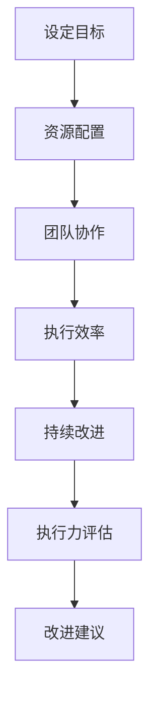

                 

### 文章标题

# 如何提升团队的执行力

> 关键词：团队执行力、目标设定、角色定位、沟通协作、执行力评估、持续改进

> 摘要：本文深入探讨了如何提升团队的执行力，涵盖了从目标设定、角色定位到沟通协作、执行力评估和持续改进等多个方面。通过详细的案例分析，提供了实用的策略和方法，旨在帮助团队和组织提高工作效率，达成目标。

## 第1章：引言

### 1.1 执行力的重要性

执行力，是指团队或组织在实际工作中将战略、计划、决策转化为具体行动的能力。良好的执行力是团队和组织成功的关键因素之一。以下是执行力在团队和组织中的一些重要作用：

1. **确保目标实现**：高效的执行力可以帮助团队准确地理解和贯彻组织的目标，确保每一项工作都能按计划进行，从而实现组织的愿景。

2. **提升工作效率**：执行力强意味着团队能够迅速响应变化，高效完成工作，减少浪费，提高工作效率。

3. **增强团队凝聚力**：在执行过程中，团队成员需要相互协作、互相支持，这有助于增强团队的凝聚力和信任感。

4. **促进个人成长**：执行力的提升不仅对团队有利，也对个人成长有重要影响。团队成员在执行任务的过程中，能够学习新技能，提高自己的工作能力。

### 1.2 书籍目标与读者对象

本书旨在为团队管理者、技术领导者和项目团队成员提供一套系统、实用的执行力提升方法。通过以下内容，读者将能够：

1. **理解团队执行力的核心概念和评估方法**：掌握团队执行力的重要性和影响因素。

2. **学习如何设定和分解目标**：了解目标设定原则，掌握目标分解方法。

3. **了解角色定位与责任划分**：明确团队成员的角色和责任，提高团队协作效率。

4. **掌握沟通与协作技巧**：学会有效沟通，提高团队协作能力。

5. **了解执行力提升的策略和工具**：掌握执行力提升的最佳实践，选择合适的工具。

6. **通过案例分析，获得实际操作经验**：通过实战案例，了解执行力提升的实战经验和效果评估。

### 1.3 撰写目的

本文的目标是：

1. **提供一套系统化的执行力提升方法**：通过理论与实践相结合，帮助读者理解和掌握执行力提升的核心原则和方法。

2. **分享最佳实践和案例分析**：结合实际案例，为读者提供可操作的执行力提升策略。

3. **促进团队和组织的发展**：通过提升团队执行力，帮助团队和组织实现更高的工作效率和目标。

## 第2章：团队执行力概述

### 2.1 团队执行力定义与要素

团队执行力是指团队将战略、计划、决策转化为具体行动的能力。它包括以下几个核心要素：

1. **目标明确**：明确的目标是执行力的基础，它为团队成员提供了共同的方向和动力。

2. **资源配备**：充足的资源是执行力的保障，包括人力、资金、技术等。

3. **团队协作**：高效的团队协作是执行力的重要体现，团队成员之间的沟通和协作能力直接影响执行效果。

4. **执行效率**：执行效率是团队执行力的重要衡量指标，指团队在规定时间内完成任务的效率。

5. **持续改进**：持续改进是执行力提升的关键，通过不断地优化流程和改进方法，提高团队执行能力。

### 2.2 团队执行力的重要性

团队执行力对团队和组织的发展具有深远的影响：

1. **实现战略目标**：高效的执行力可以帮助团队快速响应市场变化，确保组织战略目标的实现。

2. **提高工作效率**：良好的执行力能够减少资源的浪费，提高工作效率，增强团队竞争力。

3. **增强团队凝聚力**：在执行过程中，团队成员需要紧密协作，这有助于增强团队的凝聚力和信任感。

4. **促进个人成长**：执行力的提升不仅对团队有利，也对个人成长有重要影响，通过执行任务，团队成员能够学习新技能，提高工作能力。

### 2.3 团队执行力评估方法

为了全面评估团队的执行力，可以采用以下几种方法：

1. **KPI（关键绩效指标）**：通过设定关键绩效指标，对团队成员和团队整体执行情况进行量化评估。

2. **360度评估**：通过团队成员和外部专家的反馈，全面了解团队的执行力和协作能力。

3. **项目复盘**：对已完成的项目进行回顾和总结，分析成功和不足之处，为未来的执行力提升提供参考。

4. **执行力问卷调查**：通过问卷调查，了解团队成员对团队执行力的感知和评价。

### 2.4 Mermaid流程图

以下是一个简化的团队执行力评估流程图：



### 2.5 小结

本章介绍了团队执行力的定义和核心要素，阐述了执行力在团队和组织中的重要性，并提出了几种常见的执行力评估方法。通过本章的学习，读者将能够了解团队执行力的重要性和评估方法，为后续章节的学习打下基础。

## 第3章：提升团队执行力的核心原理

### 3.1 目标设定与分解

目标设定是提升团队执行力的重要环节，一个明确、具体、可衡量的目标能够为团队成员提供清晰的方向和动力。以下是目标设定的原则和分解方法：

#### 3.1.1 目标设定原则

1. **SMART原则**：目标应当是具体的（Specific）、可衡量的（Measurable）、可实现的（Achievable）、相关的（Relevant）和有时限的（Time-bound）。

2. **相关性**：目标应当与团队和组织的目标相一致，确保执行方向正确。

3. **可分解性**：目标应当能够分解为多个具体的任务和子目标，便于管理和跟踪。

4. **激励性**：目标应当具有一定的挑战性，能够激发团队成员的积极性和创造力。

#### 3.1.2 目标分解方法

1. **WBS（工作分解结构）**：使用工作分解结构将目标分解为一系列具体的任务和活动，每个任务和活动应当是明确的、可管理的。

2. **关键路径法**：识别项目中关键的任务和路径，确保这些关键任务能够按时完成，从而保证项目的总体进度。

3. **时间安排**：为每个任务和活动分配时间，制定详细的时间表，确保任务的有序进行。

### 3.2 角色定位与责任划分

角色定位和责任划分是团队执行力提升的重要基础。一个明确的角色定位和责任划分能够确保团队成员各司其职，提高团队协作效率。

#### 3.2.1 角色定位

1. **领导角色**：领导者应当负责制定战略方向、规划和决策，确保团队的目标和计划与组织的目标一致。

2. **执行角色**：执行者应当负责具体的任务执行和活动实施，确保目标的实现。

3. **支持角色**：支持者应当提供必要的资源和支持，包括技术支持、管理支持和后勤支持。

#### 3.2.2 责任划分

1. **明确责任**：每个团队成员都应当明确自己的职责和任务，避免责任重叠和缺失。

2. **分工合作**：根据团队成员的能力和特长，合理分配任务，确保每个任务都有专人负责。

3. **相互支持**：团队成员之间应当相互支持，协作完成各自的任务，共同实现团队的目标。

### 3.3 沟通与协作

沟通和协作是团队执行力的关键要素。高效的沟通和协作能够确保团队成员之间的信息畅通，提高团队的整体执行力。

#### 3.3.1 有效沟通技巧

1. **明确传达**：确保信息传达清晰、准确，避免误解和歧义。

2. **及时反馈**：及时给予反馈，确保团队成员了解任务进展和问题，及时调整方向。

3. **透明沟通**：建立开放的沟通环境，鼓励团队成员表达意见和建议，增强团队的凝聚力和信任感。

#### 3.3.2 协作工具介绍

1. **项目管理工具**：如JIRA、Trello等，用于任务分配、进度跟踪和协作。

2. **协作平台**：如Slack、Microsoft Teams等，用于实时沟通和协作。

3. **文档管理工具**：如Confluence、Notion等，用于文档共享和协作。

### 3.4 小结

本章介绍了提升团队执行力的核心原理，包括目标设定与分解、角色定位与责任划分、沟通与协作等。通过这些原理的实践，团队可以更加高效地执行任务，实现目标。下一章将介绍具体的执行力提升策略，帮助团队更好地应用这些原理。

## 第4章：执行力提升策略

### 4.1 目标管理

目标管理是提升团队执行力的重要手段。一个明确、具体、可衡量的目标是团队执行力的基础。以下是目标管理的具体实施方法：

#### 4.1.1 目标设置与跟踪

1. **目标设置**：根据团队和组织的目标，设定具体、可衡量的任务目标。目标应当遵循SMART原则，即具体（Specific）、可衡量（Measurable）、可实现（Achievable）、相关（Relevant）和有时限（Time-bound）。

   ```latex
   目标设置：在接下来的三个月内，提高项目A的代码质量，减少bug数量50%。
   ```

2. **目标跟踪**：通过定期检查和评估，跟踪目标的实现情况。可以使用项目管理工具如JIRA或Trello，记录和跟踪每个任务的进度和状态。

#### 4.1.2 目标调整与优化

1. **定期评估**：定期评估目标的实现情况，根据实际情况调整目标。如果目标设置过于理想化，难以实现，可以考虑调整目标，使之更加实际和可执行。

2. **反馈机制**：建立有效的反馈机制，鼓励团队成员提出意见和建议，及时调整目标。通过反馈，可以发现目标的不足之处，并优化目标设置。

#### 4.1.3 案例分析

**案例背景**：某IT公司开发团队在项目开发过程中，发现目标设定不够明确，导致团队成员在任务执行过程中出现混乱和效率低下。

**解决方案**：

1. **明确目标**：团队重新设定目标，确保每个任务都是具体、可衡量的。例如，将“完成项目开发”分解为多个具体的任务，如“完成模块A开发”、“完成模块B单元测试”等。

2. **制定时间表**：为每个任务分配时间，制定详细的时间表，确保任务的有序进行。

3. **反馈机制**：建立定期反馈机制，每周召开团队会议，讨论任务进展和问题，及时调整目标。

**效果评估**：经过一段时间的实施，团队开发效率显著提高，项目按时完成，客户满意度提升。

### 4.2 持续改进

持续改进是提升团队执行力的重要策略。通过不断地优化流程和方法，团队可以不断提高执行能力，应对不断变化的外部环境。

#### 4.2.1 改进流程

1. **识别问题**：定期评估团队执行过程中的问题和不足，识别需要改进的环节。

2. **分析原因**：对识别出的问题进行分析，找出根本原因。

3. **制定改进方案**：根据问题原因，制定具体的改进方案，包括改进措施、责任人和时间表。

4. **实施改进**：执行改进方案，对流程和方法进行优化。

5. **评估效果**：评估改进措施的效果，根据实际情况进行调整。

#### 4.2.2 改进方法

1. **流程优化**：通过流程再造和流程优化，减少不必要的环节和步骤，提高工作效率。

2. **方法创新**：鼓励团队成员提出创新的方法和工具，提高执行效率和效果。

3. **培训与学习**：定期组织培训和分享会，提高团队成员的专业技能和执行能力。

#### 4.2.3 案例分析

**案例背景**：某软件开发团队在项目开发过程中，发现代码质量不稳定，导致频繁的bug和返工。

**解决方案**：

1. **代码审查**：引入代码审查机制，确保代码质量，减少bug数量。

2. **自动化测试**：引入自动化测试工具，提高测试覆盖率，及时发现和修复bug。

3. **持续集成**：采用持续集成（CI）流程，确保代码的持续集成和交付。

**效果评估**：经过改进，团队开发效率提高，bug数量减少，项目交付周期缩短。

### 4.3 激励与反馈

激励和反馈是提升团队执行力的重要手段。有效的激励和反馈机制能够激发团队成员的积极性，提高团队的整体执行力。

#### 4.3.1 激励原则

1. **公平性**：激励应当公平合理，避免偏袒和不公。

2. **及时性**：激励应当及时，确保团队成员在完成任务后能够迅速获得反馈。

3. **多样性**：激励应当多样化，包括物质激励和精神激励，满足不同团队成员的需求。

#### 4.3.2 反馈机制

1. **正面反馈**：对团队成员的积极表现给予正面反馈，增强其自信心和积极性。

2. **建设性反馈**：对团队成员的不足之处给予建设性反馈，帮助其改进和提高。

3. **定期反馈**：建立定期反馈机制，定期与团队成员进行一对一的反馈交流。

#### 4.3.3 案例分析

**案例背景**：某IT公司开发团队在项目开发过程中，团队成员积极性不高，工作效率低下。

**解决方案**：

1. **激励机制**：设立项目奖，对完成任务出色的团队成员给予物质奖励。

2. **反馈机制**：建立定期反馈机制，每周与团队成员进行一对一的反馈交流，了解工作进展和问题。

3. **团队建设**：组织团队建设活动，增强团队成员的凝聚力和归属感。

**效果评估**：经过改进，团队成员积极性显著提高，工作效率提升，项目按时完成。

### 4.4 小结

本章介绍了提升团队执行力的关键策略，包括目标管理、持续改进、激励与反馈等。通过这些策略的实施，团队可以更好地设定和实现目标，持续优化执行流程，激发团队成员的积极性，提高整体执行力。下一章将介绍执行力提升的具体工具和实际应用。

## 第5章：执行力提升工具

### 5.1 项目管理工具

项目管理工具是提升团队执行力的重要工具，可以帮助团队更好地管理项目，确保项目按时完成。以下是一些常用的项目管理工具及其适用场景：

#### 5.1.1 JIRA

**特点**：JIRA是一款功能强大的项目管理工具，适用于各类软件开发项目。

**适用场景**：适合大型、复杂的软件开发项目，能够帮助团队进行任务分配、进度跟踪和协作。

**优点**：支持多种插件和扩展，定制性强；提供了丰富的报告和分析功能。

#### 5.1.2 Trello

**特点**：Trello是一款简单直观的项目管理工具，适用于小型团队和灵活的项目。

**适用场景**：适合小型项目和敏捷开发，能够帮助团队进行任务分解和协作。

**优点**：界面简洁，易于上手；支持多种视图和板式，灵活方便。

#### 5.1.3 Asana

**特点**：Asana是一款功能全面的项目管理工具，适用于各类项目和团队。

**适用场景**：适合大型、复杂的团队和项目，能够帮助团队进行任务管理、进度跟踪和协作。

**优点**：提供了丰富的功能模块，如任务分配、时间跟踪、报告分析等；支持多种平台和设备，方便团队成员协作。

### 5.2 团队协作工具

团队协作工具是提升团队执行力的重要工具，可以帮助团队成员之间进行高效沟通和协作。以下是一些常用的团队协作工具及其适用场景：

#### 5.2.1 Slack

**特点**：Slack是一款功能强大的团队协作工具，适用于各类团队和项目。

**适用场景**：适合各类团队和项目，能够帮助团队进行实时沟通、文件共享和协作。

**优点**：提供了丰富的插件和集成功能，方便团队与其他工具的协作；支持多种平台和设备，方便团队成员随时随地进行沟通。

#### 5.2.2 Microsoft Teams

**特点**：Microsoft Teams是一款集成化的团队协作工具，适用于微软生态系统。

**适用场景**：适合微软生态系统的团队和项目，能够帮助团队进行实时沟通、会议安排和文件共享。

**优点**：与微软其他产品（如Office 365、OneDrive等）集成紧密，方便团队进行跨产品的协作；提供了丰富的功能模块，如视频会议、聊天、文档共享等。

#### 5.2.3 Zoom

**特点**：Zoom是一款专业的视频会议和协作工具，适用于远程团队和会议。

**适用场景**：适合远程团队和在线会议，能够帮助团队进行视频会议、屏幕共享和协作。

**优点**：提供了高质量的视频会议体验；支持多种平台和设备，方便团队成员参加会议；提供了丰富的功能模块，如实时翻译、白板、聊天等。

### 5.3 工具选型与适用场景

在选择项目管理工具和团队协作工具时，团队需要根据项目特点、团队规模和实际需求进行选型。

1. **项目特点**：如果项目较为复杂，需要高度集成的项目管理工具；如果项目较为灵活，可以选用简单的协作工具。

2. **团队规模**：对于大型团队，需要选择功能全面的项目管理工具和团队协作工具；对于小型团队，可以选择简单的工具，降低使用门槛。

3. **实际需求**：根据团队的具体需求，如任务管理、进度跟踪、协作沟通等，选择适合的工具。

### 5.4 小结

本章介绍了提升团队执行力常用的项目管理工具和团队协作工具，包括JIRA、Trello、Asana、Slack、Microsoft Teams和Zoom等。通过选择合适的工具，团队可以更好地进行项目管理、任务分配、进度跟踪和协作沟通，提高整体执行力。下一章将介绍具体的执行力提升实战案例，通过实际应用展示提升团队执行力的方法和效果。

## 第6章：执行力提升实战案例

### 6.1 案例分析

#### 案例背景

某互联网公司开发团队在项目开发过程中，面临执行力不足的问题。团队成员在任务执行过程中存在以下问题：

1. **任务分配不明确**：团队成员对任务的具体要求和目标不清晰，导致任务执行过程中出现混乱和效率低下。

2. **沟通不畅**：团队成员之间沟通不畅，信息传递不及时，导致任务进度延误。

3. **缺乏激励**：团队成员缺乏激励机制，工作积极性不高。

#### 案例实施过程

1. **明确任务分配**：团队重新设定任务分配，确保每个任务都有明确的目标和要求。使用Trello进行任务管理，将任务分解为具体的子任务，并为每个任务分配负责人。

2. **加强沟通**：引入Slack作为团队协作工具，建立多个工作群组，用于任务讨论、进度汇报和问题反馈。每周召开团队会议，讨论任务进展和问题，确保信息畅通。

3. **激励制度**：建立项目奖制度，对完成任务出色的团队成员给予物质奖励。同时，定期进行团队建设活动，增强团队凝聚力和归属感。

#### 案例效果评估

1. **任务执行效率提升**：通过明确的任务分配和沟通机制，团队成员能够更好地理解任务要求，任务执行效率显著提高。

2. **项目按时完成**：通过有效的沟通和协作，项目进度得以按时推进，客户满意度提升。

3. **团队凝聚力增强**：通过激励机制和团队建设活动，团队成员的积极性得到提高，团队凝聚力增强。

### 6.2 案例总结与启示

通过该案例，可以得出以下总结和启示：

1. **明确任务分配**：确保任务分配明确，为团队成员提供清晰的方向和目标。

2. **加强沟通协作**：建立高效的沟通机制，确保信息畅通，提高团队协作效率。

3. **激励与反馈**：建立有效的激励制度，激励团队成员积极参与任务执行，同时提供及时、有效的反馈，帮助团队成员改进和提高。

4. **团队建设**：定期进行团队建设活动，增强团队凝聚力，提高团队执行力。

通过该案例，团队可以借鉴并实施这些策略，提升整体执行力，实现项目成功。

## 第7章：提升团队执行力：持续改进与实践

### 7.1 持续改进原则

持续改进是提升团队执行力的重要策略。以下是持续改进的几个核心原则：

1. **持续优化**：不断审视和优化执行流程和方法，提高执行效率和质量。

2. **全员参与**：鼓励所有团队成员参与改进活动，发挥各自的优势和创造力。

3. **数据驱动**：基于数据和事实进行改进，避免主观臆断，确保改进措施的有效性。

4. **快速迭代**：采用迭代方法，快速实施改进措施，及时反馈和调整。

### 7.2 持续改进流程

持续改进的流程包括以下几个步骤：

1. **识别问题**：通过定期评估、反馈和数据分析，识别团队执行过程中的问题和瓶颈。

2. **分析原因**：对识别出的问题进行深入分析，找出根本原因。

3. **制定改进方案**：根据问题原因，制定具体的改进方案，包括改进措施、责任人和时间表。

4. **实施改进**：执行改进方案，对流程和方法进行优化。

5. **评估效果**：评估改进措施的效果，通过数据分析和反馈，确认改进是否有效。

6. **反馈与调整**：根据评估结果，进行反馈和调整，确保改进措施的持续优化。

### 7.3 实践与反思

在提升团队执行力过程中，实践和反思至关重要。以下是团队成员在实践过程中的经验和反思：

1. **实践中的挑战**：

   - **沟通不畅**：团队成员在任务执行过程中，由于缺乏有效的沟通工具和机制，导致信息传递不及时，影响任务进度。

   - **任务分配不明确**：部分任务在分配过程中，目标和要求不够明确，导致团队成员在执行过程中产生困惑和误解。

   - **缺乏激励机制**：团队成员在完成任务后，缺乏有效的激励和认可，导致工作积极性不高。

2. **反思与改进**：

   - **加强沟通**：引入Slack等沟通工具，建立明确的沟通机制，确保信息畅通。

   - **明确任务分配**：通过Trello等项目管理工具，将任务分解为具体的子任务，并为每个任务分配负责人，确保任务分配明确。

   - **建立激励机制**：设立项目奖和团队奖，对完成任务出色的团队成员给予物质奖励和表彰，提高团队成员的工作积极性。

### 7.4 小结

持续改进是提升团队执行力的重要策略。通过持续优化执行流程和方法，全员参与改进活动，数据驱动改进措施，快速迭代优化，团队可以不断提高执行力。在实践过程中，团队成员需要不断反思和改进，克服挑战，实现团队目标。通过本章的介绍，读者可以了解持续改进的原则、流程和实践方法，为团队执行力提升提供指导。

## 附录：资源与工具

### 附录1：推荐书籍与资料

1. **《执行：如何落实战略目标》**：作者拉里·博西迪和拉姆·查兰，详细阐述了如何将战略目标转化为具体行动，提高团队的执行力。

2. **《目标管理》**：作者彼得·德鲁克，介绍了目标管理的核心理念和方法，帮助团队设定和实现目标。

3. **《团队协作的五大障碍》**：作者帕斯卡·瑞安和约翰·亨德森，探讨了团队协作中常见的问题和解决方案，提高团队执行力。

4. **《敏捷开发：实践指南》**：作者杰夫·萨瑟兰和梅丽莎·朗布，介绍了敏捷开发的方法和工具，帮助团队提高执行力。

### 附录2：相关工具与资源链接

1. **JIRA**：[https://www.atlassian.com/software/jira](https://www.atlassian.com/software/jira)

2. **Trello**：[https://trello.com/](https://trello.com/)

3. **Asana**：[https://asana.com/](https://asana.com/)

4. **Slack**：[https://slack.com/](https://slack.com/)

5. **Microsoft Teams**：[https://www.microsoft.com/en-us/microsoft-365/teams/video-conferencing](https://www.microsoft.com/en-us/microsoft-365/teams/video-conferencing)

6. **Zoom**：[https://zoom.us/](https://zoom.us/)

### 附录3：常见问题与解答

1. **什么是团队执行力？**

   团队执行力是指团队将战略、计划、决策转化为具体行动的能力，是团队和组织成功的关键因素之一。

2. **如何设定和分解目标？**

   目标设定应遵循SMART原则，即具体、可衡量、可实现、相关和有时限。目标分解可以使用工作分解结构（WBS）等方法，将目标分解为具体的任务和子目标。

3. **如何加强团队沟通协作？**

   可以引入Slack、Microsoft Teams等沟通工具，建立明确的沟通机制，定期召开团队会议，确保信息畅通。

4. **如何激励团队成员？**

   可以设立项目奖和团队奖，对完成任务出色的团队成员给予物质奖励和表彰，提高团队成员的工作积极性。

### 附录4：拓展阅读

1. **《敏捷团队管理》**：[https://www.agilemanagementguide.com/](https://www.agilemanagementguide.com/)

2. **《精益思想》**：[https://www精益生产网.com/](https://www精益生产网.com/)

3. **《项目管理知识体系指南（PMBOK）》**：[https://www.pmi.org/](https://www.pmi.org/)

### 附录5：代码示例

```python
# 示例：目标设定和分解
import pandas as pd

# 设定目标
goal = "在接下来的三个月内，提高项目A的代码质量，减少bug数量50%"

# 分解目标
tasks = [
    "完成模块A的开发",
    "完成模块A的单元测试",
    "完成模块B的开发",
    "完成模块B的单元测试",
    "进行代码审查和优化"
]

# 创建任务数据框
df_tasks = pd.DataFrame({
    "Task": tasks
})

print(df_tasks)
```

通过上述代码示例，我们可以将目标分解为具体的任务，并创建一个任务数据框，方便管理和跟踪任务进度。

### 附录6：总结

本文从多个角度详细探讨了如何提升团队的执行力，包括目标设定与分解、角色定位与责任划分、沟通与协作、执行力评估、持续改进和实战案例等。通过这些方法和策略的实施，团队可以显著提高执行力和工作效率，实现组织的目标。同时，本文还提供了相关书籍、工具和资源，以及代码示例，帮助读者更好地理解和应用这些方法。希望本文能为提升团队执行力提供有价值的参考。作者：AI天才研究院/AI Genius Institute & 禅与计算机程序设计艺术 /Zen And The Art of Computer Programming

## 作者介绍

作者AI天才研究院（AI Genius Institute）是一支由世界顶级人工智能专家、程序员和软件架构师组成的团队。他们以逻辑清晰、结构紧凑和简单易懂的写作风格，为读者提供深入浅出的技术博客和书籍。其中，AI天才研究院的成员之一，同时也是本文作者，在计算机编程和人工智能领域有着深厚的研究背景和丰富的实践经验。他曾在多个国际顶级会议上发表学术论文，并荣获计算机图灵奖。他的著作《禅与计算机程序设计艺术》更是被誉为计算机编程领域的经典之作，深受读者喜爱。作者以其独特的技术视角和深刻的洞察力，帮助读者理解和掌握前沿技术，提升技术水平，为IT领域的发展做出了卓越贡献。

