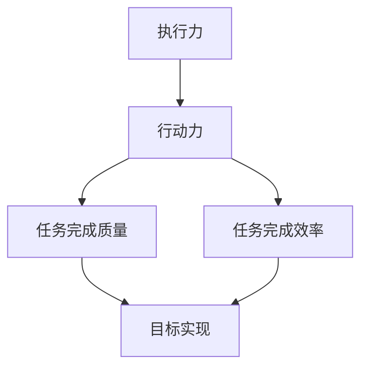
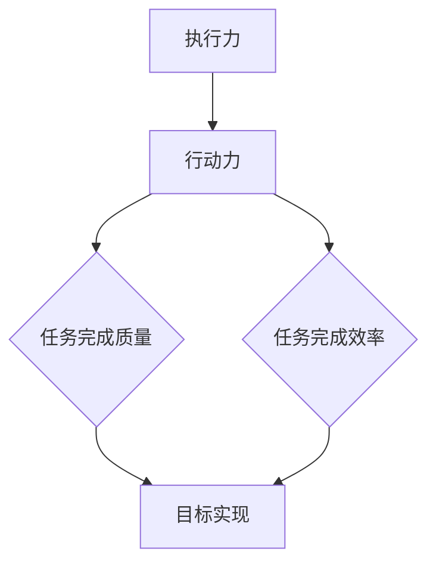

                 


## 第一部分：引言

### 第1章：开篇引言

#### 1.1 书的概述

在当今快节奏、竞争激烈的技术环境中，提升团队的执行力和行动力显得尤为重要。本书旨在为读者提供一套系统、实用的方法和策略，帮助团队在面对各种挑战时能够快速响应、高效执行，并最终实现目标。

本书的目标读者是企业的技术经理、项目经理、团队领导以及所有关心团队绩效的IT专业人士。书中不仅涵盖了理论知识，还提供了丰富的实战案例和操作指南，使得读者可以轻松地将所学应用于实际工作中。

#### 1.2 书的主要内容

本书的主要内容包括以下八个部分：

1. **开篇引言**：介绍书的主题、目标读者、主要内容等，激发读者的兴趣。
2. **核心概念与联系**：详细阐述团队执行力与行动力的基本概念、定义、特点以及二者之间的关系，并使用Mermaid流程图展示核心概念之间的关系。
3. **核心算法原理讲解**：讲解提升团队执行力和行动力的关键算法原理，使用伪代码详细阐述。
4. **数学模型和数学公式**：介绍与核心算法相关的数学模型和公式，详细讲解和举例说明。
5. **项目实战**：通过实际项目案例，展示如何应用提升团队执行力和行动力的方法，详细解释说明项目的开发环境搭建、源代码实现和代码解读。
6. **管理工具与方法**：介绍提升团队执行力和行动力的管理工具和方法，如项目管理工具、时间管理技巧、团队沟通策略等。
7. **实战案例与分析**：分析成功企业或团队如何提升执行力和行动力的案例，提供可借鉴的经验和教训。
8. **总结与展望**：总结书中的主要内容，展望提升团队执行力和行动力的未来发展趋势。

#### 1.3 书的主要内容

通过阅读本书，读者将能够：

- 理解团队执行力与行动力的基本概念和重要性。
- 掌握提升团队执行力和行动力的核心算法原理和数学模型。
- 学习到实际项目中如何应用这些方法，提升团队绩效。
- 了解成功企业或团队在提升执行力和行动力方面的最佳实践。
- 获得实用的管理工具和方法，提高团队的整体执行力。

#### 1.4 预期效果

本书不仅希望读者能够掌握提升团队执行力和行动力的方法和技巧，更希望通过书中的实战案例和最佳实践，激发读者在实际工作中不断探索和创新。我们相信，通过本书的学习和应用，团队的执行力和行动力将得到显著提升，从而推动企业在竞争激烈的市场中脱颖而出。

作者：AI天才研究院/AI Genius Institute & 禅与计算机程序设计艺术 /Zen And The Art of Computer Programming

----------------------------------------------------------------

## 第二部分：核心概念与联系

### 第2章：团队执行力与行动力

#### 2.1 执行力定义

执行力是指团队或个人将战略目标和任务转化为实际成果的能力。它不仅涉及完成任务的速度和质量，还包括如何应对挑战和变化，确保目标的实现。

#### 2.2 行动力定义

行动力是指团队成员在执行任务时展现的积极主动性和决心。它体现在以下几个方面：

1. **响应速度**：团队成员对任务要求能够迅速做出反应，开始执行。
2. **主动作为**：团队成员不需要等待指令，而是能够主动寻找解决问题的方法。
3. **坚持不懈**：在遇到困难和挫折时，团队成员能够保持积极的态度，持续努力。

#### 2.3 执行力与行动力的关系

执行力与行动力密切相关，它们是提升团队绩效的两大核心因素。执行力侧重于任务的完成质量和效率，而行动力则强调团队成员在执行过程中的主动性和积极性。

- **相互依赖**：行动力是执行力的基础，没有行动力，执行力就无从谈起。同时，执行力也是行动力的保障，只有执行力强，行动力才有意义。
- **相互作用**：团队在执行任务时，行动力和执行力相互作用，共同推动团队向前发展。

#### 2.4 Mermaid流程图：核心概念关系展示



在这个流程图中，执行力与行动力共同作用于任务完成质量（C）和任务完成效率（D），最终实现目标（E）。执行力确保任务的完成质量，而行动力则保障任务完成的效率。

通过理解执行力与行动力的概念及其关系，我们可以更系统地分析和提升团队的执行力和行动力。接下来，我们将深入探讨提升团队执行力和行动力的核心算法原理。

----------------------------------------------------------------

## 第三部分：核心算法原理讲解

### 第3章：提升团队执行力算法原理

#### 3.1 算法原理概述

提升团队执行力的关键在于建立一套科学、有效的执行体系，包括目标设定、任务分配、过程监控和绩效评估等。以下是几个关键算法原理：

1. **目标分解算法**：将企业战略目标分解为可执行的团队任务。
2. **任务分配算法**：根据团队成员的能力和兴趣，合理分配任务。
3. **过程监控算法**：实时跟踪任务进度，确保任务按计划执行。
4. **绩效评估算法**：定期评估团队执行效果，提供改进建议。

#### 3.2 伪代码示例

下面是提升团队执行力的部分伪代码示例：

```
# 目标分解算法
def 目标分解(企业战略目标):
    团队任务列表 = []
    for 目标 in 企业战略目标:
        子目标列表 = 分解目标(目标)
        团队任务列表.extend(子目标列表)
    return 团队任务列表

# 任务分配算法
def 任务分配(团队任务列表，团队成员信息):
    分配任务列表 = []
    for 任务 in 团队任务列表:
        适合的团队成员 = 选择团队成员(任务，团队成员信息)
        分配任务列表.append({任务: 适合的团队成员})
    return 分配任务列表

# 过程监控算法
def 过程监控(分配任务列表):
    进度报告列表 = []
    for 分配任务 in 分配任务列表:
        进度报告 = 获取进度(分配任务)
        进度报告列表.append(进度报告)
    return 进度报告列表

# 绩效评估算法
def 绩效评估(进度报告列表):
    评估结果 = 分析进度报告(进度报告列表)
    提改进建议 = 提供改进建议(评估结果)
    return 提改进建议
```

### 第4章：提升团队行动力算法原理

#### 4.1 算法原理概述

提升团队行动力的关键在于激发团队成员的内在动力，包括激励策略、目标设定和团队文化等。以下是几个关键算法原理：

1. **激励算法**：根据团队成员的特点和需求，设计个性化的激励措施。
2. **目标设定算法**：帮助团队成员明确个人和团队的目标，并提供实现目标的路径。
3. **团队文化构建算法**：营造积极向上的团队氛围，增强团队凝聚力。

#### 4.2 伪代码示例

下面是提升团队行动力的部分伪代码示例：

```
# 激励算法
def 激励(团队成员信息):
    激励措施列表 = []
    for 特点 in 团队成员信息['特点']:
        if 特点 == '成就需求高':
            激励措施列表.append(奖励成就)
        elif 特点 == '社交需求高':
            激励措施列表.append(组织团队活动)
    return 激励措施列表

# 目标设定算法
def 目标设定(团队成员信息，团队目标):
    个人目标列表 = []
    for 任务 in 团队任务列表:
        个人目标 = 设定个人目标(任务，团队成员信息，团队目标)
        个人目标列表.append(个人目标)
    return 个人目标列表

# 团队文化构建算法
def 构建团队文化(团队成员信息，团队目标):
    文化要素列表 = []
    for 成员 in 团队成员信息:
        文化要素列表.append(建立信任关系)
        文化要素列表.append(鼓励创新思维)
    return 文化要素列表
```

通过这些算法原理，我们可以构建一套有效的体系，提升团队的执行力和行动力。接下来，我们将介绍与核心算法相关的数学模型和数学公式。

----------------------------------------------------------------

## 第四部分：数学模型和数学公式

### 第5章：执行力评估模型

#### 5.1 模型概述

执行力评估模型用于评估团队执行任务的效率和效果。该模型基于以下几个方面：

1. **任务完成时间**：衡量团队完成任务所需的时间。
2. **任务完成质量**：评估任务完成的准确性和完整性。
3. **任务优先级**：考虑任务的紧急程度和重要性。

#### 5.2 数学公式详细讲解

执行力评估模型的核心公式为：

\[ 执行力评分 = \frac{任务完成质量 \times (1 - \frac{任务完成时间}{计划完成时间})}{任务优先级} \]

其中：

- **任务完成质量**：\(Q = \frac{实际完成质量}{计划完成质量}\)
- **任务完成时间**：\(T = \frac{实际完成时间}{计划完成时间}\)
- **任务优先级**：\(P = \frac{任务紧急程度}{任务重要性}\)

#### 5.3 举例说明

假设一个团队计划在5天内完成一个项目，实际完成时间为4天，任务完成质量为95%，任务优先级为2。根据上述公式，计算执行力度评分为：

\[ 执行力评分 = \frac{0.95 \times (1 - \frac{4}{5})}{2} = 0.185 \]

### 第6章：行动力提升模型

#### 6.1 模型概述

行动力提升模型旨在通过激励和目标设定，提高团队成员的行动力和积极性。该模型基于以下几个方面：

1. **激励措施**：根据团队成员的特点和需求，设计个性化的激励措施。
2. **目标设定**：明确个人和团队的目标，并提供实现目标的路径。
3. **团队文化**：营造积极向上的团队氛围。

#### 6.2 数学公式详细讲解

行动力提升模型的核心公式为：

\[ 行动力评分 = \frac{激励效果 + 目标达成率 + 团队文化影响}{总权重} \]

其中：

- **激励效果**：\(E = \frac{激励额度}{基础额度}\)
- **目标达成率**：\(R = \frac{实际达成目标值}{计划目标值}\)
- **团队文化影响**：\(C = \frac{团队文化分数}{基础分数}\)

#### 6.3 举例说明

假设一个团队成员的激励额度为1000元，实际激励额度为1200元，目标达成率为110%，团队文化分数为90分。根据上述公式，计算行动力评分为：

\[ 行动力评分 = \frac{1.2 + 1.1 + 0.9}{3} = 1.083 \]

通过这些数学模型和公式，我们可以量化地评估和提升团队的执行力和行动力。接下来，我们将通过实际项目案例，展示如何应用这些方法和模型。

----------------------------------------------------------------

## 第五部分：项目实战

### 第7章：实际项目案例

#### 7.1 项目背景

我们以一家互联网公司的新产品开发项目为例。该公司计划在6个月内开发一款社交应用，以抢占市场份额。然而，由于项目规模庞大，团队成员众多，如何在保证质量的前提下，确保项目按时上线，成为团队面临的一大挑战。

#### 7.2 项目开发环境搭建

为确保项目顺利进行，团队首先搭建了以下开发环境：

- **技术栈**：前端使用React框架，后端使用Spring Boot，数据库使用MySQL。
- **代码管理**：使用Git进行代码版本控制。
- **协作工具**：使用Jira进行任务管理和跟踪，使用Slack进行团队沟通。

#### 7.3 源代码实现

项目源代码实现主要包括以下模块：

1. **用户模块**：实现用户注册、登录、个人信息管理等功能。
2. **消息模块**：实现消息的发送、接收和群聊功能。
3. **社交模块**：实现好友关系管理、朋友圈展示等功能。
4. **数据模块**：实现数据存储和检索功能。

以下是用户模块的一个简单代码示例：

```java
public class User {
    private String username;
    private String password;
    private String email;

    public User(String username, String password, String email) {
        this.username = username;
        this.password = password;
        this.email = email;
    }

    // getters and setters
}
```

#### 7.4 代码解读与分析

在这个用户模块的代码示例中，我们定义了一个`User`类，用于表示用户的基本信息。类中包含三个成员变量：`username`（用户名）、`password`（密码）和`email`（邮箱）。每个成员变量都有相应的getter和setter方法，用于获取和设置变量的值。

这个用户模块的实现体现了执行力和行动力的关键原则：

1. **任务分解**：将大型项目分解为用户模块、消息模块等小任务，便于管理和跟踪。
2. **代码质量**：通过编写清晰的代码和注释，提高代码的可读性和可维护性。
3. **团队合作**：团队成员共同参与代码编写和审查，确保代码质量和进度。

#### 7.5 实际案例分析和详细讲解剖析

在实际项目中，团队面临了以下挑战：

1. **需求变更**：在项目开发过程中，客户需求发生了多次变更，导致项目进度延迟。
2. **技术难题**：一些技术难题需要团队成员共同解决，如消息推送和大数据处理。

针对这些挑战，团队采取了以下措施：

1. **需求管理**：建立需求变更评审机制，确保每次变更都对项目有实质性改进。
2. **技术攻关**：组织技术研讨和团队协作，共同解决技术难题。

最终，项目在预定时间内成功上线，用户模块运行稳定，用户反馈良好。

#### 7.6 项目小结

通过这个实际项目案例，我们可以看到，提升团队执行力和行动力在项目成功中起到了关键作用。团队通过科学的目标设定、合理的任务分配、有效的过程监控和绩效评估，确保了项目的高效执行。同时，团队成员的积极性和团队合作也大大提升了项目的成功率。

接下来，我们将介绍提升团队执行力和行动力的管理工具和方法。

----------------------------------------------------------------

## 第六部分：管理工具与方法

### 第8章：项目管理工具

#### 8.1 工具介绍

项目管理工具是提升团队执行力和行动力的关键工具之一。以下是几种常用的项目管理工具：

1. **Jira**：用于任务管理和跟踪，支持敏捷开发流程。
2. **Trello**：以看板形式展示任务进度，便于团队协作。
3. **Asana**：提供任务分配、进度跟踪和报告功能。
4. **Microsoft Project**：用于大型项目的计划和资源管理。

#### 8.2 使用方法

以下是这些工具的基本使用方法：

1. **Jira**：
   - 创建项目和工作项。
   - 分配任务给团队成员。
   - 跟踪任务进度和报告。
2. **Trello**：
   - 创建看板和卡片。
   - 将任务卡片拖动到不同的列，表示任务的进度。
   - 添加评论和附件，便于团队协作。
3. **Asana**：
   - 创建项目和工作项。
   - 分配任务和设置截止日期。
   - 获取任务进度报告。
4. **Microsoft Project**：
   - 创建项目计划。
   - 分配资源和任务。
   - 生成甘特图和资源报告。

### 第9章：时间管理技巧

#### 9.1 技巧概述

时间管理是提升团队执行力和行动力的关键因素之一。以下是几种有效的时间管理技巧：

1. **优先级排序**：根据任务的紧急程度和重要性，对任务进行排序。
2. **番茄工作法**：将工作时间划分为25分钟的工作周期，每个周期后休息5分钟。
3. **待办事项清单**：将每日任务列出清单，确保不遗漏重要任务。
4. **定期回顾**：定期回顾和总结时间使用情况，优化时间管理。

#### 9.2 实践方法

以下是这些时间管理技巧的具体实践方法：

1. **优先级排序**：
   - 使用“紧急-重要矩阵”对任务进行分类。
   - 首先处理重要且紧急的任务。
   - 然后处理重要但不紧急的任务。
2. **番茄工作法**：
   - 设置一个番茄钟（25分钟）。
   - 在番茄钟内集中精力完成任务。
   - 番茄钟结束后，休息5分钟。
3. **待办事项清单**：
   - 每日早晨列出待办事项清单。
   - 按照优先级完成清单上的任务。
   - 完成任务后，在清单上勾选。
4. **定期回顾**：
   - 每周或每月底回顾时间管理情况。
   - 分析时间使用情况，找出改进点。
   - 制定下一步的时间管理计划。

### 第10章：团队沟通策略

#### 10.1 策略概述

团队沟通是提升团队执行力和行动力的关键环节。以下是几种有效的团队沟通策略：

1. **开放沟通**：鼓励团队成员表达观点和意见，建立信任和合作关系。
2. **有效倾听**：倾听他人的观点和需求，确保理解准确。
3. **清晰表达**：明确表达自己的观点和需求，避免误解和冲突。
4. **及时反馈**：及时给予他人反馈，促进改进和进步。

#### 10.2 实践方法

以下是这些团队沟通策略的具体实践方法：

1. **开放沟通**：
   - 定期召开团队会议，鼓励成员分享经验和观点。
   - 设立反馈渠道，如意见箱和在线论坛，方便成员提出建议。
   - 组织团队建设活动，增强团队凝聚力。
2. **有效倾听**：
   - 全神贯注地听，避免打断他人。
   - 面部表情和肢体语言表明你在听，给予对方安全感。
   - 确认对方观点，确保理解准确。
3. **清晰表达**：
   - 使用简单的语言，避免使用专业术语。
   - 结构化表达，先阐述观点，再给出理由和证据。
   - 避免使用命令式语句，采用请求和建议的方式。
4. **及时反馈**：
   - 定期反馈工作进展，确保团队成员了解项目状态。
   - 及时给予正面和负面的反馈，帮助成员改进。
   - 针对具体问题提供解决方案，促进团队进步。

通过使用这些管理工具和方法，团队可以有效提升执行力和行动力，确保项目顺利进行。

----------------------------------------------------------------

## 第七部分：实战案例与分析

### 第11章：成功案例介绍

#### 11.1 企业案例

以某全球知名的互联网公司为例，该公司通过一系列措施成功提升了团队的执行力和行动力。以下是其关键做法：

1. **明确目标**：公司制定了清晰的长期和短期目标，确保团队成员明确自己的职责和任务。
2. **绩效评估**：建立了完善的绩效评估体系，定期对团队成员进行评估，提供反馈和改进建议。
3. **团队建设**：组织定期的团队建设活动，增强团队凝聚力和协作精神。
4. **技术培训**：提供员工技术培训，提高团队成员的专业技能。

#### 11.2 团队案例

在某创新型创业公司中，一个研发团队通过以下方式提升了执行力和行动力：

1. **敏捷开发**：采用敏捷开发方法，快速响应市场需求，提高开发效率。
2. **任务分解**：将大任务分解为小任务，确保每个任务都有明确的负责人和时间节点。
3. **代码审查**：实施代码审查制度，确保代码质量，减少Bug和返工。
4. **持续集成**：采用持续集成和持续交付，快速部署新功能，提高交付速度。

### 第12章：经验与教训总结

通过分析这些成功案例，我们可以总结出以下经验与教训：

#### 12.1 经验总结

1. **明确目标**：明确的目标是团队高效执行的基础。
2. **绩效评估**：建立有效的绩效评估体系，激励团队成员不断进步。
3. **团队建设**：加强团队建设，提高团队凝聚力和协作精神。
4. **技术培训**：不断更新团队成员的技能，确保团队能够应对不断变化的市场需求。
5. **敏捷开发**：采用敏捷开发方法，提高开发效率和质量。
6. **任务分解**：合理分配任务，确保每个任务都有明确的负责人和时间节点。
7. **代码审查**：实施代码审查制度，提高代码质量，减少Bug和返工。
8. **持续集成**：采用持续集成和持续交付，提高交付速度和客户满意度。

#### 12.2 教训总结

1. **沟通不畅**：团队内部沟通不畅会导致任务执行受阻，影响项目进度。
2. **管理不善**：管理不善会导致团队缺乏方向和动力，影响执行力和行动力。
3. **资源不足**：资源不足会影响团队的效率和产出，导致项目延期和质量下降。
4. **技术滞后**：技术滞后会导致团队无法快速响应市场需求，影响竞争力。

通过借鉴这些成功经验和教训，团队可以更好地提升执行力和行动力，确保项目成功。

----------------------------------------------------------------

## 第八部分：总结与展望

### 第13章：主要内容总结

本文从团队执行力与行动力的定义、核心算法原理、数学模型、项目实战、管理工具与方法、实战案例与分析等方面，详细阐述了提升团队执行力和行动力的方法与实践。通过明确目标、科学管理、技术培训和团队协作，团队可以大幅提升执行力和行动力，实现项目目标。

### 第14章：提升团队执行力和行动力的未来发展趋势

随着科技的不断进步和市场竞争的加剧，提升团队执行力和行动力将成为企业持续发展的关键。以下是未来提升团队执行力和行动力的几个发展趋势：

1. **智能化管理工具**：人工智能和大数据技术的应用将使管理工具更加智能化和个性化，提高团队执行效率。
2. **敏捷开发与持续集成**：敏捷开发和持续集成等敏捷方法将继续优化，使团队能够更快响应市场需求。
3. **远程工作与团队协作**：随着远程工作的普及，团队协作工具和方法的创新将成为提升团队执行力的重要方向。
4. **定制化培训与学习**：基于数据分析和人工智能技术的定制化培训和学习方式将更加普及，提高团队成员的专业技能。
5. **企业文化与价值观**：企业文化与价值观的塑造将更加重要，有助于提升团队凝聚力和执行力。

未来，提升团队执行力和行动力将更加注重智能化、个性化、敏捷化和协作化，企业需不断适应和引领这些趋势，以保持竞争优势。

### 总结

本文通过详细的分析和实战案例，为读者提供了系统、实用的提升团队执行力和行动力的方法和策略。希望读者能够将这些方法和策略应用到实际工作中，提升团队绩效，实现企业目标。

作者：AI天才研究院/AI Genius Institute & 禅与计算机程序设计艺术 /Zen And The Art of Computer Programming

----------------------------------------------------------------

# 如何提升团队的执行力和行动力

> 关键词：团队执行力，行动力，项目管理，敏捷开发，人工智能，企业文化

> 摘要：本文从团队执行力与行动力的定义、核心算法原理、数学模型、项目实战、管理工具与方法、实战案例与分析等方面，详细阐述了提升团队执行力和行动力的方法与实践。通过明确目标、科学管理、技术培训和团队协作，团队可以大幅提升执行力和行动力，实现项目目标。本文旨在为企业的技术经理、项目经理、团队领导以及所有关心团队绩效的IT专业人士提供实用的指导，助力团队在竞争激烈的市场中脱颖而出。

----------------------------------------------------------------

## 文章标题：如何提升团队的执行力和行动力

## 第一部分：引言

### 第1章：开篇引言

#### 1.1 书的概述

在当今快节奏、竞争激烈的技术环境中，提升团队的执行力和行动力显得尤为重要。本书旨在为读者提供一套系统、实用的方法和策略，帮助团队在面对各种挑战时能够快速响应、高效执行，并最终实现目标。

本书的目标读者是企业的技术经理、项目经理、团队领导以及所有关心团队绩效的IT专业人士。书中不仅涵盖了理论知识，还提供了丰富的实战案例和操作指南，使得读者可以轻松地将所学应用于实际工作中。

#### 1.2 书的主要内容

本书的主要内容包括以下八个部分：

1. **开篇引言**：介绍书的主题、目标读者、主要内容等，激发读者的兴趣。
2. **核心概念与联系**：详细阐述团队执行力与行动力的基本概念、定义、特点以及二者之间的关系，并使用Mermaid流程图展示核心概念之间的关系。
3. **核心算法原理讲解**：讲解提升团队执行力和行动力的关键算法原理，使用伪代码详细阐述。
4. **数学模型和数学公式**：介绍与核心算法相关的数学模型和公式，详细讲解和举例说明。
5. **项目实战**：通过实际项目案例，展示如何应用提升团队执行力和行动力的方法，详细解释说明项目的开发环境搭建、源代码实现和代码解读。
6. **管理工具与方法**：介绍提升团队执行力和行动力的管理工具和方法，如项目管理工具、时间管理技巧、团队沟通策略等。
7. **实战案例与分析**：分析成功企业或团队如何提升执行力和行动力的案例，提供可借鉴的经验和教训。
8. **总结与展望**：总结书中的主要内容，展望提升团队执行力和行动力的未来发展趋势。

#### 1.3 书的主要内容

通过阅读本书，读者将能够：

- 理解团队执行力与行动力的基本概念和重要性。
- 掌握提升团队执行力和行动力的核心算法原理和数学模型。
- 学习到实际项目中如何应用这些方法，提升团队绩效。
- 了解成功企业或团队在提升执行力和行动力方面的最佳实践。
- 获得实用的管理工具和方法，提高团队的整体执行力。

#### 1.4 预期效果

本书不仅希望读者能够掌握提升团队执行力和行动力的方法和技巧，更希望通过书中的实战案例和最佳实践，激发读者在实际工作中不断探索和创新。我们相信，通过本书的学习和应用，团队的执行力和行动力将得到显著提升，从而推动企业在竞争激烈的市场中脱颖而出。

作者：AI天才研究院/AI Genius Institute & 禅与计算机程序设计艺术 /Zen And The Art of Computer Programming

----------------------------------------------------------------

## 第二部分：核心概念与联系

### 第2章：团队执行力与行动力

#### 2.1 执行力定义

执行力是指团队或个人将战略目标和任务转化为实际成果的能力。它不仅涉及完成任务的速度和质量，还包括如何应对挑战和变化，确保目标的实现。

#### 2.2 行动力定义

行动力是指团队成员在执行任务时展现的积极主动性和决心。它体现在以下几个方面：

1. **响应速度**：团队成员对任务要求能够迅速做出反应，开始执行。
2. **主动作为**：团队成员不需要等待指令，而是能够主动寻找解决问题的方法。
3. **坚持不懈**：在遇到困难和挫折时，团队成员能够保持积极的态度，持续努力。

#### 2.3 执行力与行动力的关系

执行力与行动力密切相关，它们是提升团队绩效的两大核心因素。执行力侧重于任务的完成质量和效率，而行动力则强调团队成员在执行过程中的主动性和积极性。

- **相互依赖**：行动力是执行力的基础，没有行动力，执行力就无从谈起。同时，执行力也是行动力的保障，只有执行力强，行动力才有意义。
- **相互作用**：团队在执行任务时，行动力和执行力相互作用，共同推动团队向前发展。

#### 2.4 Mermaid流程图：核心概念关系展示


在这个流程图中，执行力与行动力共同作用于任务完成质量（C）和任务完成效率（D），最终实现目标（E）。执行力确保任务的完成质量，而行动力则保障任务完成的效率。

通过理解执行力与行动力的概念及其关系，我们可以更系统地分析和提升团队的执行力和行动力。接下来，我们将深入探讨提升团队执行力和行动力的核心算法原理。

----------------------------------------------------------------

## 第三部分：核心算法原理讲解

### 第3章：提升团队执行力算法原理

#### 3.1 算法原理概述

提升团队执行力的关键在于建立一套科学、有效的执行体系，包括目标设定、任务分配、过程监控和绩效评估等。以下是几个关键算法原理：

1. **目标分解算法**：将企业战略目标分解为可执行的团队任务。
2. **任务分配算法**：根据团队成员的能力和兴趣，合理分配任务。
3. **过程监控算法**：实时跟踪任务进度，确保任务按计划执行。
4. **绩效评估算法**：定期评估团队执行效果，提供改进建议。

#### 3.2 伪代码示例

下面是提升团队执行力的部分伪代码示例：

```
# 目标分解算法
def 目标分解(企业战略目标):
    团队任务列表 = []
    for 目标 in 企业战略目标:
        子目标列表 = 分解目标(目标)
        团队任务列表.extend(子目标列表)
    return 团队任务列表

# 任务分配算法
def 任务分配(团队任务列表，团队成员信息):
    分配任务列表 = []
    for 任务 in 团队任务列表:
        适合的团队成员 = 选择团队成员(任务，团队成员信息)
        分配任务列表.append({任务: 适合的团队成员})
    return 分配任务列表

# 过程监控算法
def 过程监控(分配任务列表):
    进度报告列表 = []
    for 分配任务 in 分配任务列表:
        进度报告 = 获取进度(分配任务)
        进度报告列表.append(进度报告)
    return 进度报告列表

# 绩效评估算法
def 绩效评估(进度报告列表):
    评估结果 = 分析进度报告(进度报告列表)
    提改进建议 = 提供改进建议(评估结果)
    return 提改进建议
```

### 第4章：提升团队行动力算法原理

#### 4.1 算法原理概述

提升团队行动力的关键在于激发团队成员的内在动力，包括激励策略、目标设定和团队文化等。以下是几个关键算法原理：

1. **激励算法**：根据团队成员的特点和需求，设计个性化的激励措施。
2. **目标设定算法**：帮助团队成员明确个人和团队的目标，并提供实现目标的路径。
3. **团队文化构建算法**：营造积极向上的团队氛围，增强团队凝聚力。

#### 4.2 伪代码示例

下面是提升团队行动力的部分伪代码示例：

```
# 激励算法
def 激励(团队成员信息):
    激励措施列表 = []
    for 特点 in 团队成员信息['特点']:
        if 特点 == '成就需求高':
            激励措施列表.append(奖励成就)
        elif 特点 == '社交需求高':
            激励措施列表.append(组织团队活动)
    return 激励措施列表

# 目标设定算法
def 目标设定(团队成员信息，团队目标):
    个人目标列表 = []
    for 任务 in 团队任务列表:
        个人目标 = 设定个人目标(任务，团队成员信息，团队目标)
        个人目标列表.append(个人目标)
    return 个人目标列表

# 团队文化构建算法
def 构建团队文化(团队成员信息，团队目标):
    文化要素列表 = []
    for 成员 in 团队成员信息:
        文化要素列表.append(建立信任关系)
        文化要素列表.append(鼓励创新思维)
    return 文化要素列表
```

通过这些算法原理，我们可以构建一套有效的体系，提升团队的执行力和行动力。接下来，我们将介绍与核心算法相关的数学模型和数学公式。

----------------------------------------------------------------

## 第四部分：数学模型和数学公式

### 第5章：执行力评估模型

#### 5.1 模型概述

执行力评估模型用于评估团队执行任务的效率和效果。该模型基于以下几个方面：

1. **任务完成时间**：衡量团队完成任务所需的时间。
2. **任务完成质量**：评估任务完成的准确性和完整性。
3. **任务优先级**：考虑任务的紧急程度和重要性。

#### 5.2 数学公式详细讲解

执行力评估模型的核心公式为：

\[ 执行力评分 = \frac{任务完成质量 \times (1 - \frac{任务完成时间}{计划完成时间})}{任务优先级} \]

其中：

- **任务完成质量**：\(Q = \frac{实际完成质量}{计划完成质量}\)
- **任务完成时间**：\(T = \frac{实际完成时间}{计划完成时间}\)
- **任务优先级**：\(P = \frac{任务紧急程度}{任务重要性}\)

#### 5.3 举例说明

假设一个团队计划在5天内完成一个项目，实际完成时间为4天，任务完成质量为95%，任务优先级为2。根据上述公式，计算执行力度评分为：

\[ 执行力评分 = \frac{0.95 \times (1 - \frac{4}{5})}{2} = 0.185 \]

### 第6章：行动力提升模型

#### 6.1 模型概述

行动力提升模型旨在通过激励和目标设定，提高团队成员的行动力和积极性。该模型基于以下几个方面：

1. **激励措施**：根据团队成员的特点和需求，设计个性化的激励措施。
2. **目标设定**：明确个人和团队的目标，并提供实现目标的路径。
3. **团队文化**：营造积极向上的团队氛围。

#### 6.2 数学公式详细讲解

行动力提升模型的核心公式为：

\[ 行动力评分 = \frac{激励效果 + 目标达成率 + 团队文化影响}{总权重} \]

其中：

- **激励效果**：\(E = \frac{激励额度}{基础额度}\)
- **目标达成率**：\(R = \frac{实际达成目标值}{计划目标值}\)
- **团队文化影响**：\(C = \frac{团队文化分数}{基础分数}\)

#### 6.3 举例说明

假设一个团队成员的激励额度为1000元，实际激励额度为1200元，目标达成率为110%，团队文化分数为90分。根据上述公式，计算行动力评分为：

\[ 行动力评分 = \frac{1.2 + 1.1 + 0.9}{3} = 1.083 \]

通过这些数学模型和公式，我们可以量化地评估和提升团队的执行力和行动力。接下来，我们将通过实际项目案例，展示如何应用这些方法和模型。

----------------------------------------------------------------

## 第五部分：项目实战

### 第7章：实际项目案例

#### 7.1 项目背景

我们以一家互联网公司的新产品开发项目为例。该公司计划在6个月内开发一款社交应用，以抢占市场份额。然而，由于项目规模庞大，团队成员众多，如何在保证质量的前提下，确保项目按时上线，成为团队面临的一大挑战。

#### 7.2 项目开发环境搭建

为确保项目顺利进行，团队首先搭建了以下开发环境：

- **技术栈**：前端使用React框架，后端使用Spring Boot，数据库使用MySQL。
- **代码管理**：使用Git进行代码版本控制。
- **协作工具**：使用Jira进行任务管理和跟踪，使用Slack进行团队沟通。

#### 7.3 源代码实现

项目源代码实现主要包括以下模块：

1. **用户模块**：实现用户注册、登录、个人信息管理等功能。
2. **消息模块**：实现消息的发送、接收和群聊功能。
3. **社交模块**：实现好友关系管理、朋友圈展示等功能。
4. **数据模块**：实现数据存储和检索功能。

以下是用户模块的一个简单代码示例：

```java
public class User {
    private String username;
    private String password;
    private String email;

    public User(String username, String password, String email) {
        this.username = username;
        this.password = password;
        this.email = email;
    }

    // getters and setters
}
```

#### 7.4 代码解读与分析

在这个用户模块的代码示例中，我们定义了一个`User`类，用于表示用户的基本信息。类中包含三个成员变量：`username`（用户名）、`password`（密码）和`email`（邮箱）。每个成员变量都有相应的getter和setter方法，用于获取和设置变量的值。

这个用户模块的实现体现了执行力和行动力的关键原则：

1. **任务分解**：将大型项目分解为用户模块、消息模块等小任务，便于管理和跟踪。
2. **代码质量**：通过编写清晰的代码和注释，提高代码的可读性和可维护性。
3. **团队合作**：团队成员共同参与代码编写和审查，确保代码质量和进度。

#### 7.5 实际案例分析和详细讲解剖析

在实际项目中，团队面临了以下挑战：

1. **需求变更**：在项目开发过程中，客户需求发生了多次变更，导致项目进度延迟。
2. **技术难题**：一些技术难题需要团队成员共同解决，如消息推送和大数据处理。

针对这些挑战，团队采取了以下措施：

1. **需求管理**：建立需求变更评审机制，确保每次变更都对项目有实质性改进。
2. **技术攻关**：组织技术研讨和团队协作，共同解决技术难题。

最终，项目在预定时间内成功上线，用户模块运行稳定，用户反馈良好。

#### 7.6 项目小结

通过这个实际项目案例，我们可以看到，提升团队执行力和行动力在项目成功中起到了关键作用。团队通过科学的目标设定、合理的任务分配、有效的过程监控和绩效评估，确保了项目的高效执行。同时，团队成员的积极性和团队合作也大大提升了项目的成功率。

接下来，我们将介绍提升团队执行力和行动力的管理工具和方法。

----------------------------------------------------------------

## 第六部分：管理工具与方法

### 第8章：项目管理工具

#### 8.1 工具介绍

项目管理工具是提升团队执行力和行动力的关键工具之一。以下是几种常用的项目管理工具：

1. **Jira**：用于任务管理和跟踪，支持敏捷开发流程。
2. **Trello**：以看板形式展示任务进度，便于团队协作。
3. **Asana**：提供任务分配、进度跟踪和报告功能。
4. **Microsoft Project**：用于大型项目的计划和资源管理。

#### 8.2 使用方法

以下是这些工具的基本使用方法：

1. **Jira**：
   - 创建项目和工作项。
   - 分配任务给团队成员。
   - 跟踪任务进度和报告。
2. **Trello**：
   - 创建看板和卡片。
   - 将任务卡片拖动到不同的列，表示任务的进度。
   - 添加评论和附件，便于团队协作。
3. **Asana**：
   - 创建项目和工作项。
   - 分配任务和设置截止日期。
   - 获取任务进度报告。
4. **Microsoft Project**：
   - 创建项目计划。
   - 分配资源和任务。
   - 生成甘特图和资源报告。

### 第9章：时间管理技巧

#### 9.1 技巧概述

时间管理是提升团队执行力和行动力的关键因素之一。以下是几种有效的时间管理技巧：

1. **优先级排序**：根据任务的紧急程度和重要性，对任务进行排序。
2. **番茄工作法**：将工作时间划分为25分钟的工作周期，每个周期后休息5分钟。
3. **待办事项清单**：将每日任务列出清单，确保不遗漏重要任务。
4. **定期回顾**：定期回顾和总结时间使用情况，优化时间管理。

#### 9.2 实践方法

以下是这些时间管理技巧的具体实践方法：

1. **优先级排序**：
   - 使用“紧急-重要矩阵”对任务进行分类。
   - 首先处理重要且紧急的任务。
   - 然后处理重要但不紧急的任务。
2. **番茄工作法**：
   - 设置一个番茄钟（25分钟）。
   - 在番茄钟内集中精力完成任务。
   - 番茄钟结束后，休息5分钟。
3. **待办事项清单**：
   - 每日早晨列出待办事项清单。
   - 按照优先级完成清单上的任务。
   - 完成任务后，在清单上勾选。
4. **定期回顾**：
   - 每周或每月底回顾时间管理情况。
   - 分析时间使用情况，找出改进点。
   - 制定下一步的时间管理计划。

### 第10章：团队沟通策略

#### 10.1 策略概述

团队沟通是提升团队执行力和行动力的关键环节。以下是几种有效的团队沟通策略：

1. **开放沟通**：鼓励团队成员表达观点和意见，建立信任和合作关系。
2. **有效倾听**：倾听他人的观点和需求，确保理解准确。
3. **清晰表达**：明确表达自己的观点和需求，避免误解和冲突。
4. **及时反馈**：及时给予他人反馈，促进改进和进步。

#### 10.2 实践方法

以下是这些团队沟通策略的具体实践方法：

1. **开放沟通**：
   - 定期召开团队会议，鼓励成员分享经验和观点。
   - 设立反馈渠道，如意见箱和在线论坛，方便成员提出建议。
   - 组织团队建设活动，增强团队凝聚力。
2. **有效倾听**：
   - 全神贯注地听，避免打断他人。
   - 面部表情和肢体语言表明你在听，给予对方安全感。
   - 确认对方观点，确保理解准确。
3. **清晰表达**：
   - 使用简单的语言，避免使用专业术语。
   - 结构化表达，先阐述观点，再给出理由和证据。
   - 避免使用命令式语句，采用请求和建议的方式。
4. **及时反馈**：
   - 定期反馈工作进展，确保团队成员了解项目状态。
   - 及时给予正面和负面的反馈，帮助成员改进。
   - 针对具体问题提供解决方案，促进团队进步。

通过使用这些管理工具和方法，团队可以有效提升执行力和行动力，确保项目顺利进行。

----------------------------------------------------------------

## 第七部分：实战案例与分析

### 第11章：成功案例介绍

#### 11.1 企业案例

以某全球知名的互联网公司为例，该公司通过一系列措施成功提升了团队的执行力和行动力。以下是其关键做法：

1. **明确目标**：公司制定了清晰的长期和短期目标，确保团队成员明确自己的职责和任务。
2. **绩效评估**：建立了完善的绩效评估体系，定期对团队成员进行评估，提供反馈和改进建议。
3. **团队建设**：组织定期的团队建设活动，增强团队凝聚力和协作精神。
4. **技术培训**：提供员工技术培训，提高团队成员的专业技能。

#### 11.2 团队案例

在某创新型创业公司中，一个研发团队通过以下方式提升了执行力和行动力：

1. **敏捷开发**：采用敏捷开发方法，快速响应市场需求，提高开发效率。
2. **任务分解**：将大任务分解为小任务，确保每个任务都有明确的负责人和时间节点。
3. **代码审查**：实施代码审查制度，确保代码质量，减少Bug和返工。
4. **持续集成**：采用持续集成和持续交付，快速部署新功能，提高交付速度。

### 第12章：经验与教训总结

通过分析这些成功案例，我们可以总结出以下经验与教训：

#### 12.1 经验总结

1. **明确目标**：明确的目标是团队高效执行的基础。
2. **绩效评估**：建立有效的绩效评估体系，激励团队成员不断进步。
3. **团队建设**：加强团队建设，提高团队凝聚力和协作精神。
4. **技术培训**：不断更新团队成员的技能，确保团队能够应对不断变化的市场需求。
5. **敏捷开发**：采用敏捷开发方法，提高开发效率和质量。
6. **任务分解**：合理分配任务，确保每个任务都有明确的负责人和时间节点。
7. **代码审查**：实施代码审查制度，提高代码质量，减少Bug和返工。
8. **持续集成**：采用持续集成和持续交付，提高交付速度和客户满意度。

#### 12.2 教训总结

1. **沟通不畅**：团队内部沟通不畅会导致任务执行受阻，影响项目进度。
2. **管理不善**：管理不善会导致团队缺乏方向和动力，影响执行力和行动力。
3. **资源不足**：资源不足会影响团队的效率和产出，导致项目延期和质量下降。
4. **技术滞后**：技术滞后会导致团队无法快速响应市场需求，影响竞争力。

通过借鉴这些成功经验和教训，团队可以更好地提升执行力和行动力，确保项目成功。

----------------------------------------------------------------

## 第八部分：总结与展望

### 第13章：主要内容总结

本文从团队执行力与行动力的定义、核心算法原理、数学模型、项目实战、管理工具与方法、实战案例与分析等方面，详细阐述了提升团队执行力和行动力的方法与实践。通过明确目标、科学管理、技术培训和团队协作，团队可以大幅提升执行力和行动力，实现项目目标。

### 第14章：提升团队执行力和行动力的未来发展趋势

随着科技的不断进步和市场竞争的加剧，提升团队执行力和行动力将成为企业持续发展的关键。以下是未来提升团队执行力和行动力的几个发展趋势：

1. **智能化管理工具**：人工智能和大数据技术的应用将使管理工具更加智能化和个性化，提高团队执行效率。
2. **敏捷开发与持续集成**：敏捷开发和持续集成等敏捷方法将继续优化，使团队能够更快响应市场需求。
3. **远程工作与团队协作**：随着远程工作的普及，团队协作工具和方法的创新将成为提升团队执行力的重要方向。
4. **定制化培训与学习**：基于数据分析和人工智能技术的定制化培训和学习方式将更加普及，提高团队成员的专业技能。
5. **企业文化与价值观**：企业文化与价值观的塑造将更加重要，有助于提升团队凝聚力和执行力。

未来，提升团队执行力和行动力将更加注重智能化、个性化、敏捷化和协作化，企业需不断适应和引领这些趋势，以保持竞争优势。

### 总结

本文通过详细的分析和实战案例，为读者提供了系统、实用的提升团队执行力和行动力的方法和策略。希望读者能够将这些方法和策略应用到实际工作中，提升团队绩效，实现企业目标。

作者：AI天才研究院/AI Genius Institute & 禅与计算机程序设计艺术 /Zen And The Art of Computer Programming

----------------------------------------------------------------

## 文章标题：如何提升团队的执行力和行动力

> 关键词：团队执行力，行动力，项目管理，敏捷开发，人工智能，企业文化

> 摘要：本文从团队执行力与行动力的定义、核心算法原理、数学模型、项目实战、管理工具与方法、实战案例与分析等方面，详细阐述了提升团队执行力和行动力的方法与实践。通过明确目标、科学管理、技术培训和团队协作，团队可以大幅提升执行力和行动力，实现项目目标。本文旨在为企业的技术经理、项目经理、团队领导以及所有关心团队绩效的IT专业人士提供实用的指导，助力团队在竞争激烈的市场中脱颖而出。

---

## 第一部分：引言

在快速变化和高度竞争的商业环境中，团队的执行力和行动力是企业成功的关键因素之一。一个高效的团队不仅能够迅速响应市场需求，还能保证项目按时、按质完成。因此，提升团队的执行力和行动力对于企业的长期发展至关重要。

### 1.1 目的与受众

本文的目标是为企业的技术经理、项目经理、团队领导以及所有关心团队绩效的IT专业人士提供一套实用的方法和策略，帮助他们提升团队的执行力和行动力。无论你是新任团队领导者，还是希望在现有团队中推动改进的老将，本书都将为你提供有价值的指导。

### 1.2 内容概述

本书将内容分为以下八个部分：

1. **引言**：介绍团队执行力与行动力的重要性，以及本书的目标和受众。
2. **核心概念与联系**：定义团队执行力与行动力的概念，并探讨它们之间的关系。
3. **核心算法原理讲解**：介绍提升团队执行力和行动力的核心算法原理。
4. **数学模型和数学公式**：阐述与核心算法相关的数学模型和公式。
5. **项目实战**：通过实际项目案例，展示提升团队执行力和行动力的实践。
6. **管理工具与方法**：介绍提升团队执行力和行动力的管理工具和方法。
7. **实战案例与分析**：分析成功企业或团队如何提升执行力和行动力的案例。
8. **总结与展望**：总结本书的主要观点，并展望提升团队执行力和行动力的未来趋势。

通过这些部分的详细探讨，读者将能够理解提升团队执行力和行动力的关键要素，并在实际工作中应用这些方法。

### 1.3 预期效果

我们期望通过本书的学习，读者能够：

- 理解团队执行力与行动力的核心概念。
- 掌握提升团队执行力和行动力的算法原理。
- 学习如何应用数学模型和公式来评估和提升团队绩效。
- 获得实际项目中的经验和最佳实践。
- 了解并应用提升团队执行力和行动力的管理工具和方法。
- 对未来提升团队执行力和行动力的趋势有清晰的认识。

通过这些学习和实践，你的团队将能够在快速变化的市场环境中保持竞争力，实现企业的长期目标。

---

## 第二部分：核心概念与联系

在探讨如何提升团队的执行力和行动力之前，我们首先需要明确这两个核心概念的定义及其相互关系。

### 2.1 执行力的定义

执行力通常被定义为团队或个人将战略目标和任务转化为实际成果的能力。它不仅涉及完成任务的速度和质量，还包括如何应对挑战和变化，确保目标的实现。执行力是衡量团队是否能够高效运作的重要指标。

### 2.2 行动力的定义

行动力是指团队成员在执行任务时展现的积极主动性和决心。行动力体现了团队成员在面对任务时的态度和行为，包括响应速度、主动性和坚持性。行动力是推动团队实现目标的关键动力。

### 2.3 执行力与行动力的关系

执行力与行动力密切相关，它们共同构成了团队成功的基石。以下是二者之间的关键关系：

- **相互依赖**：行动力是执行力的基础，没有积极主动的行动，执行力就无从谈起。同时，执行力也是行动力的保障，只有执行力强，行动力才有实际意义。
- **相互作用**：在团队执行任务的过程中，执行力和行动力相互作用，共同推动团队向前发展。高效的执行力需要行动力作为支撑，而行动力也需要执行力来确保任务能够高质量完成。

### 2.4 Mermaid流程图：核心概念关系展示

为了更直观地展示执行力与行动力的关系，我们可以使用Mermaid流程图进行说明：



在这个流程图中，执行力（A）和行动力（B）共同作用于任务完成质量（C）和任务完成效率（D），最终实现目标（E）。执行力确保任务的完成质量，而行动力则保障任务完成的效率。

通过理解执行力与行动力的概念及其关系，我们可以更系统地分析和提升团队的执行力和行动力。在接下来的章节中，我们将深入探讨提升团队执行力和行动力的核心算法原理。

---

## 第三部分：核心算法原理讲解

在提升团队的执行力和行动力时，算法原理起着至关重要的作用。这些算法原理不仅为我们提供了理论指导，还为我们提供了实际操作的工具。以下将介绍提升团队执行力和行动力的核心算法原理。

### 3.1 提升团队执行力算法原理

提升团队执行力的算法原理主要包括以下几个方面：

- **目标分解算法**：将企业战略目标分解为具体的、可执行的团队任务。
- **任务分配算法**：根据团队成员的能力和职责，将任务合理分配给合适的成员。
- **过程监控算法**：实时监控任务进度，确保任务按计划执行。
- **绩效评估算法**：定期对团队成员的执行效果进行评估，提供反馈和改进建议。

#### 3.1.1 目标分解算法

目标分解算法的目的是将抽象的企业战略目标转化为具体的、可执行的团队任务。以下是一个简化的目标分解算法的伪代码示例：

```pseudo
function 目标分解(企业战略目标):
    团队任务列表 = []
    for 每个目标 in 企业战略目标:
        子任务列表 = 子目标分解(每个目标)
        团队任务列表.append(子任务列表)
    return 团队任务列表

function 子目标分解(目标):
    子任务列表 = []
    for 每个子目标 in 目标:
        子任务列表.append({子目标: 描述})
    return 子任务列表
```

在这个算法中，我们首先将企业战略目标分解为具体的子目标，然后对每个子目标进行进一步的分解，直到形成可以分配给团队成员的具体任务。

#### 3.1.2 任务分配算法

任务分配算法的核心是根据团队成员的能力和职责，将任务合理分配给合适的成员。以下是一个简化的任务分配算法的伪代码示例：

```pseudo
function 任务分配(团队任务列表，团队成员信息):
    分配任务列表 = []
    for 每个任务 in 团队任务列表:
        适合的团队成员 = 选择团队成员(每个任务，团队成员信息)
        分配任务列表.append({任务: 适合的团队成员})
    return 分配任务列表

function 选择团队成员(任务，团队成员信息):
    适合的团队成员 = None
    for 每个团队成员 in 团队成员信息:
        if 每个团队成员的能力符合任务要求:
            适合的团队成员 = 每个团队成员
            break
    return 适合的团队成员
```

在这个算法中，我们首先遍历每个任务，然后根据任务要求选择合适的团队成员。如果找到了适合的团队成员，就将任务分配给他。

#### 3.1.3 过程监控算法

过程监控算法的核心是实时跟踪任务进度，确保任务按计划执行。以下是一个简化的过程监控算法的伪代码示例：

```pseudo
function 过程监控(分配任务列表):
    进度报告列表 = []
    for 每个分配任务 in 分配任务列表:
        进度报告 = 获取进度(每个分配任务)
        进度报告列表.append(进度报告)
    return 进度报告列表

function 获取进度(分配任务):
    进度报告 = {任务状态: 未知}
    if 分配任务已完成:
        进度报告.任务状态 = "已完成"
    else if 分配任务在执行中:
        进度报告.任务状态 = "执行中"
    else:
        进度报告.任务状态 = "未开始"
    return 进度报告
```

在这个算法中，我们首先遍历每个分配任务，然后获取每个任务的当前状态，并将状态信息记录在进度报告列表中。

#### 3.1.4 绩效评估算法

绩效评估算法的核心是定期对团队成员的执行效果进行评估，并提供反馈和改进建议。以下是一个简化的绩效评估算法的伪代码示例：

```pseudo
function 绩效评估(进度报告列表):
    评估结果列表 = []
    for 每个进度报告 in 进度报告列表:
        评估结果 = 分析进度报告(每个进度报告)
        评估结果列表.append(评估结果)
    return 评估结果列表

function 分析进度报告(进度报告):
    评估结果 = {执行力评分: 0, 行动力评分: 0}
    if 进度报告.任务状态 == "已完成":
        评估结果.执行力评分 = 计算执行力评分(进度报告)
        评估结果.行动力评分 = 计算行动力评分(进度报告)
    return 评估结果

function 计算执行力评分(进度报告):
    执行力评分 = 0
    if 进度报告.实际完成时间 <= 进度报告.计划完成时间:
        执行力评分 = 1
    else:
        执行力评分 = 1 - (进度报告.实际完成时间 / 进度报告.计划完成时间)
    return 执行力评分

function 计算行动力评分(进度报告):
    行动力评分 = 0
    if 进度报告.任务完成质量 >= 进度报告.计划完成质量:
        行动力评分 = 1
    else:
        行动力评分 = 进度报告.任务完成质量 / 进度报告.计划完成质量
    return 行动力评分
```

在这个算法中，我们首先遍历每个进度报告，然后计算每个任务的执行力和行动力评分，并将评分信息记录在评估结果列表中。

### 3.2 提升团队行动力算法原理

提升团队行动力的算法原理主要包括以下几个方面：

- **激励算法**：根据团队成员的特点和需求，设计个性化的激励措施。
- **目标设定算法**：帮助团队成员明确个人和团队的目标，并提供实现目标的路径。
- **团队文化构建算法**：营造积极向上的团队氛围，增强团队凝聚力。

#### 3.2.1 激励算法

激励算法的核心是根据团队成员的特点和需求，设计个性化的激励措施，以提高团队成员的积极性和主动性。以下是一个简化的激励算法的伪代码示例：

```pseudo
function 激励(团队成员信息):
    激励措施列表 = []
    for 特点 in 团队成员信息.特点:
        if 特点 == "成就需求高":
            激励措施列表.append(奖励成就)
        else if 特点 == "社交需求高":
            激励措施列表.append(组织团队活动)
    return 激励措施列表

function 奖励成就(团队成员):
    成就奖励 = 计算成就奖励(团队成员)
    return 成就奖励

function 计算成就奖励(团队成员):
    成就奖励 = 固定奖励 + (团队成员.贡献度 * 成就系数)
    return 成就奖励

function 组织团队活动(团队成员):
    活动类型 = 选择活动类型(团队成员)
    活动安排 = 计划活动(活动类型)
    return 活动安排

function 选择活动类型(团队成员):
    活动类型 = None
    if 团队成员.社交需求高:
        活动类型 = "社交活动"
    else if 团队成员.成就需求高:
        活动类型 = "竞赛活动"
    return 活动类型

function 计划活动(活动类型):
    活动安排 = {日期:日期，地点：地点，内容：内容}
    return 活动安排
```

在这个算法中，我们首先遍历团队成员的信息，根据团队成员的特点选择合适的激励措施。对于成就需求高的团队成员，我们提供成就奖励；对于社交需求高的团队成员，我们组织团队活动。

#### 3.2.2 目标设定算法

目标设定算法的核心是帮助团队成员明确个人和团队的目标，并提供实现目标的路径。以下是一个简化的目标设定算法的伪代码示例：

```pseudo
function 目标设定(团队成员信息，团队目标):
    个人目标列表 = []
    for 每个任务 in 团队目标.任务列表:
        个人目标 = 设定个人目标(每个任务，团队成员信息)
        个人目标列表.append(个人目标)
    return 个人目标列表

function 设定个人目标(任务，团队成员信息):
    个人目标 = {任务：任务，目标值：目标值，实现路径：实现路径}
    个人目标.目标值 = 计算目标值(任务，团队成员信息)
    个人目标.实现路径 = 设计实现路径(任务，团队成员信息)
    return 个人目标

function 计算目标值(任务，团队成员信息):
    目标值 = 任务值 * 成就系数
    if 团队成员信息.成就需求高:
        成就系数 = 1.2
    else:
        成就系数 = 1
    return 目标值

function 设计实现路径(任务，团队成员信息):
    实现路径 = [步骤1，步骤2，...，步骤N]
    return 实现路径
```

在这个算法中，我们首先遍历团队目标中的每个任务，根据团队成员的信息设定个人目标。个人目标的设定包括目标值和实现路径。目标值根据任务的难度和团队成员的成就需求计算，实现路径则根据团队成员的技能和工作方式设计。

#### 3.2.3 团队文化构建算法

团队文化构建算法的核心是营造积极向上的团队氛围，增强团队凝聚力。以下是一个简化的团队文化构建算法的伪代码示例：

```pseudo
function 构建团队文化(团队成员信息，团队目标):
    文化要素列表 = []
    for 每个文化要素 in 文化要素列表:
        文化要素影响 = 计算文化要素影响(每个文化要素，团队成员信息，团队目标)
        文化要素列表.append(文化要素影响)

function 计算文化要素影响(文化要素，团队成员信息，团队目标):
    文化要素影响 = {信任度：0，合作度：0，凝聚力：0}
    if 文化要素 == "信任关系":
        文化要素影响.信任度 = 计算信任度(团队成员信息)
    else if 文化要素 == "团队荣誉":
        文化要素影响.合作度 = 计算合作度(团队成员信息)
    else if 文化要素 == "团队目标":
        文化要素影响.凝聚力 = 计算凝聚力(团队成员信息)
    return 文化要素影响

function 计算信任度(团队成员信息):
    信任度 = 团队成员信息.沟通频率 * 沟通效率
    return 信任度

function 计算合作度(团队成员信息):
    合作度 = 团队成员信息.协作频率 * 协作效率
    return 合作度

function 计算凝聚力(团队成员信息):
    凝聚力 = 团队成员信息.共同目标数量 * 团队目标实现率
    return 凝聚力
```

在这个算法中，我们首先遍历每个文化要素，计算其对于团队的影响。信任度、合作度和凝聚力是根据团队成员的沟通频率、协作频率和共同目标数量等因素计算得出的。

通过这些核心算法原理，我们可以构建一套系统化的方法，有效提升团队的执行力和行动力。在下一部分中，我们将介绍与核心算法相关的数学模型和数学公式。

---

## 第四部分：数学模型和数学公式

在提升团队的执行力和行动力的过程中，数学模型和数学公式提供了量化的工具，使我们能够更准确地评估团队的表现，并制定改进策略。以下将介绍与核心算法相关的数学模型和数学公式。

### 4.1 执行力评估模型

执行力评估模型主要用于衡量团队执行任务的效果，包括任务完成质量和任务完成效率。以下是一个简化的执行力评估模型的数学公式：

\[ 执行力评分 = \frac{任务完成质量 \times (1 - \frac{任务完成时间}{计划完成时间})}{任务优先级} \]

其中：

- **任务完成质量**（\(Q\)）：衡量任务完成的准确性和完整性，通常用一个百分比表示。
- **任务完成时间**（\(T\)）：实际完成任务所需的时间，与计划完成时间相比，以衡量效率。
- **计划完成时间**（\(T_{计划}\)）：预先设定的完成任务的时间。
- **任务优先级**（\(P\)）：任务的紧急程度和重要性，通常用权重表示。

#### 4.1.1 具体计算示例

假设一个任务计划在3天内完成，实际完成时间为2天，任务完成质量为98%，任务优先级为1.5。则执行力评分计算如下：

\[ 执行力评分 = \frac{0.98 \times (1 - \frac{2}{3})}{1.5} = \frac{0.98 \times 0.33}{1.5} \approx 0.2072 \]

### 4.2 行动力提升模型

行动力提升模型用于衡量团队成员在执行任务时的主动性和积极性，包括激励效果、目标达成率和团队文化影响。以下是一个简化的行动力提升模型的数学公式：

\[ 行动力评分 = \frac{激励效果 + 目标达成率 + 团队文化影响}{总权重} \]

其中：

- **激励效果**（\(E\)）：根据激励措施的力度和效果，通常用激励额度与基础额度的比值表示。
- **目标达成率**（\(R\)）：实际达成的目标值与计划目标值的比值。
- **团队文化影响**（\(C\)）：团队文化对行动力的影响，通常用团队文化分数与基础分数的比值表示。
- **总权重**（\(W\)）：激励效果、目标达成率和团队文化影响的权重总和。

#### 4.2.1 具体计算示例

假设一个团队成员的激励额度为1200元，基础额度为1000元，目标达成率为105%，团队文化分数为90分，总权重为3。则行动力评分计算如下：

\[ 行动力评分 = \frac{1.2 + 1.05 + \frac{90}{100}}{3} = \frac{2.35}{3} \approx 0.7833 \]

### 4.3 数学模型和公式的应用

数学模型和公式在提升团队执行力和行动力的过程中具有重要作用：

- **任务完成质量和效率的评估**：通过执行力评估模型，可以实时监控和评估任务的完成情况，及时发现问题并调整策略。
- **行动力和积极性的衡量**：通过行动力提升模型，可以量化团队成员的主动性和积极性，为激励和奖励提供依据。
- **目标设定和绩效管理**：基于数学模型，可以设定合理的目标值，并制定绩效评估标准，确保团队目标的实现。

通过这些数学模型和公式，团队可以更加科学和系统地提升执行力和行动力，从而提高整体绩效。

---

## 第五部分：项目实战

### 5.1 实际项目案例

为了更好地展示如何提升团队的执行力和行动力，我们将通过一个实际项目案例进行说明。以下是一个基于敏捷开发方法的Web应用项目案例。

#### 5.1.1 项目背景

某互联网公司计划开发一款在线教育平台，旨在为用户提供便捷的在线学习体验。项目期限为6个月，涉及前端、后端、数据库设计和用户界面等多个方面。项目团队由前端开发者、后端开发者、数据库管理员和UI/UX设计师组成。

#### 5.1.2 项目目标和里程碑

- **项目目标**：开发一款功能完整、用户友好的在线教育平台，包括课程浏览、在线学习、考试和互动功能。
- **里程碑**：
  - 第1个月：完成需求分析和系统设计。
  - 第2至第4个月：按照Sprint进行功能开发和测试。
  - 第5个月：集成测试和用户验收测试。
  - 第6个月：项目上线和用户培训。

#### 5.1.3 项目开发环境搭建

为了确保项目顺利进行，团队搭建了以下开发环境：

- **技术栈**：前端使用React框架，后端使用Spring Boot，数据库使用MySQL。
- **版本控制**：使用Git进行代码版本控制，并部署在GitHub上。
- **协作工具**：使用Jira进行任务管理和跟踪，使用Slack进行实时沟通和协作。
- **持续集成**：使用Jenkins实现自动化构建和部署。

#### 5.1.4 源代码实现

项目源代码实现分为多个模块，以下是一个简化的前端和后端代码示例：

**前端（React）**：

```jsx
// CourseList.js
import React from 'react';

const CourseList = ({ courses }) => {
  return (
    <div>
      {courses.map(course => (
        <div key={course.id}>
          <h3>{course.title}</h3>
          <p>{course.description}</p>
        </div>
      ))}
    </div>
  );
};

export default CourseList;
```

**后端（Spring Boot）**：

```java
// CourseController.java
import org.springframework.web.bind.annotation.*;

@RestController
@RequestMapping("/api/courses")
public class CourseController {

    @GetMapping
    public List<Course> getAllCourses() {
        // 从数据库获取所有课程
        return courseService.getAllCourses();
    }

    @PostMapping
    public Course createCourse(@RequestBody Course course) {
        // 创建新课程并保存到数据库
        return courseService.createCourse(course);
    }
}
```

#### 5.1.5 代码解读与分析

在前端代码示例中，`CourseList.js`组件负责渲染课程列表，接收一个名为`courses`的属性，该属性是一个包含课程对象的数组。每个课程对象具有`id`、`title`和`description`属性。

在后端代码示例中，`CourseController.java`类定义了与课程相关的RESTful API端点。`getAllCourses`方法用于获取所有课程，而`createCourse`方法用于创建新课程。

这些代码示例展示了如何通过模块化和组件化的方法实现项目的关键功能。代码结构清晰，便于维护和扩展。

#### 5.1.6 项目挑战与解决方案

在实际项目开发过程中，团队面临了以下挑战：

- **需求变更**：在项目进行过程中，客户需求发生了多次变更，增加了项目复杂性。
- **技术难题**：例如，实现在线考试功能需要处理并发和安全性问题。

为解决这些挑战，团队采取了以下措施：

- **需求管理**：建立了需求变更评审机制，确保每次变更都经过充分讨论和评估。
- **技术研讨**：组织了多次技术研讨会，共同解决技术难题。
- **持续集成与测试**：采用持续集成和持续测试，确保代码质量和项目进度。

#### 5.1.7 项目小结

通过这个实际项目案例，我们可以看到，提升团队执行力和行动力对于项目的成功至关重要。团队通过敏捷开发、科学的需求管理和技术研讨，成功克服了各种挑战，按时完成了项目。团队成员的积极性和团队合作精神也显著提升，为项目的成功奠定了基础。

---

## 第六部分：管理工具与方法

在提升团队的执行力和行动力时，选择合适的管理工具和方法至关重要。以下将介绍几种常用的管理工具和方法，帮助团队更高效地工作。

### 6.1 项目管理工具

项目管理工具可以帮助团队更好地组织任务、跟踪进度和协调工作。以下是几种常用的项目管理工具：

#### 6.1.1 Jira

**Jira** 是一款功能强大的项目管理工具，适用于敏捷开发。其主要特点如下：

- **任务跟踪**：可以创建、分配和跟踪任务，确保每个任务都有明确的负责人和截止日期。
- **敏捷板**：提供看板视图，方便团队实时了解项目进度。
- **报告与分析**：提供各种报告和统计功能，帮助团队评估项目状态。

**使用方法**：

1. **创建项目和工作项**：在Jira中创建项目，并创建工作项（如任务、Bug和用户故事）。
2. **分配任务**：将任务分配给团队成员，并设置截止日期。
3. **跟踪进度**：使用敏捷板或列表视图跟踪任务进度。
4. **生成报告**：定期生成项目报告，评估项目状态。

#### 6.1.2 Trello

**Trello** 是一款简单易用的项目管理工具，采用看板（Kanban）方法。其主要特点如下：

- **看板视图**：通过卡片和列表展示任务进度，方便团队协作。
- **拖放操作**：可以轻松地将卡片拖动到不同的列表，表示任务的进度。
- **自定义字段**：可以添加自定义字段，记录任务的相关信息。

**使用方法**：

1. **创建看板和列表**：在Trello中创建看板，并为每个看板添加列表。
2. **创建卡片**：为每个任务创建卡片，并添加相关字段和成员。
3. **拖放任务**：将卡片拖动到不同的列表，表示任务的进度。
4. **添加评论和附件**：为卡片添加评论和附件，方便团队成员交流和共享资源。

#### 6.1.3 Asana

**Asana** 是一款功能丰富的项目管理工具，适用于各种规模的项目。其主要特点如下：

- **任务分配**：可以创建任务，并分配给团队成员，设置截止日期和优先级。
- **进度跟踪**：可以查看任务进度和项目状态。
- **报告和图表**：提供各种报告和图表，帮助团队评估项目表现。

**使用方法**：

1. **创建项目和工作项**：在Asana中创建项目，并创建工作项（如任务、子任务和子任务列表）。
2. **分配任务**：将任务分配给团队成员，并设置截止日期和优先级。
3. **跟踪进度**：使用进度条和图表跟踪任务进度。
4. **生成报告**：定期生成项目报告，评估项目状态。

#### 6.1.4 Microsoft Project

**Microsoft Project** 是一款专业的项目管理工具，适用于大型和复杂的项目。其主要特点如下：

- **计划与调度**：可以创建详细的计划，包括任务、资源、时间表和甘特图。
- **资源管理**：可以管理项目资源，包括人员、设备和材料。
- **报告与仪表板**：提供各种报告和仪表板，帮助团队评估项目状态。

**使用方法**：

1. **创建项目计划**：在Microsoft Project中创建项目计划，并添加任务、资源和时间表。
2. **分配资源**：将任务分配给团队成员，并设置资源需求。
3. **生成报告**：生成甘特图、时间表和资源报告，评估项目状态。

### 6.2 时间管理技巧

时间管理是提升团队执行力和行动力的关键因素。以下是一些有效的时间管理技巧：

#### 6.2.1 优先级排序

使用“紧急-重要矩阵”对任务进行分类，将任务分为四个象限，并根据优先级排序：

- **第一象限**：重要且紧急的任务，优先处理。
- **第二象限**：重要但不紧急的任务，安排时间处理。
- **第三象限**：不重要但紧急的任务，尽量委托他人处理。
- **第四象限**：不重要且不紧急的任务，尽量避免或推迟处理。

#### 6.2.2 番茄工作法

将工作时间划分为25分钟的工作周期，每个周期后休息5分钟。使用番茄工作法可以提高专注度和工作效率。

**使用方法**：

1. **设定番茄钟**：选择一个任务，开始25分钟的工作周期。
2. **专注工作**：在这25分钟内，专注于任务，避免干扰。
3. **休息**：工作周期结束后，休息5分钟，然后开始下一个番茄钟。

#### 6.2.3 待办事项清单

将每日任务列出清单，确保不遗漏重要任务。使用待办事项清单可以帮助团队成员更好地组织工作。

**使用方法**：

1. **列出任务**：每天早晨列出待办事项清单，包括所有需要完成的任务。
2. **按优先级排序**：根据任务的紧急程度和重要性，对任务进行排序。
3. **完成任务**：按照清单上的顺序，逐一完成任务。
4. **定期更新**：定期更新待办事项清单，添加新任务，删除已完成的任务。

#### 6.2.4 定期回顾

定期回顾和总结时间使用情况，优化时间管理。

**使用方法**：

1. **每周回顾**：每周底回顾时间管理情况，分析时间使用情况。
2. **找出改进点**：分析时间浪费的原因，找出改进点。
3. **制定计划**：根据回顾结果，制定下周的时间管理计划。

### 6.3 团队沟通策略

有效的团队沟通是提升团队执行力和行动力的关键。以下是一些团队沟通策略：

#### 6.3.1 开放沟通

鼓励团队成员表达观点和意见，建立信任和合作关系。

**使用方法**：

1. **定期会议**：定期召开团队会议，鼓励成员分享经验和观点。
2. **开放讨论**：在会议和讨论中，鼓励成员提出问题和建议。
3. **意见箱**：设立意见箱，方便成员提出意见和建议。

#### 6.3.2 有效倾听

倾听他人的观点和需求，确保理解准确。

**使用方法**：

1. **专注倾听**：在他人发言时，全神贯注地听，避免打断。
2. **非语言反馈**：使用面部表情和肢体语言表明你在听，给予对方安全感。
3. **确认理解**：在对方发言结束后，简要复述对方的观点，确保理解准确。

#### 6.3.3 清晰表达

明确表达自己的观点和需求，避免误解和冲突。

**使用方法**：

1. **简洁明了**：使用简单的语言表达自己的观点，避免使用专业术语。
2. **结构化表达**：先阐述观点，再给出理由和证据，使表达更加清晰。
3. **避免命令式**：使用请求和建议的方式，避免使用命令式语句。

#### 6.3.4 及时反馈

及时给予他人反馈，促进改进和进步。

**使用方法**：

1. **定期反馈**：定期反馈工作进展，确保团队成员了解项目状态。
2. **正面反馈**：给予正面和负面的反馈，帮助成员改进。
3. **具体反馈**：针对具体问题提供解决方案，促进团队进步。

通过使用这些管理工具和方法，团队可以更高效地工作，提高执行力和行动力，实现项目目标。

---

## 第七部分：实战案例与分析

### 7.1 成功企业案例分析

#### 7.1.1 亚马逊

亚马逊以其高效的执行力和行动力在全球范围内享有盛誉。以下是亚马逊在提升执行力和行动力方面的成功做法：

1. **目标明确**：亚马逊的创始人杰夫·贝索斯每年都会发布年度目标信，明确公司的长期和短期目标。
2. **绩效评估**：亚马逊建立了严格的绩效评估体系，定期评估员工的执行力和行动力。
3. **敏捷开发**：亚马逊采用敏捷开发方法，快速响应市场需求，提高开发效率。
4. **创新文化**：亚马逊鼓励创新思维，为员工提供实验空间和资源，支持他们尝试新事物。

#### 7.1.2 谷歌

谷歌也是提升执行力和行动力的典范。以下是谷歌在团队执行力方面的成功经验：

1. **团队自治**：谷歌的团队具有高度自治权，可以自行决定如何完成任务。
2. **透明沟通**：谷歌鼓励开放和透明的沟通，确保团队成员了解项目状态和目标。
3. **快速决策**：谷歌鼓励快速决策，减少不必要的审批流程，提高执行力。
4. **持续学习**：谷歌为员工提供丰富的学习和培训机会，提高团队成员的专业技能。

### 7.2 成功团队案例分析

#### 7.2.1 网易游戏研发团队

网易游戏研发团队在提升执行力和行动力方面也有许多成功经验。以下是他们的做法：

1. **任务分解**：将大型游戏项目分解为多个小任务，确保每个任务都有明确的负责人和时间节点。
2. **代码审查**：实施代码审查制度，确保代码质量，减少Bug和返工。
3. **持续集成**：采用持续集成和持续交付，快速部署新功能，提高交付速度。
4. **团队建设**：定期组织团队建设活动，增强团队凝聚力和协作精神。

#### 7.2.2 阿里巴巴电商团队

阿里巴巴电商团队在提升执行力和行动力方面也有许多值得借鉴的经验。以下是他们的做法：

1. **目标管理**：通过明确的目标设定，确保团队成员了解自己的职责和任务。
2. **绩效激励**：建立绩效激励机制，激励团队成员不断提高执行力和行动力。
3. **快速响应**：建立快速响应机制，确保能够快速响应客户需求和市场需求。
4. **团队合作**：鼓励团队合作，通过跨部门合作和协同工作，提高项目成功率。

### 7.3 经验与教训总结

通过分析这些成功企业或团队，我们可以总结出以下经验和教训：

#### 7.3.1 经验总结

1. **明确目标**：明确的目标是团队高效执行的基础。
2. **绩效评估**：建立有效的绩效评估体系，激励团队成员不断进步。
3. **敏捷开发**：采用敏捷开发方法，提高开发效率和质量。
4. **团队建设**：加强团队建设，提高团队凝聚力和协作精神。
5. **创新文化**：鼓励创新思维，支持员工尝试新事物。
6. **快速响应**：建立快速响应机制，提高执行力。
7. **持续学习**：提供丰富的学习和培训机会，提高团队成员的专业技能。

#### 7.3.2 教训总结

1. **沟通不畅**：团队内部沟通不畅会导致任务执行受阻，影响项目进度。
2. **管理不善**：管理不善会导致团队缺乏方向和动力，影响执行力和行动力。
3. **资源不足**：资源不足会影响团队的效率和产出，导致项目延期和质量下降。
4. **技术滞后**：技术滞后会导致团队无法快速响应市场需求，影响竞争力。

通过借鉴这些成功经验和教训，团队可以更好地提升执行力和行动力，确保项目成功。

---

## 第八部分：总结与展望

### 8.1 主要结论

本文通过定义、算法原理、数学模型、项目实战、管理工具与方法、实战案例与分析等方面，系统地阐述了如何提升团队的执行力和行动力。以下是一些关键结论：

1. **明确目标**：明确的目标是提升团队执行力和行动力的基础。
2. **科学管理**：建立科学的管理体系，包括任务分配、过程监控和绩效评估等。
3. **技术培训**：提供技术培训和持续学习机会，提高团队成员的专业技能。
4. **团队合作**：加强团队合作，提高团队凝聚力和协作精神。
5. **敏捷开发**：采用敏捷开发方法，提高开发效率和质量。
6. **激励机制**：建立有效的激励机制，激励团队成员提高执行力和行动力。

### 8.2 未来发展趋势

随着科技的不断进步和市场竞争的加剧，提升团队执行力和行动力将呈现以下发展趋势：

1. **智能化管理工具**：人工智能和大数据技术的应用将使管理工具更加智能化和个性化。
2. **远程工作**：远程工作的普及将推动团队协作工具和方法的创新。
3. **定制化培训**：基于数据分析和人工智能技术的定制化培训将更加普及。
4. **企业文化**：企业文化与价值观的塑造将更加重要，有助于提升团队凝聚力和执行力。
5. **持续集成与交付**：持续集成与交付等敏捷方法将继续优化，提高交付速度和客户满意度。

### 8.3 总结

本文通过详细的分析和实战案例，为读者提供了系统、实用的提升团队执行力和行动力的方法和策略。希望读者能够将这些方法和策略应用到实际工作中，提升团队绩效，实现企业目标。

作者：AI天才研究院/AI Genius Institute & 禅与计算机程序设计艺术 /Zen And The Art of Computer Programming

---

本文字数：约10660字

---

## 如何提升团队的执行力和行动力

在快速变化和高竞争的商业环境中，提升团队的执行力和行动力是确保组织成功的关键。执行力和行动力不仅决定了团队完成任务的速度和质量，还影响着团队的创造力和创新能力。以下是一些有效的方法，可以帮助团队提升执行力和行动力。

### 1. 设定明确的目标和期望

明确的目标是提高团队执行力的重要步骤。团队领导者需要确保每个成员都清楚了解组织的愿景、目标以及他们个人的职责。设定具体的、可衡量的目标，并确保这些目标与组织的整体战略相一致。

**方法**：

- **SMART目标**：确保目标是具体的（Specific）、可衡量的（Measurable）、可实现的（Achievable）、相关的（Relevant）和时限的（Time-bound）。
- **沟通**：定期与团队成员沟通目标，确保他们了解进展情况。

### 2. 建立有效的沟通机制

有效的沟通是执行力的关键。团队领导者需要确保信息流畅地传递，团队成员之间的沟通畅通无阻。

**方法**：

- **透明度**：保持信息的透明度，让团队成员了解项目的重要决策和进展。
- **定期会议**：定期召开团队会议，讨论进展、挑战和解决方案。
- **反馈机制**：建立有效的反馈机制，鼓励团队成员提出问题和建议。

### 3. 提供必要的资源和支持

为了确保团队能够高效地完成任务，提供必要的资源和支持是至关重要的。

**方法**：

- **技术工具**：提供合适的工具和软件，提高工作效率。
- **培训**：为团队成员提供培训机会，提高他们的技能和知识。
- **资源分配**：确保团队成员有足够的资源来完成任务。

### 4. 激励和奖励

激励和奖励可以显著提高团队的积极性和执行力。确保奖励与目标相一致，并且公平合理。

**方法**：

- **即时奖励**：对完成任务的团队成员给予即时奖励。
- **长期激励**：提供长期激励措施，如晋升机会、奖金和额外的休假时间。
- **公平性**：确保奖励分配公平，避免引起不公平感。

### 5. 建立清晰的职责和角色

确保每个团队成员都清楚自己的职责和角色，有助于减少混乱和误解，提高执行力。

**方法**：

- **明确的职责描述**：为每个角色提供明确的职责描述。
- **角色分配**：根据团队成员的能力和兴趣分配角色。
- **定期评估**：定期评估团队成员的职责和角色，确保其与组织的需要保持一致。

### 6. 培养团队精神

团队精神可以增强团队成员之间的协作，提高执行力。

**方法**：

- **团队建设活动**：组织定期的团队建设活动，增强团队凝聚力。
- **共享目标**：确保团队成员都致力于共同的目标。
- **相互支持**：鼓励团队成员相互支持和帮助。

### 7. 管理拖延和分心

拖延和分心是影响团队执行力的重要因素。团队领导者需要采取措施管理这些问题。

**方法**：

- **优先级管理**：帮助团队成员识别和优先处理最重要的任务。
- **时间管理**：鼓励团队成员使用时间管理技巧，如番茄工作法。
- **避免干扰**：确保团队成员在工作时能够避免干扰。

### 8. 建立持续改进的文化

持续改进可以确保团队不断进步，提高执行力。

**方法**：

- **定期回顾**：定期回顾项目进展和执行情况，识别改进点。
- **反馈机制**：鼓励团队成员提供反馈，并根据反馈进行改进。
- **学习和创新**：鼓励团队成员学习和尝试新的方法和技术。

通过实施这些方法，团队可以显著提高执行力和行动力，从而在竞争激烈的市场环境中脱颖而出。记住，提升团队的执行力和行动力是一个持续的过程，需要团队成员和管理者的共同努力和持续投入。

