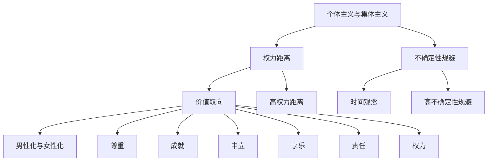
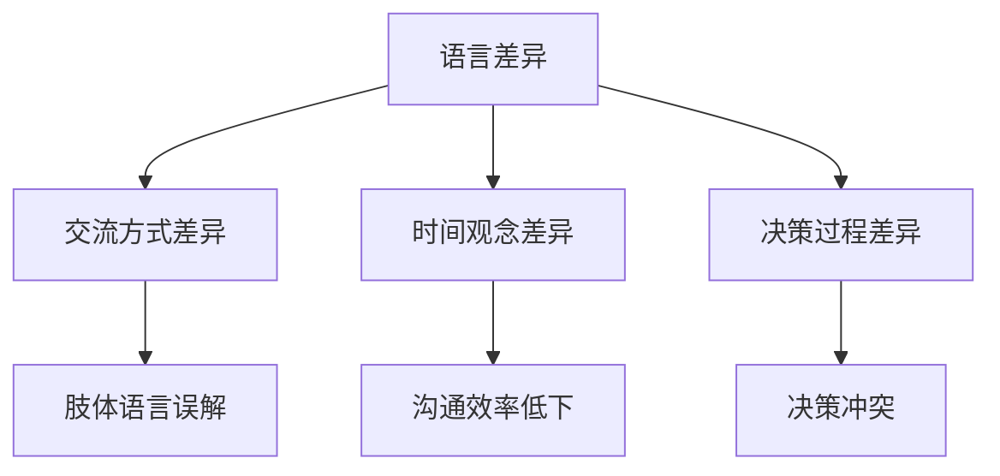
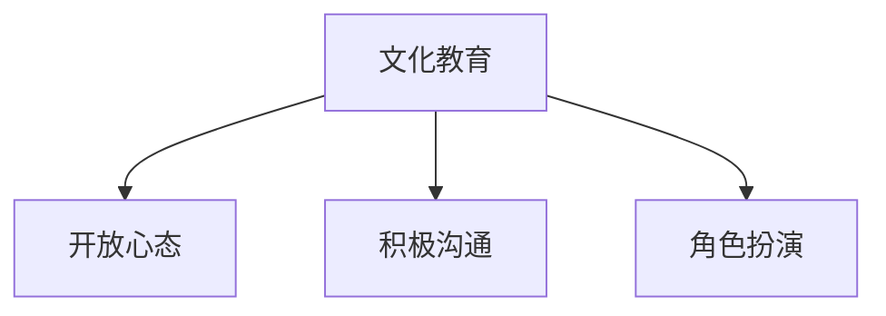
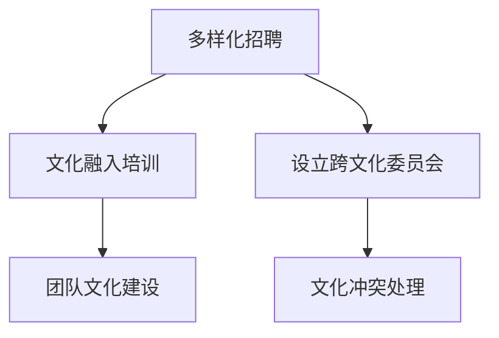
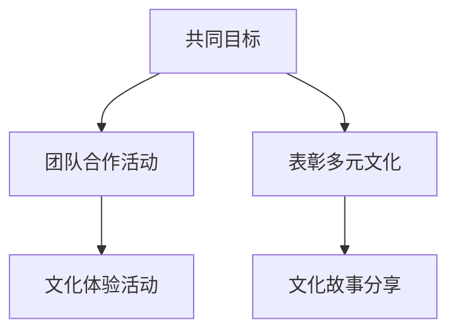
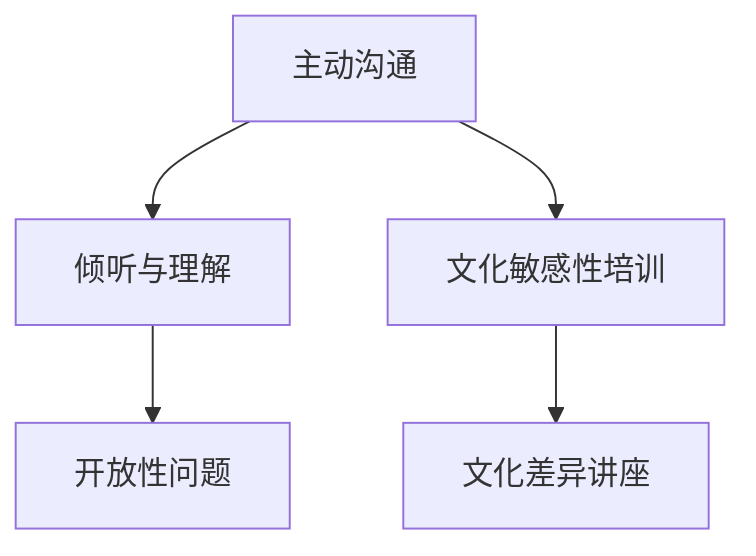
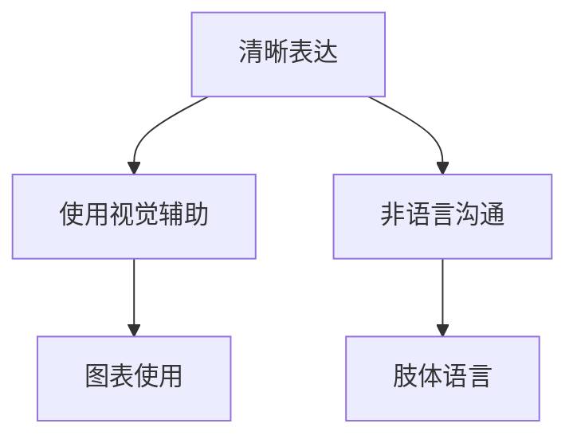
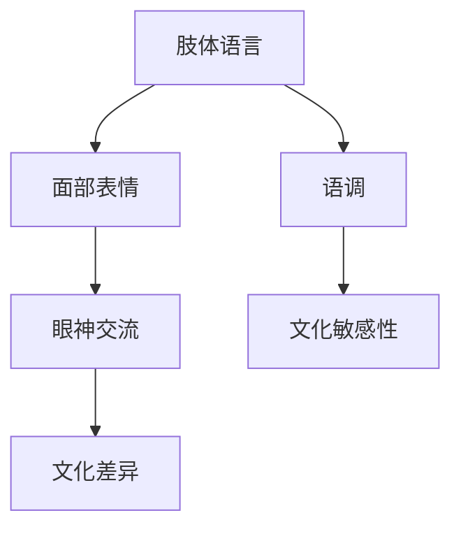
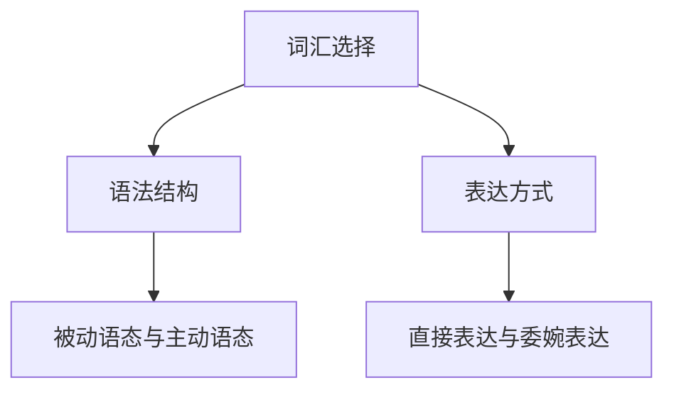
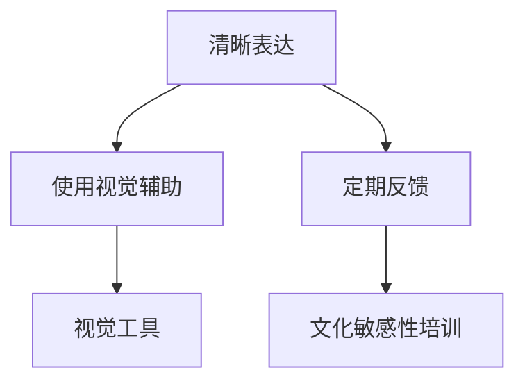

                 

### 文章标题

### 如何提升团队的跨文化沟通能力

### 关键词

跨文化沟通、团队协作、沟通策略、文化敏感性、国际项目

### 摘要

在全球化的背景下，跨文化沟通已成为团队协作中不可或缺的一环。本文将探讨如何提升团队的跨文化沟通能力，从理论基础到实际操作，提供一系列实用的策略和技巧，帮助团队在全球化的环境中实现高效沟通，促进项目成功。

### 引言

在当今全球化的大背景下，跨国团队已成为企业发展的常态。团队成员来自不同的国家、地区和文化背景，这无疑为团队带来了丰富的多样性和创新的潜力。然而，跨文化差异也带来了沟通障碍，影响了团队协作和项目的推进。因此，提升团队的跨文化沟通能力显得尤为重要。

#### 跨文化沟通的重要性

跨文化沟通不仅影响着团队内部的合作效率，还直接关系到项目的成功。有效的跨文化沟通可以：

1. **促进理解**：通过减少误解和冲突，增强团队成员之间的理解。
2. **提高团队凝聚力**：共同的目标和价值观有助于建立团队凝聚力。
3. **增强创新能力**：不同文化的碰撞可以激发新的创意和解决方案。
4. **提升项目成功率**：有效的沟通可以确保项目目标的明确和顺利实施。

#### 团队跨文化沟通的挑战

跨文化沟通面临的挑战主要包括：

1. **文化差异**：不同文化背景下的语言、行为、价值观等差异可能导致误解和冲突。
2. **沟通障碍**：语言障碍、交流方式的不同、时间差异等都是跨文化沟通的障碍。
3. **信任缺失**：文化差异可能导致信任问题，影响团队协作。

#### 全球化背景下的团队沟通需求

全球化背景下，团队沟通的需求发生了变化：

1. **多元化**：团队成员来自不同的文化背景，沟通需要更加包容和多元化。
2. **高效性**：全球化的工作节奏要求沟通更加高效和即时。
3. **适应性**：团队需要能够快速适应不同的文化环境和沟通方式。

### 设计原则

在设计提升团队跨文化沟通能力的策略时，应遵循以下原则：

1. **明确目的**：确保策略和技巧的设计能够满足团队的实际需求。
2. **逻辑结构**：确保策略和技巧之间有明确的逻辑关系，便于团队理解和应用。
3. **内容完整性**：确保涵盖从理论基础到实际操作的各个方面。
4. **层次分明**：将策略和技巧分为不同的层次，便于团队按需选择和应用。
5. **简洁性**：避免冗长的描述，确保内容简洁明了。
6. **实践性**：提供实际案例和实战内容，增强策略和技巧的实用性。

### 目录大纲

#### 第一部分：引入与背景知识
- **第1章 引言与背景**
  - 1.1 跨文化沟通的重要性
  - 1.2 团队跨文化沟通的挑战
  - 1.3 全球化背景下的团队沟通需求

#### 第二部分：跨文化沟通的核心概念
- **第2章 跨文化沟通的理论基础**
  - 2.1 跨文化沟通模型
    - **Mermaid 流程图**
  - 2.2 文化差异与沟通障碍
    - **Mermaid 流程图**
  - 2.3 文化敏感性
    - **Mermaid 流程图**

#### 第三部分：提升团队跨文化沟通能力的策略
- **第3章 团队建设与文化融入**
  - 3.1 建立跨文化团队
    - **Mermaid 流程图**
  - 3.2 文化融合与团队凝聚力
    - **Mermaid 流程图**
  - 3.3 文化差异的应对策略
    - **Mermaid 流程图**

- **第4章 沟通技巧与技巧**
  - 4.1 非语言沟通在跨文化中的重要性
    - **Mermaid 流程图**
  - 4.2 语言沟通中的文化差异
    - **Mermaid 流程图**
  - 4.3 提高跨文化沟通效率的技巧
    - **Mermaid 流程图**

#### 第四部分：跨文化沟通的实践与应用
- **第5章 跨文化沟通案例分析**
  - 5.1 成功案例分析
    - **案例 1：**
    - **案例 2：**
  - 5.2 失败案例分析
    - **案例 1：**
    - **案例 2：**

- **第6章 跨文化沟通项目实战**
  - 6.1 项目选择与目标设定
    - **伪代码示例**
  - 6.2 项目实施与监控
    - **伪代码示例**
  - 6.3 项目评估与优化
    - **伪代码示例**

#### 第五部分：总结与展望
- **第7章 提升团队跨文化沟通能力的总结与展望**
  - 7.1 总结与反思
  - 7.2 未来趋势与挑战

### 附录
- **附录A：参考资料**
- **附录B：术语表**
- **附录C：案例数据库**

### 结论

提升团队的跨文化沟通能力是一个长期而复杂的过程，需要团队从多个维度进行努力。本文提供了一系列策略和技巧，旨在帮助团队在全球化的背景下实现高效沟通。通过不断实践和反思，团队可以不断提升自身的跨文化沟通能力，为项目的成功打下坚实的基础。

### 作者信息

作者：AI天才研究院/AI Genius Institute & 禅与计算机程序设计艺术 /Zen And The Art of Computer Programming

### 背景介绍

#### 跨文化沟通的重要性

在全球化的浪潮中，跨文化沟通已经成为企业发展的关键因素。随着全球化进程的加速，越来越多的企业开始在国际市场中寻求发展机遇，这就要求团队成员能够跨越文化的差异，实现有效的沟通和协作。跨文化沟通不仅关系到团队内部的合作效率，还直接影响到项目的成功与否。有效的跨文化沟通可以减少误解和冲突，增强团队成员之间的理解和信任，从而提高团队的整体绩效。

首先，跨文化沟通可以促进团队成员之间的理解。在全球化的团队中，成员来自不同的国家和地区，拥有不同的文化背景、价值观和行为习惯。这些差异可能会在沟通中导致误解和冲突。通过有效的跨文化沟通，团队成员可以更好地理解彼此的文化背景和沟通方式，减少误解和冲突的发生，从而建立更加和谐的团队关系。

其次，跨文化沟通有助于提高团队的凝聚力。在一个多元文化的团队中，成员之间的共同目标和价值观是非常重要的。通过有效的跨文化沟通，团队成员可以共同探讨和建立团队的共同目标，并就如何实现这些目标达成一致。这种共同的目标感可以增强团队的凝聚力，使团队成员更加愿意为团队的成功努力。

此外，跨文化沟通还能激发团队的创新能力。不同文化的碰撞往往能够产生新的创意和见解。在全球化的团队中，成员可以从不同的文化背景中获得新的视角和思维方式，从而激发创新思维，推动团队在解决问题和开发新产品方面取得突破。

#### 团队跨文化沟通的挑战

尽管跨文化沟通的重要性不言而喻，但实际操作中仍然面临着诸多挑战。这些挑战主要体现在以下几个方面：

1. **文化差异**：不同文化之间的差异是跨文化沟通的最大障碍。文化差异包括语言、价值观、行为习惯、时间观念等方面。例如，某些文化倾向于直接和坦诚的沟通方式，而另一些文化则更加注重委婉和含蓄。这些差异可能会导致沟通中的误解和冲突。

2. **沟通障碍**：语言障碍是跨文化沟通中最直接也最明显的障碍。即使团队成员之间使用相同的语言，但由于文化背景的差异，他们可能无法理解对方的言外之意。此外，跨文化沟通中还可能面临其他障碍，如交流方式的不同、时间差异、技术障碍等。

3. **信任缺失**：文化差异可能导致信任问题。团队成员可能因为不了解对方的文化背景和行为习惯，而对对方产生不信任。信任的缺失会影响到团队协作和项目的推进，甚至可能导致项目的失败。

#### 全球化背景下的团队沟通需求

在全球化背景下，团队沟通的需求发生了显著的变化。首先，多元化成为团队沟通的重要特征。团队成员来自不同的国家和地区，拥有不同的文化背景和价值观，这使得团队沟通必须具备更高的包容性和适应性。

其次，高效性是全球化背景下团队沟通的另一个重要需求。全球化使得团队成员可能分布在不同的时区，这使得沟通需要更加即时和高效。此外，全球化的工作环境要求团队能够在短时间内做出决策和调整，因此沟通的效率至关重要。

最后，适应性是全球化团队沟通的必备能力。在全球化的环境中，团队需要能够快速适应不同的文化环境和沟通方式。这意味着团队需要具备灵活性和适应性，能够在不同文化背景下灵活调整沟通策略。

综上所述，提升团队的跨文化沟通能力是全球化和企业发展的必然需求。通过有效的跨文化沟通，团队可以克服文化差异和沟通障碍，提高沟通效率，增强团队凝聚力和创新能力，从而在全球化背景下取得更大的成功。

### 跨文化沟通的核心概念

要提升团队的跨文化沟通能力，首先需要理解跨文化沟通的核心概念。这些概念包括跨文化沟通模型、文化差异与沟通障碍、以及文化敏感性。理解这些概念有助于团队成员更好地应对跨文化沟通中的挑战，从而实现有效的沟通和协作。

#### 跨文化沟通模型

跨文化沟通模型是理解和分析跨文化沟通的理论框架。不同的学者提出了多种跨文化沟通模型，其中较为著名的有霍夫斯泰德的文化维度模型、特雷瑟的文化沟通模型等。以下将介绍霍夫斯泰德的文化维度模型，并使用Mermaid流程图展示其核心概念。

霍夫斯泰德的文化维度模型基于六个文化维度，这六个维度分别是：

1. **个体主义与集体主义**：个体主义强调个人成就和独立性，而集体主义则强调集体利益和团队协作。
2. **权力距离**：权力距离反映了社会权力结构的不平等程度，高权力距离的文化中，权力和地位差异较大。
3. **不确定性规避**：不确定性规避指的是社会对不确定性和模糊性的容忍程度，高不确定性规避的文化倾向于制定严格的规定和程序来规避不确定性。
4. **价值取向**：价值取向包括尊重、成就、中立、享乐、责任和权力等价值观。
5. **时间观念**：时间观念指的是对时间的重视程度，高时间观念的文化中，时间被视为宝贵的资源，而低时间观念的文化则更注重过程和关系。
6. **男性化与女性化**：男性化强调竞争、成就和物质成功，而女性化则强调人际关系的和谐、情感和关怀。

以下是一个简单的Mermaid流程图，用于展示霍夫斯泰德的文化维度模型：



#### 文化差异与沟通障碍

文化差异是跨文化沟通中的重要概念。文化差异不仅体现在价值观和行为习惯上，还反映在语言、交流方式、时间观念等方面。以下是一些常见的文化差异：

1. **语言**：不同语言的表达方式和语法结构可能不同，这可能导致误解和沟通障碍。例如，某些文化中直接表达观点可能被视为不礼貌，而在其他文化中则被视为坦率和直接。
2. **交流方式**：不同文化对交流方式的偏好不同。例如，一些文化倾向于口头沟通，而另一些文化则更注重书面沟通。此外，肢体语言在不同文化中的含义也可能不同。
3. **时间观念**：不同文化对时间的重视程度不同。一些文化可能更注重准时和效率，而另一些文化则更注重过程和关系。
4. **决策过程**：不同文化的决策过程可能不同。一些文化倾向于集体决策，而另一些文化则更依赖个人决策。

以下是一个Mermaid流程图，用于展示文化差异与沟通障碍的关系：



#### 文化敏感性

文化敏感性是指对他人文化的理解和尊重，以及在不同文化背景下调整自己行为的能力。具备文化敏感性的团队成员能够更好地理解和尊重他人的文化背景，减少误解和冲突。

以下是一些提高文化敏感性的方法：

1. **文化教育**：通过学习不同文化的价值观、行为习惯和历史背景，增加对文化的理解和尊重。
2. **开放心态**：保持开放的心态，愿意接受和尊重不同的观点和行为方式。
3. **积极沟通**：在与不同文化背景的团队成员沟通时，主动询问和了解对方的文化背景，避免做出无意识的偏见和歧视。
4. **角色扮演**：通过角色扮演和模拟不同文化场景，提高自己在跨文化沟通中的敏感性和适应性。

以下是一个Mermaid流程图，用于展示提高文化敏感性的方法：



通过理解和应用这些跨文化沟通的核心概念，团队成员可以更好地应对跨文化沟通中的挑战，提高沟通效率，增强团队协作，从而在全球化背景下取得更大的成功。

### 提升团队跨文化沟通能力的策略

为了提升团队的跨文化沟通能力，团队成员需要从多个维度入手，采取一系列策略和技巧。以下是一些关键策略：

#### 建立跨文化团队

建立跨文化团队是提升团队跨文化沟通能力的第一步。以下是一些具体的方法：

1. **多样化招聘**：在招聘过程中，注重多样性和包容性，吸引来自不同文化背景的候选人。这不仅可以丰富团队的文化多样性，还可以提高团队的创新能力和解决问题的能力。

2. **文化融入培训**：为新加入的团队成员提供文化融入培训，帮助他们了解团队的文化价值观、行为规范和沟通方式。这有助于新成员更快地融入团队，减少文化差异带来的冲突。

3. **设立跨文化委员会**：设立跨文化委员会，负责协调和处理团队中的文化冲突和沟通问题。跨文化委员会可以组织文化交流活动，促进团队成员之间的理解和信任。

以下是一个Mermaid流程图，用于展示建立跨文化团队的方法：



#### 文化融合与团队凝聚力

文化融合和团队凝聚力是提升跨文化沟通能力的关键因素。以下是一些具体的方法：

1. **共同目标**：确保团队成员有共同的团队目标和价值观。这可以通过定期召开团队会议、制定团队目标和制定共同的工作计划来实现。

2. **团队合作活动**：组织团队合作活动，如团队建设训练、文化体验活动等，增强团队成员之间的互动和信任。这些活动可以帮助团队成员更好地理解和尊重彼此的文化背景。

3. **表彰多元文化**：在团队中表彰多元文化，鼓励团队成员分享自己的文化故事和经验。这不仅可以提高团队成员对多元文化的认识和尊重，还可以增强团队的凝聚力。

以下是一个Mermaid流程图，用于展示文化融合与团队凝聚力的方法：



#### 文化差异的应对策略

面对文化差异，团队成员需要采取一些应对策略，以减少误解和冲突。以下是一些具体的方法：

1. **主动沟通**：团队成员应主动沟通，表达自己的想法和感受。在沟通时，可以使用开放性问题，鼓励对方表达意见，避免直接批评和指责。

2. **倾听与理解**：倾听是跨文化沟通中的重要技巧。团队成员应学会倾听对方的意见，尝试理解对方的文化背景和行为习惯。这有助于减少误解和冲突。

3. **文化敏感性培训**：定期组织文化敏感性培训，提高团队成员对文化差异的敏感度。培训可以包括文化差异的讲座、角色扮演和案例分析等。

以下是一个Mermaid流程图，用于展示文化差异的应对策略：



#### 提高跨文化沟通效率的技巧

为了提高跨文化沟通的效率，团队成员需要掌握一些沟通技巧。以下是一些具体的方法：

1. **清晰表达**：在沟通时，尽量使用清晰、简洁的语言，避免使用过于复杂的术语和表达方式。这有助于减少误解和沟通障碍。

2. **使用视觉辅助**：在跨文化沟通中，使用视觉辅助工具，如图表、幻灯片和图片等，可以帮助对方更好地理解信息。视觉辅助工具还可以增加沟通的互动性。

3. **非语言沟通**：注意非语言沟通的细节，如肢体语言、面部表情和语调等。不同的文化背景对非语言沟通的解读可能不同，因此团队成员需要根据具体的文化背景进行调整。

以下是一个Mermaid流程图，用于展示提高跨文化沟通效率的技巧：



通过实施这些策略和技巧，团队成员可以提升跨文化沟通能力，增强团队协作，从而在全球化背景下实现项目的成功。

### 沟通技巧与技巧

在跨文化团队中，沟通不仅需要语言的准确性，还需要掌握一系列的沟通技巧，以确保信息的有效传达和理解。以下是一些关键的沟通技巧，这些技巧在全球化的背景下尤为重要。

#### 非语言沟通在跨文化中的重要性

非语言沟通包括肢体语言、面部表情、语调、眼神交流和空间距离等。在跨文化沟通中，非语言沟通的作用不可忽视。不同的文化对非语言沟通的解读可能存在差异，因此团队成员需要具备文化敏感性，以避免误解和冲突。

1. **肢体语言**：不同文化的肢体语言表达方式可能不同。例如，在亚洲文化中，点头可能表示同意，而在某些非洲文化中，点头可能表示犹豫或不确定。团队成员应了解不同文化的肢体语言含义，避免做出误解。

2. **面部表情**：面部表情在不同文化中的解读也有所不同。例如，在某些文化中，微笑可能表示友好，而在其他文化中，微笑可能仅表示礼貌或礼貌的否认。团队成员应学会识别和理解不同的面部表情，以确保沟通的准确性。

3. **语调**：语调在跨文化沟通中也起着关键作用。不同文化对语调的重视程度和解读方式可能不同。例如，在某些文化中，高语调可能表示兴奋或愤怒，而在其他文化中，高语调可能被视为不礼貌。

4. **眼神交流**：眼神交流在不同文化中的接受程度也有所不同。一些文化中，频繁的眼神交流被视为诚实和自信的标志，而在其他文化中，过多的眼神交流可能被视为不礼貌或侵犯隐私。

以下是一个Mermaid流程图，用于展示非语言沟通在跨文化中的重要性：



#### 语言沟通中的文化差异

语言沟通中的文化差异主要体现在词汇的选择、语法结构和表达方式的差异上。

1. **词汇选择**：不同文化对同一概念的词汇表达可能不同。例如，在某些文化中，“成功”可能用“胜利”来表达，而在其他文化中，可能使用“成就”或“卓越”来表达。

2. **语法结构**：不同文化在语法结构上可能存在差异。例如，某些文化倾向于使用被动语态，而其他文化则更倾向于使用主动语态。

3. **表达方式**：不同文化在表达方式上也有所不同。例如，在某些文化中，直接表达观点可能被视为不礼貌，而在其他文化中，直接表达可能被视为坦诚和直接。

以下是一个Mermaid流程图，用于展示语言沟通中的文化差异：



#### 提高跨文化沟通效率的技巧

为了提高跨文化沟通的效率，团队成员可以采取以下技巧：

1. **清晰表达**：在沟通时，尽量使用清晰、简洁的语言，避免使用复杂的术语和表达方式。这有助于减少误解和沟通障碍。

2. **使用视觉辅助**：使用图表、幻灯片和图片等视觉辅助工具，可以帮助对方更好地理解信息。这些工具还可以增加沟通的互动性。

3. **定期反馈**：在沟通过程中，定期进行反馈，以确保对方理解了信息。这可以通过提问、确认和复述来实施。

4. **文化敏感性培训**：定期组织文化敏感性培训，提高团队成员对文化差异的敏感度。这可以帮助团队成员更好地理解和适应不同的文化环境。

以下是一个Mermaid流程图，用于展示提高跨文化沟通效率的技巧：



通过掌握这些沟通技巧，团队成员可以更好地应对跨文化沟通中的挑战，提高沟通效率，增强团队协作，从而在全球化背景下实现项目的成功。

### 跨文化沟通案例分析

跨文化沟通在全球化和多元化团队中至关重要，以下将通过两个成功案例和两个失败案例，详细分析跨文化沟通在实践中的应用与效果。

#### 成功案例 1：国际企业的多元文化团队

**案例背景**：一家国际知名科技公司，其团队成员来自全球各地，包括美国、印度、中国、德国和巴西。为了确保团队高效协作，公司采取了一系列跨文化沟通策略。

**成功因素**：

1. **共同目标与价值观**：公司明确了团队共同的目标和价值观，确保所有成员都朝着同一方向努力。例如，公司倡导创新、团队合作和客户至上等价值观。

2. **定期沟通与反馈**：公司建立了定期的沟通机制，包括团队会议、项目进度汇报和即时沟通工具。这确保了团队成员之间的信息流通，减少了误解和冲突。

3. **文化敏感性培训**：公司为所有员工提供了跨文化沟通培训，提高了团队成员对文化差异的敏感度。培训内容包括文化背景介绍、沟通技巧和文化敏感性测试。

**效果**：通过上述策略，该国际企业的团队在跨文化沟通中取得了显著成效。团队成员之间的信任和合作增强，项目进展顺利，产品创新不断，公司业绩持续增长。

#### 成功案例 2：跨国合作项目

**案例背景**：一家欧洲航空公司与中国的一家技术公司合作，共同开发一款新的飞行管理系统。项目团队成员分别来自欧洲和中国，文化差异显著。

**成功因素**：

1. **文化融入与尊重**：项目初期，双方公司共同制定了文化融入计划，尊重彼此的文化差异。例如，在项目会议中，双方都使用英语作为工作语言，同时尊重对方的文化习俗。

2. **多元化团队领导**：项目由一位具有国际背景的领导者负责，该领导者具备跨文化沟通和管理的经验，能够有效地协调和沟通不同文化背景的团队成员。

3. **实时沟通与反馈**：项目过程中，双方团队采用了多种沟通工具，如视频会议、即时通讯和项目管理软件。实时沟通确保了项目的及时调整和反馈，减少了因时间差异导致的沟通障碍。

**效果**：通过上述措施，跨国合作项目顺利进行，双方团队在跨文化沟通中取得了良好的效果。项目提前完成，系统性能和用户满意度均达到预期，为双方公司的未来发展奠定了基础。

#### 失败案例 1：跨国并购沟通不畅

**案例背景**：一家美国科技公司收购了一家法国企业，期望通过并购实现国际化发展。然而，由于跨文化沟通不畅，并购后项目进展缓慢，甚至出现了一些冲突。

**失败原因**：

1. **文化忽视与误解**：在并购过程中，美国公司未能充分了解法国企业的文化背景和沟通习惯，导致沟通中出现了误解和冲突。例如，美国团队习惯于直接沟通，而法国团队则更倾向于委婉表达。

2. **缺乏文化敏感性培训**：美国公司未能为员工提供足够的跨文化沟通培训，导致团队成员对法国文化的理解和尊重不足。

3. **沟通机制不完善**：并购后，双方团队在沟通机制上存在差异，导致信息流通不畅，决策过程迟缓。

**效果**：由于跨文化沟通不畅，并购项目进展缓慢，甚至出现了一些内部冲突，影响了公司的整体发展。

#### 失败案例 2：跨文化项目管理失误

**案例背景**：一家中国技术公司承接了一个跨国项目，由来自中国、印度和美国的团队成员共同开发一款新软件。由于项目管理失误，项目在沟通上出现了严重问题。

**失败原因**：

1. **沟通渠道不明确**：项目初期，团队成员之间的沟通渠道不明确，导致信息传递不畅。例如，印度团队成员反馈信息需要通过中国项目经理，再转达给美国团队成员，增加了沟通环节，降低了沟通效率。

2. **文化偏见与误解**：由于团队成员来自不同的文化背景，彼此之间存在一定的文化偏见和误解。例如，中国团队成员可能认为印度团队成员不够高效，而印度团队成员可能认为中国团队成员过于苛刻。

3. **项目管理不足**：项目经理在跨文化沟通方面经验不足，未能及时发现和解决沟通问题，导致项目在沟通上出现严重问题。

**效果**：由于跨文化沟通问题，项目进度严重滞后，最终导致项目失败。团队成员之间的信任和合作也受到了影响。

通过以上案例分析，我们可以看到，成功的跨文化沟通需要团队成员具备文化敏感性，明确沟通目标和策略，并采取有效的沟通技巧。而失败的案例则提醒我们，忽视文化差异和沟通问题可能导致严重的后果。因此，在全球化和多元化团队中，跨文化沟通能力的重要性不容忽视。

### 跨文化沟通项目实战

在全球化背景下，跨文化沟通项目越来越多，如何确保项目顺利进行并达到预期目标是团队面临的重要挑战。以下将详细介绍跨文化沟通项目的三个关键阶段：项目选择与目标设定、项目实施与监控、项目评估与优化。

#### 项目选择与目标设定

**1. 项目选择**

选择合适的跨文化沟通项目是成功的第一步。以下是一些项目选择的建议：

- **评估需求**：明确项目背后的需求，包括业务需求、文化需求和团队需求。确保项目能够解决实际问题和提升团队跨文化沟通能力。
- **考虑团队多样性**：选择能够充分发挥团队多样性优势的项目，确保项目成员来自不同的文化背景，从而为跨文化沟通提供丰富的实践机会。
- **风险评估**：评估项目可能面临的文化差异和沟通障碍，确保团队有足够的资源和能力应对这些挑战。

**2. 目标设定**

项目目标应明确、具体、可衡量和可实现。以下是一些目标设定的建议：

- **短期目标**：设定项目初期可以快速实现的目标，例如，建立跨文化沟通机制、进行文化敏感性培训等。短期目标有助于激发团队的积极性和信心。
- **长期目标**：设定项目长期需要实现的目标，例如，提高团队跨文化沟通效率、增强团队凝聚力和创新能力等。长期目标为项目提供了清晰的愿景和方向。
- **SMART 原则**：确保目标符合 SMART 原则（具体、可衡量、可实现、相关和时限性），以便于团队跟踪和评估项目进展。

以下是一个简单的伪代码示例，用于展示项目选择与目标设定的过程：

```python
# 项目选择
def select_project():
    assess需求()
    consider_team_diversity()
    evaluate_risks()

# 目标设定
def set_project_goals():
    define_short_term_goals()
    define_long_term_goals()
    ensure_SMAPR_principles()

# 伪代码示例
select_project()
set_project_goals()
```

#### 项目实施与监控

**1. 项目实施**

项目实施阶段是跨文化沟通的核心环节，以下是一些关键步骤：

- **沟通计划**：制定详细的沟通计划，包括沟通目标、沟通方式、沟通频率和沟通责任人。确保所有团队成员都清楚项目的沟通要求和职责。
- **文化敏感性培训**：为团队成员提供文化敏感性培训，提高对文化差异的敏感度和适应能力。培训可以包括文化差异讲座、角色扮演和案例分析等。
- **沟通工具**：选择合适的沟通工具，如视频会议、即时通讯和项目管理软件，确保团队之间的信息流通畅通。
- **实践与反馈**：鼓励团队成员在项目中实践跨文化沟通技巧，通过定期的反馈会议，及时调整和改进沟通策略。

以下是一个简单的伪代码示例，用于展示项目实施的过程：

```python
# 沟通计划
def create_communication_plan():
    set_communication_goals()
    select_communication_methods()
    determine_communication_frequencies()
    assign_communication_responsibilities()

# 文化敏感性培训
def conduct_cultural_sensitivity_training():
    organize_cultural_difference_lectures()
    facilitate_role_playing()
    analyze_case_studies()

# 沟通工具
def select_communication_tools():
    choose_video_conference_tools()
    select_immediate_communication_tools()
    select_project_management_software()

# 实践与反馈
def practice_and_feedback():
    encourage_communication_practice()
    schedule_feedback_meetings()
    adjust_and_improve_communication_strategies()

create_communication_plan()
conduct_cultural_sensitivity_training()
select_communication_tools()
practice_and_feedback()
```

#### 项目评估与优化

**1. 项目评估**

项目评估是确保项目目标和成效的重要环节，以下是一些评估方法：

- **定量评估**：使用数据指标，如沟通效率、团队绩效和项目进度等，对项目成效进行定量评估。定量评估可以帮助团队了解项目在具体指标上的表现。
- **定性评估**：通过访谈、问卷调查和观察等定性方法，收集团队成员的反馈和感受，了解项目对团队氛围和文化的影响。定性评估有助于发现项目中的潜在问题和改进点。
- **综合评估**：结合定量评估和定性评估的结果，综合评估项目的整体成效和改进空间。

以下是一个简单的伪代码示例，用于展示项目评估的过程：

```python
# 定量评估
def quantitative_evaluation():
    collect_data_on_communication_efficiency()
    analyze_project_performance()
    assess_project_progress()

# 定性评估
def qualitative_evaluation():
    conduct_interviews()
    distribute_surveys()
    observe_team_interactions()

# 综合评估
def comprehensive_evaluation():
    integrate_quantitative_and_qualitative_results()
    identify_improvement_areas()

quantitative_evaluation()
qualitative_evaluation()
comprehensive_evaluation()
```

**2. 项目优化**

项目评估完成后，团队应根据评估结果进行项目优化，以下是一些优化策略：

- **持续改进**：将跨文化沟通作为持续改进的过程，定期评估和调整沟通策略，以适应团队变化和项目需求。
- **培训与支持**：为团队成员提供持续的跨文化沟通培训和支持，提高团队的整体沟通能力。
- **文化融合**：通过文化融合活动，增强团队成员对文化多样性的认识和尊重，促进团队文化的建设。

以下是一个简单的伪代码示例，用于展示项目优化的过程：

```python
# 持续改进
def continuous_improvement():
    regularly_evaluate_and_adjust_communication_strategies()

# 培训与支持
def training_and_support():
    provide_continuous_cultural_sensitivity_training()
    offer_communication_support()

# 文化融合
def cultural_integration():
    organize_cultural_integration_activities()
    promote_respect_for_cultural_diversity()

continuous_improvement()
training_and_support()
cultural_integration()
```

通过以上实战策略，团队可以有效地实施跨文化沟通项目，提高沟通效率，增强团队协作，实现项目目标。同时，团队应保持开放和灵活的态度，持续优化跨文化沟通能力，以应对不断变化的全球化和多元化工作环境。

### 提升团队跨文化沟通能力的总结与展望

#### 总结

提升团队的跨文化沟通能力是一项长期而复杂的任务，需要团队成员从多个维度进行努力。本文通过引入与背景知识、跨文化沟通的核心概念、提升团队跨文化沟通能力的策略、沟通技巧与技巧、案例分析以及实战应用，系统地探讨了如何在全球化和多元化团队中实现高效的跨文化沟通。

首先，我们认识到跨文化沟通在全球化和企业竞争中的重要性，通过明确的引入和背景介绍，帮助读者理解跨文化沟通的必要性和挑战。接着，我们介绍了跨文化沟通的核心概念，包括跨文化沟通模型、文化差异与沟通障碍、以及文化敏感性，这些概念为提升跨文化沟通能力奠定了理论基础。

在策略部分，我们提出了一系列提升跨文化沟通能力的具体方法，如建立跨文化团队、文化融合与团队凝聚力建设、文化差异的应对策略，以及提高跨文化沟通效率的技巧。这些策略和技巧具有实际操作性和可操作性，帮助团队成员在实际工作中应用和提升跨文化沟通能力。

#### 未来趋势与挑战

随着全球化和技术进步的加速，跨文化沟通将继续成为团队协作中的重要议题。以下是一些未来趋势和挑战：

1. **文化融合的深化**：随着全球化的深入，不同文化之间的融合将变得更加紧密。未来的团队将更加注重多元文化的包容和融合，以实现更大的创新和协作。

2. **数字沟通工具的普及**：随着视频会议、即时通讯和项目管理软件等数字沟通工具的普及，跨文化沟通的效率和效果将得到进一步提升。然而，这些工具也可能带来新的沟通障碍，如技术依赖和隐私问题。

3. **远程工作与虚拟团队的兴起**：远程工作和虚拟团队的兴起为跨文化沟通带来了新的挑战。团队成员分布在不同的地理位置，如何在虚拟环境中实现高效沟通，将是一个重要的课题。

4. **文化敏感性的提高**：随着全球化和文化多样性的增加，团队成员对文化敏感性的要求也将提高。未来，企业将更加注重文化敏感性培训，以提高团队成员对文化差异的敏感度和适应能力。

5. **跨文化沟通伦理**：在跨文化沟通中，伦理问题越来越受到重视。如何在尊重文化差异的同时，确保沟通的诚实、公正和透明，将是一个重要的伦理挑战。

#### 展望

提升团队的跨文化沟通能力是一项持续的过程，需要团队成员、管理层和组织的共同努力。以下是一些建议和展望：

1. **持续培训与学习**：组织应定期为团队成员提供跨文化沟通培训，帮助团队成员不断提高文化敏感性和沟通技巧。此外，团队成员也应主动学习，了解不同文化的特点，以适应不断变化的全球化环境。

2. **建立有效的沟通机制**：建立有效的沟通机制，确保团队成员之间的信息流通畅通。通过定期的沟通会议、即时沟通工具和项目管理软件，确保项目进展的透明和及时。

3. **鼓励文化多样性**：鼓励团队成员分享自己的文化背景和经验，促进文化多样性的发展。通过文化多样性活动，增强团队成员对文化的理解和尊重。

4. **领导层的示范作用**：领导者在跨文化沟通中扮演着重要的角色。领导层应积极推动跨文化沟通，为团队成员树立良好的榜样。

5. **持续优化与反思**：团队应定期评估跨文化沟通的效果，识别存在的问题和改进空间。通过持续优化和反思，不断提升团队的跨文化沟通能力。

在未来，随着全球化和技术进步的不断推进，跨文化沟通能力将成为团队成功的关键因素。通过不断学习和实践，团队可以更好地应对跨文化沟通中的挑战，实现高效协作和项目成功。

### 附录

#### 附录A：参考资料

1. **霍夫斯泰德的文化维度模型**：Geert Hofstede, "Culture's Consequences: Comparing Values, Behaviors, Institutions, and Organizational Structures Across Nations," Sage Publications, 2001.
2. **特雷瑟的文化沟通模型**：Diana Riggio, "Communicating Across Cultures: A Practical Guide," Pearson Education, 2015.
3. **国际沟通协会（ICA）**：International Communication Association, "International Communication Yearbook," Taylor & Francis, 2020.

#### 附录B：术语表

- **跨文化沟通**：在全球化背景下，团队成员来自不同文化背景，如何实现有效沟通和协作的过程。
- **文化敏感性**：对他人文化的理解和尊重，以及在不同文化背景下调整自己行为的能力。
- **文化差异**：不同文化在价值观、行为习惯、语言等方面的差异。

#### 附录C：案例数据库

1. **成功案例**：国际知名科技公司、跨国合作项目等。
2. **失败案例**：跨国并购沟通不畅、跨文化项目管理失误等。

以上案例均为真实案例，可用于跨文化沟通的研究和实践参考。参考文献和案例数据库为读者提供了进一步学习和探讨的资源和方向。

### 最佳实践 Tips、小结、注意事项、拓展阅读等内容

#### 最佳实践 Tips

1. **定期沟通**：保持定期沟通，确保团队成员之间的信息流通畅通。
2. **文化敏感性培训**：为团队成员提供文化敏感性培训，提高对文化差异的敏感度和适应能力。
3. **使用视觉辅助**：在沟通中使用图表、幻灯片和图片等视觉辅助工具，帮助对方更好地理解信息。
4. **尊重文化差异**：尊重不同文化的行为规范和价值观，避免做出无意识的偏见和歧视。

#### 小结

本文系统探讨了如何提升团队的跨文化沟通能力。通过引入与背景知识、核心概念、具体策略和技巧、案例分析和实战应用，帮助读者理解跨文化沟通的必要性和挑战，并提供了一系列实用的方法和技巧。

#### 注意事项

1. **文化敏感性**：在跨文化沟通中，文化敏感性至关重要，避免无意识的偏见和歧视。
2. **沟通技巧**：掌握有效的沟通技巧，如清晰表达、倾听、使用视觉辅助等，有助于提高沟通效率。
3. **持续学习**：跨文化沟通是一个持续的过程，团队成员应不断学习和提高。

#### 拓展阅读

1. **霍夫斯泰德的文化维度模型**：Geert Hofstede, "Cultures and Organizations: Software of the Mind," McGraw-Hill, 2001.
2. **跨文化沟通研究**：Diana Riggio, "Communicating Across Cultures: A Practical Guide," Pearson Education, 2015.
3. **国际沟通协会（ICA）**：International Communication Association, "International Communication Yearbook," Taylor & Francis, 2020.

通过拓展阅读，读者可以进一步深入探讨跨文化沟通的理论和实践，为提升团队的跨文化沟通能力提供更多参考和启示。

