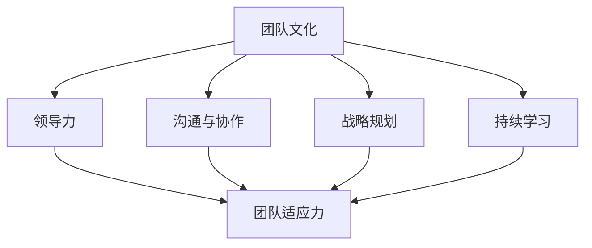
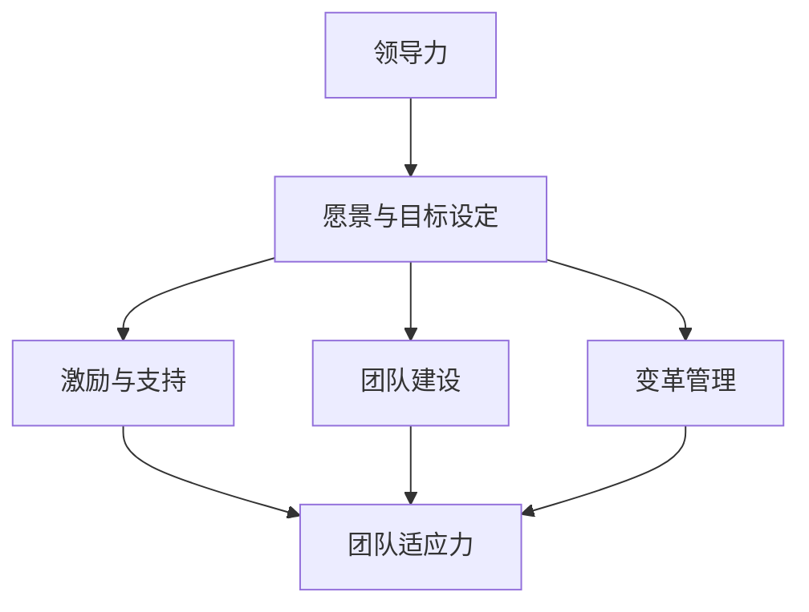
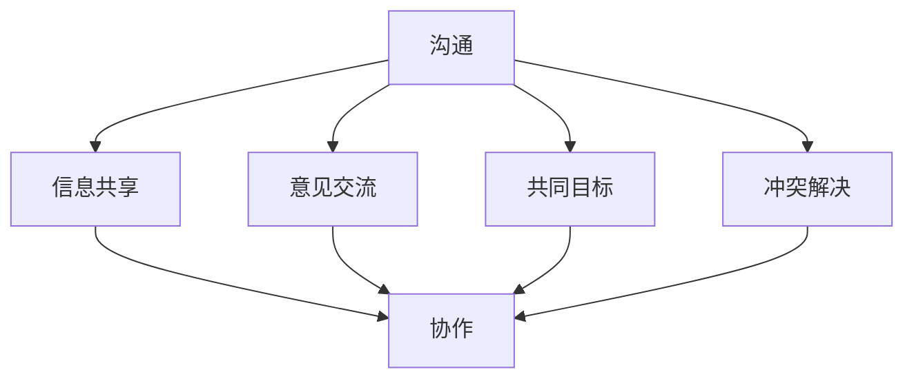
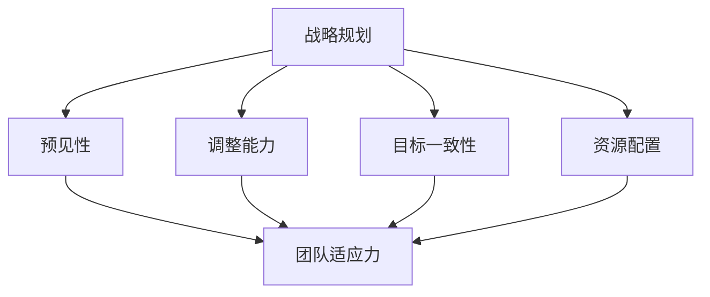
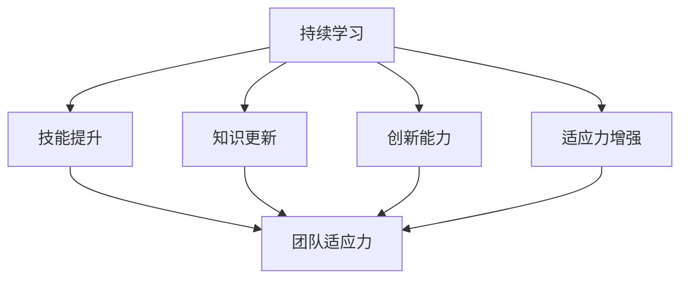

                 

### 文章标题

### 如何提高团队的适应力和灵活性

> 关键词：团队管理、适应力、灵活性、领导力、沟通、战略规划

> 摘要：本文将深入探讨如何提高团队适应力和灵活性，从团队文化、领导力、沟通、战略规划和持续学习五个方面提出具体策略和方法，通过实例分析，帮助团队在快速变化的环境中保持竞争优势。

----------------------------------------------------------------

### 引言

在现代企业环境中，变化是唯一不变的定律。技术进步、市场动态、竞争压力等多方面因素共同促使企业不断调整战略和战术。在这种背景下，团队的适应力和灵活性显得尤为重要。一个具有高度适应力和灵活性的团队能够迅速响应外部变化，有效应对挑战，从而保持竞争力。本文将从多个角度详细探讨如何提升团队的适应力和灵活性，帮助团队在快速变化的市场中立足。

### 背景介绍

团队适应力和灵活性是指团队在面对变化和不确定性时，能够迅速调整策略、方法和行为的能力。这种能力不仅仅体现在应对突发危机上，还包括对市场机会的及时把握、对新技术的快速应用、对团队内部沟通和协作的有效优化等多个方面。

在全球化和技术迅猛发展的背景下，企业的成功越来越依赖于团队的适应力和灵活性。传统的方法和流程可能很快就会过时，而那些能够不断学习和调整策略的团队，往往能够在激烈的竞争中脱颖而出。

### 核心概念与联系

为了更好地理解团队适应力和灵活性的提升，我们需要了解以下几个核心概念：

1. **团队文化**：团队文化是团队成员共同遵循的价值观、信念和行为模式。一个积极、开放、包容的团队文化有助于提高团队的适应力和灵活性。

2. **领导力**：领导者在团队适应力和灵活性提升中起着至关重要的作用。通过有效的领导力，领导者可以激发团队成员的潜力，引导团队适应变化。

3. **沟通与协作**：高效的沟通和协作是团队适应力和灵活性的基石。团队成员之间的有效沟通能够减少误解和冲突，提高团队的整体效能。

4. **战略规划**：灵活的战略规划能够使团队在不确定的环境中保持稳定和方向，从而提高团队适应力。

5. **持续学习**：持续学习是团队保持适应力和灵活性的关键。通过不断学习新知识、新技能，团队能够快速适应环境变化。

下面是一个Mermaid流程图，展示了这些核心概念之间的联系：



### 核心概念与联系（续）

#### 领导力与团队适应力

领导力在团队适应力的提升中起着至关重要的作用。一个优秀的领导者不仅能够设定清晰的目标和方向，还能够激励团队成员克服困难，积极应对变化。以下是领导力与团队适应力之间的几个关键联系：

1. **愿景与目标设定**：领导者需要具备远见，能够为团队设定明确的愿景和目标。这种愿景和目标应具备适应性和灵活性，能够随着环境的变化进行调整。

2. **激励与支持**：领导者应当激励团队成员，提供必要的支持和资源，帮助他们在面对挑战时保持积极态度和行动力。

3. **团队建设**：通过团队建设活动，领导者可以增强团队成员之间的信任和合作，从而提高团队的整体适应力。

4. **变革管理**：在变化发生时，领导者需要扮演变革推动者的角色，引导团队成员接受变化，并积极参与变革过程。

以下是领导力与团队适应力的联系图：



#### 沟通与协作

沟通是团队协作的核心。高效的沟通能够确保团队成员理解彼此的需求和期望，减少误解和冲突，提高团队的整体效能。以下是沟通与协作之间的关键联系：

1. **信息共享**：团队成员之间应当实现信息共享，确保每个人都能获取到与工作相关的信息，从而做出更好的决策。

2. **意见交流**：团队成员应当有机会表达自己的观点和想法，这有助于发现潜在的问题和机会，促进创新和改进。

3. **共同目标**：通过沟通，团队成员可以共同确定目标，确保每个人的努力都是朝着同一个方向。

4. **冲突解决**：高效的沟通能够帮助团队在出现冲突时迅速找到解决方案，避免问题扩大。

以下是沟通与协作的联系图：



#### 战略规划

战略规划是团队适应力的重要组成部分。灵活的战略规划能够使团队在不确定的环境中保持稳定和方向。以下是战略规划与团队适应力之间的关键联系：

1. **预见性**：通过战略规划，团队可以预见未来的变化和挑战，提前做好准备。

2. **调整能力**：灵活的战略规划使团队能够在面对变化时迅速调整策略，保持竞争力。

3. **目标一致性**：战略规划确保团队目标与组织目标一致，提高团队的协同效应。

4. **资源配置**：战略规划帮助团队合理分配资源，确保资源用于最需要的地方。

以下是战略规划与团队适应力的联系图：



#### 持续学习

持续学习是团队保持适应力和灵活性的关键。通过不断学习新知识、新技能，团队能够快速适应环境变化。以下是持续学习与团队适应力之间的关键联系：

1. **技能提升**：持续学习使团队成员不断提升技能，增强团队的整体实力。

2. **知识更新**：随着技术的迅速发展，团队成员需要不断学习新知识，以保持竞争力。

3. **创新能力**：持续学习激发团队成员的创新思维，推动团队不断改进和创新。

4. **适应力增强**：通过持续学习，团队能够更快地适应新环境和变化。

以下是持续学习与团队适应力的联系图：



### 核心算法原理讲解

为了使团队适应力和灵活性提升策略更加具体和可操作，我们可以使用以下伪代码来描述核心算法原理：

```plaintext
function ImproveTeamAdaptabilityAndFlexibility(team)
    team.adaptability = initialAdaptability
    team.flexibility = initialFlexibility
    
    // 增强团队文化
    team.culture = BuildTeamCulture(team)
    
    // 提高领导力
    leadership = EnhanceLeadership(team)
    
    // 加强沟通与协作
    communication = ImproveCommunication(team)
    
    // 制定灵活的战略规划
    strategy = DevelopFlexibleStrategy(team)
    
    // 持续学习
    learning = FosterContinuousLearning(team)
    
    // 迭代优化
    while (true)
        team.adaptability = UpdateAdaptability(team, leadership, communication, strategy, learning)
        team.flexibility = UpdateFlexibility(team, leadership, communication, strategy, learning)
        
        // 检查是否达到预期目标
        if (team.adaptability >= targetAdaptability and team.flexibility >= targetFlexibility)
            break
    
    return team
end function
```

### 数学模型和公式

在提升团队适应力和灵活性时，我们可以使用以下数学模型和公式来量化评估团队的状态：

1. **团队适应力评估公式**：

   $$ Adaptability = \frac{LC \times EC \times CS \times SL}{D} $$

   其中：
   - \( LC \)：领导力系数
   - \( EC \)：沟通效率系数
   - \( CS \)：战略规划能力系数
   - \( SL \)：持续学习能力系数
   - \( D \)：团队阻力系数

2. **团队灵活性评估公式**：

   $$ Flexibility = \frac{CC \times LC \times AS \times SL}{C} $$

   其中：
   - \( CC \)：协作能力系数
   - \( LC \)：领导力系数
   - \( AS \)：适应性策略系数
   - \( SL \)：持续学习能力系数
   - \( C \)：外部环境变化系数

### 详细讲解与举例说明

为了更具体地说明如何提升团队适应力和灵活性，以下是一个详细的示例：

#### 示例：提高团队适应力的步骤

1. **领导力提升**：

   - **目标**：提高领导力，使团队在面对变化时更具适应力。
   - **策略**：定期组织领导力培训，引入外部专家进行指导，建立反馈机制。

   ```latex
   \text{领导力系数 (LC)} = 1.2
   ```

2. **沟通与协作提升**：

   - **目标**：加强团队成员之间的沟通和协作，提高信息传递效率。
   - **策略**：采用敏捷开发方法，定期进行团队会议和回顾，使用协作工具。

   ```latex
   \text{沟通效率系数 (EC)} = 1.5
   ```

3. **战略规划能力提升**：

   - **目标**：制定灵活的战略规划，使团队能够快速响应市场变化。
   - **策略**：引入外部咨询，定期进行市场分析和竞争分析，制定灵活的战略计划。

   ```latex
   \text{战略规划能力系数 (CS)} = 1.3
   ```

4. **持续学习能力提升**：

   - **目标**：鼓励团队成员持续学习新知识、新技能，增强团队适应力。
   - **策略**：定期组织内部培训，提供学习资源，鼓励员工参加外部培训。

   ```latex
   \text{持续学习能力系数 (SL)} = 1.4
   ```

5. **团队适应力评估**：

   使用上述公式进行计算，得到团队适应力：

   ```latex
   \text{团队适应力 (Adaptability)} = \frac{1.2 \times 1.5 \times 1.3 \times 1.4}{D}
   ```

   其中 \( D \) 为团队阻力系数，根据具体情况设定。

### 项目实战

#### 开发环境搭建

为了提升团队的适应力和灵活性，我们首先需要搭建一个高效的开发环境。以下是具体步骤：

1. **工具选择**：选择合适的开发工具和平台，如Jenkins、Docker、Kubernetes等。
2. **环境配置**：配置自动化部署和持续集成/持续交付（CI/CD）流程，确保代码的快速迭代和部署。
3. **代码管理**：使用Git等版本控制工具，确保代码的版本管理和协作开发。

#### 源代码实现与解读

以下是一个简化的示例代码，展示了如何实现一个自适应的系统架构：

```java
public class AdaptiveSystem {
    private Strategy currentStrategy;

    public AdaptiveSystem() {
        this.currentStrategy = new DefaultStrategy();
    }

    public void updateStrategy(Strategy newStrategy) {
        this.currentStrategy = newStrategy;
    }

    public void execute() {
        currentStrategy.execute();
    }
}

public interface Strategy {
    void execute();
}

public class DefaultStrategy implements Strategy {
    public void execute() {
        // 执行默认策略
    }
}

public class AdaptiveStrategy implements Strategy {
    public void execute() {
        // 执行自适应策略
    }
}
```

在这个示例中，`AdaptiveSystem` 类负责管理策略的切换。通过调用 `updateStrategy` 方法，我们可以动态切换到不同的策略，从而适应不同的环境需求。

#### 实际案例分析与详细讲解

以下是某个技术团队在提升适应力和灵活性过程中取得的成功案例：

**案例**：某技术团队在应对市场变化时，通过引入敏捷开发方法，成功提升了团队适应力和灵活性。

**分析**：

1. **领导力提升**：领导者积极推广敏捷开发理念，定期组织培训，提高团队成员的敏捷开发技能。

2. **沟通与协作**：团队采用每日站立会议、迭代回顾等敏捷实践，确保团队成员之间的信息畅通和协作高效。

3. **战略规划**：团队根据市场需求，快速调整产品开发和发布计划，确保产品能够快速响应市场变化。

4. **持续学习**：团队鼓励成员参加外部培训，学习新技术和最佳实践，不断提升个人和团队的技能。

**结论**：通过上述措施，该技术团队在应对市场变化时表现出色，产品迭代速度和质量显著提高，团队适应力和灵活性得到了显著提升。

### 最佳实践 Tips

1. **建立反馈机制**：定期收集团队成员的反馈，及时发现和解决问题，确保团队始终保持高效状态。

2. **鼓励创新**：为团队成员提供创新空间，鼓励提出新想法和解决方案，激发团队活力。

3. **加强团队建设**：通过团队活动、团建等，增强团队成员之间的信任和合作，提高团队凝聚力。

4. **持续学习**：鼓励团队成员不断学习新知识和技能，保持团队的技术领先优势。

### 小结

通过本文的详细分析和实例讲解，我们了解到提升团队适应力和灵活性需要从多个方面入手，包括团队文化、领导力、沟通与协作、战略规划和持续学习。只有综合运用这些策略，团队才能在快速变化的环境中保持竞争优势。希望本文能为读者提供有价值的参考和启示。

### 注意事项

1. 提升团队适应力和灵活性需要长期持续的努力，不能一蹴而就。

2. 团队成员的参与和认可至关重要，确保每个人都积极参与到提升过程中。

3. 定期评估团队适应力和灵活性，根据评估结果调整策略和方法。

### 拓展阅读

1. 《敏捷软件开发：原则、实践与模式》 - Michael Howells
2. 《团队协作工具与技巧》 - Cathy Deavel-Poulain
3. 《领导力与团队管理》 - Stephen R. Robbins, David A. DeCenzo

### 附录

#### 附录 A 参考文献

1. Howells, M. (2010). Agile Software Development: Principles, Practices, and Patterns. Addison-Wesley.
2. Deavel-Poulain, C. (2015). Team Collaboration Tools and Techniques. Springer.
3. Robbins, S. R., & DeCenzo, D. A. (2017). Management: Skills for Leadership and Strategic Thinking. Pearson.

#### 附录 B 术语表

1. **适应力**：团队在面对变化和不确定性时，能够迅速调整策略和方法的能力。
2. **灵活性**：团队在不确定环境中保持稳定和方向的能力。
3. **团队文化**：团队成员共同遵循的价值观、信念和行为模式。
4. **领导力**：领导者通过设定目标、激励和支持团队，推动团队适应变化的能力。
5. **沟通与协作**：团队成员之间实现信息共享和意见交流，共同完成任务的过程。
6. **战略规划**：团队为应对外部环境变化而制定的长期和短期计划。
7. **持续学习**：团队成员通过不断学习新知识和技能，提升团队整体实力的过程。

