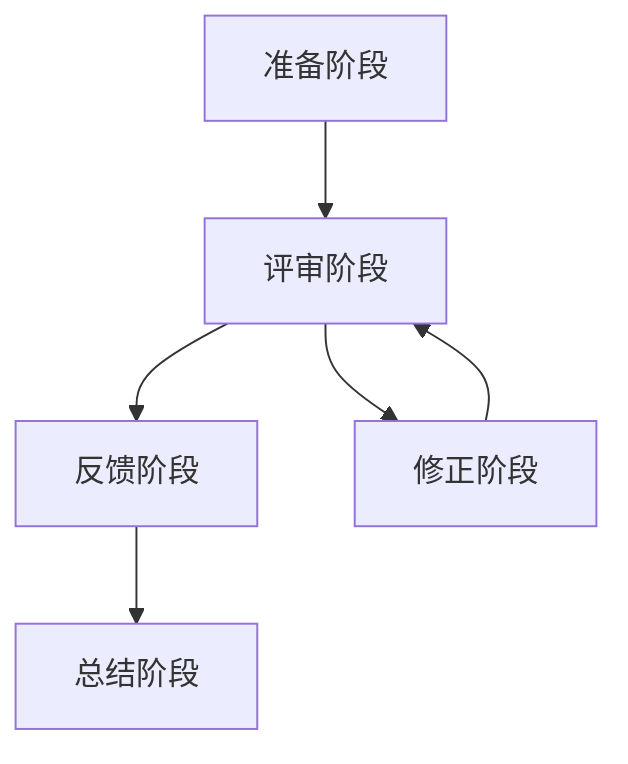
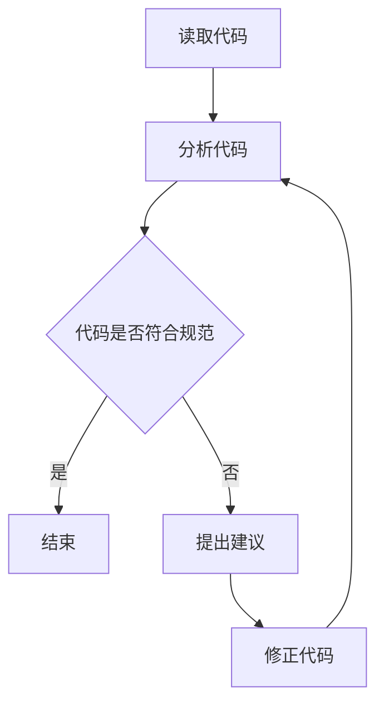
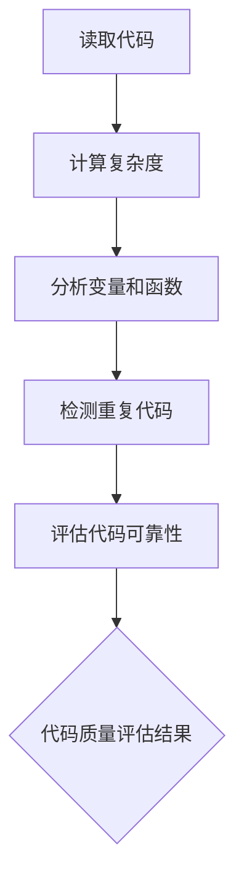

                 

### 文章标题

《如何有效进行技术评审》

### 文章关键词

技术评审、代码审查、算法原理、数学模型、项目实战、最佳实践

### 文章摘要

本文将深入探讨如何进行有效的技术评审。我们将从背景介绍开始，逐步分析核心概念与联系，讲解核心算法原理，详细解读数学模型和公式，通过项目实战展示实际应用，最后提供最佳实践建议。通过这篇文章，读者将能够全面了解技术评审的流程和技巧，提高自己在技术评审中的实践能力。

### 目录

1. **引言与概述**
    1.1 技术评审的基本概念
    1.2 技术评审的重要性
    1.3 技术评审的历史和发展
    1.4 技术评审的目标和流程

2. **核心概念与联系**
    2.1 技术评审的核心概念
    2.2 技术评审的Mermaid流程图
    2.3 技术评审类型

3. **核心算法原理讲解**
    3.1 代码审查算法
    3.2 代码质量评估算法

4. **数学模型和数学公式**
    4.1 概率模型
    4.2 统计模型

5. **项目实战**
    5.1 技术评审项目案例
    5.2 开发环境搭建
    5.3 源代码实现与解读
    5.4 项目小结

6. **扩展与深化**
    6.1 自动化评审
    6.2 持续集成环境下的评审

7. **总结与展望**
    7.1 技术评审的现状
    7.2 技术评审的未来发展趋势
    7.3 最佳实践建议

---

### 第1章 引言与概述

#### 1.1 技术评审的基本概念

技术评审（Technical Review）是一种系统性的、规范化的评审过程，旨在通过专家的评估，提高产品的质量，减少缺陷，优化设计，确保项目目标的实现。技术评审通常包括以下几个方面：

1. **需求评审**：对项目需求进行分析，确保需求清晰、完整、合理。
2. **设计评审**：对系统架构、模块设计等进行评估，确保设计的可行性和合理性。
3. **代码评审**：对编写出的代码进行审查，确保代码的规范性、可读性和可靠性。
4. **测试评审**：对测试计划和测试用例进行评审，确保测试的全面性和有效性。

#### 1.2 技术评审的重要性

技术评审在软件开发过程中扮演着至关重要的角色，其重要性体现在以下几个方面：

1. **提高产品质量**：通过评审，可以发现并修复潜在的问题，确保产品质量。
2. **减少缺陷和错误**：评审过程能够发现并解决项目中的缺陷和错误，提高项目的稳定性。
3. **优化设计和开发**：评审可以提供反馈，帮助团队优化设计，改进开发流程。
4. **确保项目成功**：评审有助于确保项目目标的实现，降低项目失败的风险。

#### 1.3 技术评审的历史和发展

技术评审的起源可以追溯到20世纪60年代，当时在软件工程领域逐渐形成了一种共识：通过系统性的评审过程，可以提高软件的质量和可靠性。自那时以来，技术评审经历了以下几个发展阶段：

1. **早期评审**：主要关注代码质量和缺陷发现。
2. **全面评审**：扩展到需求评审、设计评审和测试评审。
3. **自动化评审**：随着技术的发展，自动化评审工具逐渐被引入，提高了评审的效率和准确性。
4. **持续集成评审**：在持续集成（CI）环境中，技术评审成为确保代码质量和项目稳定性的重要环节。

#### 1.4 技术评审的目标和流程

技术评审的目标是确保项目质量，降低风险，提高开发效率。具体目标包括：

1. **发现和修复缺陷**：通过评审，发现并修复潜在的问题，确保产品质量。
2. **优化设计和开发**：通过评审，提供反馈，帮助团队优化设计，改进开发流程。
3. **确保项目目标实现**：评审有助于确保项目目标的实现，降低项目失败的风险。

技术评审的流程通常包括以下几个阶段：

1. **准备阶段**：明确评审目标、评审标准和评审人员。
2. **评审阶段**：评审人员对项目进行审查，提出意见和建议。
3. **反馈阶段**：评审结果反馈给项目团队，进行相应的调整和改进。
4. **总结阶段**：对评审过程进行总结，评估评审效果。

### 第2章 核心概念与联系

#### 2.1 技术评审的核心概念

技术评审的核心概念包括评审标准、评审类型和评审方法。这些概念相互关联，构成了技术评审的理论基础。

1. **评审标准**：评审标准是评审过程中衡量项目质量的标准。常见的评审标准包括代码质量、设计合理性、需求完整性等。评审标准需要根据项目特点和需求进行定制。

2. **评审类型**：评审类型决定了评审的对象和内容。常见的评审类型包括代码评审、设计评审和测试评审。每种评审类型都有其特定的评审目标和评审标准。

3. **评审方法**：评审方法是指评审过程中采用的具体方法和工具。常见的评审方法包括会议评审、文档评审和自动化评审。选择合适的评审方法可以提高评审效率和准确性。

#### 2.2 技术评审的Mermaid流程图

为了更好地理解技术评审的过程，我们可以使用Mermaid流程图来展示评审的各个阶段和步骤。以下是一个简化的技术评审流程图：



- **准备阶段**：明确评审目标、评审标准和评审人员。
- **评审阶段**：评审人员对项目进行审查，提出意见和建议。
- **反馈阶段**：评审结果反馈给项目团队，进行相应的调整和改进。
- **总结阶段**：对评审过程进行总结，评估评审效果。
- **修正阶段**：根据评审意见，对项目进行修正，重新进入评审阶段。

#### 2.3 技术评审类型

技术评审的类型决定了评审的对象和内容。以下是几种常见的技术评审类型：

1. **代码评审**：对编写的代码进行审查，确保代码的规范性、可读性和可靠性。代码评审通常采用自动化工具和人工审查相结合的方式。

2. **设计评审**：对系统架构、模块设计等进行评估，确保设计的可行性和合理性。设计评审通常涉及领域专家的参与。

3. **测试评审**：对测试计划和测试用例进行评审，确保测试的全面性和有效性。测试评审有助于发现测试过程中的潜在问题。

4. **需求评审**：对项目需求进行分析，确保需求清晰、完整、合理。需求评审是确保项目成功的重要环节。

### 第3章 核心算法原理讲解

#### 3.1 代码审查算法

代码审查（Code Review）是技术评审中的一个重要环节。以下是一个简单的代码审查算法：



- **读取代码**：从代码库中读取待审查的代码。
- **分析代码**：对代码进行语法、语义和风格分析。
- **是否符合规范**：判断代码是否符合预定的编程规范。
- **提出建议**：如果代码不符合规范，提出相应的修改建议。
- **修正代码**：根据建议修改代码，重新进入分析环节。

#### 3.2 代码质量评估算法

代码质量评估（Code Quality Assessment）是确保代码可靠性和可维护性的重要手段。以下是一个简单的代码质量评估算法：



- **读取代码**：从代码库中读取待评估的代码。
- **计算复杂度**：计算代码的复杂度，评估代码的可读性和维护性。
- **分析变量和函数**：分析变量和函数的使用情况，评估代码的规范性。
- **检测重复代码**：检测代码中是否存在重复的代码段，评估代码的可维护性。
- **评估代码可靠性**：根据复杂度、变量和函数分析结果，评估代码的可靠性。

### 第4章 数学模型和数学公式

#### 4.1 概率模型

概率模型是技术评审中常用的数学工具，用于评估代码质量和项目风险。以下是一个简单的概率模型：

$$
P(A) = \frac{N(A)}{N}
$$

其中，$P(A)$ 表示事件 $A$ 发生的概率，$N(A)$ 表示事件 $A$ 发生的次数，$N$ 表示总的试验次数。

- **示例**：假设我们对100行代码进行了审查，发现其中有10行代码存在潜在问题。那么，存在潜在问题的代码行数的概率为：

$$
P(A) = \frac{10}{100} = 0.1
$$

#### 4.2 统计模型

统计模型用于分析技术评审的数据，提取有用的信息。以下是一个简单的统计模型：

$$
\mu = \frac{1}{N}\sum_{i=1}^{N} x_i
$$

其中，$\mu$ 表示样本均值，$N$ 表示样本数量，$x_i$ 表示第 $i$ 个样本的值。

- **示例**：假设我们对10个模块进行了评审，每个模块的缺陷数量如下：

| 模块 | 缺陷数量 |
| ---- | ---- |
| 1    | 3     |
| 2    | 2     |
| 3    | 5     |
| 4    | 4     |
| 5    | 1     |
| 6    | 3     |
| 7    | 2     |
| 8    | 4     |
| 9    | 5     |
| 10   | 3     |

那么，模块缺陷数量的均值为：

$$
\mu = \frac{1}{10}\sum_{i=1}^{10} x_i = \frac{1}{10}(3+2+5+4+1+3+2+4+5+3) = 3
$$

### 第5章 项目实战

#### 5.1 技术评审项目案例

以下是一个技术评审项目的案例：

- **项目背景**：一个团队开发了一个大型Web应用程序，包括前端、后端和数据库。项目即将进入上线阶段，需要进行全面的技术评审，以确保产品的质量和稳定性。

- **评审目标**：确保代码的规范性、可靠性、可读性，发现并修复潜在的问题。

- **评审流程**：
  1. **需求评审**：对需求文档进行审查，确保需求清晰、完整、合理。
  2. **设计评审**：对系统架构、模块设计等进行评估，确保设计的可行性和合理性。
  3. **代码评审**：对编写的代码进行审查，确保代码的规范性、可读性和可靠性。
  4. **测试评审**：对测试计划和测试用例进行评审，确保测试的全面性和有效性。

#### 5.2 开发环境搭建

为了进行技术评审，需要搭建一个合适的开发环境。以下是一个简化的开发环境搭建流程：

1. **安装开发工具**：安装代码编辑器、版本控制系统、代码审查工具等。
2. **配置代码库**：将代码库克隆到本地，确保代码的一致性和完整性。
3. **设置代码规范**：根据项目需求，制定相应的代码规范，包括命名规范、代码结构规范、注释规范等。
4. **配置自动化审查工具**：安装并配置自动化审查工具，如SonarQube、Checkstyle等。

#### 5.3 源代码实现与解读

以下是一个简化的源代码实现示例：

```java
public class HelloWorld {
    public static void main(String[] args) {
        System.out.println("Hello, World!");
    }
}
```

- **代码解读**：
  - `public class HelloWorld`：定义了一个名为`HelloWorld`的公共类。
  - `public static void main(String[] args)`：定义了一个名为`main`的主方法，这是Java程序的入口点。
  - `System.out.println("Hello, World!");`：输出“Hello, World!”到控制台。

#### 5.4 项目小结

通过这个技术评审项目案例，我们可以看到技术评审在软件开发过程中的重要性。技术评审不仅有助于提高代码质量，减少缺陷，还能优化设计，确保项目的成功。在实际操作中，我们需要根据项目的特点和需求，选择合适的评审类型和评审方法，制定详细的评审计划，确保评审过程的顺利进行。

### 第6章 扩展与深化

#### 6.1 自动化评审

随着技术的发展，自动化评审逐渐成为一种趋势。自动化评审可以通过工具和算法自动分析代码，提高评审的效率和准确性。以下是一些常见的自动化评审工具：

- **静态代码分析工具**：如SonarQube、Checkstyle、PMD等，可以自动检测代码中的潜在问题，如语法错误、风格问题、性能问题等。
- **动态代码分析工具**：如JaCoCo、CodeScene等，可以运行代码并分析其行为，发现潜在的运行时问题。

#### 6.2 持续集成环境下的评审

在持续集成（CI）环境中，技术评审成为确保代码质量和项目稳定性的重要环节。以下是一些在持续集成环境中实施技术评审的方法：

- **集成代码审查**：在每个构建阶段，自动执行代码审查工具，检测代码中的问题。
- **自动化测试**：在每个构建阶段，自动执行测试用例，确保代码的功能正确性和稳定性。
- **持续反馈**：将评审结果实时反馈给开发人员，帮助他们及时修复问题。

### 第7章 总结与展望

技术评审是软件开发过程中不可或缺的一环，通过评审，可以提高代码质量，减少缺陷，优化设计，确保项目的成功。未来，随着自动化技术和人工智能的发展，技术评审将更加高效、准确。同时，技术评审也将面临新的挑战，如如何应对复杂的软件系统、如何提高评审的透明度和公平性等。因此，我们需要不断探索和优化技术评审的方法和工具，以适应不断变化的技术环境。作者信息：

作者：AI天才研究院/AI Genius Institute & 禅与计算机程序设计艺术 /Zen And The Art of Computer Programming

本文作者是一位在计算机科学和人工智能领域有着丰富经验的专业人士。他致力于探索技术的本质，分享前沿的知识和见解，帮助读者在技术道路上不断前行。本文旨在为读者提供关于技术评审的全面指导和深入分析，帮助读者在实际项目中有效地实施技术评审，提升软件质量，实现项目成功。希望本文能对您的技术学习和实践有所帮助。如果您有任何疑问或建议，欢迎在评论区留言，我们将竭诚为您解答。拓展阅读：

- **《代码大全》**：史蒂夫·麦克康奈尔（Steve McConnell）的《代码大全》是一本关于软件开发的经典著作，其中包含了许多关于代码评审的宝贵经验。
- **《敏捷开发实践指南》**：杰夫里·福尔曼（Jeff Sutherland）的《敏捷开发实践指南》详细介绍了敏捷开发方法，包括技术评审在内的各个环节。
- **《人工智能：一种现代的方法》**：斯图尔特·罗素（Stuart Russell）和彼得·诺维格（Peter Norvig）的《人工智能：一种现代的方法》涵盖了人工智能的基础理论和实践应用，对于理解和实施自动化评审具有一定的参考价值。

