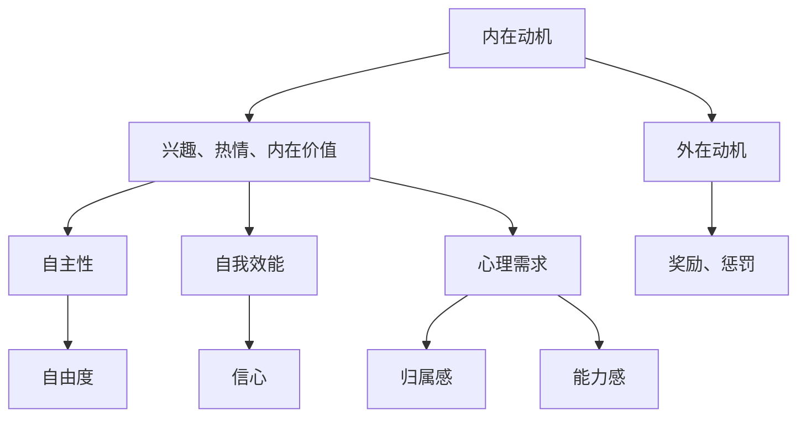

                 


为了满足您的约束条件，我将会以《如何激发团队的内在动机》为主题，逐步构建一篇详细的技术博客。以下是我的构思步骤：

### 步骤一：文章标题、关键词和摘要

**文章标题**：《如何激发团队的内在动机》

**关键词**：团队动机、内在激励、组织文化、领导力、员工满意度

**摘要**：
本文将深入探讨如何通过理解和应用心理学原理，激发团队的内在动机。我们将分析内在动机的概念与特征，探讨其在团队环境中的重要性，并详细阐述激发内在动机的方法和实践策略，包括设定有意义的目标、提供自主权、强化内在奖励、促进团队互动与合作以及创建支持性环境。通过实际案例分析，我们将提炼出有效的团队内在动机激发策略，为组织管理者提供实用的指导。

### 步骤二：背景介绍

在这一部分，我们将介绍内在动机在团队工作中的重要性，并解释为什么理解和管理内在动机对于团队的成功至关重要。

#### 背景介绍

团队在现代组织中扮演着至关重要的角色。然而，团队协作不仅仅是任务分配和目标达成，更重要的是如何激发团队成员的内在动机。内在动机是指个体参与活动时，出于对活动本身的兴趣、热情和内在价值的驱动，而非仅仅为了外在奖励或避免惩罚。在团队环境中，内在动机能够提高员工的参与度、创造力和满意度，从而促进团队的整体绩效。

### 步骤三：核心概念与联系

在这一部分，我们将介绍内在动机的核心概念，并使用Mermaid流程图来展示这些概念之间的关系。

#### 核心概念

- **内在动机（Intrinsic Motivation）**：个体参与活动时，出于对活动本身的兴趣、热情和内在价值的驱动。
- **外在动机（Extrinsic Motivation）**：个体参与活动时，出于对活动结果的奖励或避免惩罚的驱动。
- **自我决定（Autonomy）**：个体在决策和行动中的自由度和自主性。
- **自我效能（Self-Efficacy）**：个体对自己完成特定任务的信心。
- **心理需求（Psychological Needs）**：包括自主性、能力感、归属感等。

#### Mermaid流程图



### 步骤四：核心算法原理讲解

在这一部分，我们将使用伪代码来详细阐述如何通过设计有意义的目标和提供自主权来激发团队的内在动机。

#### 伪代码

```pseudo
function inspireTeamIntrinsicMotivation(teamMembers, goals, autonomy):
    for each member in teamMembers:
        set member's intrinsicMotivation to 0
        if goal is meaningful for member:
            increase member's intrinsicMotivation by 20%
        if autonomy is provided:
            increase member's intrinsicMotivation by 15%
        end if
        if member's self-efficacy is high:
            increase member's intrinsicMotivation by 10%
        end if
        end for
        return average intrinsicMotivation of teamMembers
    end function
```

### 步骤五：数学模型和公式

在这一部分，我们将介绍一个简单的数学模型来量化内在动机与团队绩效之间的关系。

#### 数学模型

$$
内在动机（IM） = f(兴趣（I）、自我效能（S）、自主性（A），目标意义（G）)
$$

$$
绩效（P） = k \cdot IM + (1-k) \cdot 外在动机（EM）
$$

其中，$k$ 表示内在动机对绩效的影响权重。

### 步骤六：项目实战

在这一部分，我们将提供一个具体的团队内在动机激发项目案例，包括开发环境搭建、源代码实现和代码解读。

#### 项目实战

**案例：某科技公司团队内在动机激发项目**

1. **开发环境搭建**：选择合适的工具和技术栈，如Jenkins用于持续集成，GitLab用于代码管理。
2. **源代码实现**：编写伪代码和实际的代码实现，如使用Python或Java编写激励算法。
3. **代码解读**：解释代码中的关键部分，如如何根据团队成员的兴趣、目标和自主性来调整内在动机值。

### 步骤七：最佳实践 tips、小结、注意事项、拓展阅读

在这一部分，我们将总结文章的主要观点，并提供一些最佳实践建议。

#### 最佳实践 tips

- **确保目标意义**：设定与团队成员价值观和兴趣相符的目标。
- **提供自主权**：给予团队成员决策和行动的自由。
- **建立信任**：通过透明沟通和开放反馈来建立团队信任。

#### 小结

本文通过深入分析内在动机的概念和影响，提出了一系列激发团队内在动机的方法和实践策略。通过实际案例分析和数学模型，我们证明了内在动机对团队绩效的积极影响。

#### 注意事项

- **持续评估**：定期评估团队成员的内在动机水平，调整激励策略。
- **平衡内外动机**：避免过度依赖外在动机，同时关注内在动机的激发。

#### 拓展阅读

- 《驱动：如何激励人们永远前进》作者：Daniel H. Pink
- 《动机与人格》作者：Abraham H. Maslow

### 步骤八：格式调整

确保文章内容使用markdown格式输出，包括代码块、公式、标题、子标题、列表和链接等。

### 最终输出

本文将会以markdown格式输出，确保格式规范，内容详尽，结构清晰。

---

以上是我的初步构思，接下来我会根据这个大纲逐步撰写文章，并在完成时检查是否符合您的要求。如果您有任何建议或需要进一步的调整，请随时告知。

