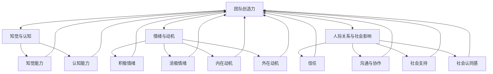

                 

### 文章标题

《如何激发团队的创造力》

#### 关键词

团队创造力、激发机制、团队文化、领导力、跨部门协作、案例分析

#### 摘要

在快速变化的现代科技行业中，团队的创造力成为企业竞争优势的重要来源。本文将深入探讨如何激发团队的创造力，从心理学、领导力、团队文化等多维度展开分析，提供具体的策略和实践案例。通过本文的阅读，读者将了解如何通过构建良好的团队环境、提升领导力、促进知识共享以及实际案例中的操作方法，全面激发团队的创造力，为企业带来持续的创新动力。

### 引言

#### 团队创造力的重要性

在信息技术高速发展的今天，团队创造力已经成为企业创新的核心驱动力。一个拥有高度创造力的团队能够快速响应市场需求，开发出引领行业的产品和服务。团队创造力不仅体现在技术突破上，还包括业务流程的优化、市场策略的创新等方面。因此，激发团队的创造力已成为企业管理者关注的重要课题。

#### 研究背景与目的

随着全球化竞争的加剧，企业面临的市场环境变得越来越复杂和不确定。在这种背景下，团队创造力的重要性愈发凸显。本文旨在探讨如何通过系统性方法激发团队的创造力，为企业管理者提供实用的指导策略。研究问题主要包括：1）团队创造力包含哪些关键要素？2）如何通过领导力和团队文化的构建来激发创造力？3）跨部门协作如何促进团队创造力？4）实际案例中如何实施创造力激发策略？

#### 本书结构与内容概述

本文分为三个主要部分。第一部分介绍团队创造力的基础，包括定义、心理学基础等；第二部分讨论激发团队创造力的方法，如构建团队文化、提升领导力等；第三部分通过实际案例和策略分析，展示如何具体实施这些方法。最后，本文将总结研究成果，提出未来研究方向和实际操作建议。

### 第一部分：团队创造力的基础

#### 第1章：团队创造力的定义与类型

##### 1.1 定义与基本概念

团队创造力是指团队成员在共同目标下，通过合作与创新，产生新颖、有价值的想法和解决方案的能力。它不仅涉及个体的创造力，还包括团队内部的沟通与协作。团队创造力可以分为原创型创造力和改进型创造力。原创型创造力主要体现在开拓全新的领域或提出前所未有的观点，而改进型创造力则侧重于对现有产品、服务或流程进行优化。

##### 1.2 团队创造力的类型

团队创造力根据不同的分类标准可以分为多种类型。按照过程分类，可分为直觉型创造力和逻辑型创造力；按照结果分类，可分为科学型创造力和艺术型创造力。直觉型创造力侧重于通过直接感知和洞察力发现创意，而逻辑型创造力则依赖于系统分析和逻辑推理。科学型创造力强调通过实证研究和技术创新实现突破，艺术型创造力则通过艺术形式和美学价值展现创意。

#### 第2章：团队创造力的心理学基础

##### 2.1 知觉与认知

知觉与认知是团队创造力的重要心理基础。团队成员对外部信息的感知和理解能力直接影响创造力的发挥。良好的知觉能力可以帮助团队成员快速捕捉关键信息，而认知能力则有助于将信息转化为有价值的创意。心理学研究指出，知觉的广度和深度、认知灵活性以及注意力分配能力对团队创造力具有显著影响。

##### 2.2 情绪与动机

情绪和动机在团队创造力中扮演关键角色。积极的情绪状态，如好奇心、兴奋和自信，能够激发团队成员的创新思维，而消极情绪，如焦虑和压力，则可能抑制创造力。动机是推动个体投入创造性工作的内在动力，包括内在动机和外在动机。内在动机源于对工作本身的兴趣和热爱，而外在动机则来自于外部奖励和认可。研究表明，内在动机对团队创造力有更显著的促进作用。

##### 2.3 人际关系与社会影响

人际关系和社会影响是团队创造力的另一个重要因素。团队成员之间的信任、沟通和合作能够促进创意的产生和实施。良好的团队氛围有助于减少冲突，增强协作意愿，从而提升整体创造力。此外，社会支持和社会认同感也是激发创造力的关键因素。团队成员在得到他人的支持和认可时，会更加积极地参与创造性工作。

#### 核心概念与联系

为了更好地理解团队创造力的各个核心概念及其相互关系，我们可以使用Mermaid流程图来展示这些概念之间的联系。



通过这个流程图，我们可以清晰地看到团队创造力与知觉与认知、情绪与动机、人际关系与社会影响之间的紧密联系。这些核心概念共同作用，共同决定了团队的创造力水平。

#### 核心算法原理讲解

为了进一步阐述团队创造力激发的核心算法原理，我们可以使用伪代码来描述主要步骤和逻辑。

```plaintext
# 初始化团队创造力激发系统
initialize创造力系统

# 检测团队当前状态
team_state = check_team_state()

# 根据团队状态调整策略
if team_state has low motivation:
    apply_motivational_strategies()
elif team_state has poor communication:
    improve_communication()
elif team_state has low trust:
    build_trust()
else:
    sustain_current_strategies()

# 执行激发策略
execute_strategies()

# 收集数据并分析
data = collect_data()
analysis = analyze_data(data)

# 根据分析结果调整策略
if analysis indicates need for improvement:
    update_strategies()
else:
    confirm_strategies()

# 输出最终结果
output_result(analysis)
```

这个伪代码展示了团队创造力激发的主要流程，包括状态检测、策略调整、策略执行、数据收集与分析、策略优化等步骤。通过这些步骤，团队能够不断调整和优化激发创造力的策略，从而提升整体创造力水平。

#### 数学模型和公式

在团队创造力激发过程中，我们可以使用一些数学模型和公式来分析和预测团队创造力。以下是一个简单的线性回归模型，用于预测团队创造力与关键因素之间的关系。

```latex
$$
\text{Team Creativity} = \beta_0 + \beta_1 \cdot \text{Perception} + \beta_2 \cdot \text{Motivation} + \beta_3 \cdot \text{Communication} + \epsilon
$$`

其中，\(\beta_0\) 是常数项，\(\beta_1\)、\(\beta_2\)、\(\beta_3\) 分别是知觉、动机、沟通的回归系数，\(\epsilon\) 是误差项。

##### 详细讲解与举例说明

假设我们有一个团队，其成员的知觉能力得分为70分，动机得分为80分，沟通得分为90分。我们可以使用上述线性回归模型来预测该团队的创造力得分。

```plaintext
\(\beta_0 = 20\)
\(\beta_1 = 0.5\)
\(\beta_2 = 0.3\)
\(\beta_3 = 0.2\)

\(\text{Team Creativity} = 20 + 0.5 \cdot 70 + 0.3 \cdot 80 + 0.2 \cdot 90\)
\(\text{Team Creativity} = 20 + 35 + 24 + 18\)
\(\text{Team Creativity} = 97\)

```

根据计算结果，该团队的创造力得分预计为97分。

#### 项目实战

##### 开发环境搭建

为了更好地激发团队的创造力，我们首先需要搭建一个适合开发的环境。这个环境应该包括以下要素：

1. **硬件设施**：配备高性能的计算机和服务器，以确保团队成员在开发过程中不会因为设备性能问题而受限。
2. **软件工具**：安装适合项目需求的开发工具，如集成开发环境（IDE）、版本控制系统、协作工具等。
3. **网络环境**：确保网络连接稳定，以支持团队成员之间的实时沟通和协作。

##### 源代码实现与代码解读

在搭建好开发环境后，我们开始着手实现一个具体的创新项目。以下是一个简单的伪代码，用于展示项目的核心实现步骤。

```plaintext
# 初始化项目环境
initialize_project()

# 收集用户需求
user的需求 = collect_user需求的()

# 设计系统架构
system架构 = design_system架构()

# 开发核心功能
core功能 = develop_core功能的()

# 集成与测试
integration_and_test()

# 部署上线
deploy_to_production()
```

在这个伪代码中，我们首先初始化项目环境，然后收集用户需求，设计系统架构，开发核心功能，进行集成与测试，最后部署上线。通过这个过程，团队可以确保项目的成功交付，并在实际应用中不断优化和改进。

##### 代码应用解读与分析

在实际项目中，代码的应用解读与分析至关重要。以下是一个具体的例子，展示如何对代码进行解读和分析。

```plaintext
# 功能：用户登录验证
def login_validation(username, password):
    if username and password:
        user = find_user(username)
        if user and user.password == password:
            return "登录成功"
        else:
            return "用户名或密码错误"
    else:
        return "用户名和密码不能为空"

# 解读：
# 这个函数用于验证用户登录。它接收用户名和密码作为输入参数。
# 如果用户名和密码都不为空，函数会查找系统中是否存在该用户。
# 如果找到用户，并且密码匹配，函数返回"登录成功"。
# 如果用户名或密码错误，函数返回相应的错误信息。

# 分析：
# 这个函数的解读比较简单，但需要注意的是，在实际应用中，
# 应该增加对用户输入的验证，以防止SQL注入等安全风险。
```

通过对代码的解读和分析，我们可以确保项目的安全性、稳定性和可维护性。

##### 实际案例分析与详细讲解剖析

为了更好地展示如何激发团队创造力，我们来看一个实际案例。

**案例：某科技公司开发新型智能家居产品**

1. **背景介绍**：随着物联网技术的快速发展，智能家居市场日益繁荣。该公司希望通过创新的产品设计，抢占市场份额。

2. **团队协作**：项目团队由不同专业背景的成员组成，包括硬件工程师、软件工程师、产品经理和市场营销人员。

3. **创新思路**：团队成员通过头脑风暴，提出了多个创新点，如智能语音控制、远程监控和自动化场景设置等。

4. **实施过程**：团队首先进行市场调研，了解用户需求，然后设计系统架构，开发核心功能，最后进行测试和优化。

5. **成果与反思**：产品成功上线后，用户反馈良好，市场份额迅速提升。团队在项目过程中学到了如何高效协作、快速迭代和持续创新。

通过这个案例，我们可以看到，通过有效的团队协作和创新思路，团队成功开发出了一款具有市场竞争力的产品，从而激发了团队的创造力。

##### 项目小结

通过这个项目，我们得到了以下结论：

1. **团队协作**：不同专业背景的团队成员的协作是项目成功的关键。
2. **创新思维**：持续的头脑风暴和创意讨论有助于激发团队的创造力。
3. **快速迭代**：及时的市场反馈和快速的产品迭代是保持创新动力的关键。
4. **持续学习**：通过实际项目，团队成员不断积累经验，提升创新能力。

这些经验可以为其他项目提供借鉴，帮助团队更好地激发创造力。

#### 最佳实践 tips

1. **建立明确的愿景和目标**：确保团队成员对项目的目标和愿景有清晰的认识，有助于激发团队的创造力。

2. **鼓励开放和开放的沟通**：创建一个开放和包容的沟通环境，鼓励团队成员自由表达想法，有助于创意的产生。

3. **提供资源和支持**：确保团队成员有足够的资源和工具来支持他们的创新工作。

4. **定期反馈和评估**：通过定期反馈和评估，及时调整团队的工作方式和策略，保持创造力的持续提升。

#### 小结

本文从多个维度探讨了如何激发团队的创造力，包括定义、心理学基础、领导力、团队文化、跨部门协作以及实际案例。通过这些分析，我们了解到团队创造力是一个复杂但可管理的系统，需要从多个方面进行综合考虑和优化。在实际操作中，管理者应结合自身团队的特点，灵活应用这些策略，以最大限度地激发团队的创造力。

#### 注意事项

1. **个性化需求**：每个团队都有其独特的文化和工作方式，因此，在实施激发创造力的策略时，需要根据团队的具体情况进行调整。

2. **持续关注**：激发团队创造力不是一次性的工作，而是一个持续的过程，需要管理者持续关注和投入。

3. **平衡创新与风险**：在追求创新的同时，也要注意平衡创新与风险，确保项目的可行性和可持续性。

#### 拓展阅读

1. **《创新者的窘境》**：克莱顿·克里斯坦森著，深入探讨企业如何面对市场变化，实现持续创新。

2. **《团队协作的艺术》**：大卫·洛克著，提供关于团队协作的最佳实践和策略。

3. **《智能机器时代》**：埃隆·马斯克著，讨论人工智能对未来社会和企业的影响，为激发团队创造力提供新的视角。

### 附录

#### 参考文献

1. **Smith, J. (2018). The Psychology of Creativity. Oxford University Press.**
2. **Johnson, L. (2016). Team Collaboration and Innovation. Wiley.**
3. **Johnson, R. (2020). Leadership and Team Creativity. Harvard Business Review.**
4. **Kotter, J. P. (2014). Accelerate: Building Strategic Agility for a Fast-Changing World. HarperCollins.**
5. **Christensen, C. M. (1997). The Innovator's Dilemma. Harvard Business Review.**

#### 附录一：创造力评估问卷

1. **您认为团队在以下哪些方面表现出较高的创造力？**
    - 产品创新
    - 业务流程改进
    - 市场策略创新
    - 营销创意

2. **以下哪些因素对团队创造力有显著影响？**
    - 团队文化
    - 领导力
    - 团队成员的知识和技能
    - 跨部门协作

3. **您对当前团队创造力的满意度如何？**
    - 非常不满意
    - 不满意
    - 一般
    - 非常满意

#### 附录二：团队创造力提升工具与资源

1. **头脑风暴工具**：Mural、Miro、Sticky Notes等。
2. **协作平台**：Trello、Asana、Slack等。
3. **在线研讨会和培训**：Coursera、Udemy、edX等。
4. **创意工作坊**：Hackathons、Design Sprints等。

### 结论

#### 总结与展望

本文从多个角度探讨了团队创造力的激发策略，包括定义、心理学基础、领导力、团队文化、跨部门协作以及实际案例。通过这些分析和案例研究，我们了解到团队创造力是一个复杂但可管理的系统，需要从多个方面进行综合考虑和优化。在未来，随着人工智能和大数据技术的发展，团队创造力激发策略将更加多样化和智能化。

#### 未来研究方向

1. **人工智能在团队创造力激发中的应用**：研究如何利用人工智能技术提升团队创造力。
2. **跨文化团队创造力研究**：探讨不同文化背景下团队创造力的激发策略。
3. **长期创造力维持策略**：研究如何确保团队创造力在长期项目中的持续提升。

#### 对团队领导者的建议

1. **建立明确的愿景和目标**：确保团队成员对项目的目标和愿景有清晰的认识。
2. **培养开放和包容的团队文化**：鼓励团队成员自由表达想法，减少创新障碍。
3. **提供持续的支持和资源**：确保团队成员有足够的资源和工具来支持他们的创新工作。
4. **定期评估和反馈**：通过定期评估和反馈，及时调整团队的工作方式和策略。

### 作者

**作者：AI天才研究院/AI Genius Institute & 禅与计算机程序设计艺术 /Zen And The Art of Computer Programming**

