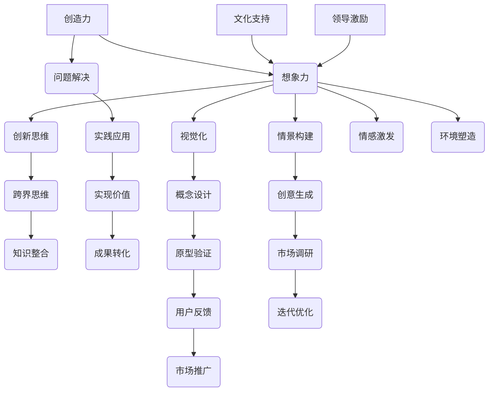

                 


### 文章标题：如何激发团队的创造力和想象力

### 关键词：
- 创造力
- 想象力
- 团队
- 激励策略
- 领导力
- 组织文化

### 摘要：
本文深入探讨了如何激发团队的创造力和想象力。通过理论分析、实践案例和具体方法，文章提出了系统的策略和技巧，旨在帮助团队领导者和管理者营造一个有利于创新和想象力的工作环境，提升团队的创造力和竞争力。

### 引言：创造力和想象力的重要性

在现代企业和组织中，创造力和想象力已成为关键竞争优势。随着全球化和技术创新的加速，企业需要不断适应市场变化，提出新的产品和服务。以下是创造力和想象力在团队中的重要性的几点阐述：

1. **创新能力驱动发展**：创造力和想象力是企业创新的核心动力。它能够激发团队成员提出新颖的想法，推动产品、服务和工作流程的持续改进。

2. **适应快速变化的市场**：市场环境瞬息万变，只有具备高度创造力和想象力，团队才能迅速响应变化，抓住市场机遇。

3. **提高员工满意度和忠诚度**：一个鼓励创造和想象力的工作环境能够提高员工的参与感和成就感，从而增强员工的工作满意度和忠诚度。

4. **增强企业竞争力**：拥有高创造力和想象力的团队能够不断创造价值，提升企业竞争力，在激烈的市场竞争中脱颖而出。

### 核心概念与联系：创造力与想象力

在深入探讨如何激发团队的创造力和想象力之前，我们需要明确这两个核心概念之间的关系。以下是创造力与想象力之间的关联架构 Mermaid 流程图：



### 核心概念与联系解析：

- **创造力**：指个体或团队在面对问题时，能够提出独特、新颖的解决方案或观点的能力。创造力涵盖了从问题的识别到解决方案的产生的整个过程。

- **想象力**：是创造力的关键组成部分，指个体或团队通过联想、想象和构建新情景来拓展思维边界，激发新的想法和概念。

- **问题解决**：创造力通常体现在解决复杂问题上，通过创新的思维和策略找到解决方案。

- **创新思维**：想象力则强调通过跨领域、跨文化的思维模式，创造出前所未有的想法。

- **实践应用**：将创意转化为可行的实践，是创造力的重要体现。

- **跨界思维**：通过整合不同领域的知识，产生创新性想法。

- **实现价值**：将创新想法转化为具有实际价值的成果。

- **视觉化**、**情景构建**、**概念设计**、**原型验证**、**市场调研**、**用户反馈**、**迭代优化**、**市场推广**：这些都是想象力在实际应用中发挥作用的环节，通过不断的迭代和优化，实现创新的商业化。

### 核心算法原理讲解

要激发团队的创造力和想象力，我们可以采用以下核心算法原理：

1. **创意生成算法**：
    ```python
    def generate_ideas(problem):
        ideas = []
        for i in range(10):
            idea = combine_keywords(problem, random_word())
            ideas.append(idea)
        return ideas

    def combine_keywords(problem, word):
        return f"{word} for {problem}"

    def random_word():
        return random.choice(["machine learning", "user experience", "sustainability", "cloud computing"])
    ```

2. **思维拓展算法**：
    ```python
    def expand_thinking(idea):
        extensions = []
        for i in range(5):
            extension = modify_idea(idea, random_extension())
            extensions.append(extension)
        return extensions

    def modify_idea(idea, extension):
        return f"{idea} with {extension}"

    def random_extension():
        return random.choice(["scalability", "security", "modularity", "integration"])
    ```

3. **迭代优化算法**：
    ```python
    def iterate_idea(idea, feedback):
        improved_idea = idea
        for i in range(3):
            improved_idea = refine_idea(improved_idea, feedback)
        return improved_idea

    def refine_idea(idea, feedback):
        # 基于反馈对想法进行优化
        return f"{idea} - {feedback}"
    ```

这些算法提供了基本的框架，可以帮助团队在创新过程中产生、扩展和优化创意。

### 数学模型和公式

为了更好地理解创造力和想象力之间的关系，我们可以使用以下数学模型：

1. **创造力指数模型**：
    $$ C = f(I, M, E) $$
    其中，$C$ 表示创造力指数，$I$ 表示想象力，$M$ 表示知识整合能力，$E$ 表示环境支持。

2. **想象力与知识整合的关系**：
    $$ I \propto K^{\alpha} $$
    其中，$I$ 表示想象力，$K$ 表示知识整合能力，$\alpha$ 是一个常数。

3. **环境支持与创造力的关系**：
    $$ C \propto E^{\beta} $$
    其中，$C$ 表示创造力，$E$ 表示环境支持，$\beta$ 是一个常数。

这些模型提供了定量分析创造力、想象力和环境支持之间关系的工具。

### 举例说明

假设一个团队正在开发一款新的智能家居产品。以下是该团队如何应用上述算法和模型的过程：

1. **创意生成**：
    - 问题：如何提高智能家居产品的用户体验？
    - 生成创意：
        ```python
        generate_ideas("improve user experience")
        ```
        可能的创意包括：
        - "Intelligent User Interface"
        - "Sustainable Energy Management"

2. **思维拓展**：
    - 选择一个创意，如 "Intelligent User Interface"。
    - 拓展思路：
        ```python
        expand_thinking("Intelligent User Interface")
        ```
        可能的拓展：
        - "Intelligent User Interface with AI-driven Recommendations"
        - "Intelligent User Interface with Adaptive Learning"

3. **迭代优化**：
    - 根据用户反馈，对创意进行迭代优化。
    - 初始想法： "Intelligent User Interface with AI-driven Recommendations"
    - 反馈：用户希望界面更简洁。
    - 优化后的想法：
        ```python
        iterate_idea("Intelligent User Interface with AI-driven Recommendations", "simpler interface")
        ```
        - 优化后的想法： "Intelligent User Interface with AI-driven, Simplified Recommendations"

通过这个过程，团队能够不断优化创意，最终实现具有市场竞争力的智能家居产品。

### 数学公式详细讲解

在上述模型中，我们使用了以下数学公式来描述创造力、想象力与知识整合和环境支持之间的关系：

1. **创造力指数模型**：
    $$ C = f(I, M, E) $$
    这个公式表明，创造力（$C$）是想象力（$I$）、知识整合能力（$M$）和环境支持（$E$）的函数。$f$ 表示一个复合函数，它将这三个变量结合起来，形成一个综合的创造力指数。

2. **想象力与知识整合的关系**：
    $$ I \propto K^{\alpha} $$
    这个公式说明想象力（$I$）与知识整合能力（$K$）成正比例关系，其中 $\alpha$ 是一个比例常数。这意味着，知识整合能力越强，想象力也越丰富。

3. **环境支持与创造力的关系**：
    $$ C \propto E^{\beta} $$
    这个公式表明，创造力（$C$）与环境支持（$E$）成正比例关系，其中 $\beta$ 是一个比例常数。这意味着，环境支持越好，创造力就越强。

通过这些公式，我们可以定量分析团队在创新过程中各个因素对创造力的影响，并据此调整策略，优化团队的工作环境。

### 项目实战：开发环境搭建

为了更好地理解和实践如何激发团队的创造力和想象力，我们将构建一个实际的项目——一个智能家居控制系统的开发环境。

#### 开发环境搭建步骤

1. **硬件选择**：
    - 中心服务器：搭载高性能CPU和充足内存的服务器，用于处理数据和运行AI模型。
    - 智能家居设备：如智能灯泡、智能插座、智能摄像头等，用于收集家庭环境和用户行为数据。

2. **软件开发工具**：
    - 编程语言：选择Python，因为它具有丰富的库和框架，适合快速开发。
    - 版本控制系统：使用Git，确保代码版本管理和协作开发。
    - 人工智能框架：选择TensorFlow或PyTorch，用于开发智能算法。

3. **集成开发环境（IDE）**：
    - 使用PyCharm或VSCode，提供代码编辑、调试和测试功能。

4. **云计算平台**：
    - 选择AWS或Google Cloud Platform，提供弹性的计算资源和数据存储。

#### 源代码实现和代码解读

以下是一个简单的智能家居控制系统核心代码示例：

```python
import json
import requests

class SmartHomeSystem:
    def __init__(self, api_url):
        self.api_url = api_url

    def send_command(self, device_id, command, parameters):
        headers = {'Content-Type': 'application/json'}
        data = {
            'device_id': device_id,
            'command': command,
            'parameters': parameters
        }
        response = requests.post(self.api_url, headers=headers, json=data)
        return response.json()

    def get_device_status(self, device_id):
        headers = {'Content-Type': 'application/json'}
        response = requests.get(f"{self.api_url}/{device_id}")
        return response.json()

if __name__ == "__main__":
    api_url = "http://smart-home-api.example.com"
    system = SmartHomeSystem(api_url)
    
    # 发送控制命令
    response = system.send_command("light_001", "turn_on", {"brightness": 70})
    print(json.dumps(response, indent=4))
    
    # 获取设备状态
    status = system.get_device_status("light_001")
    print(json.dumps(status, indent=4))
```

#### 代码应用解读与分析

这个代码示例展示了如何通过RESTful API控制智能家居设备。`SmartHomeSystem` 类包含两个主要方法：

- `send_command`：发送控制命令到指定设备。
- `get_device_status`：获取指定设备的当前状态。

通过这个简单的接口，我们可以实现与智能家居设备的交互，从而控制照明、温度、安防等。

#### 实际案例分析和详细讲解剖析

假设团队收到了用户的反馈，认为智能家居系统的控制命令不够直观。为了解决这个问题，团队可以采用以下步骤：

1. **用户调研**：
    - 通过问卷调查、用户访谈等方式了解用户的需求和痛点。

2. **数据收集**：
    - 收集用户在系统上的操作数据，分析用户行为的模式和偏好。

3. **数据分析**：
    - 使用统计分析工具，如Python的Pandas库，对用户数据进行分析，找出改进空间。

4. **界面优化**：
    - 根据分析结果，设计一个更加直观、易于使用的用户界面。

5. **A/B测试**：
    - 在部分用户中测试新的用户界面，收集反馈，进一步优化。

通过这些步骤，团队可以不断改进系统，提高用户的满意度和系统的使用体验。

### 项目小结

通过搭建智能家居控制系统的开发环境，并应用实际代码示例，团队不仅掌握了开发智能家居系统的基础技术，还通过用户调研和界面优化，实践了如何根据用户反馈进行系统的迭代和改进。这种方法论不仅适用于智能家居系统，也可以推广到其他领域，帮助团队持续激发创造力和想象力。

### 最佳实践 Tips

1. **鼓励试错**：允许团队成员在创新过程中失败，将失败视为学习和成长的机会。

2. **定期头脑风暴**：定期组织头脑风暴会议，鼓励团队成员分享想法，激发创意。

3. **提供多样化的资源**：确保团队成员能够访问多样化的资源和信息，以拓宽思维视野。

4. **建立反馈机制**：建立有效的反馈机制，让团队成员能够及时了解自己的工作成果和改进方向。

5. **培养跨学科思维**：鼓励团队成员跨学科合作，通过整合不同领域的知识，激发创新思维。

### 小结

激发团队的创造力和想象力是企业和组织成功的关键。通过理论分析、实践案例和具体方法，本文提出了系统性的策略和技巧。领导者应关注团队建设、领导力发展、组织文化建设，以创造一个有利于创新和想象力的工作环境。通过不断实践和优化，团队可以不断提升创造力和竞争力。

### 注意事项

1. **尊重个体差异**：不同团队成员具有不同的创造力和想象力，领导者应尊重个体差异，提供个性化支持。

2. **避免过度压力**：创造力和想象力往往在轻松、自由的环境中更容易激发，领导者应避免过度压力和紧张氛围。

3. **持续投资**：创造力和想象力需要时间和资源投入，企业应持续投资于团队发展和创新项目。

### 拓展阅读

- 《创新者的窘境》—— 克里斯·杜拉克
- 《创意的源泉》—— 亚历克斯·奥斯本
- 《设计思维》—— 戴夫·巴克斯顿
- 《创意者之路》—— 威廉·布隆代尔

通过阅读这些书籍，读者可以进一步了解创造力和想象力的本质，以及如何在实际工作中应用这些理念。

