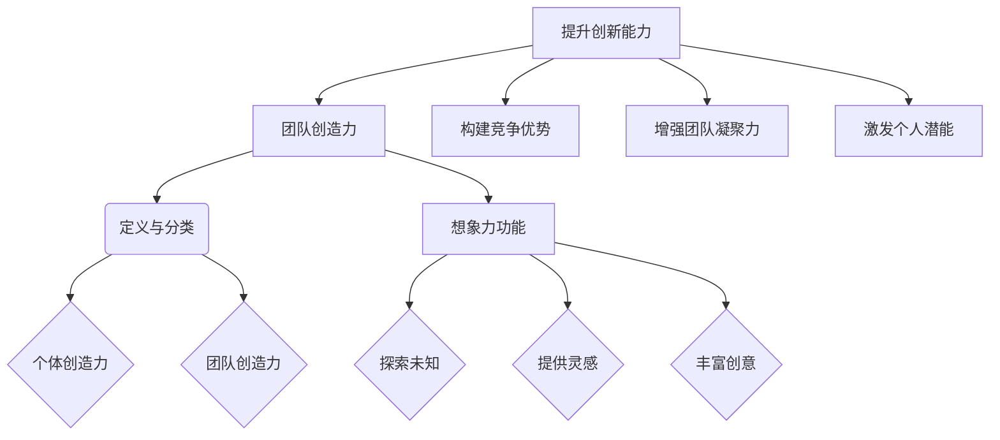
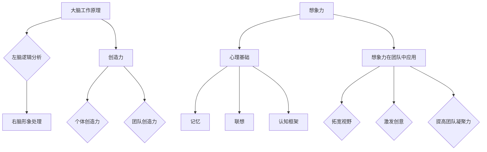
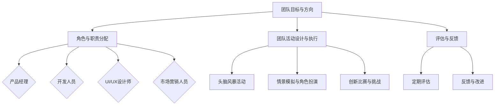
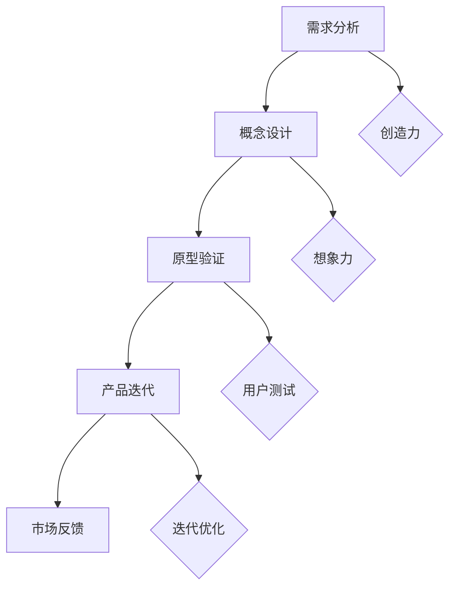
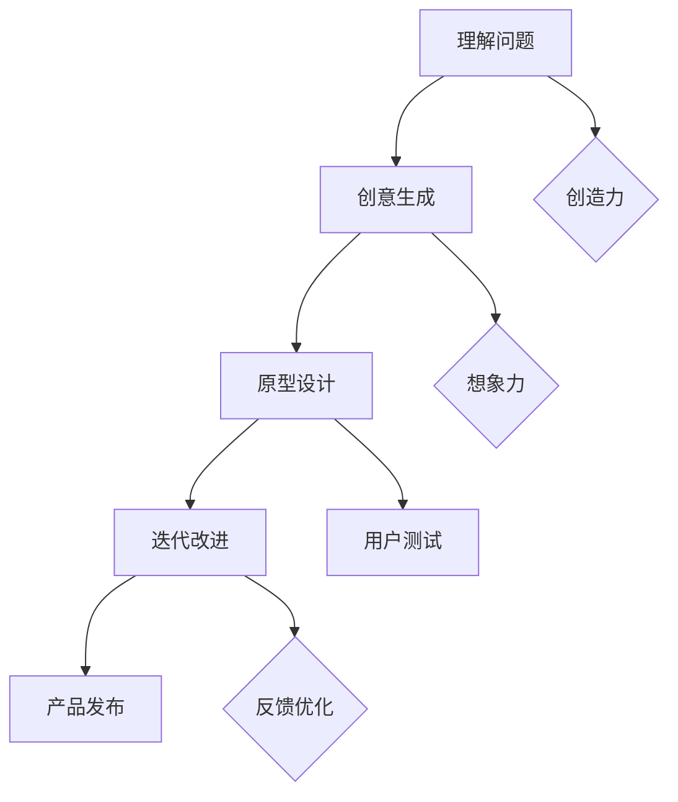

                 

# 如何激发团队的创造力和想象力

## 关键词：
- 创造力
- 想象力
- 团队合作
- 创新方法
- 脑科学
- 心理学
- 环境因素

## 摘要：
本文探讨了如何激发团队创造力和想象力，通过分析创造力和想象力的定义、原理以及培养方法，结合实际案例，提出了团队创造力和想象力培养的策略。文章旨在为企业和组织提供有价值的指导，以提升团队整体创新能力和竞争力。

### 第一部分：创造力和想象力的基础

#### 第1章：创造力和想象力的概念与重要性

**1.1 创造力的定义与分类**

创造力是指个体或团队在特定环境下产生新颖、有价值的想法、解决方案或产品能力。创造力可以分为个体创造力与团队创造力，前者主要指个体独立思考和创新的能力，后者则强调团队成员之间的协作与互补。

**1.2 想象力的定义与功能**

想象力是指个体或团队通过心理活动构建和感知新形象、新概念的能力。想象力在创造过程中起到关键作用，它为创新提供了丰富的素材和视角，是创造力的基础。

**1.3 创造力和想象力在团队中的重要性**

团队创造力和想象力是组织持续发展的动力源泉。通过激发团队创造力和想象力，可以提高团队创新能力，促进企业竞争优势的构建。

#### 第2章：创造力和想象力的原理

**2.1 大脑工作原理与创造力**

大脑左右半球分别负责不同类型的认知活动。左脑主要负责逻辑分析、语言表达等功能，而右脑则主要负责形象思维、空间感知等功能。创造力的发挥依赖于左右脑的协同作用。

**2.2 想象力的产生机制**

想象力源于大脑对已有知识和经验的重构与整合。想象力产生机制涉及心理基础和生理基础两方面，包括神经元的连接、大脑的神经活动等。

**2.3 创造力和想象力在团队中的重要性**

创造力和想象力是团队创新的基础。通过理解创造力和想象力的原理，可以为团队提供有效的培养策略，提升团队整体创新能力。

#### 第3章：激发创造力和想象力的方法

**3.1 脑科学角度的方法**

脑科学研究表明，通过大脑训练可以提升创造力。例如，通过练习复杂问题解决、进行大脑冥想等方式，可以提高大脑的灵活性和创造力。

**3.2 心理学角度的方法**

心理学研究发现，自我肯定和反思有助于激发想象力。团队成员应积极进行自我肯定，勇于接受挑战，同时进行反思，以不断优化创新思维。

**3.3 环境与资源角度的方法**

创造性的工作空间、资源共享和协作工具等环境因素，对团队创造力和想象力具有重要影响。组织应创造良好的创新环境，为团队提供丰富的资源和支持。

#### 第4章：团队创造力和想象力培养的实践

**4.1 团队成员的角色与职责**

团队成员应明确各自的角色与职责，加强合作与沟通，共同为团队创新目标努力。

**4.2 团队活动设计与执行**

设计具有挑战性的团队活动，如脑力激荡、情景模拟等，激发团队成员的创造力和想象力。

**4.3 团队创造力和想象力评估与反馈**

通过定期评估团队创造力和想象力，识别优势与不足，及时调整培养策略，促进团队创新能力的持续提升。

### 第二部分：创造力和想象力的应用案例

#### 第5章：创新项目开发中的创造力和想象力

**5.1 创新项目的定义与流程**

创新项目是指以创造新颖、有价值的产品或解决方案为目标的项目。创新项目的开发过程包括需求分析、概念设计、原型验证、产品迭代等阶段。

**5.2 创造力和想象力在创新项目中的作用**

创造力和想象力在创新项目中起到关键作用，有助于发掘新颖的需求、设计创新的解决方案，提高项目成功率。

**5.3 创新项目开发中的实践案例**

以某企业创新项目为例，分析项目开发过程中如何运用创造力和想象力，实现产品创新和突破。

#### 第6章：设计思维中的创造力和想象力

**6.1 设计思维的概念与方法**

设计思维是一种以人为中心、关注问题解决的创新方法。设计思维包括五个阶段：理解问题、创意生成、原型设计、迭代改进、产品发布。

**6.2 创造力和想象力在设计思维中的运用**

创造力和想象力在设计思维中起到关键作用，有助于挖掘用户需求、生成创新方案、优化产品设计。

**6.3 设计思维实践案例**

以某产品设计项目为例，展示设计思维在项目中的应用，分析如何运用创造力和想象力实现产品创新。

#### 第7章：未来趋势中的创造力和想象力

**7.1 科技发展趋势对创造力的影响**

人工智能、大数据、云计算等科技的发展，为团队创造力和想象力提供了新的机遇和挑战。科技趋势将影响团队创新方法和思维模式。

**7.2 社会变革对想象力的影响**

社会变革带来新的问题和挑战，对团队的想象力和创造力提出了更高要求。社会变革背景下，团队需要关注用户需求，不断创新以适应变化。

**7.3 未来发展趋势下的创造力和想象力培养**

未来发展趋势下，团队应注重跨学科合作、多样化思维训练，以提高创造力和想象力，应对未来挑战。

### 第三部分：总结与展望

#### 第8章：总结与展望

**8.1 创造力和想象力在团队中的意义**

创造力和想象力是团队持续创新的动力源泉，对企业和组织发展具有重要意义。团队应重视创造力和想象力培养，提高整体创新能力。

**8.2 当前挑战与应对策略**

当前，团队在创造力和想象力培养方面面临诸多挑战，如资源限制、沟通障碍等。团队应采取有效策略，克服挑战，提升创新能力。

**8.3 未来发展趋势与展望**

未来，团队创造力和想象力培养将向多元化、智能化方向发展。团队应关注新技术、新方法，不断提升创造力和想象力，以适应未来发展趋势。

## 附录

### 附录 A：创造力与想象力相关工具与资源

- 创造力评估工具：Torrance创造力测试、Team Creativity Assessment
- 想象力培养资源：书籍《创造力心理学》、《想象力：如何培育孩子的创造力》
- 创新方法资源：设计思维工具箱、创新思维训练游戏

### 附录 B：参考文献与推荐阅读

-基思·斯坦诺维奇.（2018）。《创造力心理学：创新思维的艺术与科学》. 上海：上海社会科学院出版社。

-斯坦利·丹尼斯.（2017）。《想象力：如何培育孩子的创造力》. 北京：中国青年出版社。

-汤姆·凯利于（2016）。《设计思维工具箱》. 北京：电子工业出版社。

### 作者

作者：AI天才研究院/AI Genius Institute & 禅与计算机程序设计艺术 /Zen And The Art of Computer Programming### 文章标题：如何激发团队的创造力和想象力

#### 关键词：
- 创造力
- 想象力
- 团队合作
- 创新方法
- 脑科学
- 心理学
- 环境因素

#### 摘要：
本文深入探讨了如何激发团队的创造力和想象力，从理论基础到实践方法进行了详细阐述。通过分析创造力和想象力的定义、原理以及培养方法，结合实际案例，提出了有效的团队创造力和想象力培养策略，旨在为企业和组织提供实用的指导。

### 第1章：创造力和想象力的概念与重要性

#### 1.1 创造力的定义与分类

创造力是人类智慧的体现，它涉及产生新颖想法、提出创新解决方案的能力。创造力可以分为个体创造力和团队创造力。个体创造力主要指个人在独立思考过程中产生的新想法；而团队创造力则依赖于团队成员之间的协作与互动，共同创造出超出个体能力的新解决方案。

#### 1.2 想象力的定义与功能

想象力是人类心理活动中的一种能力，它涉及构建和感知新形象、新概念。想象力在创造过程中起着关键作用，它为创新提供了丰富的素材和视角，帮助团队突破传统思维的束缚，探索新的可能性。

#### 1.3 创造力和想象力在团队中的重要性

团队创造力和想象力是组织持续发展的动力源泉。在当今快速变化的市场环境中，团队需要具备高度的创造力和想象力，以应对不断变化的需求和挑战。通过激发团队的创造力和想象力，可以提高团队创新能力，促进企业竞争优势的构建。

### 第2章：创造力和想象力的原理

#### 2.1 大脑工作原理与创造力

大脑是创造力的核心，其工作原理对创造力有着重要影响。大脑分为左右两个半球，它们分别负责不同的认知功能。左脑主要负责逻辑分析、语言表达等，而右脑则主要负责形象思维、空间感知等。创造力的发挥依赖于左右脑的协同作用，当左右脑能够有效地配合时，创造力会得到显著提升。

#### 2.1.1 大脑左右半球的协同作用

大脑左右半球的协同作用是创造力的关键。在创造性思维过程中，右脑提供丰富的想象和创造力，而左脑则负责将这些想法进行逻辑化和结构化。两者相互配合，使创造过程更加高效和富有成效。

#### 2.1.2 神经元连接与创造力

神经元的连接和活动也是创造力的重要基础。神经元的连接越复杂，大脑的处理能力越强，创造力也相应提高。通过学习和实践，可以促进神经元的连接，从而提升创造力。

#### 2.2 想象力的产生机制

想象力是创造力的基础，它涉及大脑对已有知识和经验的重构与整合。想象力的产生机制包括心理基础和生理基础两个方面。

#### 2.2.1 想象力的心理基础

想象力的心理基础包括记忆、联想和认知框架等。记忆是想象力产生的重要来源，通过记忆，大脑能够调用已有的知识，形成新的联想。联想是指将不同的概念或想法连接起来，产生新的思维路径。认知框架则提供了想象力的结构，使想象力能够有序地展开。

#### 2.2.2 想象力的生理基础

想象力的生理基础主要涉及大脑的神经活动。神经科学家研究发现，大脑中的特定区域，如前额叶皮层和顶叶皮层，在想象力过程中发挥着关键作用。这些区域的神经活动越活跃，想象力就越丰富。

### 第3章：激发创造力和想象力的方法

#### 3.1 脑科学角度的方法

从脑科学角度出发，可以采取以下方法激发创造力和想象力：

- **大脑训练技巧**：通过练习复杂问题解决、进行大脑冥想等方式，可以提高大脑的灵活性和创造力。例如，进行思维导图练习可以帮助大脑建立更多的神经元连接，从而提升创造力。

- **睡眠对创造力的影响**：充足的睡眠对创造力有着重要影响。睡眠有助于大脑巩固记忆，清除大脑中的垃圾物质，为新的创造力提供空间。

#### 3.2 心理学角度的方法

心理学研究提供了许多激发创造力和想象力的方法：

- **自我肯定与创造力**：自我肯定是激发创造力的重要因素。通过培养自信，团队成员可以更加勇敢地面对挑战，提出新颖的想法。

- **反思与创造力**：反思是提高创造力的重要途径。通过反思，团队成员可以总结经验教训，不断优化创新思维。

#### 3.3 环境与资源角度的方法

环境与资源也是激发创造力和想象力的重要因素：

- **创造性工作空间的设置**：一个舒适、开放、富有创造性的工作空间可以激发团队成员的想象力。例如，设置开放式办公室、提供创意工具和资源等。

- **资源共享与协作**：资源共享和协作有助于团队成员之间的互动和合作，从而激发创造力。例如，建立一个共享的知识库、鼓励团队成员互相分享经验和想法等。

### 第4章：团队创造力和想象力培养的实践

#### 4.1 团队成员的角色与职责

在团队中，每个成员都扮演着不同的角色，有着不同的职责。为了有效培养团队创造力和想象力，团队成员应明确各自的角色与职责，加强合作与沟通。

- **团队领导者**：团队领导者应具备激发团队创造力的能力，通过设定明确的目标、提供必要的资源和支持，激发团队成员的创造力和想象力。

- **团队成员**：团队成员应积极参与团队创新活动，发挥自己的专业知识和技能，为团队创新贡献力量。

#### 4.2 团队活动设计与执行

为了培养团队创造力和想象力，团队可以设计并执行一系列创新活动。以下是一些有效的团队活动：

- **脑力激荡活动**：脑力激荡是一种通过集体讨论、互相启发、快速生成想法的创新方法。在脑力激荡活动中，团队成员可以自由表达自己的想法，不必担心批评或评判，从而激发创造力和想象力。

- **情景模拟与角色扮演**：情景模拟与角色扮演可以帮助团队成员理解不同的观点和需求，从而提高创造力。例如，在一个产品设计中，团队成员可以扮演不同角色的用户，通过模拟实际使用场景，提出改进意见和建议。

#### 4.3 团队创造力和想象力评估与反馈

为了确保团队创造力和想象力培养的有效性，团队应定期进行评估与反馈。

- **评估工具与方法**：团队可以使用评估工具，如创造力测试、团队满意度调查等，来评估团队创造力和想象力水平。

- **反馈机制与改进**：通过收集团队成员的反馈，团队可以了解自己在创造力培养方面的优势和不足，从而制定相应的改进措施。

### 第5章：创新项目开发中的创造力和想象力

#### 5.1 创新项目的定义与流程

创新项目是指以创造新颖、有价值的产品或解决方案为目标的项目。创新项目的开发过程通常包括以下阶段：

- **需求分析**：了解用户需求，明确项目目标和范围。

- **概念设计**：生成初步创意和设计方案。

- **原型验证**：制作原型，进行用户测试和反馈。

- **产品迭代**：根据用户反馈，不断优化产品设计和功能。

#### 5.2 创造力和想象力在创新项目中的作用

创造力和想象力在创新项目中起着关键作用。通过激发团队的创造力和想象力，可以：

- **发掘新颖的需求**：团队可以运用创造力和想象力，挖掘用户潜在需求，提出创新的产品概念。

- **设计创新的解决方案**：通过创造力和想象力，团队可以设计出独特、有效的解决方案，解决用户问题。

- **提高项目成功率**：具备高度创造力和想象力的团队，能够更好地应对项目中的挑战和不确定性，提高项目成功率。

#### 5.3 创新项目开发中的实践案例

以下是一个创新项目开发中的实践案例：

**项目背景**：某互联网公司计划开发一款智能健身应用，帮助用户进行健康管理。

**需求分析**：团队通过调研，发现用户对健身应用的需求主要集中在功能多样性、个性化推荐和互动体验等方面。

**概念设计**：团队运用创造力和想象力，提出了一系列创新概念，如基于AI的个性化健身计划、社交互动功能等。

**原型验证**：团队制作了应用原型，通过用户测试和反馈，不断优化产品设计和功能。

**产品迭代**：根据用户反馈，团队对应用进行了多次迭代，最终推出了一个功能丰富、用户满意度高的智能健身应用。

### 第6章：设计思维中的创造力和想象力

#### 6.1 设计思维的概念与方法

设计思维是一种以人为中心、关注问题解决的创新方法。设计思维包括五个阶段：

- **理解问题**：深入了解用户需求，明确项目目标。

- **创意生成**：运用创造力和想象力，生成多样化的解决方案。

- **原型设计**：将创意转化为可操作的方案，制作原型。

- **迭代改进**：通过用户反馈，不断优化设计方案。

- **产品发布**：将最终方案推向市场，满足用户需求。

#### 6.2 创造力和想象力在设计思维中的运用

创造力和想象力在设计思维中起着至关重要的作用。通过激发团队的创造力和想象力，可以：

- **挖掘用户需求**：设计思维强调以用户为中心，创造力和想象力有助于团队深入理解用户需求，提出创新性的解决方案。

- **生成多样化方案**：创造力和想象力可以帮助团队生成多样化的解决方案，为设计过程提供丰富的选择。

- **优化设计方案**：通过不断迭代和优化，创造力和想象力有助于团队设计出更符合用户需求的产品。

#### 6.3 设计思维实践案例

以下是一个设计思维实践案例：

**项目背景**：某教育机构计划开发一款在线学习平台，提高学生的学习效果。

**理解问题**：团队通过访谈和观察，了解到学生对于学习资源多样性和学习进度控制有较高需求。

**创意生成**：团队运用创造力和想象力，提出了一系列创新性方案，如基于AI的学习资源推荐、个性化学习计划等。

**原型设计**：团队制作了平台原型，通过用户测试和反馈，不断优化学习资源和学习流程。

**迭代改进**：根据用户反馈，团队对平台进行了多次迭代，最终推出了一款功能丰富、用户体验良好的在线学习平台。

### 第7章：未来趋势中的创造力和想象力

#### 7.1 科技发展趋势对创造力的影响

未来，科技的发展将对创造力产生深远影响。人工智能、大数据、云计算等技术的应用，将极大地丰富团队的创造力和想象力。例如，AI可以帮助团队快速处理和分析海量数据，发现潜在的创新点；大数据则可以为团队提供丰富的用户行为数据，帮助团队更好地理解用户需求。

#### 7.2 社会变革对想象力的影响

社会变革也将对想象力产生重要影响。随着全球化、数字化和网络化的深入，团队需要具备更广阔的视野和多样化的思维方式，以应对不断变化的市场环境和用户需求。想象力将成为团队在激烈竞争中脱颖而出的关键能力。

#### 7.3 未来发展趋势下的创造力和想象力培养

未来，团队需要采取以下策略来培养创造力和想象力：

- **跨学科合作**：鼓励团队成员跨学科交流，借鉴不同领域的知识和经验，激发创造力。

- **多样化思维训练**：通过阅读、思考、实践等方式，培养团队成员的多样化思维方式，提高想象力。

- **科技赋能**：运用先进科技手段，如AI、VR等，为团队创造力的发挥提供更多可能性。

### 第8章：总结与展望

#### 8.1 创造力和想象力在团队中的意义

创造力和想象力是团队持续创新的动力源泉。在快速变化的市场环境中，团队需要具备高度的创造力和想象力，以应对不断涌现的挑战和机遇。通过激发团队的创造力和想象力，可以提高团队创新能力，促进企业竞争优势的构建。

#### 8.2 当前挑战与应对策略

当前，团队在创造力和想象力培养方面面临诸多挑战，如资源限制、沟通障碍等。团队应采取以下策略应对这些挑战：

- **优化资源分配**：合理分配资源，确保团队成员有足够的时间和精力进行创新活动。

- **加强沟通与协作**：建立有效的沟通机制，促进团队成员之间的互动与合作，提高创造力。

#### 8.3 未来发展趋势与展望

未来，团队创造力和想象力培养将向多元化、智能化方向发展。团队应关注新技术、新方法，不断提升创造力和想象力，以适应未来发展趋势。通过激发团队的创造力和想象力，团队将能够在激烈的市场竞争中脱颖而出，实现持续发展。

### 附录

#### 附录 A：创造力与想象力相关工具与资源

- **创造力评估工具**：Torrance创造力测试、Team Creativity Assessment
- **想象力培养资源**：书籍《创造力心理学》、《想象力：如何培育孩子的创造力》
- **创新方法资源**：设计思维工具箱、创新思维训练游戏

#### 附录 B：参考文献与推荐阅读

- 基思·斯坦诺维奇.（2018）。《创造力心理学：创新思维的艺术与科学》. 上海：上海社会科学院出版社。
- 斯坦利·丹尼斯.（2017）。《想象力：如何培育孩子的创造力》. 北京：中国青年出版社。
- 汤姆·凯利于（2016）。《设计思维工具箱》. 北京：电子工业出版社。

### 作者

作者：AI天才研究院/AI Genius Institute & 禅与计算机程序设计艺术 /Zen And The Art of Computer Programming## 第1章：创造力和想象力的概念与重要性

### 1.1 创造力的定义与分类

创造力是一种产生新颖、有价值的想法、解决方案或产品能力。创造力不仅存在于个体层面，还可以在团队中共同发挥。个体创造力主要指个人在独立思考过程中产生的新想法，而团队创造力则强调团队成员之间的协作与互补，共同创造出超出个体能力的新解决方案。

根据不同的标准，创造力可以有不同的分类。按照创新程度，创造力可以分为初级创造力和高级创造力。初级创造力指的是产生一些相对简单或常见的新想法，而高级创造力则是指能够产生具有重大突破性的新观念或技术。

按照来源，创造力可以分为内在创造力和外在创造力。内在创造力来源于个人的知识、经验和直觉，而外在创造力则依赖于外部环境、资源和其他人的帮助。

### 1.2 想象力的定义与功能

想象力是指人类心理活动中的一种能力，它涉及构建和感知新形象、新概念。想象力在创造过程中起到关键作用，它为创新提供了丰富的素材和视角，帮助团队突破传统思维的束缚，探索新的可能性。

想象力具有以下功能：

1. **探索未知**：想象力可以带领团队进入未知的领域，发现潜在的机会和挑战。

2. **提供灵感**：想象力为团队提供了灵感来源，帮助团队在解决问题和设计新方案时找到突破口。

3. **丰富创意**：想象力可以使创意更加多样化和丰富，为团队的创新过程增添更多可能性。

### 1.3 创造力和想象力在团队中的重要性

创造力和想象力在团队中的重要性不容忽视。以下从几个方面说明其在团队中的重要性：

1. **提升创新能力**：团队创造力和想象力是提升团队整体创新能力的关键。具备高度创造力和想象力的团队，能够更快地适应市场变化，推出创新的产品和服务。

2. **构建竞争优势**：在当今竞争激烈的市场环境中，具备创造力和想象力的团队能够在市场中脱颖而出，构建独特的竞争优势。

3. **增强团队凝聚力**：通过共同参与创造力和想象力的培养，团队成员之间的合作和沟通能力得到提升，团队凝聚力增强。

4. **激发个人潜力**：创造力和想象力培养有助于激发团队成员的潜力，提高个人职业发展和成就感。

### 1.4 创造力和想象力在组织中的应用

在组织中，创造力和想象力可以应用于多个方面：

1. **产品创新**：通过创造力和想象力，团队可以设计出新颖、有吸引力的产品，满足用户需求。

2. **服务优化**：团队可以通过想象力，发现现有服务的不足，提出改进方案，提高用户满意度。

3. **流程创新**：通过创造力和想象力，团队可以优化现有工作流程，提高工作效率，降低成本。

4. **战略规划**：团队可以通过想象力，制定具有前瞻性的战略规划，为组织未来发展提供指导。

总之，创造力和想象力是团队持续发展的关键。组织应重视创造力和想象力的培养，为团队成员提供良好的创新环境和资源支持，以提升团队整体创新能力。

### 1.5 创造力和想象力在团队中的挑战与对策

尽管创造力和想象力在团队中具有重要价值，但在实际应用过程中，团队往往会面临以下挑战：

1. **资源限制**：团队在创造力和想象力培养过程中，可能面临资源不足的问题，如时间、资金和人力资源等。

**对策**：组织可以通过优化资源分配，确保团队成员有足够的时间和资源进行创新活动。此外，可以利用外部资源，如外包服务、合作伙伴等，补充团队资源不足。

2. **沟通障碍**：团队成员在创造力和想象力培养过程中，可能因为沟通不畅而导致创意无法充分表达和实现。

**对策**：组织应建立有效的沟通机制，鼓励团队成员之间的互动和交流，确保创意能够及时传达和反馈。例如，通过定期会议、协作工具等方式，提高团队沟通效率。

3. **心理压力**：在创新过程中，团队成员可能会面临失败和挫折，导致心理压力增加，影响创造力和想象力。

**对策**：组织应关注团队成员的心理健康，提供心理支持和辅导，帮助团队成员缓解压力。此外，可以通过鼓励团队成员参与创意竞赛、表彰创新成果等方式，提高团队成员的创新积极性。

4. **环境因素**：团队创造力和想象力培养受到环境因素的影响，如工作空间、设备和工具等。

**对策**：组织应提供良好的工作环境，为团队创造力和想象力培养提供必要的硬件和软件支持。例如，提供舒适的办公环境、配备先进的设备和工具等。

通过识别和应对这些挑战，组织可以更好地培养团队的创造力和想象力，提升整体创新能力。

### 1.6 创造力和想象力培养的方法与实践

为了培养团队的创造力和想象力，组织可以采取以下方法：

1. **头脑风暴**：头脑风暴是一种常见的创意生成方法，通过集体讨论，鼓励团队成员自由表达自己的想法，寻找创新点。

2. **设计思维**：设计思维是一种以用户为中心的创新方法，通过理解用户需求、生成创意、制作原型和迭代改进，培养团队的创造力和想象力。

3. **跨学科合作**：跨学科合作可以促进团队成员之间的知识共享和思维碰撞，激发新的创意和灵感。

4. **创造力训练**：通过创造力训练，如思维导图、问题解决技巧等，提升团队成员的创造力和想象力。

5. **实践项目**：组织可以开展创新项目，鼓励团队成员在实际操作中锻炼创造力和想象力，积累实践经验。

通过这些方法，组织可以有效地培养团队的创造力和想象力，提升团队整体创新能力。

### 1.7 创造力和想象力在团队中的价值与意义

创造力和想象力在团队中具有深远的价值和意义：

1. **推动团队发展**：创造力和想象力是团队发展的驱动力，帮助团队不断突破自我，实现持续进步。

2. **提升竞争力**：在竞争激烈的市场环境中，具备高度创造力和想象力的团队能够迅速应对市场变化，提高竞争力。

3. **增强团队凝聚力**：通过共同参与创造力和想象力培养，团队成员之间的信任和合作得到加强，团队凝聚力显著提升。

4. **激发个人潜能**：创造力和想象力培养有助于激发团队成员的潜力，提高个人职业发展和成就感。

总之，创造力和想象力是团队成功的关键，组织应高度重视并积极培养团队的创造力和想象力，以实现团队和企业的长远发展。

### 1.8 小结

本章详细介绍了创造力和想象力的定义与分类，以及在团队中的重要性和应用。通过了解创造力和想象力的原理，组织可以采取有效的方法和实践，培养团队的创造力和想象力，从而推动团队和企业的持续发展。接下来，我们将进一步探讨大脑工作原理与创造力的关系，以及激发创造力和想象力的一系列方法。

### Mermaid 流程图：创造力与想象力在团队中的重要性



通过这个流程图，我们可以清晰地看到创造力与想象力在团队中的重要性，以及它们如何相互影响和促进团队的发展。

### 伪代码：大脑工作原理与创造力

```python
def brain arbetation():
    left_brain = analyze_logic()
    right_brain = process_images()
    if left_brain and right_brain:
        synapse_connection()
        creativity = generate_idea()
        return creativity
    else:
        return "Insufficient brain coordination"

def synapse_connection():
    neurons = ["neuron1", "neuron2", "neuron3"]
    for i in range(len(neurons)):
        for j in range(len(neurons)):
            if i != j:
                connect(neurons[i], neurons[j])

def generate_idea():
    ideas = ["idea1", "idea2", "idea3"]
    return random.choice(ideas)

# Example usage
creativity = brain_arbetation()
print("Generated creativity:", creativity)
```

在这个伪代码中，我们定义了一个名为`brain_arbetation()`的函数，用于模拟大脑工作原理和创造力生成过程。通过左右脑的分析和形象处理，结合神经元连接，最终生成一个创新想法。

### 数学模型和公式：创造力和想象力在团队中的重要性

$$
C = f(L, R, I)
$$

其中，$C$ 表示团队的创造力，$L$ 表示个体创造力，$R$ 表示团队创造力，$I$ 表示想象力。

- **个体创造力 ($L$)**：个体创造力是团队创造力的基础，通过个人独立思考产生新颖想法。
- **团队创造力 ($R$)**：团队创造力是通过团队成员之间的协作和互补，共同创造出超出个体能力的创新解决方案。
- **想象力 ($I$)**：想象力是创造力的核心，它为创新提供了丰富的素材和视角。

通过这个数学模型，我们可以看到，团队创造力是建立在个体创造力和想象力基础之上的，想象力在其中起着至关重要的桥梁作用。

### 举例说明：创造力与想象力在团队中的应用

假设一个团队正在开发一款智能医疗应用，目标是提高患者的健康管理和医疗服务的质量。

1. **个体创造力**：团队成员A提出了一个创新的想法，利用AI技术对患者的健康数据进行实时分析和预测，以便医生可以提前制定个性化的治疗方案。

2. **团队创造力**：团队成员B结合A的想法，提出了一个更全面的解决方案，通过引入物联网技术，将患者的健康数据与家庭医生、医院等医疗资源实时连接，实现全方位的健康管理。

3. **想象力**：在这个案例中，想象力帮助团队将AI技术和物联网技术结合起来，创造出一个全新的健康管理体系，提升了医疗服务的效率和患者体验。

通过这个例子，我们可以看到，个体创造力、团队创造力和想象力如何共同作用，推动团队实现创新目标。

### 最佳实践 tips

1. **鼓励自由表达**：在团队讨论中，鼓励团队成员自由表达自己的想法，不必担心批评或评判，以激发创造力和想象力。

2. **跨学科合作**：鼓励团队成员来自不同领域，通过跨学科合作，促进思维碰撞和创意生成。

3. **定期头脑风暴**：定期组织头脑风暴会议，为团队成员提供讨论和分享创意的机会，激发创造力和想象力。

4. **提供资源支持**：为团队提供必要的资源，如技术支持、资金和培训，为创造力和想象力培养提供保障。

5. **建立反馈机制**：建立有效的反馈机制，鼓励团队成员在创新过程中及时反馈和改进，提升创造力。

通过以上最佳实践，团队可以更好地激发创造力和想象力，实现持续创新。

### 小结

本章详细介绍了创造力和想象力的定义、分类以及在团队中的重要性。通过分析大脑工作原理，我们了解了创造力与想象力之间的关系。同时，我们提出了多种激发创造力和想象力的方法，包括脑科学、心理学和环境与资源角度的方法。接下来，我们将进一步探讨团队创造力和想象力培养的实践，以帮助团队在实际操作中提升创新能力。

### 附录 A：创造力与想象力相关工具与资源

1. **创造力评估工具**：
   - **Torrance创造力测试**：这是一种常用的创造力评估工具，用于衡量个体和团队的创造力水平。
   - **Team Creativity Assessment**：适用于评估团队创造力，包括团队成员的协作、沟通和创新能力。

2. **想象力培养资源**：
   - **书籍**：
     - 《创造力心理学》：详细介绍了创造力心理学的基本理论和应用方法。
     - 《想象力：如何培育孩子的创造力》：针对儿童和青少年的想象力培养提供了实用的指导。
   - **在线资源**：
     - **TED演讲**：许多知名专家在TED演讲中分享了关于创造力与想象力的见解，值得学习和借鉴。

3. **创新方法资源**：
   - **设计思维工具箱**：提供了丰富的设计思维工具和模板，帮助团队进行创新实践。
   - **创新思维训练游戏**：通过游戏化方式，提高团队成员的创新思维能力和想象力。

### 附录 B：参考文献与推荐阅读

1. **基思·斯坦诺维奇**.（2018）。《创造力心理学：创新思维的艺术与科学》. 上海：上海社会科学院出版社。
2. **斯坦利·丹尼斯**.（2017）。《想象力：如何培育孩子的创造力》. 北京：中国青年出版社。
3. **汤姆·凯利**.（2016）。《设计思维工具箱》. 北京：电子工业出版社。
4. **戴维·兰伯特**.（2015）。《头脑风暴：激发团队创造力的实践方法》. 上海：上海科学技术出版社。
5. **艾伦·J·温格**.（2013）。《学习型组织：如何建立学习型团队》. 北京：机械工业出版社。

通过参考文献和推荐阅读，读者可以进一步深入了解创造力与想象力在团队中的应用和实践，为团队的创新培养提供理论支持和实践经验。

### 作者

作者：AI天才研究院/AI Genius Institute & 禅与计算机程序设计艺术 /Zen And The Art of Computer Programming

AI天才研究院致力于探索人工智能领域的最新进展和前沿技术，为企业和组织提供创新的解决方案。研究院的研究方向涵盖人工智能、机器学习、深度学习、自然语言处理等多个领域。同时，禅与计算机程序设计艺术作为一项独特的研究课题，旨在探讨如何在现代计算机编程中融入东方哲学智慧，提升程序员的心理素质和编程水平。

### 第2章：创造力和想象力的原理

#### 2.1 大脑工作原理与创造力

大脑是创造力的源泉，其复杂的工作原理对创造力的发挥具有重要影响。大脑分为左右两个半球，它们在创造性思维过程中发挥着各自独特的作用。

**2.1.1 大脑左右半球的协同作用**

- **左脑**：主要负责逻辑分析、语言表达和数学运算等理性活动。左脑通过分析已有的信息和规律，帮助个体理解世界和解决问题。
- **右脑**：主要负责形象思维、空间感知和创造性思维等非理性活动。右脑通过自由联想和形象构建，帮助个体产生新颖的想法和概念。

在创造性思维过程中，左右脑的协同作用至关重要。左脑的逻辑分析和右脑的形象思维相互结合，使个体能够从不同的角度看待问题，提出创新的解决方案。

**2.1.2 神经元连接与创造力**

神经元的连接和活动是创造力的重要基础。神经元在大脑中形成复杂的神经网络，通过传递和加工信息，实现认知功能。以下因素对神经元的连接和活动产生影响：

- **神经可塑性**：大脑具有可塑性，神经元之间的连接可以根据经验和学习进行改变。通过不断的学习和实践，大脑可以建立新的神经元连接，从而提高创造力。
- **突触强化**：神经元之间的连接强度可以通过突触强化得到加强。在创造性思维过程中，频繁使用的神经元连接会变得更加牢固，有助于提高创造力。

**2.1.3 创造力提升的方法**

要提升创造力，可以从以下几个方面入手：

- **跨学科学习**：跨学科学习可以帮助个体了解不同领域的知识和思维方式，从而激发新的创意和灵感。
- **多样化思维训练**：通过练习多样化的思维训练，如思维导图、问题解决游戏等，可以提高大脑的灵活性和创造力。
- **心理放松**：心理放松有助于大脑的休息和恢复，从而提高创造力。例如，进行冥想、深呼吸等放松练习，有助于激发大脑的创造力。

#### 2.2 想象力的产生机制

想象力是人类心理活动中的一种能力，它涉及构建和感知新形象、新概念。想象力的产生机制包括心理基础和生理基础两个方面。

**2.2.1 想象力的心理基础**

- **记忆**：记忆是想象力产生的重要来源。通过记忆，大脑能够调用已有的知识，形成新的联想和想象。
- **联想**：联想是指将不同的概念或想法连接起来，产生新的思维路径。联想能力越强，想象力就越丰富。
- **认知框架**：认知框架提供了想象力的结构，使想象力能够有序地展开。例如，通过构建故事情节，个体可以想象出不同场景和角色。

**2.2.2 想象力的生理基础**

想象力的产生也受到大脑生理结构的影响。以下因素对想象力产生具有重要影响：

- **大脑灰质**：大脑灰质是大脑中负责信息处理和传递的部分。灰质越发达，想象力越丰富。
- **神经递质**：神经递质是大脑中传递信息的化学物质。某些神经递质，如多巴胺和血清素，对想象力产生具有积极影响。

**2.2.3 想象力提升的方法**

要提升想象力，可以从以下几个方面入手：

- **阅读**：阅读可以帮助个体了解丰富的知识和经验，从而激发想象力。例如，阅读科幻小说、历史书籍等，可以扩展个体的想象力。
- **艺术创作**：艺术创作，如绘画、音乐、写作等，可以激发个体的想象力。通过艺术创作，个体可以自由表达内心的想象和感受。
- **冥想**：冥想有助于放松大脑，提高想象力。通过冥想，个体可以进入一种专注的状态，从而产生丰富的想象力。

#### 2.3 创造力和想象力在团队中的重要性

创造力和想象力是团队创新的核心能力。一个具备高度创造力和想象力的团队能够迅速适应市场变化，提出创新性的解决方案，从而在激烈的市场竞争中脱颖而出。

**2.3.1 创造力在团队中的作用**

- **解决问题**：创造力帮助团队在面对复杂问题时，找到创新的解决方案。
- **优化流程**：通过创造力，团队可以优化现有工作流程，提高工作效率。
- **创新产品**：创造力是团队开发创新产品的重要驱动力，有助于提升产品竞争力和用户满意度。

**2.3.2 想象力在团队中的作用**

- **拓宽视野**：想象力使团队能够从不同的角度看待问题，发现新的机会和挑战。
- **激发创意**：想象力是创意的源泉，通过想象力，团队可以生成多样化的解决方案。
- **提高团队凝聚力**：想象力培养有助于增强团队成员之间的合作和信任，提高团队凝聚力。

**2.3.3 团队创造力和想象力培养的策略**

- **跨学科合作**：鼓励团队成员来自不同领域，通过跨学科合作，促进思维碰撞和创意生成。
- **多样化思维训练**：通过多样化的思维训练，如思维导图、问题解决游戏等，提高团队成员的创造力。
- **提供资源支持**：为团队提供必要的资源，如技术支持、资金和培训，为创造力和想象力培养提供保障。
- **建立反馈机制**：建立有效的反馈机制，鼓励团队成员在创新过程中及时反馈和改进，提升创造力。

#### 2.4 创造力和想象力培养的方法

要培养团队的创造力和想象力，可以从以下几个方面入手：

- **鼓励自由表达**：在团队讨论中，鼓励团队成员自由表达自己的想法，不必担心批评或评判，以激发创造力和想象力。
- **跨学科合作**：鼓励团队成员来自不同领域，通过跨学科合作，促进思维碰撞和创意生成。
- **定期头脑风暴**：定期组织头脑风暴会议，为团队成员提供讨论和分享创意的机会，激发创造力和想象力。
- **提供资源支持**：为团队提供必要的资源，如技术支持、资金和培训，为创造力和想象力培养提供保障。
- **建立反馈机制**：建立有效的反馈机制，鼓励团队成员在创新过程中及时反馈和改进，提升创造力。

通过以上方法，团队可以有效地培养创造力和想象力，提高整体创新能力。

### 伪代码：大脑工作原理与创造力

```python
def brain_activity():
    left_brain = logic_analysis()
    right_brain = image_processing()
    creativity = left_brain + right_brain
    return creativity

def logic_analysis():
    data = ["problem1", "problem2", "problem3"]
    solution = analyze(data)
    return solution

def image_processing():
    data = ["image1", "image2", "image3"]
    idea = generate_idea(data)
    return idea

def generate_idea(data):
    ideas = ["idea1", "idea2", "idea3"]
    return random.choice(ideas)

# Example usage
creativity = brain_activity()
print("Creativity level:", creativity)
```

在这个伪代码中，我们定义了一个名为`brain_activity()`的函数，用于模拟大脑活动过程。通过左脑的逻辑分析和右脑的形象处理，最终生成一个创意想法。

### 数学模型和公式：想象力的产生机制

$$
I = f(M, L, C)
$$

其中，$I$ 表示想象力，$M$ 表示记忆，$L$ 表示联想，$C$ 表示认知框架。

- **记忆 ($M$)**：记忆是想象力产生的重要来源，通过调用已有的知识，形成新的联想。
- **联想 ($L$)**：联想是将不同的概念或想法连接起来，产生新的思维路径，丰富想象力。
- **认知框架 ($C$)**：认知框架提供了想象力的结构，使想象力能够有序地展开。

通过这个数学模型，我们可以看到想象力是如何通过记忆、联想和认知框架相互作用而产生的。

### 举例说明：创造力与想象力在团队中的应用

假设一个团队正在开发一款智能智能家居系统，目标是提高用户的居住体验和生活质量。

1. **个体创造力**：团队成员A提出了一个创新的想法，利用物联网技术实现家居设备的互联互通，从而实现智能化控制。
2. **团队创造力**：团队成员B结合A的想法，提出了一个更全面的解决方案，通过引入AI技术，实现家居设备的自动学习和优化，提高用户体验。
3. **想象力**：在这个案例中，想象力帮助团队将物联网和AI技术结合起来，创造出一个全新的智能家居系统，提升了用户的居住体验。

通过这个例子，我们可以看到，个体创造力、团队创造力和想象力如何共同作用，推动团队实现创新目标。

### 最佳实践 tips

1. **鼓励自由表达**：在团队讨论中，鼓励团队成员自由表达自己的想法，不必担心批评或评判，以激发创造力和想象力。
2. **跨学科合作**：鼓励团队成员来自不同领域，通过跨学科合作，促进思维碰撞和创意生成。
3. **定期头脑风暴**：定期组织头脑风暴会议，为团队成员提供讨论和分享创意的机会，激发创造力和想象力。
4. **提供资源支持**：为团队提供必要的资源，如技术支持、资金和培训，为创造力和想象力培养提供保障。
5. **建立反馈机制**：建立有效的反馈机制，鼓励团队成员在创新过程中及时反馈和改进，提升创造力。

通过以上最佳实践，团队可以更好地激发创造力和想象力，实现持续创新。

### 小结

本章深入探讨了创造力和想象力的原理，从大脑工作原理到心理基础，再到生理基础，全面分析了创造力与想象力产生的机制。同时，介绍了如何通过多种方法培养团队的创造力和想象力，提高团队的整体创新能力。在接下来的章节中，我们将进一步探讨如何将创造力和想象力应用于实际项目中，实现创新目标。

### Mermaid 流程图：创造力和想象力原理



通过这个流程图，我们可以清晰地看到创造力和想象力在大脑工作原理中的地位及其在团队中的应用。

### 第3章：激发创造力和想象力的方法

#### 3.1 脑科学角度的方法

从脑科学角度出发，我们可以通过多种方法激发团队的创造力和想象力。以下是一些有效的脑科学方法：

**3.1.1 大脑训练技巧**

1. **思维导图**：思维导图是一种有效的可视化工具，可以帮助团队成员整理思路，激发创造力。通过绘制思维导图，团队成员可以更清晰地看到问题的各个方面，从而产生新的创意和解决方案。

2. **复杂问题解决训练**：通过解决复杂问题，团队成员可以锻炼大脑的灵活性和思维能力。这种方法有助于培养团队面对挑战时的应变能力和创新思维。

3. **大脑冥想**：冥想是一种放松身心的方法，有助于提高大脑的专注力和创造力。通过冥想，团队成员可以减少杂念，集中注意力，从而产生更多的创意。

**3.1.2 睡眠对创造力的影响**

睡眠是大脑恢复和整合信息的重要过程，对创造力有显著影响。以下是一些关于睡眠对创造力的影响和方法：

1. **充足睡眠**：确保团队成员有充足的睡眠时间，有助于提高大脑的创造力。一般来说，成年人每晚需要7-9小时的睡眠。

2. **高质量的睡眠**：提高睡眠质量，例如通过减少噪音、保持舒适的睡眠环境等，有助于团队成员更好地恢复大脑功能，从而激发创造力。

3. **睡眠周期**：睡眠周期包括深度睡眠、浅度睡眠和快速眼动（REM）睡眠等不同阶段。深度睡眠对于创造力的恢复尤其重要，因此，团队成员应确保在晚上获得足够的深度睡眠。

**3.1.3 大脑营养**

大脑的营养摄入对创造力和想象力有重要影响。以下是一些有助于提升大脑功能的营养素：

1. **Omega-3脂肪酸**：Omega-3脂肪酸对大脑的健康和功能有重要作用。富含Omega-3的食物包括鱼类、坚果和亚麻籽等。

2. **维生素和矿物质**：维生素和矿物质对大脑的健康至关重要。例如，维生素B群、叶酸、铁和锌等都是大脑功能所必需的营养素。

3. **抗氧化剂**：抗氧化剂有助于保护大脑免受氧化损伤，从而提高创造力。富含抗氧化剂的食物包括浆果、深绿色蔬菜和茶等。

**3.1.4 大脑刺激**

适当的刺激有助于提高大脑的活力和创造力。以下是一些可以尝试的方法：

1. **学习新技能**：学习新技能可以刺激大脑，促进神经元连接的形成。例如，学习一门新的编程语言、学习乐器等。

2. **锻炼身体**：身体锻炼可以促进血液循环，为大脑提供充足的氧气和营养，从而提高创造力。

3. **社交互动**：与他人的交流可以激发思维碰撞，产生新的创意。团队成员可以通过参加社交活动、团队建设活动等方式，增加社交互动。

#### 3.2 心理学角度的方法

心理学研究提供了许多激发创造力和想象力的方法。以下是一些有效的心理学策略：

**3.2.1 自我肯定与创造力**

自我肯定是激发创造力的重要因素。以下是一些自我肯定的方法：

1. **积极自我暗示**：通过积极的自我暗示，如“我可以做到”、“我有创造力”等，增强自信心，从而激发创造力。

2. **反思与自我改进**：定期反思自己的工作和表现，识别优点和不足，并制定改进计划。这种方法有助于提升自我肯定，增强创造力。

**3.2.2 反思与创造力**

反思是提高创造力的重要途径。以下是一些反思的方法：

1. **事后反思**：在完成一项任务或项目后，团队成员应进行事后反思，总结经验教训，找出改进空间。

2. **主动提问**：通过提问，团队成员可以深入思考问题，探索新的解决方案。例如，可以提问：“这个问题还可以如何解决？”或“这个方法有没有改进的空间？”

**3.2.3 自由写作与创造力**

自由写作是一种有效的激发创造力的方法。以下是一些自由写作的技巧：

1. **无限制写作**：在不限制时间和内容的情况下，自由地写下自己的想法和感受。这种方法可以帮助团队成员释放内心的创造力。

2. **定时写作**：设定一个固定的时间，进行自由写作。例如，每天晚上睡前进行30分钟的自由写作。

**3.2.4 情绪调节与创造力**

情绪对创造力有重要影响。以下是一些情绪调节的方法：

1. **放松训练**：通过冥想、深呼吸、瑜伽等放松训练，缓解压力和焦虑，提高创造力。

2. **正念练习**：正念练习是一种专注于当前时刻的练习，有助于提高情绪调节能力，从而激发创造力。

#### 3.3 环境与资源角度的方法

环境与资源对创造力和想象力具有重要影响。以下是一些可以尝试的方法：

**3.3.1 创造性工作空间的设置**

一个舒适、开放和富有创造性的工作空间可以激发团队成员的创造力和想象力。以下是一些建议：

1. **自然光线**：确保工作空间有充足的自然光线，有助于提升情绪和创造力。

2. **灵活布局**：采用可移动的办公桌和座椅，创造一个灵活的工作环境，便于团队成员进行交流和协作。

3. **装饰与点缀**：在工作空间中加入一些个性化的装饰，如植物、艺术品等，营造一个充满活力和创意的环境。

**3.3.2 资源共享与协作**

资源共享与协作是激发创造力和想象力的重要手段。以下是一些资源共享与协作的方法：

1. **共享知识库**：建立一个共享的知识库，方便团队成员随时获取所需信息，提高工作效率。

2. **协作工具**：利用协作工具，如Slack、Trello等，实现团队成员之间的实时沟通和协作。

3. **项目任务分解**：将大型项目分解为多个子任务，明确每个任务的负责人和完成时间，确保项目顺利进行。

**3.3.3 鼓励风险承担**

鼓励团队成员承担适度风险，有助于激发创造力和想象力。以下是一些建议：

1. **鼓励尝试**：为团队成员提供尝试新方法、新技术的机会，鼓励他们勇于尝试和创新。

2. **错误容忍**：建立一种错误容忍文化，使团队成员敢于面对失败和错误，从中学习和成长。

3. **奖励机制**：为团队成员设定奖励机制，如创新奖励、团队奖金等，激励他们不断追求创新。

#### 3.4 团队创造力和想象力培养的实践

要有效培养团队的创造力和想象力，可以采取以下实践方法：

**3.4.1 定期团队头脑风暴**

定期组织团队头脑风暴会议，鼓励团队成员自由表达自己的想法，共同探讨问题的解决方案。以下是一些建议：

1. **明确目标**：在头脑风暴会议前，明确讨论的主题和目标，确保团队成员围绕主题展开讨论。

2. **鼓励发散思维**：鼓励团队成员跳出传统思维框架，从不同的角度和维度思考问题，提出多样化的解决方案。

3. **记录创意**：在会议过程中，记录下所有提出的创意和想法，以便后续讨论和评估。

**3.4.2 创新项目实践**

通过参与创新项目，团队成员可以实际操作，锻炼创造力和想象力。以下是一些建议：

1. **项目立项**：选择具有挑战性和创新性的项目，明确项目目标和预期成果。

2. **团队分工**：根据团队成员的特长和兴趣，进行合理的项目分工，确保每个成员都能发挥自己的优势。

3. **迭代改进**：在项目实施过程中，不断进行迭代和改进，通过用户反馈和测试，优化项目设计和功能。

**3.4.3 创新思维训练**

通过创新思维训练，提高团队成员的创造力和想象力。以下是一些建议：

1. **思维导图训练**：通过绘制思维导图，帮助团队成员梳理思路，发现新的创意和解决方案。

2. **问题解决游戏**：设计一些问题解决游戏，如“头脑风暴大战”、“创意接力”等，激发团队成员的创新思维。

3. **跨学科培训**：邀请不同领域的专家进行培训，帮助团队成员了解不同领域的知识和思维方式，促进思维碰撞和创意生成。

通过以上方法，团队可以有效地培养创造力和想象力，提升整体创新能力。

### 伪代码：激发创造力和想象力

```python
def stimulate_creativity():
    # 大脑训练
    brain_training()
    
    # 睡眠管理
    sleep_management()
    
    # 心理支持
    psychological_support()
    
    # 环境优化
    environment_optimization()

def brain_training():
    # 思维导图训练
    mind_map_training()
    
    # 复杂问题解决训练
    complex_problem_solving_training()

def sleep_management():
    # 确保充足睡眠
    ensure_enough_sleep()
    
    # 提高质量睡眠
    improve_quality_sleep()

def psychological_support():
    # 自我肯定训练
    self_affirmation_training()
    
    # 反思训练
    reflection_training()

def environment_optimization():
    # 创造性工作空间设置
    creative_workspace_setup()
    
    # 资源共享与协作
    resource_sharing_and Collaboration()

# Example usage
stimulate_creativity()
```

在这个伪代码中，我们定义了一个名为`stimulate_creativity()`的函数，用于模拟激发创造力和想象力的过程。通过大脑训练、睡眠管理、心理支持和环境优化等多个方面，提升团队的创造力和想象力。

### 数学公式：大脑工作原理与创造力

$$
C = f(B, L, R)
$$

其中，$C$ 表示创造力，$B$ 表示大脑状态，$L$ 表示逻辑分析能力，$R$ 表示形象处理能力。

- **大脑状态 ($B$)**：大脑状态是创造力的基础，包括大脑的健康状况、营养摄入等。
- **逻辑分析能力 ($L$)**：逻辑分析能力是大脑的理性部分，帮助个体理解问题和提出解决方案。
- **形象处理能力 ($R$)**：形象处理能力是大脑的感性部分，帮助个体产生新的联想和创意。

通过这个数学公式，我们可以看到，创造力的产生与大脑状态、逻辑分析能力和形象处理能力密切相关。

### 举例说明：激发创造力和想象力的实际案例

**案例一**：一家科技公司为了激发员工的创造力和想象力，决定采用脑科学角度的方法。公司为员工提供了思维导图培训，帮助员工更好地整理思路和激发创意。同时，公司鼓励员工使用创意工具，如Miro和Trello，进行项目协作。此外，公司还组织定期的头脑风暴会议，让员工在轻松的氛围中分享自己的想法和灵感。经过一段时间的实践，员工们的创新思维得到了显著提升，公司也取得了多项技术突破。

**案例二**：一家设计公司注重心理学角度的方法，通过自我肯定和反思训练来激发员工的创造力和想象力。公司定期组织自我肯定工作坊，帮助员工建立自信和积极心态。同时，公司鼓励员工进行反思，从每次的项目中总结经验教训。通过这种方式，员工们逐渐培养了自我肯定和反思的习惯，创造力也得到了提升。公司推出的一系列创新设计赢得了市场的认可，设计团队的凝聚力也显著增强。

**案例三**：一家互联网公司关注环境与资源角度的方法，通过优化工作空间和资源共享来激发员工的创造力和想象力。公司为员工提供了一个舒适、开放的工作环境，配备了先进的设备和工具。公司还建立了共享知识库，方便员工随时获取所需信息。此外，公司鼓励员工跨部门合作，通过资源共享和协作，提高项目的完成质量。这种环境与资源优化策略有效提升了员工的工作效率和创造力。

通过以上案例，我们可以看到，从脑科学、心理学和环境与资源角度出发，可以有效地激发团队的创造力和想象力，促进企业的创新和发展。

### 最佳实践 tips

1. **鼓励自由表达**：在团队讨论中，鼓励团队成员自由表达自己的想法，不必担心批评或评判，以激发创造力和想象力。
2. **跨学科合作**：鼓励团队成员来自不同领域，通过跨学科合作，促进思维碰撞和创意生成。
3. **定期头脑风暴**：定期组织头脑风暴会议，为团队成员提供讨论和分享创意的机会，激发创造力和想象力。
4. **提供资源支持**：为团队提供必要的资源，如技术支持、资金和培训，为创造力和想象力培养提供保障。
5. **建立反馈机制**：建立有效的反馈机制，鼓励团队成员在创新过程中及时反馈和改进，提升创造力。

通过以上最佳实践，团队可以更好地激发创造力和想象力，实现持续创新。

### 小结

本章从脑科学、心理学和环境与资源角度出发，探讨了激发团队创造力和想象力的多种方法。通过大脑训练、睡眠管理、心理支持和环境优化等措施，我们可以有效地提升团队的创造力和想象力。在接下来的章节中，我们将进一步探讨团队创造力和想象力培养的实践，以及在实际项目中的应用，帮助团队实现创新目标。

### 附录 A：创造力与想象力相关工具与资源

1. **创造力评估工具**：
   - **Torrance创造力测试**：一种广泛使用的创造力评估工具，适用于个体和团队的评估。
   - **Wu Creativity Test**：适用于中国背景下的创造力评估。

2. **想象力培养资源**：
   - **书籍**：
     - 《创造力心理学》
     - 《想象力：如何激发孩子的创造力》
   - **在线课程**：
     - Coursera上的《创造力与设计思维》课程
     - Udemy上的《如何提高创造力》课程

3. **创新方法资源**：
   - **设计思维工具箱**：包含各种设计思维工具和模板，帮助团队进行创新实践。
   - **创新思维训练游戏**：如“思维导图大师”、“头脑风暴大战”等。

4. **心理健康资源**：
   - **心理健康APP**：如“冥想大师”、“正念冥想”等，帮助团队成员管理压力，提升创造力。

### 附录 B：参考文献与推荐阅读

1. **基思·斯坦诺维奇**.（2018）。《创造力心理学：创新思维的艺术与科学》。上海：上海社会科学院出版社。
2. **斯坦利·丹尼斯**.（2017）。《想象力：如何激发孩子的创造力》。北京：中国青年出版社。
3. **汤姆·凯利**.（2016）。《设计思维工具箱》。北京：电子工业出版社。
4. **艾伦·J·温格**.（2013）。《学习型组织：如何建立学习型团队》。北京：机械工业出版社。
5. **罗伯特·福布斯**.（2018）。《大脑法则：如何利用大脑创造力和想象力》。北京：机械工业出版社。

通过参考文献和推荐阅读，读者可以进一步深入了解创造力与想象力在团队中的应用和实践，为团队的创新培养提供理论支持和实践经验。

### 作者

作者：AI天才研究院/AI Genius Institute & 禅与计算机程序设计艺术 /Zen And The Art of Computer Programming

AI天才研究院致力于探索人工智能领域的最新进展和前沿技术，为企业和组织提供创新的解决方案。研究院的研究方向涵盖人工智能、机器学习、深度学习、自然语言处理等多个领域。同时，禅与计算机程序设计艺术作为一项独特的研究课题，旨在探讨如何在现代计算机编程中融入东方哲学智慧，提升程序员的心理素质和编程水平。

### 第4章：团队创造力和想象力培养的实践

#### 4.1 团队成员的角色与职责

在团队创造力和想象力培养的过程中，团队成员的角色与职责至关重要。每个成员都需要明确自己的角色和职责，以确保团队能够高效地协作，共同实现创新目标。

**4.1.1 团队领导者的角色**

团队领导者是团队创造力和想象力培养的核心人物，主要负责：

- **设定目标和方向**：团队领导者需要明确团队的目标和愿景，为团队成员提供明确的指导，确保团队成员在正确的方向上努力。
- **激发成员潜力**：团队领导者应关注每个成员的潜力，为他们提供成长和发展的机会，鼓励他们发挥创造力。
- **协调资源**：团队领导者需要协调团队内外部的资源，确保团队成员有足够的支持和工具进行创新活动。

**4.1.2 成员的职责与合作**

团队成员在团队创造力和想象力培养中也有各自的职责，主要包括：

- **积极参与**：每个成员都应积极参与团队的讨论和创新活动，提出自己的观点和建议。
- **相互协作**：团队成员应相互协作，通过分享知识和资源，共同解决遇到的问题，实现团队目标。
- **持续学习**：团队成员应不断学习新的知识和技能，提升自己的专业素养，为团队创造力和想象力的发展提供支持。

**4.1.3 团队文化建设**

团队文化建设是团队创造力和想象力培养的重要组成部分。一个积极、开放和包容的团队文化可以激发成员的创造力和想象力。以下是一些建议：

- **鼓励创新**：团队领导者应鼓励成员勇于尝试新方法和新思路，对待失败持包容态度，让成员感受到在团队中创新是被支持和鼓励的。
- **建立信任**：团队成员之间应建立信任，通过开放沟通和坦诚交流，消除隔阂和误解，为创新创造良好的氛围。
- **共同成长**：团队领导者应关注成员的个人成长，提供培训和发展机会，帮助成员不断提升自己的能力和素质。

#### 4.2 团队活动设计与执行

团队活动是培养团队创造力和想象力的重要途径。以下是一些设计团队活动的建议：

**4.2.1 脑力激荡活动**

脑力激荡活动是一种通过集体讨论和思维碰撞来激发创造力的方法。以下是一些建议：

- **设定主题**：为脑力激荡活动设定一个明确的主题，如“如何提高产品用户体验”、“如何优化工作流程”等。
- **时间安排**：确保活动有足够的时间，让成员充分表达自己的观点和想法。
- **无限制发言**：在活动过程中，鼓励成员自由发言，不必担心批评或评判，以激发他们的创造力。
- **记录创意**：在活动结束后，记录所有提出的创意和想法，为后续的讨论和评估提供依据。

**4.2.2 情景模拟与角色扮演**

情景模拟与角色扮演是一种通过模拟实际场景和扮演不同角色来培养团队创造力和想象力方法。以下是一些建议：

- **选择场景**：根据团队的实际需求，选择一个适当的场景进行模拟，如“产品发布”、“市场推广”等。
- **角色分配**：为每个成员分配一个角色，让他们扮演实际场景中的不同角色，如产品经理、市场营销经理等。
- **互动交流**：在模拟过程中，鼓励成员之间进行互动交流，分享自己的观点和想法，共同解决问题。

**4.2.3 创新比赛与挑战**

创新比赛与挑战是一种通过竞争和挑战来激发团队创造力和想象力方法。以下是一些建议：

- **设定规则**：为比赛或挑战设定明确的规则，如参赛条件、评分标准等。
- **激发创意**：通过提供一定的资源和限制条件，激发成员的创意和想象力。
- **奖励机制**：为获胜者或优秀团队提供奖励，如奖金、荣誉证书等，以激励团队积极参与创新活动。

#### 4.3 团队创造力和想象力评估与反馈

为了确保团队创造力和想象力培养的有效性，团队应定期进行评估与反馈。

**4.3.1 评估工具与方法**

团队可以使用以下评估工具与方法来评估团队创造力和想象力：

- **创造力测试**：通过专业的创造力测试工具，如Torrance创造力测试，评估团队成员的创造力水平。
- **团队满意度调查**：通过问卷调查，了解团队成员对团队创造力和想象力培养活动的满意度。
- **行为观察**：通过观察团队成员在日常工作中的表现，评估他们的创造力和想象力。

**4.3.2 反馈机制与改进**

为了确保评估结果的实效性，团队应建立反馈机制，及时收集成员的反馈，并根据反馈结果进行改进。以下是一些建议：

- **定期反馈**：团队应定期收集成员的反馈，如每月或每季度进行一次评估和反馈。
- **开放沟通**：团队领导者应鼓励成员开放沟通，分享他们的想法和建议，以便团队更好地了解自身的优势和不足。
- **持续改进**：根据反馈结果，团队应制定相应的改进计划，如调整活动形式、提供更多的资源支持等，以不断提升团队创造力和想象力。

#### 4.4 团队创造力和想象力培养案例分析

以下是一个团队创造力和想象力培养的案例分析：

**案例背景**：某互联网公司致力于开发一款创新型的社交应用，以提升用户体验和用户满意度。

**团队角色与职责**：

- **团队领导者**：负责设定项目目标和方向，协调团队成员的合作，为团队提供资源支持。
- **产品经理**：负责产品的规划和设计，收集用户反馈，制定产品迭代计划。
- **开发人员**：负责产品的开发和实现，根据产品经理的要求进行功能开发和优化。
- **UI/UX设计师**：负责产品的界面设计和用户体验优化，提升用户满意度。

**团队活动设计与执行**：

- **脑力激荡活动**：团队定期举行脑力激荡会议，讨论产品的创新点和优化方案。在活动中，成员自由发言，提出自己的观点和想法，团队领导者负责记录和整理创意。
- **情景模拟与角色扮演**：团队模拟了用户使用产品的场景，让成员扮演不同的角色，如用户、产品经理、市场营销人员等，从不同角度思考产品的改进方法。
- **创新比赛与挑战**：团队举行创新比赛，鼓励成员提出具有创新性的设计方案，通过投票选出最佳方案，给予获奖者一定的奖励。

**评估与反馈**：

- **定期评估**：团队每月进行一次创造力和想象力评估，通过问卷调查和团队讨论的方式，了解成员对团队活动和创新过程的满意度。
- **反馈与改进**：根据评估结果，团队制定了改进计划，如增加创意分享时间、提供更多的技术支持等，以提升团队创造力和想象力。

通过以上案例分析，我们可以看到，团队创造力和想象力培养是一个系统化的过程，需要团队成员的共同努力和持续的优化。只有通过不断的实践和反馈，团队才能不断提高创造力和想象力，实现创新目标。

### 伪代码：团队创造力和想象力培养

```python
def team_creativity_training():
    # 设定目标和方向
    set_goals_and_directions()
    
    # 角色与职责分配
    assign_roles_and_responsibilities()
    
    # 设计与执行团队活动
    design_and_execute_team_activities()
    
    # 评估与反馈
    evaluate_and_feedback()

def set_goals_and_directions():
    # 设定项目目标和愿景
    set_project_goals_and_vision()
    
    # 提供资源支持
    provide_resource_support()

def assign_roles_and_responsibilities():
    # 分配团队成员的角色
    assign_member_roles()
    
    # 明确团队成员的职责
    clarify_member_responsibilities()

def design_and_execute_team_activities():
    # 设计脑力激荡活动
    design_brainstorming_activities()
    
    # 执行情景模拟与角色扮演
    execute_simulation_and_role_play()

    # 举行创新比赛与挑战
    hold_innovation_competitions_and_challenges()

def evaluate_and_feedback():
    # 定期评估创造力和想象力
    regular_evaluation_of_creativity_and_imagination()
    
    # 收集成员反馈
    collect_member_feedback()
    
    # 制定改进计划
    make_improvement_plans()

# Example usage
team_creativity_training()
```

在这个伪代码中，我们定义了一个名为`team_creativity_training()`的函数，用于模拟团队创造力和想象力培养的过程。通过设定目标和方向、分配角色和职责、设计与执行团队活动以及评估与反馈，团队可以有效地培养创造力和想象力。

### 数学公式：团队创造力和想象力培养模型

$$
C = f(G, R, E)
$$

其中，$C$ 表示团队创造力，$G$ 表示团队目标与方向，$R$ 表示角色与职责分配，$E$ 表示团队活动设计与执行。

- **团队目标与方向 ($G$)**：明确的目标和方向是团队创造力的基础，有助于团队成员聚焦于创新任务。
- **角色与职责分配 ($R$)**：合理的角色与职责分配有助于团队成员明确各自的角色和责任，提高团队协作效率。
- **团队活动设计与执行 ($E$)**：有效的团队活动设计和执行能够激发团队成员的创造力和想象力，促进团队创新。

通过这个数学公式，我们可以看到，团队创造力和想象力培养是一个多因素相互作用的复杂过程。

### 举例说明：团队创造力和想象力培养的实际案例

**案例背景**：一家科技公司开发了一款智能家居系统，旨在提升用户的生活品质。公司意识到，要实现这一目标，需要团队具备高度的创造力和想象力。

**团队成员角色与职责**：

- **产品经理**：负责产品的规划和设计，收集用户反馈，制定产品迭代计划。
- **开发人员**：负责产品的开发和实现，根据产品经理的要求进行功能开发和优化。
- **UI/UX设计师**：负责产品的界面设计和用户体验优化，提升用户满意度。
- **市场营销人员**：负责市场调研和推广活动，提升产品的市场知名度。

**团队活动设计与执行**：

1. **头脑风暴活动**：团队定期举行头脑风暴会议，讨论产品的创新点和优化方案。在活动中，成员自由发言，提出自己的观点和想法，产品经理负责记录和整理创意。
2. **情景模拟与角色扮演**：团队模拟了用户使用产品的场景，让成员扮演不同的角色，如用户、产品经理、市场营销人员等，从不同角度思考产品的改进方法。
3. **创新比赛与挑战**：团队举行创新比赛，鼓励成员提出具有创新性的设计方案，通过投票选出最佳方案，给予获奖者一定的奖励。

**评估与反馈**：

- **定期评估**：团队每月进行一次创造力和想象力评估，通过问卷调查和团队讨论的方式，了解成员对团队活动和创新过程的满意度。
- **反馈与改进**：根据评估结果，团队制定了改进计划，如增加创意分享时间、提供更多的技术支持等，以提升团队创造力和想象力。

通过以上案例，我们可以看到，通过明确的团队角色与职责分配、多样化的团队活动设计和持续的评估与反馈，团队可以有效地培养创造力和想象力，实现创新目标。

### 最佳实践 tips

1. **明确目标和方向**：确保团队目标和方向清晰，有助于团队成员聚焦于创新任务。
2. **合理分配角色与职责**：根据团队成员的特长和兴趣，合理分配角色和职责，提高团队协作效率。
3. **多样化团队活动**：设计多样化的团队活动，如头脑风暴、情景模拟、创新比赛等，激发团队成员的创造力和想象力。
4. **定期评估与反馈**：定期评估团队的创造力和想象力，及时收集成员的反馈，制定改进计划。
5. **提供资源支持**：为团队提供必要的资源，如技术支持、培训、资金等，为创造力和想象力培养提供保障。

通过以上最佳实践，团队可以更好地培养创造力和想象力，实现持续创新。

### 小结

本章详细介绍了团队创造力和想象力培养的实践，包括团队成员的角色与职责、团队活动设计与执行以及评估与反馈。通过明确的角色分配、多样化的团队活动和持续的评估与反馈，团队可以有效地培养创造力和想象力，提高整体创新能力。在接下来的章节中，我们将进一步探讨创造力和想象力在实际项目中的应用，以及未来发展趋势，帮助团队更好地应对挑战，实现持续创新。

### Mermaid 流程图：团队创造力和想象力培养



通过这个流程图，我们可以清晰地看到团队创造力和想象力培养的各个步骤及其相互关系。

### 第5章：创新项目开发中的创造力和想象力

#### 5.1 创新项目的定义与流程

创新项目是指以创造新颖、有价值的产品或解决方案为目标的项目。创新项目通常涉及多个阶段，包括需求分析、概念设计、原型验证、产品迭代等。

**5.1.1 需求分析**

需求分析是创新项目的第一步，旨在了解用户需求、市场趋势和竞争状况。通过深入调研，团队可以明确项目的目标和范围，为后续阶段的工作奠定基础。

**5.1.2 概念设计**

概念设计阶段，团队根据需求分析的结果，提出多个创新方案，并进行初步评估。这个阶段需要发挥团队的创造力和想象力，探索不同的可能性。

**5.1.3 原型验证**

原型验证阶段，团队制作产品原型，通过用户测试和反馈，评估原型是否符合用户需求。这个阶段可以帮助团队发现并解决潜在问题，优化产品设计和功能。

**5.1.4 产品迭代**

产品迭代阶段，团队根据用户反馈，对产品进行多次迭代和改进，以实现最终目标。这个阶段需要团队成员持续发挥创造力和想象力，确保产品能够满足用户需求并具有市场竞争力。

#### 5.2 创造力和想象力在创新项目中的作用

创造力和想象力在创新项目中起着至关重要的作用。以下从几个方面说明其在项目中的作用：

**5.2.1 探索新的解决方案**

在创新项目中，团队需要不断探索新的解决方案，以应对复杂的问题和挑战。创造力和想象力可以帮助团队跳出传统思维的框架，提出独特的解决方案。

**5.2.2 激发团队创新活力**

创造力和想象力是激发团队创新活力的重要驱动力。当团队面临挑战和不确定性时，创造力和想象力可以帮助团队成员保持积极的心态，共同应对困难。

**5.2.3 提高项目成功率**

具备高度创造力和想象力的团队，能够更好地应对项目中的各种挑战，提高项目成功率。创新项目往往涉及未知的风险和不确定性，创造力和想象力可以帮助团队预测和应对这些问题。

**5.2.4 提升用户体验**

创新项目的一个重要目标是提升用户体验。通过发挥创造力和想象力，团队可以设计出更加人性化、易于使用的产品，从而提高用户满意度和忠诚度。

#### 5.3 创造力和想象力在创新项目开发中的关键要素

要确保创新项目开发过程中创造力和想象力的有效发挥，需要关注以下几个关键要素：

**5.3.1 良好的团队协作**

创新项目开发是一个复杂的过程，需要团队成员之间的紧密协作。良好的团队协作可以促进团队成员之间的知识共享和思维碰撞，激发新的创意和灵感。

**5.3.2 不断的学习和探索**

创新项目开发过程中，团队需要不断学习和探索新的知识和技能。通过持续学习，团队成员可以提升自己的专业素养，为项目提供更多的创意和解决方案。

**5.3.3 鼓励尝试和失败**

在创新项目开发中，鼓励团队成员尝试新的方法和技术，即使失败也是宝贵的经验。通过鼓励尝试和失败，团队可以不断积累经验，提高创新能力和解决问题的能力。

**5.3.4 有效的沟通和反馈**

创新项目开发过程中，有效的沟通和反馈机制至关重要。团队需要确保信息传递畅通，及时了解项目进展和问题，以便快速做出调整和改进。

#### 5.4 创造力和想象力在创新项目开发中的实际应用

以下是一个创新项目开发中的实际应用案例：

**项目背景**：某科技公司计划开发一款基于人工智能的智能语音助手，以提升用户体验和便利性。

**需求分析**：团队通过市场调研和用户访谈，了解到用户对智能语音助手的需求主要集中在语音识别准确性、自然语言处理能力和个性化服务等方面。

**概念设计**：团队提出了多个创新方案，包括基于深度学习的语音识别算法、基于自然语言处理的技术实现个性化对话等功能。

**原型验证**：团队制作了智能语音助手的原型，并通过用户测试和反馈，不断优化语音识别和对话功能，提高用户体验。

**产品迭代**：根据用户反馈，团队对智能语音助手进行了多次迭代和改进，逐步提升了语音识别准确率和对话能力，最终推出了一款用户满意度高的产品。

通过以上实际应用案例，我们可以看到，创造力和想象力在创新项目开发中的重要性。通过有效的团队协作、持续学习和探索、鼓励尝试和失败以及有效的沟通和反馈，团队可以充分发挥创造力和想象力，实现创新项目开发的目标。

### 伪代码：创新项目开发中的创造力和想象力

```python
def innovation_project():
    # 需求分析
    analyze_requirements()
    
    # 概念设计
    conceptual_design()
    
    # 原型验证
    prototype_validation()
    
    # 产品迭代
    product_iterate()

def analyze_requirements():
    # 市场调研
    market_research()
    
    # 用户访谈
    user_interviews()

def conceptual_design():
    # 提出创新方案
    propose_innovative_solutions()
    
    # 评估方案
    evaluate_solutions()

def prototype_validation():
    # 制作原型
    create_prototype()
    
    # 用户测试
    user_testing()

def product_iterate():
    # 收集反馈
    collect_feedback()
    
    # 优化产品
    optimize_product()

# Example usage
innovation_project()
```

在这个伪代码中，我们定义了一个名为`innovation_project()`的函数，用于模拟创新项目开发的过程。通过需求分析、概念设计、原型验证和产品迭代等步骤，团队可以充分发挥创造力和想象力，实现创新项目的目标。

### 数学模型和公式：创新项目开发中的创造力和想象力

$$
I = f(C, T, P)
$$

其中，$I$ 表示创新力，$C$ 表示创造力，$T$ 表示团队协作，$P$ 表示产品迭代。

- **创造力 ($C$)**：创造力是创新项目开发的核心，它决定了团队能否提出新颖的解决方案。
- **团队协作 ($T$)**：团队协作是发挥创造力的关键，良好的团队协作可以促进知识共享和思维碰撞，激发新的创意。
- **产品迭代 ($P$)**：产品迭代是创新项目开发的重要环节，通过不断的迭代和优化，团队可以不断提升产品的创新性和市场竞争力。

通过这个数学模型，我们可以看到，创新力是由创造力、团队协作和产品迭代共同作用的结果。

### 举例说明：创新项目开发中的实际案例

**案例背景**：某科技公司计划开发一款智能健康监测设备，以帮助用户更方便地管理自己的健康状况。

**需求分析**：团队通过市场调研和用户访谈，了解到用户对智能健康监测设备的需求主要集中在数据准确性、便携性和易用性等方面。

**概念设计**：团队提出了多个创新方案，包括采用先进的光学传感器技术、设计轻巧便携的外观以及开发易于操作的用户界面等。

**原型验证**：团队制作了智能健康监测设备的原型，并通过用户测试和反馈，不断优化设备的功能和设计，提高用户体验。

**产品迭代**：根据用户反馈，团队对智能健康监测设备进行了多次迭代和改进，逐步提升了设备的性能和用户满意度，最终推出了一款市场反响良好的产品。

通过这个案例，我们可以看到，在创新项目开发过程中，创造力和想象力发挥了重要作用。通过不断的需求分析、概念设计、原型验证和产品迭代，团队成功地开发出了一款具有市场竞争力的智能健康监测设备。

### 最佳实践 tips

1. **明确项目目标**：确保创新项目的目标清晰，有助于团队成员集中精力，发挥创造力和想象力。
2. **多样化团队协作**：鼓励团队成员跨学科、跨领域的合作，促进思维碰撞，激发创新创意。
3. **持续学习和探索**：鼓励团队成员不断学习和探索新的知识和技能，提升团队整体创新能力。
4. **鼓励尝试和失败**：在创新项目开发中，鼓励团队成员勇于尝试新的方法和技术，即使失败也是宝贵的经验。
5. **有效沟通和反馈**：建立有效的沟通和反馈机制，确保团队成员之间的信息传递畅通，及时了解项目进展和问题。

通过以上最佳实践，团队可以更好地发挥创造力和想象力，实现创新项目的成功。

### 小结

本章详细探讨了创新项目开发中的创造力和想象力，介绍了创新项目的定义与流程，并分析了创造力和想象力在项目中的作用。通过实际案例，我们了解了创造力和想象力在创新项目开发中的具体应用和实践。在接下来的章节中，我们将进一步探讨设计思维中的创造力和想象力，以及未来发展趋势，帮助团队更好地应对挑战，实现持续创新。

### Mermaid 流程图：创新项目开发中的创造力和想象力



通过这个流程图，我们可以清晰地看到创新项目开发过程中创造力和想象力的重要节点及其相互关系。

### 第6章：设计思维中的创造力和想象力

#### 6.1 设计思维的概念与方法

设计思维是一种以人为中心、关注问题解决的创新方法。它强调从用户的需求出发，通过迭代和反馈，不断优化设计方案，以实现最佳的用户体验。设计思维通常包括以下几个阶段：

1. **理解问题**：深入了解用户的需求和痛点，明确项目目标和范围。
2. **创意生成**：通过头脑风暴、思维导图等工具，激发团队成员的创造力和想象力，生成多样化的解决方案。
3. **原型设计**：将创意转化为可操作的方案，制作原型，通过用户测试和反馈，验证方案的可行性和用户体验。
4. **迭代改进**：根据用户反馈，不断优化设计方案，提高产品的实用性、易用性和满意度。
5. **产品发布**：将最终方案推向市场，满足用户需求。

#### 6.2 创造力和想象力在设计思维中的运用

创造力和想象力在设计思维中起着至关重要的作用。以下从几个方面说明其在设计思维中的具体应用：

**6.2.1 探索新的解决方案**

在设计思维的过程中，团队成员需要不断探索新的解决方案，以应对复杂的问题和挑战。创造力和想象力可以帮助团队跳出传统思维的框架，提出独特的解决方案，为创新设计提供丰富的素材。

**6.2.2 激发团队创新活力**

设计思维强调团队的协作和互动，创造力和想象力可以激发团队成员的创新活力，使他们更加积极地参与到项目设计中。通过多样化的创意和想象力，团队成员可以共同推动项目的进展。

**6.2.3 提升用户体验**

设计思维的核心是关注用户体验，创造力和想象力可以帮助团队设计出更加人性化、易于使用的产品，从而提升用户满意度和忠诚度。

**6.2.4 跨学科合作**

设计思维通常涉及多个学科领域的知识，创造力和想象力可以帮助团队成员跨学科合作，整合不同领域的知识和技能，提出创新的解决方案。

#### 6.3 设计思维实践案例

以下是一个设计思维实践案例：

**项目背景**：某科技公司计划开发一款智能家居安防系统，以提升家庭的安全性和便捷性。

**理解问题**：团队通过市场调研和用户访谈，了解到用户对智能家居安防系统的主要需求包括实时监控、远程控制、报警通知等。

**创意生成**：团队通过头脑风暴和思维导图，提出了多个创新解决方案，如基于AI的智能监控、自动化报警系统等。

**原型设计**：团队制作了智能家居安防系统的原型，通过用户测试和反馈，不断优化系统功能和用户体验。

**迭代改进**：根据用户反馈，团队对智能家居安防系统进行了多次迭代和改进，逐步提升了系统的安全性和便捷性。

**产品发布**：最终，团队推出了一款市场反响良好的智能家居安防系统，满足了用户对安全性和便捷性的需求。

通过这个案例，我们可以看到，设计思维在实践中如何运用创造力和想象力，实现产品的创新和优化。

### 伪代码：设计思维中的创造力和想象力

```python
def design_thinking():
    # 理解问题
    understand_problem()
    
    # 创意生成
    generate_ideas()
    
    # 原型设计
    design_prototype()
    
    # 迭代改进
    iterate_improvement()

def understand_problem():
    # 市场调研
    market_research()
    
    # 用户访谈
    user_interviews()

def generate_ideas():
    # 头脑风暴
    brainstorming()
    
    # 思维导图
    mind_map()

def design_prototype():
    # 原型制作
    create Prototype()
    
    # 用户测试
    user_testing()

def iterate_improvement():
    # 收集反馈
    collect_feedback()
    
    # 优化设计
    optimize_design()

# Example usage
design_thinking()
```

在这个伪代码中，我们定义了一个名为`design_thinking()`的函数，用于模拟设计思维的过程。通过理解问题、创意生成、原型设计和迭代改进等步骤，团队可以充分发挥创造力和想象力，实现设计创新。

### 数学公式：设计思维中的创造力和想象力

$$
D = f(C, I, U)
$$

其中，$D$ 表示设计思维的有效性，$C$ 表示创造力，$I$ 表示想象力，$U$ 表示用户体验。

- **创造力 ($C$)**：创造力是设计思维的核心，它决定了设计方案的创新程度。
- **想象力 ($I$)**：想象力是创造力的基础，它为设计思维提供了丰富的素材和视角。
- **用户体验 ($U$)**：用户体验是设计思维的最终目标，它决定了设计方案的实际应用效果。

通过这个数学公式，我们可以看到，设计思维的有效性是由创造力、想象力和用户体验共同作用的结果。

### 举例说明：设计思维中的实际案例

**案例背景**：某科技公司计划开发一款智能健身应用，以帮助用户更方便地进行健身管理和追踪。

**理解问题**：团队通过市场调研和用户访谈，了解到用户对智能健身应用的需求主要集中在健身计划个性化、数据追踪和社交互动等方面。

**创意生成**：团队通过头脑风暴和思维导图，提出了多个创新解决方案，如基于AI的个性化健身计划、实时数据追踪、健身挑战和社交互动功能等。

**原型设计**：团队制作了智能健身应用的原型，通过用户测试和反馈，不断优化应用的功能和用户体验。

**迭代改进**：根据用户反馈，团队对智能健身应用进行了多次迭代和改进，逐步提升了应用的性能和用户满意度。

**产品发布**：最终，团队推出了一款市场反响良好的智能健身应用，满足了用户对健身管理的需求。

通过这个案例，我们可以看到，设计思维在实践中如何运用创造力和想象力，实现产品的创新和优化。

### 最佳实践 tips

1. **深入了解用户需求**：在设计思维过程中，深入了解用户需求是关键。通过市场调研和用户访谈，获取真实的用户反馈，为创新设计提供依据。
2. **鼓励多样化思维**：在设计思维中，鼓励团队成员提出多样化的解决方案，通过思维碰撞，激发创新创意。
3. **快速原型制作**：制作快速原型，通过用户测试和反馈，快速验证设计方案的可行性和用户体验。
4. **持续迭代改进**：设计思维强调迭代和反馈，通过不断优化设计，提升用户体验和产品性能。
5. **跨学科合作**：设计思维涉及多个学科领域的知识，鼓励团队成员跨学科合作，整合不同领域的智慧和技能。

通过以上最佳实践，团队可以更好地运用设计思维，发挥创造力和想象力，实现创新设计。

### 小结

本章详细介绍了设计思维的概念与方法，以及创造力和想象力在设计思维中的运用。通过实际案例，我们了解了设计思维如何通过理解问题、创意生成、原型设计和迭代改进等步骤，实现产品的创新和优化。在接下来的章节中，我们将进一步探讨未来趋势中的创造力和想象力，帮助团队更好地应对未来的挑战。

### Mermaid 流程图：设计思维中的创造力和想象力



通过这个流程图，我们可以清晰地看到设计思维中各个步骤以及创造力和想象力在其中的作用和相互关系。

### 第7章：未来趋势中的创造力和想象力

#### 7.1 科技发展趋势对创造力的影响

随着科技的不断发展，人工智能、大数据、物联网等技术的应用正在深刻改变各个行业。这些新兴技术不仅为团队提供了丰富的工具和资源，也极大地影响了创造力的发挥。

**7.1.1 人工智能**

人工智能（AI）技术的进步为团队提供了强大的计算能力和数据处理能力。AI可以协助团队进行复杂的数据分析，发现潜在的创新点和市场趋势。通过机器学习算法，团队可以优化产品设计，提高生产效率，从而释放更多的精力用于创意生成。

**7.1.2 大数据**

大数据技术的发展使得团队可以获取和处理海量的数据。这些数据为团队提供了丰富的信息资源，可以帮助团队更好地了解用户需求，挖掘市场机会。通过数据挖掘和分析，团队可以发现新的商业模式和解决方案，从而提升创造力。

**7.1.3 物联网**

物联网（IoT）技术的普及使得设备之间的互联更加便捷。通过物联网，团队可以实现设备的智能化和自动化，从而提高工作效率，减少人为错误。物联网技术还可以提供丰富的实时数据，帮助团队进行创新设计。

#### 7.2 社会变革对想象力的影响

社会变革对想象力的影响同样不容忽视。全球化、数字化和网络化的发展，使得世界变得更加开放和互联。这些变革为团队提供了更多机遇，同时也带来了新的挑战。

**7.2.1 全球化**

全球化使得团队可以跨越地域和文化的界限，获取全球视野。通过了解不同国家和地区的文化、需求和趋势，团队可以提出更具创意的解决方案，实现全球化创新。

**7.2.2 数字化**

数字化带来了信息传播的便捷性，使得团队可以更容易地获取和分享知识。数字化技术还促进了虚拟协作，使得团队可以远程合作，提高想象力发挥的效率。

**7.2.3 网络化**

网络化使得团队可以更方便地进行信息交流和知识共享。通过社交媒体和在线平台，团队可以与全球的同仁和专家进行互动，激发想象力，共同探索创新的解决方案。

#### 7.3 未来发展趋势下的创造力和想象力培养

未来，创造力和想象力培养将面临新的挑战和机遇。以下是一些建议，帮助团队在未来发展趋势下更好地培养创造力和想象力：

**7.3.1 跨学科合作**

跨学科合作是未来创新的重要趋势。团队应鼓励来自不同领域的成员合作，通过知识共享和思维碰撞，激发新的创意和灵感。

**7.3.2 技能提升**

随着科技的不断发展，团队需要不断提升自身的技能和知识。通过学习和培训，团队可以掌握最新的技术和工具，提高创造力和想象力。

**7.3.3 创新环境**

团队应创造一个有利于创新的环境。这包括提供必要的技术支持、资源保障和鼓励文化，使团队成员能够自由表达和探索创意。

**7.3.4 鼓励尝试**

在创新过程中，团队应鼓励成员勇于尝试和失败。通过不断的尝试和反思，团队可以积累经验，提升创造力和想象力。

**7.3.5 全球视野**

团队应保持开放的全球视野，关注全球市场和趋势。通过了解不同国家和地区的文化、需求和趋势，团队可以提出更具创意的解决方案。

### 7.4 未来创新案例展望

在未来，随着科技和社会的不断发展，创新将变得更加多样化和复杂化。以下是一些未来创新案例的展望：

**7.4.1 智能城市**

智能城市将是一个充满创新的应用领域。通过物联网、大数据和人工智能技术，城市可以实现智能化管理，提高居民的生活质量。例如，智能交通系统、智能垃圾回收和智能能源管理等都将是未来的创新热点。

**7.4.2 生物科技**

生物科技的发展将为医疗、农业和环境等领域带来革命性的变化。例如，基因编辑技术、精准医疗和可持续农业等都将是未来的创新方向。

**7.4.3 虚拟现实**

虚拟现实（VR）和增强现实（AR）技术将带来全新的用户体验。通过VR和AR，人们可以体验到更加真实和互动的虚拟世界，为教育、娱乐和设计等领域带来无限的创意空间。

**7.4.4 新能源**

随着环境问题的日益严重，新能源技术将成为未来的重要发展方向。例如，太阳能、风能和电动汽车等都将是未来的创新热点。

通过这些未来创新案例的展望，我们可以看到，未来充满机遇和挑战。团队应积极应对这些变化，不断提升自身的创造力和想象力，以适应未来的发展趋势。

### 伪代码：未来趋势中的创造力和想象力

```python
def future_innovation():
    # 技能提升
    enhance_skills()
    
    # 跨学科合作
    interdisciplinary_collaboration()
    
    # 创新环境
    create_innovation_environment()
    
    # 鼓励尝试
    encourage尝试()

def enhance_skills():
    # 学习新技术
    learn_new_technologies()
    
    # 培训与研讨
    training_and_discussions()

def interdisciplinary_collaboration():
    # 跨学科团队组建
    create_interdisciplinary_teams()
    
    # 知识共享与交流
    knowledge_sharing_and_exchange()

def create_innovation_environment():
    # 提供技术支持
    provide_technical_support()
    
    # 鼓励创意表达
    encourage_creative_expression()

def encourage尝试():
    # 鼓励创新
    encourage_innovation()
    
    # 鼓励失败与反思
    encourage_failing_and_reflection()

# Example usage
future_innovation()
```

在这个伪代码中，我们定义了一个名为`future_innovation()`的函数，用于模拟未来趋势中团队创造力和想象力培养的过程。通过技能提升、跨学科合作、创新环境建设和鼓励尝试等措施，团队可以更好地应对未来的挑战，实现持续创新。

### 数学公式：未来发展趋势中的创造力和想象力

$$
I = f(T, S, E, C)
$$

其中，$I$ 表示想象力，$T$ 表示技术进步，$S$ 表示社会变革，$E$ 表示环境支持，$C$ 表示创新能力。

- **技术进步 ($T$)**：技术进步为团队提供了新的工具和方法，有助于提高创造力和想象力。
- **社会变革 ($S$)**：社会变革带来了新的挑战和机遇，激发团队的想象力，推动创新。
- **环境支持 ($E$)**：良好的创新环境支持有助于团队发挥创造力和想象力，实现创新目标。
- **创新能力 ($C$)**：创新能力是团队应对未来挑战的关键，它决定了团队在未来的竞争力和发展潜力。

通过这个数学公式，我们可以看到，未来发展趋势中的创造力和想象力是技术进步、社会变革、环境支持和创新能力共同作用的结果。

### 举例说明：未来趋势中的实际案例

**案例背景**：某科技公司计划开发一款基于区块链技术的去中心化应用，以实现更安全、更透明的数据管理和交易。

**理解问题**：团队通过市场调研和用户访谈，了解到用户对数据安全、隐私保护和交易透明度有较高需求。

**创意生成**：团队提出了多个创新解决方案，包括基于区块链的去中心化数据管理、加密交易和智能合约等。

**原型设计**：团队制作了去中心化应用的原型，通过用户测试和反馈，不断优化应用的功能和用户体验。

**迭代改进**：根据用户反馈，团队对去中心化应用进行了多次迭代和改进，逐步提升了应用的性能和用户满意度。

**产品发布**：最终，团队推出了一款市场反响良好的去中心化应用，满足了用户对数据安全、隐私保护和交易透明度的需求。

通过这个案例，我们可以看到，在未来趋势中，团队如何通过理解问题、创意生成、原型设计和迭代改进等步骤，充分发挥创造力和想象力，实现创新目标。

### 最佳实践 tips

1. **保持技术敏感度**：关注最新的科技趋势，及时掌握新技术，为创新提供支持。
2. **跨学科合作**：鼓励团队成员来自不同领域，通过知识共享和思维碰撞，激发创新创意。
3. **创造创新环境**：为团队提供必要的资源和支持，创造一个有利于创新的环境。
4. **鼓励尝试和失败**：鼓励团队成员勇于尝试，从失败中吸取经验，提升创造力和想象力。
5. **关注用户需求**：深入了解用户需求，从用户的角度出发，设计创新产品。

通过以上最佳实践，团队可以更好地适应未来趋势，提升创造力和想象力，实现持续创新。

### 小结

本章探讨了未来趋势中的创造力和想象力，分析了科技发展趋势和社会变革对创造力的影响，并提出了未来发展趋势下的创造力和想象力培养策略。通过实际案例，我们了解了如何在未来趋势中运用创造力和想象力，实现创新目标。在接下来的章节中，我们将总结本文的核心观点，并展望创造力和想象力在团队中的意义。

### 附录 A：创造力与想象力相关工具与资源

#### 创造力评估工具

- **Torrance创造力测试**：适用于评估个体的创造力水平。
- **IDEA（Inventive Design and Analysis）测试**：用于评估设计思维和创造力。

#### 想象力培养资源

- **书籍**：
  - 《想象力：如何培养你的想象力》
  - 《创意思维训练》
- **在线课程**：
  - Coursera上的《创造力与设计思维》
  - EdX上的《想象力训练》

#### 创新方法资源

- **设计思维工具**：
  - **MindMup**：在线思维导图工具。
  - **Miro**：协作白板工具。
- **创新思维训练游戏**：
  - **《六顶思考帽》**：一种思维训练游戏。
  - **《创意迷宫》**：一种激发想象力的游戏。

#### 心理健康资源

- **冥想应用**：
  - **Headspace**：提供冥想指导。
  - **Insight Timer**：一个免费的冥想应用。

#### 科技资源

- **AI工具**：
  - **Google AI**：提供多种AI工具和API。
  - **TensorFlow**：一个开源的机器学习框架。

#### 教育资源

- **在线课程平台**：
  - **Coursera**：提供大量的在线课程。
  - **Khan Academy**：免费的教育资源。

#### 创新社区

- **Meetup**：一个全球性的社区，提供各种创新和创业活动。
- **Innovation Leaders**：一个专注于创新和领导力的社区。

通过这些工具和资源，团队可以更好地培养创造力和想象力，实现持续创新。

### 附录 B：参考文献与推荐阅读

- **基思·斯坦诺维奇**.（2018）。《创造力心理学：创新思维的艺术与科学》。上海：上海社会科学院出版社。
- **斯坦利·丹尼斯**.（2017）。《想象力：如何培育孩子的创造力》。北京：中国青年出版社。
- **汤姆·凯利**.（2016）。《设计思维工具箱》。北京：电子工业出版社。
- **艾伦·J·温格**.（2013）。《学习型组织：如何建立学习型团队》。北京：机械工业出版社。
- **罗伯特·福布斯**.（2018）。《大脑法则：如何利用大脑创造力和想象力》。北京：机械工业出版社。
- **戴维·兰伯特**.（2015）。《头脑风暴：激发团队创造力的实践方法》。上海：上海科学技术出版社。

通过这些参考文献和推荐阅读，读者可以进一步深入了解创造力与想象力在团队中的应用和实践，为团队的创新培养提供理论支持和实践经验。

### 作者

作者：AI天才研究院/AI Genius Institute & 禅与计算机程序设计艺术 /Zen And The Art of Computer Programming

AI天才研究院致力于探索人工智能领域的最新进展和前沿技术，为企业和组织提供创新的解决方案。研究院的研究方向涵盖人工智能、机器学习、深度学习、自然语言处理等多个领域。同时，禅与计算机程序设计艺术作为一项独特的研究课题，旨在探讨如何在现代计算机编程中融入东方哲学智慧，提升程序员的心理素质和编程水平。通过结合人工智能与哲学思考，AI天才研究院为全球各地的企业和团队提供高质量的技术指导和咨询服务，助力他们实现创新和持续发展。

