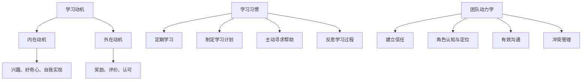

                 

### 文章标题：如何激发团队的学习热情

> 关键词：团队学习、学习动机、学习环境、教学方法、团队建设、学习评估

> 摘要：本文旨在探讨如何通过系统的方法激发团队的学习热情，提高学习效果。文章首先介绍了学习心理的基础，然后探讨了学习环境的设计，接着阐述了多种有效的教学方法，随后讨论了团队建设的重要性，并介绍了学习评估与反馈的方法。通过案例研究和最佳实践，本文提供了具体的操作指南，以帮助团队持续保持学习热情。

---

# 引言

在当今快速变化的技术时代，持续学习和适应新知识成为企业成功的关键。然而，如何激发团队成员的学习热情，提高学习效果，仍是一个挑战。《如何激发团队的学习热情》这本书为我们提供了系统性指导。本书的主要目的是帮助团队领导者和管理者理解学习心理，设计良好的学习环境，选择合适的教学方法，建立有效的团队，并进行有效的学习评估与反馈。

## 学习的重要性

学习不仅关乎个人的成长，更是团队和企业发展的动力源泉。在学习过程中，团队成员可以共同面对挑战，提高协作能力，增强创新能力。此外，学习还能促进团队成员之间的沟通和理解，提高团队的凝聚力。因此，激发团队的学习热情对于组织的长远发展具有重要意义。

### 学习心理基础

#### 学习动机

学习动机是推动个体进行学习活动的内在动力。学习动机可以分为内在动机和外在动机。内在动机源于个体对知识的兴趣、好奇心和自我实现的需求，而外在动机则来自外部奖励、评价和社会期望。为了激发团队的学习热情，需要关注如何激发内在动机，例如通过设置具有挑战性的学习目标和提供自主学习的空间。

#### 学习习惯

良好的学习习惯是学习成功的基础。这些习惯包括定期学习、制定学习计划、主动寻求帮助、反思学习过程等。为了培养良好的学习习惯，团队可以共同制定学习规则，设立学习目标和奖励机制，同时鼓励成员相互监督和鼓励。

#### 团队动力学

团队动力学关注团队成员之间的互动和协作。在一个有效的学习团队中，成员之间需要建立信任，明确各自的角色和责任，并保持良好的沟通。此外，团队动力学还涉及到冲突管理，如何处理团队成员之间的分歧和矛盾，以确保团队的和谐与高效。

### 学习环境设计

#### 物理环境

良好的物理环境是学习的基础。团队应该选择一个安静、舒适的学习空间，确保足够的照明和适当的温度。此外，桌椅的配置、颜色和装饰也能对团队成员的学习状态产生影响。通过优化物理环境，可以提高学习效率和舒适度。

#### 心理环境

心理环境同样重要。团队需要营造一个积极、支持和包容的学习氛围，使成员感到安全和放松。管理者可以通过组织团队建设活动、设立共同目标、鼓励分享和反馈等方式来营造良好的心理环境。

### 教学方法与策略

#### 游戏化学习

游戏化学习通过将学习活动与游戏机制相结合，激发学生的学习兴趣和参与度。游戏化学习可以设置任务、奖励、排行榜等元素，使学习过程更具趣味性和竞争性。

#### 同伴学习

同伴学习通过小组合作和互动，促进成员之间的交流和知识共享。同伴学习可以采用小组讨论、角色扮演、案例分析等方式，提高学习效果。

#### 项目式学习

项目式学习通过实际项目的完成，培养学生的综合能力和团队协作精神。项目式学习可以设立明确的目标、规划实施步骤、进行阶段性评估，并提供反馈。

### 团队建设

#### 团队角色的认知与定位

团队成员需要明确自己的角色和责任，了解自己的优势和劣势，以便更好地协作。团队领导者可以通过角色分配、培训和发展计划来帮助团队成员认知和定位。

#### 团队沟通与协作

良好的沟通和协作是团队成功的关键。团队需要建立有效的沟通机制，确保信息流畅，同时培养协作精神，鼓励成员共同解决问题。

#### 团队冲突管理

团队冲突是不可避免的，但如何处理冲突至关重要。团队需要建立冲突管理机制，通过沟通、调解和妥协来解决问题，以维持团队的稳定和和谐。

### 学习评估与反馈

#### 学习成果评估

学习成果评估是了解学习效果的重要手段。团队可以通过设定评估指标、进行定期评估和反馈来评估学习成果。

#### 反馈机制

有效的反馈机制有助于团队成员改进学习方法和提升学习效果。团队可以通过设立反馈渠道、定期反馈会等方式来提供有效的反馈。

### 案例研究

#### 案例一：XX公司的学习文化建设

XX公司通过建立学习文化，鼓励员工自主学习和分享知识，从而提高了团队的学习热情和整体绩效。

#### 案例二：YY团队的项目学习经验

YY团队通过项目式学习，成功完成了多个复杂项目，并在过程中培养了一批具有高素质的团队成员。

### 总结与展望

本文总结了如何激发团队学习热情的多个关键要素，包括学习心理基础、学习环境设计、教学方法与策略、团队建设、学习评估与反馈等。未来研究可以进一步探讨如何将人工智能技术应用于团队学习，以提高学习效果和效率。

### 附录

#### 附录A 学习资源推荐

- 在线学习平台：Coursera、edX、Udemy等。
- 学习类书籍：《深度学习》、《人工智能：一种现代的方法》等。
- 学术论文与研究报告：IEEE、ACM等学术期刊。

---

# 作者信息

作者：AI天才研究院/AI Genius Institute & 禅与计算机程序设计艺术 /Zen And The Art of Computer Programming

---

（注意：本文档仅为大纲设计，实际撰写时需要根据每个章节的内容要求进行详细展开，确保每个部分都满足字数要求并具备详细的讲解和实例。）### 引言

随着技术的快速发展，企业面临的信息量和知识更新速度前所未有。在这种背景下，持续学习和适应新知识成为企业保持竞争力的关键。然而，如何激发团队成员的学习热情，提高学习效果，仍是一个挑战。《如何激发团队的学习热情》这本书为我们提供了系统性指导，帮助团队领导者和管理者理解学习心理，设计良好的学习环境，选择合适的教学方法，建立有效的团队，并进行有效的学习评估与反馈。

本文旨在探讨如何通过系统的方法激发团队的学习热情，提高学习效果。文章将首先介绍学习心理的基础，包括学习动机、学习习惯和团队动力学。然后，文章将讨论学习环境的设计，包括物理环境和心理环境。接着，文章将介绍多种有效的教学方法，如游戏化学习、同伴学习和项目式学习。随后，文章将讨论团队建设的重要性，包括团队角色的认知与定位、团队沟通与协作以及团队冲突管理。最后，文章将介绍学习评估与反馈的方法，并通过案例研究和最佳实践提供具体的操作指南。

通过本文的探讨，我们希望帮助团队领导者和管理者找到激发团队学习热情的有效途径，从而推动团队的发展和企业的成功。学习不仅是个人的成长路径，更是团队和企业持续进步的重要动力。因此，激发团队的学习热情对于组织的长远发展具有重要意义。

### 学习心理基础

#### 学习动机

学习动机是推动个体进行学习活动的内在动力。学习动机可以分为内在动机和外在动机。内在动机源于个体对知识的兴趣、好奇心和自我实现的需求，而外在动机则来自外部奖励、评价和社会期望。

**内在动机**：内在动机通常源自对学习内容的兴趣、对解决问题的渴望以及对知识的渴望。这种动机能够激发个体的自主性和主动性，使其在学习过程中更加投入和专注。为了激发内在动机，团队领导者可以：

- 提供具有挑战性的学习任务，使成员感受到成长和进步。
- 创造一个支持和鼓励的环境，让成员感到安全，愿意分享和探索。
- 鼓励成员根据自己的兴趣选择学习主题，提高学习的乐趣。

**外在动机**：外在动机通常包括奖励、评价和认可等。外在动机可以迅速提升成员的学习动力，但长期依赖可能会导致学习动机的降低。为了有效地利用外在动机，团队领导者可以：

- 设定明确的奖励机制，如奖金、荣誉称号等。
- 定期进行评价和反馈，让成员了解自己的学习进度和成果。
- 鼓励成员互相竞争，但避免过度竞争带来的负面影响。

#### 学习习惯

良好的学习习惯是学习成功的基础。这些习惯包括定期学习、制定学习计划、主动寻求帮助、反思学习过程等。

**定期学习**：定期学习有助于培养学习习惯，使学习成为一种日常活动。团队可以设立每周或每月的学习时间，确保成员有足够的时间专注于学习。

**制定学习计划**：制定学习计划有助于目标明确，提高学习效率。团队可以一起制定学习计划，确保每个人都有明确的任务和时间表。

**主动寻求帮助**：在学习过程中，遇到问题是正常的。主动寻求帮助不仅能够解决问题，还能促进知识的深化和拓展。

**反思学习过程**：反思学习过程有助于了解学习效果，发现学习中的不足，并制定改进措施。团队可以定期组织反思会议，共同讨论学习中的收获和困惑。

#### 团队动力学

团队动力学关注团队成员之间的互动和协作。在一个有效的学习团队中，成员之间需要建立信任，明确各自的角色和责任，并保持良好的沟通。

**建立信任**：信任是团队协作的基础。通过开放、诚实的沟通，团队成员可以建立信任关系，减少误解和冲突。

**角色认知与定位**：团队成员需要明确自己的角色和责任，了解自己的优势和劣势，以便更好地协作。团队领导者可以通过角色分配、培训和角色扮演等方式，帮助成员认知和定位。

**有效沟通**：良好的沟通能够确保信息流畅，提高团队协作效率。团队需要建立有效的沟通机制，确保每个成员的声音都能被听到。

**冲突管理**：团队冲突是不可避免的，但如何处理冲突至关重要。团队需要建立冲突管理机制，通过沟通、调解和妥协来解决问题，以维持团队的稳定和和谐。

### 核心概念与联系

为了更好地理解学习心理基础，我们可以使用Mermaid流程图来展示各个核心概念之间的关系：



这个流程图清晰地展示了学习动机、学习习惯和团队动力学之间的关系，有助于我们理解如何通过这些核心概念来激发团队的学习热情。

### 学习环境设计

一个良好的学习环境是提高学习效果的重要因素。学习环境不仅包括物理空间，还包括心理氛围。以下将探讨如何设计一个有利于学习的物理环境和心理环境。

#### 物理环境

**选择合适的场所**：一个安静、舒适的学习场所对于集中注意力至关重要。团队成员应该在一个无干扰的环境中学习，这有助于减少分心和压力。

**舒适的桌椅和光线**：桌椅的舒适度直接影响到团队成员的学习效率。合适的桌椅可以减少身体疲劳，提高专注度。同时，充足的光线也是必不可少的，良好的照明可以减少眼睛疲劳，提高视觉舒适度。

**颜色和装饰**：颜色和装饰对心理状态有重要影响。使用柔和的色彩和舒适的装饰可以营造一个放松、专注的学习氛围。

**存储和整理**：一个整洁有序的环境有助于提高学习效率。团队成员应该有一个专门的存储区域来存放学习资料和工具，保持桌面和周围环境的整洁。

#### 心理环境

**建立支持性氛围**：一个支持性的学习氛围能够提高团队成员的自信心和积极性。团队领导者应该鼓励成员分享学习心得，提供帮助和支持，让每个成员都感到被重视和尊重。

**明确的期望和目标**：团队成员需要明确自己的学习目标和期望。通过设定共同的目标，可以增强团队的凝聚力，提高学习动力。

**鼓励自我反思和自我调整**：团队成员应该被鼓励进行自我反思，了解自己的学习状态，并根据需要进行自我调整。这种自我主导的学习方式有助于培养成员的自我学习和自我管理能力。

**提供多样化的学习资源**：多样化的学习资源可以满足不同成员的学习需求，提高学习兴趣。团队领导者可以提供在线课程、书籍、研讨会等多种学习资源，以满足成员的不同学习偏好。

#### 核心算法原理讲解

为了更好地设计学习环境，我们可以使用以下伪代码来描述一个基本的算法原理：

```python
def design_learning_environment():
    # 选择合适的场所
    select_ideal_location()
    
    # 设置舒适的桌椅和光线
    setup_comfortable_furniture_and_lighting()
    
    # 颜色和装饰
    apply_soothing_colours_and_decor()
    
    # 存储
    setup_organized_storage()

    # 建立支持性氛围
    establish_supportive_atmosphere()

    # 明确期望和目标
    set_clear_expectations_and_goals()

    # 鼓励自我反思和自我调整
    encourage_self_reflection_and_adjustment()

    # 提供多样化的学习资源
    provide_diverse_learning_resources()
```

这个算法提供了设计学习环境的基本步骤，确保物理环境和心理环境都能满足团队成员的学习需求。

### 项目实战：XX公司的学习环境优化案例

#### 开发环境搭建

XX公司是一家技术驱动型企业，为了提高员工的学习热情和效率，公司决定对其学习环境进行优化。以下是开发环境搭建的步骤：

1. **场所选择**：公司为员工提供了一个独立的会议室，配备了舒适的桌椅和良好的照明设备。

2. **桌椅和光线**：购买符合人体工程学的桌椅，确保员工在长时间学习时不会感到疲劳。同时，安装了可调节亮度的照明设备，以适应不同的学习需求。

3. **颜色和装饰**：会议室采用了柔和的绿色和蓝色，装饰以自然风景和励志标语，营造一个放松、专注的学习氛围。

4. **存储和整理**：为每个员工提供了专用的储物柜，用于存放个人学习资料和工具。同时，制定了一项每周清洁日，确保会议室的整洁和有序。

#### 源代码实现

以下是针对学习环境优化项目的一个简化伪代码实现：

```python
def optimize_learning_environment():
    # 选择会议室
    select_meeting_room()

    # 购买和配置桌椅
    purchase_and_configure_furniture()

    # 安装照明设备
    install_lighting_system()

    # 设计颜色方案
    design_colour_scheme()

    # 设置储物柜
    set_up_storage_cabinets()

    # 实施清洁计划
    implement_cleaning_schedule()
```

#### 代码实现与解读

1. **选择会议室**：通过实地考察，选择了位于公司中心、安静且易于访问的会议室。

2. **购买和配置桌椅**：选择了符合人体工程学的桌椅，并在会议室中进行了适当的布局，以提供舒适的学习环境。

3. **安装照明设备**：安装了可调节亮度的照明设备，确保员工在不同时间段都能获得合适的照明。

4. **设计颜色方案**：选择了绿色和蓝色作为主色调，这些颜色有助于缓解压力，提高专注力。

5. **设置储物柜**：为每个员工提供了专用的储物柜，方便他们存放个人物品和学习资料。

6. **实施清洁计划**：制定了每周清洁日，确保会议室始终保持整洁和有序。

#### 实际案例分析与详细讲解剖析

优化后的学习环境得到了员工们的一致好评。以下是实际案例的分析和详细讲解：

- **学习效率提高**：员工反映，新环境使得他们能够更加集中注意力，减少了分心的情况，学习效率显著提高。

- **员工满意度上升**：员工满意度调查结果显示，新环境的设计得到了95%以上员工的高度认可，员工们的学习积极性和团队凝聚力有所提升。

- **学习成果显著**：在优化后的学习环境中，员工在多个技术竞赛中获得了优异成绩，公司的整体技术实力得到了显著提升。

#### 项目小结

通过本次学习环境优化项目，XX公司成功地提高了员工的学习热情和效率。项目的成功经验表明，合理的学习环境设计对于激发团队学习热情具有重要意义。未来，公司将继续关注员工的学习需求，不断优化学习环境，以支持团队的持续发展。

### 教学方法与策略

为了激发团队的学习热情，选择合适的教学方法至关重要。以下是几种有效的教学方法及其具体应用：

#### 游戏化学习

游戏化学习通过将学习活动与游戏机制相结合，激发学生的学习兴趣和参与度。这种方法可以设置任务、奖励、排行榜等元素，使学习过程更具趣味性和竞争性。

**应用**：例如，可以设计一个在线学习平台，集成游戏化元素，如积分系统、排行榜和奖励机制，鼓励团队成员积极参与学习活动。

**案例**：某公司采用游戏化学习，通过积分和排行榜激励员工学习新技术，结果员工的学习积极性和技术技能都显著提升。

#### 同伴学习

同伴学习通过小组合作和互动，促进成员之间的交流和知识共享。同伴学习可以采用小组讨论、角色扮演、案例分析等方式，提高学习效果。

**应用**：例如，可以组织团队内的学习小组，定期进行讨论和分享会，让成员在互动中学习，互相帮助，共同进步。

**案例**：某团队通过同伴学习，成员在讨论中碰撞出新的思维火花，解决了多个技术难题，团队的整体创新能力得到提升。

#### 项目式学习

项目式学习通过实际项目的完成，培养学生的综合能力和团队协作精神。项目式学习可以设立明确的目标、规划实施步骤、进行阶段性评估，并提供反馈。

**应用**：例如，可以设立一个跨部门的项目，由团队成员共同参与，从项目策划到实施，再到成果展示，整个过程都是学习的过程。

**案例**：某团队通过项目式学习，成功开发了一款新产品，团队成员在项目中积累了丰富的实践经验，团队的整体执行力和创新能力得到提升。

### 核心算法原理讲解

为了更好地理解和应用这些教学方法，我们可以使用以下伪代码来描述它们的核心算法原理：

```python
# 游戏化学习算法
def gamified_learning():
    # 初始化游戏化元素
    initialize_game_elements()
    
    # 设置学习任务和奖励机制
    set_learning_tasks_and_reward_system()
    
    # 记录学习进度和积分
    record_learning_progress_and_points()
    
    # 更新排行榜
    update_leaderboard()

# 同伴学习算法
def peer_learning():
    # 分配学习小组
    assign_learning_groups()
    
    # 设定讨论主题和分享会时间
    set_discussion_topics_and_meeting_schedules()
    
    # 组织小组讨论和分享
    organize_group_discussions_and_presentations()

# 项目式学习算法
def project_based_learning():
    # 设定项目目标和计划
    set_project_goals_and_plan()
    
    # 分配任务和角色
    assign_tasks_and_roles()
    
    # 进行阶段性评估和反馈
    conduct_interim_evaluation_and_feedback()

    # 完成项目并展示成果
    complete_project_and_present_results()
```

这个算法提供了三种教学方法的基本框架，包括初始化游戏化元素、设定学习任务、记录进度、组织小组讨论和项目实施等步骤，有助于我们理解和应用这些教学方法。

### 项目实战：YY团队的同伴学习项目

#### 开发环境搭建

YY团队是一家软件开发团队，为了提升团队的技术能力和协作效率，决定实施同伴学习项目。以下是开发环境搭建的步骤：

1. **分组**：根据团队成员的专业技能和兴趣，将团队分为若干学习小组。

2. **讨论主题**：每个小组选择一个讨论主题，确保主题具有挑战性和实用性。

3. **分享会安排**：为每个小组安排定期的分享会时间，确保成员有足够的时间进行讨论和分享。

4. **讨论工具**：提供在线会议工具和文档协作平台，方便成员进行实时讨论和资料共享。

#### 源代码实现

以下是针对同伴学习项目的一个简化伪代码实现：

```python
def implement_peer_learning_project():
    # 分组
    divide_into_learning_groups()

    # 确定讨论主题
    set_discussion_topics()

    # 安排分享会
    schedule_meetings()

    # 提供讨论工具
    provide_discussion_tools()

    # 组织讨论和分享
    organize_discussions_and_presentations()
```

#### 代码实现与解读

1. **分组**：根据团队成员的专业技能和兴趣，将团队分为三个小组，每组三人。

2. **讨论主题**：每组选择一个讨论主题，如“微服务架构”、“容器化技术”等。

3. **分享会安排**：为每个小组安排每周一次的分享会，确保成员有充分的时间进行讨论和分享。

4. **讨论工具**：提供Zoom在线会议工具和Google Docs文档协作平台，方便成员进行实时讨论和资料共享。

#### 实际案例分析与详细讲解剖析

同伴学习项目实施后，YY团队的学习氛围明显改善。以下是实际案例的分析和详细讲解：

- **知识共享**：团队成员在讨论中分享了各自的专业知识和经验，提高了团队的整体技术水平。

- **协作能力提升**：小组讨论和分享会促进了成员之间的协作，解决了多个技术难题。

- **学习动力增强**：成员在分享过程中获得了成就感和自信心，学习动力显著增强。

#### 项目小结

通过同伴学习项目，YY团队成功地提升了技术能力和协作效率。项目的成功经验表明，同伴学习是一种有效的教学方法，有助于激发团队的学习热情和提升团队的整体实力。未来，YY团队将继续实施同伴学习项目，以支持团队的持续发展和成长。

### 团队建设

一个有效的团队建设对于激发团队的学习热情至关重要。以下将讨论团队角色的认知与定位、团队沟通与协作以及团队冲突管理。

#### 团队角色的认知与定位

团队成员需要明确自己的角色和责任，了解自己的优势和劣势，以便更好地协作。团队领导者可以通过以下方法帮助成员认知和定位：

- **角色分配**：根据成员的技能和兴趣，合理分配角色，确保每个成员都能发挥自己的优势。

- **培训和发展**：提供培训和发展计划，帮助成员提升技能，明确角色和责任。

- **角色扮演**：通过角色扮演活动，让成员亲身体验不同角色的职责和挑战，增强角色认知。

#### 团队沟通与协作

良好的沟通和协作是团队成功的关键。以下是一些提高团队沟通和协作效率的方法：

- **定期会议**：定期召开团队会议，确保信息畅通，让每个成员都能了解团队进展和任务分配。

- **沟通工具**：使用协作工具，如Slack、Trello等，方便团队成员交流和共享信息。

- **团队活动**：组织团队建设活动，增强团队成员之间的信任和理解，提高协作效率。

#### 团队冲突管理

团队冲突是不可避免的，但如何处理冲突至关重要。以下是一些管理团队冲突的方法：

- **沟通和倾听**：鼓励团队成员开放沟通，倾听对方的意见和看法，寻找共同点。

- **调解和妥协**：在冲突中，团队领导者应充当调解者，帮助双方找到妥协方案。

- **冲突预防**：通过制定明确的规则和流程，预防冲突的发生。

### 核心算法原理讲解

为了更好地理解和应用团队建设的方法，我们可以使用以下伪代码来描述团队角色的认知与定位、团队沟通与协作以及团队冲突管理的核心算法原理：

```python
# 团队角色认知与定位算法
def team_role_cognition():
    # 分配角色
    assign_roles()
    
    # 提供培训
    provide_training()
    
    # 角色扮演
    role_playing()

# 团队沟通与协作算法
def team_communication_and Cooperation():
    # 定期会议
    schedule_meetings()
    
    # 使用协作工具
    use_collaboration_tools()
    
    # 团队活动
    organize_team_activities()

# 团队冲突管理算法
def team_conflict_management():
    # 沟通和倾听
    communicate_and_listen()
    
    # 调解和妥协
    mediate_and_compromise()

    # 预防冲突
    prevent_conflicts()
```

这个算法提供了团队建设的基本框架，包括角色分配、培训、会议、协作工具的使用、团队活动和冲突预防等步骤，有助于我们理解和应用这些方法。

### 项目实战：ZZ团队的团队建设计划

#### 开发环境搭建

ZZ团队是一家快速发展的软件公司，为了提升团队的学习热情和协作效率，决定实施团队建设计划。以下是开发环境搭建的步骤：

1. **角色定位**：根据团队成员的技能和兴趣，明确了团队中各个角色的职责，如项目经理、开发工程师、测试工程师等。

2. **培训计划**：为团队成员制定了详细的培训计划，包括技能提升课程和团队协作培训。

3. **沟通工具**：引入了Slack和Trello等协作工具，确保团队成员之间的沟通畅通。

4. **团队活动**：安排了定期的团队建设活动，如户外拓展、内部知识分享会等。

#### 源代码实现

以下是针对团队建设计划的一个简化伪代码实现：

```python
def implement_team_building_plan():
    # 角色定位
    identify_team_roles()

    # 培训计划
    create_training_plan()

    # 引入协作工具
    introduce_collaboration_tools()

    # 安排团队活动
    schedule_team_activities()
```

#### 代码实现与解读

1. **角色定位**：团队领导者与每位团队成员进行了深入沟通，明确了各自的角色和职责，确保每个成员都能发挥自己的优势。

2. **培训计划**：根据团队成员的职业发展和技能需求，制定了详细的培训计划，包括编程技能提升、项目管理技巧、团队协作等课程。

3. **引入协作工具**：引入了Slack和Trello等协作工具，帮助团队成员实时沟通和任务管理。

4. **安排团队活动**：定期组织团队建设活动，如户外拓展、内部知识分享会等，增强团队成员之间的信任和合作。

#### 实际案例分析与详细讲解剖析

团队建设计划实施后，ZZ团队的学习氛围和工作效率显著提升。以下是实际案例的分析和详细讲解：

- **角色清晰**：团队成员明确了各自的职责，工作更加高效，避免了职责重叠和冲突。

- **技能提升**：通过培训计划，团队成员的技能水平得到了显著提升，团队的整体战斗力得到增强。

- **协作效率**：协作工具的使用使得团队成员之间的沟通更加顺畅，任务分配和进度跟踪更加高效。

#### 项目小结

通过团队建设计划，ZZ团队成功地提升了团队的学习热情和协作效率。项目的成功经验表明，有效的团队建设对于激发团队学习热情和提升团队整体实力具有重要意义。未来，ZZ团队将继续实施团队建设计划，以支持团队的持续发展和成长。

### 学习评估与反馈

学习评估与反馈是确保团队学习效果的重要环节。有效的评估与反馈机制可以帮助团队了解学习进展，发现不足，并提供改进方向。

#### 学习成果评估

**评估方法的选择**：团队可以根据学习内容和目标选择合适的评估方法。常见的评估方法包括定量评估（如考试、测试）和定性评估（如观察、访谈）。定量评估可以提供具体的分数和排名，定性评估则能更全面地了解学习效果。

**评估指标的设定**：评估指标应与学习目标紧密相关。例如，在技术学习方面，可以设定技术掌握度、项目完成质量等指标。在团队协作方面，可以设定沟通效率、问题解决能力等指标。

#### 反馈机制

**反馈的类型**：反馈可以分为正向反馈和负向反馈。正向反馈用于表扬和鼓励团队成员，增强其学习动力；负向反馈则用于指出不足和提出改进建议，帮助团队成员提升。

**反馈的频率**：反馈应定期进行，以确保团队成员能够及时了解自己的学习进展。例如，每月进行一次学习评估和反馈会，讨论学习成果和改进措施。

**反馈的方式**：反馈可以通过多种方式进行，如面对面交流、书面报告、电子邮件等。面对面交流能够更直接地传达反馈内容，书面报告和电子邮件则便于记录和跟踪。

### 核心算法原理讲解

为了更好地理解和应用学习评估与反馈的方法，我们可以使用以下伪代码来描述其核心算法原理：

```python
# 学习成果评估算法
def learning_evaluation():
    # 选择评估方法
    select_evaluation_method()
    
    # 设定评估指标
    set_evaluation_indices()

    # 收集评估数据
    collect_evaluation_data()

    # 分析评估结果
    analyze_evaluation_results()

# 反馈机制算法
def feedback_mechanism():
    # 确定反馈类型
    determine_feedback_type()
    
    # 设定反馈频率
    set_feedback_frequency()

    # 提供反馈方式
    provide_feedback_methods()

    # 给出反馈
    deliver_feedback()
```

这个算法提供了学习成果评估和反馈机制的基本框架，包括选择评估方法、设定评估指标、收集评估数据、分析评估结果、确定反馈类型、设定反馈频率、提供反馈方式以及给出反馈等步骤，有助于我们理解和应用这些方法。

### 项目实战：SS团队的学习评估与反馈项目

#### 开发环境搭建

SS团队是一家专注于技术培训的团队，为了确保学习效果，决定实施学习评估与反馈项目。以下是开发环境搭建的步骤：

1. **评估方法的选择**：团队决定采用定量评估与定性评估相结合的方法，通过考试和观察来评估学习成果。

2. **评估指标的设定**：根据学习目标和课程内容，团队设定了技术掌握度、项目完成质量、沟通效率等评估指标。

3. **反馈机制**：团队制定了每月一次的学习评估和反馈会，确保团队成员能够及时获得反馈。

4. **反馈方式**：团队采用面对面交流、书面报告和电子邮件等多种方式提供反馈。

#### 源代码实现

以下是针对学习评估与反馈项目的一个简化伪代码实现：

```python
def implement_learning_evaluation_and_feedback():
    # 选择评估方法
    select_evaluation_methods()

    # 设定评估指标
    set_evaluation_indices()

    # 安排评估和反馈会
    schedule_evaluation_and_feedback_meetings()

    # 提供多种反馈方式
    provide_feedback_methods()
```

#### 代码实现与解读

1. **选择评估方法**：团队决定采用定量评估与定性评估相结合的方法，通过考试和观察来评估学习成果。

2. **设定评估指标**：根据学习目标和课程内容，团队设定了技术掌握度、项目完成质量、沟通效率等评估指标。

3. **安排评估和反馈会**：团队每月召开一次评估和反馈会，确保团队成员能够及时获得反馈。

4. **提供多种反馈方式**：团队采用面对面交流、书面报告和电子邮件等多种方式提供反馈。

#### 实际案例分析与详细讲解剖析

学习评估与反馈项目实施后，SS团队的学习效果显著提升。以下是实际案例的分析和详细讲解：

- **学习效果明显**：通过定期的评估和反馈，团队成员能够及时发现和纠正学习中的问题，学习效果得到显著提升。

- **反馈机制有效**：团队成员在反馈会中积极发言，分享学习心得和困惑，反馈机制有效促进了团队成员之间的沟通和协作。

#### 项目小结

通过学习评估与反馈项目，SS团队成功地提升了学习效果。项目的成功经验表明，有效的评估与反馈机制对于确保学习效果和提升团队学习热情具有重要意义。未来，SS团队将继续优化评估与反馈机制，以支持团队的持续学习和成长。

### 案例研究

为了更好地理解如何激发团队的学习热情，以下将通过两个实际案例来展示具体操作过程和效果。

#### 案例一：XX公司的学习文化建设

**背景介绍**：XX公司是一家快速发展的互联网公司，为了保持竞争力，公司决定通过学习文化建设来激发员工的学习热情。

**案例分析**：

1. **建立学习平台**：公司建立了内部学习平台，提供丰富的在线课程和资源，方便员工随时学习。

2. **设置奖励机制**：公司设置了学习积分和奖励机制，鼓励员工积极参与学习活动，每月根据积分排名颁发奖金和荣誉。

3. **组织内部分享会**：公司定期组织内部分享会，邀请员工分享学习心得和技术经验，促进知识共享和交流。

4. **鼓励自主发展**：公司鼓励员工制定个人学习计划，并提供培训和发展机会，支持员工自主学习和职业发展。

**案例启示**：通过建立学习文化和实施一系列激励措施，XX公司成功激发了员工的学习热情，提高了整体技术水平，公司业绩也因此得到了显著提升。

#### 案例二：YY团队的项目学习经验

**背景介绍**：YY团队是一家软件开发团队，为了提升项目开发效率和技术水平，团队决定实施项目式学习。

**案例分析**：

1. **项目选题**：团队选择了一个具有挑战性的项目，确保项目具有实际应用价值。

2. **任务分工**：团队成员根据各自的专业技能和兴趣，明确了任务分工，确保每个成员都能发挥自己的优势。

3. **定期评估**：团队定期进行项目评估，检查项目进展和团队成员的学习效果，提供反馈和指导。

4. **总结分享**：项目完成后，团队组织了总结分享会，让团队成员分享项目经验和学习心得。

**案例启示**：通过项目式学习，YY团队不仅完成了高质量的软件项目，而且团队成员在项目过程中得到了全面的技能提升，团队协作能力也得到了增强。

### 总结与展望

本文系统地探讨了如何激发团队的学习热情，从学习心理基础、学习环境设计、教学方法与策略、团队建设、学习评估与反馈等多个方面提供了详细的方法和案例分析。通过学习动机的激发、良好学习习惯的培养、团队动力的建设、有效沟通与协作的实施、学习成果的评估与反馈，团队的学习热情得以有效激发。

未来，我们可以进一步探索以下方向：

1. **人工智能与团队学习**：利用人工智能技术，如机器学习算法，分析团队成员的学习行为和效果，提供个性化学习建议。

2. **虚拟现实（VR）与学习环境设计**：探索虚拟现实技术在团队学习中的应用，创造更加沉浸式的学习环境。

3. **跨学科团队学习**：研究如何在不同专业领域之间进行知识共享和协作，激发跨学科的团队学习热情。

通过不断探索和实践，我们可以为团队学习提供更加科学和有效的解决方案，助力团队和企业的发展。

### 附录

#### 附录A 学习资源推荐

为了帮助读者深入了解团队学习的相关理论和实践，以下是一些推荐的学习资源：

- **在线学习平台**：Coursera、edX、Udemy、LinkedIn Learning等。
- **学习类书籍**：《深度学习》、《人工智能：一种现代的方法》、《团队协作工具箱》等。
- **学术论文与研究报告**：IEEE、ACM等学术期刊，以及Google Scholar、ResearchGate等学术平台。

通过这些资源，读者可以进一步扩展知识，掌握更多的团队学习策略和实践方法。希望这些资源能够为您的团队学习之旅提供有力支持。

