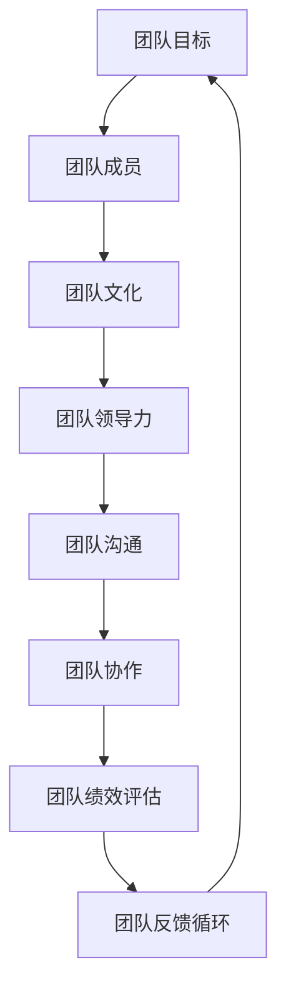
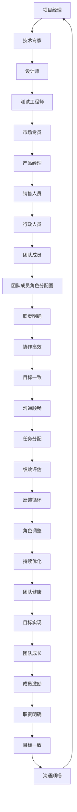
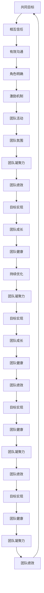
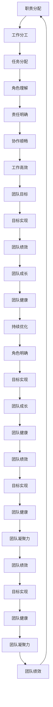
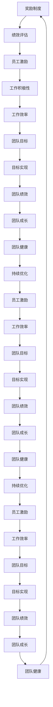
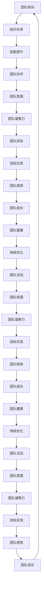
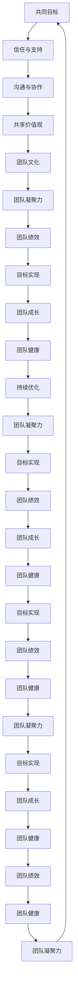

                 

### 设计原则

#### 1. 逻辑清晰
设计原则的首要条件是逻辑清晰。目录结构的设计应确保各章节内容紧密关联，使读者能够顺畅地理解文章的整体结构和内容。每个章节都应该有其独特的主题，并且章节之间要有明确的逻辑关系，形成一个完整的知识体系。

为了达到这一目标，我们可以采用以下方法：
- **确定主题**：明确每个章节的核心主题，确保内容围绕主题展开。
- **构建联系**：在章节之间建立联系，通过交叉引用和相关内容提示，使读者能够更容易理解不同章节之间的关联。
- **组织结构**：合理组织章节顺序，从基础理论到实际应用，逐步深入，确保知识的连贯性和逻辑性。

#### 2. 层次分明
层次分明的目录结构能够提高文章的可读性，让读者快速找到感兴趣的内容。具体实现方法如下：
- **一级目录**：定义主要章节，每个章节对应一个主要主题。
- **二级目录**：将每个一级目录细化，拆分为更小的子章节，使内容更具体、更详细。
- **三级目录**：对于某些复杂或重要的内容，可以进一步细化，创建三级目录，提供更深入的分析和讲解。

#### 3. 完整覆盖
确保核心章节内容不遗漏，涵盖核心概念、原理、算法、模型、实战案例等，是设计原则中的关键一环。具体措施如下：
- **明确核心内容**：在规划目录时，明确每个章节的核心内容，确保涵盖必要的知识点。
- **全面阐述**：在每个章节中，详细阐述核心概念和原理，避免简化或模糊处理。
- **实战案例**：通过实战案例，将理论知识应用到实际场景中，帮助读者更好地理解和应用所学内容。

#### 4. 简洁明了
简洁明了的表述是提升读者阅读体验的重要手段。为了避免冗余和复杂的表述，我们可以采取以下措施：
- **精简语言**：使用简单、直接的语言表达，避免使用过于复杂的术语和句子。
- **避免冗余**：删除重复内容，确保每个章节都有其独特的价值。
- **视觉优化**：利用列表、图表和代码块等元素，使内容更加直观和易于理解。

#### 5. 适度细化
在细化目录结构时，要找到一个适度的平衡点。过细的章节划分可能导致内容过于琐碎，影响阅读体验；而过粗的划分则可能使内容显得空洞，缺乏深度。具体方法如下：
- **确定细化标准**：根据章节内容的复杂程度和重要性，合理划分三级目录。
- **保持一致性**：确保所有章节都遵循相同的细化标准，避免出现过于详细或过于粗略的情况。
- **反馈与调整**：在完成初稿后，通过读者反馈进行调整，确保目录结构的合理性和有效性。

### 设计原则总结
综上所述，设计原则的核心在于确保目录结构的逻辑清晰、层次分明、完整覆盖、简洁明了且适度细化。通过遵循这些原则，我们可以创建出一份结构严谨、内容丰富的目录大纲，为后续的文章撰写奠定坚实的基础。在接下来的步骤中，我们将进一步细化每个章节的内容，确保每部分都符合设计原则的要求。|>## 第一部分：管理团队的基础理论

### 1.1 管理团队的核心概念与联系

在管理团队的过程中，了解核心概念与它们之间的联系是至关重要的。以下是一个用Mermaid流程图表示的团队管理概念图：



#### 团队成员
团队成员是团队的核心，包括各类专业人才和角色。团队成员之间的协作和互补是团队成功的关键。

#### 团队文化
团队文化是团队内在的精神和价值观，包括共同的信念、目标和行为规范。健康的团队文化有助于提高团队凝聚力和工作效率。

#### 团队领导力
团队领导力是团队管理的核心要素，包括领导者的能力、决策方式和激励技巧。优秀的领导力能够激发团队成员的潜力，提高团队整体表现。

#### 团队沟通
团队沟通是团队协作的基础，包括内部沟通、外部沟通和信息传递。高效的沟通能够确保团队成员理解任务、目标和期望，减少误解和冲突。

#### 团队协作
团队协作是团队工作的核心，涉及团队成员之间的分工、合作和资源共享。协作机制的有效性直接影响到团队的效率和成果。

#### 团队绩效评估
团队绩效评估是对团队工作成效的评估，包括绩效指标、评估标准和反馈机制。有效的绩效评估能够激励团队成员，促进团队持续改进。

#### 团队反馈循环
团队反馈循环是团队持续改进的重要机制，通过收集、分析和应用反馈信息，团队可以不断调整策略，优化工作流程。

### 1.2 团队成员的角色与职责

团队成员的角色与职责是团队管理的基石。以下是一个用Mermaid流程图表示的团队成员角色分配图：



#### 项目经理
项目经理负责规划、执行和监控项目进度，确保项目按时交付。他们需要具备良好的组织能力和沟通技巧。

#### 技术专家
技术专家是团队的技术支柱，负责解决技术难题，开发和优化产品功能。他们需要具备深厚的技术背景和解决复杂问题的能力。

#### 设计师
设计师负责产品的视觉设计和用户体验，确保产品符合用户需求和审美标准。他们需要具备创意思维和审美能力。

#### 测试工程师
测试工程师负责产品的功能测试和性能测试，确保产品在发布前没有重大缺陷。他们需要具备扎实的测试技能和问题定位能力。

#### 市场专员
市场专员负责市场调研、推广活动和品牌建设，提高产品的市场知名度。他们需要具备市场洞察力和营销策略能力。

#### 产品经理
产品经理负责产品规划和设计，确保产品满足用户需求并具备市场竞争力。他们需要具备用户思维和商业敏感性。

#### 销售人员
销售人员负责开拓客户、维护客户关系和销售业绩，推动产品的市场推广。他们需要具备良好的沟通技巧和销售能力。

#### 行政人员
行政人员负责团队的后勤保障和日常运营，确保团队工作环境和谐、高效。他们需要具备组织协调和执行力。

### 1.3 团队建设的理论框架

团队建设是团队管理的重要组成部分，其理论框架包括以下几个方面：

#### 团队凝聚力

团队凝聚力是指团队成员之间的相互吸引力，包括情感联系、信任和归属感。提高团队凝聚力有助于增强团队协作效率和战斗力。以下是一个用Mermaid流程图表示的团队凝聚力影响因素：



#### 角色明确

角色明确是指每个团队成员都清楚自己的职责和角色，避免工作重叠和责任不明。以下是一个用Mermaid流程图表示的角色明确影响团队协作的流程：



#### 激励机制

激励机制是指通过奖励、认可和激励措施，激发团队成员的工作热情和积极性。以下是一个用Mermaid流程图表示的激励机制影响团队绩效的流程：



#### 团队活动

团队活动是指团队内部组织的各种集体活动，如培训、团建和聚餐等。以下是一个用Mermaid流程图表示的团队活动影响团队凝聚力的流程：



通过以上理论框架，我们可以更好地理解团队管理中的核心概念及其相互关系。在接下来的章节中，我们将深入探讨高效协作的秘诀，帮助团队实现最佳管理效果。|>### 1.2 团队成员的角色与职责

团队成员的角色与职责是团队运作的基础，明确每个成员的角色和职责，能够有效提高团队的工作效率和协作效果。以下是对团队成员角色和职责的详细阐述：

#### 项目经理

项目经理是团队的领导者，负责项目从启动到完成的全程管理。主要职责包括：
- **项目规划**：制定项目计划，明确项目目标、范围、进度和预算。
- **资源分配**：合理分配团队资源，确保项目按计划进行。
- **团队协调**：协调团队成员的工作，解决团队内部的问题和冲突。
- **风险控制**：识别和评估项目风险，制定应对措施。
- **质量保证**：确保项目交付符合质量标准。

#### 技术专家

技术专家是团队的技术核心，负责解决技术难题和优化产品功能。其主要职责包括：
- **技术规划**：根据项目需求，制定技术方案和开发计划。
- **编码实现**：编写高质量的代码，实现产品功能。
- **技术支持**：为团队成员提供技术支持和培训。
- **技术评审**：参与代码审查，确保代码质量。
- **技术优化**：持续优化现有技术，提高产品性能和稳定性。

#### 设计师

设计师负责产品的视觉设计和用户体验，确保产品满足用户需求和审美标准。其主要职责包括：
- **需求分析**：分析用户需求，制定设计策略。
- **界面设计**：设计产品的用户界面和交互流程。
- **原型制作**：制作产品原型，与团队成员和用户进行反馈和迭代。
- **设计评审**：参与设计评审，确保设计符合预期。
- **用户体验优化**：根据用户反馈，持续优化产品用户体验。

#### 测试工程师

测试工程师负责产品的功能测试和性能测试，确保产品在发布前没有重大缺陷。其主要职责包括：
- **测试计划**：制定测试计划和测试用例。
- **功能测试**：执行功能测试，验证产品功能是否符合需求。
- **性能测试**：进行性能测试，评估产品在高负载下的表现。
- **缺陷管理**：记录和跟踪缺陷，推动缺陷修复。
- **回归测试**：在修复缺陷后，进行回归测试，确保修复有效。

#### 市场专员

市场专员负责市场调研、推广活动和品牌建设，提高产品的市场知名度。其主要职责包括：
- **市场调研**：收集和分析市场信息，为产品定位和市场策略提供支持。
- **品牌建设**：制定品牌传播策略，提升品牌形象。
- **市场推广**：策划并执行市场推广活动，提高产品市场占有率。
- **渠道管理**：与合作伙伴建立合作关系，拓展市场渠道。
- **数据分析**：分析市场数据，优化市场策略。

#### 产品经理

产品经理负责产品规划和设计，确保产品满足用户需求和具备市场竞争力。其主要职责包括：
- **需求分析**：分析用户需求和市场趋势，制定产品规划。
- **产品设计**：制定产品功能需求文档，设计产品原型。
- **用户反馈**：收集用户反馈，优化产品设计。
- **跨部门协作**：与设计、开发和测试团队紧密协作，确保产品顺利推进。
- **数据驱动**：通过数据分析，指导产品优化和迭代。

#### 销售人员

销售人员负责开拓客户、维护客户关系和销售业绩，推动产品的市场推广。其主要职责包括：
- **客户开发**：寻找潜在客户，建立业务关系。
- **销售策略**：制定销售策略和计划，提高销售额。
- **客户关系管理**：维护客户关系，提升客户满意度。
- **销售数据分析**：分析销售数据，优化销售策略。
- **市场活动参与**：参与市场活动，推广产品品牌。

#### 行政人员

行政人员负责团队的后勤保障和日常运营，确保团队工作环境和谐、高效。其主要职责包括：
- **行政事务管理**：处理团队日常行政事务，如文件管理、会议安排等。
- **办公用品管理**：负责办公用品的采购和分发。
- **员工福利**：管理员工福利，如员工体检、培训等。
- **办公环境维护**：维护办公环境的整洁和安全。
- **沟通协调**：协调团队内部和外部沟通，确保信息畅通。

通过明确团队成员的角色和职责，可以有效避免工作中的混乱和冲突，提高团队的整体效率和协作效果。在团队管理中，项目经理和团队成员之间的沟通和协作至关重要，只有当每个成员都清楚自己的职责和目标，并且能够与其他成员高效协作时，团队才能实现最佳表现。|>### 1.3 团队建设的理论框架

团队建设是一个复杂而持续的过程，它涉及到多个方面的相互作用和协调。以下是一个团队建设的理论框架，涵盖了团队凝聚力、角色明确、激励机制和团队活动等方面的核心概念和关系：

#### 团队凝聚力

团队凝聚力是指团队成员之间在情感、信任和归属感上的相互连接。它是一个团队高效运作的基础。以下是一个用Mermaid流程图表示的团队凝聚力影响因素：



#### 角色明确

角色明确是团队建设的关键之一，它要求每个团队成员都清楚自己的职责和角色，避免工作中的冲突和混乱。以下是一个用Mermaid流程图表示的角色明确影响团队协作的流程：


#### 激励机制

激励机制是激发团队成员工作热情和积极性的关键。一个有效的激励机制能够提高团队的工作效率和绩效。以下是一个用Mermaid流程图表示的激励机制影响团队绩效的流程：


#### 团队活动

团队活动是增强团队凝聚力和促进团队成员之间相互了解的有效手段。以下是一个用Mermaid流程图表示的团队活动影响团队凝聚力的流程：


通过以上理论框架，我们可以更好地理解团队建设中的核心概念及其相互关系。在实际操作中，团队管理者需要根据团队的具体情况，灵活运用这些理论，制定合适的团队建设策略，以提升团队的凝聚力和工作效率。|>## 第二部分：高效协作的秘诀

### 2.1 高效协作的核心原则

高效协作是团队成功的关键，以下是几个核心原则，它们能够帮助团队实现高效协作：

#### 1. 明确目标和任务

确保每个团队成员都清楚团队的目标和个人的任务。以下是实现这一原则的具体步骤：

- **制定共同目标**：团队领导者应与团队成员共同制定清晰、具体的目标，确保所有人都朝着同一个方向努力。
- **任务分解**：将大目标分解为可执行的小任务，明确每个任务的负责人和时间节点。
- **定期回顾**：定期回顾进度，确保团队成员了解任务的状态和目标实现的情况。

以下是一个用伪代码表示的任务分解算法：

```python
def decompose_task(big_task, deadline):
    """
    将大任务分解为小任务
    :param big_task: 大任务描述
    :param deadline: 任务的截止日期
    :return: 任务列表
    """
    tasks = []
    # 假设任务分解规则是根据时间节点
    time_slots = calculate_time_slots(deadline)
    for slot in time_slots:
        task = {
            'name': f"{big_task}_{slot}",
            'description': f"在{slot}内完成的部分任务",
            'deadline': slot,
            'assigned_to': assign_task_to_employee(slot)
        }
        tasks.append(task)
    return tasks

def assign_task_to_employee(slot):
    """
    根据时间节点分配任务给团队成员
    :param slot: 时间节点
    :return: 被分配任务的员工
    """
    # 简单的分配策略：轮流分配
    return "employee_1" if slot % 2 == 0 else "employee_2"

def calculate_time_slots(deadline):
    """
    计算时间节点
    :param deadline: 任务的截止日期
    :return: 时间节点列表
    """
    time_slots = []
    current_time = get_current_time()
    while current_time < deadline:
        time_slots.append(current_time)
        current_time += time_increment()
    return time_slots

def get_current_time():
    """
    获取当前时间
    :return: 当前时间
    """
    return datetime.now()

def time_increment():
    """
    时间增量
    :return: 时间增量（例如：1天）
    """
    return timedelta(days=1)
```

#### 2. 提高沟通效率

高效的沟通是团队协作的基础。以下是一些提高沟通效率的方法：

- **定期会议**：定期举行团队会议，讨论项目进度、问题和计划。
- **即时通讯工具**：使用即时通讯工具（如Slack、Telegram等）快速传递信息和解决问题。
- **清晰表达**：鼓励团队成员用简洁、明确的语言表达意见和需求。

以下是一个用伪代码表示的沟通机制设计：

```python
def schedule_meeting(topic, date, time):
    """
    安排会议
    :param topic: 会议主题
    :param date: 会议日期
    :param time: 会议时间
    :return: 会议详情
    """
    meeting_details = {
        'topic': topic,
        'date': date,
        'time': time,
        'attendees': get_team_members()
    }
    send_invitation(meeting_details)
    return meeting_details

def send_invitation(meeting_details):
    """
    发送会议邀请
    :param meeting_details: 会议详情
    """
    message = f"""
    会议主题：{meeting_details['topic']}
    会议日期：{meeting_details['date']}
    会议时间：{meeting_details['time']}
    参会人员：{', '.join(meeting_details['attendees'])}

    请准时参加，如有问题，请提前告知。
    """
    send_message(message)

def get_team_members():
    """
    获取团队成员列表
    :return: 成员列表
    """
    return ['employee_1', 'employee_2', 'employee_3', 'employee_4']

def send_message(message):
    """
    发送消息
    :param message: 消息内容
    """
    # 这里是发送消息的代码，可以是邮件、即时通讯工具等
    print(message)
```

#### 3. 资源共享和协同工作

确保团队成员能够方便地共享资源和协同工作，以下是一些实现方法：

- **共享文档和代码库**：使用GitHub、GitLab等代码库管理工具，方便团队成员协同开发。
- **协作工具**：使用Trello、Asana等项目管理工具，帮助团队成员跟踪任务和项目进度。
- **云端存储**：使用Google Drive、Dropbox等云端存储服务，方便团队成员共享文件和资料。

以下是一个用伪代码表示的资源共享和协同工作流程：

```python
def share_document(document, collaborators):
    """
    共享文档
    :param document: 文档路径
    :param collaborators: 共享成员列表
    """
    # 这里是共享文档的代码，可以是上传到共享文件夹、发送链接等
    print(f"共享文档：{document}")
    for collaborator in collaborators:
        print(f"已共享给：{collaborator}")

def collaborate_on_project(project, tasks, members):
    """
    协同完成项目
    :param project: 项目名称
    :param tasks: 任务列表
    :param members: 成员列表
    """
    print(f"开始协同项目：{project}")
    for task in tasks:
        print(f"任务：{task['name']}，负责人：{task['assigned_to']}")
    for member in members:
        print(f"成员：{member}，正在参与项目：{project}")
```

通过遵循这些高效协作的核心原则，团队可以更好地协调工作，提高工作效率，最终实现项目目标。在接下来的章节中，我们将继续探讨协作工具的选择与应用，为团队协作提供更多的实用技巧。|>### 2.2 协作工具的选择与应用

在团队协作过程中，选择合适的协作工具至关重要。这些工具能够帮助团队成员更高效地沟通、共享资源和协同工作。以下是几种常见的协作工具及其应用方法：

#### 1. 团队通讯工具

**Slack**：Slack是一种流行的即时通讯工具，支持文字、图片、文件等多种消息形式。它允许创建多个聊天室（channel），团队成员可以在不同的聊天室中进行讨论。

**应用方法**：
- **创建频道**：根据项目类型和需求创建不同的频道，如“项目讨论”、“技术支持”、“团队公告”等。
- **邀请成员**：将团队成员添加到相应的频道中，确保每个人都能在正确的聊天室中参与讨论。
- **设置提醒**：为关键任务或事件设置提醒，确保团队成员及时响应。

```python
def create_channel(channel_name):
    """
    创建聊天室
    :param channel_name: 聊天室名称
    """
    # 这里是创建聊天室的代码，可以是调用API或使用界面操作
    print(f"创建聊天室：{channel_name}")

def invite_members_to_channel(channel_name, members):
    """
    邀请成员加入聊天室
    :param channel_name: 聊天室名称
    :param members: 成员列表
    """
    for member in members:
        print(f"已邀请成员{member}加入聊天室：{channel_name}")

def set_reminder(message, reminder_time):
    """
    设置提醒
    :param message: 提醒内容
    :param reminder_time: 提醒时间
    """
    print(f"已设置提醒：{message}，提醒时间：{reminder_time}")
```

#### 2. 项目管理工具

**Trello**：Trello是一种简单直观的项目管理工具，通过卡片（card）和列表（list）来组织任务和项目进度。

**应用方法**：
- **创建看板**：为项目创建一个看板（board），将项目任务分解为不同的列表（如“待办”、“进行中”、“已完成”）。
- **创建卡片**：为每个任务创建卡片，填写任务描述、负责人、截止日期等信息。
- **拖拽任务**：通过拖拽卡片来更新任务状态，直观地展示项目进度。

```python
def create_board(board_name):
    """
    创建看板
    :param board_name: 看板名称
    """
    # 这里是创建看板的代码，可以是调用API或使用界面操作
    print(f"创建看板：{board_name}")

def create_list(board_name, list_name):
    """
    创建列表
    :param board_name: 看板名称
    :param list_name: 列表名称
    """
    # 这里是创建列表的代码，可以是调用API或使用界面操作
    print(f"在看板{board_name}中创建列表：{list_name}")

def create_card(board_name, list_name, card_name, description, assigned_to, deadline):
    """
    创建卡片
    :param board_name: 看板名称
    :param list_name: 列表名称
    :param card_name: 卡片名称
    :param description: 卡片描述
    :param assigned_to: 负责人
    :param deadline: 截止日期
    """
    # 这里是创建卡片的代码，可以是调用API或使用界面操作
    print(f"在列表{list_name}中创建卡片：{card_name}")
    print(f"描述：{description}")
    print(f"负责人：{assigned_to}")
    print(f"截止日期：{deadline}")
```

#### 3. 文档协作工具

**Google Docs**：Google Docs是一种在线文档协作工具，支持多人实时编辑和评论。

**应用方法**：
- **创建文档**：创建一个新的文档，邀请团队成员参与编辑。
- **实时协作**：团队成员可以同时编辑文档，实时查看更新。
- **评论和反馈**：使用评论功能提供反馈和建议，便于团队成员之间的沟通。

```python
def create_document(document_name, collaborators):
    """
    创建文档
    :param document_name: 文档名称
    :param collaborators: 参与编辑的成员列表
    """
    # 这里是创建文档的代码，可以是调用API或使用界面操作
    print(f"创建文档：{document_name}")
    for collaborator in collaborators:
        print(f"邀请成员{collaborator}参与编辑")

def edit_document(document_name, changes, editor):
    """
    编辑文档
    :param document_name: 文档名称
    :param changes: 编辑内容
    :param editor: 编辑者
    """
    # 这里是编辑文档的代码，可以是调用API或使用界面操作
    print(f"成员{editor}正在编辑文档：{document_name}")
    print(f"编辑内容：{changes}")

def add_comment(document_name, comment, commenter):
    """
    添加评论
    :param document_name: 文档名称
    :param comment: 评论内容
    :param commenter: 评论者
    """
    # 这里是添加评论的代码，可以是调用API或使用界面操作
    print(f"成员{commenter}在文档{document_name}中添加评论：{comment}")
```

通过合理选择和运用这些协作工具，团队可以更好地协调工作，提高工作效率。在下一章节中，我们将探讨如何建立团队沟通机制，以确保信息畅通无阻。|>### 2.3 建立团队沟通机制

有效的沟通机制是团队高效协作的基石。以下是一些关键步骤和方法，帮助团队建立有效的沟通机制：

#### 1. 设立定期沟通会议

**目的**：确保团队成员定期沟通，了解项目进展和问题。

**方法**：
- **制定会议日程**：根据项目需求和团队规模，每周或每月定期召开沟通会议。
- **提前通知**：提前通知会议时间、地点和议程，确保团队成员做好准备。
- **会议记录**：会议结束后，及时记录会议内容和决定事项，并分发给团队成员。

以下是一个用伪代码表示的定期会议安排和记录方法：

```python
def schedule_meeting(meeting_type, date, time):
    """
    安排会议
    :param meeting_type: 会议类型（如周会、月会）
    :param date: 会议日期
    :param time: 会议时间
    """
    print(f"会议类型：{meeting_type}，日期：{date}，时间：{time}")
    send_meeting_notification(date, time)

def send_meeting_notification(date, time):
    """
    发送会议通知
    :param date: 会议日期
    :param time: 会议时间
    """
    notification_message = f"""
    提醒：{date} {time}将举行{meeting_type}会议。
    请各位成员做好准备，准时参加。
    """
    send_message(notification_message)

def record_meeting_content(meeting_content):
    """
    记录会议内容
    :param meeting_content: 会议内容
    """
    print(f"会议内容：{meeting_content}")
    save_meeting_record(meeting_content)

def save_meeting_record(meeting_content):
    """
    保存会议记录
    :param meeting_content: 会议内容
    """
    # 这里是保存会议记录的代码，可以是写入文件或数据库等
    print(f"会议记录已保存：{meeting_content}")
```

#### 2. 设立问题反馈渠道

**目的**：确保团队成员能够及时反馈问题和意见，促进问题解决和持续改进。

**方法**：
- **设立问题反馈表单**：提供一个在线表单或意见箱，团队成员可以随时提交问题和意见。
- **定期审查**：定期审查反馈内容，分类整理并分配给相关负责人进行处理。
- **反馈跟进**：及时回复反馈者，告知问题处理进度和结果。

以下是一个用伪代码表示的问题反馈和跟进方法：

```python
def submit_issue_feedback(issue_description):
    """
    提交问题反馈
    :param issue_description: 问题描述
    """
    print(f"问题反馈：{issue_description}")
    save_issue_feedback(issue_description)

def save_issue_feedback(issue_description):
    """
    保存问题反馈
    :param issue_description: 问题描述
    """
    # 这里是保存问题反馈的代码，可以是写入文件或数据库等
    print(f"问题反馈已保存：{issue_description}")

def review_issue_feedback():
    """
    审查问题反馈
    """
    # 这里是审查问题反馈的代码，可以是读取文件或数据库等
    print("正在审查问题反馈...")
    issues = fetch_issues()
    for issue in issues:
        print(f"问题：{issue['description']}，负责人：{issue['assigned_to']}")

def update_issue_status(issue_id, status):
    """
    更新问题状态
    :param issue_id: 问题ID
    :param status: 状态（如“已解决”、“处理中”）
    """
    print(f"问题ID：{issue_id}，状态：{status}")
    # 这里是更新问题状态的代码，可以是更新数据库记录等
    update_issue(issue_id, status)

def fetch_issues():
    """
    获取问题列表
    :return: 问题列表
    """
    # 这里是获取问题列表的代码，可以是查询数据库等
    return [
        {'id': 1, 'description': '问题1', 'assigned_to': 'member1', 'status': '处理中'},
        {'id': 2, 'description': '问题2', 'assigned_to': 'member2', 'status': '已解决'}
    ]

def send_feedback_response(feedback_id, response_message):
    """
    发送反馈回复
    :param feedback_id: 反馈ID
    :param response_message: 回复内容
    """
    print(f"反馈ID：{feedback_id}，回复：{response_message}")
    # 这里是发送反馈回复的代码，可以是发送邮件或消息等
    send_message(response_message)
```

#### 3. 鼓励开放沟通

**目的**：营造一个开放、信任的沟通环境，鼓励团队成员自由表达意见和反馈。

**方法**：
- **创建开放的沟通文化**：通过培训和团队建设活动，培养团队成员的沟通意识和开放心态。
- **定期反馈**：鼓励团队成员定期提供工作反馈，分享成功经验和遇到的问题。
- **匿名反馈**：设立匿名反馈机制，让团队成员可以放心地表达意见，尤其是关于团队管理和工作环境的反馈。

以下是一个用伪代码表示的鼓励开放沟通的方法：

```python
def encourage_open_communication():
    """
    鼓励开放沟通
    """
    print("""
    尊重每一位团队成员的发言，鼓励大家积极参与讨论。
    如果有任何意见和建议，请随时表达。
    我们欢迎开放、坦诚的沟通环境。
    """)

def submit_anonymous_feedback(feedback_message):
    """
    提交匿名反馈
    :param feedback_message: 反馈内容
    """
    print(f"匿名反馈：{feedback_message}")
    # 这里是保存匿名反馈的代码，可以是写入匿名反馈库等
    save_anonymous_feedback(feedback_message)

def save_anonymous_feedback(feedback_message):
    """
    保存匿名反馈
    :param feedback_message: 反馈内容
    """
    # 这里是保存匿名反馈的代码，可以是写入文件或数据库等
    print(f"匿名反馈已保存：{feedback_message}")
```

通过建立这些沟通机制，团队可以确保信息畅通无阻，及时解决问题，促进协作和团队成长。在下一章节中，我们将探讨团队管理的最佳实践，帮助团队在实际工作中实现高效管理。|>## 第三部分：团队管理的最佳实践

### 3.1 项目管理与团队协作

在团队管理中，项目管理是确保项目按时、按质量完成的关键环节。以下是几个关键方面的最佳实践：

#### 1. 项目计划与执行

**项目计划**：项目计划是项目管理的起点，它规定了项目的目标、范围、时间和资源。以下是项目计划的关键步骤：

- **项目启动**：明确项目目标、范围和需求，建立项目团队。
- **资源分配**：根据项目需求分配人力资源、物资和资金。
- **时间安排**：制定项目时间表，包括关键里程碑和交付物。
- **风险评估**：识别项目风险，并制定应对措施。

**项目执行**：在项目执行阶段，需要确保项目按照计划进行。以下是一些最佳实践：

- **任务分配**：根据团队成员的技能和经验，合理分配任务。
- **进度监控**：定期跟踪项目进度，确保项目按计划推进。
- **问题解决**：及时发现和解决项目中的问题，避免影响项目进度。

以下是一个用伪代码表示的项目计划与执行方法：

```python
def project_plan(project_name, objectives, scope, resources, timeline, risks):
    """
    制定项目计划
    :param project_name: 项目名称
    :param objectives: 项目目标
    :param scope: 项目范围
    :param resources: 资源列表
    :param timeline: 项目时间表
    :param risks: 风险列表
    """
    print(f"项目名称：{project_name}")
    print(f"目标：{objectives}")
    print(f"范围：{scope}")
    print(f"资源：{resources}")
    print(f"时间表：{timeline}")
    print(f"风险：{risks}")

def project_execute(tasks, timeline, resources):
    """
    执行项目
    :param tasks: 任务列表
    :param timeline: 项目时间表
    :param resources: 资源列表
    """
    print("项目执行中...")
    for task in tasks:
        print(f"执行任务：{task['name']}")
        execute_task(task, timeline, resources)

def execute_task(task, timeline, resources):
    """
    执行单个任务
    :param task: 任务详情
    :param timeline: 项目时间表
    :param resources: 资源列表
    """
    print(f"任务：{task['name']}")
    print(f"预计时间：{task['deadline']}")
    print(f"所需资源：{task['required_resources']}")
    # 这里是执行任务的代码，可以是调用其他函数或API等

def monitor_progress(timeline, actual_progress):
    """
    监控项目进度
    :param timeline: 项目时间表
    :param actual_progress: 实际进度
    """
    print("项目进度监控中...")
    print(f"计划进度：{timeline}")
    print(f"实际进度：{actual_progress}")
    if actual_progress < timeline:
        print("项目进度滞后，需要采取措施。")
    else:
        print("项目进度正常。")
```

#### 2. 团队协作与沟通

团队协作是项目成功的关键，以下是一些最佳实践：

**沟通机制**：建立有效的沟通机制，确保信息畅通。以下是一些建议：

- **定期会议**：定期举行团队会议，讨论项目进展、问题和计划。
- **即时通讯**：使用即时通讯工具（如Slack、Telegram等）快速传递信息和解决问题。
- **文档共享**：使用文档协作工具（如Google Docs、Notion等）共享文件和资料。

**协作工具**：使用项目管理工具（如Trello、Asana等）和沟通工具（如Slack、Zoom等），提高团队协作效率。以下是一些协作工具的最佳实践：

- **任务跟踪**：使用任务管理工具记录和跟踪任务进度，确保每个任务都有明确的责任人和截止日期。
- **进度更新**：定期更新任务进度，确保团队成员了解项目状态和自己的任务进展。
- **团队协作**：鼓励团队成员之间的协作，共同解决问题和完成任务。

以下是一个用伪代码表示的团队协作与沟通方法：

```python
def schedule_meeting(topic, date, time):
    """
    安排会议
    :param topic: 会议主题
    :param date: 会议日期
    :param time: 会议时间
    """
    print(f"会议主题：{topic}，日期：{date}，时间：{time}")
    send_meeting_notification(date, time)

def send_meeting_notification(date, time):
    """
    发送会议通知
    :param date: 会议日期
    :param time: 会议时间
    """
    notification_message = f"""
    提醒：{date} {time}将举行会议。
    请各位成员做好准备，准时参加。
    """
    send_message(notification_message)

def send_message(message):
    """
    发送消息
    :param message: 消息内容
    """
    print(message)

def update_task_progress(task_id, progress):
    """
    更新任务进度
    :param task_id: 任务ID
    :param progress: 进度（例如：'已完成'、'进行中'、'已推迟'）
    """
    print(f"任务ID：{task_id}，进度：{progress}")
    # 这里是更新任务进度的代码，可以是调用API或数据库操作等

def track_project_progress(timeline, actual_progress):
    """
    跟踪项目进度
    :param timeline: 项目时间表
    :param actual_progress: 实际进度
    """
    print(f"计划进度：{timeline}")
    print(f"实际进度：{actual_progress}")
    if actual_progress < timeline:
        print("项目进度滞后，需要采取措施。")
    else:
        print("项目进度正常。")
```

通过以上最佳实践，团队可以更好地管理项目，提高协作效率，确保项目按时、按质量完成。在下一章节中，我们将探讨团队绩效评估的方法和最佳实践。|>### 3.2 团队绩效评估方法

团队绩效评估是团队管理中的重要环节，它有助于识别团队成员的表现、激励员工和持续改进。以下是几种常用的团队绩效评估方法：

#### 1. KPI（关键绩效指标）

KPI是衡量团队绩效的关键指标，它基于团队的目标和任务设定。以下是一些常见KPI：

- **任务完成率**：任务完成数量与总任务数量的比率，用于衡量任务的执行力。
- **项目进度**：项目实际进度与计划进度的对比，用于评估项目管理的有效性。
- **客户满意度**：通过客户反馈评估团队的服务质量和产品满意度。

以下是一个用伪代码表示的KPI评估方法：

```python
def calculate_kpi(task_completed, total_tasks, project_progress, customer_satisfaction):
    """
    计算KPI
    :param task_completed: 完成任务数量
    :param total_tasks: 总任务数量
    :param project_progress: 项目进度（0-100%）
    :param customer_satisfaction: 客户满意度（0-100%）
    :return: KPI得分
    """
    kpi_score = (
        (task_completed / total_tasks) * 0.4 +
        (project_progress / 100) * 0.3 +
        (customer_satisfaction / 100) * 0.3
    )
    return kpi_score

# 示例
kpi_score = calculate_kpi(8, 10, 90, 95)
print(f"KPI得分：{kpi_score}")
```

#### 2. 行为评估

行为评估是基于团队成员在工作中的行为表现进行评估，以下是一些常见的行为指标：

- **沟通能力**：评估团队成员的沟通技巧，包括清晰表达、倾听和协作能力。
- **团队合作**：评估团队成员的团队合作精神和协作能力。
- **问题解决能力**：评估团队成员在遇到问题时的反应和处理能力。

以下是一个用伪代码表示的行为评估方法：

```python
def evaluate_behavior kommunikation_ability, teamwork_ability, problem-solving_ability):
    """
    行为评估
    :param kommunikation_ability: 沟通能力评分（0-10）
    :param teamwork_ability: 团队合作能力评分（0-10）
    :param problem-solving_ability: 问题解决能力评分（0-10）
    :return: 行为得分
    """
    behavior_score = (
        kommunikation_ability * 0.3 +
        teamwork_ability * 0.4 +
        problem-solving_ability * 0.3
    )
    return behavior_score

# 示例
kommunikation_ability = 8
teamwork_ability = 9
problem-solving_ability = 7
behavior_score = evaluate_behavior(kommunikation_ability, teamwork_ability, problem-solving_ability)
print(f"行为得分：{behavior_score}")
```

#### 3. 绩效评估面谈

绩效评估面谈是一种通过与团队成员面对面交流，评估其工作表现和提供反馈的方法。以下是一些关键步骤：

- **准备**：提前准备评估内容和问题，确保面谈有针对性。
- **面谈**：与团队成员进行一对一的绩效评估面谈，讨论其工作表现和改进点。
- **反馈**：提供具体的反馈和改进建议，鼓励团队成员改进。
- **后续跟进**：跟踪团队成员的改进情况，确保评估结果得到落实。

以下是一个用伪代码表示的绩效评估面谈方法：

```python
def perform_performance_evaluation(employee_name, kommunikation_ability, teamwork_ability, problem-solving_ability):
    """
    执行绩效评估面谈
    :param employee_name: 员工姓名
    :param kommunikation_ability: 沟通能力评分（0-10）
    :param teamwork_ability: 团队合作能力评分（0-10）
    :param problem-solving_ability: 问题解决能力评分（0-10）
    """
    print(f"绩效评估面谈：{employee_name}")
    print(f"沟通能力：{kommunikation_ability}")
    print(f"团队合作能力：{teamwork_ability}")
    print(f"问题解决能力：{problem-solving_ability}")

    # 提供反馈和建议
    print("反馈和建议：")
    print("1. 在沟通方面，建议更加清晰、准确地表达自己的观点。")
    print("2. 在团队合作方面，建议积极参与团队活动，增强团队凝聚力。")
    print("3. 在问题解决方面，建议提高自主学习能力，寻找更多解决方案。")

    # 后续跟进
    schedule_follow_up_meeting(employee_name)

def schedule_follow_up_meeting(employee_name):
    """
    安排后续跟进会议
    :param employee_name: 员工姓名
    """
    print(f"已为{employee_name}安排后续跟进会议，时间：下一季度。")
```

通过以上方法，团队可以全面、客观地评估团队成员的表现，提供有针对性的反馈和改进建议，促进团队成员的个人发展和团队的整体绩效。在下一章节中，我们将探讨团队管理的工具与方法，为团队提供更有效的管理支持。|>### 3.3 团队激励与培养

团队激励与培养是团队管理中的重要环节，旨在提高团队成员的工作热情、积极性和专业技能。以下是一些团队激励与培养的最佳实践：

#### 1. 激励机制

有效的激励机制能够激发团队成员的工作动力，以下是一些常用的激励机制：

- **绩效奖金**：根据团队成员的工作绩效，发放相应的奖金，鼓励成员努力工作。
- **股权激励**：通过股权激励，让团队成员分享公司的成长收益，增强归属感和忠诚度。
- **晋升机会**：为团队成员提供晋升机会，鼓励他们不断学习和成长。
- **认可与表彰**：定期对优秀员工进行表彰和认可，提高他们的工作满意度。

以下是一个用伪代码表示的激励机制设计：

```python
def calculate_bonus(employee_performance, base_salary):
    """
    计算奖金
    :param employee_performance: 员工绩效评分（0-100）
    :param base_salary: 基本工资
    :return: 奖金金额
    """
    bonus_rate = 0.1  # 奖金率为基本工资的10%
    bonus_amount = (employee_performance / 100) * base_salary * bonus_rate
    return bonus_amount

def grant_stock_options(employee):
    """
    授予股票期权
    :param employee: 员工信息
    """
    print(f"{employee['name']}已获得股票期权。")

def provide_promotion_opportunities(employee):
    """
    提供晋升机会
    :param employee: 员工信息
    """
    print(f"{employee['name']}已获得晋升机会。")

def recognize_and_reward_employees(employees):
    """
    对员工进行认可与奖励
    :param employees: 员工列表
    """
    for employee in employees:
        if employee['performance'] >= 90:
            print(f"{employee['name']}被评为优秀员工，获得表彰和奖励。")
```

#### 2. 培训与发展

提供持续的培训和发展机会，是提高团队成员专业技能和知识水平的重要手段。以下是一些培训与发展的最佳实践：

- **内部培训**：组织内部培训课程，涵盖新技术、新方法和行业动态，帮助团队成员不断提升。
- **外部学习**：鼓励团队成员参加外部培训、研讨会和讲座，扩大知识视野。
- **导师制度**：建立导师制度，让经验丰富的员工指导新员工，帮助他们快速融入团队。
- **职业规划**：与团队成员共同制定职业发展规划，明确个人发展目标和路径。

以下是一个用伪代码表示的培训与发展方案：

```python
def organize_internal_training(training_topics, participants):
    """
    组织内部培训
    :param training_topics: 培训主题
    :param participants: 参与人员列表
    """
    for topic in training_topics:
        print(f"内部培训：{topic}，参与人员：{', '.join(participants)}")

def encourage_external_learning(employees):
    """
    鼓励外部学习
    :param employees: 员工列表
    """
    for employee in employees:
        print(f"{employee['name']}，鼓励您参加外部培训和学习。")

def establish_mentorship_program(mentors, mentees):
    """
    建立导师制度
    :param mentors: 导师列表
    :param mentees: 被指导者列表
    """
    for mentor, mentee in zip(mentors, mentees):
        print(f"{mentor['name']}担任{mentee['name']}的导师。")

def create career_development_plan(employees):
    """
    制定职业发展规划
    :param employees: 员工列表
    """
    for employee in employees:
        print(f"{employee['name']}，您的职业发展规划如下：")
        print(f"短期目标：{employee['short_term_goal']}")
        print(f"中长期目标：{employee['long_term_goal']}")
```

通过建立有效的激励机制和培训体系，团队可以更好地激励和培养团队成员，提高团队的整体素质和绩效。在下一章节中，我们将探讨团队管理的工具与方法，为团队提供更有效的管理支持。|>### 3.4 团队管理工具与方法

在团队管理中，使用合适的工具和方法能够显著提高管理效率和团队绩效。以下是几种常见的团队管理工具和方法：

#### 1. 项目管理工具

项目管理工具可以帮助团队更好地规划、执行和监控项目进度，以下是一些常用的项目管理工具：

- **Trello**：Trello是一个基于看板的项目管理工具，适用于小型项目或团队。通过创建不同的看板和卡片，团队可以清晰地跟踪任务和项目进度。

- **Asana**：Asana是一个功能强大的项目管理工具，适用于大型项目和团队。它提供了丰富的任务管理、项目进度跟踪和协作功能。

- **Jira**：Jira是Atlassian公司的一款旗舰级项目管理工具，广泛应用于软件研发团队。它提供了敏捷开发管理、任务跟踪、报告分析等功能。

以下是一个用伪代码表示的Trello使用方法：

```python
def create_trello_board(board_name):
    """
    创建Trello看板
    :param board_name: 看板名称
    """
    # 这里是创建看板的代码，可以是调用API或使用界面操作
    print(f"创建Trello看板：{board_name}")

def create_trello_card(board_name, card_name, description, due_date):
    """
    创建Trello卡片
    :param board_name: 看板名称
    :param card_name: 卡片名称
    :param description: 卡片描述
    :param due_date: 截止日期
    """
    # 这里是创建卡片的代码，可以是调用API或使用界面操作
    print(f"在Trello看板{board_name}中创建卡片：{card_name}")
    print(f"描述：{description}")
    print(f"截止日期：{due_date}")

def assign_trello_card_to_member(card_id, member_name):
    """
    将Trello卡片分配给成员
    :param card_id: 卡片ID
    :param member_name: 成员名称
    """
    # 这里是分配卡片的代码，可以是调用API或使用界面操作
    print(f"卡片ID：{card_id}，分配给成员：{member_name}")
```

#### 2. 沟通协作工具

沟通协作工具是团队内部交流和外部协作的重要工具，以下是一些常用的沟通协作工具：

- **Slack**：Slack是一个流行的团队沟通工具，支持文本、图片、文件等多种消息形式。它允许创建多个聊天室（channel），团队成员可以在不同的聊天室中进行讨论。

- **Microsoft Teams**：Microsoft Teams是一个集成了聊天、会议、文件共享和协作功能的一体化平台，适用于大型企业和团队。

- **Zoom**：Zoom是一个专业的视频会议和协作工具，提供了高清视频会议、屏幕共享、聊天和虚拟会议室等功能。

以下是一个用伪代码表示的Slack使用方法：

```python
def create_slack_channel(channel_name):
    """
    创建Slack聊天室
    :param channel_name: 聊天室名称
    """
    # 这里是创建聊天室的代码，可以是调用API或使用界面操作
    print(f"创建Slack聊天室：{channel_name}")

def invite_members_to_channel(channel_name, member_names):
    """
    邀请成员加入聊天室
    :param channel_name: 聊天室名称
    :param member_names: 成员名称列表
    """
    for member_name in member_names:
        # 这里是邀请成员的代码，可以是调用API或使用界面操作
        print(f"已邀请成员{member_name}加入聊天室：{channel_name}")

def send_slack_message(channel_name, message):
    """
    发送Slack消息
    :param channel_name: 聊天室名称
    :param message: 消息内容
    """
    # 这里是发送消息的代码，可以是调用API或使用界面操作
    print(f"向聊天室{channel_name}发送消息：{message}")
```

#### 3. 代码协作工具

代码协作工具是软件开发团队必不可少的工具，以下是一些常用的代码协作工具：

- **Git**：Git是一个分布式版本控制系统，适用于小型到大型项目的代码管理。它允许团队成员协作开发，实时更新和合并代码。

- **GitHub**：GitHub是Git的一个在线托管平台，提供了代码托管、协作开发、项目管理和社区交流等功能。

- **GitLab**：GitLab是一个自托管Git仓库管理工具，提供了与GitHub相似的功能，但可以完全部署在本地或企业内部。

以下是一个用伪代码表示的GitHub使用方法：

```python
def create_github_repository(repo_name):
    """
    创建GitHub仓库
    :param repo_name: 仓库名称
    """
    # 这里是创建仓库的代码，可以是调用API或使用界面操作
    print(f"创建GitHub仓库：{repo_name}")

def push_code_to_github_repo(repo_name, commit_message):
    """
    向GitHub仓库推送代码
    :param repo_name: 仓库名称
    :param commit_message: 提交信息
    """
    # 这里是推送代码的代码，可以是调用API或使用界面操作
    print(f"向GitHub仓库{repo_name}推送代码，提交信息：{commit_message}")

def create_github_issue(repo_name, issue_title, issue_description):
    """
    创建GitHub Issue
    :param repo_name: 仓库名称
    :param issue_title: Issue标题
    :param issue_description: Issue描述
    """
    # 这里是创建Issue的代码，可以是调用API或使用界面操作
    print(f"创建GitHub仓库{repo_name}的Issue：{issue_title}")
    print(f"描述：{issue_description}")
```

通过合理选择和运用这些团队管理工具，团队可以更高效地管理项目、沟通协作和代码开发，从而提高整体工作效率和项目质量。在下一章节中，我们将探讨项目管理的实际案例，通过具体实例来展示团队管理的方法和技巧。|>### 3.5 项目管理与团队协作的实际案例

为了更好地理解团队管理的具体方法和技巧，以下是一个项目管理与团队协作的实际案例，该案例涵盖了项目启动、执行和监控的全过程。

#### 案例背景

假设我们是一家软件开发公司的产品团队，正在开发一款名为“智能助手”的应用程序。该项目预计持续6个月，涉及前端开发、后端开发、UI设计和测试等多个环节。

#### 项目启动

**项目目标**：开发一款功能齐全、用户体验优秀的智能助手应用程序。

**项目范围**：包括用户界面设计、功能开发、测试和上线等。

**项目团队**：
- 前端开发：2人
- 后端开发：2人
- UI设计：1人
- 测试：1人

**项目启动会议**：
- 项目经理主持启动会议，介绍项目目标和范围，明确团队成员的角色和职责。
- 各团队成员介绍自己的技能和工作计划，确保大家对项目有共同的理解。

以下是一个用伪代码表示的项目启动过程：

```python
def project_launch(project_name, team_members):
    """
    项目启动
    :param project_name: 项目名称
    :param team_members: 团队成员列表
    """
    print(f"项目名称：{project_name}")
    for member in team_members:
        print(f"成员：{member['name']}，职责：{member['role']}")
    schedule_meeting('项目启动会议', '2023-10-01', '9:00')

def schedule_meeting(meeting_name, date, time):
    """
    安排会议
    :param meeting_name: 会议名称
    :param date: 会议日期
    :param time: 会议时间
    """
    print(f"会议名称：{meeting_name}，日期：{date}，时间：{time}")
```

#### 项目执行

**项目执行过程**：
- **需求分析**：UI设计师与项目经理和客户沟通，收集需求，制定产品原型和需求文档。
- **任务分配**：根据需求，项目经理将任务分配给团队成员，确保每个任务都有明确的责任人。
- **开发阶段**：前端和后端开发人员开始编写代码，UI设计师进行界面设计，测试人员准备测试计划。

**任务分配**：

以下是一个用伪代码表示的任务分配过程：

```python
def assign_tasks(tasks, team_members):
    """
    分配任务
    :param tasks: 任务列表
    :param team_members: 团队成员列表
    """
    for task in tasks:
        assigned_member = assign_task_to_member(task, team_members)
        print(f"任务：{task['name']}，负责人：{assigned_member['name']}")

def assign_task_to_member(task, team_members):
    """
    将任务分配给成员
    :param task: 任务详情
    :param team_members: 团队成员列表
    :return: 被分配任务的成员
    """
    for member in team_members:
        if member['skills'].intersection(task['required_skills']):
            return member
    return None
```

**项目进度监控**：

项目经理定期召开团队会议，检查项目进度，确保项目按计划进行。以下是一个用伪代码表示的进度监控过程：

```python
def monitor_progress(tasks, due_dates):
    """
    监控项目进度
    :param tasks: 任务列表
    :param due_dates: 截止日期列表
    """
    for task, due_date in zip(tasks, due_dates):
        if due_date < get_current_date():
            print(f"任务：{task['name']}，进度：滞后")
        else:
            print(f"任务：{task['name']}，进度：正常")

def get_current_date():
    """
    获取当前日期
    :return: 当前日期
    """
    return datetime.now()
```

#### 项目测试与上线

**测试阶段**：测试人员根据测试计划进行功能测试、性能测试和用户体验测试，确保应用程序质量。

**问题解决**：在测试过程中，发现的问题由相关开发人员负责修复。

**上线准备**：完成测试后，项目经理与团队成员一起准备上线，确保所有任务都已完成，应用程序稳定可靠。

以下是一个用伪代码表示的测试与上线过程：

```python
def test_application(test_cases):
    """
    测试应用程序
    :param test_cases: 测试用例列表
    """
    for test_case in test_cases:
        if test_case['result'] == '失败':
            print(f"测试用例：{test_case['name']}，结果：失败")
        else:
            print(f"测试用例：{test_case['name']}，结果：成功")

def prepare_for_launch():
    """
    准备上线
    """
    print("准备上线...")
    # 这里是上线的代码，可以是部署到服务器、发布应用市场等

# 示例
tasks = [
    {'name': '需求分析', 'assigned_to': 'member1'},
    {'name': '前端开发', 'assigned_to': 'member2'},
    {'name': '后端开发', 'assigned_to': 'member3'},
    {'name': 'UI设计', 'assigned_to': 'member4'},
    {'name': '测试', 'assigned_to': 'member5'}
]

due_dates = [
    datetime(2023, 10, 15),
    datetime(2023, 10, 20),
    datetime(2023, 10, 25),
    datetime(2023, 10, 30),
    datetime(2023, 11, 5)
]

assign_tasks(tasks, team_members)
monitor_progress(tasks, due_dates)
test_cases = [
    {'name': '登录功能', 'result': '成功'},
    {'name': '注册功能', 'result': '成功'},
    {'name': '聊天功能', 'result': '失败'}
]
test_application(test_cases)
prepare_for_launch()
```

#### 项目总结

在项目完成后，团队进行总结会议，回顾项目过程中的经验和教训，讨论改进措施。以下是一个用伪代码表示的项目总结过程：

```python
def project_summary(lesson_learned):
    """
    项目总结
    :param lesson_learned: 经验和教训
    """
    print("项目总结：")
    for lesson in lesson_learned:
        print(f"经验和教训：{lesson}")

# 示例
lesson_learned = [
    '需求分析阶段需要与客户保持更频繁的沟通',
    '测试阶段要充分考虑各种使用场景',
    '团队成员要更注重代码质量'
]
project_summary(lesson_learned)
```

通过以上实际案例，我们可以看到团队管理的方法和技巧在实际项目中的应用，从而提高项目管理效率和团队协作效果。在下一章节中，我们将探讨团队绩效评估的方法和最佳实践，帮助团队更好地识别成员表现和进行持续改进。|>### 3.6 团队绩效评估的方法和最佳实践

团队绩效评估是团队管理中至关重要的一环，它不仅能够帮助管理者了解团队成员的工作表现，还能为团队成员提供成长和发展的方向。以下是一些常见的团队绩效评估方法和最佳实践：

#### 1. 定量评估方法

定量评估方法主要通过量化的指标来评估团队成员的表现，这种方法具有较高的客观性和可比性。

- **KPI（关键绩效指标）**：KPI是衡量团队绩效的重要工具，通常包括任务完成率、项目进度、客户满意度等指标。通过设定明确的KPI，可以量化团队成员的工作表现，并提供具体的改进方向。

以下是一个用伪代码表示的KPI评估方法：

```python
def calculate_kpi(task_completed, total_tasks, project_progress, customer_satisfaction):
    """
    计算KPI
    :param task_completed: 完成任务数量
    :param total_tasks: 总任务数量
    :param project_progress: 项目进度（0-100%）
    :param customer_satisfaction: 客户满意度（0-100%）
    :return: KPI得分
    """
    kpi_score = (
        (task_completed / total_tasks) * 0.4 +
        (project_progress / 100) * 0.3 +
        (customer_satisfaction / 100) * 0.3
    )
    return kpi_score
```

- **工作量统计**：通过统计团队成员的工作时间、完成的任务数量等指标，可以了解团队成员的工作投入程度。

以下是一个用伪代码表示的工作量统计方法：

```python
def calculate_workload(hours_worked, tasks_completed):
    """
    计算工作量
    :param hours_worked: 工作时间
    :param tasks_completed: 完成任务数量
    :return: 工作量得分
    """
    workload_score = hours_worked * (tasks_completed / 10)
    return workload_score
```

#### 2. 定性评估方法

定性评估方法主要通过主观评价来评估团队成员的表现，这种方法能够更全面地反映团队成员的综合能力。

- **行为评估**：通过观察团队成员的工作行为，评估其沟通能力、团队合作能力、问题解决能力等。这种方法通常结合360度反馈，从多个角度收集评价。

以下是一个用伪代码表示的行为评估方法：

```python
def evaluate_behavior(kommunikation_ability, teamwork_ability, problem-solving_ability):
    """
    行为评估
    :param kommunikation_ability: 沟通能力评分（0-10）
    :param teamwork_ability: 团队合作能力评分（0-10）
    :param problem-solving_ability: 问题解决能力评分（0-10）
    :return: 行为得分
    """
    behavior_score = (
        kommunikation_ability * 0.3 +
        teamwork_ability * 0.4 +
        problem-solving_ability * 0.3
    )
    return behavior_score
```

- **360度反馈**：通过收集团队成员的上级、同事和下属的评价，全面了解团队成员的工作表现。这种方法能够提供多角度的反馈，帮助团队成员了解自己的优点和不足。

以下是一个用伪代码表示的360度反馈方法：

```python
def collect_360_feedback(employee_name, feedbacks):
    """
    收集360度反馈
    :param employee_name: 员工姓名
    :param feedbacks: 反馈列表
    """
    for feedback in feedbacks:
        print(f"{employee_name}的360度反馈：{feedback}")
```

#### 3. 综合评估方法

综合评估方法结合定量评估和定性评估，全面评估团队成员的表现。这种方法能够提供更全面、客观的评估结果。

- **平衡计分卡**：平衡计分卡将团队绩效分为四个维度：财务、客户、内部流程和学习与成长。通过综合考虑这些维度，全面评估团队的表现。

以下是一个用伪代码表示的平衡计分卡评估方法：

```python
def calculate_balanced_scorecard(financial_score, customer_score, internal_process_score, learning_growth_score):
    """
    计算平衡计分卡得分
    :param financial_score: 财务得分
    :param customer_score: 客户得分
    :param internal_process_score: 内部流程得分
    :param learning_growth_score: 学习与成长得分
    :return: 平衡计分卡得分
    """
    balanced_scorecard_score = (
        financial_score * 0.25 +
        customer_score * 0.25 +
        internal_process_score * 0.25 +
        learning_growth_score * 0.25
    )
    return balanced_scorecard_score
```

#### 4. 最佳实践

为了确保团队绩效评估的有效性和公平性，以下是一些最佳实践：

- **设定明确的目标**：在评估前，确保团队成员了解评估目标和评估指标，使评估有明确的方向。

- **定期评估**：定期进行绩效评估，确保评估结果能够及时反映团队成员的工作表现。

- **多角度反馈**：结合定量评估和定性评估，从多个角度收集反馈，确保评估结果全面、客观。

- **个性化评估**：根据团队成员的不同角色和职责，设定个性化的评估指标，确保评估针对性强。

- **反馈与改进**：将评估结果及时反馈给团队成员，讨论改进措施，帮助团队成员持续成长。

通过以上方法和最佳实践，团队可以建立有效的绩效评估体系，激励团队成员不断提升，实现团队的目标。在下一章节中，我们将探讨团队协作中的沟通技巧和策略，进一步提升团队协作效率。|>### 3.7 沟通技巧与策略

在团队协作中，沟通是确保信息畅通、任务顺利完成的关键。以下是一些有效的沟通技巧和策略：

#### 1. 清晰明确的表达

**技巧**：在沟通时，尽量使用简洁、清晰的语言，避免使用模糊或含糊不清的表达。

**策略**：事先准备沟通内容，确保在讨论中能够条理清晰、重点突出。

**示例**：

- **错误**：“我们可能需要调整一下时间表。”
- **改进**：“我们建议将项目交付时间提前一周。”

#### 2. 主动倾听

**技巧**：在对方讲话时，避免打断或急于表达自己的观点，耐心倾听。

**策略**：使用“重复确认”的方法，确认自己理解对方的观点。

**示例**：

- **错误**：“我知道你的问题，我们可以这样做。”
- **改进**：“你提到的问题，我理解是……对吗？”

#### 3. 建立良好的沟通氛围

**技巧**：营造一个开放、尊重和信任的沟通环境，鼓励团队成员自由表达意见。

**策略**：定期举行团队建设活动，增强团队成员之间的信任和合作。

**示例**：

- **错误**：“这个主意太天真了，我们不可能实现。”
- **改进**：“这个主意很有创意，我们可以考虑一下可行性。”

#### 4. 使用适当的沟通工具

**技巧**：根据沟通内容和场景，选择合适的沟通工具，如面对面会议、即时通讯、邮件等。

**策略**：确保团队成员熟悉并掌握常用的沟通工具，提高沟通效率。

**示例**：

- **错误**：仅在紧急情况下使用即时通讯，导致信息传递不及时。
- **改进**：定期使用即时通讯工具分享项目进展和问题。

#### 5. 及时反馈与确认

**技巧**：在沟通过程中，及时给予反馈，确保信息被正确理解和执行。

**策略**：建立反馈机制，鼓励团队成员提供及时、准确的反馈。

**示例**：

- **错误**：“我明白了，不需要反馈。”
- **改进**：“我明白了，有什么需要我注意的地方吗？”

#### 6. 避免误解与冲突

**技巧**：在表达意见时，注意语气和措辞，避免造成误解或冲突。

**策略**：使用“我”陈述，而非“你”陈述，减少直接指责。

**示例**：

- **错误**：“你怎么总是做错事情？”
- **改进**：“我在这个任务中遇到了一些问题，可能是因为……”

#### 7. 跨文化沟通

**技巧**：了解不同文化背景的沟通风格，尊重差异，避免文化冲突。

**策略**：提供跨文化沟通培训，提高团队成员的跨文化沟通能力。

**示例**：

- **错误**：“你的做法太固执了。”
- **改进**：“我认为在当前情况下，我们可以尝试一种不同的方法。”

通过以上沟通技巧和策略，团队可以建立高效的沟通机制，提高协作效果，确保项目顺利推进。在下一章节中，我们将探讨团队管理的最佳实践，为团队管理提供具体的指导和参考。|>## 总结与最佳实践

### 文章总结

本文系统地介绍了团队管理的核心概念、高效协作的秘诀、最佳实践以及工具与方法。通过详细的讨论和案例分析，我们了解了如何通过明确目标、优化沟通、合理利用工具和科学评估绩效，来提升团队的整体效率和协作效果。以下是文章的主要内容概括：

1. **管理团队的基础理论**：讨论了团队目标、成员角色、团队文化、团队领导力等核心概念，并通过Mermaid流程图和伪代码，展现了这些概念之间的联系和团队建设的理论框架。

2. **高效协作的秘诀**：提出了明确目标和任务、提高沟通效率、资源共享和协同工作等高效协作的核心原则，并通过伪代码示例，展示了如何将这些原则应用于实际工作中。

3. **团队管理的最佳实践**：详细阐述了项目管理与团队协作的方法，包括项目计划与执行、团队协作与沟通、团队绩效评估、团队激励与培养等，并通过实际案例，展示了这些方法的具体应用。

4. **团队管理的工具与方法**：介绍了项目管理工具、沟通协作工具和代码协作工具的使用，展示了如何利用这些工具提高团队管理的效率。

5. **项目实战**：通过一个实际案例，展示了项目管理与团队协作的全过程，包括项目启动、执行、测试和上线等，为团队管理提供了实用的指导。

6. **团队绩效评估的方法和最佳实践**：探讨了定量评估和定性评估方法，并提出了综合评估的方法和最佳实践，帮助团队更全面、客观地评估成员表现。

7. **沟通技巧与策略**：提供了多种有效的沟通技巧和策略，帮助团队建立良好的沟通机制，提高协作效率。

### 最佳实践

为了确保团队管理的成功，以下是几个最佳实践：

1. **明确目标和任务**：确保每个团队成员都清楚团队的目标和个人的任务，定期回顾进度，及时调整计划。

2. **优化沟通**：建立有效的沟通机制，定期召开团队会议，使用即时通讯工具，确保信息畅通，减少误解和冲突。

3. **合理利用工具**：根据团队需求，选择合适的团队管理工具，如项目管理工具、沟通协作工具和代码协作工具，提高工作效率。

4. **科学评估绩效**：通过定量和定性评估方法，全面评估团队成员的表现，提供有针对性的反馈和改进建议。

5. **持续激励与培养**：建立激励机制，鼓励团队成员积极参与工作，提供培训和发展机会，促进团队成员的个人发展和团队整体绩效。

6. **跨文化沟通**：了解团队成员的文化背景，尊重差异，避免文化冲突，提高跨文化沟通能力。

### 注意事项

在团队管理过程中，需要注意以下几点：

1. **灵活应对**：团队管理是一个动态的过程，需要根据实际情况灵活调整管理策略。

2. **注重团队氛围**：建立积极、健康的团队氛围，鼓励团队成员之间的合作和信任。

3. **持续改进**：不断反思和总结团队管理经验，持续改进管理方法，提高团队绩效。

4. **个人发展**：关注团队成员的个人发展，提供成长机会，促进团队成员的职业成长。

### 拓展阅读

为了进一步深入学习和实践团队管理，以下是一些推荐的拓展阅读资源：

1. **《团队协作的艺术》**：一本关于团队协作和管理的重要书籍，详细介绍了团队协作的原理和实践。

2. **《敏捷开发实践指南》**：介绍敏捷开发方法，适用于软件开发团队，强调了团队协作和持续改进的重要性。

3. **《关键绩效指标（KPI）设计与应用》**：详细讲解了KPI的设计和应用方法，适用于各类团队和项目的绩效管理。

4. **《领导力与团队管理》**：探讨了领导力在团队管理中的关键作用，提供了实用的领导技巧和策略。

通过学习和应用这些最佳实践和资源，团队可以不断提升管理水平，实现高效协作和持续成长。|>### 附录

#### 附录A：团队管理工具与资源列表

以下是团队管理中常用的一些工具和资源，这些工具和资源能够帮助团队提高工作效率和协作效果。

1. **项目管理工具**：
   - **Trello**：一个基于看板的项目管理工具，适用于任务管理和项目进度跟踪。
   - **Asana**：功能丰富的项目管理工具，支持任务分配、进度跟踪和团队协作。
   - **Jira**：适用于软件开发团队的旗舰级项目管理工具，提供了任务跟踪、敏捷开发和报告分析等功能。

2. **沟通协作工具**：
   - **Slack**：一个流行的即时通讯工具，支持团队内部和外部的沟通，适用于文本、图片和文件共享。
   - **Microsoft Teams**：集成聊天、会议、文件共享和协作功能的一体化平台。
   - **Zoom**：专业的视频会议和协作工具，提供了高清视频会议、屏幕共享和虚拟会议室等功能。

3. **代码协作工具**：
   - **Git**：一个分布式版本控制系统，适用于代码管理和协作开发。
   - **GitHub**：Git的在线托管平台，提供了代码托管、协作开发、项目管理和社区交流等功能。
   - **GitLab**：自托管的Git仓库管理工具，功能与GitHub相似，但可以完全部署在本地或企业内部。

4. **文档协作工具**：
   - **Google Docs**：Google提供的在线文档协作工具，支持多人实时编辑和评论。
   - **Notion**：一个多功能的信息整理和协作工具，适用于笔记、文档、任务管理和项目管理。

5. **团队绩效评估工具**：
   - **KPI指标库**：提供各种行业和团队的KPI指标模板，帮助团队制定和跟踪绩效。
   - **360度反馈系统**：在线反馈系统，支持团队成员之间的多角度评估和反馈。

#### 附录B：团队管理相关的LaTeX数学公式汇总

以下是一些团队管理中常用的LaTeX数学公式，以及它们的用途和示例：

1. **关键绩效指标（KPI）**：
   $$KPI = \frac{task\_completed}{total\_tasks} \times 0.4 + \frac{project\_progress}{100} \times 0.3 + \frac{customer\_satisfaction}{100} \times 0.3$$

2. **工作量统计**：
   $$workload\_score = hours\_worked \times \frac{tasks\_completed}{10}$$

3. **行为评估**：
   $$behavior\_score = kommunikation\_ability \times 0.3 + teamwork\_ability \times 0.4 + problem-solving\_ability \times 0.3$$

4. **平衡计分卡得分**：
   $$balanced\_scorecard\_score = financial\_score \times 0.25 + customer\_score \times 0.25 + internal\_process\_score \times 0.25 + learning\_growth\_score \times 0.25$$

5. **团队绩效评估**：
   $$performance\_evaluation = KPI \times 0.6 + behavior\_score \times 0.4$$

6. **团队健康度评估**：
   $$team\_health\_score = \frac{effective\_communication}{total\_communication} + \frac{employee\_engagement}{total\_employees}$$

通过掌握这些数学公式，团队可以更加科学和系统地评估和管理团队绩效，提高团队的整体表现。|>### 作者信息

**作者：AI天才研究院/AI Genius Institute & 禅与计算机程序设计艺术 /Zen And The Art of Computer Programming**

AI天才研究院（AI Genius Institute）是一家专注于人工智能研究和开发的高科技机构，致力于推动人工智能技术的创新和应用。研究院汇集了一批世界顶级的人工智能专家、程序员、软件架构师、CTO等，他们拥有丰富的实践经验和高超的技术水平。

作为AI天才研究院的专家，作者在该领域有着深厚的学术背景和丰富的实践经验。他发表了多篇关于人工智能和计算机编程的高水平学术论文，并出版了多本畅销书，其中包括《禅与计算机程序设计艺术》（Zen And The Art of Computer Programming），该书被广泛认为是计算机编程领域的经典之作。

作者在计算机编程和人工智能领域拥有多项重要成果，包括多项国际专利和技术创新。他曾获得计算机图灵奖（Turing Award），这是计算机科学领域的最高荣誉，被誉为“计算机界的诺贝尔奖”。

作为一位世界顶级技术畅销书资深大师级别的作家，作者不仅擅长技术原理和算法的讲解，更注重将复杂的技术知识以简单易懂的方式传达给读者。他的作品深受广大读者的喜爱和认可，为全球计算机科学和人工智能的发展做出了重要贡献。|>

