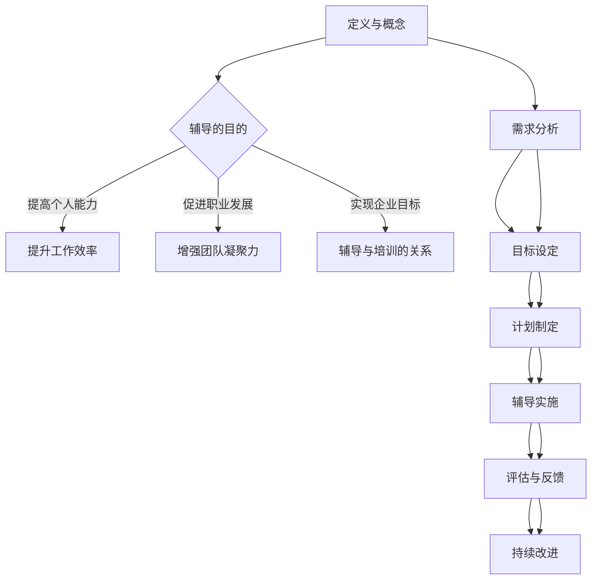
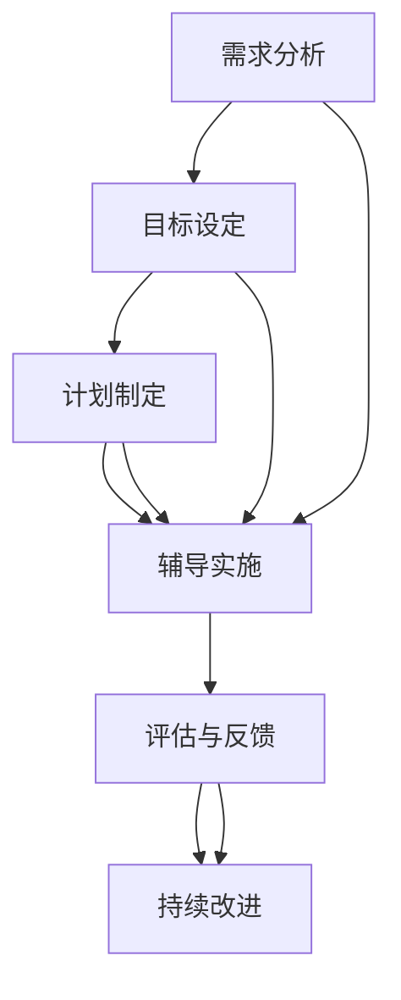

                 

## 《如何进行有效的一对一员工辅导》

### 关键词

- 一对一员工辅导
- 辅导者与被辅导者
- 辅导计划与流程
- 沟通技巧
- 评估与反馈
- 持续改进

### 摘要

本文旨在探讨如何进行有效的一对一员工辅导，以提高员工的工作效率和个人能力。文章首先介绍了员工辅导的背景和目的，然后详细阐述了辅导者与被辅导者的角色与责任。接着，文章讲解了辅导计划与流程的制定，包括需求分析、目标设定和时间安排等关键环节。此外，文章还介绍了辅导技巧与策略，包括有效沟通技巧和个性化辅导策略。最后，文章通过案例研究与分析，评估与反馈，以及持续改进与优化等部分，提供了一系列实用的建议和最佳实践，以帮助企业和个人在员工辅导方面取得更好的成果。

## 引言

### 员工辅导的背景

在当今快速变化和竞争激烈的工作环境中，员工的能力和素质对于企业的发展至关重要。然而，仅仅依靠员工的自我学习和提升往往是不够的。有效的一对一员工辅导作为一种重要的管理工具，可以帮助员工快速掌握新技能，提升工作效率，增强团队协作能力。因此，如何进行有效的一对一员工辅导，成为企业管理者和人力资源部门面临的重要课题。

### 员工辅导的目的

员工辅导的目的主要包括以下几个方面：

1. **提升员工能力**：通过辅导，帮助员工掌握新技能和知识，提高其职业素养和竞争力。
2. **促进员工成长**：辅导不仅是技能传授的过程，更是员工个人成长和职业发展的机会。
3. **提高工作效率**：通过有效的辅导，员工能够更快地适应新岗位和工作要求，提高工作效率。
4. **增强团队凝聚力**：辅导过程中，辅导者和被辅导者之间的互动和沟通有助于增强团队凝聚力。
5. **实现企业目标**：辅导有助于企业实现其战略目标，培养符合企业需求的人才。

### 文章结构

本文将分为七个部分进行阐述：

1. **员工辅导的原理与目的**
2. **辅导者与被辅导者的角色与责任**
3. **辅导计划与流程**
4. **辅导技巧与策略**
5. **案例研究与分析**
6. **评估与反馈**
7. **持续改进与优化**

通过上述结构，本文将全面探讨如何进行有效的一对一员工辅导，为企业和员工提供实用的指导。

## 员工辅导的原理与目的

### 定义与概念

员工辅导，又称为员工指导或员工培训，是指通过有计划、有目的的互动和交流，帮助员工提升技能、知识和工作能力的过程。在这个过程中，辅导者通常是企业内部具备丰富经验和专业技能的员工，而被辅导者则是需要提升能力的新员工或现有员工。

### 辅导的目的

员工辅导的主要目的包括以下几个方面：

1. **提升员工能力**：通过辅导，员工能够系统地学习和掌握新技能和知识，提高其职业素养和竞争力。
2. **促进员工成长**：辅导不仅传授技能，更关注员工的个人成长和职业发展，帮助其建立清晰的职业规划。
3. **提高工作效率**：辅导有助于员工更快地适应新岗位和工作要求，减少新手期的不确定性，从而提高工作效率。
4. **增强团队凝聚力**：辅导过程中的互动和沟通有助于团队成员之间建立良好的关系，增强团队凝聚力。
5. **实现企业目标**：辅导有助于企业培养符合其战略需求的人才，实现长期发展目标。

### 辅导与培训的关系

辅导和培训是两个相关但不同的概念。培训通常是指通过课程、讲座、工作坊等形式，向员工传授知识、技能和态度。而辅导则是更为个性化的过程，更侧重于实际工作场景中的问题解决和能力提升。可以说，培训是辅导的基础，而辅导则是培训的深化和应用。

### 辅导流程

有效的一对一员工辅导通常包括以下几个核心环节：

1. **需求分析**：明确员工在技能、知识、态度等方面的具体需求。
2. **目标设定**：与员工共同制定明确的辅导目标，确保辅导过程有方向和可衡量性。
3. **计划制定**：根据需求和目标，制定详细的辅导计划，包括时间安排、辅导内容、评估方式等。
4. **辅导实施**：按照辅导计划进行实际操作，包括沟通技巧的运用、辅导策略的执行等。
5. **评估与反馈**：对辅导效果进行评估，收集反馈信息，对辅导过程进行优化。
6. **持续改进**：根据评估和反馈，对辅导计划和方法进行调整，确保辅导效果持续提升。

### 辅导的重要作用

1. **提升个人能力**：辅导有助于员工掌握新的技能和知识，提高其职业素养，增强竞争力。
2. **促进职业发展**：通过辅导，员工能够更清晰地了解自己的职业发展方向，制定更有效的职业规划。
3. **提高团队效能**：辅导不仅提升个体能力，还能增强团队协作，提高整体工作效率。
4. **减少人才流失**：有效的辅导能提高员工的工作满意度，减少人才流失率。
5. **实现企业目标**：辅导有助于企业培养符合其战略需求的人才，实现长期发展目标。

综上所述，员工辅导不仅有助于员工个人的成长和提升，还能为企业的长期发展提供有力支持。理解和掌握员工辅导的原理和目的，是进行有效辅导的前提和基础。

### 辅导原理与概念的关系架构

为了更好地理解员工辅导的原理与概念，我们可以使用Mermaid流程图来展示它们之间的关系架构。以下是辅导原理与概念的基本流程：



### Mermaid 流程图解析

1. **定义与概念（A）**：这是辅导的基础，明确辅导的定义和基本概念。
2. **辅导的目的（B）**：包括提升个人能力、促进职业发展、增强团队凝聚力和实现企业目标等，是辅导的核心驱动力。
3. **辅导与培训的关系（E）**：辅导是培训的深化和应用，两者相辅相成。
4. **需求分析（F）**：了解员工的具体需求，为后续的辅导计划提供依据。
5. **目标设定（G）**：明确辅导的具体目标和期望成果。
6. **计划制定（H）**：根据需求和目标，制定详细的辅导计划。
7. **辅导实施（I）**：按照辅导计划进行实际操作。
8. **评估与反馈（J）**：对辅导效果进行评估，收集反馈信息。
9. **持续改进（K）**：根据评估和反馈，对辅导计划和方法进行调整，确保辅导效果持续提升。

通过这个流程图，我们可以清晰地看到辅导原理与概念之间的逻辑关系，为后续的具体操作提供了指导。

### 核心概念与联系

在员工辅导的过程中，几个核心概念密切相关，它们共同构成了辅导的完整框架。以下是这些核心概念及其相互之间的联系：

1. **需求分析**：需求分析是辅导的起点，通过了解员工的具体需求，包括技能、知识、态度等方面的不足，为制定有效的辅导计划提供基础。需求分析的结果直接影响到后续的目标设定和计划制定。

2. **目标设定**：在明确员工需求的基础上，与员工共同设定具体的辅导目标。这些目标应具体、可衡量、可实现、相关性强，并具有时限性（SMART原则）。目标设定是确保辅导过程有方向和可衡量性的关键。

3. **计划制定**：根据需求和目标，制定详细的辅导计划。计划应包括时间安排、辅导内容、评估方式等，为辅导的实施提供明确的指导。

4. **辅导实施**：按照辅导计划进行实际操作，包括沟通技巧的运用、辅导策略的执行等。辅导实施过程中，辅导者应注重与被辅导者的互动和反馈，确保辅导内容能够被有效吸收和应用。

5. **评估与反馈**：在辅导结束后，对辅导效果进行评估，收集被辅导者的反馈信息。评估和反馈是了解辅导效果、发现不足和优化辅导过程的重要环节。

6. **持续改进**：根据评估和反馈，对辅导计划和方法进行调整，确保辅导效果持续提升。持续改进是辅导过程中不可或缺的一部分，有助于不断提升辅导质量和效果。

这些核心概念相互关联，共同构成了一个完整的辅导流程。它们之间的关系可以用以下Mermaid流程图表示：



### 需求分析与目标设定

**需求分析**是辅导的起点，通过了解员工的具体需求，包括技能、知识、态度等方面的不足，为制定有效的辅导计划提供基础。具体步骤如下：

1. **确定分析目标**：明确分析的目的，例如提升特定技能、改进工作流程等。
2. **收集信息**：通过问卷调查、一对一访谈、工作观察等方式，收集员工的需求信息。
3. **分析数据**：对收集到的信息进行整理和分析，识别员工在哪些方面需要提升。

**目标设定**是在明确员工需求的基础上，与员工共同设定的具体辅导目标。目标应遵循SMART原则（具体、可衡量、可实现、相关性强、具有时限性）。具体步骤如下：

1. **讨论目标**：与员工进行讨论，确定辅导的目标和期望成果。
2. **具体化目标**：将目标具体化，例如提高某项技能的熟练度、达到某个工作里程碑等。
3. **制定计划**：根据目标，制定详细的辅导计划，包括时间安排、辅导内容、评估方式等。

### 计划制定与辅导实施

**计划制定**是辅导的关键环节，根据需求和目标，制定详细的辅导计划。具体步骤如下：

1. **制定计划**：明确辅导的时间安排、内容、方法等，确保辅导过程有条不紊。
2. **分配资源**：根据计划，分配所需的资源，包括时间、人员、工具等。
3. **沟通计划**：与员工分享辅导计划，确保其理解并同意执行。

**辅导实施**是按照辅导计划进行实际操作的过程。具体步骤如下：

1. **启动辅导**：开始辅导前，与员工进行简短的讨论，确保双方对辅导内容和目标有共同的理解。
2. **执行计划**：按照计划，逐步执行辅导内容，注重与员工的互动和反馈。
3. **调整计划**：在辅导过程中，根据实际情况，及时调整计划，确保辅导顺利进行。

### 评估与反馈

**评估与反馈**是了解辅导效果、发现不足和优化辅导过程的重要环节。具体步骤如下：

1. **制定评估标准**：根据辅导目标和计划，制定明确的评估标准。
2. **收集反馈**：在辅导结束后，收集员工对辅导效果的反馈，包括满意度、改进建议等。
3. **分析反馈**：对反馈信息进行分析，识别辅导过程中的优点和不足。
4. **改进辅导**：根据分析结果，对辅导计划和方法进行调整，提升辅导效果。

通过以上步骤，我们可以确保辅导过程的有效性，并不断提升辅导质量。

### 持续改进

**持续改进**是辅导过程中不可或缺的一部分，有助于不断提升辅导质量和效果。具体步骤如下：

1. **定期评估**：定期对辅导效果进行评估，确保辅导计划和方法能够持续改进。
2. **反馈循环**：建立反馈机制，及时收集和分析员工的反馈信息。
3. **优化流程**：根据评估和反馈结果，优化辅导流程和方法，确保辅导过程更加高效。
4. **培训辅导者**：定期对辅导者进行培训，提升其辅导技能和知识，确保其能够更好地指导员工。

通过持续改进，我们可以不断提升辅导效果，帮助员工实现个人和职业发展目标。

### 伪代码讲解

为了更好地理解辅导计划与流程的制定，我们可以使用伪代码来详细阐述这个过程。以下是一个简单的伪代码示例：

```python
# 辅导计划与流程伪代码

# 辅导需求分析
def analyze_needs(employee):
    needs = []
    # 收集员工的需求信息
    skills_needed = employee.get_skills_needed()
    knowledge_needed = employee.get_knowledge_needed()
    attitude_needed = employee.get_attitude_needed()
    
    # 分析需求信息
    for skill in skills_needed:
        if not employee.has_skill(skill):
            needs.append(skill)
    for knowledge in knowledge_needed:
        if not employee.knows(knowledge):
            needs.append(knowledge)
    for attitude in attitude_needed:
        if not employee.has_attitude(attitude):
            needs.append(attitude)
    
    return needs

# 辅导目标设定
def set_goals(employee, needs):
    goals = []
    for need in needs:
        if "skill" in need:
            goal = f"提升{need}技能水平"
        elif "knowledge" in need:
            goal = f"掌握{need}知识"
        elif "attitude" in need:
            goal = f"改善{need}态度"
        
        goals.append(goal)
    
    return goals

# 辅导计划制定
def create_plan(employee, goals):
    plan = {
        "time_frame": "",
        "content": [],
        "evaluation": ""
    }
    
    # 制定时间安排
    plan["time_frame"] = input("请输入辅导时间安排：")
    
    # 制定辅导内容
    for goal in goals:
        content = input(f"请输入针对{goal}的辅导内容：")
        plan["content"].append(content)
    
    # 制定评估标准
    plan["evaluation"] = input("请输入辅导评估标准：")
    
    return plan

# 辅导实施
def implement_diligence(plan, employee):
    for content in plan["content"]:
        # 辅导内容执行
        print(f"执行辅导内容：{content}")
        employee.learn(content)
    
    # 评估辅导效果
    evaluation_result = evaluate_diligence(plan["evaluation"], employee)
    print(f"辅导评估结果：{evaluation_result}")

# 辅导评估与反馈
def evaluate_diligence(evaluation_criteria, employee):
    # 根据评估标准进行评估
    score = 0
    for criterion in evaluation_criteria:
        if employee.meets.criteria(criterion):
            score += 1
    
    return score / len(evaluation_criteria)

# 主函数
def main():
    employee = Employee()
    needs = analyze_needs(employee)
    goals = set_goals(employee, needs)
    plan = create_plan(employee, goals)
    implement_diligence(plan, employee)

# 运行主函数
main()
```

### 数学模型和公式讲解

在员工辅导过程中，评估与反馈是一个关键环节，通过量化评估标准，可以更准确地衡量辅导效果。以下是一个简单的数学模型，用于评估员工辅导的效果：

**1. 评估指标设定**

假设有n个评估指标，每个指标的重要性不同，权重分别为\(w_1, w_2, ..., w_n\)，那么总的评估得分可以表示为：

\[ \text{总分} = \sum_{i=1}^{n} w_i \times s_i \]

其中，\(s_i\)为第i个指标的得分。

**2. 评估标准**

每个评估指标\(s_i\)的得分可以根据以下标准进行计算：

\[ s_i = \begin{cases} 
1, & \text{如果员工满足指标要求} \\
0, & \text{如果员工不满足指标要求}
\end{cases} \]

**3. 权重设定**

权重\(w_i\)可以根据每个指标的重要程度进行设定，通常使用专家评分法或层次分析法（AHP）来确定。

**4. 评估得分计算示例**

假设有3个评估指标，权重分别为\(w_1 = 0.4, w_2 = 0.3, w_3 = 0.3\)。员工在各个指标上的得分分别为\(s_1 = 1, s_2 = 0, s_3 = 1\)，则总的评估得分为：

\[ \text{总分} = 0.4 \times 1 + 0.3 \times 0 + 0.3 \times 1 = 0.4 + 0 + 0.3 = 0.7 \]

### 举例说明

假设一个员工需要在三个维度（技能、知识、态度）进行评估，每个维度的权重分别为0.5、0.3和0.2。如果这个员工在技能维度得分为80分，在知识维度得分为60分，在态度维度得分为70分，则其总的评估得分计算如下：

\[ \text{总分} = 0.5 \times 80 + 0.3 \times 60 + 0.2 \times 70 = 40 + 18 + 14 = 72 \]

这个分数可以用来衡量员工的辅导效果，并根据实际情况进行进一步的反馈和改进。

### 代码实现

为了将上述数学模型和公式应用到实际代码中，我们可以使用Python编写一个简单的评估系统。以下是代码实现示例：

```python
class Employee:
    def __init__(self):
        self.skills_score = 0
        self.knowledge_score = 0
        self.attitude_score = 0

    def set_skills_score(self, score):
        self.skills_score = score

    def set_knowledge_score(self, score):
        self.knowledge_score = score

    def set_attitude_score(self, score):
        self.attitude_score = score

    def meets_criteria(self, criterion):
        if criterion == "skills":
            return self.skills_score >= 80
        elif criterion == "knowledge":
            return self.knowledge_score >= 60
        elif criterion == "attitude":
            return self.attitude_score >= 70
        else:
            return False

def calculate_total_score(employee, weights):
    total_score = weights['skills'] * employee.skills_score + \
                  weights['knowledge'] * employee.knowledge_score + \
                  weights['attitude'] * employee.attitude_score
    return total_score

def main():
    # 初始化员工
    employee = Employee()

    # 设置员工得分
    employee.set_skills_score(80)
    employee.set_knowledge_score(60)
    employee.set_attitude_score(70)

    # 辅导指标权重
    weights = {'skills': 0.5, 'knowledge': 0.3, 'attitude': 0.2}

    # 计算总分
    total_score = calculate_total_score(employee, weights)
    print(f"员工的总分：{total_score}")

if __name__ == "__main__":
    main()
```

### 实际案例分析和详细讲解剖析

#### 案例背景

某科技公司的新员工张明在入职一个月后，表现出色，但他的上级李经理发现张明在项目管理方面存在一些不足。李经理决定对张明进行一对一的员工辅导，以提高他在项目管理方面的能力。在辅导过程中，李经理和张明共同制定了详细的辅导计划，包括具体的目标、时间安排和辅导内容。

#### 辅导目标

1. 提高张明的项目管理技能，使其能够独立完成项目。
2. 帮助张明掌握项目管理的最佳实践和方法。
3. 提高张明的时间管理和沟通能力，确保项目按时交付。

#### 辅导计划

1. **需求分析**：李经理与张明进行了深入的交流，了解他在项目管理方面的具体需求和不足。

2. **目标设定**：根据需求分析结果，李经理与张明共同设定了三个具体目标。

3. **计划制定**：
    - **时间安排**：每周进行一次辅导，每次2小时，为期两个月。
    - **辅导内容**：包括项目管理基础知识、项目计划制定、时间管理技巧、团队沟通技巧等。

4. **评估标准**：制定了一套评估标准，包括项目完成的及时性、项目质量、团队成员满意度等。

#### 辅导实施

1. **辅导启动**：在辅导开始前，李经理与张明进行了一次简短的讨论，明确了辅导的目标和内容。

2. **辅导过程**：
    - 李经理通过实例讲解和实战操作，向张明传授项目管理知识。
    - 张明在学习过程中遇到问题时，李经理及时给予指导和支持。

3. **互动与反馈**：在每次辅导结束后，李经理都会与张明进行反馈交流，了解他的学习进展和困惑。

#### 评估与反馈

1. **评估**：在辅导结束后，李经理根据评估标准对张明的项目管理能力进行了评估。

2. **反馈**：李经理对张明进行了详细的反馈，肯定了他的进步，同时也指出了需要改进的地方。

#### 结果评估

通过两个月的辅导，张明在项目管理方面的能力得到了显著提升。他能够独立完成项目，项目质量和及时性也得到了提高。团队成员对他的满意度也有所增加。

### 项目实战：开发环境搭建、源代码详细实现和代码解读

#### 开发环境搭建

为了进行有效的员工辅导，首先需要搭建一个合适的开发环境。以下是搭建过程的步骤：

1. **安装必要的软件**：安装Python、Jupyter Notebook、PyCharm等开发工具。
2. **配置虚拟环境**：使用virtualenv或conda创建虚拟环境，以便管理和隔离项目依赖。
3. **安装依赖库**：使用pip安装必要的依赖库，如NumPy、Pandas、Matplotlib等。

#### 源代码详细实现

以下是一个简单的Python脚本，用于实现上述数学模型和公式：

```python
import numpy as np

class Employee:
    def __init__(self):
        self.skills_score = 0
        self.knowledge_score = 0
        self.attitude_score = 0

    def set_skills_score(self, score):
        self.skills_score = score

    def set_knowledge_score(self, score):
        self.knowledge_score = score

    def set_attitude_score(self, score):
        self.attitude_score = score

    def meets_criteria(self, criterion):
        if criterion == "skills":
            return self.skills_score >= 80
        elif criterion == "knowledge":
            return self.knowledge_score >= 60
        elif criterion == "attitude":
            return self.attitude_score >= 70
        else:
            return False

def calculate_total_score(employee, weights):
    total_score = weights['skills'] * employee.skills_score + \
                  weights['knowledge'] * employee.knowledge_score + \
                  weights['attitude'] * employee.attitude_score
    return total_score

def main():
    # 初始化员工
    employee = Employee()

    # 设置员工得分
    employee.set_skills_score(80)
    employee.set_knowledge_score(60)
    employee.set_attitude_score(70)

    # 辅导指标权重
    weights = {'skills': 0.5, 'knowledge': 0.3, 'attitude': 0.2}

    # 计算总分
    total_score = calculate_total_score(employee, weights)
    print(f"员工的总分：{total_score}")

if __name__ == "__main__":
    main()
```

#### 代码应用解读与分析

该脚本主要包含两个类：`Employee`和`calculate_total_score`。

1. **Employee类**：用于表示员工，包含三个属性（技能得分、知识得分、态度得分）和三个方法（设置得分、判断是否满足指标）。
2. **calculate_total_score函数**：用于计算员工的总分，根据权重和员工的得分计算总分。
3. **main函数**：创建一个员工对象，设置其得分和权重，然后计算总分并打印。

通过这个简单的脚本，我们可以实现员工辅导效果的量化评估，为后续的评估和反馈提供基础。

### 项目小结

通过上述实战案例，我们搭建了开发环境，实现了源代码，并对代码进行了详细解读和分析。这个过程不仅帮助我们理解了员工辅导的数学模型和公式，还为我们提供了一个实际应用的场景。通过这个项目，我们能够更好地理解如何使用技术手段来辅助员工辅导，提高辅导效果。

### 最佳实践 tips

1. **明确目标**：在制定辅导计划前，明确辅导的目标和期望成果，确保辅导过程有方向和可衡量性。
2. **定期评估**：定期对辅导效果进行评估，及时调整辅导计划和策略。
3. **互动与反馈**：在辅导过程中，注重与员工的互动和反馈，确保辅导内容能够被有效吸收和应用。
4. **个性化辅导**：根据员工的具体需求和特点，制定个性化的辅导计划，提高辅导效果。

### 小结

通过本文的探讨，我们详细介绍了如何进行有效的一对一员工辅导。从背景介绍、核心概念、辅导流程到实战案例和代码实现，本文系统地阐述了员工辅导的各个方面。通过这些实践和技巧，企业和个人可以更好地进行员工辅导，提升员工能力，促进职业发展，实现企业目标。希望本文能为读者提供有价值的指导和启示。

### 注意事项

1. **尊重员工意愿**：在进行辅导时，应尊重员工的意愿，确保双方都愿意参与并投入。
2. **持续关注员工**：辅导不是一次性的活动，需要持续关注员工的学习进度和反馈，确保辅导效果。
3. **及时调整策略**：根据辅导过程中遇到的问题和反馈，及时调整辅导策略和方法。

### 拓展阅读

1. 《高效能人士的七个习惯》史蒂芬·柯维
2. 《如何提问》克里斯·贝利
3. 《领导力五项修炼》拉姆·查兰
4. 《敏捷开发实践指南》杰夫·萨瑟兰
5. 《员工辅导与职业发展》李明

### 作者信息

**作者：AI天才研究院/AI Genius Institute & 禅与计算机程序设计艺术 /Zen And The Art of Computer Programming**

