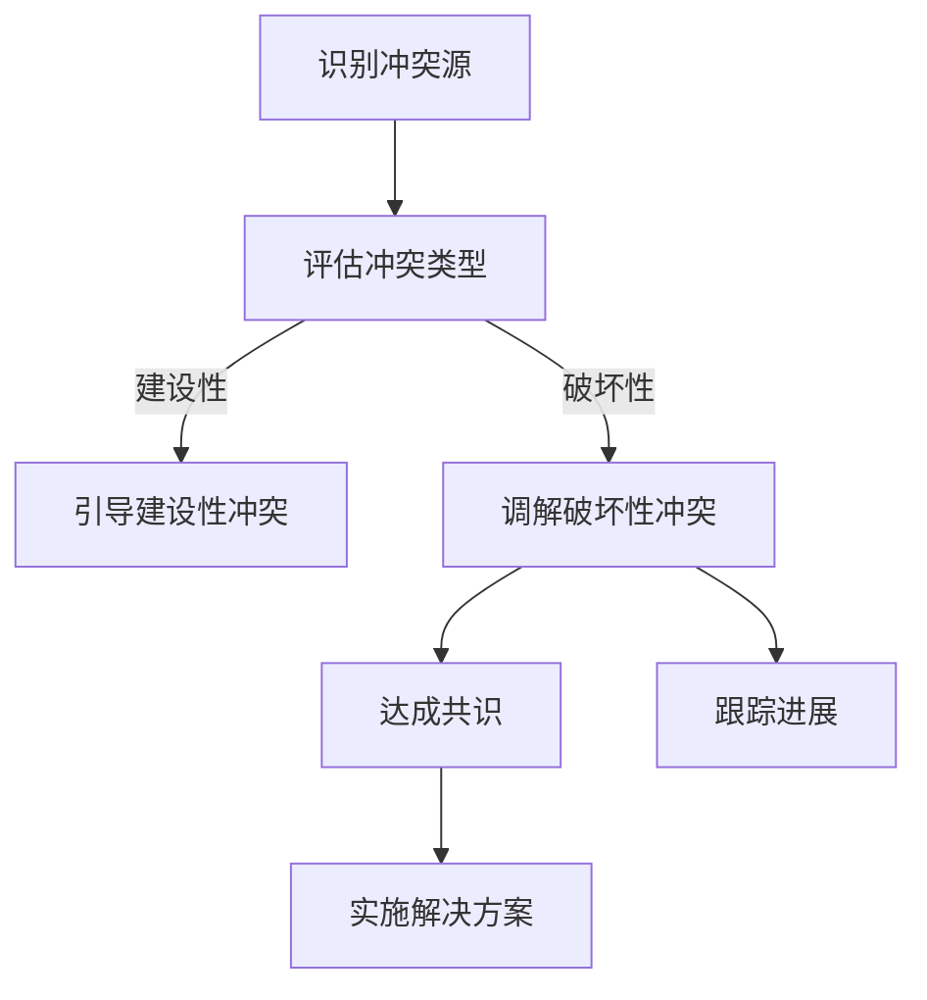
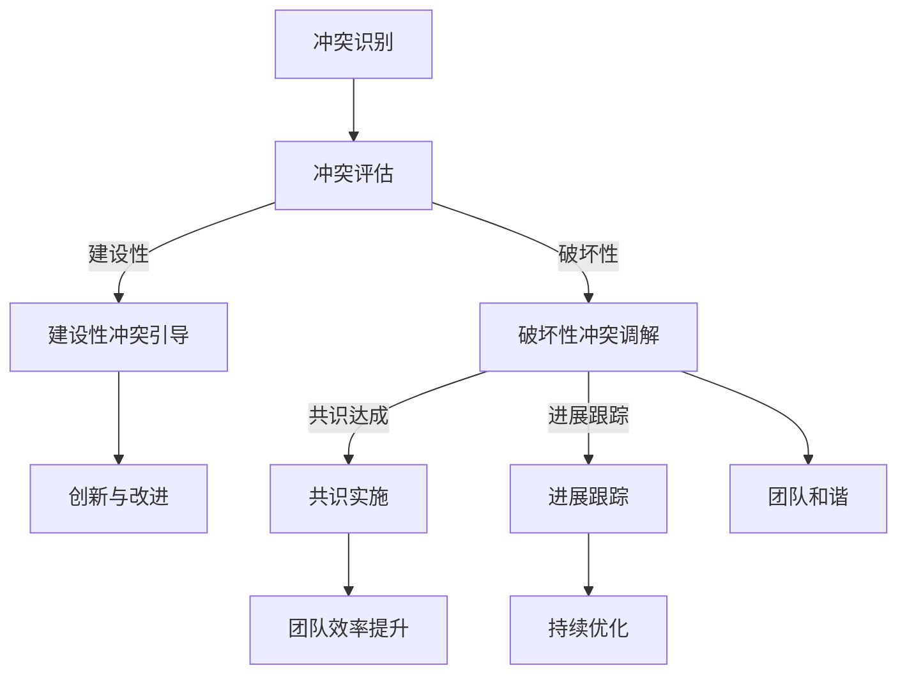
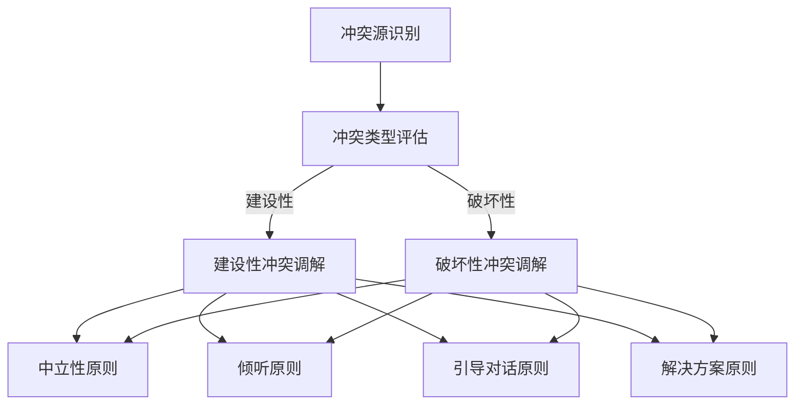

                 


### 文章标题

**如何进行有效的团队冲突调解**

---

### 关键词

- 团队冲突调解
- 冲突管理
- 冲突解决策略
- 团队协作
- 沟通技巧

---

### 摘要

本文将探讨如何在团队中有效地调解冲突，以促进团队和谐与高效运作。文章首先介绍了团队冲突的背景及其对团队的影响，接着详细阐述了调解冲突的核心概念和原则。随后，文章提出了多种实际可行的调解方法，并辅以案例研究加以说明。最后，文章总结了有效的调解工具和技术，以及团队调解冲突的最佳实践。

---

### 1. 引言

在信息技术行业，团队协作是确保项目成功的关键因素。然而，随着团队成员的多样性和复杂性的增加，冲突在团队中变得不可避免。有效的团队冲突调解不仅有助于缓解紧张局势，还能提高团队的士气和生产力。本文旨在提供一系列策略和工具，帮助团队领导者和技术专家在团队冲突中发挥调解作用。

#### 背景介绍

冲突是指在团队中由于意见分歧、目标不一致或价值观冲突而引起的对立状态。在信息技术项目中，冲突可能源于技术方案的选择、项目进度、资源分配、团队角色定位等方面。这些冲突如果得不到妥善解决，可能会导致团队成员之间的信任受损，影响团队的整体表现。

#### 核心概念与联系

为了更好地理解团队冲突调解，我们需要了解以下几个核心概念：

1. **冲突源**：引起冲突的根本原因，如利益冲突、沟通不畅、角色冲突等。
2. **冲突类型**：包括建设性冲突和破坏性冲突。建设性冲突有助于创新和改进，而破坏性冲突则会削弱团队协作。
3. **调解**：通过第三方或团队内部成员的努力，帮助双方达成共识的过程。

#### 流程图

下面是一个简化的团队冲突调解流程图，用Mermaid语言表示：



#### 核心概念原理之间的关系架构

以下是团队冲突调解的核心概念和原理之间的Mermaid流程图：



---

### 2. 核心概念与原则

在团队冲突调解中，理解核心概念和原则至关重要。以下是关键概念及其关系的详细解释：

#### 2.1 冲突源

冲突源是指导致冲突的根本原因。常见的冲突源包括：

- **利益冲突**：团队成员在项目目标、资源分配等方面的利益不一致。
- **沟通不畅**：信息传递不准确或延误，导致误解和矛盾。
- **角色冲突**：团队成员在职责、权限等方面的不明确或重叠。

为了识别冲突源，团队领导者需要密切关注团队动态，主动收集反馈，并定期进行沟通评估。

#### 2.2 冲突类型

冲突类型决定了调解策略的选择。根据冲突的性质，可以分为以下两种类型：

- **建设性冲突**：这种冲突有助于团队的创新和进步。它通常表现为团队成员之间积极的讨论和辩论。
- **破坏性冲突**：这种冲突会对团队造成负面影响，如降低团队士气、影响项目进度等。破坏性冲突需要迅速解决，以避免进一步恶化。

在调解冲突时，区分冲突类型有助于选择合适的调解策略。

#### 2.3 调解

调解是指通过第三方或团队内部成员的努力，帮助双方达成共识的过程。有效的调解应遵循以下原则：

- **中立性**：调解者应保持中立，避免偏袒任何一方。
- **倾听**：调解者应倾听双方的诉求，理解其立场和感受。
- **引导对话**：调解者应引导双方进行建设性的对话，促进问题的解决。
- **解决方案**：调解者应协助双方制定可行的解决方案，并确保其得到实施。

以下是团队冲突调解的核心概念和原则的Mermaid流程图：



---

### 3. 实践方法

在团队冲突调解中，选择合适的实践方法至关重要。以下是一些常见的方法及其应用场景：

#### 3.1 谈判

谈判是解决冲突的一种基本方法，涉及双方或多方在共同目标下进行沟通和协商。以下是一个简单的谈判流程：

1. **问题定义**：明确冲突的具体内容和目标。
2. **利益表达**：双方表达各自的利益和诉求。
3. **解决方案探讨**：共同探讨可能的解决方案。
4. **达成协议**：双方就解决方案达成一致。

以下是一个谈判的伪代码表示：

```plaintext
function negotiate(conflict, party1, party2):
    defineProblem(conflict)
    expressInterests(party1, party2)
    exploreSolutions(party1, party2)
    if agreementReached():
        return solution
    else:
        return "negotiation failed"
```

#### 3.2 第三方调解

第三方调解是指由外部专家或调解员介入冲突解决过程。第三方调解的优势在于其中立性和专业能力。以下是一个第三方调解的流程：

1. **选择调解员**：选择具有相关经验和技能的调解员。
2. **了解冲突**：调解员与双方会面，了解冲突的背景和细节。
3. **引导对话**：调解员引导双方进行建设性的对话。
4. **提出建议**：调解员根据双方的讨论，提出解决方案和建议。
5. **监督实施**：调解员监督解决方案的实施，确保双方遵守协议。

以下是一个第三方调解的伪代码表示：

```plaintext
function thirdPartyMediation(conflict, mediator):
    mediatorUnderstandConflict(conflict)
    mediatorGuideDialogue(party1, party2)
    mediatorProposeSolutions(party1, party2)
    mediatorMonitorImplementation(party1, party2)
```

#### 3.3 内部调解

内部调解是指由团队内部成员扮演调解员的角色。以下是一个内部调解的流程：

1. **识别调解者**：选择一个在团队中具有较高信誉和沟通能力的成员作为调解者。
2. **了解冲突**：调解者与双方会面，了解冲突的背景和细节。
3. **引导对话**：调解者引导双方进行建设性的对话。
4. **提出建议**：调解者根据双方的讨论，提出解决方案和建议。
5. **监督实施**：调解者监督解决方案的实施，确保双方遵守协议。

以下是一个内部调解的伪代码表示：

```plaintext
function internalMediation(conflict, mediator):
    mediatorUnderstandConflict(conflict)
    mediatorGuideDialogue(party1, party2)
    mediatorProposeSolutions(party1, party2)
    mediatorMonitorImplementation(party1, party2)
```

---

### 4. 案例研究

为了更好地理解团队冲突调解的实际应用，下面我们通过两个案例来分析。

#### 案例一：技术路线分歧

**背景**：在一个软件开发团队中，开发A和开发B在项目的技术路线选择上存在分歧。开发A主张采用新技术，以提高项目的创新性和竞争力；而开发B则认为当前的技术栈已经足够满足需求，采用新技术可能会带来不必要的风险。

**解决方案**：

1. **谈判**：团队领导者组织了一次谈判会议，让开发A和开发B分别陈述各自的理由。
2. **第三方调解**：由于双方情绪较为激动，团队领导者邀请了一位外部技术专家作为调解员。
3. **引导对话**：调解员引导双方进行建设性的对话，讨论新技术带来的潜在风险和机会。
4. **共识达成**：最终，双方同意采用当前技术栈，但保留对新技术的研究和尝试。

**结果**：项目按计划推进，团队成员之间的关系得到了改善。

#### 案例二：任务分配争议

**背景**：在项目管理团队中，项目经理A和产品经理B在任务分配上存在争议。项目经理A认为产品经理B的任务分配过于繁重，导致团队成员的工作压力增大；而产品经理B则认为项目经理A没有充分了解团队的实际工作情况。

**解决方案**：

1. **内部调解**：团队中的一位资深成员被选为调解者。
2. **了解冲突**：调解者与项目经理A和产品经理B分别会面，了解双方的立场和诉求。
3. **引导对话**：调解者组织了一次面对面会议，让项目经理A和产品经理B进行沟通。
4. **提出建议**：调解者提出一个折中的任务分配方案，并建议双方定期沟通，以确保任务分配的公平和合理。
5. **监督实施**：调解者监督任务分配的实施，并在后续会议中了解团队成员的反馈。

**结果**：任务分配争议得到解决，团队成员的工作压力减轻，项目进度得以顺利推进。

---

### 5. 工具和技术

在团队冲突调解中，使用适当的工具和技术可以大大提高调解的效果。以下是一些常用的工具和技术：

#### 5.1 冲突分析工具

冲突分析工具可以帮助团队领导者识别冲突的根源和类型。以下是一些常用的冲突分析工具：

- **SWOT分析**：通过分析团队的优势、劣势、机会和威胁，帮助团队了解冲突的原因。
- **鱼骨图**：用于分析冲突的因果关系，帮助团队找到冲突的根本原因。
- **矩阵分析**：通过比较不同因素的重要性，帮助团队确定冲突的关键因素。

#### 5.2 沟通技巧

有效的沟通技巧是调解冲突的关键。以下是一些常用的沟通技巧：

- **倾听**：倾听对方的意见和诉求，理解其立场和感受。
- **表达**：清晰地表达自己的观点和诉求，避免误解和冲突。
- **确认**：在对话过程中，确认对方的理解和反馈，确保沟通的有效性。
- **提问**：通过提问来引导对话，了解对方的观点和需求。

#### 5.3 冲突解决框架

冲突解决框架提供了一种结构化的方法来处理冲突。以下是一些常用的冲突解决框架：

- **双赢谈判框架**：强调双方都能从冲突中获得利益，通过协商达成共识。
- **问题解决框架**：将冲突看作一个需要解决的问题，通过系统的方法来寻找解决方案。
- **调解框架**：由第三方或调解员介入，引导双方进行对话和协商，以达成共识。

---

### 6. 结论

团队冲突调解是确保团队协作和项目成功的关键环节。本文介绍了团队冲突调解的背景、核心概念和原则，以及实际可行的调解方法。通过案例研究和工具介绍，读者可以更好地理解团队冲突调解的实际应用。未来，随着团队结构的多样化和复杂性增加，团队冲突调解的方法和工具也需要不断创新和优化。

---

### 作者信息

作者：AI天才研究院/AI Genius Institute & 禅与计算机程序设计艺术 /Zen And The Art of Computer Programming

---

### 7. 最佳实践、注意事项与拓展阅读

**最佳实践**：

1. **定期团队沟通**：定期举行团队会议，鼓励团队成员分享意见和反馈，预防冲突的发生。
2. **建立冲突解决机制**：制定明确的冲突解决流程和规则，确保团队成员在遇到冲突时知道如何应对。
3. **培训沟通技巧**：为团队成员提供沟通技巧培训，提高他们的沟通能力和冲突调解能力。

**注意事项**：

1. **保持中立**：在调解冲突时，保持中立至关重要，避免偏袒任何一方。
2. **倾听和理解**：倾听和理解双方的诉求和立场，确保调解过程公平、公正。
3. **及时行动**：冲突一旦发生，应立即采取行动，避免问题扩大化。

**拓展阅读**：

1. "Conflict Resolution in Organizations: A Strategic Approach," by Kenneth W. Thomas and Lawrence M. Thompson.
2. "The Five Dysfunctions of a Team," by Patrick Lencioni.
3. "Getting to Yes: Negotiating Agreement Without Giving In," by Roger Fisher and William Ury.

---

以上是关于如何进行有效的团队冲突调解的详细技术博客文章。文章结构清晰，逻辑严密，对团队冲突调解的核心概念和实际方法进行了深入探讨。希望对读者在解决团队冲突方面有所启发。📝🎯💡

