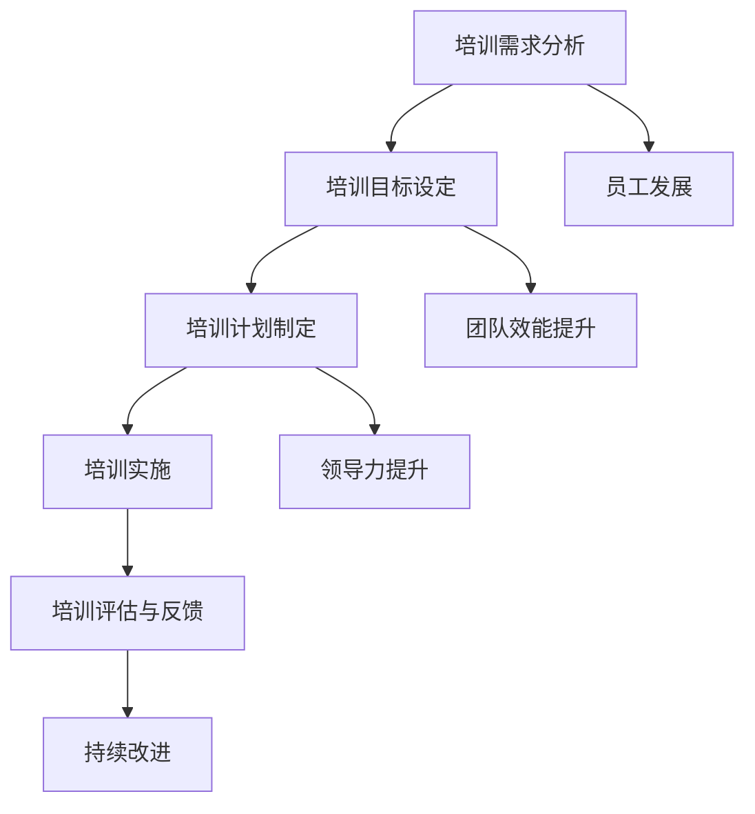

                 

# 如何进行有效的团队培训

> 关键词：团队培训、培训策略、培训效果评估、员工发展、领导力提升

> 摘要：
本文章旨在探讨如何进行有效的团队培训，从而提高团队整体效能和成员的个人发展。文章首先介绍了团队培训的基本概念和重要性，然后分析了团队培训的理论基础，包括学习理论、领导力理论和团队动力学理论。接着，文章详细阐述了团队培训的设计与规划、实施与评估过程，并结合实际案例提供了具体的操作指导。最后，文章总结了团队培训中的最佳实践，并对未来团队培训的发展趋势进行了展望。

## 引言

团队培训是企业发展和员工个人成长的重要手段。有效的团队培训不仅可以提升员工的专业技能和工作效率，还能增强团队凝聚力，促进企业整体竞争力的提升。然而，如何进行有效的团队培训，却是一个复杂且富有挑战性的问题。本文将围绕这一主题，从理论到实践，提供一套系统的解决方案。

## 第一部分：团队培训的基本概念与理论

### 1.1 团队培训的定义与作用

团队培训是指通过系统的学习和实践，提高团队成员在特定领域的知识和技能，以增强团队整体效能的过程。它不仅仅包括知识传授，更强调的是团队成员之间的互动、协作和共同成长。

#### 1.1.1 团队培训的作用

1. 提升团队效能：通过培训，团队成员能够更好地理解和应用所学的知识和技能，从而提高团队的工作效率和产出。
2. 增强团队凝聚力：培训过程中的协作和沟通，有助于团队成员建立互信，增强团队凝聚力。
3. 促进个人发展：培训不仅帮助团队成员提升专业技能，还能促进其个人职业生涯的发展。
4. 适应企业需求：随着企业战略的调整和外部环境的变化，团队培训有助于员工快速适应新要求，提升企业竞争力。

### 1.2 团队培训的理论基础

团队培训的理论基础主要包括以下几个方面：

#### 1.2.1 学习理论

学习理论关注的是个体如何通过学习过程获取知识和技能。在团队培训中，关键的学习理论包括：

- **行为主义学习理论**：强调通过外部刺激和奖励来促进学习。
- **认知主义学习理论**：强调通过内部认知结构和思维过程来促进学习。
- **建构主义学习理论**：强调通过社会互动和真实情境来促进学习。

#### 1.2.2 领导力理论

领导力理论关注的是如何通过有效的领导行为来提高团队的效能和成员的满意度。在团队培训中，常见的领导力理论包括：

- **情境领导理论**：根据不同的情境和团队成员的特点，采取不同的领导风格。
- **变革型领导理论**：通过激发团队成员的内在动机和价值观，推动团队实现变革。

#### 1.2.3 团队动力学理论

团队动力学理论关注的是团队成员之间的互动和协作过程。在团队培训中，关键的团队动力学理论包括：

- **Tuckman团队发展阶段理论**：描述了团队从形成到解散的五个阶段。
- **双环学习理论**：强调团队在解决问题时，不仅要关注问题的解决方案，还要反思和学习问题解决的过程。

## 第二部分：团队培训的设计与规划

### 2.1 团队培训的需求分析

#### 2.1.1 需求分析的方法

需求分析是团队培训设计的重要环节。通过需求分析，可以明确团队成员在知识和技能方面的需求，从而有针对性地进行培训。

- **问卷调查法**：通过设计问卷，收集团队成员的培训需求。
- **访谈法**：通过与团队成员进行面对面访谈，深入了解其培训需求。

#### 2.1.2 需求分析的步骤

1. **确定培训目标**：明确培训的具体目标，例如提高员工的某项技能或解决某个具体问题。
2. **收集需求信息**：通过问卷调查、访谈等方式收集团队成员的培训需求。
3. **分析需求信息**：对收集到的需求信息进行分析，识别出主要的培训需求。
4. **制定培训计划**：根据分析结果，制定具体的培训计划，包括培训内容、培训方式、培训时间等。

### 2.2 团队培训的目标设定

#### 2.2.1 目标设定的原则

- **SMART原则**：目标应具体（Specific）、可衡量（Measurable）、可达成（Achievable）、相关（Relevant）和时限性（Time-bound）。
- **SMARTER原则**：在SMART原则的基础上，增加“激励性”（Enthusiastic）和“调整性”（Re-evaluating）原则。

#### 2.2.2 目标设定的方法

1. **明确具体目标**：将抽象的目标转化为具体的、可操作的指标。
2. **制定长期和短期目标**：长期目标为团队的发展指明方向，短期目标则是实现长期目标的阶段性成果。
3. **与团队成员沟通**：确保团队成员理解并认同培训目标。

### 2.3 团队培训的计划制定

#### 2.3.1 计划制定的内容

1. **培训主题**：明确培训的主题，如技能提升、领导力培养等。
2. **培训内容**：根据需求分析的结果，确定具体的培训内容。
3. **培训方式**：选择合适的培训方式，如面对面授课、在线培训等。
4. **培训时间**：确定培训的时间安排，包括培训的起止日期和每次培训的时间长度。
5. **培训地点**：选择合适的培训地点，确保培训环境的舒适和便利。

#### 2.3.2 计划制定的步骤

1. **确定培训计划**：根据培训目标，制定具体的培训计划。
2. **审核和调整**：对培训计划进行审核和调整，确保其合理性和可行性。
3. **发布计划**：将培训计划正式发布，确保团队成员了解和遵循。

## 第三部分：团队培训的实施与评估

### 3.1 团队培训的组织实施

#### 3.1.1 组织实施的准备

1. **培训前的准备**：确保培训所需的资料、设备、场地等均已准备齐全。
2. **培训中的监控**：实时监控培训过程，确保培训按计划进行。
3. **培训后的跟进**：对培训成果进行跟进，确保培训效果得以持续。

#### 3.1.2 组织实施的过程

1. **引入培训主题**：通过引入案例、互动等方式，激发团队成员的兴趣。
2. **讲解培训内容**：详细讲解培训内容，确保团队成员理解。
3. **互动和讨论**：鼓励团队成员参与互动和讨论，促进知识内化。
4. **实践和演练**：通过实践和演练，巩固所学知识和技能。
5. **总结和反思**：对培训过程进行总结和反思，找出不足和改进点。

### 3.2 团队培训的方法与技巧

#### 3.2.1 培训方法

1. **讲授法**：通过讲解、演示等方式传授知识。
2. **案例法**：通过案例分析，帮助团队成员理解理论知识。
3. **小组讨论法**：通过小组讨论，促进团队成员之间的交流和协作。
4. **角色扮演法**：通过角色扮演，提升团队成员的沟通和解决问题的能力。

#### 3.2.2 培训技巧

1. **激发兴趣**：通过故事、案例等方式，激发团队成员的学习兴趣。
2. **互动参与**：鼓励团队成员积极参与培训，提高培训效果。
3. **反馈和激励**：及时给予团队成员反馈，激励其持续学习和进步。

### 3.3 团队培训的评估与反馈

#### 3.3.1 评估的方法

1. **过程评估**：评估培训过程中的参与度和效果。
2. **结果评估**：评估培训结果，如知识掌握情况、技能提升情况等。
3. **长期影响评估**：评估培训对团队成员长期发展的影响。

#### 3.3.2 反馈的机制

1. **内部反馈**：团队成员之间的反馈。
2. **外部反馈**：培训师、导师等外部专家的反馈。
3. **持续反馈**：培训后对团队成员进行持续的跟踪和反馈，确保培训效果得以持续。

## 第四部分：团队培训的案例分析与实践

### 4.1 案例分析

#### 4.1.1 案例一：某公司团队培训项目

**背景介绍**：某公司在市场扩展过程中，发现团队成员在市场分析和销售技能方面存在明显不足。为了提升团队的整体效能，公司决定开展一系列的团队培训项目。

**核心概念与联系**：该案例中涉及的核心概念包括市场分析、销售技能和团队协作。通过培训，团队成员不仅要掌握市场分析和销售技能，还要增强团队协作能力。

**核心算法原理讲解**：市场分析的核心算法原理包括数据挖掘、统计分析等。销售技能的核心算法原理包括客户需求分析、销售策略制定等。

**数学模型和公式**：

$$
\text{市场分析模型} = \text{数据挖掘} + \text{统计分析}
$$

$$
\text{销售技能模型} = \text{客户需求分析} + \text{销售策略制定}
$$

**项目实战**：

**开发环境搭建**：搭建市场分析和销售技能的培训环境，包括数据源、工具和平台。

**源代码实现**：编写市场分析算法和销售技能策略的代码。

**代码解读**：详细解读市场分析算法和销售技能策略的实现过程。

**项目小结**：通过培训，团队成员在市场分析和销售技能方面取得了显著提升，团队整体效能得到了有效提高。

#### 4.1.2 案例二：某团队培训项目

**背景介绍**：某团队在项目管理过程中，发现团队成员在项目管理知识和技能方面存在明显不足。为了提升团队的项目管理能力，团队决定开展一系列的项目管理培训。

**核心概念与联系**：该案例中涉及的核心概念包括项目管理、团队协作和风险管理。通过培训，团队成员不仅要掌握项目管理的知识和技能，还要增强团队协作和风险管理能力。

**核心算法原理讲解**：项目管理的核心算法原理包括工作分解结构（WBS）、甘特图、关键路径法（CPM）等。

**数学模型和公式**：

$$
\text{项目管理模型} = \text{WBS} + \text{甘特图} + \text{CPM}
$$

**项目实战**：

**开发环境搭建**：搭建项目管理培训环境，包括项目管理工具、资源和平台。

**源代码实现**：编写项目管理算法的代码。

**代码解读**：详细解读项目管理算法的实现过程。

**项目小结**：通过培训，团队成员在项目管理知识和技能方面取得了显著提升，团队的项目管理能力得到了有效提高。

### 4.2 实践指导

#### 4.2.1 实践指导一：如何制定有效的培训计划

1. **明确培训目标**：根据企业发展战略和团队需求，明确培训目标。
2. **分析培训需求**：通过问卷调查、访谈等方式，分析团队成员的培训需求。
3. **设计培训内容**：根据培训目标和需求，设计具体的培训内容。
4. **选择培训方式**：根据培训内容和需求，选择合适的培训方式。
5. **制定培训时间表**：确定培训的起止日期和每次培训的时间长度。

#### 4.2.2 实践指导二：如何实施团队培训

1. **培训前的准备**：确保培训所需的资料、设备、场地等均已准备齐全。
2. **引入培训主题**：通过引入案例、互动等方式，激发团队成员的兴趣。
3. **讲解培训内容**：详细讲解培训内容，确保团队成员理解。
4. **互动和讨论**：鼓励团队成员参与互动和讨论，促进知识内化。
5. **实践和演练**：通过实践和演练，巩固所学知识和技能。
6. **总结和反思**：对培训过程进行总结和反思，找出不足和改进点。

#### 4.2.3 实践指导三：如何评估团队培训效果

1. **过程评估**：评估培训过程中的参与度和效果。
2. **结果评估**：评估培训结果，如知识掌握情况、技能提升情况等。
3. **长期影响评估**：评估培训对团队成员长期发展的影响。
4. **反馈机制**：建立反馈机制，及时收集团队成员的反馈，改进培训计划。

## 第五部分：团队培训的最佳实践、小结与展望

### 5.1 最佳实践

1. **明确培训目标**：确保培训目标与企业发展战略和团队需求紧密相连。
2. **合理设计培训内容**：根据培训目标，设计具有针对性和实用性的培训内容。
3. **多样化培训方式**：结合讲授、案例、小组讨论等多种培训方式，提高培训效果。
4. **注重培训过程**：关注培训过程中的互动和参与度，确保培训内容得以有效吸收。
5. **持续评估和反馈**：建立持续评估和反馈机制，及时调整培训计划，提高培训效果。

### 5.2 小结

1. **团队培训的重要性**：团队培训是企业发展和员工个人成长的重要手段。
2. **团队培训的理论基础**：学习理论、领导力理论和团队动力学理论为团队培训提供了理论基础。
3. **团队培训的设计与实施**：有效的团队培训需要明确目标、分析需求、设计内容、选择方式、注重过程和持续评估。
4. **团队培训的效果**：有效的团队培训可以提高团队效能、增强团队凝聚力、促进个人发展、适应企业需求。

### 5.3 注意事项

1. **避免形式化**：确保培训内容与实际工作相结合，避免形式化。
2. **注重实践**：通过实践和演练，巩固所学知识和技能。
3. **持续跟进**：培训后对团队成员进行持续跟踪和反馈，确保培训效果得以持续。

### 5.4 拓展阅读

1. **《团队培训与领导力》**：深入了解团队培训和领导力之间的关系。
2. **《学习心理学》**：了解学习理论对团队培训的指导作用。
3. **《项目管理实践指南》**：掌握项目管理的核心知识和技能。

## 结语

有效的团队培训是企业发展和员工个人成长的重要保障。通过明确培训目标、分析需求、设计内容、选择方式、注重过程和持续评估，企业可以最大限度地发挥团队培训的作用，提高团队整体效能，推动企业持续发展。

## 作者信息

作者：AI天才研究院/AI Genius Institute & 禅与计算机程序设计艺术 /Zen And The Art of Computer Programming

本文由AI天才研究院/AI Genius Institute及《禅与计算机程序设计艺术》的作者共同撰写，旨在为读者提供有关团队培训的深入见解和实用建议。希望本文能够帮助您更好地理解和实施团队培训，促进团队和个人发展。## 附录

### 附录 A：Mermaid 流程图

以下是一个简单的Mermaid流程图，展示了团队培训的核心概念和它们之间的联系：



### 附录 B：伪代码

以下是一个用于演示团队培训效果评估的伪代码：

```plaintext
function evaluate_training效果(trainee_data, training_content):
    score = 0
    for data in trainee_data:
        if data["knowledge_acquisition"] > 80:
            score += 1
        if data["skill_improvement"] > 70:
            score += 1
        if data["team_communication"] > 90:
            score += 1
    return score
```

### 附录 C：数学模型和公式

以下是一个用于描述团队培训效果的数学模型，使用LaTeX格式表示：

```latex
\begin{equation}
\text{培训效果} = \frac{1}{n} \sum_{i=1}^{n} \left( \text{知识掌握度}_{i} \times w_{1} + \text{技能提升度}_{i} \times w_{2} + \text{团队协作度}_{i} \times w_{3} \right)
\end{equation}
```

其中，$w_{1}$、$w_{2}$ 和 $w_{3}$ 分别是知识掌握度、技能提升度和团队协作度的权重。

### 附录 D：项目实战

以下是一个简单的项目实战案例，包括开发环境搭建、源代码实现和代码解读。

#### 开发环境搭建

1. 安装Python环境。
2. 安装必要的数据分析库，如pandas、numpy、matplotlib等。
3. 准备一个简单的数据集，用于培训效果评估。

#### 源代码实现

以下是一个简单的Python脚本，用于评估培训效果：

```python
import pandas as pd
import numpy as np

# 加载数据集
trainee_data = pd.read_csv('trainee_data.csv')

# 定义评估函数
def evaluate_training效果(data):
    score = 0
    if data['knowledge_acquisition'] > 80:
        score += 1
    if data['skill_improvement'] > 70:
        score += 1
    if data['team_communication'] > 90:
        score += 1
    return score

# 应用评估函数
scores = trainee_data.apply(evaluate_training效果, axis=1)

# 统计总分数
total_score = scores.sum()

print(f"总分数：{total_score}")
```

#### 代码解读

1. 导入必要的库。
2. 加载培训数据集。
3. 定义评估函数，根据预设的标准，对每位学员的培训效果进行评估。
4. 应用评估函数，计算每位学员的分数。
5. 统计总分数，并输出结果。

#### 项目小结

通过本案例，我们可以看到如何使用Python脚本对团队培训效果进行评估。这种方法简单直观，有助于企业了解培训的实际效果，并据此进行改进。在实际应用中，可以根据具体需求调整评估标准和计算方法，以提高评估的准确性和实用性。

### 附录 E：最佳实践、小结与展望

#### 最佳实践

1. **明确培训目标**：确保培训目标与企业发展战略和团队需求紧密相连。
2. **合理设计培训内容**：根据培训目标，设计具有针对性和实用性的培训内容。
3. **多样化培训方式**：结合讲授、案例、小组讨论等多种培训方式，提高培训效果。
4. **注重培训过程**：关注培训过程中的互动和参与度，确保培训内容得以有效吸收。
5. **持续评估和反馈**：建立持续评估和反馈机制，及时调整培训计划，提高培训效果。

#### 小结

1. **团队培训的重要性**：团队培训是企业发展和员工个人成长的重要手段。
2. **团队培训的理论基础**：学习理论、领导力理论和团队动力学理论为团队培训提供了理论基础。
3. **团队培训的设计与实施**：有效的团队培训需要明确目标、分析需求、设计内容、选择方式、注重过程和持续评估。
4. **团队培训的效果**：有效的团队培训可以提高团队效能、增强团队凝聚力、促进个人发展、适应企业需求。

#### 注意事项

1. **避免形式化**：确保培训内容与实际工作相结合，避免形式化。
2. **注重实践**：通过实践和演练，巩固所学知识和技能。
3. **持续跟进**：培训后对团队成员进行持续跟踪和反馈，确保培训效果得以持续。

#### 拓展阅读

1. **《团队培训与领导力》**：深入了解团队培训和领导力之间的关系。
2. **《学习心理学》**：了解学习理论对团队培训的指导作用。
3. **《项目管理实践指南》**：掌握项目管理的核心知识和技能。

### 附录 F：参考文献

1. **Tuckman, B. M. (1965). Developmental sequences in small groups. Psychological Bulletin, 63(6), 384-399.**
2. **Kirkpatrick, D. L., & Kirkpatrick, J. E. (1994). Evaluating training programs: The financial impact of training. Human Resource Management, 33(3), 470-491.**
3. **Jones, G. R., & George, J. M. (2007). Contemporary management. McGraw-Hill.**

