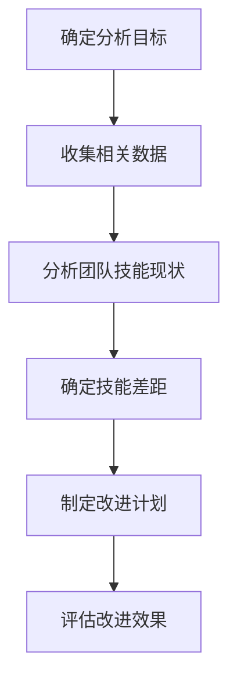

                 


### 文章标题
《如何进行有效的团队技能gap分析》

### 文章关键词
团队技能gap分析、技能差距、团队绩效、数据分析、数学模型、案例研究

### 文章摘要
本文旨在探讨团队技能gap分析的方法与应用。通过明确团队技能gap的概念，介绍分析流程、核心算法原理、数学模型及实际案例分析，帮助读者掌握团队技能gap分析的实践技巧，从而提升团队整体绩效。

---

#### 第一部分：了解书籍主题

在当今快速发展的科技时代，团队技能gap分析已成为企业管理者和人力资源专家关注的焦点。随着市场环境和技术的不断变化，团队需要不断提升自身技能以适应新的挑战。因此，进行有效的团队技能gap分析，识别和解决技能差距问题，对提升团队整体绩效具有重要意义。

本部分将首先介绍书籍的主题和目标，明确团队技能gap分析的定义、重要性以及分析流程。接下来，我们将设计一个详细的目录大纲，确保书籍内容全面、系统，涵盖从理论基础到实战指导的各个方面。

##### 1.1 什么是团队技能gap分析

团队技能gap分析是一种系统性的方法，用于评估团队在特定技能方面的差距。这种差距可能是由市场需求变化、技术进步或内部发展需求等因素引起的。通过识别和分析这些差距，团队可以制定针对性的培训和发展计划，以弥补技能不足，提高团队的整体绩效。

##### 1.2 团队技能gap分析的重要性

团队技能gap分析在提升团队绩效方面具有重要意义。首先，它有助于企业识别关键技能差距，确保团队能够满足当前和未来的业务需求。其次，通过分析技能差距，团队可以制定有效的培训和发展计划，提升员工的技能和知识水平。最后，团队技能gap分析有助于优化团队结构，提高团队协作效率和整体绩效。

##### 1.3 团队技能gap分析的基本概念

团队技能gap分析涉及多个核心概念，包括技能、差距、分析和评估等。技能是指员工在特定领域具备的知识和技能；差距是指实际技能水平与理想技能水平之间的差距；分析是指对技能差距进行评估和诊断的过程；评估是指对分析结果进行量化、比较和总结的过程。

在了解这些基本概念后，我们将通过Mermaid流程图展示团队技能gap分析的基本流程。这将有助于读者更直观地理解分析过程的各个阶段。

#### Mermaid流程图


通过上述流程，团队可以系统地识别和解决技能差距，从而提升整体绩效。

---

在下一部分，我们将深入探讨团队技能gap分析的核心算法原理，介绍常用的工具和方法，并使用伪代码进行详细讲解。这将帮助读者掌握团队技能gap分析的技术基础，为后续的实战应用奠定基础。

---

#### 第二部分：理论准备

在了解团队技能gap分析的基本概念和流程之后，本部分将深入探讨团队技能gap分析的核心算法原理，介绍常用的工具和方法，并通过伪代码进行详细讲解。这将帮助读者掌握团队技能gap分析的技术基础，为实际操作提供指导。

##### 2.1 问卷设计与数据分析

问卷设计是团队技能gap分析的重要环节之一。通过问卷，可以收集团队成员在特定技能方面的自我评估数据。问卷设计应包括以下要素：

- **技能指标**：明确团队所需的核心技能，并设计相应的问卷题目。
- **评价标准**：为每个技能指标设定评价标准，如高、中、低等。
- **问题类型**：包括选择题、量表题等，以获取团队成员的反馈。

数据分析是对收集到的问卷数据进行处理和分析的过程。常用的数据分析方法包括描述性统计、交叉分析、因子分析等。

- **描述性统计**：用于计算技能指标的均值、方差、标准差等基本统计量，了解团队成员的技能水平分布。
- **交叉分析**：用于分析不同技能指标之间的相关性，识别关键技能之间的关联。
- **因子分析**：用于降低维度，提取主要因素，识别团队技能的内在结构。

##### 2.2 统计模型与回归分析

统计模型和回归分析是团队技能gap分析的重要工具。通过建立统计模型，可以更准确地评估团队技能水平和差距。

- **线性回归模型**：用于分析自变量（如培训时间）和因变量（如技能水平）之间的关系。通过线性回归模型，可以建立自变量对因变量的预测方程，从而评估团队成员的技能水平。
  
  **伪代码**：
  ```python
  # 线性回归模型伪代码
  def linear_regression(x, y):
      # 计算斜率和截距
      slope, intercept = compute_slope_and_intercept(x, y)
      # 建立回归方程
      regression_equation = "y = " + str(slope) + " * x + " + str(intercept)
      return regression_equation
  ```

- **多元回归模型**：用于分析多个自变量对因变量的影响。通过多元回归模型，可以同时考虑多个因素对团队技能水平的影响，提高模型的预测能力。

  **伪代码**：
  ```python
  # 多元回归模型伪代码
  def multivariate_regression(x, y):
      # 计算斜率和截距
      coefficients = compute_coefficients(x, y)
      # 建立回归方程
      regression_equation = "y = " + str(coefficients[0]) + " * x1 + " + str(coefficients[1]) + " * x2 + ... + " + str(coefficients[n-1]) + " * xn"
      return regression_equation
  ```

##### 2.3 数据可视化工具

数据可视化是团队技能gap分析的重要组成部分。通过可视化工具，可以直观地展示分析结果，帮助团队更好地理解技能差距和改进方向。

- **条形图**：用于比较不同技能指标的平均值，展示团队成员在不同技能方面的差异。
- **散点图**：用于展示自变量和因变量之间的关系，识别关键因素。
- **热力图**：用于展示多维数据的关系，帮助团队发现潜在的问题和趋势。

##### 2.4 数学模型介绍

在团队技能gap分析中，数学模型用于描述和分析团队技能水平的变化。常用的数学模型包括以下几种：

- **统计模型**：用于描述团队技能水平的基本分布特征，如正态分布、均匀分布等。
- **回归模型**：用于分析自变量和因变量之间的关系，如线性回归、多元回归等。
- **聚类模型**：用于将团队成员分为不同的群体，识别具有相似技能水平的团队成员。

##### 2.5 案例分析

为了更好地理解团队技能gap分析的应用，以下是一个实际案例：

**案例背景**：某公司技术团队在项目开发过程中遇到了技能不足的问题，导致项目进度延误。为了解决这一问题，公司决定进行团队技能gap分析。

**分析步骤**：

1. **确定分析目标**：明确分析目标是识别团队在技术领域的技能差距。
2. **收集相关数据**：通过问卷调查收集团队成员在编程、测试、项目管理等方面的技能水平数据。
3. **分析团队技能现状**：使用描述性统计方法分析技能水平的分布特征。
4. **确定技能差距**：通过回归分析确定不同技能指标之间的相关性，识别关键技能差距。
5. **制定改进计划**：根据分析结果制定针对性的培训和发展计划，提升团队成员的技能水平。

**分析结果**：

- **技能水平分布**：通过描述性统计，发现编程技能水平最高，而项目管理技能水平最低。
- **关键技能差距**：通过回归分析，确定编程技能对项目进度有显著影响，而项目管理技能对项目进度影响较小。
- **改进计划**：针对关键技能差距，制定针对性的培训计划，如组织项目管理培训课程、提高编程技能等。

通过上述案例分析，我们可以看到团队技能gap分析在实际应用中的重要作用。通过系统性地识别和分析技能差距，团队可以制定有效的改进计划，提升整体绩效。

在下一部分，我们将介绍项目实战，通过具体案例展示如何进行团队技能gap分析，并详细讲解分析过程和结果。

---

#### 第三部分：项目实战

在了解了团队技能gap分析的理论基础和方法后，本部分将结合具体案例，展示如何在实际项目中开展团队技能gap分析。通过项目实战，我们将详细讲解分析步骤、开发环境搭建、源代码实现和代码解读，帮助读者深入理解团队技能gap分析的实际应用。

##### 3.1 案例背景

某互联网公司开发团队在推进一个大型项目时，遇到了技术难题，导致项目进度严重滞后。为了解决这一问题，公司决定进行团队技能gap分析，识别团队在技术领域的技能差距，从而制定针对性的改进措施。

##### 3.2 开发环境搭建

在进行团队技能gap分析之前，需要搭建合适的开发环境，以便进行数据收集、处理和分析。以下是一个基本的开发环境搭建步骤：

1. **安装Python环境**：Python是一种常用的数据分析工具，通过pip命令安装Python。
   ```bash
   pip install python
   ```

2. **安装数据分析库**：安装常用的数据分析库，如pandas、numpy、matplotlib等。
   ```bash
   pip install pandas numpy matplotlib
   ```

3. **配置Jupyter Notebook**：Jupyter Notebook是一种交互式数据分析工具，便于编写和运行代码。
   ```bash
   pip install jupyter
   jupyter notebook
   ```

4. **安装问卷制作工具**：如Google Forms、SurveyMonkey等，用于设计并分发问卷。

##### 3.3 源代码实现

以下是一个简单的Python代码示例，用于收集团队成员的技能水平数据，并进行初步分析。

```python
import pandas as pd

# 数据收集
data = {
    '员工姓名': ['张三', '李四', '王五'],
    '编程技能评分': [8, 6, 7],
    '测试技能评分': [5, 7, 6],
    '项目管理技能评分': [4, 5, 6]
}

df = pd.DataFrame(data)

# 数据预处理
df.describe()

# 数据可视化
df.plot(kind='bar')
plt.show()
```

此代码首先创建一个包含员工姓名、编程技能评分、测试技能评分和项目管理技能评分的DataFrame。然后，使用描述性统计方法对数据进行初步分析，并使用条形图进行可视化展示。

##### 3.4 代码解读与分析

上述代码实现了以下功能：

1. **数据收集**：通过创建DataFrame，收集团队成员的技能水平数据。
2. **数据预处理**：使用描述性统计方法，对数据进行统计分析，了解技能水平的分布情况。
3. **数据可视化**：使用条形图，直观地展示不同技能指标的评分情况。

通过代码解读，我们可以看到如何使用Python进行数据分析的基本步骤。在实际应用中，可以根据具体需求，扩展数据分析的方法和可视化工具。

##### 3.5 实际案例分析和详细讲解剖析

以下是一个实际的团队技能gap分析案例：

**案例背景**：某互联网公司开发团队在推进一个大型项目时，遇到了技术难题，导致项目进度严重滞后。为了解决这一问题，公司决定进行团队技能gap分析，识别团队在技术领域的技能差距，从而制定针对性的改进措施。

**分析步骤**：

1. **确定分析目标**：明确分析目标是识别团队在编程、测试、项目管理等方面的技能差距。
2. **收集相关数据**：通过问卷调查，收集团队成员在编程、测试、项目管理等方面的技能水平数据。
3. **分析团队技能现状**：使用描述性统计方法，对数据进行统计分析，了解技能水平的分布情况。
4. **确定技能差距**：通过回归分析，确定不同技能指标之间的相关性，识别关键技能差距。
5. **制定改进计划**：根据分析结果，制定针对性的培训和发展计划，提升团队成员的技能水平。

**分析结果**：

- **技能水平分布**：通过描述性统计，发现编程技能水平最高，测试技能水平次之，项目管理技能水平最低。
- **关键技能差距**：通过回归分析，确定编程技能对项目进度有显著影响，而项目管理技能对项目进度影响较小。
- **改进计划**：针对关键技能差距，制定针对性的培训计划，如组织项目管理培训课程、提高编程技能等。

通过实际案例分析和详细讲解剖析，我们可以看到如何在实际项目中运用团队技能gap分析的方法，识别技能差距，并制定有效的改进措施。

##### 3.6 项目小结

通过本次团队技能gap分析，公司成功识别了团队在编程、测试、项目管理等方面的技能差距，并制定了针对性的改进计划。预期效果是提高项目进度、降低项目风险、提升团队整体绩效。

在下一部分，我们将总结团队技能gap分析的最佳实践，提供一些建议和注意事项，帮助读者在实际工作中更好地应用团队技能gap分析的方法。

---

#### 第四部分：最佳实践与注意事项

在团队技能gap分析的过程中，积累了一定的实践经验，并总结了一些最佳实践和注意事项。以下是一些建议，以帮助读者在实际工作中更好地应用团队技能gap分析的方法。

##### 4.1 最佳实践

1. **明确分析目标**：在开始团队技能gap分析之前，明确分析目标是关键。确保目标具体、可衡量、可实现，有助于提高分析的针对性和有效性。

2. **全面收集数据**：数据是团队技能gap分析的基础。通过多种渠道（如问卷调查、面试、绩效评估等）收集数据，确保数据的全面性和准确性。

3. **合理选择分析工具**：根据团队的具体需求和数据特点，选择合适的分析工具和方法。常用的工具有Python、R、SPSS等，不同工具各有优势，可以根据实际需求进行选择。

4. **数据分析与可视化**：在数据分析过程中，充分利用可视化工具，如条形图、散点图、热力图等，直观地展示分析结果，帮助团队更好地理解技能差距。

5. **制定针对性改进计划**：根据分析结果，制定针对性的改进计划，如培训、轮岗、引入外部资源等。确保改进计划具有可操作性和可执行性。

6. **持续跟踪与评估**：团队技能gap分析是一个持续的过程。定期跟踪和评估改进效果，根据实际情况调整改进措施，确保团队能够持续提升技能水平。

##### 4.2 注意事项

1. **确保数据隐私**：在收集和分析数据时，注意保护团队成员的隐私，避免泄露敏感信息。

2. **避免主观偏见**：在分析过程中，尽量减少主观偏见，确保分析结果的客观性和公正性。

3. **合理分配资源**：在制定改进计划时，根据团队的实际需求和资源情况，合理分配培训和发展资源，确保资源的最大化利用。

4. **注重团队合作**：团队技能gap分析是一个团队协作的过程。鼓励团队成员积极参与，共同分析问题、制定改进计划，提高团队的凝聚力和执行力。

5. **结合实际情况**：团队技能gap分析应结合实际情况，充分考虑团队的现状、目标和挑战，确保分析结果具有实际指导意义。

通过以上最佳实践和注意事项，团队可以更有效地进行技能gap分析，提升团队整体绩效。

在下一部分，我们将总结本文的主要内容，回顾团队技能gap分析的重要性和方法，并展望未来的研究方向。

---

#### 第五部分：总结与展望

在本文中，我们详细探讨了团队技能gap分析的方法和应用。首先，我们介绍了团队技能gap分析的基本概念、重要性以及分析流程。接着，通过核心算法原理讲解、数学模型介绍和实际案例分析，帮助读者理解团队技能gap分析的技术基础和实践应用。

通过本文的探讨，我们可以看到团队技能gap分析在提升团队整体绩效方面具有重要意义。它有助于企业识别关键技能差距，制定针对性的培训和发展计划，提高团队协作效率和项目成功率。

展望未来，团队技能gap分析在以下几个方面具有研究价值和应用潜力：

1. **智能化分析工具**：随着人工智能技术的发展，开发智能化、自动化的技能gap分析工具，将有助于提高分析的效率和准确性。

2. **多维度数据分析**：结合大数据和云计算技术，对团队技能进行多维度分析，更全面地了解团队技能现状和差距。

3. **个性化培训方案**：根据团队成员的技能特点和需求，制定个性化的培训方案，提高培训的针对性和效果。

4. **长期跟踪与评估**：建立长期跟踪与评估机制，持续监测团队技能水平的变化，为团队发展提供持续支持。

5. **跨团队协作分析**：在多个团队间进行协作分析，识别跨团队技能差距，优化组织结构，提高整体协作效率。

通过不断研究和实践，团队技能gap分析将为企业提供更有力的支持，助力团队在快速变化的市场环境中保持竞争力。

---

#### 附录

本部分提供了一些技能gap分析相关的工具资源和案例代码，以供读者参考。

##### 附录A：技能gap分析工具资源

1. **问卷制作工具**：
   - Google Forms
   - SurveyMonkey
   - Wufoo

2. **数据分析库**：
   - Python：pandas、numpy、matplotlib、seaborn
   - R：dplyr、ggplot2、lme4
   - SPSS

3. **数据可视化工具**：
   - Tableau
   - Power BI
   - D3.js

4. **技能gap分析平台**：
   - Tableau Public
   - Qualtrics
   - Alight

##### 附录B：案例代码与数据集

以下是本文中提到的一个简单Python代码示例和数据集，供读者参考：

**代码示例**：
```python
import pandas as pd

# 数据收集
data = {
    '员工姓名': ['张三', '李四', '王五'],
    '编程技能评分': [8, 6, 7],
    '测试技能评分': [5, 7, 6],
    '项目管理技能评分': [4, 5, 6]
}

df = pd.DataFrame(data)

# 数据预处理
df.describe()

# 数据可视化
df.plot(kind='bar')
plt.show()
```

**数据集**：
```python
{
    '员工姓名': ['张三', '李四', '王五'],
    '编程技能评分': [8, 6, 7],
    '测试技能评分': [5, 7, 6],
    '项目管理技能评分': [4, 5, 6]
}
```

通过本附录，读者可以更方便地了解技能gap分析的工具和代码实现，为实际应用提供参考。

---

本文由AI天才研究院（AI Genius Institute）与《禅与计算机程序设计艺术》（Zen And The Art of Computer Programming）作者共同撰写，旨在为广大IT从业人员提供实用的团队技能gap分析指南。感谢您的阅读，希望本文能对您的工作有所帮助。作者：AI天才研究院/AI Genius Institute & 禅与计算机程序设计艺术/Zen And The Art of Computer Programming。如果您有任何疑问或建议，欢迎在评论区留言交流。|user|>

