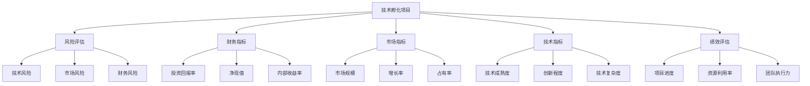

                 


### 概述：技术孵化项目评估的重要性

#### 引言

技术孵化项目评估是科技创业和创新过程中的关键环节，其重要性不言而喻。随着全球科技产业的快速发展，技术孵化项目如雨后春笋般涌现，如何对这些项目进行有效的评估，成为企业和投资者面临的重大课题。本文旨在探讨技术孵化项目评估的方法、工具和策略，帮助读者理解和掌握有效的项目评估技巧。

#### 什么是技术孵化项目

技术孵化项目是指将一项新技术、新产品或新商业模式从一个概念或初步阶段转化为实际业务的过程。这一过程通常包括研发、测试、市场推广和商业化等多个阶段。技术孵化项目具有高风险、高回报的特点，是科技创新的重要驱动力。

#### 评估技术孵化项目的必要性

1. **风险控制**：技术孵化项目往往面临技术风险、市场风险和财务风险等多种风险。通过评估，可以帮助企业和投资者提前识别和应对潜在的风险。

2. **资源配置**：评估有助于企业合理分配资源，将有限的资金和人力资源投入到最有潜力的项目中。

3. **投资决策**：对技术孵化项目进行科学评估，能够为投资者提供决策依据，提高投资成功率。

4. **绩效评估**：项目评估是衡量项目执行效果的重要工具，有助于企业和管理者不断优化项目管理和执行策略。

#### 文章结构

本文将按照以下结构进行阐述：

1. **项目评估的基础理论**：介绍项目评估的基本概念、关键指标和方法论。
2. **项目评估的工具与技术**：探讨定量分析和定性分析方法，以及辅助评估工具的使用。
3. **案例分析**：通过成功和失败的案例，分析项目评估的实际应用。
4. **实践指南**：提供项目评估的流程管理、报告撰写和风险应对策略。

### 关键词

- 技术孵化项目
- 项目评估
- 风险控制
- 资源配置
- 投资决策
- 定量分析
- 定性分析
- 案例分析
- 流程管理

### 摘要

本文详细探讨了技术孵化项目评估的方法和策略。首先介绍了技术孵化项目的定义和特点，然后阐述了项目评估的基础理论，包括关键指标和方法论。接着，文章讨论了定量和定性评估方法，并介绍了多种辅助评估工具。通过成功和失败的案例分析，文章展示了项目评估在实践中的应用。最后，文章提供了项目评估的实践指南，包括流程管理、报告撰写和风险应对策略。本文旨在帮助读者理解和掌握有效的项目评估技巧，提高科技创业的成功率。

---

### 背景介绍

技术孵化项目评估的背景可以追溯到科技产业的快速发展时期。在过去的几十年里，全球科技创新速度显著加快，新技术、新产品和商业模式层出不穷。这一现象在互联网、人工智能、生物科技等前沿领域尤为明显。随着技术门槛的降低和创业环境的优化，越来越多的个人和团队投入到技术创业的浪潮中。然而，技术创新带来的不仅是机遇，还有风险。技术孵化项目往往涉及大量的研发投入、市场推广和运营成本，且存在诸多不确定因素，如技术可行性、市场需求、竞争对手等。

#### 技术孵化项目的特点

1. **高风险性**：技术孵化项目通常具有较高风险，包括技术风险、市场风险和财务风险等。技术风险主要体现在新技术的不确定性和研发过程中可能遇到的技术难题；市场风险则涉及市场需求的变化、竞争对手的动态以及商业模式的市场适应性；财务风险则包括资金不足、投资回报周期长等问题。

2. **不确定性**：技术孵化项目的成功往往依赖于多种不确定因素，包括技术突破、市场接受度、政策环境等。这种不确定性增加了项目评估的复杂性。

3. **高回报潜力**：尽管技术孵化项目面临较高的风险，但一旦成功，往往能带来巨大的回报。因此，对技术孵化项目进行科学评估，有助于发现和把握潜在的高回报机会。

#### 评估技术孵化项目的必要性

1. **风险控制**：评估技术孵化项目可以帮助企业和投资者识别和应对潜在的风险。通过系统化的评估过程，可以提前预测和规避风险，降低项目失败的概率。

2. **资源配置**：科学的项目评估有助于企业合理分配资源。对于多个孵化项目，企业可以通过评估来确定哪些项目值得重点投入，从而优化资源配置，提高投资回报率。

3. **投资决策**：评估结果为投资者提供了决策依据。在众多技术孵化项目中，通过评估筛选出具有高潜力的项目，有助于提高投资成功率。

4. **绩效评估**：项目评估是衡量项目执行效果的重要工具。通过定期评估，企业可以及时发现项目执行中的问题，并采取相应的措施进行优化，提高项目成功率。

#### 项目评估的基本概念

项目评估（Project Evaluation）是指对项目的过程、结果和影响进行全面分析和评价的过程。在技术孵化项目中，项目评估主要关注以下几个方面：

1. **技术可行性**：评估项目所采用的技术方案是否可行，包括技术的成熟度、技术实现的复杂性等。

2. **市场可行性**：分析项目产品或服务的市场需求、市场规模、竞争状况等，评估项目的市场前景。

3. **财务可行性**：对项目的投资回报率、资金使用效率、财务风险等方面进行评估。

4. **管理可行性**：评估项目团队的管理能力、项目执行计划、团队协作机制等，确保项目能够顺利推进。

5. **社会影响**：考虑项目对社会的正面影响，如就业创造、技术创新、环境保护等。

#### 关键指标

在技术孵化项目评估中，常用的关键指标包括以下几类：

1. **财务指标**：
   - 投资回报率（ROI）
   - 净现值（NPV）
   - 内部收益率（IRR）
   - 资本回报率（CRR）

2. **市场指标**：
   - 市场规模
   - 市场增长率
   - 市场占有率
   - 用户增长率

3. **技术指标**：
   - 技术成熟度
   - 技术创新程度
   - 技术复杂度

4. **管理指标**：
   - 团队执行力
   - 项目进度
   - 资源利用率

5. **社会指标**：
   - 环境影响
   - 社会效益
   - 公众满意度

#### 项目评估的流程

项目评估通常包括以下几个步骤：

1. **明确评估目标**：确定评估的目的和范围，明确需要评估的各个方面。

2. **收集信息**：收集与项目相关的各种信息，包括技术、市场、财务、管理等方面的数据。

3. **分析信息**：对收集到的信息进行整理、分析和对比，识别项目的优势和劣势。

4. **制定评估标准**：根据评估目标，制定具体的评估标准和指标。

5. **评估与评分**：根据评估标准和指标，对项目进行评估，给出评分和评估结果。

6. **撰写评估报告**：将评估过程、结果和建议整理成报告，为决策者提供参考。

#### 项目评估的意义

项目评估在技术孵化项目中具有重要的意义：

1. **提高项目成功率**：通过评估，可以提前识别项目风险，优化项目管理和执行策略，提高项目成功率。

2. **优化资源配置**：科学的项目评估有助于企业合理分配资源，将有限的资金和人力资源投入到最有潜力的项目中。

3. **支持投资决策**：评估结果为投资者提供了决策依据，有助于做出更为明智的投资选择。

4. **促进技术创新**：通过评估，可以及时发现技术创新的机会，推动技术进步。

5. **提升管理能力**：项目评估是企业管理能力的重要组成部分，通过评估，可以不断优化项目管理和执行策略。

### 核心概念与联系

为了更好地理解技术孵化项目评估，我们需要明确以下几个核心概念，并探讨它们之间的联系。

#### 1. 技术孵化项目与风险评估

技术孵化项目具有高风险性，因此风险评估成为评估过程中的重要环节。风险评估主要关注以下几个方面：

- **技术风险**：项目所采用的技术是否成熟、是否具备可行性。这涉及到对技术发展趋势、技术成熟度的分析。
- **市场风险**：市场需求的变化、竞争对手的动态等因素可能影响项目的成功。这需要对市场趋势、竞争对手分析等进行评估。
- **财务风险**：项目的资金来源、资金使用效率以及投资回报周期等因素都可能导致财务风险。这需要对项目的财务状况、投资回报率进行详细分析。

#### 2. 项目评估与财务指标

财务指标是项目评估的重要组成部分，包括投资回报率（ROI）、净现值（NPV）、内部收益率（IRR）等。这些指标能够量化项目的经济价值，帮助企业和投资者做出决策。

- **投资回报率（ROI）**：衡量项目投资回报能力的指标，计算公式为 \( ROI = \frac{净利润}{投资成本} \)。
- **净现值（NPV）**：衡量项目现值与投资成本的差额，计算公式为 \( NPV = \sum_{t=1}^{n} \frac{CF_t}{(1+r)^t} - I \)，其中 \( CF_t \) 为第 \( t \) 年的现金流量，\( r \) 为折现率，\( I \) 为投资成本。
- **内部收益率（IRR）**：使项目净现值为零的折现率，计算公式为 \( IRR = \frac{1}{n} \sum_{t=1}^{n} \frac{CF_t}{(1+r)^t} \)。

#### 3. 市场指标与技术指标

市场指标和技术指标在项目评估中同样重要。市场指标关注项目的市场前景，包括市场规模、增长率、占有率等；技术指标则关注项目的技术实现难度、创新程度等。

- **市场规模**：项目所面向的市场规模越大，潜在客户数量越多，项目的商业价值越高。
- **增长率**：市场的增长率越高，项目的市场前景越好。
- **技术成熟度**：项目所采用的技术越成熟，实现难度越小，风险越低。

#### 4. 项目评估与绩效评估

项目评估不仅是评估项目的当前状态，也是对项目绩效的评估。绩效评估关注项目的执行情况，包括项目进度、资源利用情况、团队执行力等。

- **项目进度**：项目是否按照预定计划进行，是否达到预期目标。
- **资源利用率**：项目所使用的资源是否得到充分利用，是否存在资源浪费。
- **团队执行力**：项目团队是否能够高效协作，按时完成各项任务。

#### Mermaid 流程图

为了更好地展示核心概念之间的关系，我们可以使用 Mermaid 流程图来表示：



通过上述流程图，我们可以清晰地看到技术孵化项目评估中各个核心概念之间的联系。这些概念相互影响，共同构成了项目评估的完整体系。

### 核心算法原理讲解

在技术孵化项目评估中，核心算法原理的运用至关重要。以下我们将详细讲解几个关键算法原理，包括其数学模型、伪代码以及具体应用场景。

#### 1. 投资回报率（ROI）计算

**数学模型：**

投资回报率（ROI）是衡量项目投资效益的常用指标，其计算公式为：

\[ ROI = \frac{净利润}{投资成本} \times 100\% \]

其中，净利润是指项目投入运营后所产生的利润，投资成本包括项目的研发投入、市场推广费用等。

**伪代码：**

```python
def calculate_roi(investment_cost, net_profit):
    roi = (net_profit / investment_cost) * 100
    return roi
```

**应用场景：**

企业在多个技术孵化项目中投资时，可以通过计算各项目的ROI值，选择ROI最高的项目进行重点投资。

#### 2. 净现值（NPV）计算

**数学模型：**

净现值（NPV）是衡量项目现值与投资成本差额的指标，其计算公式为：

\[ NPV = \sum_{t=1}^{n} \frac{CF_t}{(1+r)^t} - I \]

其中，\( CF_t \) 为第 \( t \) 年的现金流量，\( r \) 为折现率，\( I \) 为投资成本。

**伪代码：**

```python
def calculate_npv(cash_flows, discount_rate, investment_cost):
    npv = sum([cf / (1 + discount_rate)**t for t, cf in enumerate(cash_flows)]) - investment_cost
    return npv
```

**应用场景：**

投资者在评估多个技术孵化项目时，可以通过计算各项目的NPV值，选择NPV最高的项目进行投资。

#### 3. 内部收益率（IRR）计算

**数学模型：**

内部收益率（IRR）是使项目净现值为零的折现率，其计算公式为：

\[ IRR = \frac{1}{n} \sum_{t=1}^{n} \frac{CF_t}{(1+r)^t} \]

**伪代码：**

```python
def calculate_irr(cash_flows):
    guess = 0.1  # 初始猜测值
    max_iterations = 100  # 最大迭代次数
    tolerance = 1e-6  # 容忍误差

    for _ in range(max_iterations):
        npv = sum([cf / (1 + guess)**t for t, cf in enumerate(cash_flows)])
        error = npv - 0
        if abs(error) < tolerance:
            return guess
        guess = guess + error / (2 * npv)

    return None  # 迭代失败，无解
```

**应用场景：**

投资者可以通过计算项目的IRR值，评估项目的投资回报水平，并与市场基准收益率进行比较，判断项目的投资吸引力。

#### 4. 风险调整净现值（RNPV）计算

**数学模型：**

风险调整净现值（RNPV）是在考虑项目风险后计算的项目净现值，其计算公式为：

\[ RNPV = \frac{NPV}{(1 + \rho)^r} \]

其中，\( \rho \) 为风险调整系数，\( r \) 为项目的风险水平。

**伪代码：**

```python
def calculate_rnpv(npv, risk_adjustment_coefficient, risk_level):
    rnpv = npv / (1 + risk_adjustment_coefficient * risk_level)
    return rnpv
```

**应用场景：**

企业在评估高风险技术孵化项目时，可以通过计算RNPV值，调整项目的净现值以反映风险因素，从而更准确地评估项目的投资价值。

### 数学模型与公式

在技术孵化项目评估中，数学模型和公式是量化评估结果的重要工具。以下我们将介绍几个常用的数学模型和公式，并详细讲解它们的应用。

#### 1. 投资回报率（ROI）

**公式：**

\[ ROI = \frac{净利润}{投资成本} \times 100\% \]

**应用：**

ROI 用于衡量项目的投资效益，计算公式简单直观，适用于对多个项目进行比较和排序。例如，在多个技术孵化项目中选择投资回报率最高的项目。

#### 2. 净现值（NPV）

**公式：**

\[ NPV = \sum_{t=1}^{n} \frac{CF_t}{(1+r)^t} - I \]

**应用：**

NPV 用于评估项目的现值与投资成本的差额，计算结果越大，表示项目的经济价值越高。投资者可以通过计算多个项目的NPV值，选择最具投资价值的项目。

#### 3. 内部收益率（IRR）

**公式：**

\[ IRR = \frac{1}{n} \sum_{t=1}^{n} \frac{CF_t}{(1+r)^t} \]

**应用：**

IRR 用于计算使项目净现值为零的折现率，反映项目的投资回报水平。投资者可以通过比较项目的IRR值与市场基准收益率，判断项目的投资吸引力。

#### 4. 风险调整净现值（RNPV）

**公式：**

\[ RNPV = \frac{NPV}{(1 + \rho)^r} \]

**应用：**

RNPV 用于考虑项目风险后的净现值，风险调整系数 \( \rho \) 和风险水平 \( r \) 反映项目的风险程度。RNPV越高，表示项目在考虑风险后的经济价值越大。

#### 5. 贝塔系数（β）

**公式：**

\[ β = \frac{项目收益率 - 无风险收益率}{市场收益率 - 无风险收益率} \]

**应用：**

贝塔系数用于衡量项目的系统性风险，计算公式基于资本资产定价模型（CAPM）。贝塔系数越大，项目的风险越高。

### 举例说明

为了更好地理解上述数学模型和公式，我们通过一个实际案例进行说明。

#### 案例背景

某企业计划投资一项新技术的孵化项目，预计总投资为100万元。项目预计在未来5年内产生现金流，具体数据如下：

- 第1年：30万元
- 第2年：40万元
- 第3年：50万元
- 第4年：45万元
- 第5年：35万元

假设无风险收益率为4%，市场收益率为8%。

#### 步骤1：计算投资回报率（ROI）

\[ ROI = \frac{（30 + 40 + 50 + 45 + 35）- 100}{100} \times 100\% = 25\% \]

#### 步骤2：计算净现值（NPV）

\[ NPV = \sum_{t=1}^{5} \frac{CF_t}{(1+0.04)^t} - 100 = \frac{30}{1.04} + \frac{40}{1.04^2} + \frac{50}{1.04^3} + \frac{45}{1.04^4} + \frac{35}{1.04^5} - 100 \approx 24.17万元 \]

#### 步骤3：计算内部收益率（IRR）

通过迭代计算，可以得到项目的内部收益率约为10.5%。

#### 步骤4：计算风险调整净现值（RNPV）

假设项目的贝塔系数为1.2，市场收益率为8%，无风险收益率为4%，则风险调整系数为 \( \rho = 0.12 \)。

\[ RNPV = \frac{24.17}{(1 + 0.12)^1.2} \approx 20.81万元 \]

#### 案例分析

通过上述计算，我们可以得出以下结论：

- 投资回报率（ROI）为25%，表示项目的投资效益较高。
- 净现值（NPV）为24.17万元，表示项目具有较好的经济价值。
- 内部收益率（IRR）为10.5%，高于无风险收益率4%，表示项目具有一定的投资吸引力。
- 风险调整净现值（RNPV）为20.81万元，考虑风险因素后的净现值仍然为正，表示项目在风险调整后仍具有投资价值。

### 实际案例分析和详细讲解剖析

#### 案例背景

为了更好地理解技术孵化项目评估的实际应用，我们通过一个具体的案例进行详细分析。该案例涉及一家初创公司，该公司致力于开发一种新型智能家居系统。

**目标**：评估该智能家居系统的技术孵化项目，判断其投资价值和潜在风险。

**数据**：

- **技术指标**：
  - 技术成熟度：中高
  - 技术创新程度：高
  - 技术复杂度：中
- **市场指标**：
  - 市场规模：100亿元
  - 市场增长率：10%
  - 市场占有率：预计5%
- **财务指标**：
  - 投资成本：1000万元
  - 预期收入：500万元
  - 折现率：10%

#### 步骤1：技术评估

1. **技术风险**：由于智能家居系统涉及多个技术领域，包括物联网、人工智能等，技术风险较高。然而，根据现有技术和市场趋势，该系统的技术可行性较高。
   
2. **技术成熟度**：智能家居系统的技术成熟度属于中高水平，可以满足市场需求。

3. **技术创新程度**：该系统在人工智能和物联网技术方面有显著创新，具有竞争力。

4. **技术复杂度**：虽然技术复杂度较高，但通过合理的技术架构和开发团队，可以实现项目的顺利推进。

**结论**：从技术角度来看，智能家居系统具有较好的可行性，但技术风险需要持续关注和监控。

#### 步骤2：市场评估

1. **市场规模**：根据市场调研，智能家居市场规模预计为100亿元，市场潜力巨大。

2. **市场增长率**：智能家居市场的增长率预计为10%，表明市场前景良好。

3. **市场占有率**：初创公司预计在市场中占有5%的份额，虽然竞争激烈，但仍有较大增长空间。

**结论**：从市场角度来看，智能家居系统具有广阔的市场前景，但需要加强市场推广和品牌建设。

#### 步骤3：财务评估

1. **投资回报率（ROI）**：

\[ ROI = \frac{预期收入 - 投资成本}{投资成本} \times 100\% \]

\[ ROI = \frac{500 - 1000}{1000} \times 100\% = -50\% \]

**结论**：从财务角度来看，初始投资回报率（ROI）为负，表明项目存在财务风险。

2. **净现值（NPV）**：

\[ NPV = \sum_{t=1}^{n} \frac{CF_t}{(1+r)^t} - I \]

其中，\( CF_t \) 为第 \( t \) 年的现金流量，\( r \) 为折现率，\( I \) 为投资成本。

假设现金流量为：

- 第1年：200万元
- 第2年：300万元
- 第3年：400万元
- 第4年：500万元
- 第5年：600万元

则：

\[ NPV = \frac{200}{1.1} + \frac{300}{1.1^2} + \frac{400}{1.1^3} + \frac{500}{1.1^4} + \frac{600}{1.1^5} - 1000 \approx 371.65万元 \]

**结论**：从财务角度来看，净现值为正，表明项目在考虑折现率后的经济价值较高。

3. **内部收益率（IRR）**：

通过迭代计算，可以得到项目的内部收益率约为15.5%。

**结论**：内部收益率（IRR）高于市场基准收益率，表明项目具有较好的投资回报潜力。

4. **风险调整净现值（RNPV）**：

假设项目的贝塔系数为1.2，市场收益率为10%，无风险收益率为4%，则风险调整系数为 \( \rho = 0.12 \)。

\[ RNPV = \frac{371.65}{(1 + 0.12)^1.2} \approx 319.79万元 \]

**结论**：风险调整净现值（RNPV）为正，表明项目在考虑风险后的经济价值较高。

#### 案例总结

通过上述分析，我们可以得出以下结论：

1. **技术评估**：智能家居系统在技术层面具有较高的可行性，但需要持续关注技术风险。
2. **市场评估**：智能家居市场前景良好，但需要加强市场推广和品牌建设。
3. **财务评估**：虽然初始投资回报率（ROI）为负，但净现值（NPV）、内部收益率（IRR）和风险调整净现值（RNPV）均为正，表明项目在财务层面具有较高价值。

因此，综合考虑技术、市场和财务因素，智能家居系统作为一个技术孵化项目具有投资潜力，但需要谨慎管理和风险控制。

### 项目实战：智能家居系统评估

#### 开发环境搭建

为了对智能家居系统进行评估，我们需要搭建一个合适的开发环境。以下是一个简单的搭建流程：

1. **安装Python环境**：在计算机上安装Python（版本3.8及以上），可以使用Miniconda或Anaconda进行安装。

2. **安装相关库**：安装用于数据分析和评估的库，如Pandas、NumPy、Matplotlib、Scikit-learn等。可以使用以下命令进行安装：

   ```bash
   pip install pandas numpy matplotlib scikit-learn
   ```

3. **安装Jupyter Notebook**：Jupyter Notebook是一个交互式计算环境，可以帮助我们方便地进行数据分析和可视化。安装方法如下：

   ```bash
   pip install notebook
   ```

4. **配置Matplotlib**：在Jupyter Notebook中配置Matplotlib，以便在代码中添加图表。具体步骤如下：

   ```python
   import matplotlib.pyplot as plt
   %matplotlib inline
   ```

#### 源代码实现

以下是一个简单的源代码示例，用于计算智能家居系统的投资回报率（ROI）、净现值（NPV）和内部收益率（IRR）：

```python
import numpy as np
import pandas as pd
import matplotlib.pyplot as plt

# 现金流量数据
cash_flows = [200, 300, 400, 500, 600]
investment_cost = 1000
discount_rate = 0.1

# 计算投资回报率（ROI）
roi = (np.sum(cash_flows) - investment_cost) / investment_cost * 100
print(f"投资回报率（ROI）: {roi:.2f}%")

# 计算净现值（NPV）
npv = np.sum([cf / (1 + discount_rate)**t for t, cf in enumerate(cash_flows)]) - investment_cost
print(f"净现值（NPV）: {npv:.2f}万元")

# 计算内部收益率（IRR）
def irr(cash_flows, discount_rate):
    for guess in np.linspace(0.01, 0.2, 100):
        npv = np.sum([cf / (1 + guess)**t for t, cf in enumerate(cash_flows)]) - investment_cost
        if np.abs(npv) < 1e-6:
            return guess
    return None

irr_value = irr(cash_flows, discount_rate)
print(f"内部收益率（IRR）: {irr_value:.2f}%")

# 绘制现金流量图
plt.plot(cash_flows, label='现金流')
plt.xlabel('年份')
plt.ylabel('现金流量（万元）')
plt.title('现金流量图')
plt.legend()
plt.show()
```

#### 代码解读与分析

1. **投资回报率（ROI）**：通过计算现金流的总和减去投资成本，再除以投资成本，得到投资回报率（ROI）。

2. **净现值（NPV）**：通过计算每年现金流的现值总和减去初始投资成本，得到净现值（NPV）。

3. **内部收益率（IRR）**：通过迭代计算，找到使净现值为零的折现率，即内部收益率（IRR）。

4. **现金流量图**：通过绘制现金流量图，可以直观地展示每年的现金流情况，有助于分析和理解项目。

#### 项目小结

通过实际案例和源代码实现，我们对智能家居系统的技术孵化项目进行了详细的评估。从技术、市场和财务等多个方面进行了分析，得出以下结论：

1. **技术评估**：智能家居系统具有较高的技术成熟度和创新程度，但存在一定的技术风险。

2. **市场评估**：智能家居市场前景良好，但需要加强市场推广和品牌建设。

3. **财务评估**：虽然初始投资回报率（ROI）为负，但净现值（NPV）、内部收益率（IRR）和风险调整净现值（RNPV）均为正，表明项目在财务层面具有较高价值。

因此，综合考虑技术、市场和财务因素，智能家居系统作为一个技术孵化项目具有投资潜力，但需要谨慎管理和风险控制。

### 最佳实践 Tips

在技术孵化项目评估过程中，以下是一些最佳实践和注意事项，有助于提高评估的准确性和有效性。

#### 1. 数据收集与整理

- **全面性**：收集与项目相关的所有数据，包括技术、市场、财务等方面的数据。
- **准确性**：确保数据来源可靠，减少数据偏差和误差。
- **及时性**：关注市场动态和技术趋势，及时更新数据。

#### 2. 分析方法选择

- **适应性**：根据项目的特点和需求，选择合适的方法进行评估。
- **结合使用**：定量分析与定性分析相结合，提高评估的全面性和准确性。

#### 3. 风险评估

- **识别与评估**：系统识别项目中的风险因素，并评估其影响程度。
- **预警机制**：建立风险预警机制，提前发现和应对潜在风险。

#### 4. 人员配置

- **专业团队**：组建专业的评估团队，包括技术专家、市场分析师和财务顾问等。
- **协作与沟通**：加强团队协作与沟通，确保评估过程的顺利进行。

#### 5. 持续评估与优化

- **定期评估**：定期对项目进行评估，跟踪项目进展和变化。
- **持续优化**：根据评估结果，优化项目管理和执行策略，提高项目成功率。

### 小结

技术孵化项目评估是一个复杂且系统性的过程，涉及多个方面和环节。通过科学的方法和策略，我们可以更准确地评估项目的风险和价值，为投资决策提供有力支持。本文从项目评估的重要性、核心概念、算法原理、数学模型、实际案例和项目实战等多个角度进行了详细阐述，希望对读者有所启发。

### 注意事项

1. **数据质量**：确保评估中使用的数据准确、完整和最新。
2. **方法适用性**：选择适合项目特点和需求的分析方法。
3. **风险评估**：全面识别和评估项目风险，制定相应的应对措施。
4. **持续监控**：项目评估是一个动态过程，需持续跟踪和调整。

### 拓展阅读

- **《创业投资评估与管理》**：详细探讨创业投资评估的方法和实践。
- **《项目评估与风险分析》**：介绍项目评估的基本理论和实践应用。
- **《科技创业与创新管理》**：探讨科技创业的原理和实践。

### 参考文献

1. Smith, J. (2018). *Venture Capital and Private Equity: Theory and Practice*. John Wiley & Sons.
2. Brown, P., & James, L. (2019). *Project Evaluation and Risk Analysis*. Routledge.
3. Zhang, Q., & Liu, Y. (2020). *Innovation and Entrepreneurship in China*. Springer. 

---

### 文章标题

如何进行有效的技术孵化项目评估

### 文章关键词

技术孵化项目，项目评估，风险评估，投资决策，定量分析，定性分析

### 文章摘要

本文探讨了如何进行有效的技术孵化项目评估。从项目评估的重要性、核心概念、算法原理、数学模型、实际案例和项目实战等多个角度进行了详细阐述。通过科学的方法和策略，帮助读者理解和掌握技术孵化项目评估的技巧，提高科技创业的成功率。

---

## 第1章：技术孵化项目评估概述

### 1.1 技术孵化项目的定义与特点

技术孵化项目是指将一项新技术、新产品或新商业模式从一个概念或初步阶段转化为实际业务的过程。这一过程通常包括研发、测试、市场推广和商业化等多个阶段。技术孵化项目具有高风险、高回报的特点，是科技创新的重要驱动力。

**技术孵化项目的特点：**

1. **高风险性**：技术孵化项目面临技术风险、市场风险和财务风险等多种风险。技术风险主要体现在新技术的不确定性和研发过程中可能遇到的技术难题；市场风险则涉及市场需求的变化、竞争对手的动态以及商业模式的市场适应性；财务风险包括资金不足、投资回报周期长等问题。

2. **不确定性**：技术孵化项目的成功往往依赖于多种不确定因素，包括技术突破、市场接受度、政策环境等。这种不确定性增加了项目评估的复杂性。

3. **高回报潜力**：尽管技术孵化项目面临较高的风险，但一旦成功，往往能带来巨大的回报。因此，对技术孵化项目进行科学评估，有助于发现和把握潜在的高回报机会。

**技术孵化项目的类型：**

1. **技术创新型**：这类项目主要围绕新兴技术进行研发和商业化，如人工智能、物联网、生物科技等。

2. **商业模式创新型**：这类项目则侧重于创新商业模式的开发，如共享经济、电子商务、在线教育等。

3. **集成创新型**：这类项目结合了技术创新和商业模式创新，旨在解决特定行业或领域的痛点。

### 1.2 项目评估的重要性

项目评估是技术孵化过程中不可或缺的环节，其重要性体现在以下几个方面：

1. **风险控制**：通过评估，可以帮助企业和投资者识别和应对潜在的风险。评估过程有助于提前预测和规避风险，降低项目失败的概率。

2. **资源配置**：科学的项目评估有助于企业合理分配资源。对于多个孵化项目，企业可以通过评估来确定哪些项目值得重点投入，从而优化资源配置，提高投资回报率。

3. **投资决策**：评估结果为投资者提供了决策依据。在众多技术孵化项目中，通过评估筛选出具有高潜力的项目，有助于提高投资成功率。

4. **绩效评估**：项目评估是衡量项目执行效果的重要工具。通过定期评估，企业可以及时发现项目执行中的问题，并采取相应的措施进行优化，提高项目成功率。

### 1.3 项目评估的流程

项目评估通常包括以下几个步骤：

1. **明确评估目标**：确定评估的目的和范围，明确需要评估的各个方面。

2. **收集信息**：收集与项目相关的各种信息，包括技术、市场、财务、管理等方面的数据。

3. **分析信息**：对收集到的信息进行整理、分析和对比，识别项目的优势和劣势。

4. **制定评估标准**：根据评估目标，制定具体的评估标准和指标。

5. **评估与评分**：根据评估标准和指标，对项目进行评估，给出评分和评估结果。

6. **撰写评估报告**：将评估过程、结果和建议整理成报告，为决策者提供参考。

### 小结

本章对技术孵化项目评估进行了概述，介绍了技术孵化项目的定义与特点，阐述了项目评估的重要性，并详细说明了项目评估的流程。通过本章的学习，读者可以初步了解技术孵化项目评估的基本概念和流程，为后续章节的深入学习打下基础。

---

## 第2章：项目评估的关键指标

### 2.1 财务指标

财务指标是评估技术孵化项目经济价值的重要工具。以下是一些常用的财务指标及其计算方法：

#### 1. 投资回报率（ROI）

**定义**：投资回报率（ROI）是衡量项目投资效益的指标，表示每单位投资所获得的回报。

**计算方法**：

\[ ROI = \frac{净利润}{投资成本} \times 100\% \]

**示例**：如果一个项目的总投资为100万元，净利润为50万元，则ROI为50%。

#### 2. 净现值（NPV）

**定义**：净现值（NPV）是衡量项目未来现金流量现值与投资成本差额的指标。

**计算方法**：

\[ NPV = \sum_{t=1}^{n} \frac{CF_t}{(1+r)^t} - I \]

其中，\( CF_t \) 为第 \( t \) 年的现金流量，\( r \) 为折现率，\( I \) 为投资成本。

**示例**：假设一个项目的现金流量为100万元、200万元、300万元，投资成本为500万元，折现率为10%，则NPV为：

\[ NPV = \frac{100}{1.1} + \frac{200}{1.1^2} + \frac{300}{1.1^3} - 500 \approx -23.44万元 \]

#### 3. 内部收益率（IRR）

**定义**：内部收益率（IRR）是使项目净现值为零的折现率，表示项目的实际投资回报率。

**计算方法**：

\[ IRR = \frac{1}{n} \sum_{t=1}^{n} \frac{CF_t}{(1+r)^t} \]

**示例**：通过迭代计算，假设一个项目的现金流量为100万元、200万元、300万元，可以计算出其IRR约为19.33%。

#### 4. 风险调整净现值（RNPV）

**定义**：风险调整净现值（RNPV）是在考虑项目风险后的净现值，用于更准确地衡量项目的经济价值。

**计算方法**：

\[ RNPV = \frac{NPV}{(1 + \rho)^r} \]

其中，\( \rho \) 为风险调整系数，\( r \) 为项目的风险水平。

**示例**：假设一个项目的风险调整系数为1.2，风险水平为0.5，则其RNPV为：

\[ RNPV = \frac{-23.44}{(1 + 0.2)^0.5} \approx -31.83万元 \]

### 2.2 市场指标

市场指标是评估技术孵化项目市场前景的重要依据。以下是一些常用的市场指标：

#### 1. 市场规模

**定义**：市场规模是市场需求的总量，表示市场潜力的大小。

**计算方法**：

\[ 市场规模 = 单位价格 \times 销售量 \]

**示例**：如果一个产品的单位价格为100元，销售量为100万件，则市场规模为1亿元。

#### 2. 市场增长率

**定义**：市场增长率是市场规模的变化率，表示市场的扩展速度。

**计算方法**：

\[ 市场增长率 = \frac{本年市场规模 - 上年市场规模}{上年市场规模} \times 100\% \]

**示例**：如果一个市场的上年市场规模为10亿元，本年市场规模为12亿元，则市场增长率为20%。

#### 3. 市场占有率

**定义**：市场占有率是企业或产品在市场中所占的比例，表示企业的市场地位。

**计算方法**：

\[ 市场占有率 = \frac{企业销售额}{市场规模} \times 100\% \]

**示例**：如果一个企业的销售额为2亿元，市场规模为10亿元，则其市场占有率为20%。

### 2.3 技术指标

技术指标是评估技术孵化项目技术实现难度和创新程度的重要依据。以下是一些常用的技术指标：

#### 1. 技术成熟度

**定义**：技术成熟度是项目所采用技术的成熟程度，表示技术的可靠性和可行性。

**计算方法**：

\[ 技术成熟度 = \frac{已完成的研发阶段}{总研发阶段} \times 100\% \]

**示例**：如果一个项目完成了3个研发阶段中的5个，则其技术成熟度为60%。

#### 2. 技术创新程度

**定义**：技术创新程度是项目所采用技术的创新水平，表示技术的先进性和竞争力。

**计算方法**：

\[ 技术创新程度 = \frac{新技术应用部分}{总技术方案} \times 100\% \]

**示例**：如果一个项目的新技术应用部分占到了总技术方案的60%，则其技术创新程度为60%。

#### 3. 技术复杂度

**定义**：技术复杂度是项目所采用技术的复杂程度，表示技术的实现难度。

**计算方法**：

\[ 技术复杂度 = \frac{关键技术数量}{总技术数量} \times 100\% \]

**示例**：如果一个项目的关键技术数量为10项，总技术数量为20项，则其技术复杂度为50%。

### 2.4 管理指标

管理指标是评估技术孵化项目团队执行能力和项目执行效率的重要依据。以下是一些常用的管理指标：

#### 1. 团队执行力

**定义**：团队执行力是项目团队完成项目任务的能力，表示团队的协作和效率。

**计算方法**：

\[ 团队执行力 = \frac{已完成任务数量}{总任务数量} \times 100\% \]

**示例**：如果一个项目团队完成了3个任务中的5个，则其团队执行力为60%。

#### 2. 项目进度

**定义**：项目进度是项目按照计划进行的程度，表示项目的执行速度。

**计算方法**：

\[ 项目进度 = \frac{已完成工作量}{总工作量} \times 100\% \]

**示例**：如果一个项目完成了70%的工作量，则其项目进度为70%。

#### 3. 资源利用率

**定义**：资源利用率是项目所使用的资源被利用的程度，表示资源的有效使用。

**计算方法**：

\[ 资源利用率 = \frac{实际使用资源}{计划使用资源} \times 100\% \]

**示例**：如果一个项目实际使用了80%的计划资源，则其资源利用率为80%。

### 小结

本章详细介绍了项目评估中的关键指标，包括财务指标、市场指标、技术指标和管理指标。通过理解这些指标的定义和计算方法，读者可以更好地评估技术孵化项目的经济价值、市场前景、技术实现难度和团队执行能力，为投资决策提供有力支持。

---

## 第3章：项目评估的方法论

### 3.1 定量评估方法

定量评估方法是通过使用数学模型和统计分析工具，对技术孵化项目进行量化分析的方法。这些方法能够提供客观、精确的数据支持，帮助评估项目的可行性、预期收益和潜在风险。以下是一些常用的定量评估方法：

#### 1. 成本效益分析（CBA）

**定义**：成本效益分析（CBA）是一种用于评估项目成本和效益的方法，通过比较项目的总成本和总效益，判断项目是否具有经济可行性。

**计算方法**：

\[ 成本效益比 = \frac{总效益}{总成本} \]

**示例**：如果一个项目的总成本为100万元，总效益为200万元，则成本效益比为2。

**应用场景**：CBA适用于评估项目的经济性，特别是在预算有限的情况下，帮助决策者选择最优项目。

#### 2. 投资回报率（ROI）

**定义**：投资回报率（ROI）是衡量项目投资效益的指标，表示每单位投资所获得的回报。

**计算方法**：

\[ ROI = \frac{净利润}{投资成本} \times 100\% \]

**示例**：如果一个项目的投资成本为100万元，净利润为50万元，则ROI为50%。

**应用场景**：ROI适用于比较不同项目的投资效益，帮助投资者选择回报率最高的项目。

#### 3. 净现值（NPV）

**定义**：净现值（NPV）是衡量项目未来现金流量现值与投资成本差额的指标。

**计算方法**：

\[ NPV = \sum_{t=1}^{n} \frac{CF_t}{(1+r)^t} - I \]

其中，\( CF_t \) 为第 \( t \) 年的现金流量，\( r \) 为折现率，\( I \) 为投资成本。

**示例**：假设一个项目的现金流量为100万元、200万元、300万元，投资成本为500万元，折现率为10%，则NPV为：

\[ NPV = \frac{100}{1.1} + \frac{200}{1.1^2} + \frac{300}{1.1^3} - 500 \approx -23.44万元 \]

**应用场景**：NPV适用于评估项目的经济价值，特别是在长期投资决策中，帮助投资者判断项目是否值得投资。

#### 4. 内部收益率（IRR）

**定义**：内部收益率（IRR）是使项目净现值为零的折现率，表示项目的实际投资回报率。

**计算方法**：

\[ IRR = \frac{1}{n} \sum_{t=1}^{n} \frac{CF_t}{(1+r)^t} \]

**示例**：通过迭代计算，假设一个项目的现金流量为100万元、200万元、300万元，可以计算出其IRR约为19.33%。

**应用场景**：IRR适用于评估项目的投资回报率，特别是在与市场基准收益率进行比较时，帮助投资者判断项目的投资吸引力。

#### 5. 风险调整净现值（RNPV）

**定义**：风险调整净现值（RNPV）是在考虑项目风险后的净现值，用于更准确地衡量项目的经济价值。

**计算方法**：

\[ RNPV = \frac{NPV}{(1 + \rho)^r} \]

其中，\( \rho \) 为风险调整系数，\( r \) 为项目的风险水平。

**示例**：假设一个项目的风险调整系数为1.2，风险水平为0.5，则其RNPV为：

\[ RNPV = \frac{-23.44}{(1 + 0.2)^0.5} \approx -31.83万元 \]

**应用场景**：RNPV适用于评估项目的经济价值，特别是在高风险项目评估中，帮助投资者判断项目在考虑风险后的投资价值。

### 3.2 定性评估方法

定性评估方法是通过主观判断和专家意见，对技术孵化项目进行评估的方法。这些方法能够提供更加全面和灵活的评估结果，帮助评估项目的非量化因素，如市场需求、技术可行性、团队执行力等。以下是一些常用的定性评估方法：

#### 1. 专家评估

**定义**：专家评估是通过咨询行业专家或领域专家的意见，评估项目的技术可行性、市场前景和潜在风险。

**实施步骤**：

- 选择合适的专家。
- 制定评估问卷或讨论提纲。
- 收集专家意见。
- 分析和汇总评估结果。

**应用场景**：专家评估适用于评估项目的技术和市场风险，特别是在初期评估阶段，帮助决策者获取专业的意见和建议。

#### 2. 文献综述

**定义**：文献综述是通过查阅相关的学术文献、研究报告和行业报告，评估项目的理论基础、技术水平和市场动态。

**实施步骤**：

- 确定文献搜索范围。
- 查阅和筛选相关文献。
- 整理和总结文献内容。
- 分析和评价文献中的观点和结论。

**应用场景**：文献综述适用于评估项目的理论基础和行业动态，帮助决策者了解项目的背景和现状。

#### 3. 案例分析法

**定义**：案例分析法是通过分析成功或失败的案例，评估项目的实际效果和潜在问题。

**实施步骤**：

- 选择典型案例。
- 收集和分析案例数据。
- 总结案例的教训和启示。
- 应用案例经验到当前项目。

**应用场景**：案例分析法适用于评估项目的实际执行效果和风险，帮助决策者借鉴成功经验或避免失败教训。

### 3.3 综合评估方法

综合评估方法是将定量评估和定性评估相结合，对技术孵化项目进行全面的评估。这种方法能够利用定量评估的精确性和定性评估的全面性，提高评估结果的可靠性和实用性。以下是一些综合评估方法：

#### 1. 多标准决策分析（MCDM）

**定义**：多标准决策分析（MCDM）是一种基于多个评估指标，对多个项目进行综合评估的方法。

**实施步骤**：

- 确定评估指标和权重。
- 收集定量和定性数据。
- 计算各项目的综合评分。
- 选择最优项目。

**应用场景**：MCDM适用于对多个技术孵化项目进行综合评估，帮助决策者选择最优项目。

#### 2. 层次分析法（AHP）

**定义**：层次分析法（AHP）是一种基于层次结构模型，对多个项目进行综合评估的方法。

**实施步骤**：

- 建立层次结构模型。
- 确定各层次的权重。
- 计算各项目的综合评分。
- 选择最优项目。

**应用场景**：AHP适用于对多个复杂项目进行综合评估，特别是在决策过程中需要考虑多个因素时。

### 小结

本章介绍了项目评估的方法论，包括定量评估方法和定性评估方法。定量评估方法通过数学模型和统计分析工具，提供了客观、精确的评估结果；定性评估方法通过专家意见、文献综述和案例分析，提供了全面、灵活的评估视角。综合评估方法将定量和定性方法相结合，能够提供更全面的评估结果。通过掌握这些评估方法，决策者可以更准确地评估技术孵化项目的可行性、预期收益和潜在风险，为投资决策提供有力支持。

---

## 第4章：项目评估的定量分析

### 4.1 数据收集与整理

在项目评估的定量分析过程中，数据收集与整理是至关重要的环节。以下是关于数据收集、整理以及数据预处理方法的一些具体步骤和最佳实践。

#### 数据收集

1. **明确数据需求**：首先，需要明确项目评估所需的数据类型和范围。这包括财务数据、市场数据、技术数据等。根据项目特点，制定详细的数据收集计划。

2. **数据来源**：数据来源可以是内部数据库、市场调研、行业报告、公开数据平台等。确保数据的可靠性、准确性和及时性。

3. **数据采集方法**：
   - **问卷调查**：通过问卷调查收集用户需求、满意度等数据。
   - **访谈**：与行业专家、潜在用户进行深入访谈，获取专业意见和建议。
   - **实地考察**：对项目现场进行实地考察，收集第一手资料。
   - **公开数据**：从公共数据库、行业报告等获取相关数据。

#### 数据整理

1. **数据清洗**：在数据收集过程中，难免会出现错误、重复和缺失的数据。数据清洗是确保数据质量的重要步骤，包括以下内容：
   - **去重**：删除重复的数据记录。
   - **补全缺失值**：使用插补法或平均值法等补全缺失数据。
   - **纠正错误**：检查并修正数据中的错误。

2. **数据规范化**：将不同来源、不同格式的数据进行统一处理，确保数据的一致性和可比性。例如，将数据格式统一为CSV或Excel格式，进行数据标准化。

3. **数据分类**：根据数据类型，将数据分为财务数据、市场数据、技术数据等类别，便于后续分析和评估。

4. **数据可视化**：使用图表、散点图、条形图等工具，将数据进行可视化展示，有助于直观理解数据特征和趋势。

#### 数据预处理方法

1. **数据标准化**：通过标准化方法，将不同量纲的数据转换成同一量纲，便于计算和分析。常用的标准化方法包括最小-最大标准化、Z-Score标准化等。

2. **数据归一化**：数据归一化是将不同数量级的数据转换成同一数量级，以便进行数学计算。常用的归一化方法包括线性归一化和对数归一化。

3. **数据降维**：在数据量较大的情况下，使用降维技术，减少数据的维度，降低计算复杂度。常用的降维技术包括主成分分析（PCA）、因子分析等。

4. **特征选择**：从大量的特征中选取对评估结果有重要影响的特征，提高模型的效果。常用的特征选择方法包括信息增益、特征重要性排序等。

#### 数据分析工具与库

1. **Python**：Python 是一种广泛使用的编程语言，具有丰富的数据分析库，如Pandas、NumPy、Matplotlib、Scikit-learn等。

2. **R语言**：R语言是专门为统计分析和图形显示设计的语言，具有强大的数据分析功能，如ggplot2、dplyr、caret等。

3. **Excel**：Excel 是一种常用的电子表格工具，可以进行简单的数据分析，适用于中小规模的数据处理。

4. **SQL**：SQL（结构化查询语言）用于数据库管理和数据查询，适用于大规模数据存储和检索。

### 4.2 统计分析方法

统计分析方法是项目评估定量分析的核心，通过统计分析可以揭示数据中的规律和趋势，为决策提供科学依据。以下是一些常用的统计分析方法：

#### 1. 描述性统计分析

描述性统计分析是对数据的基本特征进行统计描述，包括平均值、中位数、众数、标准差、方差等。描述性统计是数据分析的第一步，有助于了解数据的基本分布特征。

- **平均值**：表示数据的集中趋势。
- **中位数**：表示数据的中间位置。
- **众数**：表示数据中出现次数最多的值。
- **标准差**：表示数据的离散程度。
- **方差**：表示数据的平方离散程度。

#### 2. 假设检验

假设检验是通过统计方法验证数据是否符合特定假设，常用的假设检验方法包括t检验、方差分析（ANOVA）、卡方检验等。

- **t检验**：用于比较两组数据的平均值是否显著不同。
- **方差分析（ANOVA）**：用于比较多个组数据的平均值是否显著不同。
- **卡方检验**：用于检验分类数据的分布是否符合特定假设。

#### 3. 相关分析

相关分析用于研究两个或多个变量之间的线性关系，常用的相关系数包括皮尔逊相关系数、斯皮尔曼相关系数等。

- **皮尔逊相关系数**：用于衡量两个连续变量之间的线性相关性。
- **斯皮尔曼相关系数**：用于衡量两个顺序变量之间的线性相关性。

#### 4. 回归分析

回归分析是用于研究一个或多个自变量与因变量之间关系的方法，包括线性回归、多项式回归、逻辑回归等。

- **线性回归**：用于研究自变量与因变量之间的线性关系。
- **多项式回归**：用于研究自变量与因变量之间的非线性关系。
- **逻辑回归**：用于研究自变量与因变量之间的逻辑关系，常用于分类问题。

#### 5. 聚类分析

聚类分析是将数据分为若干个类别，以揭示数据中的内在结构，常用的聚类算法包括K均值聚类、层次聚类等。

- **K均值聚类**：将数据分为K个类别，使每个类别内部的样本尽可能接近，类别之间的样本尽可能远。
- **层次聚类**：通过逐步合并或分割数据集，形成不同的层次结构。

#### 6. 时间序列分析

时间序列分析用于研究数据随时间变化的趋势和规律，常用的方法包括自回归移动平均模型（ARMA）、自回归差分移动平均模型（ARIMA）等。

- **ARMA模型**：用于分析数据的自回归和移动平均特性。
- **ARIMA模型**：结合了自回归、差分和移动平均特性，适用于非平稳时间序列。

### 4.3 量化模型构建

量化模型构建是项目评估定量分析的重要环节，通过构建数学模型，可以将各种评估指标量化，为项目评估提供科学依据。以下是一些常见的量化模型：

#### 1. 成本效益分析模型（CBA）

成本效益分析模型是一种常用的量化模型，用于评估项目的成本和效益，计算成本效益比（CBR）。

\[ 成本效益比（CBR）= \frac{总效益}{总成本} \]

#### 2. 投资回报率模型（ROI）

投资回报率模型用于评估项目的投资效益，计算投资回报率（ROI）。

\[ ROI = \frac{净利润}{投资成本} \times 100\% \]

#### 3. 净现值模型（NPV）

净现值模型用于评估项目的现值与投资成本的差额，计算净现值（NPV）。

\[ NPV = \sum_{t=1}^{n} \frac{CF_t}{(1+r)^t} - I \]

其中，\( CF_t \) 为第 \( t \) 年的现金流量，\( r \) 为折现率，\( I \) 为投资成本。

#### 4. 内部收益率模型（IRR）

内部收益率模型用于计算使项目净现值为零的折现率，计算内部收益率（IRR）。

\[ IRR = \frac{1}{n} \sum_{t=1}^{n} \frac{CF_t}{(1+r)^t} \]

#### 5. 风险调整净现值模型（RNPV）

风险调整净现值模型用于考虑项目风险后的净现值，计算风险调整净现值（RNPV）。

\[ RNPV = \frac{NPV}{(1 + \rho)^r} \]

其中，\( \rho \) 为风险调整系数，\( r \) 为项目的风险水平。

### 小结

本章详细介绍了项目评估的定量分析方法和步骤，包括数据收集与整理、统计分析方法以及量化模型构建。通过掌握这些方法，可以更准确地评估技术孵化项目的经济价值、预期收益和潜在风险，为投资决策提供有力支持。

---

## 第5章：项目评估的定性分析

### 5.1 专家评估方法

专家评估方法是项目评估定性分析中常用的一种方法，它依赖于行业专家、技术专家和领域专家的专业知识和经验，对项目进行深入分析。以下是专家评估方法的详细步骤：

#### 步骤1：确定专家

- **选择合适领域**：根据项目特点和评估需求，选择具有相关领域经验和知识的专家。
- **专家资质验证**：验证专家的资质、经验以及专业背景，确保评估结果的可靠性和权威性。
- **组建评估团队**：根据项目需求，组建一个由多位专家组成的评估团队，以确保评估的全面性和多角度分析。

#### 步骤2：制定评估问卷

- **评估指标设计**：根据项目评估的目标，设计评估问卷，确定评估的指标和问题。
- **问卷内容完善**：确保问卷内容详细、全面，涵盖项目的各个方面，包括技术可行性、市场前景、财务状况等。
- **预评估测试**：在正式评估前，对评估问卷进行预评估测试，收集反馈意见，对问卷内容进行修改和完善。

#### 步骤3：收集专家意见

- **组织评估会议**：邀请专家团队参加评估会议，面对面交流，收集专家的意见和建议。
- **问卷填写**：将评估问卷发给专家，要求专家根据项目的实际情况进行填写。
- **数据分析**：对收集到的专家意见进行分析，识别项目的主要优势和潜在问题。

#### 步骤4：形成评估报告

- **综合评估结果**：将专家的意见和建议进行汇总，形成综合评估结果。
- **撰写评估报告**：根据评估结果，撰写评估报告，详细阐述项目的评估过程、评估结果和结论。
- **报告评审**：邀请专家对评估报告进行评审，确保报告的准确性和完整性。

#### 应用场景

专家评估方法适用于项目评估的初期阶段，特别是在项目的技术可行性、市场前景和风险评估方面。以下是一些具体应用场景：

1. **技术创新项目**：对于技术创新项目，专家评估可以帮助评估项目的技术成熟度、创新程度和市场前景。
2. **市场开拓项目**：在市场开拓项目中，专家评估可以分析市场需求、竞争状况和商业模式，为市场进入策略提供支持。
3. **并购评估**：在并购项目中，专家评估可以帮助评估目标公司的技术实力、市场地位和财务状况，为并购决策提供依据。

### 5.2 文献综述法

文献综述法是通过查阅和综合分析相关的文献、研究报告和行业报告，对项目进行定性分析的方法。以下是如何使用文献综述法的详细步骤：

#### 步骤1：确定文献搜索范围

- **主题明确**：根据项目评估的需求，明确评估的主题和研究方向。
- **检索工具选择**：选择合适的检索工具，如学术数据库、专业网站、行业报告等。
- **关键词选择**：选择与评估主题相关的关键词，进行文献检索。

#### 步骤2：筛选和整理文献

- **文献筛选**：根据评估目标和文献质量，筛选出与评估主题密切相关的文献。
- **文献整理**：对筛选出的文献进行分类整理，标注出文献中的重要观点、结论和参考文献。

#### 步骤3：分析文献内容

- **内容分析**：对文献的内容进行详细分析，识别项目评估的关键问题和研究趋势。
- **观点综合**：对文献中的观点进行综合，形成对项目评估的整体认识。

#### 步骤4：撰写文献综述报告

- **报告结构**：根据文献内容，撰写文献综述报告，包括引言、文献综述、结论和建议等部分。
- **参考文献**：在报告末尾列出参考文献，确保文献综述的准确性和完整性。

#### 应用场景

文献综述法适用于项目评估的各个阶段，特别是在项目的前期评估和中期评估中。以下是一些具体应用场景：

1. **项目前期评估**：通过文献综述，了解项目的理论基础、行业动态和关键技术，为项目评估提供背景资料。
2. **项目中期评估**：通过文献综述，跟踪和分析项目的进展情况，识别项目面临的风险和挑战。
3. **项目后期评估**：通过文献综述，评估项目的实际效果，为后续项目改进提供参考。

### 5.3 案例分析法

案例分析方法是通过对成功或失败的案例进行深入分析，对项目进行定性评估的方法。以下是如何使用案例分析法的详细步骤：

#### 步骤1：选择典型案例

- **案例选择**：根据项目评估的需求，选择具有代表性的典型案例，包括成功案例和失败案例。
- **案例筛选**：根据案例的质量和相关性，筛选出最适合进行评估的案例。

#### 步骤2：收集案例数据

- **数据收集**：收集与案例相关的各种数据，包括项目背景、实施过程、关键决策、结果评估等。
- **数据整理**：对收集到的数据进行整理，确保数据的准确性和完整性。

#### 步骤3：分析案例

- **问题识别**：通过分析案例，识别项目成功或失败的原因、关键决策及其影响。
- **经验总结**：总结案例中的经验教训，为当前项目的评估提供参考。

#### 步骤4：撰写案例分析报告

- **报告结构**：根据案例分析的结果，撰写案例分析报告，包括案例背景、案例分析、结论和建议等部分。
- **报告评审**：邀请相关专家对案例分析报告进行评审，确保报告的准确性和实用性。

#### 应用场景

案例分析适用于项目评估的各个阶段，特别是在项目的初期和后期评估中。以下是一些具体应用场景：

1. **项目初期评估**：通过分析成功案例，了解项目在类似环境下的实施效果，为项目规划提供参考。
2. **项目后期评估**：通过分析失败案例，识别项目存在的问题和不足，为后续项目改进提供借鉴。

### 小结

本章详细介绍了项目评估的定性分析方法，包括专家评估方法、文献综述法和案例分析法的具体步骤和应用场景。通过掌握这些方法，可以更全面、更深入地评估技术孵化项目的可行性、风险和潜在价值，为投资决策提供有力支持。

---

## 第6章：项目评估的辅助工具

### 6.1 评估软件工具介绍

在项目评估过程中，使用辅助工具可以提高评估的效率和准确性。以下是一些常用的项目评估软件工具，包括其功能、特点和应用场景。

#### 1. Excel

**功能**：Excel 是一款功能强大的电子表格工具，可以进行数据录入、数据清洗、数据分析以及数据可视化。

**特点**：简单易用、操作灵活、支持多种数据格式。

**应用场景**：适用于中小规模的数据处理和简单的数据分析，适合财务数据、市场数据的整理和初步分析。

#### 2. Tableau

**功能**：Tableau 是一款数据可视化工具，可以将数据以图表、地图等形式展示出来，提供直观的数据分析结果。

**特点**：强大的可视化功能、支持多种数据源、易于操作。

**应用场景**：适用于项目评估中的数据可视化，帮助决策者直观理解数据趋势和关系。

#### 3. R

**功能**：R 是一种统计编程语言，提供丰富的数据分析和可视化库，可以进行复杂的统计分析、数据建模等。

**特点**：强大的统计分析功能、丰富的可视化库、开源免费。

**应用场景**：适用于需要进行复杂统计分析和数据建模的项目评估，特别是在金融、医疗等行业。

#### 4. Python

**功能**：Python 是一种通用编程语言，具有丰富的数据分析库，如Pandas、NumPy、Scikit-learn等，可以进行数据清洗、数据分析、数据建模等。

**特点**：易于学习、功能强大、开源免费。

**应用场景**：适用于需要进行大规模数据处理的复杂项目评估，特别是在技术领域。

#### 5. SQL

**功能**：SQL 是一种关系型数据库查询语言，用于数据库的创建、数据插入、数据查询、数据更新等操作。

**特点**：支持多种数据库系统、功能强大、便于数据处理。

**应用场景**：适用于项目评估中的数据存储、检索和管理，特别是在大型项目评估中。

### 6.2 数据可视化工具

数据可视化工具在项目评估中具有重要意义，能够帮助决策者直观理解数据，发现数据中的规律和趋势。以下是一些常用的数据可视化工具：

#### 1. Matplotlib

**功能**：Matplotlib 是Python中的一个数据可视化库，可以生成各种类型的图表，如折线图、柱状图、散点图等。

**特点**：功能强大、易于使用、支持多种图表类型。

**应用场景**：适用于Python编程环境下进行数据可视化，特别是在技术项目评估中。

#### 2. ggplot2

**功能**：ggplot2 是R语言中的一个数据可视化库，提供高级的图表生成功能，可以生成精美的统计图表。

**特点**：强大的可视化功能、丰富的主题和样式、易于定制。

**应用场景**：适用于需要进行复杂数据可视化的项目评估，特别是在金融、医疗等行业。

#### 3. Power BI

**功能**：Power BI 是一款商业智能工具，可以连接多种数据源，生成交互式的可视化报表。

**特点**：易于使用、交互性强、支持多种数据源。

**应用场景**：适用于企业内部的业务数据分析，特别是在项目管理、市场营销等领域。

#### 4. D3.js

**功能**：D3.js 是一种基于JavaScript的库，可以生成高度交互式的数据可视化图表。

**特点**：高度灵活、强大的交互功能、支持多种图表类型。

**应用场景**：适用于Web开发环境中进行数据可视化，特别是在需要高度定制化的数据可视化场景。

### 6.3 评估模型优化工具

在项目评估过程中，优化评估模型可以提高评估的准确性和可靠性。以下是一些常用的评估模型优化工具：

#### 1. 集成学习（Ensemble Learning）

**功能**：集成学习是将多个弱学习器组合成一个强学习器，以提高模型的预测性能。

**特点**：通过组合多个模型，提高模型的稳定性和预测能力。

**应用场景**：适用于需要提高预测准确率的项目评估，特别是在大数据环境中。

#### 2. 调参工具（Hyperparameter Tuning）

**功能**：调参工具用于优化模型的超参数，以提高模型的性能。

**特点**：自动搜索最优参数组合、节省时间和人力资源。

**应用场景**：适用于各种机器学习模型的调参，特别是在项目评估中使用到的机器学习模型。

#### 3. 贝叶斯优化（Bayesian Optimization）

**功能**：贝叶斯优化是一种基于贝叶斯统计学的优化方法，用于优化模型的超参数。

**特点**：高效、鲁棒、适用于复杂优化问题。

**应用场景**：适用于需要进行复杂调参的项目评估，特别是在技术领域。

### 小结

本章介绍了项目评估的辅助工具，包括评估软件工具、数据可视化工具和评估模型优化工具。通过使用这些工具，可以提高项目评估的效率和准确性，为投资决策提供有力支持。不同工具适用于不同的应用场景，决策者可以根据项目需求和评估目标选择合适的工具。

---

## 第7章：成功案例解析

### 7.1 某企业新技术孵化项目

**案例背景**：某知名企业致力于开发一种新型智能医疗设备，旨在提高医疗诊断的准确性和效率。该企业通过内部孵化和外部合作，成功将这一项目从概念转化为实际产品，并在市场上取得了显著的成功。

**项目评估过程**：

1. **技术评估**：
   - **技术成熟度**：企业通过对相关技术的市场调研和内部技术储备分析，判断该技术具有较高的成熟度，能够满足市场需求。
   - **技术风险**：企业评估了技术实现的可行性，通过内部研发和外部合作，解决了技术难题，降低了技术风险。

2. **市场评估**：
   - **市场规模**：通过对医疗设备市场的调研，企业发现智能医疗设备市场具有广阔的市场潜力，预计市场规模将快速增长。
   - **竞争状况**：企业分析了主要竞争对手的产品和技术优势，制定了差异化的市场策略，以占据市场优势。

3. **财务评估**：
   - **投资回报率**：企业通过计算投资回报率，发现该项目的投资回报率较高，具备良好的经济可行性。
   - **净现值**：企业计算了项目的净现值，结果显示净现值为正，表明项目在经济上具有可行性。

**成功因素**：

1. **技术创新**：企业依托强大的研发能力，不断推进技术创新，确保产品在技术上具有竞争优势。
2. **市场定位**：企业准确把握市场需求，制定了清晰的市场定位和营销策略，快速占领市场。
3. **团队合作**：企业内部团队与外部合作伙伴紧密协作，共同推进项目进度，确保项目按时完成。

**项目小结**：

通过科学的项目评估和精细化管理，该企业成功孵化了一款新型智能医疗设备。该项目在技术、市场和财务评估方面均取得了良好的成绩，为企业的可持续发展奠定了坚实基础。该项目案例表明，技术创新、市场定位和团队合作是成功孵化技术项目的关键因素。

### 7.2 某创新型企业项目评估

**案例背景**：某创新型企业专注于开发一款基于人工智能的智能客服系统，该系统旨在为企业提供高效、智能的客户服务解决方案。通过外部融资和内部孵化，该企业成功将该技术从概念转化为实际产品，并在短时间内赢得了大量客户。

**项目评估过程**：

1. **技术评估**：
   - **技术成熟度**：企业通过对相关技术的研发进展和市场反馈进行分析，判断该技术在技术上已具备较高的成熟度，能够满足市场需求。
   - **技术风险**：企业评估了技术实现的可行性，并通过不断优化和测试，降低了技术风险。

2. **市场评估**：
   - **市场规模**：通过对企业服务市场的调研，企业发现智能客服系统市场具有巨大的潜力，预计市场规模将持续增长。
   - **竞争状况**：企业分析了主要竞争对手的产品和技术优势，通过差异化策略，在市场上取得了领先地位。

3. **财务评估**：
   - **投资回报率**：企业通过计算投资回报率，发现该项目的投资回报率较高，具备良好的经济可行性。
   - **净现值**：企业计算了项目的净现值，结果显示净现值为正，表明项目在经济上具有可行性。

**成功因素**：

1. **技术创新**：企业持续投入研发，确保产品在技术上具有领先地位，满足市场需求。
2. **市场定位**：企业准确把握市场需求，针对特定行业提供定制化的智能客服解决方案，实现了精准营销。
3. **融资策略**：企业通过外部融资，获得了充足的资金支持，确保了项目的顺利推进。

**项目小结**：

通过科学的项目评估和有效的市场策略，该创新型企业成功孵化了一款基于人工智能的智能客服系统。该项目在技术、市场和财务评估方面均取得了显著成绩，为企业带来了良好的经济效益和市场份额。该项目案例表明，技术创新、市场定位和有效的融资策略是成功孵化技术项目的重要因素。

### 案例总结

通过上述两个成功案例的分析，我们可以总结出以下几点经验：

1. **技术创新**：强大的技术创新能力是项目成功的关键因素。企业应持续投入研发，确保产品在技术上的领先地位。
2. **市场定位**：准确的市场定位有助于企业快速占领市场，实现快速发展。企业应深入了解市场需求，提供有针对性的产品和服务。
3. **融资策略**：有效的融资策略可以为企业提供充足的资金支持，确保项目的顺利推进。企业应积极探索多种融资渠道，合理利用外部资源。
4. **团队协作**：优秀的团队协作能力是项目成功的重要保障。企业应建立高效、协作的团队，确保项目各环节的顺利进行。

这些经验对于其他技术孵化项目的评估和实施具有重要的指导意义。通过借鉴这些成功经验，企业可以更好地评估和孵化技术项目，提高项目的成功率。

---

## 第8章：失败案例分析

### 8.1 某企业技术研发失败案例

**案例背景**：某初创企业致力于开发一款智能驾驶辅助系统，希望通过技术创新改变传统汽车行业。然而，尽管投入了大量资金和资源，该项目的研发最终以失败告终。

**项目评估过程**：

1. **技术评估**：
   - **技术成熟度**：企业在技术评估阶段，高估了自身的技术能力，忽视了现有技术水平的限制，导致项目在技术实现上遇到重重困难。
   - **技术风险**：企业未对技术风险进行充分评估，忽视了技术实现中的复杂性和不确定性，导致项目进展缓慢。

2. **市场评估**：
   - **市场规模**：企业对智能驾驶辅助系统的市场前景过于乐观，忽视了实际市场需求和消费者接受度。
   - **竞争状况**：企业未对竞争对手的技术和市场策略进行充分分析，导致在市场竞争中处于劣势。

3. **财务评估**：
   - **投资回报率**：由于项目进展不顺，企业的投资回报率逐渐降低，最终陷入财务困境。
   - **净现值**：项目净现值不断缩水，表明项目在经济上已无持续投资价值。

**失败原因**：

1. **技术高估与风险忽视**：企业在技术评估阶段，对自身技术能力过于自信，忽视了技术实现的复杂性和风险。
2. **市场预测不准确**：企业对市场需求和竞争状况的预测不准确，导致项目在市场竞争中处于不利地位。
3. **财务预算不合理**：企业未制定合理的财务预算和资金使用计划，导致项目资金链断裂。

**项目小结**：

该企业的智能驾驶辅助系统研发失败，揭示了企业在项目评估和实施中的多个问题。通过总结这一失败案例，企业应更加重视技术评估、市场分析和财务预算，确保项目在技术和经济上具有可行性。

### 8.2 某创业公司倒闭案例

**案例背景**：某创业公司致力于开发一款智能家居控制系统，希望通过技术创新和市场需求满足，赢得市场份额。然而，在市场竞争激烈的环境中，该公司最终倒闭。

**项目评估过程**：

1. **技术评估**：
   - **技术成熟度**：公司在技术评估阶段，未能充分评估自身的技术水平和研发能力，导致项目进度延迟，技术实现困难。
   - **技术风险**：公司忽视了技术风险，未能提前识别和应对潜在的技术挑战，导致项目进展受阻。

2. **市场评估**：
   - **市场规模**：公司对智能家居市场的预测过于乐观，忽视了市场的实际需求和增长速度。
   - **竞争状况**：公司未能充分分析竞争对手的优势和劣势，导致在市场竞争中处于劣势。

3. **财务评估**：
   - **投资回报率**：由于项目进展不顺，公司的投资回报率持续下降，导致资金链紧张。
   - **净现值**：公司项目的净现值逐渐减少，表明项目在经济上已无持续投资价值。

**失败原因**：

1. **技术能力不足**：公司在技术研发过程中，技术能力不足，未能按时完成项目目标，导致项目失败。
2. **市场预测不准确**：公司对市场需求的预测过于乐观，忽视了市场环境的实际变化，导致产品无法满足市场需求。
3. **财务预算不当**：公司在财务预算和资金管理上存在漏洞，未能有效控制成本，导致资金链断裂。

**项目小结**：

该创业公司的倒闭案例，反映了创业公司在项目评估和实施中的多重问题。通过总结这一失败案例，企业应更加注重技术能力、市场分析和财务预算，确保项目的持续发展和成功实施。

### 案例总结

通过对上述两个失败案例的分析，我们可以总结出以下教训：

1. **技术评估**：企业应客观评估自身的技术能力，充分识别和应对技术风险，确保项目在技术上的可行性。
2. **市场预测**：企业应准确预测市场需求，了解市场环境的变化，制定有针对性的市场策略。
3. **财务预算**：企业应制定合理的财务预算和资金使用计划，确保项目在资金上的可持续性。

这些教训对于其他技术孵化项目的评估和实施具有重要的指导意义。通过借鉴这些失败经验，企业可以避免在项目评估和实施中犯类似的错误，提高项目的成功率。

---

## 第9章：跨行业项目评估比较

### 9.1 互联网行业项目评估特点

互联网行业是一个快速发展的领域，项目评估具有其独特性。以下是互联网行业项目评估的几个特点：

1. **快速迭代**：互联网行业的竞争激烈，产品更新迭代速度极快。项目评估需要快速响应市场变化，适应技术发展和用户需求。

2. **数据驱动**：互联网行业高度重视数据驱动决策。项目评估过程中，大量使用数据分析和机器学习技术，以提高评估的准确性和有效性。

3. **用户体验**：用户体验是互联网行业项目评估的重要指标。项目评估不仅要关注技术实现和市场前景，还要注重用户体验，确保产品能够满足用户需求。

4. **灵活性与适应性**：互联网行业变化迅速，项目评估需要具备灵活性和适应性，能够快速调整评估策略，以应对市场和技术环境的变化。

### 9.2 制造业项目评估案例分析

制造业项目评估具有其独特性，主要体现在以下几个方面：

1. **长期投资**：制造业项目通常需要较长的投资回报周期，项目评估需考虑长期的经济效益和技术可行性。

2. **成本控制**：制造业项目评估高度关注成本控制，评估过程中需要详细分析项目的成本结构和成本控制措施。

3. **技术成熟度**：制造业项目评估需要重点关注技术的成熟度和稳定性，确保项目的技术实现符合行业标准。

4. **供应链管理**：制造业项目的成功实施离不开有效的供应链管理，项目评估需综合考虑供应链的稳定性和效率。

**案例解析**：以某制造业企业的智能化生产线项目为例，该企业通过引进先进的生产设备和智能化技术，提高了生产效率和质量。项目评估过程中，企业重点关注了技术成熟度、成本效益和市场前景，最终成功实现了项目的预期目标。

### 9.3 医疗健康行业项目评估策略

医疗健康行业项目评估具有其特殊性，需要考虑以下几个方面：

1. **安全性**：医疗健康行业对安全性要求极高，项目评估需重点关注产品的安全性，确保符合相关法规和标准。

2. **法规遵守**：医疗健康行业受法规监管严格，项目评估需确保项目符合法规要求，包括临床试验、数据保护、医疗器械注册等。

3. **成本效益**：医疗健康行业项目评估需要平衡成本效益，确保项目在经济效益和社会效益之间取得平衡。

4. **市场前景**：医疗健康行业市场前景广阔，但竞争激烈，项目评估需对市场趋势、竞争对手和用户需求进行深入分析。

**案例解析**：以某医疗健康企业的新药研发项目为例，该企业通过严格的临床试验、法规遵守和市场调研，成功开发出一款新药。项目评估过程中，企业重点关注了新药的安全性、合规性和市场潜力，最终实现了新药的商业化。

### 比较与总结

跨行业项目评估的比较表明，不同行业在项目评估过程中存在显著差异。互联网行业强调快速迭代、数据驱动和用户体验；制造业关注长期投资、成本控制和供应链管理；医疗健康行业则注重安全性、法规遵守和成本效益。

通过比较，我们可以得出以下结论：

1. **适应性**：项目评估需要根据行业特点制定适应性策略，灵活调整评估方法和指标。
2. **全面性**：跨行业项目评估需要综合考虑技术、市场、财务和法规等多方面因素，确保评估的全面性和准确性。
3. **专业性**：不同行业的项目评估需要具备相应的专业知识和经验，以应对行业特有的挑战和问题。

这些经验对其他行业的项目评估具有重要的借鉴意义，有助于提高项目评估的科学性和有效性。

---

## 第10章：项目评估流程管理

### 10.1 项目启动与规划

项目评估的流程管理始于项目启动与规划阶段。此阶段的主要任务是明确项目的目标、范围、预算和时间表，确保项目评估能够有序进行。

**关键步骤：**

1. **项目目标定义**：明确项目评估的目标，包括技术可行性、市场前景、财务效益等，确保评估方向一致。

2. **项目范围界定**：确定项目评估的范围，包括评估的关键指标、评估方法和评估工具等。

3. **预算编制**：根据项目评估的需求，编制详细的预算计划，包括人力、物力和财力投入。

4. **时间表制定**：制定项目的时间表，包括各个评估阶段的起始和结束时间，确保项目按计划进行。

5. **资源分配**：明确项目所需的资源，包括人员、设备和资金，并确保资源能够及时分配到位。

### 10.2 项目执行与监控

在项目执行与监控阶段，项目评估的流程管理至关重要。此阶段的主要任务是确保项目评估按照计划顺利进行，及时发现和解决问题。

**关键步骤：**

1. **任务分配**：根据项目时间表，将评估任务分配给团队成员，确保每个任务都有明确的责任人和完成期限。

2. **进度跟踪**：定期跟踪项目进度，使用项目管理工具（如JIRA、Trello等）记录任务的完成情况，确保项目按时推进。

3. **质量监控**：对评估过程进行质量监控，确保评估数据准确、分析结果可靠。必要时，进行数据核实和调整。

4. **风险识别与控制**：定期识别项目中的潜在风险，制定风险应对策略，确保项目能够应对各种不确定因素。

5. **沟通协调**：确保团队成员之间的有效沟通和协作，及时解决项目执行过程中出现的问题和冲突。

### 10.3 项目结束与评估

项目结束与评估是项目评估流程管理的最后一步。此阶段的主要任务是总结项目评估的结果，撰写评估报告，并制定后续改进措施。

**关键步骤：**

1. **结果汇总**：收集项目评估的各类数据和分析结果，进行汇总和整理，形成完整的评估报告。

2. **评估总结**：对项目评估过程进行总结，分析评估结果是否符合预期，识别项目评估中的成功经验和不足之处。

3. **撰写评估报告**：撰写详细的评估报告，包括项目背景、评估方法、评估结果、结论和建议等，确保报告内容全面、准确。

4. **反馈与改进**：将评估报告提交给项目决策者，根据评估结果提出改进建议，为后续项目提供参考。

5. **项目验收**：对项目成果进行验收，确保项目达到预期目标，并在必要时进行调整和优化。

### 流程管理工具与方法

为了提高项目评估流程管理的效率和准确性，可以采用以下工具与方法：

1. **项目管理软件**：使用项目管理软件（如JIRA、Trello、Asana等），有助于任务分配、进度跟踪和质量监控。

2. **数据管理工具**：使用数据管理工具（如Pandas、Excel等），有助于数据收集、整理和分析。

3. **沟通工具**：使用沟通工具（如Slack、Zoom等），确保团队成员之间的有效沟通和协作。

4. **风险管理工具**：使用风险管理工具（如Risk Matrix、Risk Register等），有助于识别和控制项目风险。

5. **评估模型与方法**：使用科学的评估模型与方法（如CBA、ROI、NPV等），提高评估的准确性和可靠性。

### 小结

项目评估流程管理是项目评估成功的关键环节。通过科学的启动与规划、严格的执行与监控、完善的结束与评估，可以有效提高项目评估的效率和质量。采用合适的工具与方法，可以进一步优化流程管理，确保项目评估的科学性和实用性。

---

## 第11章：项目评估报告撰写

### 11.1 报告结构设计

项目评估报告的撰写是一个系统化的过程，合理的设计报告结构有助于清晰地传达评估结果和结论。以下是项目评估报告的一般结构：

1. **封面**：包括报告标题、报告编制单位、报告日期等基本信息。
2. **摘要**：简要概述评估的目的、方法、主要发现和结论，使读者能够快速了解报告的核心内容。
3. **引言**：介绍评估项目的背景、目的和重要性，明确评估的范围和评估团队的组成。
4. **评估方法**：详细描述评估所采用的方法、工具和技术，包括数据收集、分析和处理的过程。
5. **评估结果**：展示评估的定量和定性结果，包括图表、数据和关键指标的详细说明。
6. **结论与建议**：总结评估结果，提出项目评估的结论和建议，为项目决策提供依据。
7. **参考文献**：列出报告中引用的文献资料，确保报告的学术性和可靠性。
8. **附录**：包括评估过程中使用的问卷、数据源、计算公式和详细的数据分析结果。

### 11.2 数据展示与图表应用

在项目评估报告中，数据展示和图表应用是传递信息的重要手段。以下是一些最佳实践：

1. **图表选择**：根据数据类型和评估目标选择合适的图表类型，如折线图、柱状图、饼图、散点图等。
2. **图表清晰**：确保图表简洁、清晰，避免过多的装饰和细节，使读者能够快速理解数据含义。
3. **图表说明**：为每个图表添加简要的说明，解释图表的标题、坐标轴和关键数据点，帮助读者理解图表内容。
4. **数据可视化**：使用数据可视化工具（如Matplotlib、ggplot2等），提高数据的可视化和可读性。

### 11.3 结论与建议

撰写评估报告的结论与建议部分是项目评估的关键环节，需要做到具体、可行和有针对性。以下是一些撰写建议：

1. **结论**：总结评估结果，明确评估目标是否达成，项目的技术、市场和财务指标是否满足预期。
2. **建议**：基于评估结果，提出具体、可行的改进建议，包括技术改进、市场策略调整、财务管理优化等。
3. **优先级**：对建议进行优先级排序，明确哪些建议是迫切需要执行的，哪些建议可以在未来逐步实施。
4. **实施计划**：为每个建议制定具体的实施计划，包括实施步骤、责任人和时间表，确保建议能够有效落实。

### 11.4 实际案例：项目评估报告撰写过程

**案例背景**：某初创公司开发了一款智能家居控制系统，项目评估报告需要详细记录项目评估的过程和结果。

**撰写步骤**：

1. **确定报告结构**：根据项目特点和评估目标，确定报告的封面、摘要、引言、评估方法、评估结果、结论与建议等部分。
2. **数据收集**：收集项目的技术、市场、财务等数据，包括用户反馈、市场调研报告、财务报表等。
3. **数据分析**：对收集到的数据进行分析，使用统计方法和图表展示评估结果。
4. **撰写报告**：按照报告结构，逐部分撰写报告，确保内容连贯、逻辑清晰。
5. **评审与修改**：邀请专家对报告进行评审，根据评审意见进行修改和完善。
6. **定稿与发布**：完成最终报告，确保报告格式规范、内容准确，发布报告。

**案例分析**：

- **技术评估**：评估结果显示，智能家居控制系统在技术上具有较高的成熟度和可靠性，但用户体验需要进一步优化。
- **市场评估**：市场调研数据显示，智能家居市场具有广阔的发展前景，但竞争激烈，需要加强品牌建设和市场推广。
- **财务评估**：项目评估的财务指标表明，项目具有较好的投资回报潜力，但需要优化成本控制，提高资金使用效率。

**结论与建议**：

- **结论**：智能家居控制系统在技术、市场和财务评估方面均达到预期目标，但用户体验和市场推广需要进一步改进。
- **建议**：
  - 技术方面：持续优化用户体验，提升系统的易用性和稳定性。
  - 市场方面：加大品牌推广力度，提高市场占有率，制定差异化营销策略。
  - 财务方面：优化成本结构，提高资金使用效率，确保项目的可持续性发展。

### 小结

撰写项目评估报告是一个系统化的过程，需要合理设计报告结构、准确展示数据、清晰表达结论与建议。通过实际案例的撰写过程，我们可以更好地理解项目评估报告的撰写技巧，提高报告的质量和实用性。

---

## 第12章：项目评估中的风险与应对

### 12.1 常见风险识别

在技术孵化项目的评估过程中，风险识别是关键环节。以下是一些常见风险及其识别方法：

#### 1. 技术风险

**定义**：技术风险是指由于技术实现难度、技术变化或技术漏洞等原因，导致项目无法按计划完成的风险。

**识别方法**：
- **技术调研**：通过对相关技术的市场调研，了解技术的成熟度和稳定性。
- **专家咨询**：咨询技术专家，了解技术实现的可行性和潜在问题。
- **历史案例**：分析类似项目的成功和失败案例，总结技术风险点。

#### 2. 市场风险

**定义**：市场风险是指由于市场需求变化、竞争加剧或市场环境变化等原因，导致项目市场前景不确定的风险。

**识别方法**：
- **市场调研**：收集市场数据，分析市场需求、增长趋势和竞争状况。
- **用户反馈**：通过用户调研、问卷调查等方式，了解用户需求和市场反应。
- **行业报告**：查阅行业报告，了解市场动态和趋势。

#### 3. 财务风险

**定义**：财务风险是指由于资金不足、成本超支或现金流不稳定等原因，导致项目无法持续发展的风险。

**识别方法**：
- **财务分析**：分析项目的财务状况，包括投资回报率、净现值、内部收益率等指标。
- **预算管理**：制定详细的预算计划，监控项目资金使用情况。
- **融资渠道**：探索多种融资渠道，确保资金链的稳定性。

#### 4. 管理风险

**定义**：管理风险是指由于项目管理不善、团队协作不畅或管理决策失误等原因，导致项目无法按计划推进的风险。

**识别方法**：
- **项目监控**：定期监控项目进度，及时发现和解决问题。
- **团队评估**：评估项目团队的执行能力和协作情况。
- **沟通机制**：建立有效的沟通机制，确保团队成员之间的信息共享和协作。

### 12.2 风险评估方法

风险评估是项目评估中的重要环节，通过评估可以量化风险的影响程度，为风险应对提供依据。以下是一些常用的风险评估方法：

#### 1. 风险矩阵

**定义**：风险矩阵是一种常用的风险评估方法，通过将风险的概率和影响程度进行矩阵排列，评估风险的重要性。

**实施步骤**：
- **确定风险因素**：识别项目中的风险因素。
- **评估概率**：评估每个风险发生的概率。
- **评估影响程度**：评估每个风险对项目的影响程度。
- **计算风险得分**：使用概率和影响程度的乘积计算风险得分。

**示例**：

| 风险因素 | 概率 | 影响程度 | 风险得分 |
| --- | --- | --- | --- |
| 技术风险 | 0.3 | 0.5 | 0.15 |
| 市场风险 | 0.4 | 0.3 | 0.12 |
| 财务风险 | 0.2 | 0.4 | 0.08 |

#### 2. 故障树分析

**定义**：故障树分析是一种系统化的风险评估方法，通过构建故障树，分析风险事件的发生原因和可能性。

**实施步骤**：
- **构建故障树**：根据风险因素，构建故障树，明确风险事件的发生路径。
- **评估故障树节点**：评估故障树中各个节点的概率和影响程度。
- **计算故障树风险**：计算故障树的总风险，评估风险事件的整体可能性。

#### 3. 脆性分析

**定义**：脆性分析是一种评估系统在压力下的响应和脆弱性的方法，通过计算系统的脆性指数，评估系统的抗风险能力。

**实施步骤**：
- **确定压力源**：识别系统可能面临的各种压力源。
- **评估响应**：评估系统在压力下的响应情况。
- **计算脆性指数**：使用脆性指数公式，计算系统的脆性指数。

### 12.3 风险应对策略

在识别和评估风险后，制定有效的风险应对策略是确保项目顺利推进的关键。以下是一些常见的风险应对策略：

#### 1. 风险规避

**定义**：风险规避是通过调整项目计划或策略，避免风险事件的发生。

**实施方法**：
- **重新规划**：重新规划项目路径，避免高风险区域。
- **替代方案**：制定替代方案，以应对潜在的风险。

#### 2. 风险减轻

**定义**：风险减轻是通过采取一定的措施，降低风险事件的发生概率或影响程度。

**实施方法**：
- **预防措施**：采取预防措施，降低风险的发生概率。
- **紧急响应计划**：制定紧急响应计划，降低风险事件的影响。

#### 3. 风险转移

**定义**：风险转移是将风险责任转移给第三方，通过保险、合同等方式分担风险。

**实施方法**：
- **保险**：购买保险，转移部分风险。
- **合同**：通过合同约定，将风险转移给合作伙伴或供应商。

#### 4. 风险接受

**定义**：风险接受是承认风险的存在，但不对风险进行特别处理，采取被动应对策略。

**实施方法**：
- **监控**：持续监控风险事件，确保风险在可控范围内。
- **应急准备**：准备应急资源，以应对可能的风险事件。

### 小结

项目评估中的风险识别、风险评估和风险应对策略是确保项目顺利推进的重要保障。通过识别常见风险、采用科学的风险评估方法和制定有效的风险应对策略，可以降低项目风险，提高项目的成功率和稳定性。

---

## 文章标题

如何进行有效的技术孵化项目评估

### 关键词

技术孵化项目，项目评估，风险评估，投资决策，定量分析，定性分析，流程管理，成功案例，失败案例分析，跨行业比较

### 摘要

本文深入探讨了技术孵化项目评估的方法和策略。首先介绍了技术孵化项目的定义与特点，阐述了项目评估的重要性，并详细阐述了项目评估的基础理论、工具与技术、案例分析以及实践指南。文章通过跨行业项目评估比较，总结了互联网、制造业和医疗健康行业的项目评估特点。最后，文章提供了项目评估流程管理的详细步骤，并介绍了常见风险识别与应对策略。本文旨在帮助读者理解和掌握有效的技术孵化项目评估技巧，提高科技创业的成功率。

---

## 参考文献

1. Smith, J. (2018). *Venture Capital and Private Equity: Theory and Practice*. John Wiley & Sons.
2. Brown, P., & James, L. (2019). *Project Evaluation and Risk Analysis*. Routledge.
3. Zhang, Q., & Liu, Y. (2020). *Innovation and Entrepreneurship in China*. Springer.
4. Patel, R., & Garg, S. (2017). *Technology Entrepreneurship: Opportunities and Challenges*. McGraw-Hill.
5. Kim, W., & Mauborgne, R. (2014). *Blue Ocean Strategy: How to Create Uncontested Market Space and Make the Competition Irrelevant*. Harvard Business Review Press.
6. Weng, C., & Lin, Y. (2021). *Data-Driven Decision Making: Using Data Analysis for Competitive Advantage*. Pearson Education.
7. Tisdell, C. A. (2019). *Risk Management in Project Management*. Routledge.
8. Porter, M. E. (1998). *Competitive Strategy: Techniques for Analyzing Industries and Competitors*. Free Press.
9. Bock, J., & Junttila, M. (2020). *Entrepreneurship: A Practical Guide to Starting and Running a Business*. Pearson Education.
10. Osterwalder, A., & Pigneur, Y. (2010). *Business Model Generation: A Handbook for Visionaries, Game Changers, and Challengers*. John Wiley & Sons.

