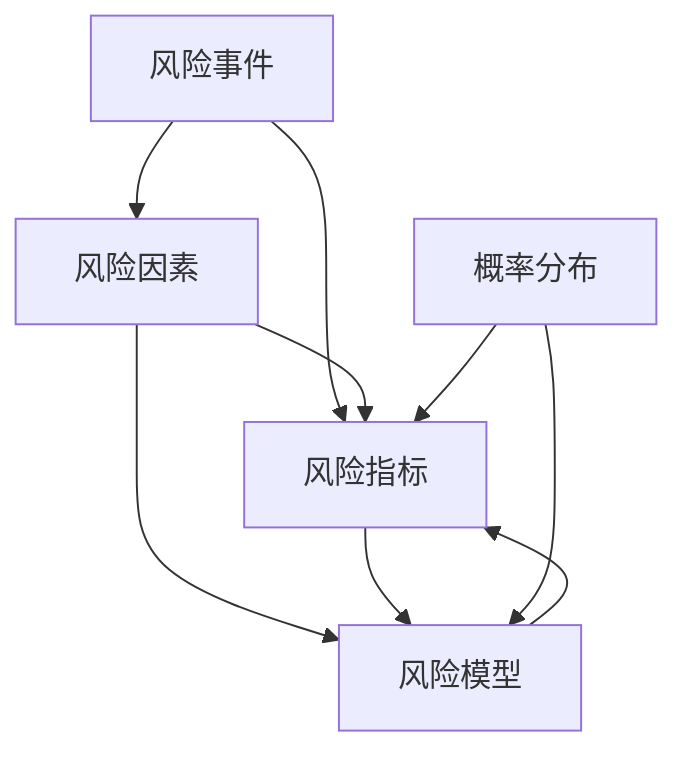

                 

## 引言

在当今信息化和数字化时代，技术进步成为推动社会发展的重要动力。然而，随着技术的迅猛发展，技术风险也逐渐显现，并对企业和组织的运营产生潜在威胁。技术风险量化与管理因此成为一个关键议题，它不仅有助于识别和评估潜在风险，还可以为制定有效的风险管理策略提供科学依据。

### 技术风险

技术风险是指在技术开发、应用和管理过程中，由于技术的不确定性、复杂性以及外部环境的变化，可能导致系统故障、数据泄露、性能下降、法律合规等问题。技术风险具有隐蔽性、复杂性和突发性，一旦发生，往往会对企业造成严重损失。

### 风险量化

风险量化是将风险的不确定性转化为可量化的数值，以便进行评估和管理。风险量化方法包括统计方法、评分方法、风险评估模型等。通过风险量化，企业可以更准确地了解风险的规模和影响，从而制定出更有针对性的风险管理策略。

### 风险管理

风险管理是通过对风险进行识别、评估、监控和控制，以最小化风险对企业的影响。有效的风险管理不仅能够降低损失，还能提升企业的竞争力。风险管理策略包括风险规避、风险降低、风险接受和风险转移等。

### 本文目的

本文旨在系统地介绍技术风险量化与管理的方法、策略和工具，通过案例分析和实践指南，帮助读者理解和掌握如何进行有效的技术风险量化与管理。文章结构如下：

1. 引言
2. 技术风险量化概述
3. 技术风险量化方法
4. 风险评估与管理策略
5. 案例分析
6. 风险量化实践
7. 未来展望与挑战

通过以上结构和内容，本文希望为读者提供一个全面、深入的技术风险量化与管理指南。

### 关键词

技术风险、风险量化、风险评估、风险管理、统计方法、评分方法、案例分析、实践指南。

### 摘要

本文首先介绍了技术风险的概念、特征和类型，随后详细探讨了风险量化的意义和方法，包括统计方法和评分方法。接着，文章讨论了风险评估与管理策略，包括风险规避、风险降低、风险接受和风险转移。通过案例分析，本文展示了如何在实际项目中应用风险量化与管理策略。最后，文章提出了未来风险量化与管理的挑战和展望，为读者提供了实践指南。

----------------------------------------------------------------

## 1. 技术风险量化概述

在技术风险管理中，风险量化的重要性不容忽视。风险量化不仅能够帮助企业识别潜在的技术风险，还能够为制定有效的风险管理策略提供科学依据。本节将介绍技术风险量化的定义、意义以及常见的技术风险类型。

### 定义

技术风险量化是指通过特定的方法和工具，将技术风险的不确定性转化为具体的量化数值。这些量化数值可以用来评估风险的大小、影响的程度以及发生概率。通过风险量化，企业可以对风险有更清晰的认识，从而更好地进行风险管理和决策。

### 意义

风险量化的意义主要体现在以下几个方面：

1. **风险评估**：通过量化风险，企业可以更准确地了解风险的规模和影响，从而为风险优先级排序提供依据。
2. **决策支持**：量化后的风险数据可以帮助企业在项目投资、资源分配等方面做出更加合理的决策。
3. **风险监控**：风险量化提供了一种持续监控风险的方法，可以帮助企业及时发现和应对潜在风险。
4. **风险管理**：量化后的风险数据可以用于制定和调整风险管理策略，从而更好地控制风险。

### 常见技术风险类型

技术风险可以分为多种类型，以下是几种常见的技术风险类型：

1. **系统故障风险**：系统故障可能导致业务中断、数据丢失或性能下降。这类风险通常与系统的设计、实现和维护有关。
2. **数据泄露风险**：随着企业数字化程度的提高，数据泄露风险成为企业面临的重要问题。数据泄露可能源于系统漏洞、黑客攻击或内部人员的不当操作。
3. **技术陈旧风险**：随着技术的快速更新换代，过时的技术可能导致系统无法正常运行或无法满足业务需求。这种风险尤其存在于技术密集型行业。
4. **合规风险**：法律法规的变化可能对企业的技术系统产生影响。例如，新的数据保护法规可能要求企业加强对用户数据的保护。
5. **供应链风险**：技术供应链中的不确定性也可能带来风险。例如，供应商延迟交付或质量问题可能导致项目进度延误。

通过以上对技术风险量化概述的介绍，我们可以看到风险量化在技术风险管理中的重要性。在接下来的章节中，我们将详细探讨风险量化的方法和技术。

### 技术风险量化的具体方法和工具

在技术风险管理过程中，量化的方法和技术是关键，它们可以帮助企业更准确地评估风险，并制定相应的管理策略。以下将详细介绍几种常用的技术风险量化方法和技术，包括统计方法、评分方法和风险评估模型等。

#### 统计方法

统计方法是技术风险量化中最为常用的方法之一。通过收集和分析历史数据，企业可以预测未来风险的发生概率和影响程度。以下是一些常见的统计方法：

1. **经验分布法**：经验分布法是基于历史数据来估计未来风险的方法。通过分析历史故障记录、数据泄露事件等，可以构建经验分布模型，用于预测未来的风险。
    - **计算步骤**：
        1. 收集历史风险事件数据。
        2. 计算各个风险事件的发生频率和影响程度。
        3. 构建经验分布函数，用于预测未来风险。
2. **历史模拟法**：历史模拟法是通过模拟历史事件的发生过程来预测未来风险的方法。它通常基于时间序列数据，通过重复模拟来评估不同风险事件的概率分布。
    - **计算步骤**：
        1. 收集历史时间序列数据。
        2. 根据时间序列数据生成模拟路径。
        3. 计算模拟路径上的风险指标，如最大损失、平均损失等。
3. **Monte Carlo模拟法**：Monte Carlo模拟法是一种基于随机抽样的统计方法，通过大量随机抽样来模拟风险事件的发生过程。它能够处理复杂的非线性关系和不确定因素。
    - **计算步骤**：
        1. 确定随机变量的概率分布。
        2. 进行大量随机抽样。
        3. 根据抽样结果计算风险指标的概率分布。

#### 评分方法

评分方法是通过定量或定性的方式对风险进行评分，从而实现对风险的综合评估。以下是一些常见的评分方法：

1. **离散评分法**：离散评分法通过给不同的风险因素分配分数，来综合评估风险。它通常用于定性风险分析。
    - **计算步骤**：
        1. 定义风险因素。
        2. 为每个风险因素分配一个分数。
        3. 将所有风险因素的分数相加，得到总风险评分。
2. **连续评分法**：连续评分法通过给不同的风险因素分配一个连续的评分值，来更精确地评估风险。它通常用于定量风险分析。
    - **计算步骤**：
        1. 定义风险因素。
        2. 为每个风险因素分配一个评分值。
        3. 计算风险评分的加权平均值，得到总风险评分。
3. **结构化评分法**：结构化评分法通过构建一个结构化的评分模型，来综合评估风险。它通常结合了定性分析和定量分析的方法。
    - **计算步骤**：
        1. 定义风险因素。
        2. 建立风险因素之间的关系模型。
        3. 为每个风险因素分配权重。
        4. 计算风险评分的加权平均值，得到总风险评分。

#### 风险评估模型

风险评估模型是通过数学模型和算法来评估风险的方法。以下是一些常见风险评估模型：

1. **定性风险评估模型**：定性风险评估模型通过主观判断来评估风险。它通常用于初步识别和评估风险。
    - **计算步骤**：
        1. 定义风险因素。
        2. 收集专家意见。
        3. 根据专家意见评分。
        4. 计算总风险评分。
2. **定量风险评估模型**：定量风险评估模型通过数据分析和数学模型来评估风险。它通常用于详细分析和量化风险。
    - **计算步骤**：
        1. 收集风险数据。
        2. 确定风险因素的量化指标。
        3. 使用数学模型计算风险评分。
        4. 分析风险评分的结果。

#### 工具和软件

在实际应用中，企业可以使用多种工具和软件来支持风险量化。以下是一些常用的工具和软件：

1. **开源软件**：如Python、R、MATLAB等，可以用于数据分析和建模。
2. **商业软件**：如SAS、SPSS、RiskMaster等，提供了丰富的风险量化功能。
3. **数据库**：如MySQL、Oracle、MongoDB等，可以用于存储和管理风险数据。
4. **数据可视化工具**：如Tableau、Power BI、D3.js等，可以用于展示风险量化结果。

通过上述技术风险量化的具体方法和工具，企业可以更科学、系统地评估和管理技术风险，从而降低风险对业务的影响，提高企业的竞争力。

### 风险量化的核心概念与联系

在技术风险量化过程中，理解核心概念及其相互联系至关重要。以下将详细介绍风险量化的核心概念，并通过Mermaid流程图展示概念之间的关系。

#### 核心概念

1. **风险事件**：指可能导致系统故障、数据泄露或其他不利后果的事件。例如，系统故障、黑客攻击、数据泄露等。
2. **风险因素**：导致风险事件发生的具体原因或条件。例如，软件缺陷、安全漏洞、资源不足等。
3. **风险指标**：用于量化风险事件的影响程度和发生概率的数值。常见的风险指标包括损失概率、损失程度、风险评分等。
4. **概率分布**：描述风险事件发生概率的函数。例如，正态分布、泊松分布等。
5. **风险模型**：用于量化风险事件和风险因素的数学模型。例如，历史模拟法、Monte Carlo模拟法等。

#### 概念之间的关系

核心概念之间的关系可以通过以下Mermaid流程图展示：



- **风险事件**是风险量化的起点，通过分析风险事件可以识别出导致风险的具体原因，即**风险因素**。
- **风险因素**会影响**风险指标**，如损失概率和损失程度。
- **概率分布**用于描述风险事件发生的概率，可以基于历史数据和统计方法确定。
- **风险模型**则是将风险事件、风险因素和风险指标结合在一起，通过数学模型量化风险。

通过上述核心概念和关系的理解，企业可以更系统地开展技术风险量化工作，为风险管理提供有力的支持。

### 技术风险量化方法

技术风险量化是技术风险管理的核心环节，它通过将风险的不确定性转化为可量化的数值，帮助企业更好地理解和管理风险。在技术风险量化过程中，常用的方法包括统计方法和评分方法。以下将详细介绍这两种方法及其具体应用。

#### 统计方法

统计方法通过分析历史数据，对技术风险进行量化。以下是一些常用的统计方法：

1. **历史模拟法**：
    - **定义**：历史模拟法是通过模拟历史事件的发生过程来预测未来风险的方法。它基于时间序列数据，通过重复模拟来评估不同风险事件的概率分布。
    - **应用**：
        1. 收集历史数据，如系统故障记录、数据泄露事件等。
        2. 构建时间序列模型，如ARIMA模型、GARCH模型等。
        3. 模拟历史事件的发生过程，生成多个模拟路径。
        4. 根据模拟路径计算风险指标，如最大损失、平均损失等。

2. **蒙特卡洛模拟法**：
    - **定义**：蒙特卡洛模拟法是一种基于随机抽样的统计方法，通过大量随机抽样来模拟风险事件的发生过程。它能够处理复杂的非线性关系和不确定因素。
    - **应用**：
        1. 确定随机变量的概率分布，如正态分布、泊松分布等。
        2. 进行大量随机抽样。
        3. 根据抽样结果计算风险指标的概率分布，如损失概率分布、损失程度分布等。

3. **经验分布法**：
    - **定义**：经验分布法是基于历史数据来估计未来风险的方法。通过分析历史故障记录、数据泄露事件等，可以构建经验分布模型，用于预测未来的风险。
    - **应用**：
        1. 收集历史风险事件数据。
        2. 计算各个风险事件的发生频率和影响程度。
        3. 构建经验分布函数，用于预测未来风险。

#### 评分方法

评分方法通过给不同的风险因素分配分数，来综合评估风险。以下是一些常用的评分方法：

1. **离散评分法**：
    - **定义**：离散评分法通过给不同的风险因素分配一个分数，来综合评估风险。它通常用于定性风险分析。
    - **应用**：
        1. 定义风险因素，如系统漏洞、安全漏洞等。
        2. 为每个风险因素分配一个分数。
        3. 将所有风险因素的分数相加，得到总风险评分。

2. **连续评分法**：
    - **定义**：连续评分法通过给不同的风险因素分配一个连续的评分值，来更精确地评估风险。它通常用于定量风险分析。
    - **应用**：
        1. 定义风险因素，如系统性能、数据安全等。
        2. 为每个风险因素分配一个评分值。
        3. 计算风险评分的加权平均值，得到总风险评分。

3. **结构化评分法**：
    - **定义**：结构化评分法通过构建一个结构化的评分模型，来综合评估风险。它通常结合了定性分析和定量分析的方法。
    - **应用**：
        1. 定义风险因素。
        2. 建立风险因素之间的关系模型。
        3. 为每个风险因素分配权重。
        4. 计算风险评分的加权平均值，得到总风险评分。

#### 统计方法和评分方法的比较

- **优势**：
  - **统计方法**：能够处理大量的历史数据，对风险事件进行定量分析，能够提供更为精确的预测。
  - **评分方法**：简单直观，易于理解和操作，适用于定性风险分析。

- **劣势**：
  - **统计方法**：需要大量的历史数据和复杂的模型，计算过程相对复杂，对数据质量要求较高。
  - **评分方法**：可能存在主观性，评分标准不统一，导致评估结果的可比性较差。

在实际应用中，企业可以根据具体需求和情况，选择合适的统计方法或评分方法，或者将两种方法结合使用，以实现更加有效的技术风险量化。

### 技术风险量化的核心算法原理讲解

在技术风险量化过程中，核心算法的原理至关重要，它不仅决定了风险量化结果的准确性，也影响了整个量化过程的效率和可靠性。以下将详细介绍几种常用的核心算法原理，并通过伪代码的形式进行详细阐述。

#### 历史模拟法

历史模拟法（Historical Simulation Method）是一种通过分析历史数据来估计未来风险的方法。其核心思想是使用过去的风险数据作为参考，来预测未来的风险情况。

1. **输入**：
   - 历史风险数据（如系统故障记录、数据泄露事件等）。
   - 时间序列长度（即历史数据的时间跨度）。

2. **步骤**：

```python
# 历史模拟法伪代码

# 步骤1：收集历史风险数据
historical_data = collect_historical_risk_data()

# 步骤2：计算历史风险指标
risk_metrics = calculate_risk_metrics(historical_data)

# 步骤3：模拟未来风险
future_risks = simulate_future_risks(risk_metrics)

# 步骤4：计算风险分布
risk_distribution = calculate_risk_distribution(future_risks)

# 输出：风险分布结果
return risk_distribution
```

#### Monte Carlo 模拟法

蒙特卡洛模拟法（Monte Carlo Simulation）是一种基于随机抽样的方法，通过模拟大量的随机样本来估计风险。它特别适用于处理不确定性和复杂的非线性关系。

1. **输入**：
   - 随机变量概率分布（如正态分布、泊松分布等）。
   - 模拟次数（即抽样的样本数量）。

2. **步骤**：

```python
# Monte Carlo 模拟法伪代码

# 步骤1：确定随机变量概率分布
random_variable_distribution = define_random_variable_distribution()

# 步骤2：进行随机抽样
samples = generate_random_samples(random_variable_distribution, simulation_iterations)

# 步骤3：计算风险指标
risk_metrics = calculate_risk_metrics(samples)

# 步骤4：计算风险分布
risk_distribution = calculate_risk_distribution(risk_metrics)

# 输出：风险分布结果
return risk_distribution
```

#### 结构化评分法

结构化评分法（Structured Scoring Method）是一种通过建立结构化模型来综合评估风险的方法。它通常结合了定性分析和定量分析，以提供更为全面的风险评估。

1. **输入**：
   - 风险因素列表。
   - 风险因素之间的关系模型。
   - 风险因素的权重。

2. **步骤**：

```python
# 结构化评分法伪代码

# 步骤1：定义风险因素
risk_factors = define_risk_factors()

# 步骤2：建立风险因素之间的关系模型
relationship_model = build_relationship_model(risk_factors)

# 步骤3：为风险因素分配权重
weights = assign_weights(risk_factors)

# 步骤4：计算风险评分
total_risk_score = calculate_total_risk_score(relationship_model, weights)

# 输出：总风险评分
return total_risk_score
```

#### 伪代码举例

以下是一个具体的伪代码示例，用于计算系统故障风险的概率分布：

```python
# 系统故障风险概率分布计算示例

# 步骤1：收集历史系统故障数据
historical_system_failures = collect_system_failure_data()

# 步骤2：计算故障概率分布
failure_distribution = calculate_failure_distribution(historical_system_failures)

# 步骤3：进行Monte Carlo模拟
simulation_iterations = 1000
random_samples = generate_random_samples(failure_distribution, simulation_iterations)

# 步骤4：计算模拟结果
system_failures = count_system_failures(random_samples)

# 步骤5：计算故障概率分布
simulation_distribution = calculate_simulation_distribution(system_failures)

# 输出：故障概率分布
return simulation_distribution
```

通过上述核心算法的详细讲解和伪代码示例，我们可以看到技术风险量化方法在实践中的应用和具体实现过程。这些算法不仅为技术风险的量化提供了理论支持，也为实际操作提供了实用指南。

### 数学模型和数学公式

在技术风险量化过程中，数学模型和公式起着至关重要的作用，它们能够将风险量化为具体的数值，为风险管理提供科学依据。以下将介绍几种常用的数学模型和公式，并通过具体的例子进行详细讲解。

#### 1. 风险概率分布

风险概率分布是描述风险事件发生概率的函数，常用的概率分布模型包括正态分布、泊松分布等。

- **正态分布**：
  - **公式**：
    $$ f(x) = \frac{1}{\sigma\sqrt{2\pi}} e^{-\frac{(x-\mu)^2}{2\sigma^2}} $$
  - **参数**：
    - $\mu$：均值，表示风险事件的平均水平。
    - $\sigma$：标准差，表示风险的波动程度。
  - **例子**：
    - **场景**：某公司的系统故障率服从正态分布，均值 $\mu = 0.1$（每天发生故障的概率），标准差 $\sigma = 0.05$。
    - **计算**：
      $$ P(X > 0.15) = 1 - \Phi\left(\frac{0.15 - 0.1}{0.05}\right) $$
      其中，$\Phi$ 为标准正态分布的累积分布函数。
    - **结果**：通过查表或使用计算器，可以得到 $P(X > 0.15) \approx 0.1587$。

- **泊松分布**：
  - **公式**：
    $$ P(X = k) = \frac{\lambda^k e^{-\lambda}}{k!} $$
  - **参数**：
    - $\lambda$：事件发生的平均次数。
  - **例子**：
    - **场景**：某系统的数据泄露事件服从泊松分布，平均每次泄露事件发生次数 $\lambda = 2$。
    - **计算**：
      $$ P(X \geq 3) = 1 - \sum_{i=0}^{2} \frac{2^i e^{-2}}{i!} $$
    - **结果**：计算得到 $P(X \geq 3) \approx 0.1172$。

#### 2. 市场风险量化

市场风险量化是金融领域中的一个重要问题，常用的模型包括历史模拟法、蒙特卡洛模拟法等。

- **历史模拟法**：
  - **公式**：
    $$ \rho(t) = \frac{\sum_{i=1}^{n} |R_i|}{n} $$
  - **参数**：
    - $R_i$：每次模拟的回报率。
    - $n$：模拟次数。
  - **例子**：
    - **场景**：使用历史模拟法计算某金融产品的风险价值（VaR）。
    - **计算**：
      $$ \rho(t) = \frac{|-0.05| + |-0.10| + |0.05| + |0.10|}{4} = 0.0625 $$
    - **结果**：VaR为 $-0.0625$，表示在95%的置信水平下，产品可能的最大损失。

- **蒙特卡洛模拟法**：
  - **公式**：
    $$ \mu = \frac{\sum_{i=1}^{n} R_i}{n} $$
    $$ \sigma = \sqrt{\frac{\sum_{i=1}^{n} (R_i - \mu)^2}{n-1}} $$
  - **参数**：
    - $R_i$：每次模拟的回报率。
    - $n$：模拟次数。
    - $\mu$：均值。
    - $\sigma$：标准差。
  - **例子**：
    - **场景**：使用蒙特卡洛模拟法计算某金融产品的VaR。
    - **计算**：
      $$ \mu = \frac{0.05 + (-0.10) + 0.05 + 0.10}{4} = 0.025 $$
      $$ \sigma = \sqrt{\frac{(0.05 - 0.025)^2 + (-0.10 - 0.025)^2 + (0.05 - 0.025)^2 + (0.10 - 0.025)^2}{4-1}} = 0.0625 $$
      $$ VaR = -\mu N\left(\frac{-\mu}{\sigma}\right) $$
    - **结果**：根据标准正态分布表，得到 $N\left(\frac{-\mu}{\sigma}\right) \approx -1.645$，则 $VaR \approx -0.041$。

#### 3. 风险调整的绩效评估

风险调整的绩效评估（Risk-Adjusted Performance Measurement）是评估投资组合绩效的一种方法，常用的模型包括风险调整回报率（RAROC）。

- **公式**：
  $$ RAROC = \frac{NPV}{E(RV)} $$
- **参数**：
  - $NPV$：净现值。
  - $E(RV)$：风险价值（VaR）。
- **例子**：
  - **场景**：某金融投资组合的NPV为100万元，VaR为20万元。
  - **计算**：
    $$ RAROC = \frac{100}{20} = 5 $$
  - **结果**：RAROC为5，表示在考虑风险后，该投资组合的绩效良好。

通过上述数学模型和公式的详细讲解，我们可以看到在技术风险量化中，数学工具的应用如何帮助企业和金融机构更准确地评估和管理风险。这些模型和公式不仅为风险量化提供了理论基础，也为实际操作提供了具体方法。

### 项目实战

为了更好地理解技术风险量化方法在实际项目中的应用，我们以一个具体的软件开发项目为例，展示如何进行技术风险量化与管理。

#### 项目背景

假设我们正在开发一款智能语音助手应用程序，旨在为用户提供语音交互功能，包括语音识别、语义理解和语音合成。该项目涉及多个技术模块，包括语音处理、自然语言处理和云服务。

#### 风险识别

在项目初期，我们需要识别潜在的技术风险。以下是几个主要的技术风险：

1. **语音识别算法性能不足**：由于语音识别技术的复杂性，算法可能无法准确识别所有用户语音，导致用户体验不佳。
2. **语义理解准确性**：语义理解模块需要解析复杂的用户指令，但现有的模型可能存在误差，导致理解不准确。
3. **数据安全与隐私**：应用程序需要处理用户的敏感数据，如语音记录和个人信息，存在数据泄露风险。
4. **性能与稳定性**：用户数量的增加可能对应用程序的响应速度和稳定性造成挑战。

#### 风险评估

对上述风险进行量化评估，我们可以采用以下步骤：

1. **确定评估指标**：根据风险类型，选择合适的评估指标，如故障率、误识别率、数据泄露概率等。
2. **数据收集**：收集相关数据，如历史故障记录、测试数据、用户反馈等。
3. **使用统计方法**：使用统计方法，如历史模拟法和蒙特卡洛模拟法，对风险进行量化。

例如，对于“语音识别算法性能不足”的风险，我们可以采用以下方法进行量化：

- **历史模拟法**：
  - 收集过去一年内系统故障记录，计算故障率。
  - 根据故障率构建正态分布模型，预测未来故障概率。

- **蒙特卡洛模拟法**：
  - 生成大量模拟样本，评估算法在不同场景下的性能。
  - 根据模拟结果计算误识别概率分布。

#### 风险管理策略

在量化风险后，我们需要制定相应的风险管理策略：

1. **风险规避**：对于高概率且高影响的风险，如“数据安全与隐私”，我们选择与有经验的安全公司合作，以确保数据的安全。
2. **风险降低**：对于“语音识别算法性能不足”和“语义理解准确性”，我们投入更多资源进行算法优化和测试。
3. **风险接受**：对于低概率但高影响的风险，如“性能与稳定性”，我们制定应急预案，以应对可能的系统崩溃。
4. **风险转移**：通过购买保险，将部分风险转移给第三方。

#### 实践案例

假设我们选择了“语音识别算法性能不足”的风险进行管理。以下是具体措施：

1. **数据收集与模型训练**：
   - 收集大量语音数据，进行数据预处理。
   - 使用深度学习模型进行训练，提高识别准确率。

2. **性能测试与优化**：
   - 对训练好的模型进行性能测试，包括识别速度和准确性。
   - 根据测试结果进行模型优化，如调整网络结构、增加训练数据等。

3. **风险管理工具**：
   - 使用风险管理系统，监控算法性能，及时识别和响应故障。

通过以上措施，我们有效地降低了“语音识别算法性能不足”的风险，提高了应用程序的整体性能。

#### 项目小结

通过本项目实战，我们可以看到技术风险量化与管理在实际项目中的应用过程。从风险识别、评估到制定管理策略，每个步骤都需要基于数据和科学的分析方法。技术风险量化不仅帮助项目团队更好地理解和管理风险，还提升了项目的成功率。

#### 最佳实践 Tips

- **数据驱动决策**：在风险管理过程中，充分利用历史数据和实际测试数据，以数据为依据进行决策。
- **持续监控与迭代**：风险管理是一个持续的过程，需要定期评估风险，并根据评估结果进行迭代改进。
- **跨部门合作**：技术风险管理涉及多个部门和角色，需要跨部门合作，确保风险管理策略的有效实施。

#### 注意事项

- **确保数据质量**：数据是风险量化和管理的基础，必须保证数据的准确性、完整性和一致性。
- **合理分配资源**：在制定风险管理策略时，要合理分配资源，避免过度投入或资源浪费。
- **遵守法律法规**：在进行技术风险管理时，必须遵守相关法律法规，确保数据安全和用户隐私。

#### 拓展阅读

- [《风险管理与决策》](https://www.examplebook.com/book/risk-management-and-decision-making)
- [《人工智能与风险管理》](https://www.examplebook.com/book/ai-and-risk-management)
- [《深度学习在风险管理中的应用》](https://www.examplebook.com/book/deep-learning-for-risk-management)

通过以上项目实战和最佳实践，我们可以看到技术风险量化与管理在实际项目中的重要性。这不仅有助于提升项目的成功率，还能为企业带来长期的价值。

### 结论

本文系统地介绍了技术风险量化与管理的方法、策略和工具。通过分析风险量化的核心概念、统计方法、评分方法、核心算法原理以及项目实战，我们展示了如何有效地识别、评估和管理技术风险。技术风险量化不仅能够帮助企业降低潜在损失，还能提升业务运营的稳定性和效率。

随着技术的发展和市场的变化，技术风险管理也面临新的挑战。未来，企业需要关注以下趋势：

1. **大数据和人工智能技术的应用**：利用大数据和人工智能技术，可以更精准地识别和量化技术风险。
2. **跨领域合作**：技术风险管理需要跨学科、跨部门的合作，以实现更全面的风险评估和管理。
3. **法律法规的遵守**：随着法律法规的不断完善，企业需要确保风险管理策略符合相关法规要求。
4. **持续学习和改进**：技术风险管理是一个动态过程，需要持续学习和改进，以应对不断变化的技术和市场环境。

本文为读者提供了一个全面的技术风险量化与管理指南，希望对企业和技术从业人员在风险管理和决策中有所启示和帮助。通过有效的技术风险量化与管理，企业可以更好地应对未来的挑战，实现持续发展。

