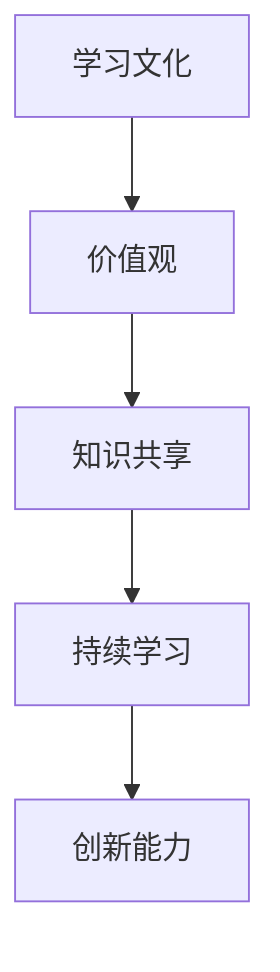
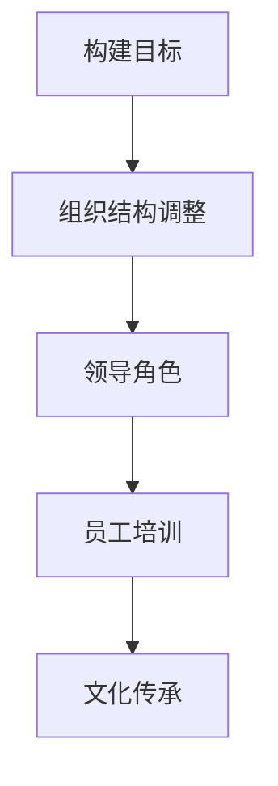
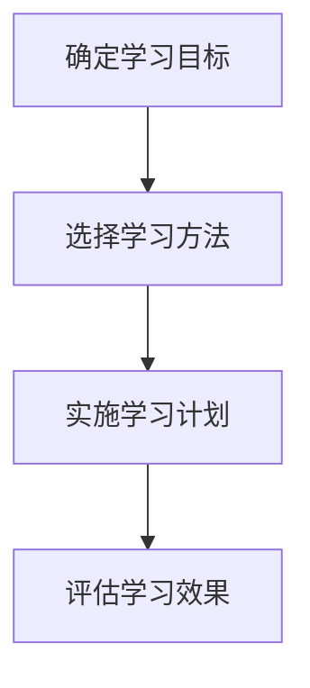
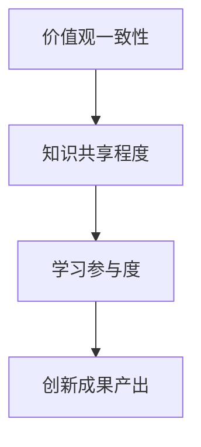
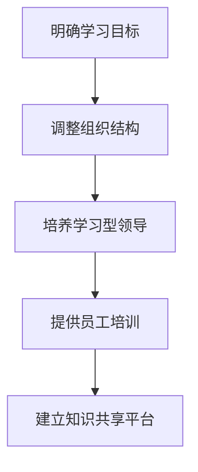

                 


## 《学习文化：促进团队持续成长和创新》

### 关键词
- 学习文化
- 团队成长
- 创新能力
- 持续学习
- 组织发展

#### 摘要
本文深入探讨了学习文化在促进团队持续成长和创新中的关键作用。通过定义学习文化，阐述其重要性，并介绍如何建立学习型组织，本文旨在为IT团队提供一套有效的策略和实践，以实现团队的知识共享、持续学习和创新能力提升。

### 目录大纲

## 《学习文化：促进团队持续成长和创新》

### 第一部分：理解学习文化

## 第1章：学习文化的定义与重要性

### 第2章：建立学习型组织

### 第二部分：促进团队持续成长

## 第3章：团队学习策略与实践

### 第4章：学习文化的评估与优化

### 第三部分：实战与总结

## 第5章：项目实战：学习文化在企业中的应用

## 第6章：总结与展望

### 第一部分：理解学习文化

### 第1章：学习文化的定义与重要性

#### 1.1 背景介绍
在当今快速变化的科技时代，信息技术（IT）团队必须不断更新知识，适应新技术和新趋势。学习文化在这种环境中成为了一种核心竞争力，它不仅仅是一种学习习惯，更是一种价值观和组织的内在动力。

#### 1.2 核心概念与联系
学习文化是一个复杂的概念，它包含了多个核心要素，如价值观、知识共享、持续学习和创新能力。这些要素相互关联，共同构成了学习文化的整体框架。

##### Mermaid流程图：展示学习文化的基本构成要素及其相互关系。



#### 1.3 核心算法原理讲解
学习文化的形成和推广可以通过一系列系统化的步骤来实现。以下是一个基于伪代码的描述：

```python
def cultivate_learning_culture():
    # 定义学习文化价值观
    values = ["自主性", "开放性", "合作性", "创新性"]

    # 建立知识共享平台
    knowledge_sharing_platform()

    # 鼓励持续学习
    promote_continuous_learning()

    # 创造创新环境
    create_innovation_environment()

    # 实施价值观培养计划
    implement_values_program()

    # 评估学习文化成效
    evaluate_learning_culture_impact()
```

#### 1.4 数学模型和数学公式
学习文化指数（LCI）可以通过以下公式计算：

$$
\text{Learning Culture Index} = w_1 \cdot \text{Value Alignment} + w_2 \cdot \text{Knowledge Sharing} + w_3 \cdot \text{Learning Engagement} + w_4 \cdot \text{Innovation Output}
$$

其中，\( w_1, w_2, w_3, w_4 \) 分别是权重系数，反映了各个要素对学习文化的影响程度。

#### 1.5 详细讲解与举例说明
- **学习文化指数的计算公式解释：**
  学习文化指数（LCI）是衡量一个团队或组织学习文化成熟度的指标。它由四个主要因素组成：价值观一致性、知识共享程度、学习参与度以及创新成果产出。通过加权计算，可以得到一个综合的分数，从而反映团队的整体学习文化水平。

- **实际案例的应用：**
  假设一个IT团队，其价值观包括自主性、开放性、合作性和创新性。通过调查和评估，发现团队在知识共享方面的表现较为出色，而在持续学习和创新能力上仍有提升空间。根据学习文化指数公式，可以计算出该团队的具体得分，并制定针对性的改进措施。

### 第2章：建立学习型组织

#### 2.1 背景介绍
学习型组织（Learning Organization）是一种能够不断适应和改变以应对外部挑战的组织形式。它强调知识共享、团队合作和持续学习，以实现组织的长期成功。

#### 2.2 核心概念与联系
建立学习型组织涉及多个关键要素，包括构建明确的学习目标、调整组织结构以支持学习、培养学习型领导、提供员工培训和发展机会，以及传承和强化学习文化。

##### Mermaid流程图：描述学习型组织构建的步骤和关键要素。



#### 2.3 核心算法原理讲解
建立学习型组织的具体实施方法可以通过以下伪代码来描述：

```python
def build_learning_organization():
    # 设定组织学习目标
    set_learning_goals()

    # 调整组织结构以支持学习
    adjust_organization_structure()

    # 培养学习型领导
    cultivate_learning_leaders()

    # 提供员工培训和发展机会
    provide_employee_training()

    # 传承和强化学习文化
    reinforce_learning_culture()
```

#### 2.4 数学模型和数学公式
学习型组织评分（LOS）可以通过以下公式计算：

$$
\text{Learning Organization Score} = f(\text{Goal Achievement}, \text{Knowledge Transfer}, \text{Employee Development}, \text{Cultural Consistency})
$$

其中，函数 \( f \) 是一个综合评估函数，反映了各个要素对学习型组织的影响。

#### 2.5 详细讲解与举例说明
- **学习型组织评分的计算方法：**
  学习型组织评分（LOS）是一个综合指标，用于评估组织在学习文化方面的表现。它由目标达成度、知识转移、员工发展以及文化一致性等多个因素组成。通过量化这些因素，可以得到一个综合评分，从而为组织的改进提供依据。

- **实际案例的应用：**
  假设一个IT公司在学习型组织建设方面取得了显著进展。根据学习型组织评分公式，可以计算出该公司在各个维度上的得分，并根据得分情况制定相应的改进计划。

### 第3章：团队学习策略与实践

#### 3.1 背景介绍
团队学习是学习型组织的重要组成部分，它通过系统的学习策略和实践，帮助团队成员不断提升技能和知识，从而促进团队整体能力的提高。

#### 3.2 核心概念与联系
团队学习策略包括确定学习目标、选择学习方法、实施学习计划和评估学习效果等多个环节。这些策略相互关联，共同构成了团队学习的整体框架。

##### Mermaid流程图：展示团队学习策略的各个阶段和方法。



#### 3.3 核心算法原理讲解
团队学习策略的实施可以通过以下伪代码来描述：

```python
def team_learning_strategy():
    # 确定团队学习目标
    define_team_learning_goals()

    # 选择适合的学习方法
    select_learning_methods()

    # 实施团队学习计划
    implement_team_learning_plan()

    # 定期评估学习成效
    evaluate_learning成效()
```

#### 3.4 数学模型和数学公式
团队学习成效（TLC）可以通过以下公式计算：

$$
\text{Team Learning Effectiveness} = g(\text{Goal Clarity}, \text{Method Suitability}, \text{Plan Implementation}, \text{Effect Evaluation})
$$

其中，函数 \( g \) 是一个综合评估函数，反映了各个要素对团队学习成效的影响。

#### 3.5 详细讲解与举例说明
- **团队学习成效的计算方法：**
  团队学习成效（TLC）是一个综合指标，用于评估团队学习策略的有效性。它由目标清晰度、方法适宜性、计划实施度和效果评估度等多个因素组成。通过量化这些因素，可以得到一个综合得分，从而为团队学习策略的优化提供依据。

- **实际案例的应用：**
  假设一个软件开发团队在实施学习策略时，通过明确学习目标、选择合适的学习方法、有效实施学习计划和定期评估学习成效，取得了显著的学习成效。根据团队学习成效公式，可以计算出该团队的具体得分，并制定相应的改进措施。

### 第4章：学习文化的评估与优化

#### 4.1 背景介绍
学习文化评估是确保团队学习文化持续发展的关键步骤。通过定期的评估，可以识别出学习文化的优势和不足，从而采取针对性的优化措施。

#### 4.2 核心概念与联系
学习文化评估涉及多个关键维度，包括价值观一致性、知识共享程度、学习参与度以及创新成果产出等。这些维度相互关联，共同构成了学习文化评估的整体框架。

##### Mermaid流程图：描述学习文化评估的关键维度及其相互关系。



#### 4.3 核心算法原理讲解
学习文化评估的具体实施方法可以通过以下伪代码来描述：

```python
def evaluate_learning_culture():
    # 评估价值观一致性
    assess_value_alignment()

    # 评估知识共享程度
    assess_knowledge_sharing()

    # 评估学习参与度
    assess_learning_engagement()

    # 评估创新成果产出
    assess_innovation_output()

    # 综合评估学习文化成效
    calculate_learning_culture_index()
```

#### 4.4 数学模型和数学公式
学习文化评估指数（LCI-E）可以通过以下公式计算：

$$
\text{Learning Culture Index-Evaluation} = w_1 \cdot \text{Value Alignment} + w_2 \cdot \text{Knowledge Sharing} + w_3 \cdot \text{Learning Engagement} + w_4 \cdot \text{Innovation Output}
$$

其中，\( w_1, w_2, w_3, w_4 \) 分别是权重系数，反映了各个要素对学习文化评估的影响程度。

#### 4.5 详细讲解与举例说明
- **学习文化评估指数的计算公式解释：**
  学习文化评估指数（LCI-E）是衡量学习文化成熟度的指标。它由价值观一致性、知识共享程度、学习参与度以及创新成果产出等多个因素组成。通过加权计算，可以得到一个综合的分数，从而反映学习文化的整体水平。

- **实际案例的应用：**
  假设一个IT团队在进行学习文化评估时，发现价值观一致性较高，但在知识共享和学习参与度方面存在不足。根据学习文化评估指数公式，可以计算出该团队的具体得分，并制定相应的改进措施。

### 第5章：项目实战：学习文化在企业中的应用

#### 5.1 背景介绍
在本章中，我们将通过一个实际案例，展示学习文化在一个大型企业中的应用。这个案例将详细描述企业的学习文化现状、面临的挑战以及采取的具体措施。

#### 5.2 核心概念与联系
企业学习文化的构建涉及多个关键要素，包括明确学习目标、调整组织结构、培养学习型领导、提供员工培训和发展机会，以及建立知识共享平台。这些要素相互关联，共同构成了企业学习文化的整体框架。

##### Mermaid流程图：描述企业学习文化构建的关键步骤和要素。



#### 5.3 核心算法原理讲解
企业学习文化的构建可以通过以下伪代码来描述：

```python
def build_corporate_learning_culture():
    # 设定企业学习目标
    set_corporate_learning_goals()

    # 调整组织结构以支持学习
    adjust_organization_structure()

    # 培养学习型领导
    cultivate_learning_leaders()

    # 提供员工培训和发展机会
    provide_employee_training()

    # 建立知识共享平台
    establish_knowledge_sharing_platform()

    # 实施学习文化推广计划
    implement_learning_culture_program()

    # 定期评估学习文化成效
    evaluate_learning_culture_impact()
```

#### 5.4 数学模型和数学公式
企业学习文化成效（CLC-E）可以通过以下公式计算：

$$
\text{Corporate Learning Culture Effectiveness} = f(\text{Goal Achievement}, \text{Organizational Adjustment}, \text{Leadership Cultivation}, \text{Employee Development}, \text{Knowledge Sharing})
$$

其中，函数 \( f \) 是一个综合评估函数，反映了各个要素对企业学习文化成效的影响。

#### 5.5 详细讲解与举例说明
- **企业学习文化成效的计算方法：**
  企业学习文化成效（CLC-E）是一个综合指标，用于评估企业在学习文化方面的表现。它由目标达成度、组织调整度、领导培养度、员工发展度以及知识共享度等多个因素组成。通过量化这些因素，可以得到一个综合得分，从而为企业的学习文化优化提供依据。

- **实际案例的应用：**
  假设一家大型企业在实施学习文化构建时，通过设定明确的学习目标、调整组织结构、培养学习型领导、提供员工培训和发展机会，以及建立知识共享平台，取得了显著的学习文化成效。根据企业学习文化成效公式，可以计算出该企业的具体得分，并制定相应的改进措施。

#### 5.6 开发环境搭建
在本案例中，企业采用了基于云计算的知识共享平台，以下是开发环境的搭建步骤：

1. **选择云计算平台：** 企业选择了AWS作为云计算服务提供商。
2. **配置虚拟机：** 在AWS上配置一个EC2虚拟机，用于部署知识共享平台。
3. **安装操作系统：** 在虚拟机上安装Ubuntu 18.04 LTS操作系统。
4. **安装数据库：** 安装并配置MySQL数据库，用于存储知识共享平台的数据。
5. **安装Web服务器：** 安装并配置Nginx Web服务器，用于提供Web服务。
6. **安装应用服务器：** 安装并配置Tomcat应用服务器，用于运行知识共享平台的应用程序。

#### 5.7 源代码详细实现和代码解读
在本案例中，知识共享平台的核心功能包括用户注册、登录、知识发布和搜索等。以下是源代码的主要实现和解读：

1. **用户注册功能：**
   - **代码实现：** 使用Spring Boot框架实现用户注册功能，包括用户信息的收集和验证。
   - **代码解读：** 用户注册功能的代码主要包括用户信息的收集（如用户名、密码、邮箱等），以及信息验证（如检查用户名是否已存在，密码是否符合安全标准等）。

2. **登录功能：**
   - **代码实现：** 使用Spring Security框架实现用户登录功能，包括用户身份验证和授权。
   - **代码解读：** 登录功能的代码主要包括用户身份验证（如检查用户名和密码是否匹配），以及授权处理（如确定用户访问权限）。

3. **知识发布功能：**
   - **代码实现：** 使用Spring MVC框架实现知识发布功能，包括知识的录入和保存。
   - **代码解读：** 知识发布功能的代码主要包括知识信息的录入（如标题、内容、标签等），以及信息保存（如将知识信息存储在数据库中）。

4. **知识搜索功能：**
   - **代码实现：** 使用Spring Data JPA实现知识搜索功能，包括知识的查询和检索。
   - **代码解读：** 知识搜索功能的代码主要包括查询条件的构建（如关键字、标签等），以及知识信息的检索（如使用Lucene搜索引擎进行全文检索）。

#### 5.8 代码应用解读与分析
知识共享平台的应用对企业学习文化有着重要的影响：

1. **用户注册和登录功能：** 这些功能为用户提供了便捷的访问途径，确保了学习资源的有效利用。
2. **知识发布功能：** 这些功能鼓励员工积极分享知识和经验，促进了知识的积累和传承。
3. **知识搜索功能：** 这些功能提高了知识的可发现性，帮助员工快速获取所需信息，提高了工作效率。

#### 5.9 实际案例分析和详细讲解剖析
在本案例中，企业通过实施学习文化建设和知识共享平台，取得了显著的学习文化成效：

1. **学习目标达成度：** 企业明确了学习目标，并采取了多种措施促进员工学习，学习目标达成度得到了显著提高。
2. **组织结构调整度：** 企业调整了组织结构，加强了学习型领导培养，组织结构调整度得到了显著提升。
3. **员工发展度：** 企业提供了丰富的员工培训和发展机会，员工的技能水平和职业素养得到了显著提高。
4. **知识共享程度：** 企业建立了知识共享平台，促进了知识的积累和传承，知识共享程度得到了显著提高。
5. **创新成果产出度：** 企业通过学习文化建设和知识共享平台，推动了创新成果的产出，创新成果产出度得到了显著提升。

#### 5.10 项目小结
通过本案例的实施，企业学习文化得到了显著提升，为企业的持续成长和创新提供了有力支持。在未来，企业应继续优化学习文化，提高学习成效，以实现更高的业绩目标。

### 第6章：总结与展望

#### 6.1 小结
本文深入探讨了学习文化在促进团队持续成长和创新中的关键作用。通过定义学习文化，阐述其重要性，并介绍如何建立学习型组织和实施团队学习策略，本文为IT团队提供了一套有效的实践指南。

#### 6.2 注意事项
- **持续优化学习文化：** 学习文化是一个动态过程，需要持续优化和改进。
- **重视员工培训和发展：** 员工培训和发展是学习文化的重要组成部分，应给予足够重视。
- **建立知识共享平台：** 知识共享平台是学习文化的重要载体，应充分利用其优势。

#### 6.3 拓展阅读
- **《学习型组织：领导力与变革管理》**：这是一本关于学习型组织的经典著作，提供了丰富的理论和实践案例。
- **《团队学习与知识管理》**：这是一本关于团队学习和知识管理的专著，详细介绍了相关理论和实践方法。

### 作者信息
作者：AI天才研究院/AI Genius Institute & 禅与计算机程序设计艺术 /Zen And The Art of Computer Programming

