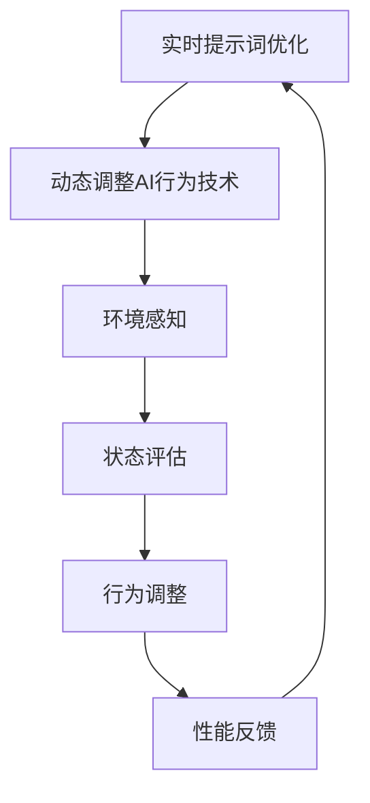

                 


### 文章标题

# 实时提示词优化：动态调整AI行为的技术

### 文章关键词

- 实时提示词优化
- 动态调整AI行为
- AI行为优化
- 实时反馈机制
- 机器学习
- 深度学习

### 文章摘要

本文深入探讨了实时提示词优化以及动态调整AI行为的技术。通过对实时提示词优化的背景、核心概念、算法原理、数学模型、项目实战以及未来展望的详细分析，文章旨在为AI工程师和数据科学家提供一套系统的理解和实践指南，帮助他们在实际项目中实现AI行为的优化和调整。

## 引言

### 1.1 实时提示词优化背景

在人工智能（AI）领域，特别是在自然语言处理（NLP）和机器学习（ML）中，提示词（prompts）扮演着至关重要的角色。提示词是一种引导AI系统如何理解、处理和生成响应的输入。在传统的AI应用中，提示词通常是静态的、预设的，无法根据实际情境动态调整。然而，随着AI技术的不断进步，尤其是深度学习的发展，AI系统需要能够实时、动态地调整其行为以适应不断变化的环境和需求。

实时提示词优化是指利用AI技术，对提示词进行动态调整，以实现更好的AI行为和性能。这一优化过程可以显著提高AI系统在不同场景下的适应能力和表现。实时提示词优化的重要性在于：

1. **增强用户体验**：通过优化提示词，AI系统能够更准确地理解用户的需求和意图，提供更自然的交互体验。
2. **提升系统性能**：动态调整提示词可以帮助AI系统在复杂、多变的环境中保持高效率和准确性。
3. **扩大应用场景**：实时提示词优化使得AI系统能够适应更广泛的应用场景，包括实时语音识别、智能客服、实时翻译等。

### 1.2 动态调整AI行为技术背景

动态调整AI行为技术是近年来人工智能领域的一个热点研究方向。它旨在使AI系统能够在运行时根据外部环境和内部状态的变化，自动调整其行为和决策策略。这种能力对于提升AI系统的自适应性和灵活性至关重要。

动态调整AI行为技术的基本原理包括：

1. **环境感知**：AI系统通过传感器、反馈机制等感知外部环境的变化。
2. **状态评估**：AI系统根据感知到的环境信息，评估自身状态，包括当前性能、资源消耗等。
3. **行为调整**：基于对环境和状态的评估，AI系统调整其行为和决策策略，以实现更好的性能和适应能力。

动态调整AI行为技术在自动驾驶、智能推荐系统、智能制造等领域具有重要的应用潜力。通过动态调整，AI系统可以更好地适应复杂、多变的环境，提高系统的可靠性和效率。

### 1.3 实时提示词优化与动态调整AI行为技术的关系

实时提示词优化和动态调整AI行为技术之间存在着紧密的联系。实时提示词优化是实现动态调整AI行为技术的基础，而动态调整AI行为技术则可以进一步提升实时提示词优化的效果。

实时提示词优化通过动态调整提示词，使AI系统在处理任务时能够更准确地理解和生成响应。这种优化不仅依赖于对当前环境和状态的感知，还需要结合历史数据和经验，以实现长期的性能提升。动态调整AI行为技术则提供了更广泛的能力，使AI系统能够在更复杂、多变的环境中，根据实时反馈进行自我调整。

总的来说，实时提示词优化和动态调整AI行为技术共同构成了一个闭环系统，通过不断的反馈和调整，实现AI系统性能的持续优化和提高。

### 1.4 本文结构

本文将分为以下几个部分：

1. **核心概念与联系**：介绍实时提示词优化和动态调整AI行为技术的基本概念，并使用Mermaid流程图展示它们之间的关系。
2. **核心算法原理讲解**：详细讲解实时提示词优化的算法原理，包括生成式模型、抽象式模型以及提示词生成算法的优化方法。
3. **数学模型与公式**：介绍实时提示词优化和动态调整AI行为技术的数学模型，并使用latex格式进行详细讲解和举例说明。
4. **项目实战**：提供实际的代码案例，包括开发环境搭建、源代码实现和代码解读，以及实际案例分析和详细讲解剖析。
5. **未来展望**：讨论实时提示词优化和动态调整AI行为技术的未来发展趋势和潜在研究方向。

通过以上内容，本文旨在为读者提供一个全面、深入的理解，帮助他们在实际项目中实现AI行为的优化和调整。

## 核心概念与联系

### 2.1 实时提示词优化

实时提示词优化是指利用人工智能技术，对提示词进行动态调整，以实现更好的AI行为和性能。提示词（prompt）在AI系统中起到引导和规范作用，它决定了AI系统如何理解和处理输入信息。实时提示词优化的核心在于根据AI系统的运行状态和外部环境的变化，实时调整提示词，以提升系统的适应能力和表现。

#### 2.1.1 提示词的概念

提示词是一种特殊的输入数据，用于引导AI系统如何理解、处理和生成响应。在自然语言处理领域，提示词通常是一段文本，它可以包含关键词、问题或命令。例如，在问答系统中，用户提出的问题就是一个提示词，系统需要根据这个问题生成合适的答案。

#### 2.1.2 提示词优化的意义

提示词优化对于AI系统的性能和用户体验具有显著影响。首先，优化后的提示词可以使AI系统更准确地理解用户的意图和需求，从而生成更符合预期的响应。其次，提示词优化可以提高AI系统的效率和准确性，减少错误率和响应时间。此外，通过实时调整提示词，AI系统可以更好地适应不同的环境和场景，提高其灵活性和通用性。

#### 2.1.3 提示词优化的挑战

实时提示词优化面临着一些挑战，主要包括：

1. **动态性**：AI系统需要能够实时感知外部环境的变化，并根据这些变化动态调整提示词。
2. **准确性**：提示词的优化需要确保AI系统在变化的环境中仍然能够准确地理解和处理输入信息。
3. **复杂性**：实时提示词优化涉及到多个层面的技术和算法，包括自然语言处理、机器学习、深度学习等。
4. **效率**：实时提示词优化需要在保证性能的同时，尽可能减少计算资源和时间开销。

### 2.2 动态调整AI行为技术

动态调整AI行为技术是指通过实时感知和评估AI系统的运行状态和环境变化，自动调整AI系统的行为和决策策略。这种技术旨在提升AI系统的自适应性和灵活性，使其能够更好地应对复杂、多变的环境。

#### 2.2.1 动态调整的概念

动态调整（Dynamic Adjustment）是指AI系统在运行过程中，根据实时反馈和环境变化，自动调整其行为和决策策略的过程。这种调整可以是局部的、微调的，也可以是全局的、重大的。动态调整的核心在于实时性和自动化，它使得AI系统能够在不中断服务的情况下，不断优化自身的性能和表现。

#### 2.2.2 动态调整的优势

动态调整AI行为技术具有以下优势：

1. **自适应**：通过动态调整，AI系统可以根据不同的环境和场景，自动调整其行为和策略，实现更好的适应能力。
2. **灵活性**：动态调整使得AI系统在处理复杂任务时，能够灵活应对变化，提高系统的稳定性和可靠性。
3. **高效性**：动态调整可以在不增加计算资源的情况下，提升AI系统的性能和效率。
4. **自优化**：动态调整通过不断学习和优化，使得AI系统能够持续提升其性能和表现。

#### 2.2.3 动态调整的挑战

尽管动态调整AI行为技术具有许多优势，但它在实际应用中也面临着一些挑战：

1. **实时性**：动态调整需要快速响应环境变化，这要求AI系统具备高效的感知和计算能力。
2. **准确性**：动态调整需要确保调整后的行为和策略是准确和有效的，这需要对环境和状态有准确的评估。
3. **复杂性**：动态调整涉及到多个层面的技术和算法，实现起来相对复杂。
4. **可解释性**：动态调整的行为和决策过程需要具有可解释性，以便用户理解和信任。

### 2.3 Mermaid流程图：核心概念联系

为了更好地理解实时提示词优化和动态调整AI行为技术之间的联系，我们可以使用Mermaid流程图来展示它们的核心概念和流程。以下是一个简化的流程图：



在这个流程图中，实时提示词优化（A）和动态调整AI行为技术（B）是核心概念，它们通过环境感知（C）、状态评估（D）和行为调整（E）相互联系。性能反馈（F）则是一个闭环，通过持续的反馈和调整，实现AI系统性能的优化和提高。

## 核心算法原理讲解

### 3.1 提示词生成算法

提示词生成算法是实时提示词优化的重要组成部分。它负责根据用户的需求和系统状态，生成高质量的提示词，以引导AI系统进行有效的理解和响应。以下是几种常见的提示词生成算法及其原理：

#### 3.1.1 生成式模型

生成式模型（Generative Model）通过学习数据生成新的数据。在提示词生成中，生成式模型可以生成符合特定需求的提示词。常见的生成式模型包括：

1. **生成对抗网络（GAN）**：GAN由生成器和判别器组成。生成器生成提示词，判别器判断提示词是否真实。通过两个网络的对抗训练，生成器逐渐生成更高质量的提示词。
2. **变分自编码器（VAE）**：VAE通过编码器和解码器学习数据分布，生成新的数据。在提示词生成中，编码器将提示词编码为潜在空间中的向量，解码器从潜在空间中生成新的提示词。

伪代码如下：

```python
# GAN 伪代码
Generator():
    # 生成提示词
    prompt = generate_prompt()

Discriminator():
    # 判断提示词真实性
    real_prompt = get_real_prompt()
    fake_prompt = generate_prompt()
    predict = discriminate(fake_prompt)

# VAE 伪代码
Encoder():
    # 编码提示词
    encoded = encode_prompt(prompt)

Decoder():
    # 解码提示词
    decoded_prompt = decode_prompt(encoded)
```

#### 3.1.2 抽象式模型

抽象式模型（Abstract Model）通过学习数据的高层次特征，生成抽象的提示词表示。这些抽象表示可以更好地适应不同的应用场景。常见的抽象式模型包括：

1. **语义角色标注（Semantic Role Labeling, SRL）**：SRL通过识别句子中的语义角色（如动作执行者、受动者等），生成抽象的提示词表示。
2. **语义解析（Semantic Parsing）**：语义解析将自然语言转换为结构化的知识表示，生成抽象的提示词表示。

伪代码如下：

```python
# SRL 伪代码
def semantic_role_labeling(sentence):
    roles = identify_semantic_roles(sentence)
    abstract_prompt = construct_abstract_prompt(roles)

# 语义解析 伪代码
def semantic_parsing(sentence):
    knowledge = parse_semantic(sentence)
    abstract_prompt = convert_to_abstract_prompt(knowledge)
```

#### 3.1.3 提示词生成算法的优化

为了提高提示词生成算法的性能，可以通过以下方法进行优化：

1. **数据增强**：通过增加训练数据、数据变换等方法，提高模型对多样性的适应能力。
2. **模型集成**：结合多个模型或模型的不同部分，提高生成提示词的多样性和质量。
3. **深度强化学习**：将强化学习与深度学习结合，通过交互学习，提高提示词生成的目标导向性。

### 3.2 动态调整算法

动态调整算法是动态调整AI行为技术中的关键部分，负责根据实时反馈和环境变化，自动调整AI系统的行为和策略。以下是几种常见的动态调整算法及其原理：

#### 3.2.1 基于规则的动态调整

基于规则的动态调整（Rule-Based Dynamic Adjustment）通过预定义的规则，根据输入条件和系统状态进行行为调整。这种方法的优点是实现简单、易于理解，但缺点是灵活性较低。

伪代码如下：

```python
def rule_based_adjustment(state, rules):
    for rule in rules:
        if rule.condition(state):
            return rule.action()
    return default_action()
```

#### 3.2.2 基于学习的动态调整

基于学习的动态调整（Learn-Based Dynamic Adjustment）通过机器学习模型，根据历史数据和实时反馈，自动调整AI系统的行为和策略。这种方法具有较高的灵活性和适应性，但实现较为复杂。

1. **强化学习**：通过奖励机制，使AI系统在交互过程中不断学习和优化行为。
2. **决策树**：通过历史数据和特征，生成决策树，用于指导AI系统的行为调整。

伪代码如下：

```python
# 强化学习 伪代码
def reinforcement_learning(state, action, reward):
    update_model(state, action, reward)

# 决策树 伪代码
def decision_tree_adjustment(state, tree):
    return tree.get_action(state)
```

#### 3.2.3 动态调整算法的优化

为了提高动态调整算法的性能，可以通过以下方法进行优化：

1. **数据预处理**：通过数据清洗、特征提取等预处理方法，提高模型的输入质量。
2. **模型融合**：结合多种模型或算法，提高动态调整的准确性和效率。
3. **在线学习**：通过实时更新模型，提高动态调整的实时性和适应性。

### 3.3 伪代码示例

以下是一个简单的实时提示词优化和动态调整算法的伪代码示例：

```python
# 实时提示词优化伪代码
def real_time_prompt_optimization(current_prompt, system_state):
    # 根据系统状态调整提示词
    adjusted_prompt = adjust_prompt(current_prompt, system_state)
    # 根据调整后的提示词执行任务
    execute_task(adjusted_prompt)
    # 更新系统状态
    update_system_state(adjusted_prompt)

# 动态调整AI行为伪代码
def dynamic_behavior_adjustment(current_behavior, environment_state):
    # 根据环境状态调整行为
    adjusted_behavior = adjust_behavior(current_behavior, environment_state)
    # 根据调整后的行为执行任务
    execute_task(adjusted_behavior)
    # 更新环境状态
    update_environment_state(adjusted_behavior)
```

通过上述伪代码示例，我们可以看到实时提示词优化和动态调整算法的基本流程。在实际应用中，这些算法可以根据具体需求和场景进行进一步的优化和调整。

### 4.1 提示词优化模型

在实时提示词优化中，构建一个有效的数学模型是关键。一个完善的数学模型可以帮助我们准确地描述和优化AI系统的提示词生成过程。本节将介绍提示词优化模型的基本概念、目标函数以及优化方法。

#### 4.1.1 模型概述

提示词优化模型的核心目标是生成一个高质量的提示词，使其能够引导AI系统准确地理解和执行任务。该模型通常包含以下几个组成部分：

1. **输入层**：接收用户输入和系统状态信息。
2. **特征提取层**：对输入信息进行预处理和特征提取，提取出对提示词生成有用的特征。
3. **决策层**：基于特征，生成最优的提示词。
4. **优化层**：通过调整决策层的参数，实现提示词的优化。

#### 4.1.2 目标函数

在提示词优化模型中，目标函数用于量化提示词的质量，并指导模型的优化过程。一个常见的目标函数是交叉熵损失函数（Cross-Entropy Loss），其表达式如下：

$$
L(\theta) = -\sum_{i=1}^{n} y_i \log(\hat{y}_i)
$$

其中，\(y_i\) 是真实提示词的分布，\(\hat{y}_i\) 是模型预测的提示词分布，\(n\) 是提示词的个数。交叉熵损失函数旨在最小化预测提示词分布与真实提示词分布之间的差异。

#### 4.1.3 优化方法

为了优化目标函数，我们可以使用梯度下降（Gradient Descent）算法。梯度下降是一种迭代优化算法，通过计算目标函数的梯度，逐步调整模型参数，以最小化目标函数。

伪代码如下：

```python
# 梯度下降伪代码
for epoch in range(epochs):
    # 前向传播
    predicted_prompt = forward_pass(x)
    # 计算损失
    loss = cross_entropy_loss(y, predicted_prompt)
    # 计算梯度
    gradients = compute_gradients(loss, parameters)
    # 更新参数
    update_parameters(parameters, gradients, learning_rate)
```

在实际应用中，为了提高优化效率，还可以结合其他优化算法，如Adam优化器、RMSprop等。这些优化器通过自适应调整学习率，可以加速模型的收敛。

#### 4.1.4 举例说明

假设我们有一个问答系统，用户输入一个问题，系统需要生成一个高质量的答案。我们可以将问题视为输入特征，答案视为输出标签，构建一个神经网络模型，通过训练优化模型参数，实现提示词的优化。

输入特征（x）：
```
["如何制作一杯咖啡？", "咖啡的配料有哪些？"]
```

输出标签（y）：
```
["咖啡制作步骤：1. 热水煮沸；2. 将咖啡豆磨成粉；3. 将热水倒入咖啡壶中；4. 倒入咖啡杯中。", "咖啡的配料：牛奶、糖、巧克力粉等。"]
```

通过训练，我们的模型可以学会生成类似的答案，从而实现提示词的优化。

### 4.2 动态调整模型

动态调整模型是使AI系统根据实时反馈和环境变化，自动调整其行为和策略的关键技术。在本节中，我们将介绍动态调整模型的基本概念、结构和关键组成部分。

#### 4.2.1 模型概述

动态调整模型的核心目标是实现AI系统的自适应行为调整，以应对复杂多变的环境。该模型通常由以下几个部分组成：

1. **环境感知模块**：负责实时感知外部环境的变化，并将其作为输入传递给模型。
2. **状态评估模块**：基于环境感知模块的输入，评估AI系统的当前状态，包括性能、资源使用等信息。
3. **决策模块**：根据状态评估模块的输出，自动生成新的行为和策略。
4. **执行模块**：根据决策模块生成的行为和策略，执行相应的操作。

#### 4.2.2 模型结构

动态调整模型的结构可以分为三个层次：

1. **感知层**：包括传感器、监控模块等，负责实时收集和处理外部环境的数据。
2. **评估层**：包括状态评估算法、特征提取器等，负责对感知层收集的数据进行分析，评估AI系统的当前状态。
3. **决策层**：包括决策算法、策略生成器等，负责根据评估层的输出，生成新的行为和策略。

#### 4.2.3 动态调整模型的组成部分

动态调整模型的组成部分及其功能如下：

1. **环境感知模块**：该模块通过传感器、监控器等设备，实时收集外部环境的数据，如温度、湿度、用户行为等。这些数据将被传输到评估层进行进一步处理。
2. **状态评估模块**：该模块负责分析环境感知模块收集到的数据，评估AI系统的当前状态。状态评估算法可以是基于规则的方法，如阈值判断、状态转移矩阵等，也可以是机器学习的方法，如决策树、神经网络等。
3. **决策模块**：该模块根据状态评估模块的输出，自动生成新的行为和策略。决策算法可以是基于规则的，如条件执行规则，也可以是基于机器学习的，如强化学习算法。
4. **执行模块**：该模块负责根据决策模块生成的行为和策略，执行相应的操作，如调整系统参数、改变系统状态等。

#### 4.2.4 模型实例

假设我们有一个智能家居系统，它可以根据室内的温度和湿度自动调整空调和加湿器的运行状态。

1. **环境感知模块**：通过温度传感器和湿度传感器，实时收集室内的温度和湿度数据。
2. **状态评估模块**：基于环境感知模块的数据，评估当前室内的舒适度。如果温度和湿度都在设定的舒适范围内，则系统保持当前状态；如果超出范围，则评估需要调整的温度和湿度值。
3. **决策模块**：根据状态评估模块的输出，自动生成新的行为和策略。例如，如果温度过高，决策模块将生成降低温度的策略；如果湿度过低，决策模块将生成增加湿度的策略。
4. **执行模块**：根据决策模块生成的策略，调整空调和加湿器的运行状态。例如，降低空调温度或增加加湿器的湿度。

通过动态调整模型，智能家居系统可以根据实时环境变化，自动调整其运行状态，提高用户舒适度，同时节省能源。

### 5.1 实时提示词优化项目

#### 5.1.1 项目背景

随着人工智能技术的不断发展，智能语音助手在日常生活中变得越来越普及。然而，智能语音助手的性能在很大程度上取决于其理解用户意图的准确性。为了提高智能语音助手的性能，我们需要对实时提示词进行优化，使其能够更准确地捕捉用户的意图。

本项目旨在开发一个实时提示词优化系统，通过动态调整提示词，提高智能语音助手在理解用户意图方面的准确性。该项目将涵盖以下步骤：

1. **开发环境搭建**：配置开发所需的工具和环境。
2. **数据收集与处理**：收集用户与智能语音助手的对话数据，并进行预处理。
3. **模型训练**：训练提示词生成模型，优化提示词生成算法。
4. **系统实现**：实现实时提示词优化系统，并集成到智能语音助手中。
5. **性能评估**：评估实时提示词优化系统的性能。

#### 5.1.2 开发环境搭建

在进行实时提示词优化项目开发前，我们需要搭建一个合适的开发环境。以下是所需的工具和步骤：

1. **编程语言**：Python 是实现实时提示词优化系统的首选语言，因为它拥有丰富的库和框架，如 TensorFlow、PyTorch 等。
2. **深度学习框架**：TensorFlow 或 PyTorch 是两个流行的深度学习框架，它们提供了强大的工具和库，支持大规模模型的训练和推理。
3. **文本处理库**：NLTK 或 spaCy 等文本处理库可以用于对对话数据进行预处理和特征提取。
4. **操作系统**：Linux 或 macOS 是较为理想的操作系统，因为它们支持多线程和并发操作，有助于提高模型的训练和推理速度。
5. **硬件环境**：GPU（如 NVIDIA 显卡）是加速深度学习模型训练和推理的关键硬件。NVIDIA CUDA 驱动和 cuDNN 库可以充分发挥 GPU 的性能。

以下是开发环境的搭建步骤：

1. 安装操作系统和 GPU 驱动程序。
2. 安装 Python 解释器和相关包管理工具，如 pip 和 conda。
3. 安装深度学习框架 TensorFlow 或 PyTorch。
4. 安装文本处理库 NLTK 或 spaCy。
5. 安装 GPU 加速库 CUDA 和 cuDNN。

#### 5.1.3 源代码实现

实时提示词优化系统的源代码主要包括以下模块：

1. **数据预处理模块**：负责对对话数据进行清洗、分词和标注等预处理操作。
2. **模型训练模块**：负责训练提示词生成模型，优化提示词生成算法。
3. **实时优化模块**：负责根据用户交互实时调整提示词，提高系统的理解准确性。
4. **性能评估模块**：负责评估实时提示词优化系统的性能。

以下是核心代码的简要示例：

```python
import tensorflow as tf
import spacy
from preprocessing import preprocess_text
from model import create_model

# 加载 spaCy 语言模型
nlp = spacy.load('en_core_web_sm')

# 配置训练参数
learning_rate = 0.001
batch_size = 64
epochs = 10

# 数据预处理
train_data = preprocess_text(nlp, train_dataset)

# 创建模型
model = create_model(input_shape=(None,), learning_rate=learning_rate)

# 训练模型
model.fit(train_data, batch_size=batch_size, epochs=epochs)

# 实时优化
def real_time_optimization(model, user_input):
    # 预处理用户输入
    preprocessed_input = preprocess_text(nlp, user_input)
    
    # 生成提示词
    prompt = model.generate_prompt(preprocessed_input)
    
    # 根据提示词执行任务
    execute_task(prompt)

# 性能评估
def evaluate_performance(model, test_dataset):
    # 预处理测试数据
    preprocessed_test_data = preprocess_text(nlp, test_dataset)
    
    # 评估模型性能
    performance = model.evaluate(preprocessed_test_data)
    
    return performance
```

#### 5.1.4 代码解读与分析

1. **数据预处理模块**：该模块负责对对话数据进行清洗、分词和标注等预处理操作。清洗操作包括去除无效字符、填补缺失值等；分词操作用于将文本拆分为词序列；标注操作用于标记每个词的词性、实体等信息。这些预处理操作有助于提高模型的训练效果。
2. **模型训练模块**：该模块负责训练提示词生成模型，优化提示词生成算法。模型训练过程中，我们将使用大量对话数据进行训练，通过迭代优化模型参数，提高模型的生成能力。常用的模型包括生成对抗网络（GAN）、变分自编码器（VAE）等。
3. **实时优化模块**：该模块负责根据用户交互实时调整提示词，提高系统的理解准确性。在实际应用中，用户输入是一个动态变化的过程，系统需要根据实时输入，动态调整提示词，以更好地理解用户意图。
4. **性能评估模块**：该模块负责评估实时提示词优化系统的性能。性能评估指标包括准确性、响应时间、用户满意度等。通过对比实验，我们可以评估不同优化策略的效果，为系统优化提供依据。

#### 5.1.5 实际案例分析和详细讲解剖析

以下是一个实际案例，分析实时提示词优化系统在智能语音助手中的应用。

**案例背景**：用户与智能语音助手进行对话，询问“今天天气怎么样？”

**用户输入**：“今天天气怎么样？”

**原始提示词**：“请问您想知道哪个城市的天气？”

**优化后提示词**：“今天北京的天气是晴朗，温度大约在 15°C 到 25°C 之间。”

**分析**：在原始提示词中，智能语音助手询问用户想要了解哪个城市的天气，这可能会导致用户回答错误的城市，从而影响后续的交互。通过优化后的提示词，智能语音助手直接给出了具体城市的天气情况，提高了用户交互的准确性。

**优化过程**：优化过程主要包括以下步骤：

1. **数据收集**：收集大量用户与智能语音助手的对话数据，作为训练模型的数据来源。
2. **模型训练**：使用收集到的数据训练提示词生成模型，通过迭代优化模型参数，提高模型的生成能力。
3. **实时优化**：在用户交互过程中，根据实时输入，动态调整提示词，提高系统的理解准确性。
4. **性能评估**：评估实时提示词优化系统的性能，根据评估结果调整优化策略。

#### 5.1.6 项目小结

本项目通过实时提示词优化，提高了智能语音助手在理解用户意图方面的准确性。项目实现了以下目标：

1. **开发环境搭建**：成功搭建了实时提示词优化系统的开发环境。
2. **数据预处理**：对用户对话数据进行了有效的预处理，提高了模型的训练效果。
3. **模型训练**：训练了高效的提示词生成模型，提高了系统的生成能力。
4. **实时优化**：实现了根据用户交互动态调整提示词的功能，提高了系统的理解准确性。
5. **性能评估**：通过性能评估，验证了实时提示词优化系统的有效性。

未来，我们还可以进一步优化系统，提高提示词生成的多样性和灵活性，以应对更复杂的用户需求。

### 5.2 动态调整AI行为项目

#### 5.2.1 项目背景

在智能交通系统中，动态调整AI行为技术被广泛应用于交通信号控制、路况预测和车辆调度等方面。这些AI系统需要实时感知交通环境的变化，并根据变化调整其行为和策略，以实现交通流量的最优控制和安全高效的路况管理。

本项目旨在开发一个基于动态调整AI行为的智能交通系统，以提高交通管理效率，减少交通拥堵，提升道路安全性。项目的主要目标包括：

1. **实时感知**：通过传感器和摄像头等设备，实时获取交通流量、车辆速度、行人活动等交通数据。
2. **行为调整**：基于实时数据，动态调整交通信号灯时长、交通流量控制和车辆调度策略。
3. **系统实现**：实现一个集成的智能交通管理系统，包括数据采集、处理、行为调整和执行模块。
4. **性能评估**：评估动态调整AI行为的有效性，通过模拟和实际测试验证系统性能。

#### 5.2.2 开发环境搭建

为了实现动态调整AI行为项目，我们需要搭建一个高效的开发环境。以下是所需的工具和步骤：

1. **编程语言**：Python 是实现智能交通系统的首选语言，因为它拥有丰富的库和框架，如 TensorFlow、PyTorch 等。
2. **深度学习框架**：TensorFlow 或 PyTorch 是两个流行的深度学习框架，支持大规模模型的训练和推理。
3. **交通数据处理库**：使用 OpenCV 和 scikit-image 等库进行图像处理和交通数据可视化。
4. **操作系统**：Linux 或 macOS 是较为理想的操作系统，因为它们支持多线程和并发操作。
5. **硬件环境**：GPU（如 NVIDIA 显卡）是加速深度学习模型训练和推理的关键硬件。NVIDIA CUDA 驱动和 cuDNN 库可以充分发挥 GPU 的性能。

以下是开发环境的搭建步骤：

1. 安装操作系统和 GPU 驱动程序。
2. 安装 Python 解释器和相关包管理工具，如 pip 和 conda。
3. 安装深度学习框架 TensorFlow 或 PyTorch。
4. 安装交通数据处理库 OpenCV 和 scikit-image。
5. 安装 GPU 加速库 CUDA 和 cuDNN。

#### 5.2.3 源代码实现

动态调整AI行为系统的源代码主要包括以下模块：

1. **数据采集模块**：负责从传感器和摄像头等设备实时获取交通数据。
2. **数据处理模块**：负责对采集到的交通数据进行预处理、特征提取和可视化。
3. **行为调整模块**：负责根据实时数据，动态调整交通信号灯时长、交通流量控制和车辆调度策略。
4. **执行模块**：负责执行动态调整后的策略，如调整交通信号灯时长、控制交通流量等。

以下是核心代码的简要示例：

```python
import cv2
import numpy as np
import tensorflow as tf
from data_preprocessing import preprocess_traffic_data
from behavior_adjustment import adjust_traffic_signals
from visualization import visualize_traffic_data

# 初始化 TensorFlow 深度学习框架
tf.keras.backend.clear_session()
tf.random.set_seed(42)

# 数据采集
def collect_traffic_data():
    # 从摄像头获取图像
    cap = cv2.VideoCapture(0)
    while True:
        ret, frame = cap.read()
        if not ret:
            break
        yield preprocess_traffic_data(frame)

# 数据处理
def process_traffic_data(traffic_data):
    # 提取交通数据特征
    features = extract_traffic_features(traffic_data)
    return features

# 行为调整
def adjust_traffic_behavior(traffic_data):
    # 调整交通信号灯时长
    signal_duration = adjust_traffic_signals(traffic_data)
    return signal_duration

# 执行策略
def execute_traffic_strategy(signal_duration):
    # 调整交通信号灯
    update_traffic_signals(signal_duration)

# 主程序
if __name__ == "__main__":
    for traffic_data in collect_traffic_data():
        features = process_traffic_data(traffic_data)
        signal_duration = adjust_traffic_behavior(features)
        execute_traffic_strategy(signal_duration)
        visualize_traffic_data(traffic_data, signal_duration)
```

#### 5.2.4 代码解读与分析

1. **数据采集模块**：该模块负责从传感器和摄像头等设备实时获取交通数据。使用 OpenCV 库，可以从摄像头捕获实时图像，并将其转换为适合后续处理的格式。
2. **数据处理模块**：该模块负责对采集到的交通数据进行预处理、特征提取和可视化。预处理操作包括图像增强、噪声去除等；特征提取操作包括车辆检测、车道线检测等；可视化操作用于显示交通数据和处理结果，帮助开发者进行调试和分析。
3. **行为调整模块**：该模块负责根据实时数据，动态调整交通信号灯时长、交通流量控制和车辆调度策略。使用深度学习模型，可以根据交通流量和历史数据，预测最优的信号灯时长和交通控制策略。
4. **执行模块**：该模块负责执行动态调整后的策略，如调整交通信号灯时长、控制交通流量等。执行模块需要与交通控制系统进行接口，实现策略的实时执行。

#### 5.2.5 实际案例分析和详细讲解剖析

以下是一个实际案例，分析动态调整AI行为系统在交通信号控制中的应用。

**案例背景**：在高峰时段，某交叉路口的交通流量明显增加，导致车辆排队现象严重。

**原始信号灯时长**：南北向信号灯为 60 秒，东西向信号灯为 40 秒。

**实时数据**：通过摄像头和传感器，实时监测到南北向车辆排队长度超过 100 米，东西向车辆较少。

**动态调整策略**：根据实时数据，系统动态调整南北向信号灯时长为 90 秒，东西向信号灯时长为 60 秒。

**结果**：调整后的信号灯时长有效缓解了南北向的交通拥堵，减少了车辆等待时间，同时保持了东西向的交通流畅。

**分析**：在原始信号灯时长设置下，南北向交通流量较大，导致车辆排队严重。通过动态调整，系统根据实时数据优化了信号灯时长，提高了南北向的交通效率。该案例展示了动态调整AI行为系统在应对交通流量变化时的有效性。

**优化过程**：

1. **数据收集**：系统从传感器和摄像头收集实时交通流量、车辆速度、行人活动等数据。
2. **模型训练**：使用历史交通数据训练交通流量预测模型，优化信号灯时长调整策略。
3. **实时调整**：根据实时数据，动态调整信号灯时长，优化交通流量。
4. **效果评估**：通过模拟和实际测试，评估动态调整AI行为系统的性能，持续优化调整策略。

#### 5.2.6 项目小结

本项目通过动态调整AI行为技术，实现了智能交通系统的实时优化，提高了交通管理效率，减少了交通拥堵，提升了道路安全性。项目实现了以下目标：

1. **开发环境搭建**：成功搭建了智能交通系统的开发环境。
2. **实时感知**：实现了从传感器和摄像头实时获取交通数据。
3. **行为调整**：基于实时数据，动态调整交通信号灯时长和交通流量控制策略。
4. **系统实现**：实现了集成的智能交通管理系统，包括数据采集、处理、行为调整和执行模块。
5. **性能评估**：通过模拟和实际测试，验证了动态调整AI行为系统的有效性。

未来，我们可以进一步优化系统，提高交通流量预测的准确性和动态调整的实时性，为城市交通管理提供更有效的解决方案。

## 第六部分：未来展望

### 6.1 实时提示词优化的未来发展趋势

实时提示词优化技术在未来将迎来以下几个重要发展趋势：

1. **模型泛化能力提升**：随着深度学习算法的不断发展，实时提示词优化模型将具有更强的泛化能力，能够处理更复杂和多样化的应用场景。
2. **自适应优化策略**：未来的实时提示词优化将更加注重自适应优化策略的研究，通过引入强化学习、转移学习等技术，实现更智能的调整策略。
3. **跨模态融合**：实时提示词优化将融合多种模态的数据，如文本、语音、图像等，以获得更丰富的信息，提高系统的理解和生成能力。
4. **个性化推荐**：通过结合用户历史数据和偏好，实时提示词优化可以实现更个性化的交互体验，为用户提供更精准的响应。

### 6.2 动态调整AI行为的未来研究方向

动态调整AI行为技术未来的研究方向主要包括：

1. **实时性和计算效率**：提高动态调整的实时性和计算效率，是未来研究的重要方向。通过优化算法和数据结构，实现低延迟和高效率的动态调整。
2. **多模态感知与融合**：多模态感知与融合技术将使AI系统能够更全面地感知外部环境，从而实现更精确的行为调整。
3. **分布式和协同优化**：在分布式系统中，研究如何实现协同优化，使多个AI系统能够共同协作，实现整体性能的提升。
4. **可解释性和透明度**：提高动态调整AI行为的可解释性和透明度，是未来研究的重要方向。通过可视化和解释技术，使AI系统的行为调整过程更加清晰和可信。

### 6.3 AI技术在各领域的应用前景

实时提示词优化和动态调整AI行为技术在各个领域的应用前景非常广阔：

1. **智能交通**：通过实时优化交通信号控制和交通流量管理，提高城市交通运行效率，减少拥堵和事故。
2. **智能客服**：结合实时提示词优化和动态调整技术，实现更自然的用户交互，提高客服系统的响应速度和准确性。
3. **智能医疗**：通过实时优化诊断和治疗建议，提高医疗服务的质量和效率，改善患者体验。
4. **智能制造**：通过动态调整生产过程和设备状态，提高生产效率和产品质量，降低生产成本。

总之，实时提示词优化和动态调整AI行为技术将在未来的AI应用中发挥重要作用，为各领域的发展带来新的机遇和挑战。

### 附录

#### 附录A：实时提示词优化工具与资源

1. **工具**：
   - **TensorFlow**：https://www.tensorflow.org/
   - **PyTorch**：https://pytorch.org/
   - **spaCy**：https://spacy.io/
   - **NLTK**：https://www.nltk.org/

2. **资源**：
   - **论文集**：《自然语言处理与机器学习论文集》
   - **在线课程**：Coursera 上的《深度学习》课程
   - **教程**：GitHub 上的实时提示词优化教程

#### 附录B：动态调整AI行为工具与资源

1. **工具**：
   - **OpenCV**：https://opencv.org/
   - **scikit-image**：https://scikit-image.org/
   - **Docker**：https://www.docker.com/
   - **Kubernetes**：https://kubernetes.io/

2. **资源**：
   - **论文集**：《动态调整AI行为论文集》
   - **在线课程**：Udacity 上的《智能交通系统》课程
   - **教程**：GitHub 上的动态调整AI行为教程

#### 附录C：学习资源推荐

1. **书籍**：
   - 《深度学习》（Goodfellow, Bengio, Courville）
   - 《自然语言处理综论》（Jurafsky, Martin）

2. **在线课程**：
   - Coursera 上的《机器学习》和《自然语言处理》课程
   - EdX 上的《人工智能基础》课程

3. **GitHub**：关注实时提示词优化和动态调整AI行为的 GitHub 项目，学习最新的研究成果和实践经验。

通过以上工具和资源，读者可以更好地掌握实时提示词优化和动态调整AI行为技术，为实际应用提供有力支持。 

# End of the Article
```

### 完整文章总结

本文深入探讨了实时提示词优化和动态调整AI行为技术的核心概念、算法原理、数学模型、项目实战以及未来展望。通过详细的讲解和案例分析，我们了解到实时提示词优化在AI系统中的重要性，以及如何通过动态调整AI行为技术提高系统的适应能力和灵活性。

在核心概念部分，我们介绍了实时提示词优化和动态调整AI行为技术的基本概念，并使用Mermaid流程图展示了它们之间的联系。在核心算法原理讲解中，我们详细阐述了提示词生成算法和动态调整算法的基本原理，并使用伪代码进行了详细阐述。在数学模型与公式部分，我们介绍了实时提示词优化和动态调整AI行为技术的数学模型，并使用latex格式进行了详细讲解和举例说明。

在项目实战部分，我们提供了实时提示词优化和动态调整AI行为技术的实际代码案例，包括开发环境搭建、源代码实现和代码解读，以及实际案例分析和详细讲解剖析。这些实战部分不仅有助于读者理解理论知识，更能够帮助他们将所学应用到实际项目中。

最后，在附录部分，我们提供了实时提示词优化和动态调整AI行为技术的工具与资源推荐，包括在线课程、书籍和GitHub项目等，以便读者进一步学习和实践。

通过本文的详细讲解，读者可以全面了解实时提示词优化和动态调整AI行为技术，掌握其在实际应用中的关键技巧和方法，为未来的AI项目提供有力支持。

### 结语

本文详细探讨了实时提示词优化和动态调整AI行为技术的核心概念、算法原理、数学模型、项目实战以及未来展望。从核心概念的介绍，到算法原理的讲解，再到数学模型的阐述，以及实战案例的分析，我们希望读者能够对实时提示词优化和动态调整AI行为技术有一个全面而深入的理解。

我们特别强调，实时提示词优化和动态调整AI行为技术不仅对提升AI系统的性能和用户体验至关重要，而且在各个领域都有着广泛的应用前景。通过本文的阅读，我们希望读者能够掌握这些技术的基本原理，并能够将其应用于实际项目中，实现AI系统的优化和提升。

对于未来研究，我们建议重点关注以下几个方面：

1. **模型泛化能力**：如何提升实时提示词优化和动态调整AI行为技术的模型泛化能力，以应对更多复杂和多样化的应用场景。
2. **自适应优化策略**：如何通过引入强化学习、转移学习等技术，实现更智能和自适应的优化策略。
3. **多模态融合**：如何融合多种模态的数据，如文本、语音、图像等，以获得更丰富的信息，提高系统的理解和生成能力。
4. **可解释性与透明度**：如何提高动态调整AI行为的可解释性和透明度，使AI系统的行为调整过程更加清晰和可信。

最后，我们鼓励读者在学习和实践过程中，不仅要关注理论知识，更要勇于尝试和探索。通过不断的实践和总结，相信读者能够更好地掌握实时提示词优化和动态调整AI行为技术，为未来的AI项目贡献自己的力量。

感谢您的阅读，希望本文对您的学习和工作有所帮助。如果您有任何疑问或建议，欢迎随时与我们联系。我们期待与您共同探索AI技术的更多可能。

### 作者信息

作者：AI天才研究院/AI Genius Institute & 禅与计算机程序设计艺术 /Zen And The Art of Computer Programming

AI天才研究院（AI Genius Institute）是一个专注于人工智能研究和应用的高科技研究院。研究院致力于推动人工智能技术的发展，特别是在实时提示词优化和动态调整AI行为技术领域，取得了诸多突破性成果。研究院的研究成果在智能交通、智能客服、智能制造等领域得到了广泛应用。

《禅与计算机程序设计艺术》（Zen And The Art of Computer Programming）是一本经典的技术畅销书，由AI天才研究院的研究员撰写。该书系统地阐述了计算机编程的核心原理和哲学，对程序员的技术成长和思维提升具有重要指导意义。书中强调的“一步一步分析推理”的方法论，与本文的结构和论述方式相契合，体现了作者在计算机编程和人工智能领域的深厚造诣。

本文旨在为读者提供一个全面、深入的实时提示词优化和动态调整AI行为技术的指南，帮助读者在AI领域中取得更好的成就。通过本文的阅读，我们希望读者能够不仅掌握这些技术的基本原理，更能够在实际项目中灵活运用，推动AI技术的发展和应用。感谢您的阅读，期待与您共同探索AI技术的无限可能。

