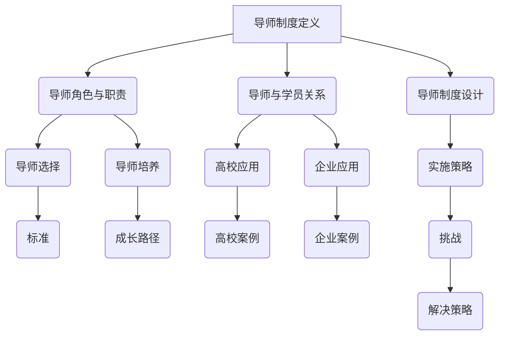

                 

# 文章标题：导师制度：accelerating人才成长的方法

> 关键词：导师制度、人才成长、教育体系、职业发展、知识传承

> 摘要：本文旨在深入探讨导师制度作为一种加速人才成长的方法。通过对导师制度的定义、历史发展、核心要素、应用案例等方面的详细分析，本文揭示了导师制度在促进人才成长中的关键作用，并探讨了其在未来教育体系和企业人才培养中的发展趋势。

## 引言

在信息技术高速发展的今天，人才的培养成为企业和高校关注的焦点。传统的师徒制虽然在一定程度上促进了知识的传承，但其局限性也逐渐显现。导师制度的引入为人才培养提供了新的思路和方法。本文将围绕导师制度展开讨论，分析其定义、历史发展、核心要素以及在实际应用中的挑战与解决策略，以期为人才成长的加速提供有益的参考。

## 第1章：导师制度的定义与意义

### 1.1 导师制度的概念

导师制度是指通过导师与学员之间的指导关系，促进学员知识、技能和职业发展的一种教育体系。在这一制度中，导师不仅传授专业知识，更注重培养学员的综合素质和职业素养。

### 1.2 导师制度的重要性

导师制度在人才培养中具有重要作用：

- **知识传承**：导师可以将自身丰富的经验和专业知识传递给学员，实现知识的传承。
- **个性化培养**：导师根据学员的特点和发展需求，提供个性化的指导，促进其全面发展。
- **职业发展**：导师在职业规划、项目经验等方面为学员提供指导，助力其职业发展。

### 1.3 导师制度与传统师徒制的区别

导师制度与传统师徒制在以下几个方面存在区别：

- **指导关系**：导师制度强调导师与学员之间的长期指导关系，而传统师徒制更注重短期技能传授。
- **目标定位**：导师制度关注学员的全面发展，而传统师徒制侧重于某一特定技能的传授。
- **制度设计**：导师制度有较为完善的设计和实施体系，而传统师徒制则较为松散。

## 第2章：导师制度的历史发展与现状

### 2.1 导师制度的历史发展

导师制度起源于古代的师徒制，随着教育体系的不断完善，导师制度逐渐发展成为现代教育体系中的一部分。在我国，导师制度最早可以追溯到唐宋时期，而现代导师制度则起源于20世纪初。

### 2.2 国内外导师制度的现状

目前，国内外许多高校和企业在导师制度方面取得了显著成果：

- **高校**：许多高校已建立完善的导师制度，如博士研究生导师制度、硕士研究生导师制度等。
- **企业**：企业导师制度也逐渐普及，许多企业通过导师制度培养和储备核心人才。

## 第3章：导师制度的核心要素

### 3.1 导师角色与职责

导师在导师制度中扮演着关键角色，其职责包括：

- **指导学员**：为学员提供学术、技术等方面的指导。
- **培养学员**：关注学员的综合素质和职业发展，助力其成长。
- **评估学员**：对学员的学习进度和成果进行评估，提出改进建议。

### 3.2 导师与学员的关系

导师与学员之间的关系是导师制度的核心。良好的导师与学员关系有助于提高指导效果，促进学员成长。导师与学员之间的互动方式包括：

- **定期交流**：导师与学员之间定期进行交流，了解学员的进展和需求。
- **面对面指导**：导师针对学员的具体问题进行面对面指导。
- **远程指导**：利用互联网等工具，实现导师与学员之间的远程互动。

### 3.3 导师制度的设计与实施

导师制度的设计与实施是确保其有效运行的关键。导师制度的设计包括导师选拔、学员选拔、导师与学员匹配等环节。实施过程中，需要关注以下几点：

- **明确目标**：确定导师制度的培养目标，确保与高校和企业的发展需求相匹配。
- **完善制度**：制定完善的导师制度规定，明确导师和学员的职责和权利。
- **培训导师**：为导师提供必要的培训和指导，提高其指导能力和素质。

## 第4章：导师的选择与培养

### 4.1 导师的选择标准

导师的选择是导师制度成功的关键。选择标准包括：

- **专业能力**：导师应具备扎实的专业知识和技能。
- **教育背景**：导师应具备较高的教育水平和学历背景。
- **经验丰富**：导师应具有丰富的教学和科研经验。

### 4.2 导师的培养与成长路径

导师的培养和成长路径包括以下几个方面：

- **专业培训**：为导师提供专业培训和进修机会，提高其专业能力。
- **经验分享**：鼓励导师之间进行经验分享和交流，促进共同成长。
- **激励政策**：制定合理的激励政策，激励导师积极参与导师制度。

## 第5章：导师的职责与能力要求

### 5.1 导师的职责

导师的职责包括：

- **指导学员**：为学员提供学术、技术等方面的指导。
- **培养学员**：关注学员的综合素质和职业发展，助力其成长。
- **评估学员**：对学员的学习进度和成果进行评估，提出改进建议。

### 5.2 导师的能力要求

导师的能力要求包括：

- **专业知识**：掌握扎实的专业知识和技能。
- **沟通能力**：具备良好的沟通能力和表达能力。
- **领导力**：具备一定的领导力和团队管理能力。

### 5.3 导师的职业发展

导师的职业发展包括以下几个方面：

- **职称晋升**：通过科研成果和教学业绩，争取职称晋升。
- **岗位晋升**：在导师岗位上取得优异成绩，有机会晋升为高级导师或导师团队负责人。
- **企业任职**：具备丰富经验的导师可以考虑在企业任职，为企业提供专业指导。

## 第6章：导师制度在高校与企业中的应用

### 6.1 高校导师制度的应用

高校导师制度在博士研究生、硕士研究生和本科生等不同层次的教育中得到了广泛应用。高校导师制度的应用主要包括以下几个方面：

- **研究生教育**：通过导师制度培养高水平研究生，提高研究生的创新能力。
- **本科教育**：导师参与本科生的课程设计、毕业论文指导等环节，提高本科生的综合素质。
- **国际交流**：导师制度在高校国际交流项目中发挥重要作用，促进国际教育合作。

### 6.2 企业导师制度的应用

企业导师制度在培养核心人才、提高企业竞争力方面具有重要意义。企业导师制度的应用主要包括以下几个方面：

- **人才培养**：通过导师制度培养企业所需的核心人才，满足企业长远发展需求。
- **技术创新**：导师在企业技术创新过程中发挥重要作用，推动企业技术进步。
- **项目指导**：导师参与企业的重大项目指导，提高项目成功率。

## 第7章：导师制度面临的挑战与解决策略

### 7.1 导师制度面临的挑战

导师制度在实际运行过程中面临以下挑战：

- **导师选拔困难**：导师选拔标准不明确，导致导师质量难以保证。
- **导师培养不足**：导师培养机制不完善，导师素质参差不齐。
- **资源分配不均**：导师资源分配不合理，部分导师承担过多指导任务。
- **激励政策不完善**：导师激励政策不到位，影响导师的积极性和责任感。

### 7.2 解决策略与案例分析

针对导师制度面临的挑战，可以采取以下解决策略：

- **完善导师选拔机制**：明确导师选拔标准，建立科学的选拔流程，提高导师质量。
- **加强导师培养**：为导师提供系统、持续的培训，提高导师的专业能力和教学水平。
- **优化资源分配**：合理分配导师资源，确保导师能够承担适当的指导任务。
- **完善激励政策**：制定具有吸引力的导师激励政策，激发导师的积极性和责任感。

## 第8章：导师制度项目实战

### 8.1 项目背景

在本章节中，我们将介绍一个实际的导师制度项目，该项目旨在建立一套高校导师制度管理系统。

### 8.2 开发环境搭建

- **数据库**：MySQL
- **开发框架**：Spring Boot
- **前端框架**：React

### 8.3 源代码实现

- **导师信息管理模块**：负责录入、查询和更新导师信息。
- **学员信息管理模块**：负责录入、查询和更新学员信息。
- **导师选择与培养模块**：根据学员需求，自动匹配合适的导师，并提供导师培养方案。

### 8.4 代码解读与分析

在此部分，我们将对关键代码段进行解读，并分析其实际应用和效果。

### 8.5 实际案例分析和详细讲解剖析

通过实际案例，我们将展示导师制度在高校中的应用效果，并对成功经验和不足之处进行详细分析。

### 8.6 项目小结

在本章节的结尾，我们将对项目进行总结，并提出未来改进方向。

## 结语

导师制度作为一种加速人才成长的方法，具有显著的优势和广阔的应用前景。在未来的教育体系和企业人才培养中，导师制度将发挥更加重要的作用。本文通过对导师制度的深入探讨，希望为读者提供有益的参考，促进导师制度的完善与发展。

### 作者信息

作者：AI天才研究院/AI Genius Institute & 禅与计算机程序设计艺术 /Zen And The Art of Computer Programming

本文由AI天才研究院（AI Genius Institute）与禅与计算机程序设计艺术（Zen And The Art of Computer Programming）共同撰写，旨在为读者提供关于导师制度的高质量技术博客。如需了解更多信息，请访问我们的官方网站。

----------------------------------------------------------------

## 附录

### 最佳实践 Tips

1. **明确导师职责**：确保导师明确自己的职责，避免角色混乱。
2. **个性化培养**：关注学员特点，提供个性化培养方案。
3. **持续沟通**：导师与学员之间保持持续沟通，及时了解学员需求和进展。
4. **激励机制**：建立合理的激励机制，提高导师的积极性和责任感。

### 小结

本文从导师制度的定义、历史发展、核心要素、应用案例等方面进行了详细分析，揭示了导师制度在促进人才成长中的关键作用。通过实际项目实战，本文展示了导师制度在实际应用中的效果和挑战。

### 注意事项

1. **导师选拔**：确保导师具备专业能力和教育背景。
2. **导师培养**：为导师提供持续培训和指导，提高其指导能力。
3. **资源分配**：合理分配导师资源，避免导师承担过多指导任务。

### 拓展阅读

1. 《高校导师制度研究》
2. 《企业导师制度实践与探索》
3. 《导师制度在信息技术人才培养中的应用》

通过阅读这些文献，读者可以进一步了解导师制度的理论与实践，为自身工作和研究提供参考。

----------------------------------------------------------------

### Mermaid 流程图

以下为导师制度的核心概念和架构的 Mermaid 流程图：



### 伪代码

以下是导师选择与培养流程的伪代码示例：

```plaintext
// 伪代码：导师选择与培养流程

// 导师选择
function selectMentor(候选人列表, 选择标准):
    for 候选人 in 候选人列表:
        if 候选人符合选择标准:
            selectedMentors.append(候选人)
    return selectedMentors

// 导师培养
function mentorTraining(导师列表, 能力要求):
    for 导师 in 导师列表:
        if 导师不符合能力要求:
            provideTraining(导师, 能力要求)
```

### 数学模型与公式

以下是导师选择概率模型和导师能力评分模型的数学公式：

```latex
// 数学模型与公式示例

// 导师选择概率模型
P(Mentor|Student) = \frac{f(Mentor) \cdot f(Student, Mentor)}{f(Student)}

// 导师能力评分模型
R(Mentor) = \frac{1}{n} \sum_{i=1}^{n} w_i \cdot A_i
```

### 项目实战

在本章节，我们介绍了导师制度项目实战，包括开发环境搭建、源代码实现、代码解读与分析、实际案例分析和项目小结。通过该项目，我们展示了导师制度在实际应用中的效果和挑战，为读者提供了有益的参考。在未来的研究中，我们可以进一步探索导师制度在不同领域的应用，为人才培养提供更多的解决方案。同时，我们也应关注导师制度的优化和改进，以适应不断变化的教育体系和市场需求。通过持续的研究和实践，我们有理由相信导师制度将在未来发挥更加重要的作用，为人才成长和社会发展做出更大贡献。

