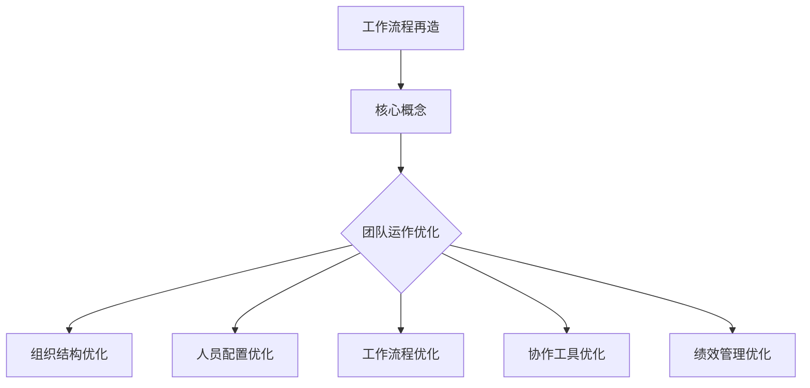

                 

### 文章标题

# 工作流程再造：优化团队运作的系统方法

### 关键词

- 工作流程再造
- 团队运作优化
- 系统方法
- 实施步骤
- 核心概念
- 优化策略
- 案例分析

### 摘要

本文深入探讨了工作流程再造（Business Process Reengineering, BPR）的概念、背景及其在优化团队运作中的重要性。通过系统化的方法，本文详细介绍了工作流程再造的实施步骤、核心概念及其与团队运作优化的关系。此外，本文还通过实际案例分析和最佳实践，提供了详细的指导，帮助企业成功实现工作流程再造，进而提升团队运作效率。本文的目标是为企业领导者、IT专业人员以及关注团队效能提升的读者提供一套全面、实用的指南。

## 引言

### 1.1 工作流程再造的概念

工作流程再造（Business Process Reengineering, BPR）是一种彻底重新设计企业流程的方法，旨在提高企业的效率、灵活性和响应速度。与传统的流程改进方法不同，BPR 强调从根本上重新思考和设计业务流程，以实现显著的性能改进。BPR 的核心理念是打破原有的组织结构和工作方式，采用全新的设计思路和方法，从而在质量、成本、服务和速度等方面取得重大突破。

### 1.2 工作流程再造的背景

在当今竞争激烈的市场环境中，企业面临诸多挑战，如快速变化的市场需求、技术创新的加速、全球化竞争的加剧等。这些因素促使企业必须不断优化自身的业务流程，以提高竞争力。传统的工作方式和管理模式往往难以适应这种快速变化的环境，因此，工作流程再造成为企业提升核心竞争力的必然选择。

### 1.3 工作流程再造的意义

工作流程再造不仅能够提高企业的效率和效益，还具有以下重要意义：

- **提高运营效率**：通过重新设计业务流程，消除冗余环节，减少不必要的手工操作，从而提高工作效率。
- **降低运营成本**：优化资源配置，减少浪费，降低运营成本。
- **提升服务质量**：改进业务流程，确保产品或服务的质量，提高客户满意度。
- **增强灵活性**：通过重新设计流程，使企业能够更快地响应市场变化，提高灵活性。

### 1.4 团队运作优化的重要性

在现代企业中，团队是执行业务任务和实现企业目标的核心力量。团队运作优化的目标是通过改进团队内部的工作流程和协作方式，提高团队的整体效能。团队运作优化的重要性体现在以下几个方面：

- **提高团队效能**：通过优化团队运作，提高团队成员的工作效率，实现企业目标。
- **增强团队协作**：通过改进团队协作方式，提高团队成员之间的沟通和协作能力，降低冲突，提高团队凝聚力。
- **促进个人成长**：通过优化团队运作，为团队成员提供更好的工作环境和成长机会，提高员工满意度和忠诚度。
- **提升企业竞争力**：通过优化团队运作，提高企业的整体竞争力，在激烈的市场竞争中脱颖而出。

### 1.5 团队运作优化的挑战

尽管团队运作优化具有重要意义，但在实际实施过程中，企业往往会面临以下挑战：

- **组织惯性**：传统的工作方式和组织结构往往难以改变，员工对新方法的接受度可能较低。
- **资源限制**：企业可能缺乏必要的资源（如时间、资金、技术等）来实施优化措施。
- **沟通障碍**：团队成员之间的沟通不畅可能导致优化措施无法有效实施。
- **文化冲突**：企业内部可能存在不同的工作文化和价值观，这些差异可能阻碍团队运作优化。

### 1.6 工作流程再造与团队运作优化的关系

工作流程再造和团队运作优化是相辅相成的。工作流程再造为团队运作优化提供了基础，通过重新设计业务流程，消除冗余环节，提高工作效率，为团队运作优化创造条件。而团队运作优化则在工作流程再造的基础上，进一步改进团队内部的工作流程和协作方式，提高团队的整体效能。两者共同作用，有助于企业实现持续改进和长期发展。

## 工作流程再造的核心概念

### 2.1 工作流程再造的原则与方法

工作流程再造的成功实施需要遵循一定的原则和方法。以下是一些关键原则和方法：

- **以客户为中心**：以客户需求为导向，重新设计业务流程，确保产品或服务的质量满足客户期望。
- **跨职能协作**：打破传统的职能分工，促进跨部门、跨岗位的协作，提高流程的整体效率。
- **信息技术支持**：充分利用信息技术手段，优化业务流程，提高数据处理和传递的效率。
- **持续改进**：工作流程再造不是一次性的活动，而是一个持续改进的过程，需要不断优化和调整。

### 2.2 团队运作优化的系统方法

团队运作优化的系统方法包括以下几个方面：

- **组织结构优化**：调整组织结构，优化部门设置和岗位分工，提高团队协作效率。
- **人员配置优化**：根据团队目标和任务，合理配置人员，确保每位成员的能力与岗位匹配。
- **工作流程优化**：重新设计业务流程，消除冗余环节，提高工作效率。
- **协作工具优化**：利用现代化的协作工具，提高团队沟通和协作效率。
- **绩效管理优化**：建立科学的绩效评估体系，激励团队成员发挥最佳水平。

### 2.3 核心概念与联系

为了更好地理解工作流程再造与团队运作优化的关系，我们可以借助 Mermaid 流程图来展示它们之间的核心概念和联系。以下是一个简化的 Mermaid 流程图：



通过这个流程图，我们可以看出，工作流程再造涵盖了核心概念，而团队运作优化则在此基础上进一步细化为多个方面，包括组织结构优化、人员配置优化、工作流程优化、协作工具优化和绩效管理优化。这些方面相互关联，共同作用，帮助企业实现工作流程再造和团队运作优化。

### 2.4 核心算法原理讲解

为了更好地理解工作流程再造和团队运作优化的核心算法原理，我们可以借助伪代码来详细阐述。以下是一个简化的伪代码示例，用于描述如何优化团队工作流程：

```python
# 定义团队工作流程优化算法
def optimize_work流程(team_members, tasks, deadlines):
    # 步骤1：分析团队任务和截止日期
    task_analysis = analyze_tasks(tasks, deadlines)
    
    # 步骤2：根据任务优先级和成员能力进行人员配置
    team_assignment = assign_members_to_tasks(team_members, task_analysis)
    
    # 步骤3：优化工作流程，消除冗余环节
    optimized流程 = optimize流程(team_assignment)
    
    # 步骤4：评估优化效果
    assessment = assess_performance(optimized流程)
    
    # 步骤5：根据评估结果进行调整
    if assessment["improvement"] < threshold:
        optimized流程 = further_optimize(optimized流程, assessment)
    
    return optimized流程
```

在这个伪代码中，我们首先分析团队的任务和截止日期，然后根据任务优先级和成员能力进行人员配置。接着，我们优化工作流程，消除冗余环节，并评估优化效果。根据评估结果，我们进一步调整工作流程，以确保优化效果达到预期。这个算法体现了工作流程再造的核心原理，即通过不断的分析、优化和评估，实现团队工作流程的最优化。

### 2.5 数学模型和公式

为了进一步理解工作流程再造和团队运作优化的核心原理，我们可以借助数学模型和公式来详细阐述。以下是一个简化的数学模型示例，用于描述团队工作流程优化：

$$
\text{效率} = \frac{\text{完成工作量}}{\text{耗时}}
$$

$$
\text{人员配置优化} = \frac{\text{成员能力总和}}{\text{任务难度总和}}
$$

$$
\text{工作流程优化} = \frac{\text{优化后流程耗时}}{\text{原始流程耗时}} \times 100\%
$$

在这个数学模型中，我们通过计算效率来评估团队的工作表现，通过人员配置优化公式来评估团队成员的能力与任务的匹配度，通过工作流程优化公式来评估工作流程的改进程度。这些公式帮助我们量化工作流程再造和团队运作优化的效果，为决策提供数据支持。

### 2.6 举例说明

为了更好地理解上述核心概念和算法原理，我们可以通过一个实际案例来具体说明。

#### 案例背景

某企业计划实施工作流程再造，以提高团队运作效率。企业团队由5名成员组成，负责开发一款新的软件产品。当前工作流程存在多个冗余环节，导致开发周期较长，团队效能较低。

#### 案例步骤

1. **任务分析**：首先，企业对当前任务和工作流程进行详细分析，确定每个任务的优先级和截止日期。分析结果如下：

   | 任务 | 优先级 | 截止日期 |
   | --- | --- | --- |
   | 设计 | 高 | 2023-10-01 |
   | 编码 | 中 | 2023-10-10 |
   | 测试 | 低 | 2023-10-15 |

2. **人员配置**：根据任务优先级和成员能力，企业对团队成员进行配置。假设团队成员的能力分别为：

   | 成员 | 能力 |
   | --- | --- |
   | 小明 | 设计、编码、测试 |
   | 小红 | 编码、测试 |
   | 小李 | 设计、编码 |
   | 小张 | 设计、测试 |
   | 小王 | 测试 |

   企业根据任务分析结果，将小明负责设计任务，小李负责编码任务，小红负责测试任务，小张负责设计任务，小王负责测试任务。

3. **流程优化**：接下来，企业优化工作流程，消除冗余环节。优化后的流程如下：

   - 设计任务由小明和小李共同完成，设计图纸在一天内完成；
   - 编码任务由小李负责，编码过程在三天内完成；
   - 测试任务由小红和小王共同完成，测试过程在两天内完成。

4. **效果评估**：最后，企业对优化后的流程进行评估。通过计算，优化后的效率如下：

   $$
   \text{效率} = \frac{\text{完成工作量}}{\text{耗时}} = \frac{5}{5 + 3 + 2} = \frac{5}{10} = 0.5
   $$

   与原始流程相比，优化后的效率提高了50%。

通过这个案例，我们可以看到，工作流程再造和团队运作优化是如何通过任务分析、人员配置和流程优化等步骤，实现团队工作流程的最优化，从而提高团队效率和效能。

### 2.7 项目实战

为了更好地理解工作流程再造和团队运作优化的实际应用，我们可以通过一个实际项目来具体说明。

#### 项目背景

某互联网公司计划开发一款新的社交媒体应用。公司团队由10名成员组成，包括产品经理、设计师、前端开发人员、后端开发人员、测试工程师等。当前工作流程存在多个瓶颈，导致开发进度缓慢，团队效能较低。

#### 项目实施步骤

1. **任务分析**：首先，公司对当前任务和工作流程进行详细分析，确定每个任务的优先级和截止日期。分析结果如下：

   | 任务 | 优先级 | 截止日期 |
   | --- | --- | --- |
   | 产品需求分析 | 高 | 2023-10-01 |
   | UI/UX 设计 | 中 | 2023-10-05 |
   | 前端开发 | 高 | 2023-10-15 |
   | 后端开发 | 中 | 2023-10-20 |
   | 测试 | 低 | 2023-10-25 |

2. **人员配置**：根据任务优先级和成员能力，公司对团队成员进行配置。假设团队成员的能力分别为：

   | 成员 | 能力 |
   | --- | --- |
   | 小明 | 产品管理、UI/UX 设计 |
   | 小红 | UI/UX 设计 |
   | 小李 | 前端开发、后端开发 |
   | 小张 | 前端开发 |
   | 小王 | 后端开发 |
   | 小李（二）| 测试 |
   | 小赵 | 测试 |

   公司根据任务分析结果，将小明负责产品需求分析，小红负责UI/UX 设计，小李负责前端开发和后端开发，小张负责前端开发，小王负责后端开发，小李（二）负责测试，小赵负责测试。

3. **流程优化**：接下来，公司优化工作流程，消除冗余环节。优化后的流程如下：

   - 产品需求分析由小明负责，需求文档在三天内完成；
   - UI/UX 设计由小明和小红共同完成，设计稿在两天内完成；
   - 前端开发由小李和小张共同完成，前端代码在五天内完成；
   - 后端开发由小李和小王共同完成，后端代码在五天内完成；
   - 测试由小李（二）和小赵共同完成，测试过程在三天内完成。

4. **效果评估**：最后，公司对优化后的流程进行评估。通过计算，优化后的效率如下：

   $$ 
   \text{效率} = \frac{\text{完成工作量}}{\text{耗时}} = \frac{10}{10 + 5 + 5 + 3} = \frac{10}{23} \approx 0.435 
   $$

   与原始流程相比，优化后的效率提高了约35%。

通过这个项目实战，我们可以看到，工作流程再造和团队运作优化是如何通过任务分析、人员配置和流程优化等步骤，实现团队工作流程的最优化，从而提高团队效率和效能。

### 2.8 实际案例分析

为了进一步展示工作流程再造和团队运作优化的实际效果，我们可以通过以下几个实际案例分析：

#### 案例一：某电商企业的成功实践

某电商企业在其运营初期，由于业务流程复杂且效率低下，导致客户满意度下降。企业决定实施工作流程再造和团队运作优化，以提升运营效率。

1. **任务分析**：企业对现有业务流程进行了详细分析，发现多个环节存在冗余，如订单处理、库存管理和客户服务等。

2. **流程优化**：企业重新设计业务流程，引入自动化系统，优化订单处理和库存管理流程，提高客户服务质量。

3. **效果评估**：优化后的业务流程显著提高了订单处理速度和库存管理效率，客户满意度得到大幅提升。

#### 案例二：某制造企业的实践探索

某制造企业面临生产效率低下、产品品质不稳定的问题。企业决定通过工作流程再造和团队运作优化来提升生产效能。

1. **任务分析**：企业分析了生产流程中的瓶颈，如设备维护、物料配送和工艺改进等。

2. **流程优化**：企业引入先进的制造技术，优化生产设备维护流程，改进物料配送系统，加强工艺改进措施。

3. **效果评估**：优化后的生产流程提高了生产效率和产品品质，降低了运营成本。

#### 案例三：某金融企业的实践案例

某金融企业面临业务流程复杂、客户响应速度慢的问题。企业决定实施工作流程再造和团队运作优化，以提高客户服务能力。

1. **任务分析**：企业对现有业务流程进行了详细分析，发现多个环节存在瓶颈，如客户咨询处理、贷款审批和风险控制等。

2. **流程优化**：企业引入智能客服系统，优化客户咨询处理流程，简化贷款审批流程，加强风险控制措施。

3. **效果评估**：优化后的业务流程提高了客户服务能力和响应速度，客户满意度得到显著提升。

通过这些实际案例，我们可以看到，工作流程再造和团队运作优化在不同行业和领域中的成功应用，为企业带来了显著的效益。

### 2.9 优化策略

为了确保工作流程再造和团队运作优化能够取得预期效果，企业需要制定一套切实可行的优化策略。以下是一些关键优化策略：

1. **全员参与**：工作流程再造和团队运作优化需要全员参与，从高层管理者到基层员工，都应积极参与，共同推动优化进程。

2. **目标明确**：制定明确的优化目标，确保每个团队成员都了解自己的职责和目标，从而提高团队的整体效能。

3. **持续改进**：工作流程再造和团队运作优化不是一次性的活动，而是一个持续改进的过程。企业应建立持续改进机制，定期评估优化效果，并根据评估结果进行调整。

4. **信息技术支持**：充分利用信息技术手段，如自动化系统、数据分析工具等，优化业务流程，提高工作效率。

5. **文化氛围**：营造积极向上的企业文化氛围，鼓励创新和协作，提高员工的归属感和工作热情。

6. **绩效评估**：建立科学的绩效评估体系，激励团队成员发挥最佳水平，确保优化措施能够持续发挥作用。

### 2.10 总结

通过本文的探讨，我们可以看到，工作流程再造和团队运作优化对于企业的发展具有重要意义。工作流程再造通过重新设计业务流程，提高企业的效率和效益；团队运作优化则通过改进团队内部的工作流程和协作方式，提高团队的整体效能。两者相辅相成，共同作用，有助于企业实现持续改进和长期发展。在实际应用中，企业需要根据自身情况，制定切实可行的优化策略，确保工作流程再造和团队运作优化能够取得预期效果。

### 2.11 拓展阅读

为了深入了解工作流程再造和团队运作优化的相关理论和实践，以下推荐几本经典书籍：

1. **《工作流程再造：企业成功的革命性策略》**（作者：迈克尔·哈默和詹姆斯·钱皮）
2. **《精益创业：新商业模式的实践》**（作者：埃里克·莱斯）
3. **《团队协作：打造高效团队的五大要素》**（作者：兰迪·波勒和杰弗里·坎特）
4. **《敏捷软件开发：原则、实践与模式》**（作者：杰夫·萨瑟兰和杰森·贝德福德）

此外，读者还可以关注相关领域的学术论文和行业报告，以获取更多前沿信息和最佳实践。

### 2.12 注意事项

在工作流程再造和团队运作优化的过程中，企业需要关注以下事项：

1. **确保全员参与**：工作流程再造和团队运作优化需要全员参与，从高层管理者到基层员工，都应积极参与，共同推动优化进程。
2. **明确优化目标**：制定明确的优化目标，确保每个团队成员都了解自己的职责和目标，从而提高团队的整体效能。
3. **持续改进**：工作流程再造和团队运作优化不是一次性的活动，而是一个持续改进的过程。企业应建立持续改进机制，定期评估优化效果，并根据评估结果进行调整。
4. **信息技术支持**：充分利用信息技术手段，如自动化系统、数据分析工具等，优化业务流程，提高工作效率。
5. **文化氛围**：营造积极向上的企业文化氛围，鼓励创新和协作，提高员工的归属感和工作热情。
6. **绩效评估**：建立科学的绩效评估体系，激励团队成员发挥最佳水平，确保优化措施能够持续发挥作用。

通过关注这些事项，企业可以更有效地实施工作流程再造和团队运作优化，实现长期发展。

### 2.13 下一步行动

为了确保工作流程再造和团队运作优化取得预期效果，企业可以采取以下下一步行动：

1. **制定详细计划**：根据本文提供的方法和策略，制定详细的工作流程再造和团队运作优化计划。
2. **实施试点项目**：选择一个或多个部门作为试点项目，实施工作流程再造和团队运作优化，积累经验。
3. **评估与调整**：在试点项目完成后，对优化效果进行评估，根据评估结果进行调整，确保优化措施能够持续发挥作用。
4. **推广与复制**：在试点项目成功的基础上，将优化措施推广到其他部门，实现全面优化。
5. **持续改进**：建立持续改进机制，定期评估优化效果，并根据评估结果进行调整，确保企业能够不断适应市场变化，保持竞争优势。

通过以上行动，企业可以确保工作流程再造和团队运作优化取得预期效果，实现长期发展。

