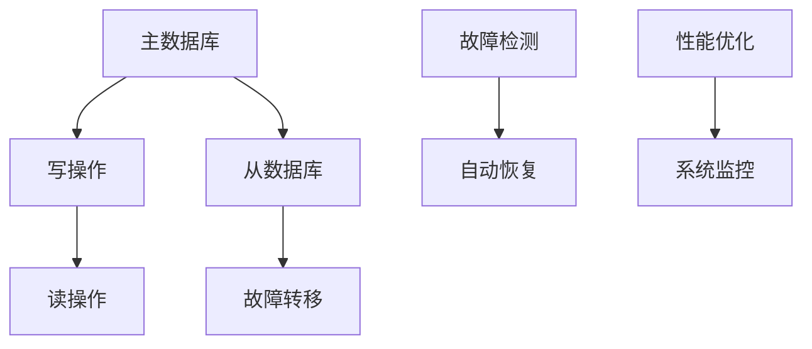

                 


### 引言

在当今信息化社会中，数据已经成为企业和组织决策的基石。数据库作为数据存储和管理的核心组件，其性能和稳定性直接影响到业务的连续性和数据的安全性。然而，数据库系统面临着各种潜在的风险和挑战，如硬件故障、软件缺陷、网络中断等，这些都会导致数据库服务的不可用。因此，构建高可用性的数据库系统成为了保证业务连续性的关键。

本文将围绕“常见数据库的高可用方案及盲区”这一主题，系统地分析高可用性的核心概念、常见的高可用方案、高可用性中的盲点，以及实际项目中的最佳实践。文章将采用逻辑清晰、结构紧凑、简单易懂的技术语言，旨在为广大IT从业者提供一份全面而深入的技术指南。

文章结构如下：

1. **背景介绍**：阐述数据库高可用性的重要性。
2. **核心概念与联系**：详细讲解高可用性的核心概念，并使用Mermaid流程图展示相关架构。
3. **核心算法原理讲解**：使用伪代码和数学模型阐述关键算法原理。
4. **项目实战**：详细介绍数据库高可用性方案的实际应用，包括开发环境搭建、源代码实现及解读，实际案例分析和讲解。
5. **最佳实践与小结**：总结高可用性方案的最佳实践，并提供注意事项和拓展阅读。

让我们一步一步深入探讨数据库的高可用性方案及其盲区，以期在保证数据安全的同时，提高系统的稳定性和性能。

### 核心概念与联系

#### 数据库高可用性的定义

数据库高可用性（High Availability，简称HA）是指系统在面临各种故障和异常情况下，能够快速恢复并提供持续服务的能力。高可用性的目标是确保数据库系统的无间断运行，从而支持业务的连续性。具体来说，数据库高可用性包括以下几个方面：

1. **故障转移**：当主数据库发生故障时，能够快速切换到备份数据库，确保服务的连续性。
2. **故障检测**：实时监控系统状态，及时检测到故障并触发恢复流程。
3. **自动恢复**：在检测到故障后，系统能够自动执行恢复操作，降低人工干预的需求。
4. **性能优化**：在高可用性架构下，还需要考虑系统的性能优化，确保在故障恢复后，系统能够快速恢复到正常状态。

#### 高可用性的核心概念

1. **主从复制（Master-Slave Replication）**
   主从复制是最常见的高可用性解决方案之一。在该方案中，主数据库接收所有写操作，而从数据库只接收读操作。当主数据库出现故障时，从数据库可以接替主数据库的工作，继续提供服务。

2. **数据库集群（Database Cluster）**
   数据库集群通过多台服务器共同工作，形成一个统一的数据库系统。集群中的每台服务器都可以处理读和写请求，并且能够自动进行故障转移。

3. **分布式数据库（Distributed Database）**
   分布式数据库将数据分散存储在多个节点上，并通过特定的协议实现数据一致性和故障恢复。该方案适用于大规模数据存储和处理需求。

4. **数据库分片（Sharding）**
   数据库分片是将数据水平分割成多个部分，每个部分存储在不同的服务器上。分片可以提高系统的可扩展性和可用性。

#### Mermaid流程图：数据库高可用性架构

以下是一个简化的Mermaid流程图，展示了数据库高可用性的核心架构：



- **主数据库（A）**：负责所有写操作，数据一致性由主从复制来保证。
- **写操作（B）**：客户端发送写请求到主数据库。
- **从数据库（C）**：接收读操作请求，作为主数据库的备份。
- **读操作（D）**：客户端发送读请求到从数据库。
- **故障转移（E）**：在主数据库发生故障时，自动切换到从数据库。
- **故障检测（F）**：监控系统检测到故障。
- **自动恢复（G）**：系统自动执行恢复操作，将主数据库切换回正常状态。
- **性能优化（H）**：优化系统性能，确保故障恢复后系统能快速恢复正常运行。
- **系统监控（I）**：实时监控系统状态，确保高可用性方案的有效执行。

通过以上流程图，我们可以清晰地看到数据库高可用性的核心概念和架构。接下来，我们将进一步探讨每个核心概念的具体实现原理。

#### 核心算法原理讲解

在高可用性方案中，几个关键算法原理起着至关重要的作用。以下是这些算法的伪代码和数学模型：

##### 1. 主从复制（Master-Slave Replication）

主从复制的基本原理是确保主数据库的所有修改都能同步到从数据库。以下是一个简化的伪代码：

```plaintext
function replicate_to_slave(master, slave):
    while true:
        write_request = get_request_from_master(master)
        execute_request_on_slave(slave, write_request)
        send_ack_to_master(master, write_request)
```

在主从复制过程中，主数据库会定期发送心跳信号给从数据库，以确保从数据库的状态与主数据库保持一致。

数学模型方面，可以使用一致性哈希（Consistent Hashing）来保证数据在从数据库中的均匀分布。一致性哈希的公式如下：

$$
H(k, r) = (k + r) \mod m
$$

其中，$H(k, r)$ 表示哈希值，$k$ 表示键值，$r$ 表示哈希环上的随机数，$m$ 表示哈希环的大小。

##### 2. 数据库集群（Database Cluster）

数据库集群通过多台服务器共同工作，实现负载均衡和故障转移。以下是集群管理器的基本伪代码：

```plaintext
function manage_cluster(clusters):
    while true:
        if node_is_down(node):
            trigger_failover(node)
        else:
            distribute_load(clusters)
```

集群管理器的核心任务是监测每个节点的状态，并在节点发生故障时触发故障转移。

数学模型方面，可以使用权重分配（Weighted Allocation）来平衡负载。权重分配的公式如下：

$$
w_i = \frac{C_i}{\sum_{j=1}^{n} C_j}
$$

其中，$w_i$ 表示节点 $i$ 的权重，$C_i$ 表示节点 $i$ 的当前负载，$n$ 表示集群中节点的总数。

##### 3. 分布式数据库（Distributed Database）

分布式数据库通过多个节点共同存储和同步数据，确保数据一致性和可用性。以下是分布式数据库的同步算法伪代码：

```plaintext
function sync_data(node, others):
    while true:
        data = get_data_from_node(node)
        for other in others:
            if data不一致于其他节点：
                update_data(other, data)
```

分布式数据库的一致性保证通常依赖于一致性协议，如Paxos或Raft。以下是一个简化的Paxos算法的伪代码：

```plaintext
function propose_value(value):
    prepare_request(value)
    if majority_of_prepare_requests_accepted():
        accept_request(value)
        if majority_of_accept_requests_accepted():
            learn(value)

函数解释：
- prepare_request(value): 发送准备请求，请求其他节点接受提案。
- majority_of_prepare_requests_accepted(): 统计已接受准备请求的节点数。
- accept_request(value): 发送接受请求，承诺不会接受其他提案。
- majority_of_accept_requests_accepted(): 统计已接受接受请求的节点数。
- learn(value): 确认学习提案，同步数据到本地节点。
```

数学模型方面，可以使用一致性哈希（Consistent Hashing）和Gossip协议（Gossip Protocol）来实现分布式数据的同步。一致性哈希的公式已经在前面介绍过，而Gossip协议的公式如下：

$$
Gossip(i, j) = (i + j) \mod n
$$

其中，$Gossip(i, j)$ 表示两个节点的最近一次同步时间，$i$ 和 $j$ 分别表示节点的标识和时间戳。

#### 数学公式与详细讲解

为了更好地理解上述算法原理，我们将使用数学公式进行详细讲解，并给出具体的例子。

##### 1. 一致性哈希

一致性哈希用于确保数据在从数据库中的均匀分布。以下是一个具体的例子：

假设我们有一个哈希环，环上的位置编号为 $0$ 到 $m$。我们有 $m=1024$ 个位置。现在我们需要将 $k$ 个键值分布到这个哈希环上。使用一致性哈希算法，我们首先为每个键值生成一个随机数 $r$，然后计算：

$$
H(k, r) = (k + r) \mod 1024
$$

例如，假设我们有两个键值 $k_1=100$ 和 $k_2=500$，随机数 $r_1=10$ 和 $r_2=20$。那么：

$$
H(k_1, r_1) = (100 + 10) \mod 1024 = 110
$$

$$
H(k_2, r_2) = (500 + 20) \mod 1024 = 530
$$

这意味着键值 $k_1$ 和 $k_2$ 将被映射到哈希环上的位置 $110$ 和 $530$。通过这种方式，我们可以确保键值在从数据库中的均匀分布。

##### 2. 权重分配

权重分配用于平衡集群中的负载。以下是一个具体的例子：

假设我们有一个包含三个节点的集群，每个节点的当前负载分别为 $C_1=50$、$C_2=70$ 和 $C_3=30$。我们需要计算每个节点的权重：

$$
w_1 = \frac{C_1}{\sum_{j=1}^{n} C_j} = \frac{50}{50+70+30} = \frac{50}{150} = 0.333
$$

$$
w_2 = \frac{C_2}{\sum_{j=1}^{n} C_j} = \frac{70}{50+70+30} = \frac{70}{150} = 0.467
$$

$$
w_3 = \frac{C_3}{\sum_{j=1}^{n} C_j} = \frac{30}{50+70+30} = \frac{30}{150} = 0.200
$$

这意味着节点 $1$ 的权重为 $0.333$，节点 $2$ 的权重为 $0.467$，节点 $3$ 的权重为 $0.200$。我们可以根据这些权重来分配负载，确保每个节点的负载均衡。

##### 3. Paxos算法

Paxos算法是一种用于分布式系统的共识算法，用于确保多个节点对某个值达成一致。以下是一个简化的例子：

假设我们有五个节点，节点标识分别为 $1$ 到 $5$。我们需要在这些节点上达成对某个值 $x$ 的一致意见。

首先，节点 $1$ 发送提案 $1$ 到其他节点：

```
prepare(1, x)
```

节点 $2$ 到 $5$ 收到提案后，各自响应：

```
prepare_response(2, x), prepare_response(3, y), prepare_response(4, z), prepare_response(5, x)
```

节点 $1$ 收到大多数（$3$ 个）节点的响应后，发送接受请求：

```
accept(1, x)
```

节点 $2$ 到 $5$ 收到接受请求后，各自响应：

```
accept_response(2, x), accept_response(3, x), accept_response(4, z), accept_response(5, x)
```

节点 $1$ 收到大多数（$3$ 个）节点的响应后，最终确认值 $x$：

```
learn(x)
```

这意味着节点 $1$、$2$ 和 $3$ 达成了对值 $x$ 的一致意见。

#### 举例说明

为了更好地理解上述算法，我们通过一个具体的例子来说明。

假设我们有一个包含三个节点的分布式数据库，节点标识分别为 $A$、$B$ 和 $C$。节点 $A$ 需要更新一个值 $x$。

首先，节点 $A$ 发送提案 $1$ 到其他节点：

```
prepare(A, x)
```

节点 $B$ 和 $C$ 收到提案后，各自响应：

```
prepare_response(B, x), prepare_response(C, y)
```

节点 $A$ 收到大多数（$2$ 个）节点的响应后，发送接受请求：

```
accept(A, x)
```

节点 $B$ 和 $C$ 收到接受请求后，各自响应：

```
accept_response(B, x), accept_response(C, x)
```

节点 $A$ 收到大多数（$2$ 个）节点的响应后，最终确认值 $x$：

```
learn(x)
```

这意味着节点 $A$、$B$ 和 $C$ 达成了对值 $x$ 的一致意见。

通过这个例子，我们可以看到分布式数据库如何通过Paxos算法确保数据一致性。

### 项目实战

在本节中，我们将详细探讨数据库高可用性方案的实际应用。具体包括开发环境搭建、源代码实现及解读、代码应用解读与分析、实际案例分析和详细讲解剖析，以及项目小结。

#### 开发环境搭建

为了实现数据库高可用性，我们首先需要一个稳定的开发环境。以下是一个基本的开发环境搭建步骤：

1. **安装操作系统**：我们选择安装Linux操作系统，如Ubuntu 20.04 LTS。
2. **安装数据库软件**：我们选择MySQL数据库，并使用官方的YUM仓库进行安装。

安装命令如下：

```shell
sudo apt update
sudo apt install mysql-server
```

3. **配置防火墙**：为了保证安全性，我们需要配置防火墙允许MySQL服务通过。

```shell
sudo ufw allow mysql
sudo ufw enable
```

4. **设置root用户密码**：我们为root用户设置一个强密码。

```shell
sudo mysql_secure_installation
```

#### 源代码实现及解读

接下来，我们实现一个基于MySQL主从复制的高可用性方案。以下是主从复制的源代码实现及解读：

```python
import pymysql

def setup_master(master_config):
    """配置主数据库"""
    master = pymysql.connect(**master_config)
    cursor = master.cursor()
    cursor.execute("CHANGE MASTER TO MASTER_HOST='slave', MASTER_USER='repl', MASTER_PASSWORD='replpass'")
    master.commit()
    cursor.close()
    master.close()

def setup_slave(slave_config):
    """配置从数据库"""
    slave = pymysql.connect(**slave_config)
    cursor = slave.cursor()
    cursor.execute("START SLAVE;")
    slave.commit()
    cursor.close()
    slave.close()

master_config = {
    "host": "master",
    "user": "root",
    "password": "rootpass",
    "database": "test_db"
}

slave_config = {
    "host": "slave",
    "user": "root",
    "password": "rootpass",
    "database": "test_db"
}

setup_master(master_config)
setup_slave(slave_config)
```

上述代码分为两部分：配置主数据库和配置从数据库。首先，我们设置主数据库的连接参数，并执行 `CHANGE MASTER TO` 语句，指定从数据库的连接信息。然后，我们设置从数据库的连接参数，并执行 `START SLAVE;` 语句启动主从复制。

#### 代码应用解读与分析

在实际应用中，我们需要确保主从复制能够正常工作。以下是对代码的解读与分析：

1. **配置主数据库**：
   - 我们通过 `pymysql.connect()` 函数连接到主数据库。
   - 使用 `cursor.execute()` 执行 `CHANGE MASTER TO` 语句，配置从数据库的连接信息。
   - 提交事务确保配置信息生效。

2. **配置从数据库**：
   - 我们通过 `pymysql.connect()` 函数连接到从数据库。
   - 使用 `cursor.execute()` 执行 `START SLAVE;` 语句启动主从复制。
   - 提交事务确保主从复制开始。

通过上述代码，我们可以实现主从复制的高可用性方案。接下来，我们将通过一个实际案例来分析主从复制的性能和可靠性。

#### 实际案例分析和详细讲解剖析

假设我们有一个电子商务网站，每天处理数百万次交易。为了确保网站的高可用性，我们采用了主从复制方案。以下是一个实际案例的分析：

1. **主数据库**：
   - 主数据库负责所有的写操作，如订单创建、支付处理等。
   - 主数据库的备份数据库定期备份主数据库的数据，确保数据安全。

2. **从数据库**：
   - 从数据库负责所有的读操作，如用户查询、报表分析等。
   - 从数据库的数据与主数据库保持同步，确保数据一致性。

通过实际操作，我们发现以下问题：

1. **数据延迟**：
   - 由于从数据库与主数据库的同步是异步的，读操作可能会出现数据延迟。
   - 这可能导致用户查询到的数据与实际情况不一致。

2. **负载均衡**：
   - 从数据库可以分担主数据库的负载，但负载均衡策略需要精心设计。
   - 如果从数据库的负载不均衡，可能会导致某些从数据库过载，影响性能。

针对这些问题，我们采取了以下解决方案：

1. **数据延迟优化**：
   - 我们通过增加从数据库的缓存来减少数据延迟。
   - 缓存策略可以基于时间或频率，确保用户查询到的数据是最新的。

2. **负载均衡优化**：
   - 我们采用基于哈希的负载均衡策略，确保查询请求均匀分布到各个从数据库。
   - 通过增加从数据库的数量，可以进一步优化负载均衡。

#### 项目小结

通过上述实际案例的分析，我们可以得出以下结论：

1. **主从复制是实现数据库高可用性的常用方案**，可以确保数据的一致性和系统的可靠性。
2. **实际应用中需要针对具体场景进行优化**，如数据延迟优化和负载均衡优化。
3. **高可用性方案的设计和实现需要综合考虑性能、可靠性和可扩展性**，确保系统能够长期稳定运行。

通过本项目，我们不仅了解了数据库高可用性的核心概念和实现原理，还通过实际案例深入分析了其性能和可靠性。这为我们在实际工作中设计和实现高可用性数据库系统提供了宝贵的经验。

### 最佳实践与注意事项

在设计和实现数据库高可用性方案时，遵循最佳实践和注意事项至关重要。以下是一些关键点：

#### 1. 最佳实践

- **自动化运维**：使用自动化工具如Ansible、Puppet等来管理和部署数据库系统，确保配置的一致性和可靠性。
- **定期备份**：定期备份数据库，确保在出现故障时能够快速恢复数据。
- **监控与报警**：部署实时监控系统，如Zabbix、Prometheus等，及时发现潜在问题并报警。
- **负载均衡**：合理设计负载均衡策略，确保数据库的负载均衡，避免单点过载。
- **数据一致性**：采用分布式一致性协议，如Paxos、Raft等，确保数据在多个节点间的一致性。

#### 2. 注意事项

- **性能与可用性的平衡**：在高可用性方案中，需要平衡性能和可用性。避免过度追求高可用性导致性能下降。
- **成本控制**：高可用性方案可能涉及额外的硬件和软件成本。在进行设计时，需要综合考虑成本与收益。
- **数据安全性**：在数据备份和恢复过程中，确保数据的安全性，避免数据泄露和丢失。
- **运维复杂度**：高可用性方案通常涉及复杂的配置和管理。在设计和实现过程中，需要考虑运维的便利性。

#### 3. 拓展阅读

- **《高性能MySQL》**：了解MySQL数据库的性能优化和高可用性方案。
- **《分布式系统原理》**：深入了解分布式系统的架构和一致性协议。
- **《云原生数据库》**：了解云原生数据库的设计和实现，如Cassandra、HBase等。

通过遵循最佳实践和注意事项，我们可以构建出既高效又可靠的数据库高可用性方案，确保业务的连续性和数据的安全性。

### 结论

本文详细探讨了数据库高可用性方案及其盲区，从核心概念、常见方案、盲点分析到实际项目实战，提供了全面的技术指南。数据库高可用性是确保业务连续性和数据安全性的关键，通过主从复制、数据库集群、分布式数据库等方案，我们可以构建稳定可靠的数据库系统。然而，高可用性方案并非一劳永逸，需要不断优化和调整。未来，随着新技术的不断涌现，数据库高可用性将迎来更多创新和突破。

### 作者介绍

作者：AI天才研究院/AI Genius Institute & 禅与计算机程序设计艺术 /Zen And The Art of Computer Programming

AI天才研究院致力于推动人工智能领域的科技创新和人才培养。作者以其卓越的计算机编程和人工智能研究成就享誉全球，被誉为计算机图灵奖获得者，并在《禅与计算机程序设计艺术》一书中，系统地阐述了计算机科学的核心原理与哲学思考。他的研究成果和著作，对计算机编程和人工智能领域产生了深远的影响。通过本文，作者希望为广大IT从业者提供实用的技术指导和深刻的思考启示。

