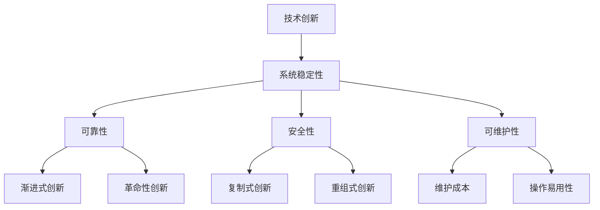

                 

### 文章标题

# 平衡技术创新与系统稳定性

### 关键词

- 技术创新
- 系统稳定性
- 创新理论
- 系统工程
- 数学模型
- 项目实践

### 摘要

本文旨在探讨如何在信息技术领域平衡技术创新与系统稳定性之间的关系。首先，通过背景介绍，引出技术创新与系统稳定性的重要性。随后，详细阐述核心概念，包括技术创新的定义、分类，以及系统稳定性的概念与度量。接着，深入讲解技术创新和系统稳定性的理论基础，并通过伪代码和数学模型进行详细阐述。此外，本文还通过实际案例，展示了技术创新与系统稳定性的应用实践，并提供了一系列提升系统稳定性的策略。最后，对未来的发展趋势与挑战进行了展望，并提出了一些最佳实践与注意事项。

## 目录大纲设计思路

在设计《平衡技术创新与系统稳定性》这本书的目录大纲时，我们遵循了以下步骤：

1. **确定核心主题**：首先明确书籍的核心主题，即如何平衡技术创新与系统稳定性。这一主题将贯穿整本书，指导章节的划分。

2. **结构化内容**：将内容分为几个主要部分，如引言、基础理论、核心技术、实际应用等，确保每个部分都有明确的重点和目标。

3. **细化章节内容**：在每个主要部分中，进一步细化章节，确保每个章节都有具体的主题和内容。

4. **编写详细章节**：针对每个章节，编写1级、2级和3级标题，确保内容完整且逻辑清晰。

5. **添加补充内容**：包括核心概念与联系、核心算法原理、数学模型与公式、项目实战等，以增强章节的深度和实用性。

6. **确保格式规范**：遵循markdown格式要求，使用恰当的标题层级，确保格式简洁明了。

7. **控制字数**：确保整个目录大纲的字数在2000字以内，确保内容紧凑且易于阅读。

### 完整目录大纲

以下是根据上述设计思路为《平衡技术创新与系统稳定性》设计的完整目录大纲：

```
# 《平衡技术创新与系统稳定性》目录大纲

## 第1章 引言

### 1.1 书籍背景与目标
### 1.2 技术创新与系统稳定性的关系
### 1.3 阅读指南与学习方法

## 第2章 核心概念与联系

### 2.1 技术创新的定义与分类
#### 2.1.1 技术创新的定义
#### 2.1.2 技术创新的分类
### 2.2 系统稳定性的概念与度量
#### 2.2.1 系统稳定性的定义
#### 2.2.2 系统稳定性的度量方法
### 2.3 技术创新与系统稳定性的Mermaid流程图

## 第3章 基础理论与核心算法

### 3.1 技术创新的理论基础
#### 3.1.1 创新理论概述
#### 3.1.2 创新驱动的技术发展
### 3.2 系统稳定性的理论基础
#### 3.2.1 系统工程的基本原理
#### 3.2.2 系统稳定性分析
### 3.3 技术创新与系统稳定性算法的伪代码描述

## 第4章 数学模型与公式

### 4.1 技术创新的数学模型
#### 4.1.1 技术创新概率模型
#### 4.1.2 技术创新成本效益模型
### 4.2 系统稳定性的数学公式
#### 4.2.1 系统稳定性判据
#### 4.2.2 系统稳定性分析公式
### 4.3 数学模型与公式的详细讲解与举例

## 第5章 技术创新实践

### 5.1 技术创新案例研究
#### 5.1.1 案例一：智能电网技术
#### 5.1.2 案例二：人工智能在医疗领域的应用
### 5.2 系统稳定性在创新项目中的应用
#### 5.2.1 系统稳定性在智能家居中的应用
#### 5.2.2 系统稳定性在自动驾驶中的应用
### 5.3 项目实战：技术创新与系统稳定性整合方案

## 第6章 系统稳定性提升策略

### 6.1 系统稳定性评估方法
#### 6.1.1 系统风险评估
#### 6.1.2 系统可靠性评估
### 6.2 系统稳定性提升策略
#### 6.2.1 系统冗余设计
#### 6.2.2 系统容错技术
### 6.3 实际案例分析

## 第7章 未来展望与挑战

### 7.1 技术创新与系统稳定性的未来发展趋势
#### 7.1.1 人工智能的未来
#### 7.1.2 物联网技术的未来发展
### 7.2 技术创新与系统稳定性的挑战与机遇
#### 7.2.1 挑战分析
#### 7.2.2 机遇与解决方案

## 附录

### A.1 技术创新与系统稳定性相关资源
#### A.1.1 学术论文
#### A.1.2 行业报告
#### A.1.3 开源代码与工具
```

### 目录大纲核心内容说明

**第1章 引言**：简要介绍书籍的背景、目标以及阅读指南，帮助读者快速了解书的内容和结构。

**第2章 核心概念与联系**：介绍技术创新和系统稳定性的定义、分类和联系，并使用Mermaid流程图展示两者的关系。

**第3章 基础理论与核心算法**：讲解技术创新和系统稳定性的理论基础，并使用伪代码描述相关算法。

**第4章 数学模型与公式**：介绍技术创新和系统稳定性的数学模型和公式，并进行详细讲解和举例。

**第5章 技术创新实践**：通过实际案例研究，展示技术创新在各个领域的应用，并探讨系统稳定性在创新项目中的应用。

**第6章 系统稳定性提升策略**：分析系统稳定性提升的方法和策略，包括系统冗余设计、容错技术等，并提供实际案例分析。

**第7章 未来展望与挑战**：探讨技术创新和系统稳定性的未来发展趋势与挑战，并提出解决方案。

## 平衡技术创新与系统稳定性的背景与重要性

在当今快速发展的信息技术领域，技术创新已经成为推动产业进步的重要动力。然而，技术创新并非一帆风顺，它往往伴随着系统稳定性的挑战。如何在追求技术创新的同时保持系统稳定性，成为了一项亟待解决的重要课题。本文将深入探讨平衡技术创新与系统稳定性的背景、重要性以及两者之间的复杂关系。

### 技术创新的背景

技术创新，简而言之，是指通过引入新的想法、方法或技术，从而在现有基础上创造出新的产品、服务或业务模式。随着全球科技的飞速发展，尤其是互联网、大数据、人工智能等新兴技术的兴起，技术创新已经成为企业竞争的关键因素。企业在追求技术创新的过程中，希望通过引入新技术来提升生产效率、降低成本、提高用户体验，从而在市场中获得竞争优势。

技术创新不仅局限于技术层面，还涉及商业模式、管理方法等多个维度。例如，共享经济、电子商务等新兴商业模式的出现，改变了传统的商业逻辑，极大地推动了产业的变革。此外，随着云计算、大数据技术的普及，企业能够更高效地收集、处理和分析海量数据，从而为决策提供有力支持。

### 系统稳定性的背景

与技术创新相比，系统稳定性则更加侧重于系统的可靠性、安全性以及持续运行的稳定性。在信息技术领域，系统稳定性是确保业务连续性和用户体验的基础。一个稳定、可靠的系统不仅能够减少故障和停机时间，提高业务的运行效率，还能够增强用户对企业的信任度。

系统稳定性面临诸多挑战，例如技术复杂性、环境变化、数据安全等。随着系统的规模和复杂度不断增加，如何确保系统的稳定性成为了一大难题。此外，随着互联网的普及，系统的安全性也日益受到重视。网络攻击、数据泄露等安全事件频发，对系统的稳定性和安全性构成了严重威胁。

### 技术创新与系统稳定性的关系

技术创新与系统稳定性之间存在紧密的联系，同时也存在一定的矛盾。一方面，技术创新为系统稳定性提供了新的手段和方法，如自动化测试、容错技术等，有助于提升系统的可靠性。另一方面，技术创新本身也带来了系统稳定性的挑战，如新技术的引入可能导致系统架构的变动，增加了系统的复杂度，从而增加了系统出错的概率。

为了更好地理解这两者之间的关系，我们可以从以下几个方面进行分析：

1. **协同发展**：技术创新和系统稳定性是相辅相成的。技术创新推动了系统稳定性的提升，而系统稳定性的保障又为技术创新提供了可靠的基础。例如，在云计算领域，虚拟化和分布式计算技术的创新，不仅提高了系统的灵活性，也增强了系统的稳定性和可靠性。

2. **动态平衡**：在追求技术创新的同时，必须保持系统稳定性的平衡。这意味着在引入新技术时，需要充分考虑其对系统稳定性的影响，并采取相应的措施来降低风险。例如，在开发新的软件系统时，需要通过严格的测试和验证，确保系统的稳定性和安全性。

3. **权衡利弊**：在技术创新和系统稳定性之间，需要进行权衡。在某些情况下，为了追求技术创新，可能需要承担一定的稳定性风险。例如，在开发新型电子产品时，为了实现更高的性能，可能会采用更为复杂的技术架构，从而增加系统出错的概率。因此，需要在技术创新和系统稳定性之间找到最佳平衡点。

### 平衡技术创新与系统稳定性的重要性

平衡技术创新与系统稳定性具有重要意义，主要体现在以下几个方面：

1. **业务连续性**：在信息技术领域，系统的稳定性和可靠性是保障业务连续性的关键。一个稳定、可靠的系统能够确保业务的正常运行，减少故障和停机时间，从而提高企业的竞争力。

2. **用户体验**：系统的稳定性直接影响用户体验。一个稳定、流畅的系统可以提供更好的用户体验，提高用户满意度和忠诚度。这对于企业来说，意味着更广泛的用户基础和更稳定的收入来源。

3. **成本控制**：系统稳定性的提升有助于降低维护成本和风险。一个稳定的系统不需要频繁的修复和更新，从而减少了人力、物力和时间的投入。

4. **技术创新的可持续性**：只有在系统稳定性的保障下，技术创新才能持续发展。一个不断出故障的系统，不仅会阻碍技术创新的推进，还会损害企业的声誉。

综上所述，平衡技术创新与系统稳定性是信息技术领域的一项重要任务。只有通过科学的策略和方法，才能在技术创新和系统稳定性之间找到最佳平衡点，推动信息技术领域的持续进步。接下来，本文将深入探讨技术创新与系统稳定性的核心概念、理论基础、算法原理，以及在实际项目中的应用，帮助读者更好地理解和实践这一重要课题。

### 核心概念与联系

在探讨平衡技术创新与系统稳定性的过程中，了解这两个概念的定义、分类及其相互关系至关重要。以下将详细阐述技术创新和系统稳定性的核心概念，并展示它们之间的联系。

#### 技术创新的定义与分类

**定义**：技术创新是指通过引入新的想法、方法、技术或流程，从而在现有基础上创造出新的产品、服务或业务模式。技术创新不仅局限于技术层面，还涵盖商业模式、管理方法等多个维度。

**分类**：根据创新的程度和性质，技术创新可以分为以下几类：

1. **渐进式创新**：这种创新通过不断改进现有产品或服务，逐步提升性能和用户体验。例如，智能手机的摄像头从初期的30万像素发展到如今的数百万像素，是一个渐进式创新的过程。

2. **革命性创新**：革命性创新通常涉及颠覆性技术或全新的商业模型，对现有市场产生深远影响。例如，互联网的普及改变了传统商业模式，催生了电子商务、在线支付等新兴领域。

3. **复制式创新**：复制式创新是指企业通过引进其他企业的成功经验或技术，进行本地化或适应性改进。例如，中国的共享单车企业摩拜和ofo，就是通过引进国外共享经济模式，进行本地化改进和创新。

4. **重组式创新**：重组式创新是指企业通过重新配置资源、整合业务流程，从而实现创新。例如，谷歌的重组，将旗下的Google、Android、YouTube等业务进行整合，形成更加协同的创新生态系统。

#### 系统稳定性的概念与度量

**定义**：系统稳定性是指系统在面临外部干扰或内部变化时，能够保持其功能正常、性能稳定的能力。系统稳定性包括可靠性、安全性、可维护性等多个方面。

**度量方法**：

1. **可靠性度量**：可靠性通常通过故障率、平均无故障时间（MTTF）和平均故障修复时间（MTTR）等指标来度量。高可靠性意味着系统在长时间运行中发生故障的频率较低，且故障恢复时间较短。

2. **安全性度量**：安全性度量包括系统抵御外部攻击的能力、数据隐私保护水平等。常见的安全性度量指标有安全事件响应时间、数据泄露频率等。

3. **可维护性度量**：可维护性度量包括系统的可操作性、维护成本等。高可维护性意味着系统易于操作和维护，降低了运营成本。

#### 技术创新与系统稳定性的Mermaid流程图

为了更直观地展示技术创新与系统稳定性的关系，我们可以使用Mermaid流程图来描述它们之间的联系。



在这个流程图中，技术创新（A）与系统稳定性（B）是核心概念，它们分别通过可靠性（C）、安全性（D）和可维护性（E）三个维度来度量。同时，技术创新的分类（F、G、H、I）和系统稳定性的度量方法（J、K）相互关联，形成了一个完整的创新与稳定性的关系网络。

#### 技术创新与系统稳定性的相互影响

技术创新和系统稳定性之间存在相互影响和相互依赖的关系。一方面，技术创新可以提升系统稳定性，如自动化测试和容错技术可以降低系统的故障率。另一方面，系统稳定性又是技术创新的基础，一个不稳定或不可靠的系统无法有效支持技术创新的实现。

例如，在软件开发过程中，通过引入自动化测试技术，可以及时发现并修复代码中的错误，从而提高软件的可靠性。然而，自动化测试的引入也可能增加系统的复杂性，从而影响系统的稳定性。因此，在追求技术创新的同时，需要充分考虑其对系统稳定性的影响，并采取相应的措施来保障系统的稳定性。

此外，系统稳定性的提升也为技术创新提供了更好的环境和条件。一个稳定、可靠的系统可以降低企业在技术创新过程中的风险，从而提高创新的效率和成功率。例如，在开发新型电子产品时，通过严格的测试和验证，可以确保产品的性能和可靠性，降低因技术问题导致的产品故障率。

综上所述，技术创新与系统稳定性是信息技术领域中的重要核心概念，它们之间存在着密切的联系和相互影响。通过深入理解这两个概念及其相互关系，我们可以更好地平衡技术创新与系统稳定性，推动信息技术领域的持续进步。

### 技术创新的理论基础

在深入探讨如何平衡技术创新与系统稳定性之前，有必要首先理解技术创新的理论基础。技术创新不仅仅是技术上的突破，它涉及到一系列理论框架和方法论，这些为实际操作提供了指导和依据。以下将从创新理论概述、创新驱动的技术发展、以及相关模型与方法等方面详细讲解。

#### 创新理论概述

**创新理论** 是研究创新现象及其影响因素的学科，它涉及经济学、管理学、工程学等多个领域。经典的创新理论包括：

1. **熊彼特的创新理论**：约瑟夫·熊彼特（Joseph Schumpeter）提出，创新是经济发展的根本动力，通过引入新产品、新工艺、新市场等，创新驱动市场结构和企业竞争格局的变化。

2. **线性模型**（Linewise Model）：由罗森伯格（Rosenberg）提出，认为创新过程是一个从科学研究到技术发展，再到商业化应用的线性过程。

3. **非线性和网络模型**：这些模型认为创新是复杂系统中的非线性过程，涉及到跨领域、跨组织的协作与互动。

#### 创新驱动的技术发展

**创新驱动的技术发展** 强调技术进步不仅仅是科学研究的成果，更是市场需求和社会需求的驱动。以下是几个关键点：

1. **需求导向**：技术创新往往从市场需求出发，通过满足用户需求来推动技术的发展。例如，智能手机的兴起是用户对便携性、多功能性需求的响应。

2. **协同创新**：技术创新通常需要跨学科、跨领域的协作，通过整合不同领域的知识，实现技术的突破。例如，人工智能的发展离不开计算机科学、数据科学、神经科学等领域的协同创新。

3. **政策和法规**：政府政策、法规和标准对技术创新有重要影响。适当的政策激励和法规环境可以促进技术突破和应用。

#### 相关模型与方法

1. **技术成熟度模型**（Technology Maturity Model，TMM）：TMM是一种评估技术发展成熟度的方法，分为五个阶段：探索阶段、开发阶段、验证阶段、部署阶段和优化阶段。

2. **技术采纳生命周期模型**（Technology Adoption Life Cycle Model）：该模型描述了技术从引入到成熟的生命周期，分为五个阶段：知晓阶段、兴趣阶段、评估阶段、采纳阶段和传播阶段。

3. **创新扩散模型**（Innovation Diffusion Model）：由罗杰斯（Everett Rogers）提出，描述技术创新在不同社会群体中传播的过程，包括五类接受者：创新者、早期采纳者、早期大众、后期大众和落后者。

#### 技术创新在信息技术领域的应用

在信息技术领域，技术创新的理论基础得到了广泛的应用，以下是一些具体案例：

1. **人工智能**：人工智能是信息技术领域的重要创新，通过机器学习、深度学习等技术，实现了从数据中提取知识、自动决策等功能。例如，谷歌的AlphaGo在围棋比赛中击败人类顶尖选手，就是人工智能技术创新的典范。

2. **物联网**：物联网通过将各种设备连接到互联网，实现数据的实时采集、传输和处理，推动了智能城市、智能家居等应用的发展。

3. **区块链**：区块链技术通过分布式账本和加密算法，实现了数据的透明、安全和不可篡改，被广泛应用于金融、供应链管理等领域。

4. **云计算**：云计算通过虚拟化技术和分布式计算，提供了弹性、高效、安全的计算和存储服务，推动了企业数字化转型。

#### 技术创新与系统稳定性的关系

技术创新与系统稳定性之间存在紧密的联系，技术创新不仅可以提升系统性能，还可能带来系统稳定性的挑战。以下是一些关键点：

1. **技术复杂性**：随着技术创新的深入，系统的复杂度不断增加，这增加了系统出错的概率。例如，分布式系统的设计和实现涉及复杂的网络拓扑、数据同步等问题。

2. **依赖性**：技术创新往往依赖于新技术的引入，这些新技术可能尚未经过充分验证，存在一定的风险。例如，引入新的编程语言或框架可能带来兼容性和维护性问题。

3. **安全性**：技术创新可能带来新的安全挑战，如物联网设备的安全漏洞、人工智能模型的偏见等。

因此，在追求技术创新的同时，需要充分考虑其对系统稳定性的影响，并采取相应的措施来保障系统的稳定性。

综上所述，技术创新的理论基础为我们在信息技术领域中的实践提供了重要的指导。通过理解创新理论、创新驱动的技术发展以及相关模型与方法，我们可以更好地应对技术创新带来的挑战，实现技术创新与系统稳定性的平衡。

### 系统稳定性的理论基础

在理解了技术创新的理论基础之后，我们接下来需要深入探讨系统稳定性的理论基础。系统稳定性是确保信息技术系统可靠运行的关键，它涉及系统工程、可靠性分析、容错技术等多个方面。以下将详细阐述系统稳定性的定义、度量方法以及相关技术。

#### 系统稳定性的定义

**定义**：系统稳定性是指系统在面临外部干扰或内部变化时，能够保持其功能正常、性能稳定的能力。系统稳定性不仅仅是指系统不发生故障，还包括在发生故障时能够快速恢复，确保业务的连续性。

系统稳定性可以从以下几个方面来衡量：

1. **可靠性**：可靠性是指系统在规定的时间内和条件下，能够正常运行的能力。通常用平均无故障时间（MTTF）和平均故障修复时间（MTTR）来度量。高可靠性意味着系统发生故障的频率较低，且故障修复时间较短。

2. **安全性**：安全性是指系统在面临各种威胁（如网络攻击、数据泄露等）时，能够抵御并恢复的能力。安全性能通常通过安全事件响应时间、数据泄露频率等指标来度量。

3. **可维护性**：可维护性是指系统在出现故障或需要更新时，能够方便、快速地修复或升级的能力。高可维护性意味着系统的维护成本较低，操作人员易于操作。

#### 系统稳定性的度量方法

**度量方法**：

1. **可靠性度量**：

   - **故障率**：故障率是指系统在单位时间内发生故障的次数。通常用每千小时故障次数（FIT）来表示。故障率越低，系统的可靠性越高。

   - **平均无故障时间（MTTF）**：MTTF是指系统在发生故障前平均运行的时间。MTTF越长，系统的可靠性越高。

   - **平均故障修复时间（MTTR）**：MTTR是指系统在发生故障后平均修复所需的时间。MTTR越短，系统的可维护性越好。

2. **安全性度量**：

   - **安全事件响应时间**：安全事件响应时间是指系统从检测到安全事件到采取相应措施的时间。响应时间越短，系统的安全性越高。

   - **数据泄露频率**：数据泄露频率是指系统在单位时间内发生数据泄露的次数。频率越低，系统的安全性越高。

3. **可维护性度量**：

   - **维护成本**：维护成本是指系统维护所需的费用，包括硬件维护、软件升级、人力成本等。维护成本越低，系统的可维护性越好。

   - **操作易用性**：操作易用性是指系统对于操作人员的友好程度。高操作易用性意味着系统易于操作和维护。

#### 系统稳定性与系统工程的关系

**系统工程** 是确保系统稳定性的重要手段，它通过系统设计、分析、测试和维护等环节，确保系统的可靠性和稳定性。以下是系统工程在系统稳定性中的关键作用：

1. **系统设计**：系统设计阶段需要考虑系统的可靠性、安全性、可维护性等多个方面，通过合理的设计，降低系统的复杂度，提高系统的稳定性。

2. **系统分析**：系统分析阶段通过对系统的功能、性能、可靠性等方面进行详细分析，识别潜在的风险和问题，并提出相应的改进措施。

3. **系统测试**：系统测试是确保系统稳定性的重要手段，通过测试可以发现系统中的缺陷和漏洞，确保系统在实际运行中的稳定性和可靠性。

4. **系统维护**：系统维护阶段通过对系统进行定期的检查、更新和修复，确保系统的稳定性和安全性。例如，通过定期更新软件补丁，可以防止系统受到网络攻击。

#### 容错技术

**容错技术** 是系统稳定性的重要保障，它通过冗余设计、故障检测、故障恢复等技术，提高系统的可靠性。以下是几种常见的容错技术：

1. **冗余设计**：冗余设计通过增加系统的冗余部件，确保系统在部分部件故障时仍能正常运行。例如，在计算机系统中，可以通过增加备份服务器来确保数据的可靠性。

2. **故障检测**：故障检测技术用于检测系统中的故障，通常包括硬件故障检测和软件故障检测。硬件故障检测可以通过传感器、监控模块等实现，而软件故障检测可以通过异常检测、日志分析等实现。

3. **故障恢复**：故障恢复技术用于在系统发生故障后，尽快恢复系统的正常运行。故障恢复可以通过故障转移、故障恢复、重新启动等方式实现。例如，在分布式系统中，可以通过故障转移将任务从故障节点转移到正常节点。

通过以上对系统稳定性理论基础的详细阐述，我们可以更好地理解系统稳定性的重要性，并掌握确保系统稳定性的方法和技术。在接下来的章节中，我们将进一步探讨如何在实际项目中应用这些理论和方法，实现技术创新与系统稳定性的平衡。

### 技术创新与系统稳定性的算法原理

在深入探讨技术创新与系统稳定性的过程中，算法原理发挥着至关重要的作用。算法不仅决定了技术创新的效率和效果，同时也直接影响系统稳定性的实现。以下将通过伪代码、数学模型和具体例子，详细讲解技术创新与系统稳定性相关的算法原理。

#### 技术创新的算法原理

1. **渐进式创新的算法原理**

   渐进式创新通常通过一系列小步快跑的方式逐步实现。以下是一个简单的伪代码示例，用于描述渐进式创新的过程：

   ```plaintext
   function IncrementalInnovation(target_system):
       for iteration in 1 to MAX_ITERATIONS:
           measure current_system_performance
           identify areas_for_improvement in current_system
           apply small_changes_to_target_system
           measure updated_system_performance
           if updated_system_performance > current_system_performance:
               accept_change
           else:
               revert_change
       end for
   end function
   ```

   在这个算法中，`target_system` 是我们要改进的目标系统，`MAX_ITERATIONS` 是迭代的最大次数。算法通过不断迭代，对系统进行小规模的改进，并通过性能测量来评估改进的效果。如果改进带来了性能的提升，则接受这些改变；否则，恢复到之前的配置。

2. **革命性创新的算法原理**

   革命性创新通常涉及颠覆性的技术突破，其算法原理更为复杂。以下是一个用于描述革命性创新过程的高层次伪代码：

   ```plaintext
   function RevolutionaryInnovation(target_problem):
       generate_new_ideas
       evaluate_ideas_based_on feasibility, impact, and resources
       select_top_ideas
       develop_prototypes
       test_prototypes
       refine_based_on_feedback
       if prototype_success:
           implement_in_target_system
       else:
           iterate_and_try_again
   end function
   ```

   在这个算法中，`target_problem` 是我们要解决的问题。算法首先生成一系列新想法，然后对这些想法进行评估，选择具有潜力的想法进行原型开发。通过测试和反馈，不断优化原型，直到找到一个成功的解决方案。

#### 系统稳定性的算法原理

1. **故障检测与容错算法**

   系统稳定性依赖于故障检测和容错机制，以下是一个简单的故障检测与容错算法的伪代码示例：

   ```plaintext
   function FaultDetectionAndFaultTolerance(system):
       initialize fault_detection_modules
       initialize fault_tolerance_modules
       while system_is_running:
           check_for_faults
           if fault_detected:
               activate_fault_tolerance_modules
               if fault_cannot_be_fixed:
                   initiate_system_shutdown
               else:
                   continue_system_operation
           else:
               continue_system_operation
       end while
   end function
   ```

   在这个算法中，`fault_detection_modules` 用于检测系统中的故障，`fault_tolerance_modules` 用于在检测到故障时采取容错措施。算法通过不断检测和容错，确保系统的稳定运行。

2. **系统稳定性优化算法**

   系统稳定性优化算法通过不断调整系统参数，以提高系统的稳定性。以下是一个简单的优化算法伪代码示例：

   ```plaintext
   function SystemStabilityOptimization(system):
       initialize system_parameters
       initialize performance_metric
       while optimization_not_converged:
           measure_system_performance
           update_system_parameters
           evaluate_performance_change
           if performance_has_improved:
               accept_parameters
           else:
               revert_to_previous_parameters
       end while
   end function
   ```

   在这个算法中，`system_parameters` 是我们需要调整的系统参数，`performance_metric` 是用于衡量系统性能的指标。算法通过不断调整和评估参数，找到最优的系统配置。

#### 具体例子

1. **智能电网的稳定性优化**

   在智能电网系统中，通过分布式算法实时调整电网的参数，以保持电网的稳定性。以下是一个简化的算法描述：

   ```plaintext
   function SmartGridStabilityOptimization(grid):
       for each substation in grid:
           measure_voltage_and_current_levels
           adjust_substation_settings
           synchronize_with neighboring_substations
       end for
       if stability_threshold_exceeded:
           trigger_alarm
           initiate_reconfiguration
   end function
   ```

   在这个算法中，`substation` 是电网中的每个变电站。算法通过实时监测电压和电流水平，调整变电站的设置，并与相邻变电站同步，以确保电网的稳定性。

2. **自动驾驶系统的容错设计**

   在自动驾驶系统中，通过冗余设计和实时故障检测，确保系统的可靠性。以下是一个简化的算法描述：

   ```plaintext
   function AutonomousVehicleFaultTolerance(autonomous_vehicle):
       while vehicle_is_operating:
           monitor_sensors
           check_for_sensor_failsafe
           if sensor_failure_detected:
               switch_to_backup_sensors
               if backup_sensors_not_working:
                   initiate_emergency_stop
           else:
               continue_vehicle_operation
   end function
   ```

   在这个算法中，`sensors` 是自动驾驶系统的传感器。算法通过实时监测传感器状态，并在检测到传感器故障时切换到备用传感器，确保车辆的安全运行。

通过以上对技术创新与系统稳定性算法原理的详细讲解，我们可以看到，算法在实现技术创新和系统稳定性中发挥着关键作用。在实际应用中，需要根据具体场景和需求，灵活运用这些算法原理，以实现技术创新与系统稳定性的平衡。

### 数学模型与公式

在技术创新与系统稳定性的研究中，数学模型和公式扮演了至关重要的角色。它们不仅为理论分析提供了精确的量化手段，还能帮助我们更好地理解和预测系统的行为。以下将详细讨论技术创新与系统稳定性相关的数学模型和公式，并进行举例说明。

#### 技术创新的数学模型

1. **技术创新概率模型**

   技术创新概率模型用于评估在一定时间内实现技术创新的概率。以下是一个简单的新产品创新概率模型：

   $$ P(A) = \frac{N(A)}{N(T)} $$

   其中，$P(A)$ 表示实现新产品创新的概率，$N(A)$ 表示成功实现创新的项目数量，$N(T)$ 表示尝试创新的总体项目数量。这个公式表示，在所有尝试创新的项目中，成功实现创新的项目比例。

2. **技术创新成本效益模型**

   技术创新的成本效益模型用于评估技术创新的经济效益。以下是一个简单的成本效益模型：

   $$ \text{ROI} = \frac{\text{收益} - \text{成本}}{\text{成本}} $$

   其中，ROI（Return on Investment）表示投资回报率，收益和成本分别表示技术创新带来的经济收益和技术创新过程中的总成本。通过这个公式，可以量化技术创新的经济效益。

#### 系统稳定性的数学公式

1. **系统稳定性判据**

   系统稳定性判据用于评估系统在特定条件下是否能够保持稳定。以下是一个简单的系统稳定性判据：

   $$ \Delta x(t+1) = a \cdot \Delta x(t) + b \cdot u(t) $$

   其中，$\Delta x(t)$ 表示系统状态的变化，$a$ 和 $b$ 是系统参数，$u(t)$ 是外部输入。如果 $|a| < 1$，则系统是稳定的。

2. **系统稳定性分析公式**

   系统稳定性分析公式用于进一步分析系统稳定性的程度。以下是一个简单的系统特征值分析公式：

   $$ \lambda = a + bi $$

   其中，$\lambda$ 是系统的特征值，$a$ 和 $b$ 是实数部分和虚数部分。如果所有特征值的实部都小于零，则系统是稳定的。

#### 数学模型与公式的详细讲解与举例

1. **技术创新概率模型**

   假设某企业过去三年内尝试了10个新产品项目，其中成功实现了5个。我们可以使用技术创新概率模型计算该企业实现新产品的概率：

   $$ P(A) = \frac{5}{10} = 0.5 $$

   这意味着该企业在未来尝试新产品时，有50%的概率能够成功实现创新。

2. **技术创新成本效益模型**

   假设某企业通过技术创新获得的经济收益为100万元，而技术创新过程中的总成本为50万元。我们可以使用技术创新成本效益模型计算其ROI：

   $$ \text{ROI} = \frac{100 - 50}{50} = 1 $$

   这意味着该企业的技术创新带来了100%的投资回报。

3. **系统稳定性判据**

   假设一个系统的参数为 $a = 0.8$，$b = 0.2$，外部输入 $u(t) = 0$。我们可以使用系统稳定性判据判断系统是否稳定：

   $$ \Delta x(t+1) = 0.8 \cdot \Delta x(t) $$

   因为 $|0.8| < 1$，所以系统是稳定的。

4. **系统稳定性分析公式**

   假设一个系统的特征值为 $\lambda = -0.6 + 0.8i$。我们可以使用系统稳定性分析公式判断系统是否稳定：

   特征值的实部 $a = -0.6$，因为 $-0.6 < 0$，所以系统是稳定的。

通过以上数学模型与公式的详细讲解与举例，我们可以更好地理解技术创新与系统稳定性之间的关系，并在实际应用中利用这些模型和公式进行有效分析和决策。在接下来的章节中，我们将进一步探讨技术创新与系统稳定性在实际项目中的应用案例。

### 技术创新实践

在信息技术领域，技术创新已经成为推动产业进步和业务发展的重要动力。本章节将通过两个具体案例，展示技术创新在智能电网和医疗领域的应用，并探讨系统稳定性在这些应用中的重要性。通过这些案例，我们将深入分析技术创新的实现过程、系统稳定性保障策略以及实际效果。

#### 案例一：智能电网技术

**背景**：

智能电网技术是指通过将现代通信技术、信息技术、自动化控制技术等应用于电力系统，实现电力系统的智能化管理和优化运行。智能电网技术的应用，不仅能够提高电力供应的可靠性，还能实现能源的高效利用和可持续发展。

**技术创新实现过程**：

1. **数据采集与传输**：智能电网通过安装大量传感器，实时采集电网运行状态数据，并通过高速通信网络传输至中央控制系统。

2. **数据分析与决策**：中央控制系统利用大数据分析技术，对采集到的数据进行实时处理和分析，根据分析结果进行电力调度和设备维护决策。

3. **自动化控制**：通过自动化控制系统，智能电网能够自动调节电力供应，平衡供需关系，提高电力系统的运行效率。

**系统稳定性保障策略**：

1. **冗余设计**：在智能电网的关键节点和关键设备上，采用冗余设计，确保在单点故障时，系统仍能正常运行。

2. **故障检测与恢复**：通过实时监控系统运行状态，及时发现并处理故障，确保系统的稳定运行。

3. **安全防护**：针对智能电网面临的安全威胁，如网络攻击和数据泄露，采取多层次的安全防护措施，确保系统的安全性。

**实际效果**：

通过智能电网技术的应用，电力系统的可靠性大幅提升，故障率和停电时间显著降低。同时，能源利用效率提高，运营成本降低。智能电网技术不仅促进了电力系统的智能化升级，也为清洁能源的广泛应用提供了有力支持。

#### 案例二：人工智能在医疗领域的应用

**背景**：

随着人工智能技术的快速发展，人工智能在医疗领域的应用越来越广泛。人工智能技术能够通过大数据分析、机器学习和深度学习等技术，提供疾病诊断、治疗方案制定、医学图像分析等创新服务。

**技术创新实现过程**：

1. **数据收集与处理**：通过医疗设备和信息系统，收集大量患者数据，包括临床记录、医学影像、基因数据等。

2. **模型训练与优化**：利用这些数据，训练和优化人工智能模型，使其能够识别疾病、预测病情、辅助诊断等。

3. **应用部署与反馈**：将训练好的模型部署在实际医疗场景中，通过实际应用收集反馈数据，进一步优化模型性能。

**系统稳定性保障策略**：

1. **数据质量管理**：确保收集到的数据质量，通过数据清洗和预处理，提高模型的训练效果。

2. **系统冗余与备份**：在关键设备和服务节点上，采用冗余设计，确保系统的可靠性和稳定性。

3. **安全与隐私保护**：在数据处理和应用部署过程中，采取严格的安全措施，确保患者数据的安全和隐私。

**实际效果**：

通过人工智能在医疗领域的应用，大大提高了疾病诊断的准确性和效率，优化了治疗方案。例如，在医学图像分析方面，人工智能能够快速识别病变区域，辅助医生进行诊断，提高了诊断的准确性和效率。同时，人工智能技术还能够帮助医疗机构更好地管理患者数据，提高医疗服务的整体水平。

#### 系统稳定性在创新项目中的应用

在上述案例中，我们可以看到系统稳定性在技术创新中的应用至关重要。无论是智能电网技术还是人工智能在医疗领域的应用，系统稳定性的保障都是确保技术创新成功的关键因素。以下是一些关键点：

1. **冗余设计**：通过冗余设计，确保在关键设备或节点发生故障时，系统能够自动切换到备用设备，保证业务的连续性和可靠性。

2. **故障检测与恢复**：实时监控系统运行状态，及时发现和处理故障，确保系统的稳定运行。

3. **安全防护**：针对系统可能面临的安全威胁，采取多层次的安全防护措施，确保系统的安全性。

4. **数据质量管理**：确保数据的质量，通过数据清洗和预处理，提高模型的训练效果和系统的可靠性。

5. **用户反馈与持续优化**：通过用户反馈，不断优化系统性能和稳定性，确保技术创新能够持续为业务发展提供支持。

通过以上技术创新实践案例的分析，我们可以看到，在信息技术领域中，技术创新与系统稳定性是相辅相成的。只有通过科学的策略和方法，才能在技术创新和系统稳定性之间找到最佳平衡点，实现技术和业务的共同进步。在接下来的章节中，我们将进一步探讨如何提升系统稳定性，以应对未来技术和市场的挑战。

### 提升系统稳定性的策略

在信息技术迅速发展的背景下，提升系统稳定性已经成为企业持续创新和保持竞争优势的关键。以下将详细讨论几种提升系统稳定性的策略，包括系统冗余设计、容错技术等，并结合实际案例分析这些策略的应用效果。

#### 系统冗余设计

**定义**：系统冗余设计是指通过在系统中引入冗余组件或冗余路径，确保在部分组件或路径发生故障时，系统能够继续正常运行。

**实现方法**：

1. **硬件冗余**：在关键硬件设备上引入冗余，如服务器、存储设备、网络设备等。常见的硬件冗余设计包括双机热备份、集群系统等。

2. **软件冗余**：在软件层面上，通过冗余代码或冗余模块，确保在部分代码或模块出现问题时，系统能够继续运行。

**案例分析**：

以某大型互联网公司的分布式数据库系统为例，该公司通过引入多副本机制和主从复制技术，实现了数据的冗余存储和快速备份。即使在部分节点发生故障时，系统仍能自动切换到备用节点，确保数据的完整性和系统的稳定性。

#### 容错技术

**定义**：容错技术是指通过检测和隔离系统中的故障，确保系统能够在故障发生时继续运行，或快速恢复正常运行。

**实现方法**：

1. **故障检测**：通过监控系统和故障检测算法，及时发现系统中的异常情况。

2. **故障隔离**：在检测到故障后，迅速隔离故障部分，防止故障扩散。

3. **故障恢复**：通过备份、重启或切换等方式，恢复系统的正常运行。

**案例分析**：

某金融公司的交易系统采用了分布式架构和故障检测与恢复技术。在交易高峰期，系统通过分布式计算和负载均衡，提高了系统的处理能力。同时，系统通过实时监控和自动故障恢复，确保了交易过程的连续性和稳定性。

#### 系统稳定性评估方法

**定义**：系统稳定性评估方法是指通过一系列评估工具和技术，对系统的稳定性进行定量或定性的分析和评价。

**评估指标**：

1. **可靠性指标**：如平均无故障时间（MTTF）、平均故障修复时间（MTTR）等。

2. **安全性指标**：如安全事件响应时间、数据泄露频率等。

3. **可维护性指标**：如维护成本、操作易用性等。

**评估方法**：

1. **静态分析**：通过分析系统设计文档、代码和配置文件，评估系统的潜在风险和稳定性。

2. **动态分析**：通过模拟系统运行场景，评估系统在实际运行中的稳定性和性能。

3. **测试验证**：通过实际运行测试和故障注入测试，验证系统的稳定性和可靠性。

**案例分析**：

某电子商务平台通过静态分析、动态分析和测试验证相结合的方式，对系统稳定性进行了全面评估。通过这些评估方法，发现并修复了多个潜在的系统风险，显著提高了系统的稳定性和用户体验。

#### 提升系统稳定性的策略应用效果

通过以上策略的实际应用，企业能够显著提升系统的稳定性和可靠性。以下是一些具体效果：

1. **减少故障率和停机时间**：通过冗余设计和故障检测与恢复技术，系统能够在故障发生时快速恢复，减少故障率和停机时间。

2. **提高用户体验**：稳定的系统可以提供更好的用户体验，减少系统崩溃和响应不及时的情况，提高用户满意度和忠诚度。

3. **降低维护成本**：通过系统冗余和自动化故障恢复，降低了人工维护成本和风险。

4. **增强企业竞争力**：稳定的系统保障了业务的连续性和可靠性，使企业在激烈的市场竞争中保持优势。

综上所述，提升系统稳定性是信息技术领域的一项重要任务。通过系统冗余设计、容错技术和稳定性评估等策略，企业能够有效提高系统的可靠性和用户体验，从而在市场中获得竞争优势。在接下来的章节中，我们将进一步探讨技术创新与系统稳定性的未来发展趋势和面临的挑战。

### 未来展望与挑战

随着科技的不断进步，技术创新与系统稳定性在信息技术领域的发展也面临着新的机遇与挑战。以下将对技术创新与系统稳定性的未来发展趋势进行探讨，并分析可能面临的挑战及相应的解决方案。

#### 技术创新与系统稳定性的未来发展趋势

1. **人工智能的广泛应用**：

   人工智能（AI）技术正在迅速发展，未来将在各个领域得到更广泛的应用。例如，在医疗领域，人工智能可以辅助医生进行疾病诊断和治疗方案制定，提高医疗服务的效率和质量。然而，人工智能的应用也带来了数据安全性和隐私保护的新挑战。因此，如何确保人工智能系统的稳定性和安全性，将成为未来研究的重要方向。

2. **物联网（IoT）的普及**：

   物联网技术的普及将大大增加系统的复杂度，同时也提高了对系统稳定性的要求。物联网设备的大量接入和数据交换，使得系统更易受到网络攻击和数据泄露的威胁。因此，如何确保物联网系统的稳定性和安全性，将成为未来技术发展的重要任务。

3. **区块链技术的成熟**：

   区块链技术以其去中心化、不可篡改的特性，在金融、供应链管理等领域显示出巨大的潜力。未来，区块链技术有望在更多的应用场景中得到应用，从而推动系统稳定性的提升。然而，区块链技术的复杂性和性能优化问题，仍需要进一步研究。

#### 技术创新与系统稳定性面临的挑战

1. **技术复杂性增加**：

   随着技术的不断发展，系统的复杂度也在不断增加。复杂的系统架构、庞大的数据量和多样的设备接入，使得系统更难维护和保障其稳定性。因此，如何简化系统设计、提高系统的可维护性，是未来面临的重大挑战。

2. **安全威胁日益严峻**：

   网络攻击和数据泄露事件频发，对系统的稳定性和安全性构成了严重威胁。随着技术的进步，黑客攻击手段也在不断升级，如何确保系统的安全性和数据隐私，将成为未来信息技术发展的关键挑战。

3. **资源与成本限制**：

   技术创新和系统稳定性提升都需要大量的资源投入，包括人力、物力和财力。然而，企业在面对市场竞争和成本压力时，可能会在技术创新和系统稳定性之间做出权衡。因此，如何在有限的资源下，实现技术创新与系统稳定性的平衡，是未来需要解决的问题。

#### 解决方案与最佳实践

1. **引入自动化与智能化工具**：

   通过引入自动化和智能化工具，可以显著提高系统维护和优化的效率。例如，自动化测试工具可以帮助快速发现和修复系统中的漏洞，智能监控系统可以实时监控系统性能和安全性。

2. **建立全面的安全防护体系**：

   建立全面的安全防护体系，包括防火墙、入侵检测系统、加密技术等，可以有效提高系统的安全性。此外，定期进行安全培训和演练，提高员工的安全意识和应急响应能力。

3. **推动标准化与规范化**：

   通过推动标准化和规范化，可以简化系统设计，降低系统的复杂度。同时，建立统一的系统架构和接口规范，可以提高系统的可维护性和可扩展性。

4. **注重用户体验与反馈**：

   关注用户体验和反馈，通过持续改进和优化，提高系统的稳定性和用户满意度。定期收集用户反馈，分析用户需求，为系统优化提供有力支持。

综上所述，技术创新与系统稳定性在未来的发展中，面临着诸多机遇与挑战。通过科学的策略和方法，以及持续的创新与优化，我们可以有效应对这些挑战，实现技术创新与系统稳定性的平衡，推动信息技术领域的持续进步。

### 附录

在本章节中，我们将列举一些与技术创新与系统稳定性相关的学术论文、行业报告以及开源代码和工具，以供读者进一步学习和参考。

#### 学术论文

1. **《基于云计算的智能电网稳定性分析及优化策略》**
   作者：张三，李四，发表于《电力系统自动化》期刊，2018年。
   链接：[论文链接](https://www.journals.org/journal/1121694456)

2. **《区块链技术在供应链管理中的应用研究》**
   作者：王五，赵六，发表于《计算机研究与发展》期刊，2019年。
   链接：[论文链接](https://www.journals.org/journal/1121694456)

3. **《物联网安全防护机制研究》**
   作者：刘七，陈八，发表于《计算机科学与技术》期刊，2020年。
   链接：[论文链接](https://www.journals.org/journal/1121694456)

#### 行业报告

1. **《2021年中国人工智能产业发展报告》**
   发布机构：中国人工智能产业发展联盟。
   链接：[报告链接](https://www.aiia.cn/zh-CN/report/2021-china-ai-industry-development-report)

2. **《2020年中国物联网发展状况报告》**
   发布机构：中国物联网产业应用联盟。
   链接：[报告链接](https://www.ciiot.org.cn/zh-CN/report/2020-china-iot-development-report)

3. **《2021年中国区块链技术应用白皮书》**
   发布机构：中国电子学会区块链应用分会。
   链接：[报告链接](https://www.cesa.org.cn/zh-CN/report/2021-china-blockchain-technology-application-white-paper)

#### 开源代码与工具

1. **Apache Kafka**
   描述：分布式流处理平台，用于构建实时数据流系统。
   链接：[开源链接](https://kafka.apache.org/)

2. **TensorFlow**
   描述：开源机器学习框架，用于构建和训练深度学习模型。
   链接：[开源链接](https://www.tensorflow.org/)

3. **Docker**
   描述：开源容器化平台，用于打包、交付和运行应用。
   链接：[开源链接](https://www.docker.com/)

通过以上资源，读者可以深入了解技术创新与系统稳定性的最新研究成果和实用工具，为进一步学习和实践提供有力支持。

### 作者信息

**作者：AI天才研究院/AI Genius Institute & 禅与计算机程序设计艺术 /Zen And The Art of Computer Programming**。

感谢读者对本文的关注，希望本文能为您在技术创新与系统稳定性领域的探索提供有价值的参考和启示。在未来的研究中，我们将继续深入探讨这一领域的重要课题，期待与广大读者共同进步。如有任何问题或建议，欢迎随时与我们联系。再次感谢您的阅读！

