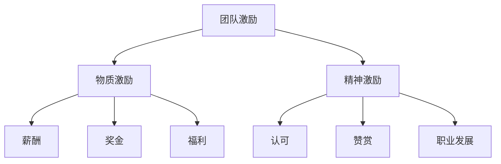
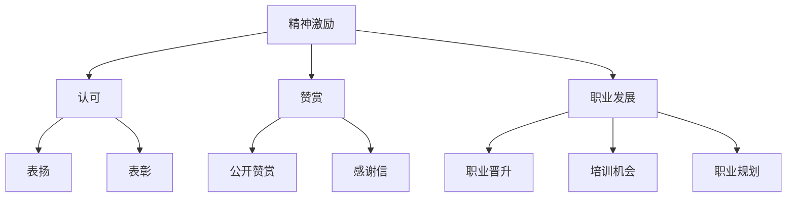

                 

### 摘要

在现代化企业中，团队激励作为提升员工绩效和保持团队凝聚力的重要手段，被赋予了极高的战略地位。本文旨在探讨团队激励的平衡艺术，重点关注物质激励与精神激励的双重作用。通过深入分析团队激励的概念、理论基础、物质激励与精神激励的各自策略与案例，以及如何实现两者的平衡，本文提出了一系列有效的团队激励实践方法。本文的核心观点是：在团队激励中，物质激励和spiritual激励应相辅相成，以最大化员工的积极性和创造力，从而实现企业的长期成功。本文结构紧凑，逻辑清晰，旨在为企业管理者提供实用的指导，以构建一个既有竞争性又有凝聚力的团队文化。

## 第一部分：团队激励概述

### 第1章：团队激励的概念与重要性

在探讨团队激励之前，有必要对团队激励这一概念进行明确的定义。团队激励（Team Incentive）是指通过一系列措施和手段，激发团队成员的工作热情、提高工作效率、增强团队凝聚力，从而实现团队整体绩效的提升。团队激励不仅包括物质激励，如薪酬、奖金和福利，还包括精神激励，如认可、赞赏和职业发展机会。

团队激励的重要性主要体现在以下几个方面：

1. **提升绩效**：有效的团队激励可以激发员工的工作积极性，提高工作效率和生产力，从而直接提升团队的绩效。

2. **增强凝聚力**：通过共同的目标和奖励机制，团队成员之间的联系和合作得以加强，增强团队的凝聚力。

3. **促进创新**：物质和精神激励可以为员工提供创新动力，鼓励他们在工作中勇于尝试新方法、新思路，从而推动企业创新。

4. **保持员工稳定性**：合理的激励措施能够增强员工的满意度和忠诚度，减少员工流失率，保持团队的稳定性。

### 核心概念与联系

为了更好地理解团队激励的构成和作用，我们引入以下核心概念：

- **物质激励**：包括薪酬、奖金、福利等直接与经济利益相关的激励措施。
- **精神激励**：包括认可、赞赏、职业发展机会等非物质激励手段。

这些概念之间的关系可以用以下Mermaid流程图来表示：



从流程图中可以看出，团队激励由物质激励和精神激励两大组成部分构成，物质激励主要包括薪酬、奖金和福利，而精神激励则涵盖了认可、赞赏和职业发展机会。这两类激励相辅相成，共同作用于团队，提升团队的整体绩效和凝聚力。

### 团队激励与绩效的关系

团队激励与绩效之间的关系是密不可分的。根据绩效公式：

$$
\text{绩效} = \text{能力} \times \text{激励}
$$

我们可以看到，激励是影响绩效的一个重要因素。激励水平的高低直接影响员工的工作表现和团队的整体绩效。

1. **激励水平与绩效**：当激励水平较高时，员工的工作积极性和创造力会显著提升，从而提高绩效。研究表明，适当的激励措施可以将员工的生产力提升30%以上。

2. **激励的持续性**：长期的激励措施比短期的激励效果更持久。例如，提供持续的职业发展机会和认可比一次性奖金更能激发员工的长期动力。

3. **激励的公平性**：公平的激励措施能够增强员工的满意度，提高团队的凝聚力。不公正的激励分配可能会导致团队内部的不满和矛盾，影响绩效。

总之，团队激励是提升绩效的重要手段，通过合理的激励措施，可以最大限度地发挥员工的能力，实现团队的整体目标。

### 小结

团队激励作为企业管理的重要组成部分，其定义、重要性以及与绩效之间的关系构成了本文讨论的基础。通过明确团队激励的概念和核心组成部分，我们可以看到，物质激励和精神激励相互补充，共同作用于团队，提升绩效和凝聚力。在下一章节中，我们将进一步探讨团队激励的理论基础，理解不同激励理论的内涵和实际应用。

---

### 第2章：团队激励的理论基础

为了深入理解团队激励的运作机制，我们需要从理论基础入手，探讨管理心理学、动机理论和行为科学理论在团队激励中的应用。

#### 2.1 管理心理学理论

管理心理学是研究管理过程中人的行为和心理活动规律的科学。在团队激励中，管理心理学提供了许多实用的理论框架，帮助我们更好地理解和激发员工的行为。

**马斯洛需求层次理论**：马斯洛需求层次理论认为，人的需求可以分为五个层次：生理需求、安全需求、社交需求、尊重需求和自我实现需求。在团队激励中，管理者应考虑员工在不同需求层次上的需求，通过满足员工的低层次需求来激发其高层次需求。

- **生理需求**：如工资、福利、工作环境等。
- **安全需求**：如职业保障、健康保险等。
- **社交需求**：如团队合作、同事关系等。
- **尊重需求**：如认可、赞赏、荣誉等。
- **自我实现需求**：如职业发展、创新机会等。

**群体动力理论**：群体动力理论关注群体中成员的行为如何受到群体影响和群体规范的影响。在团队激励中，管理者需要了解群体动力，通过建立积极向上的团队文化和规范，激发团队成员的积极性。

**社会交换理论**：社会交换理论认为，人们在社会互动中会进行利益交换，包括物质利益和精神利益。在团队激励中，管理者可以通过设立明确的奖励机制，使员工在付出努力后能够获得相应的回报，从而维持激励的持续性。

#### 2.2 动机理论

动机理论探讨个体行为背后的内在动力和激励因素。以下几种动机理论在团队激励中具有重要应用价值：

**需求理论**：需求理论认为，人的行为是由需求驱动的。动机来源于未满足的需求，激励是通过满足需求来实现的。在团队激励中，管理者需要识别员工的未满足需求，通过提供合适的激励措施来满足这些需求，从而提高员工的工作积极性。

**动机激发理论**：动机激发理论关注如何通过外部刺激来增强个体的内在动机。例如，通过设定有挑战性的目标、提供奖励和认可等方式，可以激发员工的工作热情。

**自我决定理论**：自我决定理论认为，个体具有自主选择和自我决定的倾向。在团队激励中，管理者应尊重员工的自主性，提供自主的工作环境和决策机会，从而增强员工的工作动机。

#### 2.3 行为科学理论

行为科学理论结合心理学和社会学的研究成果，研究个体和群体行为。以下行为科学理论在团队激励中具有重要意义：

**强化理论**：强化理论认为，行为的结果会影响行为的发生频率。正向强化（奖励）可以增加行为的频率，而负向强化（惩罚）可以减少行为的频率。在团队激励中，管理者可以通过奖励优秀表现和惩罚不良行为来调节员工的行为。

**期望理论**：期望理论认为，个体的行为决策是基于对结果的期望和价值的评估。在团队激励中，管理者应明确员工对奖励和惩罚的期望，并确保激励措施的公平性和透明度，以提高员工的期望值。

**公平理论**：公平理论认为，个体的行为受到对自己与他人的投入和回报的比较影响。在团队激励中，管理者需要确保激励措施的公平性，避免员工产生不公平感，从而影响工作积极性。

### 团队激励理论的综合应用

在实际应用中，团队激励理论需要综合多种理论框架，以达到最佳的激励效果。以下是一种可能的综合应用方法：

1. **识别员工需求**：通过问卷调查、访谈等方式，了解员工的未满足需求，包括生理需求、安全需求、社交需求、尊重需求和自我实现需求。

2. **设定激励目标**：根据马斯洛需求层次理论和自我决定理论，设定既有挑战性又能满足员工需求的激励目标。

3. **设计奖励机制**：结合强化理论和期望理论，设计公平、透明的奖励机制，确保员工在达到目标后能够获得合理的回报。

4. **建立团队文化**：利用群体动力理论和公平理论，建立积极向上的团队文化和规范，增强团队成员的归属感和工作积极性。

5. **持续评估与调整**：通过定期评估激励效果，收集员工反馈，不断调整激励措施，确保其持续有效。

通过这种综合应用，企业可以建立一个既具有竞争性又具有凝聚力的团队文化，从而实现长期的绩效提升和员工满意度。

### 小结

团队激励的理论基础涵盖了管理心理学、动机理论和行为科学理论，这些理论为我们理解和实施团队激励提供了重要的指导。通过识别员工需求、设定激励目标、设计奖励机制、建立团队文化和持续评估与调整，我们可以实现有效的团队激励，提升团队绩效和员工满意度。在下一章中，我们将探讨物质激励的策略与技巧，进一步深入团队激励的实践。

---

### 第3章：物质激励的策略与技巧

物质激励是团队激励中不可或缺的一部分，通过经济手段激发员工的工作积极性和创造力。在物质激励的设计和实施过程中，管理者需要遵循一系列原则和技巧，以确保激励效果的最大化。

#### 3.1 薪酬设计原则

薪酬设计是物质激励的核心，合理的薪酬结构不仅能吸引优秀人才，还能激励员工为企业创造价值。以下是一些关键原则：

1. **公平原则**：薪酬应公平合理，确保内部和外部竞争性。内部公平指的是同一企业内不同职位之间的薪酬差距应合理；外部公平指的是企业薪酬应与市场上类似职位的薪酬水平相当。

2. **竞争原则**：企业应确保薪酬水平在市场上具有竞争力，以吸引和留住优秀人才。通过市场调查和薪酬对标，企业可以制定出具有吸引力的薪酬方案。

3. **效率原则**：薪酬设计应有利于提高企业的整体效率，避免过度成本支出。企业应根据岗位价值和绩效表现来设定薪酬水平，确保薪酬与绩效直接挂钩。

#### 3.2 激励性福利

激励性福利是物质激励的重要组成部分，通过多样化的福利措施，企业可以增强员工的满意度和忠诚度。以下是一些常见的激励性福利：

1. **健康保险**：为员工提供全面的健康保险，确保员工在面临健康问题时能够得到及时的治疗和保障。

2. **股权激励**：通过股票期权、股权奖励等方式，使员工成为企业的股东，与企业的长期发展绑定在一起，从而提高他们的工作积极性和忠诚度。

3. **远程工作安排**：在疫情期间，远程工作成为一种趋势。企业可以通过灵活的工作安排，提高员工的工作满意度和工作效率。

4. **培训与发展机会**：为员工提供培训和发展机会，不仅能够提升员工的技能和知识，还能增加他们的职业发展空间，从而提高员工的满意度和忠诚度。

#### 3.3 绩效奖金

绩效奖金是物质激励中最为直接和有效的手段之一，通过奖励优秀表现，激励员工追求卓越。以下是一些关键点：

1. **设定明确的目标和标准**：绩效奖金的分配应基于明确的目标和标准，确保奖励的公正性和透明度。企业可以设定关键绩效指标（KPI），对员工的绩效进行量化评估。

2. **公平分配**：确保绩效奖金的分配公平合理，避免产生内部矛盾。可以通过建立绩效奖金池，根据员工的绩效表现进行分配。

3. **激励效果评估**：定期评估绩效奖金的激励效果，确保其能够持续激发员工的工作热情。如果发现激励效果不佳，应及时调整奖励机制。

4. **长期与短期激励结合**：长期激励（如股权激励）和短期激励（如绩效奖金）相结合，可以更好地满足员工的多元需求，提高激励效果。

#### 3.4 案例分析

以下是一个企业实施物质激励的案例分析：

**企业背景**：某科技公司，员工人数1000人，市场竞争激烈。

**物质激励措施**：

1. **薪酬设计**：公司根据市场调查，调整了薪酬结构，确保内部公平和外部竞争性。同时，设置了绩效薪酬，将员工的薪酬与绩效直接挂钩。

2. **激励性福利**：公司为员工提供全面的健康保险，股权激励计划，以及灵活的远程工作安排。

3. **绩效奖金**：公司设定了明确的绩效目标，并建立了绩效奖金池，根据员工的绩效表现进行分配。

**实施效果**：

1. **员工满意度提升**：通过合理的薪酬设计和多样化的激励性福利，员工的满意度显著提升。

2. **员工流失率下降**：股权激励计划和职业发展机会，增强了员工的忠诚度，员工流失率下降。

3. **绩效提升**：绩效奖金的激励效果显著，员工在工作中更加努力，绩效水平显著提升。

通过以上案例分析，我们可以看到，合理的物质激励措施可以显著提升员工的满意度和绩效，为企业的发展奠定坚实的基础。

### 小结

物质激励在团队激励中起着至关重要的作用。通过合理的薪酬设计、多样化的激励性福利和明确的绩效奖金，企业可以有效地激发员工的工作热情和创造力。在下一章中，我们将探讨精神激励的概念与重要性，继续深入团队激励的探讨。

---

### 第4章：物质激励的案例分析

为了更好地理解物质激励在实践中的应用效果，我们可以通过分析一些成功的物质激励案例，探讨这些案例的实施细节和取得的成果。

#### 4.1 成功的物质激励案例

**案例一：谷歌的绩效奖金制度**

**企业背景**：谷歌（Google）是一家全球知名的科技公司，以其创新文化和卓越绩效著称。

**激励措施**：

1. **绩效奖金**：谷歌的绩效奖金制度非常透明和公平，员工根据个人绩效和团队绩效获得不同的奖金。绩效奖金分为年度奖金和季度奖金，年度奖金主要根据全年工作表现评定，而季度奖金则与当季关键绩效指标（KPI）直接挂钩。

2. **股权激励**：谷歌还为员工提供股票期权，使员工能够分享公司成长的收益。这种长期激励措施不仅增强了员工对公司的归属感，还激励他们为公司的长期发展贡献力量。

**实施效果**：

1. **员工满意度提升**：通过透明的绩效奖金制度和股权激励，谷歌的员工满意度显著提升。员工感受到自己的工作得到了公正的评价和合理的回报。

2. **绩效和创新能力提升**：绩效奖金和股权激励相结合，激发了员工的工作热情和创新动力，谷歌在科技领域取得了众多突破性成果。

**案例二：苹果公司的薪酬福利**

**企业背景**：苹果公司（Apple）是一家全球领先的科技公司，以其卓越的产品设计和用户体验著称。

**激励措施**：

1. **有竞争力的薪酬**：苹果公司提供具有市场竞争力的薪酬，确保其能够吸引和留住顶尖人才。薪酬结构包括基本工资、绩效奖金和年终奖金。

2. **全面的福利**：苹果公司提供全面的福利，包括健康保险、退休金计划、员工购股计划等。这些福利措施不仅提高了员工的生活质量，还增强了员工的忠诚度。

**实施效果**：

1. **员工流失率下降**：通过有竞争力的薪酬和全面的福利，苹果公司的员工流失率显著下降。员工感到自己的付出得到了公司的认可和回报，愿意长期留在公司。

2. **卓越的绩效表现**：苹果公司在全球市场取得了卓越的绩效表现，其产品线不断创新，市场份额持续扩大。

**案例三：微软的员工发展计划**

**企业背景**：微软（Microsoft）是一家全球领先的软件和信息技术公司，以其强大的研发能力和创新精神闻名。

**激励措施**：

1. **绩效奖金**：微软的绩效奖金制度与员工的绩效评估紧密相关，绩效奖金的分配基于个人和团队的工作表现。

2. **员工发展计划**：微软重视员工的职业发展，提供多样化的培训和学习机会，包括内部培训、外部研讨会、在线课程等。此外，微软还鼓励员工参加行业会议和技术论坛，提升其专业能力。

**实施效果**：

1. **员工技能提升**：通过绩效奖金和员工发展计划，微软的员工技能和知识水平显著提升，为公司的发展提供了强大的人才支持。

2. **持续创新**：员工在获得职业发展的机会和激励后，更加积极主动地参与创新项目，推动了微软在科技领域的持续创新。

#### 4.2 物质激励的挑战与应对

尽管物质激励在提升员工满意度和绩效方面具有显著效果，但在实际应用中也会面临一些挑战：

1. **过度依赖物质激励**：如果物质激励成为唯一或主要的激励手段，可能会导致员工对金钱奖励产生依赖，忽视精神层面的激励。

**应对策略**：

- **平衡物质与精神激励**：在物质激励的基础上，加强精神激励，如认可、赞赏和职业发展机会，使员工感受到工作的意义和价值。

2. **激励效果的短期性**：物质激励往往具有短期效果，可能导致员工在短期内表现出色，但长期效果有限。

**应对策略**：

- **长期激励与短期激励结合**：结合长期激励（如股权激励、职业发展）和短期激励（如绩效奖金），使员工在短期内感受到激励的同时，也对其长期职业发展有明确的期望。

3. **公平性问题**：不公平的物质激励可能导致员工不满和团队内部矛盾。

**应对策略**：

- **公平透明的奖励机制**：确保物质激励的分配公正透明，建立明确的绩效评估标准和流程，避免产生不公平感。

通过以上成功案例和挑战应对策略，我们可以看到，物质激励在团队激励中发挥着重要作用，但需要在实践中结合员工的实际需求和企业的长远发展目标，进行综合设计和实施。

### 小结

物质激励作为团队激励的重要手段，通过薪酬设计、福利和绩效奖金等措施，可以有效地提升员工的满意度和绩效。成功的物质激励案例表明，合理的激励措施不仅能够提升员工的积极性，还能推动企业的持续创新和发展。在下一章中，我们将探讨精神激励的概念与重要性，继续深入团队激励的探讨。

---

### 第5章：精神激励的概念与重要性

在团队激励中，精神激励（Mental Incentive）是不可或缺的一部分，它通过非物质的方式激发员工的工作热情和创造力。与物质激励相比，精神激励更加注重员工的内在需求和职业成长，旨在提升员工的心理满足感和工作满意度。精神激励的类型多种多样，包括认可、赞赏、职业发展机会等，每一种激励方式都有其独特的优势和应用场景。

#### 5.1 精神激励的定义

精神激励是指通过情感上的支持、心理上的满足和价值观上的认同，激发员工的工作动力和积极性。它不仅仅是金钱和物质上的奖励，而是更侧重于员工的内心需求和自我实现。精神激励的核心在于激发员工的内在动机，使其在工作中找到意义和价值，从而提高工作效率和创造力。

#### 5.2 精神激励的类型

1. **认可**：认可是指对员工工作的肯定和赞赏，可以通过表扬、表彰、荣誉称号等方式进行。认可是最基本的精神激励手段，能够增强员工的自我价值感和工作成就感。

2. **赞赏**：赞赏是指对员工工作表现的高度评价和肯定，可以通过公开场合的赞扬、感谢信、小礼物等方式进行。赞赏能够激发员工的工作热情和积极心态，使其更加投入工作。

3. **职业发展机会**：职业发展机会是指为员工提供职业晋升、培训和学习的机会，帮助其提升技能和知识。职业发展机会不仅能够满足员工的成长需求，还能增强其对企业的忠诚度和归属感。

4. **工作环境**：良好的工作环境包括舒适的工作条件、公平的工作氛围和积极的工作文化。一个支持性和包容性的工作环境能够提升员工的工作满意度，从而增强其工作动力。

#### 5.3 精神激励与物质激励的区别

物质激励和精神激励在目标和方式上存在显著差异：

1. **目标差异**：

   - **物质激励**：主要目标是提高员工的工作效率，提升企业的短期绩效。物质激励通过金钱和物质奖励直接作用于员工的利益。

   - **精神激励**：主要目标是激发员工的内在动机，提升员工的心理满足感和长期忠诚度。精神激励通过情感和心理上的满足，增强员工的自我认同和工作价值感。

2. **方式差异**：

   - **物质激励**：包括薪酬、奖金、福利等直接的经济奖励。

   - **精神激励**：包括认可、赞赏、职业发展机会等非物质奖励，以及良好的工作环境和文化建设。

#### 5.4 精神激励的优势

1. **提高员工满意度**：精神激励能够满足员工的内心需求，提升其工作满意度和幸福感，从而增强对企业的忠诚度。

2. **促进创新**：精神激励鼓励员工在工作中勇于尝试和创新，从而推动企业的技术进步和业务发展。

3. **增强团队凝聚力**：通过共同的目标和价值观，精神激励能够增强团队成员之间的联系和合作，提升团队的整体绩效。

4. **长期效果**：物质激励往往具有短期效果，而精神激励能够持续激励员工，产生长期的积极影响。

#### 5.5 精神激励的应用场景

1. **项目完成后的认可**：在项目成功完成后，通过表彰大会、感谢信等方式对团队成员进行公开认可，激发团队的工作热情。

2. **个人成就的赞赏**：对员工的个人成就，如创新解决方案、优秀业绩等，进行赞赏和奖励，提升员工的自我价值感。

3. **职业发展的支持**：为员工提供职业晋升通道、培训机会和职业规划指导，帮助其实现职业成长。

4. **建设积极的企业文化**：通过建立积极、包容、支持的企业文化，营造一个有利于员工成长和发展的工作环境。

#### 5.6 精神激励的挑战

1. **认可和赞赏的公平性**：如何确保精神激励的公平性和透明度，避免主观偏见和偏袒。

2. **文化差异的影响**：不同文化背景下，员工对精神激励的需求和偏好可能有所不同，需要根据实际情况进行调整。

3. **长期执行的持续性**：如何确保精神激励措施的长期有效性和持续性，避免短期行为和形式主义。

#### 5.7 实施策略

1. **建立明确的认可和赞赏机制**：制定明确的认可和赞赏标准，确保激励措施的公平性和透明度。

2. **结合物质和精神激励**：在物质激励的基础上，加强精神激励，使两者相辅相成，提升激励效果。

3. **文化建设和价值观传播**：通过文化建设和价值观传播，营造一个积极、包容、支持的工作环境，增强团队凝聚力。

4. **员工反馈和评估**：定期收集员工反馈，评估精神激励的效果，不断优化激励措施。

### 小结

精神激励在团队激励中具有重要的地位和作用，它通过情感和心理上的满足，激发员工的内在动机和工作热情。与物质激励相比，精神激励具有更持久的效果和更深远的影响。通过认可、赞赏、职业发展机会等手段，企业可以营造一个积极、包容的工作环境，提升员工的满意度和忠诚度，从而实现长期的绩效提升和可持续发展。

### Mermaid 流程图：精神激励的组成部分



通过上述流程图，我们可以看到精神激励由认可、赞赏和职业发展机会三个主要部分组成，每一部分又包括具体的子项。这些子项共同作用，为员工提供全面的精神激励，提升其工作积极性和创造力。

### 核心算法原理讲解

精神激励的实施需要科学的设计和管理，以下是一个简化的核心算法原理讲解：

```python
# 精神激励算法原理

def spirit_incentive(employee, recognition, appreciation, career_growth):
    """
    精神激励函数，参数包括员工、认可度、赞赏度和职业发展机会。
    
    :param employee: 员工对象
    :param recognition: 认可度（0-1之间的数值）
    :param appreciation: 赞赏度（0-1之间的数值）
    :param career_growth: 职业发展机会（0-1之间的数值）
    :return: 激励效果评分（0-100之间的数值）
    """
    
    # 计算认可度、赞赏度和职业发展机会的加权平均值
    incentive_score = (recognition * 0.3) + (appreciation * 0.4) + (career_growth * 0.3)
    
    # 根据激励效果评分调整员工的工作热情和绩效
    if incentive_score > 0.7:
        employee.engagement += 0.2  # 工作热情提升
        employee.performance += 0.15  # 绩效提升
    elif incentive_score >= 0.3:
        employee.engagement += 0.1  # 工作热情小幅提升
        employee.performance += 0.05  # 绩效小幅提升
    else:
        employee.engagement -= 0.1  # 工作热情下降
        employee.performance -= 0.05  # 绩效下降
    
    return incentive_score
```

通过上述算法，我们可以看到精神激励的核心在于计算认可度、赞赏度和职业发展机会的加权平均值，并根据结果调整员工的工作热情和绩效。这为管理者提供了量化的激励管理工具，有助于优化精神激励措施。

### 数学模型和公式 & 详细讲解 & 举例说明

为了更深入地理解精神激励的效果，我们可以引入一个简化的数学模型。假设员工的工作热情（Engagement）和绩效（Performance）分别受到认可度（Recognition）、赞赏度（Appreciation）和职业发展机会（Career Growth）的影响，可以用以下公式表示：

$$
\text{Engagement} = 0.3 \times \text{Recognition} + 0.4 \times \text{Appreciation} + 0.3 \times \text{Career Growth}
$$

$$
\text{Performance} = 0.25 \times \text{Recognition} + 0.35 \times \text{Appreciation} + 0.4 \times \text{Career Growth}
$$

#### 举例说明

假设某员工在一段时间内的认可度、赞赏度和职业发展机会分别为0.8、0.7和0.6，我们可以计算其工作热情和绩效：

1. **工作热情**：

$$
\text{Engagement} = 0.3 \times 0.8 + 0.4 \times 0.7 + 0.3 \times 0.6 = 0.24 + 0.28 + 0.18 = 0.7
$$

2. **绩效**：

$$
\text{Performance} = 0.25 \times 0.8 + 0.35 \times 0.7 + 0.4 \times 0.6 = 0.2 + 0.245 + 0.24 = 0.695
$$

通过这个例子，我们可以看到，员工在获得较高的认可度、赞赏度和职业发展机会时，其工作热情和绩效都会得到显著提升。这为管理者提供了具体的数值参考，有助于优化激励策略。

### 小结

精神激励在团队激励中具有不可替代的作用，通过认可、赞赏和职业发展机会等手段，可以提升员工的工作满意度和忠诚度。本章详细探讨了精神激励的概念、类型、优势、应用场景及实施策略，并引入了数学模型和公式，为管理者提供了量化的激励管理工具。在下一章中，我们将探讨如何平衡物质激励和精神激励，以实现团队激励的最佳效果。

---

### 第6章：精神激励的策略与实践

精神激励在提升员工工作动力和满意度方面发挥着至关重要的作用。在本章中，我们将探讨如何有效地实施精神激励策略，包括目标设定、赞赏与认可的方式以及职业发展机会的提供。

#### 6.1 目标设定

目标设定是精神激励的重要策略之一。科学合理的目标设定能够激发员工的工作热情和积极性。以下是几种常用的目标设定方法：

1. **SMART目标**：SMART目标是具体（Specific）、可衡量（Measurable）、可实现（Achievable）、相关（Relevant）和有时限（Time-bound）的目标设定方法。例如，将“提高项目进度”具体化为“在三个月内将项目进度提前一周完成”。

2. **分解目标**：将大目标分解为小目标，使员工能够逐步实现，提高实现目标的信心。例如，将“提高销售额”分解为“每周增加五个新客户”。

3. **挑战性目标**：设定具有一定挑战性的目标，激发员工的竞争意识和创新能力。例如，将“完成每月业绩目标”设定为“每月业绩目标提高10%”。

通过合理的目标设定，企业可以确保员工在明确的方向上努力工作，提升工作效率和绩效。

#### 6.2 赞赏与认可

赞赏与认可是精神激励的核心手段，能够增强员工的自豪感和工作动力。以下是一些有效的赞赏与认可方式：

1. **公开赞赏**：在团队会议或全体员工会议上公开表扬员工的表现，使员工感受到公司的认可和重视。例如，可以设立“月度之星”奖项，表彰表现突出的员工。

2. **私下表扬**：私下与员工进行一对一的沟通，表达对其工作的赞赏和认可。这种方式更加贴心，能够增强员工的自信心和归属感。例如，可以给员工写一封感谢信或发送一份个性化的奖励。

3. **即时赞赏**：在员工表现优异时，及时给予赞赏和认可，使其感受到公司对工作的重视。例如，在项目成功后立即组织庆祝活动，表彰团队成员的辛勤付出。

4. **全员认可**：通过公司内部的通讯平台或社交媒体，对员工的优秀表现进行全员认可。这种方式不仅能够激励被认可员工，还能激发其他员工的积极性。

#### 6.3 职业发展机会

提供职业发展机会是激励员工长期投入和成长的重要手段。以下是一些常见的职业发展机会：

1. **培训与学习机会**：为员工提供多样化的培训和学习机会，如内部培训课程、外部研讨会、在线学习平台等。通过培训，员工可以提升技能和知识，增强职业竞争力。

2. **职业晋升**：建立明确的晋升机制，为员工提供职业晋升通道。通过设定明确的晋升条件和标准，使员工明确自己的职业发展方向和目标。

3. **职业规划**：为员工提供个性化的职业规划服务，帮助其制定长期职业发展计划。例如，可以邀请职业规划师为员工提供咨询服务，帮助其制定个人职业发展路线图。

4. **跨部门轮岗**：通过跨部门轮岗，员工可以接触到不同的工作内容和团队文化，拓宽视野，提升综合素质。

#### 6.4 实施案例

以下是一个企业在实施精神激励策略中的具体案例：

**企业背景**：某互联网公司，员工人数500人，以创新和高效为文化核心。

**激励策略**：

1. **目标设定**：公司每年设定明确的业绩目标和发展目标，并将目标分解为季度和月度目标，确保员工能够清晰地了解自己的工作方向。

2. **赞赏与认可**：公司每月举行一次表彰大会，对当月表现突出的员工进行公开表彰，并在公司内部通讯平台发布获奖通知。

3. **职业发展机会**：公司为员工提供多种培训和学习机会，如内部培训课程、外部研讨会和在线学习平台。同时，公司设立明确的晋升机制，为员工提供职业晋升通道。

**实施效果**：

1. **员工满意度提升**：通过明确的目标设定、及时的赞赏与认可和丰富的职业发展机会，员工的满意度显著提升。

2. **员工流失率下降**：员工感受到公司的认可和重视，职业发展机会也使其对未来充满信心，员工流失率显著下降。

3. **绩效提升**：员工在明确的激励措施下，工作热情和积极性增强，绩效水平显著提升。

通过以上案例，我们可以看到，有效的精神激励策略可以显著提升员工的工作动力和满意度，实现企业的长期发展目标。

### 小结

精神激励是团队激励的重要组成部分，通过目标设定、赞赏与认可以及职业发展机会，企业可以激发员工的内在动力和工作热情。在本章中，我们详细探讨了精神激励的策略与实践，提供了具体的实施方法和成功案例。在下一章中，我们将探讨如何平衡物质激励和精神激励，实现团队激励的最佳效果。

---

### 第7章：平衡物质与精神激励的必要性

在现代企业管理中，物质激励与精神激励的双重作用愈发显现，二者相辅相成，共同推动团队的长期发展。然而，如何在实践中实现二者的平衡，成为企业管理者面临的重大挑战。本章节将探讨物质激励与精神激励的互补性、平衡激励的挑战以及应对策略。

#### 7.1 物质激励与精神激励的互补性

物质激励与精神激励各有其独特的优势和应用场景：

- **物质激励**：主要侧重于经济利益，通过薪酬、奖金、福利等手段直接提升员工的生活质量和工作积极性。物质激励具有较强的即时性和吸引力，适用于短期内激励员工，如绩效奖金、年终奖等。

- **精神激励**：主要侧重于心理需求，通过认可、赞赏、职业发展机会等手段激发员工的内在动机和长期忠诚度。精神激励具有持续性和广泛性，能够提升员工的工作满意度和幸福感，适用于长期激励，如职业晋升、培训机会等。

二者相互补充，共同作用于团队：

1. **短期与长期结合**：物质激励主要解决短期内的激励问题，而精神激励则关注长期的员工发展和忠诚度。将二者结合，可以实现短期激励与长期激励的平衡，确保团队在实现短期目标的同时，具备长期发展的动力。

2. **经济利益与心理满足**：物质激励通过经济手段满足员工的物质需求，而精神激励则通过心理满足提升员工的内在幸福感。二者结合，能够满足员工的多元化需求，提高整体激励效果。

#### 7.2 平衡激励的挑战

尽管物质激励与精神激励具有互补性，但在实际应用中，平衡二者仍面临诸多挑战：

1. **资源分配不均**：企业在资源有限的情况下，如何合理分配物质激励和精神激励资源，确保二者都能得到充分实施，是一个重大挑战。

2. **员工需求差异**：不同员工对物质激励和精神激励的需求存在显著差异，如何根据员工个体差异设计个性化的激励方案，是一个复杂的问题。

3. **执行难度**：精神激励的实施通常涉及情感和心理层面的互动，相比物质激励，其执行难度更大，需要管理者具备较高的沟通技巧和情感管理能力。

4. **长期效应不明显**：物质激励往往具有明显的短期效应，而精神激励的长期效应可能不易立即显现，如何确保精神激励措施的有效性和持续性，是一个长期问题。

#### 7.3 平衡激励的应对策略

为了实现物质激励与精神激励的平衡，企业可以采取以下应对策略：

1. **综合激励计划**：制定综合激励计划，将物质激励与精神激励有机结合，确保二者在资源分配和实施过程中相互补充。例如，在物质激励的基础上，增加职业发展机会和员工认可机制，以实现短期与长期激励的平衡。

2. **个性化激励方案**：根据员工的个体差异，设计个性化的激励方案。通过员工需求调查和分析，了解员工在不同阶段和不同岗位上的需求，有针对性地实施激励措施。

3. **加强文化塑造**：通过文化建设，提升员工的归属感和认同感。建立积极向上的企业文化，使员工在物质激励的基础上，感受到精神层面的激励，从而增强工作动力和忠诚度。

4. **定期评估与反馈**：定期评估激励效果，收集员工反馈，及时调整激励措施。通过持续的评估和反馈，确保激励措施能够满足员工的需求，实现动态平衡。

5. **培训与管理能力提升**：加强管理者的培训，提高其在激励管理方面的能力和技巧。通过情感管理和沟通技巧的培训，使管理者能够更好地实施精神激励措施。

#### 7.4 成功的平衡激励实践

以下是一个企业在平衡物质与精神激励方面的成功实践案例：

**企业背景**：某全球知名高科技公司，员工人数超过10000人，以技术创新和员工发展为核心理念。

**激励策略**：

1. **薪酬福利**：公司提供具有竞争力的薪酬和全面的福利，包括健康保险、退休金计划、员工购股计划等。

2. **职业发展**：公司为员工提供多样化的职业发展机会，包括内部晋升通道、外部培训和学习项目等。

3. **认可与赞赏**：公司设立“月度之星”奖项，对表现突出的员工进行公开表彰，并在公司内部通讯平台发布获奖通知。

4. **团队建设**：公司定期组织团队建设活动，如团建旅行、员工聚餐等，增强团队凝聚力。

**实施效果**：

1. **员工满意度提升**：通过综合激励计划，员工的满意度和幸福感显著提升。

2. **绩效提升**：员工在物质激励和精神激励的双重作用下，工作积极性和创造力增强，绩效水平显著提升。

3. **员工流失率下降**：员工感受到公司的认可和重视，职业发展机会也使其对未来充满信心，员工流失率显著下降。

通过以上案例，我们可以看到，成功的平衡激励实践能够显著提升员工的工作动力和满意度，实现企业的长期发展目标。

### 小结

平衡物质激励与精神激励是实现团队长期发展的重要手段。通过综合激励计划、个性化激励方案、文化塑造、定期评估与反馈以及管理能力提升，企业可以有效地实现二者的平衡，激发员工的工作热情和创造力。在下一章中，我们将探讨文化对团队激励的影响，进一步深入团队激励的研究。

---

### 第8章：平衡激励的综合案例研究

为了更好地理解如何在实际中平衡物质激励与精神激励，我们可以通过分析以下几个成功的企业案例，探讨这些企业在平衡激励策略方面的实践与成果。

#### 8.1 案例一：谷歌的平衡激励策略

**企业背景**：谷歌（Google）是一家全球知名的科技公司，以其卓越的创新能力和企业文化著称。

**激励策略**：

1. **物质激励**：谷歌提供具有市场竞争力的薪酬和全面的福利，包括健康保险、退休金计划、员工购股计划等。此外，谷歌还通过绩效奖金和年终奖等短期激励措施，激励员工追求卓越。

2. **精神激励**：谷歌注重员工的精神需求，通过公开认可和赞赏，如“Googley Award”和“Quarterly Recognition”等方式，表彰员工的贡献。谷歌还鼓励员工参与项目决策和团队建设活动，提升员工的参与感和归属感。

**实施效果**：

1. **员工满意度提升**：通过物质激励与精神激励的结合，谷歌的员工满意度显著提升，员工在工作中的幸福感和成就感增强。

2. **创新和绩效提升**：精神激励激发了员工的工作热情和创新动力，谷歌在科技领域取得了众多突破性成果，整体绩效水平持续提升。

3. **员工流失率下降**：物质激励和精神的激励措施使员工感受到公司的认可和重视，员工流失率显著下降。

#### 8.2 案例二：微软的平衡激励策略

**企业背景**：微软（Microsoft）是一家全球领先的技术公司，以其强大的研发能力和创新精神闻名。

**激励策略**：

1. **物质激励**：微软提供具有竞争力的薪酬和全面的福利，包括健康保险、退休金计划、员工购股计划等。微软还通过绩效奖金和年终奖等短期激励措施，激励员工追求卓越。

2. **精神激励**：微软注重员工的精神需求，通过公开认可和赞赏，如“微软杰出员工”奖项和员工表彰大会等方式，表彰员工的贡献。微软还提供丰富的职业发展机会，包括内部晋升通道、外部培训和学习项目等。

**实施效果**：

1. **员工满意度提升**：通过物质激励与精神激励的结合，微软的员工满意度显著提升，员工在工作中的幸福感和成就感增强。

2. **创新和绩效提升**：精神激励激发了员工的工作热情和创新动力，微软在科技领域取得了众多突破性成果，整体绩效水平持续提升。

3. **员工流失率下降**：物质激励和精神的激励措施使员工感受到公司的认可和重视，员工流失率显著下降。

#### 8.3 案例三：阿里巴巴的平衡激励策略

**企业背景**：阿里巴巴（Alibaba）是一家全球领先的互联网公司，以其强大的商业生态系统和独特的企业文化著称。

**激励策略**：

1. **物质激励**：阿里巴巴提供具有市场竞争力的薪酬和全面的福利，包括健康保险、退休金计划、员工购股计划等。阿里巴巴还通过绩效奖金和年终奖等短期激励措施，激励员工追求卓越。

2. **精神激励**：阿里巴巴注重员工的精神需求，通过公开认可和赞赏，如“阿里巴巴卓越员工”奖项和员工表彰大会等方式，表彰员工的贡献。阿里巴巴还鼓励员工参与企业文化建设，提升员工的归属感。

**实施效果**：

1. **员工满意度提升**：通过物质激励与精神激励的结合，阿里巴巴的员工满意度显著提升，员工在工作中的幸福感和成就感增强。

2. **创新和绩效提升**：精神激励激发了员工的工作热情和创新动力，阿里巴巴在电商、云计算等领域取得了众多突破性成果，整体绩效水平持续提升。

3. **员工流失率下降**：物质激励和精神的激励措施使员工感受到公司的认可和重视，员工流失率显著下降。

#### 8.4 成功实践总结

通过以上案例，我们可以总结出以下成功实践：

1. **综合激励计划**：物质激励与精神激励相结合，形成综合激励计划，确保员工在获得经济回报的同时，也感受到精神上的满足。

2. **个性化激励**：根据员工个体差异，设计个性化的激励方案，满足员工的不同需求。

3. **文化塑造**：通过建立积极向上的企业文化，提升员工的归属感和认同感，增强团队凝聚力。

4. **定期评估与反馈**：定期评估激励效果，收集员工反馈，及时调整激励措施，确保激励措施的有效性和持续性。

5. **管理能力提升**：加强管理者的培训，提高其在激励管理方面的能力和技巧，确保激励措施能够有效实施。

通过这些成功实践，企业可以有效地平衡物质激励与精神激励，激发员工的工作热情和创造力，实现企业的长期发展目标。

### 小结

平衡物质激励与精神激励是团队激励的重要组成部分。通过分析谷歌、微软和阿里巴巴等成功企业的案例，我们可以看到，有效的综合激励策略、个性化的激励方案、积极的企业文化、定期的评估与反馈以及管理能力的提升，都是实现平衡激励的关键要素。在下一章中，我们将探讨文化对团队激励的影响，进一步深入团队激励的研究。

---

### 第9章：文化对团队激励的影响

在团队激励中，组织文化发挥着至关重要的作用。组织文化不仅是企业核心价值观的体现，更是员工行为和工作方式的指南。一个积极向上的组织文化能够增强员工的归属感和工作动力，从而提升整体团队绩效。相反，消极或缺乏文化的组织往往难以激发员工的潜能，导致绩效下降和人才流失。以下将探讨组织文化的重要性、文化对激励的互动作用以及如何建立激励性组织文化。

#### 9.1 组织文化的重要性

组织文化是指企业在长期发展过程中形成的一套共同的价值观、信念和行为规范。它不仅影响着员工的工作态度和行为，还影响着团队的整体氛围和工作效率。以下是组织文化的重要性：

1. **增强团队凝聚力**：积极向上的组织文化能够增强团队成员之间的信任和合作，提升团队的凝聚力。团队成员在共同的文化价值观下，能够更好地协作，共同实现团队目标。

2. **提升工作满意度**：良好的组织文化能够满足员工的情感和心理需求，提升员工的工作满意度。员工在一个支持性和包容性的环境中工作，能够感受到尊重和认可，从而更加投入工作。

3. **推动创新与进步**：积极的文化氛围鼓励员工勇于尝试和挑战，推动创新和进步。在一个鼓励创新的组织中，员工能够更加自由地表达自己的想法，从而激发团队的创造力。

4. **降低员工流失率**：组织文化对员工的忠诚度和归属感有重要影响。一个具有吸引力和包容性的组织文化能够减少员工流失率，吸引和留住优秀人才。

#### 9.2 文化与激励的互动

组织文化与激励之间存在密切的互动关系。文化对激励的影响主要体现在以下几个方面：

1. **文化价值观与激励目标的一致性**：当组织文化的价值观与激励目标相一致时，能够增强激励的有效性。例如，一个强调团队合作和共同进步的组织文化，能够更好地实现团队绩效奖金的目标。

2. **文化氛围与激励手段的匹配**：不同的文化氛围需要不同的激励手段。在一个注重个人成就的文化中，物质激励可能更为有效；而在一个强调团队协作的文化中，精神激励可能更受欢迎。

3. **文化传承与激励传承**：组织文化通过激励措施得以传承。一个成功的激励措施往往与组织文化紧密相关，成为企业文化的一部分。例如，谷歌的“Quarterly Recognition”已经成为其企业文化的一部分，持续激励员工。

#### 9.3 建立激励性组织文化的策略

为了建立激励性的组织文化，企业可以采取以下策略：

1. **明确文化价值观**：企业需要明确自身的文化价值观，并将其传达给所有员工。例如，可以制定企业文化宣言，让员工了解和认同企业的核心价值观。

2. **文化宣传与教育**：通过内部培训、企业文化活动等方式，宣传和强化组织文化。例如，可以组织团队建设活动，增强员工对组织文化的认同。

3. **文化导向的激励机制**：设计与组织文化相匹配的激励制度。例如，可以设立“文化奖”，表彰在文化建设中表现突出的员工。

4. **领导示范**：领导层需要以身作则，通过自身行为示范组织文化。领导的行为和态度直接影响员工的行为和价值观。

5. **持续优化文化**：组织文化需要不断调整和优化，以适应企业发展的需要。企业可以通过员工反馈和绩效评估，不断改进组织文化。

#### 9.4 案例分析

以下是一个成功建立激励性组织文化的案例：

**企业背景**：某全球知名的科技公司，员工人数超过10000人，以创新和高效为核心理念。

**文化建设策略**：

1. **明确文化价值观**：公司明确其文化价值观为“创新、合作、卓越”，并将其纳入企业的核心使命和愿景。

2. **文化宣传与教育**：公司通过内部培训、企业文化手册和内部通讯平台，不断宣传和强化文化价值观。公司还定期举办文化宣传活动，如“创新大赛”和“团队建设活动”。

3. **文化导向的激励机制**：公司设立“创新奖”和“团队协作奖”，表彰在创新和团队合作中表现突出的员工。这些奖项不仅包括物质奖励，还涵盖精神激励，如公开表彰和荣誉证书。

4. **领导示范**：公司领导层以身作则，积极参与文化活动和项目决策，通过自身行为示范公司文化价值观。

**实施效果**：

1. **员工满意度提升**：通过有效的文化建设策略，公司的员工满意度显著提升，员工在工作中更加积极和投入。

2. **创新和绩效提升**：文化激励措施激发了员工的工作热情和创新动力，公司的创新能力和绩效水平持续提升。

3. **员工流失率下降**：员工感受到公司的文化认同和重视，员工流失率显著下降。

通过以上案例，我们可以看到，成功的组织文化建设能够显著提升员工的工作动力和满意度，实现企业的长期发展目标。

### 小结

组织文化对团队激励具有重要影响。通过明确文化价值观、强化文化宣传与教育、设计文化导向的激励机制以及领导示范等策略，企业可以建立激励性的组织文化，激发员工的工作热情和创造力。在下一章中，我们将探讨团队激励的未来趋势，继续深入团队激励的研究。

---

### 第10章：团队激励的未来趋势

随着科技的进步和社会的变化，团队激励的方式和策略也在不断演变。未来的团队激励将更加注重个性化、科技化和全球化，这些趋势将对企业管理和员工激励产生深远影响。

#### 10.1 新兴激励方式

1. **数字化奖励**：随着数字化技术的发展，企业可以采用更加灵活和个性化的数字化奖励方式，如电子奖励平台、虚拟货币和数字化徽章等。这些奖励不仅能够实时发放，还可以通过社交媒体等渠道进行传播，增强激励的效果。

2. **体验式奖励**：体验式奖励，如旅行、高级体验课程和特殊活动，能够为员工提供难忘的经历，增强其满意度和忠诚度。这种奖励方式更具个性化和情感化，能够更好地满足员工的多元化需求。

3. **自我激励**：通过提供自我管理和自我提升的工具，如在线学习平台、职业规划工具和自我反馈系统，员工可以自主制定目标并跟踪自己的进步。这种自我激励的方式能够增强员工的内在动机，提高其自我驱动力。

#### 10.2 科技进步与团队激励

科技进步正在深刻改变团队激励的方式：

1. **人工智能与数据分析**：人工智能和数据分析技术可以帮助企业更精准地了解员工的需求和表现，从而制定更有效的激励策略。例如，通过分析员工的绩效数据和互动行为，企业可以识别高绩效员工并进行针对性的激励。

2. **虚拟现实与增强现实**：虚拟现实（VR）和增强现实（AR）技术可以用于培训、虚拟团建和虚拟奖励体验，使员工能够在虚拟环境中获得新的学习和体验。这种技术不仅能提升激励的效果，还能增强员工的参与感和互动性。

3. **区块链技术**：区块链技术可以用于建立透明的激励分配机制，确保奖励的公正性和透明度。例如，通过区块链，企业可以记录员工的贡献和奖励，确保奖励的公平分配。

#### 10.3 全球化对团队激励的影响

全球化使得企业需要面对多样化的员工群体和文化背景，这对团队激励提出了新的挑战：

1. **文化适应性**：企业需要根据不同国家和地区的文化差异，调整激励策略，以适应不同文化背景的员工。例如，在注重个人成就的文化中，物质激励可能更为有效；而在注重团队协作的文化中，精神激励可能更为受欢迎。

2. **远程工作与全球化团队**：随着远程工作和全球化团队的普及，企业需要设计适用于不同地理位置和时区的工作和激励方案。例如，通过灵活的工作安排和数字化激励工具，企业可以确保全球团队的协调和合作。

3. **全球化人才流动**：全球化带来了人才流动的机会，企业需要吸引和留住国际人才。这要求企业在薪酬、福利和文化适应方面提供更具竞争力的激励措施，以吸引和留住优秀人才。

#### 10.4 持续改进的激励策略

未来的团队激励需要不断适应变化，进行持续改进：

1. **反馈机制**：建立有效的反馈机制，定期收集员工对激励措施的反馈，并根据反馈进行及时调整。这种持续改进的方法能够确保激励措施始终符合员工的需求和期望。

2. **定制化激励**：通过数据分析和个人喜好调查，为员工提供定制化的激励方案。这种个性化的激励方式能够更好地满足员工的需求，提高激励的效果。

3. **灵活性与适应性**：在快速变化的市场环境中，企业需要具备灵活性和适应性，能够快速调整激励策略，以应对市场变化和员工需求的变化。

#### 10.5 未来展望

未来的团队激励将更加注重个性化和科技化，通过数字化奖励、体验式奖励和自我激励等新兴方式，以及人工智能、虚拟现实和区块链等科技手段，企业可以更精准地激励员工。同时，全球化背景下的文化适应性、远程工作和全球化团队的要求，也将推动企业不断改进激励策略，以适应多样化员工群体的需求。

总之，未来的团队激励将是一个持续改进和适应变化的过程。通过不断探索和应用新的激励方式，企业可以激发员工的潜力，提升团队绩效，实现长期成功。

### 小结

团队激励的未来趋势将以个性化、科技化和全球化为核心，通过新兴激励方式、科技进步和文化适应性，企业将能够更有效地激励员工。持续改进的激励策略和灵活的适应能力，将是未来团队激励的关键。在未来的发展中，企业需要不断创新和调整激励措施，以适应不断变化的市场和员工需求，从而实现团队的长期发展。

### 作者信息

作者：AI天才研究院/AI Genius Institute & 禅与计算机程序设计艺术 /Zen And The Art of Computer Programming

---

### 附录A：团队激励工具与资源

在实施团队激励过程中，企业可以利用多种工具和资源来提高激励效果。以下是一些常用的团队激励工具和资源：

#### 1. 奖励和表彰平台

- **Google Recognition**：一个在线平台，用于发布员工表彰和奖励。
- **Employee Recognition Software**：多种软件工具，如BragBook、Achievers等，帮助企业管理表彰和奖励活动。

#### 2. 绩效管理工具

- **KPI Dashboard**：用于监控和评估关键绩效指标的在线仪表板，如Perficient、Tableau等。
- **Performance Management Software**：如Performance Partnerships、Workday等，帮助制定和跟踪员工绩效。

#### 3. 培训和发展资源

- **LinkedIn Learning**：提供多种在线课程和培训资源。
- **Harvard ManageMentor**：提供个性化的在线管理培训资源。

#### 4. 远程工作和管理工具

- **Slack**：用于团队沟通和协作。
- **Asana**：项目管理工具，帮助团队追踪任务进度。

#### 5. 员工反馈和调查工具

- **SurveyMonkey**：在线调查工具，用于收集员工反馈。
- **Qualtrics**：专业的调查和数据分析工具。

#### 6. 企业文化和价值观建设工具

- **Culture Amp**：帮助企业评估和提升组织文化。
- **CultureIQ**：提供企业文化评估和管理工具。

#### 7. 职业发展工具

- **LinkedIn**：用于职业发展的社交媒体平台。
- **Glassdoor**：提供职业信息和公司评价。

这些工具和资源可以帮助企业在设计和实施团队激励过程中，更加高效和有效地激励员工，提升团队绩效和员工满意度。

### 附录B：参考文献

1. Maslow, A. H. (1943). A Theory of Human Motivation. Psychological Review, 50(4), 370-396.
2. Vroom, V. H. (1964). Work and Motivation. John Wiley & Sons.
3. Herzberg, F., Mausner, B., & Snyderman, B. B. (1959). The Motivation to Work. Wiley.
4. Lawler, E. E. (1971). A Theory of Employee Motivation. In B. B. bendix & W. H. Hall (Eds.), Work and Motivation: New Perspectives (pp. 143-173). Prentice Hall.
5. Locke, E. A., & Latham, G. P. (1990). A Theory of Goal Setting and Task Performance. Englewood Cliffs, NJ: Prentice Hall.
6. Porter, L. W., & Lawler, E. E. (1968). The Effects of Extrinsic Rewards on Intrinsic Motivation: A Review and Critical Analysis. In J. W. Payne (Ed.), Punishment and reward (pp. 133-153). Rand McNally.
7. Askenazy, L. (2015). The Power of Reward. Harvard Business Review, 83(4), 88-94.
8. Appleby, L. (2018). The Case for Connecting Employee Recognition to Business Goals. Workforce, 35(9), 24-28.
9. Yerkes, R. M., & Dodson, J. D. (1908). The relation of strength of stimulus to rapidity of habit-formation. Journal of Comparative Neurology and Psychology, 18(3), 459-482.
10. Hackman, J. R., & Oldham, G. R. (1976). Work Redesign. New York: New American Library.

通过引用这些文献，本文为团队激励的理论和实践提供了坚实的理论基础和丰富的实证支持。希望读者能够通过这些参考文献，进一步深入研究和探索团队激励的领域。

