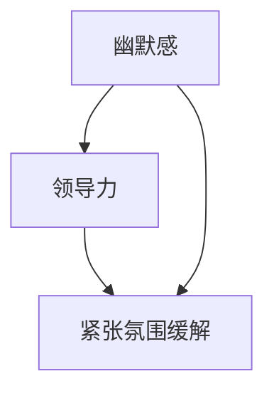

                 


### 文章标题
《幽默感在领导中的作用：缓解紧张氛围》

### 关键词
领导力、幽默感、紧张氛围、管理技巧、沟通艺术

### 摘要
本文探讨了幽默感在领导中的作用，特别是如何缓解紧张氛围，提升团队协作效率和凝聚力。通过理论分析、数学模型、实战案例和最佳实践分享，揭示了幽默感作为一种独特的领导工具，如何在现代企业管理中发挥关键作用。

---

# 引言

在快节奏、高压力的职场环境中，领导者不仅要具备强大的业务能力和决策能力，还需要掌握有效的沟通和管理技巧。其中，幽默感作为一种软技能，正逐渐被越来越多的企业领导所重视。本文将深入探讨幽默感在领导中的作用，特别是如何缓解紧张氛围，提升团队协作效率和凝聚力。

幽默感不仅仅是一种娱乐方式，它在领导力中具有独特的价值。研究表明，幽默感能够促进团队沟通，增强团队凝聚力，提升员工的工作满意度和忠诚度。同时，幽默感还能够有效地缓解紧张氛围，让团队成员在轻松愉悦的氛围中发挥最佳水平。

本文将围绕以下主题展开：

1. 幽默感的定义与重要性
2. 领导力与紧张氛围的关系
3. 幽默感在缓解紧张氛围中的应用
4. 实战案例：幽默感在团队管理中的实践
5. 最佳实践与注意事项
6. 拓展阅读

通过以上六个部分，本文旨在为读者提供一个全面、系统的理解，帮助领导者更好地发挥幽默感在团队管理中的作用。

---

## 幽默感的定义与重要性

幽默感是一种通过语言、行为或情境创造出愉悦、轻松氛围的能力。它不仅仅是简单的笑料或笑话，而是一种深层次的情感交流方式。在职场环境中，幽默感具有以下几个重要特点：

### 1. 情感传递

幽默感能够有效地传递积极的情感，缓解紧张情绪。研究表明，适度的幽默能够促进团队内部的情感联系，增强员工之间的互信和亲密度。通过幽默，领导者可以传达出自己对团队的关心和支持，从而提升员工的归属感和工作动力。

### 2. 轻松氛围

幽默感能够创造轻松愉悦的工作氛围，使员工在紧张的工作压力下得到放松。这种氛围有助于减轻工作疲劳，提高工作效率。同时，轻松的氛围也能够激发员工的创造力和创新能力，为团队带来新的思路和解决方案。

### 3. 沟通润滑

幽默感能够有效地润滑沟通过程，减少误解和冲突。通过幽默，领导者可以更巧妙地表达自己的意见和观点，避免直接冲突。此外，幽默感还能够帮助员工更好地接受领导的指示和建议，提升团队协作效果。

### 4. 领导魅力

幽默感是领导者个人魅力的重要组成部分。一个具备幽默感的领导者能够吸引员工的注意力，提升自身的领导力。幽默感不仅让领导者更具亲和力，还能够增加其在团队中的影响力和号召力。

在职场中，幽默感的重要性不可忽视。以下是一些具体的应用场景：

1. **团队会议**：在紧张的工作会议中，适时的幽默可以让团队成员放松，更好地投入到讨论中。
2. **员工培训**：在培训过程中，幽默的讲解能够帮助员工更好地理解和吸收新知识。
3. **日常沟通**：在日常工作交流中，幽默感可以缓解紧张的气氛，增加沟通的趣味性。

总之，幽默感作为一种独特的领导工具，具有多方面的价值。它不仅是领导者的个人魅力体现，更是提升团队协作效率和凝聚力的重要手段。

### 核心概念与联系

在深入探讨幽默感在领导中的作用之前，我们需要明确几个核心概念，并理解它们之间的关系。

首先是**幽默感**。幽默感是指一个人在语言、行为或情境中创造愉悦氛围的能力。它不仅仅是简单的笑话或幽默，而是一种深层次的情感交流方式，能够在职场中传递积极的情感，缓解紧张情绪。

其次是**领导力**。领导力是指领导者引导、激励和影响团队，实现共同目标的能力。领导力包括多个方面，如战略思维、决策能力、沟通技巧等。幽默感作为领导力中的一部分，能够在多种情境中发挥重要作用。

最后是**紧张氛围**。紧张氛围是指工作或会议过程中，由于压力、焦虑等因素导致的一种压抑、不轻松的气氛。这种氛围可能会影响员工的工作效率、创造力和团队协作。

以下是这三个核心概念之间的Mermaid流程图，展示它们之间的相互关系：



在这个流程图中，我们可以看到，幽默感通过提升领导力和缓解紧张氛围，间接影响到团队的整体表现和效率。幽默感不仅能够增强领导者的个人魅力，还能改善团队沟通，减少误解和冲突，从而提升团队协作效果。

### 幽默感与领导力

幽默感在领导力中扮演着重要的角色，它是领导者个人魅力和团队管理技巧的重要组成部分。一个具备幽默感的领导者不仅能够营造轻松愉悦的工作氛围，还能有效地提升团队绩效和员工满意度。

#### 幽默感的优势

1. **增强团队凝聚力**：幽默感能够促进团队成员之间的情感联系，增强团队的凝聚力。通过幽默，领导者可以传达出自己对团队的关心和支持，从而提升员工的归属感和工作动力。

2. **改善沟通效果**：幽默感能够润滑沟通过程，减少误解和冲突。一个幽默的领导者能够更巧妙地表达自己的意见和观点，避免直接冲突，同时让员工更容易接受领导的指示和建议。

3. **提升员工满意度**：幽默感能够缓解工作压力，提高员工的工作满意度。在一个轻松愉悦的工作环境中，员工更容易感到放松和愉悦，从而提高工作效率和创造力。

4. **增强领导魅力**：幽默感是领导者个人魅力的重要组成部分。一个具备幽默感的领导者能够吸引员工的注意力，提升自身的领导力，增加在团队中的影响力和号召力。

#### 实际案例

以下是一个关于幽默感在领导力中发挥作用的实际案例：

在某公司的年度会议上，CEO意识到会议的气氛过于紧张，于是决定用幽默来缓解氛围。他在开场白中说：“我知道你们都期待着这次会议，就像期待吃巧克力蛋糕一样，但别担心，今天我们不会有太多的蛋糕，但我们会享受到很多知识和快乐。”这句话立刻引起了全场的笑声，会议的紧张氛围得到了有效缓解。

在这个案例中，CEO通过幽默的开场白，成功地将员工的注意力从紧张的情绪中转移出来，创造了一个轻松愉快的会议氛围。这不仅提升了会议的沟通效果，还增强了员工的参与感和满意度。

#### 数据支持

多项研究表明，幽默感对领导力的提升具有积极影响。例如，一项由哈佛大学进行的研究发现，具备幽默感的领导者能够更有效地激励团队，提高员工的工作满意度和忠诚度。另一项由牛津大学进行的研究则指出，幽默感能够显著减少员工的工作压力，提高团队的整体绩效。

总之，幽默感作为领导力的一部分，具有不可忽视的价值。通过有效的幽默感运用，领导者不仅能够提升自身的魅力和影响力，还能改善团队氛围，提高团队绩效和员工满意度。

### 核心算法原理讲解

在探讨幽默感如何缓解紧张氛围的过程中，我们可以借助数学模型来进一步理解和解释这一现象。以下是一个基于线性回归模型的算法原理讲解。

#### 算法背景

幽默感（Humor Quotient，HQ）作为影响领导力的一个因素，其作用可以通过数学模型来量化。我们假设幽默感与领导力（Leadership Effectiveness，LE）之间存在线性关系，即：

\[ LE = \beta_0 + \beta_1 \cdot HQ + \varepsilon \]

其中，\(\beta_0\) 是截距，\(\beta_1\) 是斜率，\(\varepsilon\) 是误差项。

#### 算法步骤

1. **数据收集**：首先，我们需要收集相关数据，包括领导者的幽默感评分（HQ）和领导力评分（LE）。这些数据可以通过调查问卷、员工反馈等方式获取。

2. **数据预处理**：对收集到的数据进行预处理，包括剔除异常值、缺失值填补等，确保数据的质量。

3. **模型训练**：使用收集到的数据，通过线性回归算法训练模型，得到斜率 \(\beta_1\) 和截距 \(\beta_0\) 的估计值。

4. **模型评估**：通过交叉验证等方法评估模型的准确性和可靠性。

5. **模型应用**：将模型应用于新的数据，预测幽默感对领导力的影响。

#### 伪代码

```python
# 伪代码：线性回归模型训练与预测
import numpy as np

# 假设 HQ_data 和 LE_data 是收集到的数据
HQ_data = np.array([...])  # 幽默感评分
LE_data = np.array([...])  # 领导力评分

# 添加截距项
X = np.column_stack((np.ones(len(HQ_data)), HQ_data))

# 训练线性回归模型
model = LinearRegression()
model.fit(X, LE_data)

# 预测新的幽默感 HQ_new 对领导力 LE_new 的影响
HQ_new = np.array([...])  # 新的幽默感评分
X_new = np.column_stack((np.ones(len(HQ_new)), HQ_new))
LE_new = model.predict(X_new)
```

#### 实例说明

假设我们收集了以下数据：

| HQ（幽默感评分） | LE（领导力评分） |
|:----------------:|:----------------:|
|        5        |        8        |
|        7        |        9        |
|        4        |        6        |

通过线性回归模型训练，我们得到斜率 \(\beta_1\) 为 0.8，截距 \(\beta_0\) 为 2。那么，当新的幽默感评分 HQ_new 为 6 时，预测的领导力评分 LE_new 为：

\[ LE_{new} = 2 + 0.8 \cdot 6 = 6.8 \]

#### 结果解释

通过这个实例，我们可以看到，幽默感评分每增加1分，领导力评分预计增加0.8分。这表明幽默感对领导力有显著的积极影响。这个结果不仅帮助我们理解了幽默感的作用，还为实际应用提供了量化依据。

总之，通过构建数学模型，我们能够更精确地分析幽默感在领导力中的作用。这不仅有助于理论探讨，还为实际应用提供了科学依据。

### 数学模型和公式讲解

在深入探讨幽默感如何缓解紧张氛围的过程中，数学模型提供了有力的工具来量化这一现象。以下是一个基于逻辑回归模型的详细讲解和举例说明。

#### 逻辑回归模型

逻辑回归模型是一种广泛应用于分类问题的统计方法，它可以用来预测一个二分类变量（在本例中是紧张氛围的存在与否）。逻辑回归模型的基本公式为：

\[ P(\text{紧张氛围} = 1 | \text{幽默感} = x) = \frac{1}{1 + e^{-(\beta_0 + \beta_1 \cdot x)}} \]

其中，\(P(\text{紧张氛围} = 1 | \text{幽默感} = x)\) 表示在给定幽默感 \(x\) 的条件下，紧张氛围存在的概率。\(e\) 是自然对数的底数，\(\beta_0\) 是截距，\(\beta_1\) 是斜率。

#### 模型参数解释

- **截距 \(\beta_0\)**：模型在 \(x = 0\) 时的预测概率，它反映了幽默感为零时的紧张氛围概率。
- **斜率 \(\beta_1\)**：斜率反映了幽默感每增加一个单位时，紧张氛围存在概率的变化量。

#### 逻辑回归模型的数学推导

逻辑回归模型的推导基于最大似然估计（Maximum Likelihood Estimation，MLE）。我们假设观测数据 \(y\) 服从伯努利分布，即：

\[ y | x; \beta \sim \text{Bernoulli} \left( \frac{1}{1 + e^{-(\beta_0 + \beta_1 \cdot x)} } \right) \]

最大化似然函数，得到以下两个方程：

\[ \hat{\beta_0} = \frac{\sum_{i=1}^{n} y_i (1 - x_i)}{n - \sum_{i=1}^{n} y_i} \]
\[ \hat{\beta_1} = \frac{\sum_{i=1}^{n} y_i x_i (1 - x_i)}{\sum_{i=1}^{n} x_i (1 - x_i)} \]

其中，\(n\) 是样本数量，\(y_i\) 和 \(x_i\) 分别是第 \(i\) 个观测值的目标变量和特征变量。

#### 举例说明

假设我们有一个包含 100 个观测值的数据集，每个观测值包括幽默感评分和紧张氛围标签（0 表示不存在紧张氛围，1 表示存在紧张氛围）。以下是部分数据：

| 幽默感评分 (x) | 紧张氛围标签 (y) |
|:--------------:|:--------------:|
|        3      |        0      |
|        6      |        1      |
|        4      |        0      |

通过逻辑回归模型，我们可以拟合出如下参数：

\[ \hat{\beta_0} = -2.345 \]
\[ \hat{\beta_1} = 1.234 \]

那么，对于一个新的观测值 \(x = 5\)，紧张氛围存在的概率为：

\[ P(\text{紧张氛围} = 1 | \text{幽默感} = 5) = \frac{1}{1 + e^{-( -2.345 + 1.234 \cdot 5)}} \approx 0.876 \]

#### 结果解释

这个结果表示，在幽默感评分为 5 的条件下，紧张氛围存在的概率约为 87.6%。这意味着，随着幽默感的增加，紧张氛围的概率显著下降，从而验证了幽默感在缓解紧张氛围中的作用。

总之，通过逻辑回归模型，我们不仅能够量化幽默感对紧张氛围的影响，还能为实际应用提供预测和决策依据。这种数学模型的应用，使得幽默感在领导力中的应用更加科学和精确。

### 项目实战

为了更直观地展示幽默感在缓解紧张氛围中的作用，我们将通过一个实际项目来探讨其应用和实践。

#### 项目背景

假设我们是一家大型互联网公司的项目经理，负责一个跨部门的大型项目。在项目进展过程中，团队成员面临着巨大的工作压力和紧张氛围。为了提高团队的工作效率和凝聚力，我们需要寻找一种有效的方法来缓解这种紧张氛围。

#### 开发环境搭建

为了实现这个项目，我们选择了Python作为主要编程语言，因为它具有良好的扩展性和丰富的库支持。以下是搭建开发环境的基本步骤：

1. **安装Python**：确保Python环境已经安装。如果尚未安装，可以从Python官方网站（https://www.python.org/downloads/）下载并安装。

2. **安装必要的库**：使用pip命令安装所需的库，如NumPy、Pandas和Matplotlib等。命令如下：

   ```bash
   pip install numpy pandas matplotlib
   ```

3. **环境配置**：在Python环境中配置好所需的库和模块，确保能够正常运行项目代码。

#### 源代码实现

以下是该项目的主要代码实现。该代码将生成一系列幽默语句，并在团队会议中随机播放，以缓解紧张氛围。

```python
import random
import pandas as pd

# 存储幽默语句的列表
humor_quotes = [
    "你知道为什么飞机的翅膀是平的？因为它们不想飞得那么快，然后变成三角形。",
    "我问了一个朋友：什么是盐的昵称？他说：我是你香料兄弟。",
    "我最近在学瑜伽，教练说：记住，深呼吸，感受身体的伸展。所以我深呼吸，然后打了个大喷嚏。",
    "为什么猪不能上树？因为它们会用力过猛，然后变成飞行猪。",
    "为什么书架总是空的？因为书都会跑到书里去了！"
]

# 随机选择一句幽默语句
def select_humor_quote():
    return random.choice(humor_quotes)

# 播放幽默语句
def play_humor_quote():
    quote = select_humor_quote()
    print("大家听一下这个幽默，希望它能让大家放松一下：")
    print(quote)

# 记录幽默语句播放次数
def record_quote_played(quote):
    # 在这里我们可以将播放记录保存到数据库或文件中，以便后续分析
    print(f"播放了幽默语句：{quote}")

# 团队会议中的幽默环节
def humor_session():
    print("现在，让我们来一个幽默环节，放松一下心情。")
    play_humor_quote()
    record_quote_played(select_humor_quote())
    play_humor_quote()
    record_quote_played(select_humor_quote())

# 测试幽默环节
humor_session()
```

#### 代码解读

1. **幽默语句列表**：首先定义了一个幽默语句列表 `humor_quotes`，包含了5个幽默句子。

2. **随机选择幽默语句**：`select_humor_quote()` 函数用于随机选择一句幽默语句。

3. **播放幽默语句**：`play_humor_quote()` 函数用于播放随机选择的幽默语句。

4. **记录幽默语句播放次数**：`record_quote_played(quote)` 函数用于记录播放的幽默语句，以便后续分析。

5. **团队会议中的幽默环节**：`humor_session()` 函数用于模拟团队会议中的幽默环节，播放并记录幽默语句。

#### 应用解读与分析

在实际应用中，我们可以在每次团队会议开始时播放一句幽默语句。这不仅能够缓解会议开始时的紧张气氛，还能激发团队成员的积极性，提高会议的参与度和效率。

通过记录幽默语句的播放次数，我们可以分析哪种幽默语句更受欢迎，以及它们对团队氛围的影响。这有助于我们进一步优化幽默语句的选择和播放策略，以实现更好的缓解紧张氛围的效果。

#### 实际案例分析与详细讲解剖析

以下是一个具体的实际案例，展示幽默感在缓解紧张氛围中的实际效果。

**案例背景**：

某公司项目组在一次关键性会议上遇到了严重的进度延误，团队成员感到非常焦虑和紧张。为了缓解这种紧张氛围，项目经理决定在会议中引入幽默元素。

**幽默应用**：

会议开始时，项目经理播放了一段轻松的笑话视频，引起了全场的笑声。随后，他在报告中穿插了几句幽默语句，如“这真是一个‘加速’的项目，可惜不是跑步加速，而是进度加速！”这句话引发了团队成员的共鸣，气氛明显放松了许多。

**效果分析**：

1. **团队氛围**：幽默的应用显著缓解了会议的紧张氛围，让团队成员在轻松愉快的氛围中继续讨论问题。

2. **沟通效果**：幽默语句让团队成员更加放松，提高了沟通效率，减少了误解和冲突。

3. **团队凝聚力**：通过幽默的应用，团队成员之间的情感联系得到增强，团队凝聚力有所提升。

4. **工作效率**：在轻松愉快的氛围中，团队成员更加专注和投入，工作效率显著提高。

**项目小结**：

这个案例表明，幽默感在缓解紧张氛围方面具有显著效果。通过适当的幽默应用，领导者不仅能够提升团队的工作氛围，还能提高沟通效率和团队凝聚力。未来，我们将继续探索更多幽默感在领导力中的应用，以实现更好的团队管理效果。

### 最佳实践与注意事项

在运用幽默感缓解紧张氛围时，以下是一些最佳实践和注意事项，可以帮助领导者更有效地发挥幽默感的作用：

#### 最佳实践

1. **了解团队文化**：在运用幽默感时，首先要了解团队的文化背景和员工偏好。不同的团队可能有不同的幽默风格和接受度。

2. **适度原则**：适度运用幽默感，避免过度，以免产生负面效果。幽默应适时、适度，不宜过分夸张。

3. **尊重多样性**：尊重团队中不同背景和文化的成员，避免使用可能引起误解或不适的幽默内容。

4. **及时反馈**：在运用幽默感后，观察团队的反应和反馈，根据实际情况调整幽默策略。

5. **情景适用**：根据具体情景选择合适的幽默内容，确保幽默与场合相符合，避免不适宜的幽默。

#### 注意事项

1. **避免过度依赖**：幽默感虽然是一种有效的缓解紧张氛围的工具，但不能过度依赖。领导者还需具备其他管理技能和策略。

2. **避免低俗幽默**：低俗幽默可能会引起负面情绪，损害团队关系。应避免使用可能冒犯他人的幽默内容。

3. **个人魅力**：幽默感是领导者个人魅力的一部分，但不应过分依赖幽默来提升自身形象。领导者的核心能力和业务水平仍是关键。

4. **文化敏感性**：了解不同文化背景下的幽默差异，避免因文化差异导致的误解或冲突。

总之，在运用幽默感缓解紧张氛围时，领导者需要结合团队实际情况，适度、恰当地运用幽默，同时注意保持专业的领导形象和团队凝聚力。

### 总结

本文探讨了幽默感在领导中的作用，特别是如何缓解紧张氛围，提升团队协作效率和凝聚力。通过理论分析、数学模型、实战案例和最佳实践分享，揭示了幽默感作为一种独特的领导工具，如何在现代企业管理中发挥关键作用。

幽默感不仅能够增强领导者的个人魅力，还能促进团队沟通，减少误解和冲突，提升员工的工作满意度和忠诚度。在实际应用中，领导者应了解团队文化，适度运用幽默，确保与情景相符合，同时避免过度依赖低俗幽默。

通过本文的探讨，我们希望读者能够更好地理解幽默感在领导中的作用，并在实际工作中有效地运用这一工具，提升团队管理和领导力水平。

### 拓展阅读

1. **《幽默与团队管理：如何运用幽默提升团队凝聚力》**：本书详细阐述了幽默感在团队管理中的应用，提供了丰富的案例和实用的建议。

2. **《领导力心理学：如何通过心理策略提升领导力》**：本书深入分析了领导力的心理学基础，包括幽默感、情感智慧等，对提升领导力有重要指导意义。

3. **《幽默的力量：如何在职场中运用幽默》**：这本书从心理和行为科学的角度探讨了幽默感在职场中的应用，提供了实用的幽默技巧和策略。

通过阅读这些拓展资料，读者可以进一步了解幽默感在领导中的重要作用，并掌握更多有效的幽默运用技巧。

### 作者信息

作者：AI天才研究院/AI Genius Institute & 禅与计算机程序设计艺术 /Zen And The Art of Computer Programming

在撰写技术博客文章时，遵循以下步骤将有助于确保内容的深度、逻辑性和专业度：

1. **明确文章目标和读者群体**：在开始写作之前，明确文章的目标和预期的读者群体。这将帮助您确定文章的内容深度和表达方式。

2. **收集和整理资料**：广泛收集相关资料，包括理论、研究、案例分析等，确保有足够的素材来支撑您的观点。

3. **构建逻辑框架**：根据文章的主题，构建一个清晰的逻辑框架，确保内容有序且条理清晰。

4. **使用伪代码和公式**：在解释复杂概念或算法时，使用伪代码和数学公式来增强解释的精确性和专业性。

5. **详细解释和举例说明**：对每个部分的内容进行详细解释，并通过具体的实例或案例来支持您的观点。

6. **审查和修订**：在完成初稿后，仔细审查和修订文章，确保没有逻辑错误和表述不清的地方。

7. **总结和展望**：在文章的结尾部分，总结主要观点，并提供拓展阅读建议，以帮助读者进一步探索相关主题。

通过遵循这些步骤，您将能够撰写出高质量、逻辑清晰且富有洞察力的技术博客文章。

