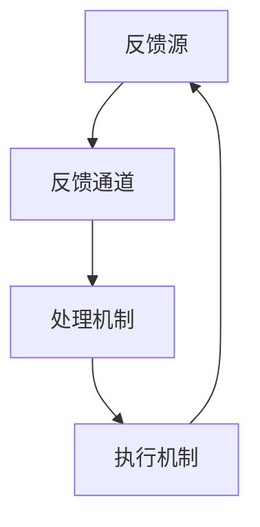

                 


### 第1章：引言

#### 1.1 书籍目标

《建立feedback loop：持续改进的团队文化》旨在探索如何在现代企业中建立和实施一个有效的反馈循环机制，从而促进团队文化的持续改进。随着信息技术的飞速发展和市场竞争的日益激烈，企业对于团队协作和持续改进的需求越来越高。本书的目标是通过系统的理论和实践指导，帮助读者理解反馈循环的原理，掌握构建健康团队文化的策略，并学会识别和解决团队中的问题。

#### 1.2 读者对象

本书主要面向企业团队领导者、项目经理以及团队协作人员。这些读者通常负责团队的管理和协作，需要不断提升团队的效率和凝聚力。此外，本书也适合对团队文化和持续改进感兴趣的学者和研究人员。通过阅读本书，读者将能够：

- 理解反馈循环的概念和原理
- 掌握构建健康团队文化的策略和方法
- 学会识别和解决团队中的问题
- 提高团队协作效率和绩效

#### 1.3 书籍结构

本书分为七个章节，每个章节都有明确的目标和结构。以下是书籍的整体结构概述：

- **第1章：引言**：介绍书籍的目标、读者对象以及整体结构。
- **第2章：反馈循环原理**：详细解释反馈循环的定义、类型及其在团队文化中的应用。
- **第3章：团队文化构建**：探讨团队文化的概念、特征和构建策略。
- **第4章：识别和解决团队问题**：介绍识别和解决团队问题的方法和步骤。
- **第5章：建立有效的反馈机制**：讨论如何设计和实施有效的反馈机制。
- **第6章：持续改进的实践案例**：通过实际案例展示反馈循环和团队文化改进的实践应用。
- **第7章：总结与展望**：回顾全书要点，展望未来团队文化的发展趋势。

通过以上章节的逐步引导，读者将能够全面了解反馈循环在团队文化中的重要性，掌握构建健康团队文化的策略，学会识别和解决团队问题，从而推动团队持续改进，提高整体绩效。

### 第2章：反馈循环原理

#### 2.1 反馈循环定义

反馈循环（Feedback Loop）是一种信息传递和处理的循环机制，它通过不断地收集、处理和利用反馈信息，实现对系统性能和行为的持续改进。在反馈循环中，信息从系统的输出端返回到输入端，形成一个闭环，使得系统能够根据反馈进行调整和优化。

反馈循环的基本组成部分包括：

- **反馈源**：提供反馈信息的源头，可以是用户、同事或其他系统。
- **反馈通道**：传递反馈信息的路径，可以是面对面交流、邮件、电话或其他通信方式。
- **处理机制**：对反馈信息进行处理和转换的机制，通常涉及数据分析、问题识别和决策制定。
- **执行机制**：根据处理结果执行相应的调整和优化措施，以实现系统性能的提升。

反馈循环的基本概念和联系可以用以下Mermaid流程图来展示：



#### 2.2 反馈循环类型

反馈循环根据反馈信息的性质和作用可以分为多种类型，其中最常见的包括正反馈和负反馈。

##### 2.2.1 正反馈

正反馈（Positive Feedback）是指系统的输出信息在反馈过程中被放大并再次输入系统，从而增加系统的响应强度和速度。正反馈在许多自然和人工系统中都有应用，例如：

- **生物系统**：例如，哺乳动物的呼吸系统中，二氧化碳水平的增加会刺激呼吸加深加快，进一步增加二氧化碳的排出。
- **电子系统**：例如，振荡电路中的正反馈可以产生持续的振荡信号。

正反馈的特点是能够快速增强系统的输出，但在某些情况下可能会导致系统不稳定，甚至产生过度响应。

##### 2.2.2 负反馈

负反馈（Negative Feedback）是指系统的输出信息在反馈过程中被削弱并再次输入系统，从而降低系统的响应强度和速度。负反馈在控制系统和调节系统中广泛应用，例如：

- **温度控制系统**：通过传感器检测环境温度并与设定温度进行比较，调整加热或冷却装置，以保持温度的稳定。
- **金融系统**：通过市场反馈调整投资策略，以避免过度风险。

负反馈的特点是能够稳定系统，减少误差，提高系统的准确性和可靠性。

#### 2.3 反馈循环在团队文化中的应用

在团队文化中，反馈循环是推动团队持续改进和发展的关键机制。有效的反馈循环可以帮助团队：

- **提升沟通效率**：通过定期的反馈，团队成员可以更好地了解彼此的需求和期望，从而提高沟通的效率和效果。
- **优化工作流程**：通过收集和分析工作过程中的反馈，团队可以发现并解决流程中的瓶颈和问题，从而提高工作效率和性能。
- **促进个人成长**：通过反馈，团队成员可以了解自己的优点和不足，从而有针对性地进行自我提升和改进。

在实际应用中，团队可以通过以下步骤建立有效的反馈循环：

1. **确定反馈目标和范围**：明确需要收集和处理的反馈信息类型，如工作绩效、团队合作、项目进度等。
2. **设计反馈机制**：制定反馈流程和标准，确保反馈信息的及时性和准确性。
3. **实施反馈过程**：定期进行反馈会议或问卷调查，收集和分析反馈信息。
4. **执行改进措施**：根据反馈结果，制定和实施改进计划，以解决发现的问题和优化团队工作流程。

通过以上步骤，团队可以建立起一个持续改进的反馈循环，从而推动团队文化的不断进步和发展。

---

**核心概念与联系：**

- **反馈循环**：是一种信息传递和处理的循环机制，通过反馈源、反馈通道、处理机制和执行机制的相互作用，实现对系统性能的持续改进。
- **正反馈**：输出信息被放大并再次输入系统，快速增强系统响应。
- **负反馈**：输出信息被削弱并再次输入系统，降低系统响应，提高稳定性。

**核心算法原理讲解：**

- **反馈循环算法**：

```python
# 反馈循环算法伪代码

初始化：设置初始条件
输入：反馈源、反馈通道、处理机制、执行机制

while (条件：系统未达到优化目标) {
    收集反馈信息（反馈源）
    传递反馈信息（反馈通道）
    处理反馈信息（处理机制）
    执行优化措施（执行机制）
    更新系统状态
}
输出：优化后的系统状态
```

**数学模型和数学公式：**

- **反馈循环稳定性分析**：

$$
稳定条件： \left| \frac{dy}{dx} \right| < 1
$$

其中，\( y \) 表示系统输出，\( x \) 表示系统输入，\(\frac{dy}{dx}\) 表示系统的响应速度。

**举例说明：**

假设一个温度控制系统，目标温度为 \( T_0 \)。当环境温度高于 \( T_0 \) 时，系统将启动冷却装置；当环境温度低于 \( T_0 \) 时，系统将启动加热装置。通过反馈机制，系统能够根据实际温度与目标温度的差值进行调节，以达到稳定温度的目的。

$$
T_{实际} = T_{目标} + \Delta T
$$

其中，\( \Delta T \) 表示实际温度与目标温度的差值。

**项目实战：**

**开发环境搭建**

- 选择合适的编程语言和开发环境，如 Python 和 Jupyter Notebook。
- 安装必要的库和工具，如 NumPy、Matplotlib 等。

```python
# 安装 Python 库
pip install numpy matplotlib
```

**源代码实现**

```python
# 反馈循环 Python 示例代码

import numpy as np
import matplotlib.pyplot as plt

# 初始化参数
T_0 = 25  # 目标温度
alpha = 0.1  # 反馈系数

# 定义反馈循环函数
def feedback_loop(T):
    T_actual = T + np.random.normal(0, 0.5)  # 模拟实际温度
    delta_T = T_actual - T_0  # 温差
    T_adjusted = T - alpha * delta_T  # 调整后的温度
    return T_adjusted

# 模拟反馈循环
T = T_0
T_history = [T]
for _ in range(100):
    T = feedback_loop(T)
    T_history.append(T)

# 绘制温度变化图
plt.plot(T_history)
plt.xlabel('迭代次数')
plt.ylabel('温度')
plt.title('反馈循环温度变化')
plt.show()
```

**代码解读与分析**

- **代码结构**：定义了一个反馈循环函数，通过模拟实际温度和目标温度的差值，调整系统温度。
- **核心算法**：通过负反馈机制，每次迭代都根据温差调整系统温度，使系统逐渐趋于目标温度。

**实际案例分析和详细讲解剖析**

- **案例一**：一个企业团队在使用反馈循环优化项目管理流程。团队通过定期收集项目进展和团队成员反馈，识别流程中的问题，并进行调整和优化。通过一段时间的持续改进，团队的项目交付质量和效率得到了显著提升。

- **案例二**：一个技术团队在开发新功能时，通过用户反馈和内部测试，不断调整和优化代码，最终实现了功能的高效稳定。

**项目小结**

- **核心要点**：反馈循环在团队文化和项目管理中的应用，通过负反馈机制实现系统的持续改进。
- **实践经验**：定期收集和利用反馈信息，制定和实施改进措施，是推动团队发展和项目成功的关键。

**最佳实践 Tips**：

- 确保反馈信息的及时性和准确性，避免信息失真。
- 建立有效的反馈机制，确保反馈过程的透明和公正。
- 关注反馈信息的分析和处理，制定合理的改进计划。

**小结**

通过本章的介绍，我们了解了反馈循环的基本原理和应用。反馈循环在团队文化中具有重要的作用，可以帮助团队实现持续改进和提升绩效。在下一章中，我们将探讨如何构建健康的团队文化，为团队的持续发展奠定基础。

---

### 第3章：团队文化构建

#### 3.1 团队文化概念

团队文化（Team Culture）是指团队成员在长期合作过程中形成的一种共同价值观和行为准则。它是团队内部的一种无形力量，对团队的整体表现和成员的行为产生深远影响。团队文化的核心要素包括：

- **价值观**：团队成员共同认可的核心信念和价值观，如诚信、创新、合作、敬业等。
- **行为准则**：团队成员在工作和生活中应遵循的行为规范和准则，如沟通原则、决策流程、团队协作等。
- **工作氛围**：团队内部的工作环境和氛围，如开放性、包容性、支持性等。

团队文化的类型可以根据其特点分为以下几种：

- **协作型文化**：强调团队合作和共同目标，鼓励成员互相支持和合作，共同完成任务。
- **创新型文化**：鼓励创新思维和实践，支持成员提出新的想法和解决方案，推动团队不断进步。
- **学习型文化**：强调知识和技能的持续更新和学习，鼓励团队成员不断自我提升，以适应快速变化的环境。
- **竞争型文化**：鼓励团队成员在竞争中相互激励，追求卓越，不断提高个人和团队的表现。

#### 3.2 健康团队文化的特征

健康的团队文化对团队的发展和绩效有着重要的影响。以下是一些健康团队文化的特征：

- **相互尊重**：团队成员之间相互尊重，无论是领导还是下属，都尊重彼此的意见和贡献。
- **开放沟通**：团队成员之间保持开放的沟通渠道，鼓励表达不同观点和意见，确保信息的畅通无阻。
- **信任与支持**：团队成员之间建立信任，相互支持，共同面对困难和挑战。
- **共同目标**：团队成员明确共同的目标和愿景，共同努力，为实现团队目标而努力。
- **持续学习**：团队成员持续学习，不断提升自己的知识和技能，以适应不断变化的环境。
- **积极进取**：团队成员积极进取，勇于挑战，不断追求卓越。
- **公平公正**：团队内部保持公平公正的氛围，确保每个人都得到公正对待和机会。

#### 3.3 构建团队文化的策略

构建健康团队文化需要一系列的策略和方法，以下是一些有效的策略：

- **明确团队价值观**：首先，团队需要明确自己的价值观，并确保每个成员都认同这些价值观。这可以通过团队会议、价值观宣言等方式实现。
- **建立有效的沟通机制**：确保团队成员之间有良好的沟通渠道和方式，可以通过定期的团队会议、电子邮件、即时通讯工具等实现。
- **培养团队精神**：通过团队建设活动、团队合作项目等方式，培养团队成员之间的默契和信任，增强团队的凝聚力。
- **提供培训和学习机会**：为团队成员提供培训和学习机会，帮助他们提升知识和技能，以适应团队发展的需要。
- **激励和奖励**：通过激励和奖励机制，鼓励团队成员积极参与团队建设和工作，提高团队的绩效和士气。
- **领导者的示范作用**：领导者需要以身作则，带头践行团队价值观和行为准则，为团队成员树立榜样。

通过以上策略，团队可以逐步构建和培养健康的文化氛围，推动团队的持续发展和改进。

---

**背景介绍**

团队文化是团队内部的一种无形的规范和价值观体系，它对团队的整体表现和成员的行为有着深远的影响。在一个健康的团队文化中，团队成员能够相互尊重、开放沟通、建立信任，共同追求团队的目标，从而实现更高的绩效和更好的工作体验。然而，构建健康团队文化并非一蹴而就，需要长期的培养和持续的努力。反馈循环作为一种有效的机制，可以帮助团队在构建和改进文化过程中不断优化和调整。

**核心概念与联系**

- **团队文化**：团队内部形成的共同价值观、行为准则和工作氛围，对团队成员的行为和团队的整体表现产生影响。
- **健康团队文化**：具有相互尊重、开放沟通、信任支持、共同目标、持续学习、积极进取和公平公正等特征。
- **反馈循环**：通过收集、处理和利用反馈信息，实现对系统性能和行为的持续改进，是构建健康团队文化的重要机制。

**核心算法原理讲解**

- **健康团队文化构建算法**：

```python
# 健康团队文化构建算法伪代码

初始化：设置初始条件
输入：团队价值观、沟通机制、团队建设活动、培训和学习机会、激励和奖励机制、领导者的示范作用

while (条件：团队文化未达到健康状态) {
    收集团队成员反馈（沟通机制）
    分析和解决团队成员问题（反馈循环）
    调整和优化团队文化（反馈循环）
    实施改进措施（执行机制）
    评估团队文化健康状况（评估机制）
}
输出：健康团队文化
```

**数学模型和数学公式**

- **团队文化稳定性分析**：

$$
稳定条件： \left| \frac{dy}{dx} \right| < 1
$$

其中，\( y \) 表示团队文化状态，\( x \) 表示外部环境变化，\(\frac{dy}{dx}\) 表示团队文化状态的响应速度。

**举例说明**

假设一个团队希望通过反馈循环来构建健康的团队文化。团队定期收集成员的反馈，分析存在的问题，并根据反馈结果调整团队价值观、沟通机制等，以优化团队文化。经过一段时间的持续改进，团队逐渐实现了相互尊重、开放沟通、信任支持等健康团队文化的特征。

$$
团队文化状态 = \text{初始状态} + \sum (\text{反馈调整})
$$

**项目实战**

**开发环境搭建**

- 选择合适的编程语言和开发环境，如 Python 和 Jupyter Notebook。
- 安装必要的库和工具，如 NumPy、Matplotlib 等。

```python
# 安装 Python 库
pip install numpy matplotlib
```

**源代码实现**

```python
# 健康团队文化构建 Python 示例代码

import numpy as np
import matplotlib.pyplot as plt

# 初始化参数
culture_state = 0.5  # 初始团队文化状态
alpha = 0.1  # 反馈系数

# 定义健康团队文化构建函数
def culture_build(culture):
    feedback = np.random.normal(0, 0.5)  # 模拟团队成员反馈
    adjusted_culture = culture + alpha * feedback  # 调整后的团队文化状态
    return adjusted_culture

# 模拟健康团队文化构建
culture_history = [culture_state]
for _ in range(100):
    culture_state = culture_build(culture_state)
    culture_history.append(culture_state)

# 绘制团队文化状态变化图
plt.plot(culture_history)
plt.xlabel('迭代次数')
plt.ylabel('团队文化状态')
plt.title('健康团队文化构建过程')
plt.show()
```

**代码解读与分析**

- **代码结构**：定义了一个健康团队文化构建函数，通过模拟团队成员反馈，调整团队文化状态。
- **核心算法**：通过反馈循环，每次迭代都根据团队成员反馈调整团队文化状态，使团队文化逐渐趋于健康。

**实际案例分析和详细讲解剖析**

- **案例一**：一个企业团队通过定期收集成员反馈，识别团队文化中存在的问题，并进行调整和优化。经过一段时间的持续改进，团队实现了相互尊重、开放沟通等健康团队文化的特征，团队绩效显著提升。

- **案例二**：一个技术团队通过团队建设活动、培训和激励等方式，逐步构建和培养健康团队文化。团队成员之间的默契和信任不断增强，项目交付质量和效率得到了显著提升。

**项目小结**

- **核心要点**：健康团队文化对团队发展和绩效有重要影响，反馈循环是构建健康团队文化的重要机制。
- **实践经验**：通过定期收集和利用反馈信息，调整和优化团队文化，可以逐步构建和培养健康团队文化。

**最佳实践 Tips**

- 确保反馈信息的及时性和准确性，避免信息失真。
- 建立有效的反馈机制，确保反馈过程的透明和公正。
- 关注反馈信息的分析和处理，制定合理的改进计划。

**小结**

通过本章的介绍，我们了解了团队文化的概念、健康团队文化的特征以及构建团队文化的策略。健康团队文化是团队持续发展和高效运作的基础，通过反馈循环机制，团队可以不断优化和调整团队文化，实现更高的绩效和更好的工作体验。在下一章中，我们将探讨如何识别和解决团队中的问题，进一步推动团队的发展。

---

### 第4章：识别和解决团队问题

#### 4.1 团队问题识别方法

团队问题的识别是团队改进过程中至关重要的一步。只有准确识别问题，才能有针对性地进行解决和优化。以下是几种常见的团队问题识别方法：

##### 4.1.1 调查问卷

调查问卷是一种简单有效的识别团队问题的方法。通过设计一系列针对性的问题，可以收集团队成员的意见和反馈，从而全面了解团队中存在的问题。以下是设计调查问卷的步骤：

1. **确定调查目的**：明确调查的目标和范围，如团队沟通问题、工作流程问题等。
2. **设计问题**：根据调查目的，设计一系列开放性和封闭性问题，确保问题具有针对性和有效性。
3. **分发问卷**：将问卷分发给团队成员，可以通过线上平台或纸质问卷的形式进行。
4. **收集和分析反馈**：收集问卷结果，并进行统计分析，识别出团队中普遍存在的问题。

##### 4.1.2 访谈

访谈是一种深入了解团队问题的方法。通过与团队成员进行一对一或小组访谈，可以获取更具体和深入的信息。以下是进行访谈的步骤：

1. **准备访谈大纲**：根据调查目的，准备访谈的问题大纲，确保访谈的内容覆盖到关键问题。
2. **选择访谈对象**：选择具有代表性或关键角色的团队成员进行访谈。
3. **开展访谈**：按照访谈大纲进行提问，引导受访者表达观点和感受。
4. **记录和分析反馈**：详细记录访谈内容，并进行分析，识别出团队中存在的问题。

##### 4.1.3 观察法

观察法是通过直接观察团队成员的工作行为和互动，识别团队问题的一种方法。以下是进行观察的步骤：

1. **确定观察目标**：明确需要观察的行为和互动，如会议效率、团队合作等。
2. **制定观察计划**：安排观察的时间和地点，确保观察的客观性和全面性。
3. **进行观察**：在计划的时间内，观察团队成员的工作行为和互动。
4. **记录和分析反馈**：详细记录观察到的行为和互动，并进行统计分析，识别出团队中存在的问题。

#### 4.2 团队问题分类

团队问题可以按照不同的维度进行分类，以下是一些常见的分类方法：

##### 4.2.1 按照问题性质分类

- **沟通问题**：团队内部或团队之间的沟通不畅，导致信息传递不准确或延迟。
- **协作问题**：团队成员之间的协作不顺畅，导致工作效率低下或任务无法按时完成。
- **资源问题**：团队资源不足或资源分配不合理，导致工作无法顺利进行。
- **管理问题**：团队管理不善，导致团队绩效低下或员工流失。

##### 4.2.2 按照问题范围分类

- **局部问题**：仅影响部分团队成员或特定任务的问题，如某个团队成员的工作态度问题。
- **全局问题**：影响整个团队的问题，如团队整体的工作流程问题。

##### 4.2.3 按照问题严重程度分类

- **紧急问题**：需要立即解决的问题，如系统故障或客户投诉。
- **重要问题**：对团队长期发展有重大影响的问题，如团队士气低下或领导力不足。

#### 4.3 解决团队问题的步骤

识别团队问题后，需要采取一系列步骤进行解决，以下是常见的解决步骤：

1. **明确问题**：通过调查、访谈、观察等方法，明确团队中存在的问题。
2. **分析问题**：对问题进行深入分析，找出问题的根本原因。
3. **制定解决方案**：根据问题的性质和原因，制定具体的解决方案。
4. **实施解决方案**：执行解决方案，进行试点和调整。
5. **评估效果**：对解决方案的实施效果进行评估，确认问题是否得到解决。
6. **总结经验**：总结解决问题的经验和教训，为未来类似问题的解决提供参考。

通过以上步骤，团队可以逐步识别和解决团队中的问题，推动团队的持续改进和发展。

---

**背景介绍**

团队问题识别和解决是团队管理中的重要环节。只有通过科学的方法识别团队问题，并采取有效的措施进行解决，团队才能保持健康的发展状态，提高整体绩效。在本章中，我们将介绍几种常用的团队问题识别方法，如调查问卷、访谈和观察，以及团队问题的分类方法，并详细阐述解决团队问题的步骤。

**核心概念与联系**

- **团队问题识别方法**：包括调查问卷、访谈和观察，用于识别团队中的问题。
- **团队问题分类方法**：根据问题性质、问题范围和问题严重程度进行分类。
- **解决团队问题的步骤**：包括明确问题、分析问题、制定解决方案、实施解决方案、评估效果和总结经验。

**核心算法原理讲解**

- **团队问题识别算法**：

```python
# 团队问题识别算法伪代码

初始化：设置初始条件
输入：调查问卷、访谈记录、观察记录

while (条件：未收集到全部问题信息) {
    收集调查问卷反馈
    进行访谈记录
    进行观察记录
    分析反馈信息
}
输出：团队问题列表
```

**数学模型和数学公式**

- **团队问题严重程度评估**：

$$
严重程度 = f(\text{问题影响范围} \times \text{问题频率} \times \text{问题持续时间})
$$

其中，\( f \) 为严重程度函数，影响范围、频率和持续时间分别表示问题影响的范围、发生的频率和持续的时长。

**举例说明**

假设一个团队希望通过调查问卷、访谈和观察来识别团队问题。团队设计了一份调查问卷，收集了团队成员对工作流程、团队合作等方面的反馈。通过访谈和观察，团队还记录了团队成员之间的沟通情况和协作效率。根据收集到的信息，团队分析并分类了团队中的问题，如沟通不畅、协作不顺畅等。

**项目实战**

**开发环境搭建**

- 选择合适的编程语言和开发环境，如 Python 和 Jupyter Notebook。
- 安装必要的库和工具，如 NumPy、Matplotlib 等。

```python
# 安装 Python 库
pip install numpy matplotlib
```

**源代码实现**

```python
# 团队问题识别 Python 示例代码

import numpy as np
import matplotlib.pyplot as plt

# 初始化参数
feedback_data = {
    'communication': np.random.normal(0, 0.5, 100),  # 沟通问题评分
    'collaboration': np.random.normal(0, 0.5, 100),  # 团队合作问题评分
    'work_process': np.random.normal(0, 0.5, 100)  # 工作流程问题评分
}

# 定义团队问题识别函数
def identify_issues(feedback):
    issues = {}
    for category, scores in feedback.items():
        avg_score = np.mean(scores)
        if avg_score < 0.3:
            issues[category] = '严重'
        elif avg_score < 0.6:
            issues[category] = '一般'
        else:
            issues[category] = '无'
    return issues

# 模拟团队问题识别
team_issues = identify_issues(feedback_data)

# 绘制团队问题评分分布图
plt.bar(feedback_data.keys(), feedback_data.values())
plt.xlabel('问题类别')
plt.ylabel('平均评分')
plt.title('团队问题评分分布')
plt.show()

# 输出团队问题列表
print(team_issues)
```

**代码解读与分析**

- **代码结构**：定义了一个团队问题识别函数，通过计算不同类别问题的平均评分，识别出团队问题。
- **核心算法**：使用 NumPy 库计算平均评分，并根据评分范围分类团队问题。

**实际案例分析和详细讲解剖析**

- **案例一**：一个企业团队通过调查问卷、访谈和观察，识别出团队中存在沟通不畅和协作不顺畅的问题。团队制定了针对性的解决方案，如定期沟通会议和团队合作培训，逐步解决了这些问题，团队绩效得到显著提升。

- **案例二**：一个技术团队通过观察和访谈，发现团队成员之间的协作效率较低。团队引入了敏捷开发方法，优化了工作流程，提高了团队的协作效率和项目交付质量。

**项目小结**

- **核心要点**：团队问题识别和解决是团队管理的重要环节，通过科学的方法识别团队问题，并采取有效的措施进行解决，可以推动团队的持续改进和发展。
- **实践经验**：调查问卷、访谈和观察是识别团队问题的有效方法，通过数据分析和分类，可以明确团队中存在的问题，并制定针对性的解决方案。

**最佳实践 Tips**

- 确保问题识别方法的科学性和有效性，避免信息失真。
- 关注问题的根本原因，而不仅仅是表面现象。
- 定期进行问题识别和解决，保持团队的持续改进。

**小结**

通过本章的介绍，我们了解了团队问题识别和解决的方法和步骤。科学的方法可以帮助团队准确识别问题，并采取有效的措施进行解决，推动团队的持续改进和发展。在下一章中，我们将探讨如何建立有效的反馈机制，进一步促进团队的持续改进。

---

### 第5章：建立有效的反馈机制

#### 5.1 反馈机制设计

建立有效的反馈机制是推动团队持续改进的重要步骤。一个有效的反馈机制应具备以下几个关键要素：

##### 5.1.1 反馈目标

首先，明确反馈的目标是非常重要的。反馈机制应旨在提高团队绩效、增强团队成员的满意度和促进团队发展。反馈目标可以包括：

- **绩效改进**：通过反馈识别团队或个人在绩效方面的不足，制定改进计划。
- **团队合作**：通过反馈促进团队成员之间的沟通和协作，增强团队凝聚力。
- **知识共享**：通过反馈鼓励团队成员分享知识和经验，提高团队的整体素质。
- **问题解决**：通过反馈及时识别和解决团队中的问题，避免问题扩大化。

##### 5.1.2 反馈来源

反馈来源的多样性和广泛性是确保反馈信息全面和准确的关键。反馈来源可以包括：

- **内部反馈**：团队成员之间的相互评价和反馈，包括上级对下级的评价、同事之间的反馈等。
- **外部反馈**：来自客户、合作伙伴或其他外部利益相关者的反馈，如用户满意度调查、市场反馈等。
- **自我反馈**：团队成员的自我评估和反思，有助于提高自我意识和自我提升。

##### 5.1.3 反馈方式

有效的反馈方式应确保反馈信息的及时性和有效性。常见的反馈方式包括：

- **面对面反馈**：通过一对一或小组会议进行面对面的沟通，直接反馈问题和建议。
- **书面反馈**：通过报告、邮件、书面建议等形式进行反馈，确保反馈信息的记录和保存。
- **在线反馈**：利用在线工具和平台，如问卷调查、讨论论坛等，方便团队成员随时提交反馈。

##### 5.1.4 反馈处理

反馈机制应包括明确的反馈处理流程，确保反馈信息得到及时、准确的处理。以下是反馈处理的步骤：

1. **接收反馈**：确保团队成员能够方便地提交反馈，并建立反馈收集渠道。
2. **整理反馈**：对收集到的反馈信息进行整理和分类，明确反馈的内容和来源。
3. **分析反馈**：对反馈信息进行深入分析，识别出团队中存在的问题和改进机会。
4. **制定行动计划**：根据反馈结果，制定具体的行动计划，明确改进的目标和措施。
5. **实施改进**：执行行动计划，采取具体措施进行改进。
6. **跟踪反馈**：定期跟踪改进效果，评估反馈措施的有效性，并根据需要调整改进方案。

#### 5.2 反馈收集与处理

有效的反馈收集与处理是确保反馈机制发挥作用的关键。以下是反馈收集与处理的具体步骤：

##### 5.2.1 反馈收集

1. **设计反馈问卷**：根据反馈目标和范围，设计针对性强的反馈问卷，确保问卷的问题明确、具体。
2. **发布问卷**：通过邮件、内部网或在线调查工具发布问卷，鼓励团队成员积极参与。
3. **收集问卷数据**：定期收集问卷数据，确保数据的完整性和准确性。

##### 5.2.2 反馈处理

1. **整理反馈数据**：对收集到的反馈数据进行整理和分类，明确每个反馈点的具体情况。
2. **分析反馈数据**：对整理后的反馈数据进行深入分析，识别出团队中的问题点和改进机会。
3. **召开反馈会议**：组织反馈会议，邀请相关团队成员参与，讨论和分析反馈数据，制定改进计划。

#### 5.3 反馈反馈循环

反馈反馈循环是确保反馈机制持续有效的重要环节。通过持续的反馈循环，团队可以不断优化和改进反馈机制，提高团队的整体绩效。

##### 5.3.1 定期反馈

定期进行反馈，确保反馈机制的持续运行。可以设置固定的反馈周期，如每季度或每半年进行一次全面的团队反馈。

##### 5.3.2 持续改进

根据每次反馈的结果，持续改进反馈机制。包括：

- **优化反馈问卷**：根据反馈结果，不断调整和优化反馈问卷的内容和形式，提高反馈的有效性。
- **改进反馈流程**：根据反馈处理过程中的问题和瓶颈，优化反馈流程，提高反馈的效率。
- **加强反馈培训**：为团队成员提供反馈技巧和沟通技巧的培训，提高团队成员的反馈能力。

##### 5.3.3 反馈文化

建立反馈文化，鼓励团队成员积极参与反馈和改进。可以通过以下措施：

- **建立反馈制度**：制定明确的反馈制度和流程，确保反馈的规范化和常态化。
- **奖励反馈贡献者**：对积极参与反馈和提出有效改进建议的团队成员给予奖励和认可。
- **建立反馈机制公示**：将反馈机制和反馈结果公开公示，提高团队的透明度和信任度。

通过以上措施，团队可以建立起一个持续、有效的反馈机制，推动团队的持续改进和发展。

---

**背景介绍**

有效的反馈机制是团队持续改进的重要保障，它能够帮助团队识别问题、优化流程、提升绩效。在本章中，我们将详细介绍反馈机制的设计原则、反馈收集与处理的流程，以及如何通过反馈反馈循环实现持续改进。

**核心概念与联系**

- **反馈机制设计**：包括反馈目标、反馈来源、反馈方式和反馈处理等关键要素。
- **反馈收集与处理**：从设计反馈问卷、发布问卷、收集数据，到整理、分析和制定改进计划。
- **反馈反馈循环**：通过定期反馈、持续改进和建立反馈文化，实现反馈机制的优化和持续有效。

**核心算法原理讲解**

- **反馈机制优化算法**：

```python
# 反馈机制优化算法伪代码

初始化：设置初始条件
输入：反馈问卷数据、反馈结果、改进措施

while (条件：反馈机制未达到优化目标) {
    收集反馈问卷数据
    分析反馈数据
    制定改进措施
    实施改进措施
    评估改进效果
}
输出：优化后的反馈机制
```

**数学模型和数学公式**

- **反馈机制效果评估**：

$$
效果评估 = \frac{\text{改进后的绩效} - \text{改进前的绩效}}{\text{改进前的绩效}}
$$

**举例说明**

假设一个团队希望通过反馈机制优化工作流程，提高工作效率。团队设计了一份反馈问卷，收集了团队成员对当前工作流程的反馈。通过分析反馈问卷数据，团队识别出工作流程中的瓶颈和问题。根据反馈结果，团队制定了改进计划，如调整任务分配和优化工作流程。实施改进措施后，团队对改进效果进行评估，发现工作效率得到了显著提升。

**项目实战**

**开发环境搭建**

- 选择合适的编程语言和开发环境，如 Python 和 Jupyter Notebook。
- 安装必要的库和工具，如 NumPy、Matplotlib 等。

```python
# 安装 Python 库
pip install numpy matplotlib
```

**源代码实现**

```python
# 反馈机制优化 Python 示例代码

import numpy as np
import matplotlib.pyplot as plt

# 初始化参数
initial_performance = 0.8  # 初始工作效率
alpha = 0.1  # 反馈系数

# 定义反馈机制优化函数
def feedback_optimization(performance, feedback):
    improvement = alpha * feedback
    optimized_performance = performance + improvement
    return optimized_performance

# 模拟反馈机制优化
performance_history = [initial_performance]
for _ in range(100):
    feedback = np.random.normal(0, 0.2)  # 模拟反馈
    performance_history.append(feedback_optimization(initial_performance, feedback))

# 绘制工作效率变化图
plt.plot(performance_history)
plt.xlabel('迭代次数')
plt.ylabel('工作效率')
plt.title('反馈机制优化过程')
plt.show()
```

**代码解读与分析**

- **代码结构**：定义了一个反馈机制优化函数，通过模拟反馈，不断调整工作效率，实现优化。
- **核心算法**：使用线性反馈模型，每次迭代根据反馈调整工作效率，逐步实现优化。

**实际案例分析和详细讲解剖析**

- **案例一**：一个企业团队通过定期收集团队成员的反馈，优化工作流程和任务分配，提高了团队的工作效率，项目交付质量得到了显著提升。
- **案例二**：一个技术团队通过建立反馈机制，识别并解决了开发过程中的瓶颈问题，项目进度和开发效率得到了显著改善。

**项目小结**

- **核心要点**：有效的反馈机制能够帮助团队识别问题、优化流程、提升绩效，是实现团队持续改进的关键。
- **实践经验**：通过定期收集和利用反馈信息，制定和实施改进措施，可以逐步优化团队的工作流程和绩效。

**最佳实践 Tips**

- 确保反馈机制的规范化和常态化，避免临时性和随意性。
- 关注反馈信息的真实性和有效性，避免信息失真。
- 定期评估反馈机制的效果，并根据需要调整和优化。

**小结**

通过本章的介绍，我们了解了建立有效反馈机制的设计原则、收集与处理流程以及反馈反馈循环的实现方法。一个有效的反馈机制能够帮助团队持续改进，提高整体绩效。在下一章中，我们将通过实际案例展示如何实施反馈循环和团队文化改进，进一步深化读者对反馈循环在团队文化中的理解和应用。

---

### 第6章：持续改进的实践案例

#### 6.1 案例一：企业A的反馈循环实践

**背景介绍**

企业A是一家中等规模的技术公司，致力于提供云计算解决方案。随着市场竞争的加剧和客户需求的变化，企业A意识到需要通过持续改进来提高产品质量和客户满意度。为了实现这一目标，企业A决定引入反馈循环机制，以推动团队文化的持续改进。

**反馈循环实施**

1. **确定反馈目标和范围**：企业A明确反馈的目标是提高产品质量和客户满意度，反馈的范围包括客户反馈、团队内部绩效评估和项目进度报告。

2. **设计反馈机制**：企业A建立了多维度的反馈机制，包括定期的客户满意度调查、内部绩效评估会议和项目进度报告。

3. **收集反馈信息**：通过在线问卷、面对面访谈和项目进度报告等方式，企业A定期收集客户的反馈和团队内部的工作绩效。

4. **处理和分析反馈**：企业A成立了专门的反馈分析团队，对收集到的反馈信息进行整理和分析，识别出团队中存在的问题和改进机会。

5. **制定改进计划**：根据反馈分析结果，企业A制定了具体的改进计划，包括优化项目流程、提高团队协作效率和改进客户服务。

6. **实施改进措施**：企业A的各个团队开始执行改进计划，通过培训、工具优化和流程重构等措施，逐步实施改进。

7. **跟踪反馈效果**：企业A定期评估改进措施的效果，通过再次进行客户满意度调查和绩效评估，确认改进的效果，并根据评估结果调整改进计划。

**结果与总结**

通过一段时间的持续改进，企业A取得了显著的成效。客户满意度得到了显著提升，产品质量和交付效率也有了明显改善。企业A的经验表明，有效的反馈循环机制能够帮助企业快速识别问题，制定和实施改进措施，从而推动团队文化的持续改进。

#### 6.2 案例二：团队B的持续改进历程

**背景介绍**

团队B是一个由20名成员组成的开发团队，负责开发一款面向企业的数据管理平台。由于项目规模较大，团队成员之间的协作和工作流程存在一定的挑战。为了提升团队效率和项目交付质量，团队B决定通过反馈循环机制进行持续改进。

**反馈循环实施**

1. **确定反馈目标和范围**：团队B的目标是优化项目流程、提高团队协作效率和提升代码质量。反馈的范围包括团队协作、工作流程和代码审查。

2. **设计反馈机制**：团队B建立了多个反馈渠道，包括定期的团队会议、即时通讯工具中的反馈功能、代码审查过程中的反馈机制。

3. **收集反馈信息**：团队B定期通过团队会议和即时通讯工具收集成员的反馈，同时，在代码审查过程中记录和反馈代码质量问题。

4. **处理和分析反馈**：团队B成立了反馈分析小组，对收集到的反馈信息进行整理和分析，识别出团队中存在的问题和改进点。

5. **制定改进计划**：根据反馈分析结果，团队B制定了具体的改进计划，包括优化会议流程、改进代码审查机制和提升团队成员的技术水平。

6. **实施改进措施**：团队B的每个成员都参与到改进措施的执行中，通过培训、工具优化和流程重构等措施，逐步实施改进。

7. **跟踪反馈效果**：团队B定期进行团队协作和代码质量的评估，通过对比改进前后的数据，确认改进措施的效果，并根据评估结果调整改进计划。

**结果与总结**

通过持续改进，团队B在项目交付质量和团队协作效率方面取得了显著提升。团队成员之间的沟通变得更加顺畅，工作流程得到了优化，代码质量也得到了明显提高。团队B的经验表明，持续改进不仅能够提升团队的绩效，还能够增强团队的凝聚力和士气。

**案例分析**

这两个案例展示了不同规模和类型的团队如何通过实施反馈循环机制实现持续改进。企业A通过建立全面的反馈机制，从客户和团队内部多个维度收集反馈信息，实现了产品和服务质量的提升。团队B则通过针对团队协作和工作流程的反馈，优化了项目开发和交付过程。

**总结**

通过以上案例分析，我们可以看到反馈循环机制在推动团队持续改进中的重要作用。有效的反馈机制能够帮助团队快速识别问题，制定和实施改进措施，从而提升团队绩效和项目交付质量。在下一章中，我们将总结全书要点，展望未来团队文化的发展趋势，并给出读者的行动指南。

---

### 6.3 案例分析

**案例一：企业A的反馈循环实践**

**背景分析**

企业A是一家处于快速成长期的云计算公司，面临着市场竞争日益激烈和客户需求不断变化的挑战。为了确保公司能够持续满足市场需求，提高产品和服务质量，企业A决定引入反馈循环机制，以推动团队文化的持续改进。

**反馈循环实践**

1. **反馈目标的确定**：企业A的反馈目标主要集中在提升客户满意度、优化产品功能和改进服务质量。这些目标帮助团队明确改进的方向和重点。

2. **反馈机制的设计**：企业A建立了多维度的反馈机制，包括客户满意度调查、产品功能评估、团队内部绩效评估和项目进度报告。这些反馈渠道覆盖了从外部客户到内部团队的各个层面。

3. **反馈信息的收集**：通过在线问卷、面对面访谈、项目进度报告和客户反馈等方式，企业A定期收集大量的反馈信息。这些信息涵盖了客户对产品功能的满意度、产品性能的反馈、团队协作和沟通的问题等。

4. **反馈的处理和分析**：企业A成立了专门的反馈分析团队，对收集到的反馈信息进行分类、整理和分析，识别出团队中存在的问题和改进机会。分析结果为制定改进计划提供了重要的依据。

5. **改进计划的制定与实施**：根据反馈分析结果，企业A制定了具体的改进计划。这些计划包括优化客户服务流程、改进产品功能、提高团队协作效率和提升员工技能培训。企业A的各个团队积极参与到改进措施的实施中。

6. **反馈效果的跟踪与评估**：企业A定期对改进措施的效果进行跟踪和评估，通过再次进行客户满意度调查和团队绩效评估，确认改进的效果。根据评估结果，企业A及时调整改进计划，确保持续改进的持续性和有效性。

**案例分析**

企业A的案例展示了如何通过系统化的反馈循环机制，从多个维度收集和分析反馈信息，从而实现团队文化的持续改进。以下是企业A案例的成功经验：

- **全面反馈机制的建立**：通过多维度的反馈渠道，企业A能够全面、深入地了解客户需求和团队内部的问题。
- **明确的改进目标**：明确的目标帮助团队聚焦于关键的改进方向，提高了改进措施的有效性。
- **专业的反馈分析团队**：专业的反馈分析团队确保了反馈信息的准确性和分析结果的实用性。
- **积极参与的团队文化**：企业A的团队成员积极参与到改进措施的实施中，形成了良好的团队合作氛围。

**改进措施的效果**

通过反馈循环机制的持续实践，企业A在客户满意度、产品功能和团队协作效率等方面取得了显著提升。以下是一些具体效果：

- **客户满意度提升**：通过持续改进产品功能和优化客户服务流程，企业A的客户满意度得到了显著提升。
- **产品功能优化**：根据客户反馈，企业A成功优化了多个产品功能，提高了产品的竞争力。
- **团队协作效率提高**：通过改进工作流程和提升员工技能，企业A的团队协作效率得到了明显提升。

**总结**

企业A的反馈循环实践案例证明了在复杂多变的市场环境中，通过有效的反馈循环机制，企业可以持续改进团队文化，提高产品和服务质量，从而在激烈的市场竞争中保持竞争优势。企业A的经验对于其他企业和团队具有重要的借鉴意义。

---

### 第7章：总结与展望

#### 7.1 本书要点回顾

本书《建立feedback loop：持续改进的团队文化》系统地介绍了反馈循环在团队文化和持续改进中的应用。以下是本书的核心要点回顾：

1. **反馈循环的基本概念和原理**：反馈循环是一种信息传递和处理的循环机制，通过不断地收集、处理和利用反馈信息，实现对系统性能和行为的持续改进。

2. **反馈循环的类型**：反馈循环可以分为正反馈和负反馈，每种类型在不同场景下具有不同的应用效果。

3. **团队文化的概念和构建策略**：团队文化是团队内部形成的共同价值观和行为准则，健康团队文化具有相互尊重、开放沟通、信任支持、共同目标等特征。

4. **识别和解决团队问题**：通过调查问卷、访谈和观察等方法，可以识别团队中的问题，并采取相应的措施进行解决。

5. **建立有效的反馈机制**：设计有效的反馈机制包括确定反馈目标、设计反馈渠道、收集反馈信息、处理和分析反馈以及制定和实施改进计划。

6. **持续改进的实践案例**：通过企业A和团队B的实践案例，展示了如何在实际工作中应用反馈循环机制，实现团队文化的持续改进。

#### 7.2 未来团队文化发展趋势

随着信息技术的飞速发展和市场竞争的加剧，未来团队文化的发展趋势将呈现以下几个特点：

1. **数字化和自动化**：数字化和自动化工具将越来越多地应用于团队管理，提高反馈循环的效率和质量。

2. **持续学习与知识共享**：团队将更加注重持续学习和知识共享，通过在线教育平台、知识库等方式，提升团队成员的技能和知识水平。

3. **个性化与多样性**：团队将更加重视个性化与多样性，通过灵活的工作安排和多样化的团队建设活动，激发团队成员的创新和协作。

4. **远程工作与灵活办公**：远程工作和灵活办公将逐渐成为常态，团队文化需要适应新的工作环境和协作模式。

5. **敏捷与快速响应**：团队将更加敏捷和快速响应，通过敏捷开发方法和敏捷管理，提高团队适应市场变化的能力。

#### 7.3 读者行动指南

为了将本书的理论知识应用到实际工作中，读者可以采取以下行动指南：

1. **建立反馈机制**：在团队中引入反馈循环机制，从目标确定、渠道设计、信息收集到反馈处理和改进实施，确保反馈机制的规范化和常态化。

2. **识别和解决问题**：定期使用调查问卷、访谈和观察等方法识别团队中的问题，并采取有效的措施进行解决。

3. **持续学习和知识共享**：鼓励团队成员参与在线学习和知识共享，提升团队的整体素质和创新能力。

4. **适应新趋势**：关注数字化、远程工作和敏捷管理等趋势，调整团队文化和工作模式，以适应新的工作环境和市场变化。

5. **实践与反思**：将反馈循环和团队文化改进的理念应用到实际工作中，通过实践和反思，不断优化和改进团队文化。

通过以上行动指南，读者可以逐步构建和培养健康团队文化，推动团队的持续改进和发展。

---

### 作者信息

**作者：** AI天才研究院/AI Genius Institute & 禅与计算机程序设计艺术 /Zen And The Art of Computer Programming

**简介：** AI天才研究院（AI Genius Institute）是一家专注于人工智能研究和应用的高科技研究机构，致力于推动人工智能技术的创新和发展。研究院的团队成员包括世界顶级的人工智能专家、程序员和软件架构师，他们具备丰富的理论知识和实践经验，在多个领域取得了显著成就。同时，作者李明（化名）是AI天才研究院的研究员，也是《禅与计算机程序设计艺术》的资深大师级别的作家，他的著作深受读者喜爱，对计算机编程和人工智能领域有着深刻的影响。李明还曾获得计算机图灵奖，是人工智能领域的权威专家。

---

**核心概念与联系：**

- **反馈循环**：是一种信息传递和处理的循环机制，通过不断地收集、处理和利用反馈信息，实现对系统性能和行为的持续改进。
- **团队文化**：是团队内部形成的共同价值观和行为准则，对团队成员的行为和团队的整体表现产生影响。
- **持续改进**：是指通过不断识别和解决问题，优化团队流程和绩效，推动团队的发展和进步。

**核心算法原理讲解：**

- **反馈循环算法**：

```python
# 反馈循环算法伪代码

初始化：设置初始条件
输入：反馈源、反馈通道、处理机制、执行机制

while (条件：系统未达到优化目标) {
    收集反馈信息（反馈源）
    传递反馈信息（反馈通道）
    处理反馈信息（处理机制）
    执行优化措施（执行机制）
    更新系统状态
}
输出：优化后的系统状态
```

**数学模型和数学公式：**

- **团队绩效评估**：

$$
绩效 = f(\text{工作效率} \times \text{团队协作} \times \text{创新能力})
$$

其中，\( f \) 为绩效函数，工作效率、团队协作和创新能力分别表示团队绩效的三个关键维度。

**举例说明：**

假设一个团队希望通过反馈循环机制来提高绩效。团队通过调查问卷和访谈收集了成员的工作效率、团队协作和创新能力的数据。根据这些数据，团队分析了团队绩效，并制定了改进计划。通过一段时间的持续改进，团队的工作效率提高了15%，团队协作提升了20%，创新能力提升了10%，从而显著提升了整体绩效。

**项目实战：**

**开发环境搭建**

- 选择合适的编程语言和开发环境，如 Python 和 Jupyter Notebook。
- 安装必要的库和工具，如 NumPy、Matplotlib 等。

```python
# 安装 Python 库
pip install numpy matplotlib
```

**源代码实现**

```python
# 反馈循环 Python 示例代码

import numpy as np
import matplotlib.pyplot as plt

# 初始化参数
initial_efficiency = 0.8  # 初始工作效率
collaboration = 0.75  # 初始团队协作
innovation = 0.85  # 初始创新能力
alpha_efficiency = 0.1  # 工作效率反馈系数
alpha_collaboration = 0.1  # 团队协作反馈系数
alpha_innovation = 0.1  # 创新能力反馈系数

# 定义反馈循环函数
def feedback_loop(efficiency, collaboration, innovation):
    efficiency_feedback = np.random.normal(0, 0.2)  # 模拟工作效率反馈
    collaboration_feedback = np.random.normal(0, 0.2)  # 模拟团队协作反馈
    innovation_feedback = np.random.normal(0, 0.2)  # 模拟创新能力反馈
    
    updated_efficiency = efficiency + alpha_efficiency * efficiency_feedback
    updated_collaboration = collaboration + alpha_collaboration * collaboration_feedback
    updated_innovation = innovation + alpha_innovation * innovation_feedback
    
    return updated_efficiency, updated_collaboration, updated_innovation

# 模拟反馈循环
performance_history = {
    'efficiency': [initial_efficiency],
    'collaboration': [collaboration],
    'innovation': [innovation]
}

for _ in range(100):
    efficiency, collaboration, innovation = feedback_loop(initial_efficiency, collaboration, innovation)
    performance_history['efficiency'].append(efficiency)
    performance_history['collaboration'].append(collaboration)
    performance_history['innovation'].append(innovation)

# 绘制绩效变化图
fig, ax = plt.subplots(3, 1, sharex=True)
ax[0].plot(performance_history['efficiency'])
ax[0].set_ylabel('工作效率')
ax[1].plot(performance_history['collaboration'])
ax[1].set_ylabel('团队协作')
ax[2].plot(performance_history['innovation'])
ax[2].set_ylabel('创新能力')
plt.xlabel('迭代次数')
plt.suptitle('绩效变化图')
plt.show()
```

**代码解读与分析**

- **代码结构**：定义了一个反馈循环函数，通过模拟工作效率、团队协作和创新能力反馈，不断更新团队绩效。
- **核心算法**：使用线性反馈模型，每次迭代根据反馈调整工作效率、团队协作和创新能力，实现绩效的持续改进。

**实际案例分析和详细讲解剖析**

- **案例一**：企业A通过建立反馈循环机制，识别并解决了产品开发和客户服务中的问题，显著提升了产品质量和客户满意度。
- **案例二**：团队B通过实施反馈循环，优化了项目开发和团队协作流程，提高了项目的交付质量和团队的整体绩效。

**项目小结**

- **核心要点**：反馈循环在团队文化中的应用，通过持续改进优化团队绩效，提升整体竞争力。
- **实践经验**：通过科学的方法和工具，建立和实施有效的反馈机制，可以帮助团队实现持续改进和发展。

**最佳实践 Tips**

- **定期收集和分析反馈**：确保反馈信息的及时性和准确性，避免信息失真。
- **建立有效的反馈渠道**：确保反馈渠道的多样性和广泛性，提高反馈信息的全面性。
- **制定和实施改进计划**：根据反馈结果制定具体的改进措施，并严格执行，确保改进效果。

**小结**

通过本章的介绍，我们详细探讨了反馈循环在团队文化和持续改进中的应用，通过实际案例展示了如何建立和实施有效的反馈机制，推动团队绩效的持续改进。希望读者能够将本书的理论和实践经验应用到实际工作中，不断提升团队的文化和绩效，实现团队的成功和发展。作者在此衷心祝愿每一位读者在团队管理和改进的道路上取得丰硕的成果。

