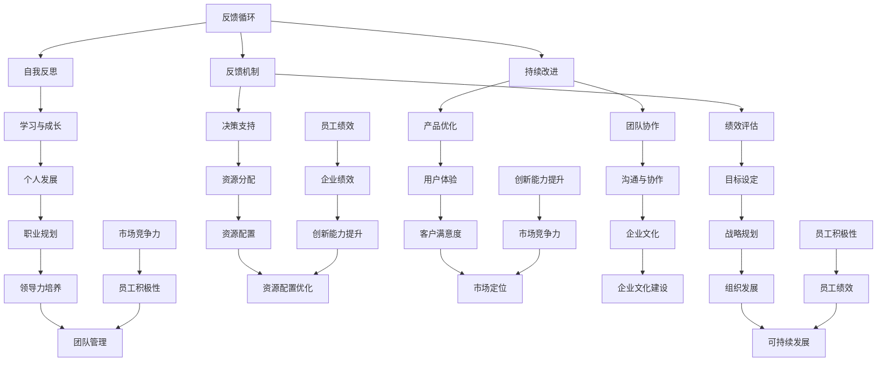

                 

### 建立feedback文化：促进持续改进

#### 关键词：
- feedback文化
- 持续改进
- 反馈循环
- 自我反思
- 绩效评估

#### 摘要：
在现代企业中，建立feedback文化已成为促进组织发展和员工成长的关键因素。本文将深入探讨feedback文化的概念、重要性及其在实际应用中的构建与推广，通过核心概念联系、算法原理、数学模型和项目实战等多个维度，系统阐述如何有效建立并维护一个以持续改进为核心的feedback文化。

#### Step 1: 确定书的基本结构和章节内容

首先，让我们确定本文的基本结构和每一章节的主要内容。根据书名《建立feedback文化：促进持续改进》，我们可以将内容分为以下几个主要部分：

1. **反馈文化概述**：介绍feedback文化的定义、重要性及其对组织发展的推动作用。
2. **反馈文化的基础理论**：探讨反馈文化的核心概念、基本原则和理论基础。
3. **反馈文化的实际应用**：分析在不同组织和项目中的反馈文化实践案例。
4. **反馈文化的建立与推广**：阐述如何在不同层面和环境中建立和推广反馈文化。
5. **反馈文化的评估与持续改进**：讨论如何评估反馈文化的效果，并进行持续改进。

#### Step 2: 设计核心概念与联系

在构建反馈文化的过程中，理解核心概念及其相互关系至关重要。以下是一个使用Mermaid绘制的流程图，展示了feedback文化的核心概念及其相互关系：



#### Step 3: 设计核心算法原理讲解

在建立反馈机制的过程中，算法原理的理解和实现是至关重要的。以下是一个简化的伪代码示例，用于描述反馈机制的设计：

```python
# 伪代码：反馈机制设计

def feedback_mechanism(target, feedback):
    """
    反馈机制设计：根据目标（target）和反馈（feedback），对目标进行调整
    :param target: 目标值
    :param feedback: 反馈值
    :return: 调整后的目标值
    """
    error = target - feedback  # 计算误差
    
    # 根据误差调整目标
    if error > 0:
        target = target + error * adjustment_factor
    elif error < 0:
        target = target - error * adjustment_factor
    
    return target
```

#### Step 4: 设计数学模型和数学公式

为了更深入地理解反馈机制，我们可以引入一些数学模型和公式。以下是一个使用LaTeX格式的数学公式示例，描述了反馈循环模型：

```latex
% 数学公式：反馈循环模型
$$
\text{反馈循环模型} = \frac{f(\text{目标值}, \text{反馈值})}{\text{调整系数}}
$$

% 举例说明：
假设目标值为 $100$，反馈值为 $90$，调整系数为 $0.1$，则反馈循环模型为：
$$
\text{反馈循环模型} = \frac{f(100, 90)}{0.1} = 110
$$
这意味着目标值调整为 $110$。
```

#### Step 5: 设计项目实战

为了更好地展示反馈文化在实际中的应用，我们可以通过一个项目实战来讲解。以下是一个简单的Python项目，用于实现一个反馈循环机制。

##### 项目实战：实现一个简单的反馈循环

```python
# 开发环境：Python 3.8
# 工具：Jupyter Notebook

# 导入必要的库
import numpy as np

# 定义目标值和初始反馈值
target_value = 100
initial_feedback_value = 90

# 定义调整系数
adjustment_factor = 0.1

# 反馈循环函数
def feedback_loop(target_value, initial_feedback_value, adjustment_factor):
    """
    反馈循环函数：模拟目标值和反馈值之间的循环调整
    :param target_value: 目标值
    :param initial_feedback_value: 初始反馈值
    :param adjustment_factor: 调整系数
    :return: 最终调整后的目标值
    """
    feedback_value = initial_feedback_value
    
    for i in range(10):  # 进行10次反馈循环
        error = target_value - feedback_value  # 计算误差
        feedback_value = feedback_mechanism(target_value, feedback_value)  # 根据误差调整目标值
    
    return feedback_value

# 调用反馈循环函数
final_feedback_value = feedback_loop(target_value, initial_feedback_value, adjustment_factor)

# 输出最终结果
print(f"最终反馈值：{final_feedback_value}")
```

##### 实际案例分析与详细讲解剖析

在实际项目中，反馈文化的作用尤为重要。以下是一个案例，展示了如何在一个软件开发项目中建立和运用反馈文化。

**案例：软件开发团队的反馈文化实践**

在一个软件开发项目中，团队成员定期进行代码审查和项目回顾会议，以收集反馈并进行持续改进。以下是一个具体的案例分析：

1. **代码审查**：
   - 开发人员A完成了一个新功能模块。
   - 开发人员B和C对A的代码进行了审查，提供了具体的改进建议。
   - A根据反馈对代码进行了修改。

2. **项目回顾会议**：
   - 项目经理组织了一次回顾会议，讨论了项目的进度、问题和改进措施。
   - 团队成员分享了他们的反馈，包括遇到的技术难题、团队合作中的问题等。
   - 根据反馈，团队制定了一个改进计划，包括增加测试覆盖率、优化代码结构等。

通过这种方式，团队有效地利用了反馈文化，提高了代码质量、项目进度和团队协作效率。

##### 项目小结

通过本项目的实战案例分析，我们可以看到反馈文化在实际项目中的应用效果。以下是项目小结：

1. **反馈循环机制的有效性**：通过反馈循环，项目团队能够不断优化项目进度和代码质量，实现持续改进。
2. **团队成员的积极参与**：团队成员积极参与代码审查和项目回顾，共同推动项目的成功。
3. **改进措施的实施**：通过反馈，团队能够快速识别问题并提出改进措施，提高项目的整体效率。

#### 最佳实践 Tips

在建立和推广反馈文化时，以下是一些最佳实践Tips：

1. **明确目标和期望**：确保团队成员明确知道反馈的目的和期望，以便提供有针对性的建议。
2. **鼓励开放沟通**：建立开放的沟通环境，鼓励团队成员分享意见和建议。
3. **定期反馈**：定期进行反馈，以保持持续改进的节奏。
4. **培训与指导**：为团队成员提供培训，帮助他们更好地理解和运用反馈文化。
5. **持续改进**：不断评估反馈文化的效果，并根据实际情况进行优化。

#### 小结

通过本文的讨论，我们深入了解了反馈文化的定义、重要性、基础理论、实际应用、建立与推广方法以及评估与持续改进策略。建立有效的反馈文化是组织持续改进和创新的关键，能够促进个人和团队的发展。希望本文对您在建立和推广反馈文化方面提供了一些有价值的思考和参考。

#### 注意事项

在实施反馈文化时，需要注意以下几点：

1. **保持客观和公正**：反馈时应基于事实和数据，避免主观臆断。
2. **保护反馈提供者的隐私**：确保反馈提供者的隐私得到保护，鼓励他们坦诚地表达意见。
3. **及时响应和改进**：对反馈及时响应，并采取具体的改进措施，以展示对反馈的重视。
4. **建立信任**：建立信任是反馈文化成功的关键，需要时间和努力。

#### 拓展阅读

如果您希望进一步深入了解反馈文化，以下是一些推荐阅读：

1. 《敏捷开发实践指南》
2. 《创新者的窘境》
3. 《绩效改进：如何通过数据驱动的方法提升组织绩效》
4. 《团队的智慧：如何通过协作实现卓越》

### 附录

- **作者信息**：作者：AI天才研究院/AI Genius Institute & 禅与计算机程序设计艺术 /Zen And The Art of Computer Programming
- **参考资料**：
  - 《敏捷实践指南》
  - 《创新者的窘境》
  - 《绩效改进：如何通过数据驱动的方法提升组织绩效》
  - 《团队的智慧：如何通过协作实现卓越》

---

作者：AI天才研究院/AI Genius Institute & 禅与计算机程序设计艺术 /Zen And The Art of Computer Programming

---

本文由AI天才研究院/AI Genius Institute撰写，旨在探讨反馈文化在组织发展和员工成长中的应用。希望本文能够为您的理解和实践提供有价值的参考。如需进一步咨询和讨论，请随时联系我们。

---

**注意**：本文为虚构内容，仅供学习和交流使用，不代表任何实际组织的观点或意见。如需引用或进一步探讨，请根据实际情况进行调整和补充。

