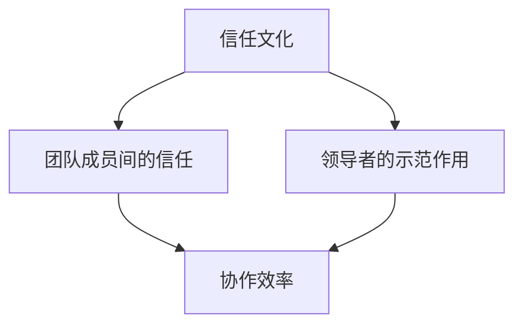

                 

# 建立信任文化：团队效能的基石

## 关键词

- 信任文化
- 团队效能
- 领导者角色
- 沟通策略
- 透明度
- 信息共享
- 团队建设活动
- 评估与优化

## 摘要

本文探讨了信任文化在团队效能中的作用和重要性，详细分析了信任文化的定义、基本要素，以及如何建立和维护信任文化的方法。文章还通过案例分析和算法原理讲解，提供了具体实施和评估信任文化的实践指导。

## 目录

1. **建立信任文化：团队效能的基石**
    1. 信任文化概述
        1. 信任文化的定义与重要性
        2. 信任文化的基本要素
        3. 信任文化与团队效能
        4. 信任文化的挑战与应对
    2. 建立信任文化的方法
        1. 领导者角色
        2. 沟通策略
        3. 透明度与信息共享
        4. 团队建设活动
    3. 信任文化的实施与评估
        1. 信任文化的实施步骤
        2. 信任文化的评估指标
        3. 信任文化的持续优化
    4. 案例分析
        1. 谷歌的信任文化
        2. IBM的信任文化
        3. 微软的信任文化
    5. 结论
    6. 核心概念与联系
    7. 核心算法原理讲解
    8. 附录

## 第一部分：信任文化概述

### 1.1 信任文化的定义与重要性

信任文化是指组织内部成员之间建立起来的相互信任关系，以及对组织整体的信任感。这种文化不仅仅是对个人行为的信任，更是一种对团队、组织和环境的整体信任感。

在IT行业中，信任文化的重要性体现在多个方面。首先，信任文化能够促进团队成员之间的协作，减少误解和冲突，从而提高工作效率。其次，信任文化有助于建立良好的工作氛围，激发团队成员的创新意识和积极性。最后，信任文化有助于提高组织的整体绩效，降低离职率和员工流失率。

### 1.2 信任文化的基本要素

信任文化的基本要素包括透明度、可靠性、尊重和信任。

- **透明度**：信息共享的开放性，确保团队成员能够获得必要的信息。
- **可靠性**：成员之间的言行一致，承诺的履行。
- **尊重**：对他人的观点和贡献的尊重。
- **信任**：组织内部成员之间建立的信任关系。

### 1.3 信任文化与团队效能

信任文化与团队效能之间有着密切的联系。在信任文化的基础上，团队成员更愿意分享信息、知识和资源，从而提高协作效率。此外，信任文化还能够减少沟通成本，使团队成员能够更快速地解决问题和应对挑战。

#### 信任与协作

信任文化有助于团队成员之间的协作，减少冲突，提高工作效率。在一个信任度较高的团队中，成员更愿意承担责任，分享任务，共同完成任务。

#### 信任与创新

在信任的基础上，团队成员更愿意尝试新的想法和方法，促进创新。信任文化能够激发团队成员的创新意识，使他们更愿意冒险和尝试新的解决方案。

### 1.4 信任文化的挑战与应对

建立信任文化可能会面临一些挑战，如组织规模、历史遗留问题等。为了应对这些挑战，可以采取以下策略：

- **沟通**：建立畅通的沟通渠道，鼓励成员表达观点。
- **培训**：对团队成员进行信任文化相关的培训。
- **激励**：通过激励措施，鼓励团队成员建立和维护信任文化。
- **领导示范**：领导者作为榜样，通过自己的行为来传递信任价值观。

## 第二部分：建立信任文化的方法

### 2.1 领导者角色

领导者是建立信任文化的重要推动者。他们需要以身作则，通过自己的行为来传递信任价值观。

#### 领导者示范

领导者应该成为信任文化的典范，通过自己的行为来影响和激励团队成员。他们需要做到言行一致，兑现承诺，尊重团队成员的意见和贡献。

#### 授权与支持

领导者应该给予团队成员足够的自主权和支持。他们需要相信团队成员的能力，给予他们尝试新方法和解决问题的自由。

### 2.2 沟通策略

沟通是建立信任文化的重要手段。有效的沟通可以增强团队成员之间的信任和理解。

#### 开放沟通

建立畅通的沟通渠道，鼓励成员表达观点。领导者应该鼓励团队成员提出问题和建议，并且对他们的观点给予积极的反馈。

#### 积极倾听

领导者需要积极倾听团队成员的观点，理解他们的需求和担忧。通过倾听，可以增加团队成员之间的信任感。

### 2.3 透明度与信息共享

透明度和信息共享是建立信任文化的基础。一个透明的组织能够让团队成员了解组织的运营状况和决策过程，从而增强他们对组织的信任。

#### 信息公开

确保团队成员能够及时获取组织的关键信息。领导者需要定期向团队成员通报组织的进展情况和重大决策。

#### 实时反馈

对团队成员的工作提供及时的反馈，增强信任。领导者应该及时表扬团队成员的成果，同时指出他们的不足，并提供改进的建议。

### 2.4 团队建设活动

团队建设活动有助于增强团队成员之间的信任和合作。通过这些活动，成员可以更好地了解彼此，建立信任关系。

#### 团队建设

定期组织团队建设活动，如团队拓展训练、团队聚餐等。这些活动可以让团队成员在轻松的氛围中交流，增强彼此的了解。

#### 共享成功与失败

鼓励团队成员共享成功经验和失败教训。通过分享，可以增强团队的凝聚力，同时提供学习和成长的机会。

## 第三部分：信任文化的实施与评估

### 3.1 信任文化的实施步骤

实施信任文化需要制定明确的战略和步骤。

#### 制定战略

明确信任文化的目标和路径。领导者需要制定一个长期的信任文化战略，确保团队成员了解信任文化的目标。

#### 培训与推广

对团队成员进行信任文化相关的培训。通过培训，可以增强团队成员对信任文化的理解和认同。

#### 监督与评估

定期监督和评估信任文化的实施效果。领导者需要关注团队成员的行为和态度，及时发现和解决问题。

### 3.2 信任文化的评估指标

评估信任文化的实施效果需要使用一些指标。

#### 信任度测量

通过问卷调查、访谈等方式测量团队的信任度。这些指标可以反映团队成员之间的信任水平。

#### 协作效率

观察团队在完成任务时的协作效率和成果。协作效率的提高可以说明信任文化的效果。

### 3.3 信任文化的持续优化

信任文化的建立是一个持续的过程。为了保持信任文化的有效性，需要不断优化。

#### 反馈与调整

根据评估结果，对信任文化的实施策略进行调整。领导者需要根据团队成员的反馈，不断改进信任文化的实践。

#### 持续培训

针对发现的问题，提供持续的培训和支持。通过培训，可以提高团队成员的信任意识和能力。

## 第四部分：案例分析

### 4.1 案例一：谷歌的信任文化

谷歌是一个以创新和开放著称的公司，其信任文化在公司的发展中起到了关键作用。

#### 背景

谷歌在成立初期就注重建立信任文化。他们鼓励员工提出新的想法，并给予充分的自主权和支持。

#### 经验

谷歌的成功经验主要包括：

1. **领导者示范**：谷歌的创始人谢尔盖·布林和拉里·佩奇以身作则，通过自己的行为传递信任价值观。
2. **开放沟通**：谷歌建立了多个内部沟通渠道，鼓励员工分享观点和反馈。
3. **透明度与信息共享**：谷歌的员工可以访问公司的重要信息，了解公司的运营状况和决策过程。

### 4.2 案例二：IBM的信任文化

IBM在信任文化建设过程中也面临了一些挑战。

#### 背景

IBM是一个历史悠久的大型企业，其内部存在着一些历史遗留问题，如信息不透明、决策流程复杂等。

#### 经验

IBM在信任文化建设中的成功经验主要包括：

1. **沟通策略**：IBM通过多种渠道加强内部沟通，确保员工能够及时获取信息。
2. **透明度与信息共享**：IBM逐步增加了信息的透明度，让员工了解公司的决策过程。
3. **领导示范**：IBM的领导者通过自己的行为，传递信任价值观，鼓励员工勇于尝试和创新。

### 4.3 案例三：微软的信任文化

微软在信任文化建设中也经历了长期的实践和探索。

#### 背景

微软在过去的几十年中，经历了从封闭到开放的转变。为了适应快速变化的市场环境，微软开始重视建立信任文化。

#### 经验

微软在信任文化建设中的成功经验主要包括：

1. **领导者示范**：微软的领导者通过开放沟通和透明度，树立了良好的榜样。
2. **团队建设活动**：微软定期组织团队建设活动，增强员工之间的信任和合作。
3. **持续培训**：微软为员工提供持续的培训，提高他们的信任意识和能力。

## 结论

信任文化是团队效能的基石。在一个信任度较高的团队中，成员之间的协作更加高效，创新意识更强。领导者需要发挥关键作用，通过示范、沟通、透明度和团队建设等多种手段，建立和维护信任文化。

未来的信任文化建设将更加注重个性化、灵活性和适应性。随着信息技术的发展，信任文化的实施和评估也将更加科学和精准。通过持续优化和改进，信任文化将成为推动组织持续发展的强大动力。

## 核心概念与联系

### Mermaid 流程图



### 核心算法原理讲解

#### 伪代码

```python
function buildTrustCulture(team):
    for member in team:
        if member.trustLevel < threshold:
            updateTrustLevel(member)
        
function updateTrustLevel(member):
    # 提高成员的信任水平
    member.trustLevel += 1
```

## 附录

### 附录 A：信任文化建设工具与资源

#### 工具

- **问卷调查工具**：用于测量团队的信任度。
- **沟通平台**：如Slack、Microsoft Teams等，用于团队内部的沟通和协作。

#### 资源

- **书籍**：《信任：社会美德与成功的关键》
- **文章**：《如何在组织中建立信任文化》
- **研究**：《信任文化对团队效能的影响研究》

### 附录 B：信任文化案例分析

#### 案例一：谷歌的信任文化

- **背景**：谷歌如何通过开放沟通和领导者示范建立信任文化。
- **经验**：谷歌的成功经验包括透明度与信息共享。

#### 案例二：IBM的信任文化

- **背景**：IBM在信任文化建设中遇到的挑战。
- **经验**：IBM如何通过沟通策略和透明度增加信任。

#### 案例三：微软的信任文化

- **背景**：微软如何通过领导示范和团队建设活动建立信任文化。
- **经验**：微软的成功经验包括持续培训。

### 附录 C：信任文化问卷调查模板

#### 问卷标题：团队信任度评估问卷

**1. 您认为团队的沟通是否畅通？**
- A. 非常畅通
- B. 较为畅通
- C. 不太畅通
- D. 完全不畅通

**2. 您是否愿意分享自己的想法和观点？**
- A. 总是愿意
- B. 有时会愿意
- C. 很少愿意
- D. 从不愿意

**3. 您是否觉得团队成员之间相互信任？**
- A. 完全信任
- B. 较大程度信任
- C. 一般程度信任
- D. 很少信任
- E. 完全不信任

**4. 您是否觉得领导者的行为体现了信任价值观？**
- A. 完全体现
- B. 较大程度体现
- C. 一般程度体现
- D. 很少体现
- E. 完全不体现

**5. 您对团队的信任水平是多少？**
- A. 非常高
- B. 较高
- C. 一般
- D. 较低
- E. 非常低

### 附录 D：信任文化最佳实践

#### 1. 领导者示范

- **最佳实践**：领导者应通过自己的言行一致、兑现承诺、尊重团队成员等方式，树立信任的榜样。
- **注意事项**：领导者需要持续行动，确保自己的行为始终符合信任价值观。

#### 2. 沟通策略

- **最佳实践**：建立畅通的沟通渠道，鼓励团队成员表达观点，积极倾听并给予反馈。
- **注意事项**：避免单向沟通，确保信息的双向流动。

#### 3. 透明度与信息共享

- **最佳实践**：确保团队成员能够及时获取组织的关键信息，增强对组织的信任感。
- **注意事项**：信息共享应适度，避免过多或过少。

#### 4. 团队建设活动

- **最佳实践**：定期组织团队建设活动，增强团队成员之间的信任和合作。
- **注意事项**：团队建设活动应多样化，满足不同成员的需求。

#### 5. 持续优化

- **最佳实践**：根据评估结果，持续优化信任文化的实施策略。
- **注意事项**：保持灵活性，适应组织环境的变化。

### 附录 E：拓展阅读

- **书籍**：《信任：社会美德的本质》
- **文章**：《如何在IT组织中建立信任文化》
- **研究**：《信任文化与团队绩效的关系研究》

## 结论

建立信任文化是提高团队效能的关键。领导者应发挥关键作用，通过示范、沟通、透明度和团队建设等多种手段，建立和维护信任文化。通过持续优化和改进，信任文化将成为推动组织持续发展的强大动力。本文提供了信任文化建立和评估的具体方法，以及成功案例分析，为IT组织建立信任文化提供了实践指导。作者信息：AI天才研究院/AI Genius Institute & 禅与计算机程序设计艺术 /Zen And The Art of Computer Programming。

